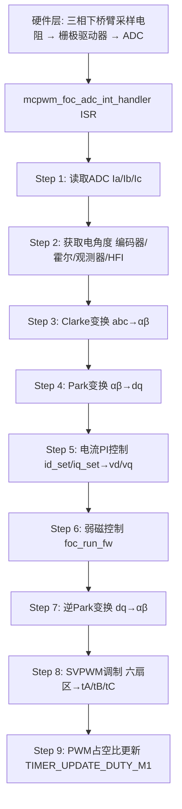

# ⭐ VC-02: VESC FOC 核心算法链

---

| 属性 | 值 |
|------|-----|
| 文档编号 | VC-02 |
| 标题 | VESC FOC 核心算法链 |
| 版本 | 1.0 |
| 作者 | 嵌入式系统架构师 |
| 创建日期 | 2026-05-26 |
| 适用平台 | STM32F405RG, VESC FOC 模式 |
| 固件版本 | FW 7.00 |
| 前置知识 | 矢量控制/FOC原理、Clarke/Park变换、PI控制器、SVPWM |

---

## 目录 (TOC)

1. [概述](#1-概述)
2. [FOC 算法链总览](#2-foc-算法链总览)
3. [ADC 电流采样](#3-adc-电流采样)
4. [Clarke 变换](#4-clarke-变换)
5. [Park 变换](#5-park-变换)
6. [电流 PI 控制器](#6-电流-pi-控制器)
7. [解耦控制](#7-解耦控制)
8. [逆 Park 变换](#8-逆-park-变换)
9. [空间矢量调制 (SVM)](#9-空间矢量调制-svm)
10. [PWM 输出与定时器](#10-pwm-输出与定时器)
11. [控制环时序与分频](#11-控制环时序与分频)
12. [弱磁控制 (Field Weakening)](#12-弱磁控制-field-weakening)
13. [MTPA 控制](#13-mtpa-控制)
14. [过调制](#14-过调制)
15. [音频调制](#15-音频调制)
16. [参数调优指南](#16-参数调优指南)
17. [文件索引](#17-文件索引)

---

## 1. 概述

VESC 的 FOC（Field Oriented Control，磁场定向控制）核心算法链运行在硬件中断上下文中，通过 ADC 注入转换触发，实现对 PMSM/BLDC 电机的高性能矢量控制。整个算法链从电流采样到 PWM 占空比更新，在一个 ADC 注入组转换完成的 ISR 中完成。

### 1.1 核心文件

| 文件 | 功能 |
|------|------|
| [mcpwm_foc.c](file:///e:/gitee_CodeStorage/学习/MotorControl-main/vesc_core/mcpwm_foc.c) | FOC ISR 入口, 控制流调度, PWM 更新 |
| [foc_math.c](file:///e:/gitee_CodeStorage/学习/MotorControl-main/vesc_core/foc_math.c) | 观测器, PLL, SVM, PID, 弱磁, HFI |
| [foc_math.h](file:///e:/gitee_CodeStorage/学习/MotorControl-main/vesc_core/foc_math.h) | 状态结构体, 函数声明 |
| [hwconf/hw.h](file:///e:/gitee_CodeStorage/学习/MotorControl-main/vesc_core/hwconf/hw.h) | 电流 ADC 宏, 电压校准宏 |
| [conf_general.h](file:///e:/gitee_CodeStorage/学习/MotorControl-main/vesc_core/conf_general.h) | FAC_CURRENT 校准因子, 死区时间计算 |

---

## 2. FOC 算法链总览

### 2.1 完整数据流



### 2.2 ISR 调用链

```
TIM1 中心对齐 PWM
       │
       ├─→ UP:    ADC Injected Start (采样触发)
       │
       ├─→ DOWN:  TIM1_UP_IRQHandler → mcpwm_foc_tim_sample_int_handler
       │              │
       │              └─→ 设置采样模式标志, 触发 ADC 注入组
       │
       └─→ ADC JEOC:  ADC_IRQHandler → mcpwm_foc_adc_int_handler
                       │
                       ├─ 读取 Ia, Ib, Ic
                       ├─ FOC 算法链 (Step 2~8)
                       └─ PWM 占空比更新 (Step 9)
```

---

## 3. ADC 电流采样

### 3.1 采样架构

VESC 通过注入组 (Injected Group) ADC 实现与 PWM 同步的电流采样：

```
ADC1 注入通道1: 电流 I_a
ADC2 注入通道1: 电流 I_b
ADC3 注入通道1: 电流 I_c (3-shunt 模式)
ADC1 注入通道2: 电流 I_c (dual motor M2)
ADC2 注入通道2: 电流 I_b (dual motor M2)
```

### 3.2 电流校准

```c
// conf_general.h
#define FAC_CURRENT      ((V_REG / 4095.0) / (CURRENT_SHUNT_RES * CURRENT_AMP_GAIN))
#define FAC_CURRENT1     (FAC_CURRENT * CURRENT_CAL1)    // 通道1校准
#define FAC_CURRENT2     (FAC_CURRENT * CURRENT_CAL2)    // 通道2校准
#define FAC_CURRENT3     (FAC_CURRENT * CURRENT_CAL3)    // 通道3校准
```

其中：
- `V_REG` = 3.3V (ADC 参考电压)
- `CURRENT_SHUNT_RES` = 采样电阻值 (典型 0.0005Ω)
- `CURRENT_AMP_GAIN` = 电流放大器增益 (典型 10~20 V/V)
- `CURRENT_CAL1/2/3` = 各通道微调系数

### 3.3 电流采样模式

| 模式 | 枚举 | 说明 |
|------|------|------|
| `LONGEST_ZERO` | 0 | 选择零矢量最长的半周期采样 |
| `ALL_SENSORS` | 1 | 所有传感器同时采样 |
| `HIGH_CURRENT` | 2 | 大电流模式采样 |
| `BEST_SENSOR` | 3 | 最优传感器选择 (实验性) |

### 3.4 FOC 控制采样模式

| 模式 | 枚举 | 说明 |
|------|------|------|
| `V0` | 0 | 仅在 V0 零矢量时采样 |
| `V0_V7` | 1 | 在 V0 和 V7 时均采样 (双采样平均) |
| `V0_V7_INTERPOL` | 2 | V0/V7 双采样 + 线性插值 |

### 3.5 三电阻采样下的 Ic 计算

```c
// 双电阻采样: Ic = -Ia - Ib
// 三电阻采样 (HW_HAS_3_SHUNTS): Ic = GET_CURRENT3()
float ic = -(i_a + i_b); // 双电阻模式
```

---

## 4. Clarke 变换

### 4.1 数学原理

Clarke 变换将三相定子电流 (ia, ib, ic) 变换到两相静止坐标系 (iα, iβ)：

**等幅值变换 (VESC 采用)**:
```
iα = ia
iβ = (ia + 2·ib) / √3
```

### 4.2 代码实现

```c
// mcpwm_foc.c ADC ISR 中
float i_alpha = i_a;
float i_beta = (i_a + 2.0f * i_b) / 1.73205080757f; // √3 ≈ 1.73205

motor->m_motor_state.i_alpha = i_alpha;
motor->m_motor_state.i_beta = i_beta;
```

### 4.3 电流滤波器

```c
// 位于 mcpwm_foc.c
float foc_current_filter_const = conf_now->foc_current_filter_const;
// 一阶低通滤波器: y[n] = y[n-1] + fc × (x[n] - y[n-1])
UTILS_LP_FAST(motor->m_motor_state.id_filter, id, foc_current_filter_const);
UTILS_LP_FAST(motor->m_motor_state.iq_filter, iq, foc_current_filter_const);
```

---

## 5. Park 变换

### 5.1 数学原理

Park 变换将两相静止坐标系 (α,β) 变换到旋转坐标系 (d,q)：

```
id =  cos(θ) × iα + sin(θ) × iβ
iq = -sin(θ) × iα + cos(θ) × iβ
```

### 5.2 代码实现

```c
// mcpwm_foc.c ADC ISR 中
float c = motor->m_motor_state.phase_cos; // cos(θ)
float s = motor->m_motor_state.phase_sin; // sin(θ)

float id = c * i_alpha + s * i_beta;
float iq = c * i_beta - s * i_alpha;

motor->m_motor_state.id = id;
motor->m_motor_state.iq = iq;
```

---

## 6. 电流 PI 控制器

### 6.1 控制结构

VESC 采用带积分分离和输出限幅的 PI 控制器：

```
                  ┌─────────────────────────────────┐
  id_set ────┬───▶│  e_d = id_set - id              │
             │    │                                  │
             │    │  vd_int += Ki × e_d × dt        │
             │    │  vd_int = clamp(vd_int, ±limit)  │
             │    │  vd = Kp × e_d + vd_int          │
             │    │  vd = clamp(vd, ±v_bus)          │
             │    │                                  │
             │    └──────────────┬──────────────────┘
             │                   │ vd
             │                   ▼
  iq_set ────┼─────────────▶ 同 d 轴结构
             │                   │ vq
             │                   ▼
             │              逆 Park → SVPWM
             │
             └─── 反馈电流 id/iq ← Park 变换
```

### 6.2 数学公式

**d 轴电压**:
```
vd[k] = vd[k-1] + Kp × (id_set[k] - id[k] - id_set[k-1] + id[k-1]) + Ki × dt × (id_set[k] - id[k])
```

**q 轴电压**:
```
vq[k] = vq[k-1] + Kp × (iq_set[k] - iq[k] - iq_set[k-1] + iq[k-1]) + Ki × dt × (iq_set[k] - iq[k])
```

### 6.3 代码实现 (control_current)

```c
// 位于 mcpwm_foc.c
static void control_current(motor_all_state_t *motor, float dt) {
    float id = motor->m_motor_state.id;
    float iq = motor->m_motor_state.iq;
    float id_set = motor->m_id_set;
    float iq_set = motor->m_iq_set;

    // 电流限幅
    float curr_lim = motor->m_conf->lo_current_max;
    utils_truncate_number(&id_set, -curr_lim, curr_lim);
    utils_truncate_number(&iq_set, -curr_lim, curr_lim);

    // 最大电压限幅
    float mod_d_max = motor->m_motor_state.mod_d;
    float mod_q_max = motor->m_motor_state.mod_q;

    // d 轴 PI 控制
    float id_err = id_set - id;
    motor->m_motor_state.vd_int += motor->m_conf->foc_current_ki * id_err * dt;
    utils_truncate_number(&motor->m_motor_state.vd_int, -mod_d_max, mod_d_max);

    float vd = motor->m_conf->foc_current_kp * id_err + motor->m_motor_state.vd_int;

    // q 轴 PI 控制
    float iq_err = iq_set - iq;
    motor->m_motor_state.vq_int += motor->m_conf->foc_current_ki * iq_err * dt;
    utils_truncate_number(&motor->m_motor_state.vq_int, -mod_q_max, mod_q_max);

    float vq = motor->m_conf->foc_current_kp * iq_err + motor->m_motor_state.vq_int;

    // 电压限幅 (考虑调制指数)
    float mod = sqrtf(vd * vd + vq * vq);
    if (mod > motor->m_motor_state.max_duty) {
        float scale = motor->m_motor_state.max_duty / mod;
        vd *= scale;
        vq *= scale;
    }

    motor->m_motor_state.vd = vd;
    motor->m_motor_state.vq = vq;
}
```

### 6.4 PI 参数整定

**电流环带宽设计**:
```
Kp = L × ω_c              (ω_c: 期望带宽, rad/s)
Ki = R × ω_c

对于典型 FOC:
f_zv = 30kHz → dt = 33.3μs
ω_c = 2π × 1000 Hz = 6283 rad/s (电流环带宽 1kHz)
Kp = L × 6283
Ki = R × 6283
```

### 6.5 温度补偿

```c
// 位于 mcpwm_foc.c
// 随温度升高, 铜线电阻增大, 需要相应调整 Ki
float temp_now = motor->m_temp_motor;
float R_ref = conf_now->foc_motor_r;
float temp_ref = conf_now->foc_temp_comp_base_temp;

// 铜线电阻温度系数: ~0.00393 /°C
motor->m_res_temp_comp = R_ref * (1.0 + 0.00393 * (temp_now - temp_ref));
motor->m_current_ki_temp_comp = conf_now->foc_current_ki *
    (motor->m_res_temp_comp / R_ref);
```

---

## 7. 解耦控制

### 7.1 解耦模式

| 模式 | 枚举值 | 说明 |
|------|--------|------|
| `DISABLED` | 0 | 不解耦, 纯 PI 控制 |
| `CROSS` | 1 | 交叉解耦: vd -= ω×Lq×iq, vq += ω×Ld×id |
| `BEMF` | 2 | 反电动势补偿: vq += ω×λ |
| `CROSS_BEMF` | 3 | 全解耦: 交叉 + BEMF |

### 7.2 数学原理

**CROSS 交叉解耦**:
```
vd_decoupled = vd - ω × Lq × iq
vq_decoupled = vq + ω × Ld × id
```

**BEMF 补偿**:
```
vq_decoupled = vq + ω × λ
```

**CROSS_BEMF 全解耦**:
```
vd = vd_PI - ω × Lq × iq
vq = vq_PI + ω × Ld × id + ω × λ
```

---

## 8. 逆 Park 变换

### 8.1 数学原理

```
vα = cos(θ) × vd - sin(θ) × vq
vβ = sin(θ) × vd + cos(θ) × vq
```

### 8.2 代码实现

```c
// mcpwm_foc.c
float mod_alpha = c * vd - s * vq;
float mod_beta  = s * vd + c * vq;

// 电压归一化 (映射到 SVM 输入范围)
update_valpha_vbeta(motor, mod_alpha, mod_beta,
    motor->p_duty_norm * motor->m_motor_state.v_bus);
```

---

## 9. 空间矢量调制 (SVM)

### 9.1 六扇区法原理

```
                          ┌─ V3(010) ──── V2(110) ─┐
                          │          扇区3          │
                          │   扇区2  ▲     ▲  扇区4 │
                          │         /│ I   │\       │
                          │        / │     │ \      │
                          │    V4 /  │     │  \ V1  │
                          │  (011)  │     │  (100) │
                          │         │  V0 │        │
                          │         │ V7  │        │
                          │   扇区1 │     │ 扇区5  │
                          │         ▼     ▼        │
                          └─ V5(001) ──── V6(101) ─┘
```

SVM 通过合成相邻两个基本矢量和零矢量来产生任意方向和大小的电压矢量：
```
V_ref = (T1/Ts)×V_k + (T2/Ts)×V_{k+1} + (T0/Ts)×V0/V7
```

### 9.2 SVM 实现

```c
// 位于 foc_math.c
// 函数原型
void foc_svm(float alpha, float beta, float max_mod,
    uint32_t PWMFullDutyCycle,
    uint32_t* tAout, uint32_t* tBout, uint32_t* tCout,
    uint32_t *svm_sector);
```

**SVM 计算步骤**:

1. 计算 αβ 电压幅值和角度
2. 确定扇区 (1~6)
3. 根据扇区计算相邻矢量作用时间 T1, T2
4. 计算零矢量作用时间 T0 = Ts - T1 - T2
5. 将 T1/T2/T0 映射到三相占空比 tA, tB, tC
6. 中心对齐七段式: V0 → Vk → V_{k+1} → V7 → V_{k+1} → Vk → V0

### 9.3 占空比边界

```c
// 最大调制比: sqrt(3)/2 ≈ 0.866 (线性调制区)
// 超过此值进入过调制 (可通过 foc_overmod_factor 扩展)
float max_mod = motor->m_conf->foc_overmod_factor;
```

### 9.4 SVM 扇区记录

```c
// motor_state_t 中记录当前扇区, 用于调试和电流采样模式选择
motor->m_motor_state.svm_sector = sector;
```

---

## 10. PWM 输出与定时器

### 10.1 定时器配置

```c
// 位于 mcpwm_foc.c
TIM_TimeBaseStructure.TIM_Prescaler = 0;
TIM_TimeBaseStructure.TIM_CounterMode = TIM_CounterMode_CenterAligned1;
// 中心对齐模式: ARR = f_clk / (2 × f_pwm)
TIM_TimeBaseStructure.TIM_Period = (SYSTEM_CORE_CLOCK / f_zv);

// Example: f_zv = 30kHz → ARR = 168000000 / 30000 = 5600
```

### 10.2 占空比更新宏

```c
// mcpwm_foc.c, 电机1
#define TIMER_UPDATE_DUTY_M1(duty1, duty2, duty3) \
    TIM1->CR1 |= TIM_CR1_UDIS;  \
    TIM1->CCR1 = duty1;         \
    TIM1->CCR2 = duty2;         \
    TIM1->CCR3 = duty3;         \
    TIM1->CR1 &= ~TIM_CR1_UDIS;

// 电机2 (TIM8)
#define TIMER_UPDATE_DUTY_M2(duty1, duty2, duty3) \
    TIM8->CR1 |= TIM_CR1_UDIS;  \
    TIM8->CCR1 = duty1;         \
    TIM8->CCR2 = duty2;         \
    TIM8->CCR3 = duty3;         \
    TIM8->CR1 &= ~TIM_CR1_UDIS;
```

使用 `TIM_CR1_UDIS` (Update Disable) 确保三个 CCR 寄存器在同一个更新事件中生效，避免中间状态的 PWM 波形畸变。

### 10.3 死区时间

```c
// conf_general.c
uint8_t conf_general_calculate_deadtime(float deadtime_ns, float core_clock_freq) {
    // TIM_BDTRInitStructure.TIM_DeadTime = deadtime_ns × core_clock_freq / 1e9 / 2
    // HW_DEAD_TIME_NSEC = 360.0 ns (默认)
    return (uint8_t)(deadtime_ns * core_clock_freq / 1e9 / 2.0f);
}
```

### 10.4 PWM 频率动态切换

```c
// mcpwm_foc.c - timer_reinit(f_zv)
static void timer_reinit(int f_zv) {
    TIM_DeInit(TIM1);
    TIM_DeInit(TIM8);
    // 重新配置 TIM1/TIM8 的 ARR 寄存器
    TIM_TimeBaseStructure.TIM_Period = (SYSTEM_CORE_CLOCK / f_zv);
    // ...
}
```

---

## 11. 控制环时序与分频

### 11.1 FOC_CONTROL_LOOP_FREQ_DIVIDER

```c
// conf_general.h
#ifndef FOC_CONTROL_LOOP_FREQ_DIVIDER
#define FOC_CONTROL_LOOP_FREQ_DIVIDER   1
#endif

// 当 PWM 频率 > 40kHz 时, FOC 计算 (~25μs) 无法在每个 PWM 周期完成
// 通过分频实现控制环与 PWM 频率解耦:
//
//   PWM 频率 = 100kHz  (每 10μs 触发 ADC ISR)
//   控制频率 = 100kHz / DIVIDER=3  ≈ 33.3kHz
//   → 每 3 次 ISR, 第 3 次执行完整 FOC 算法链
```

### 11.2 FOC 执行时间分析

```c
// conf_general.h - FOC_PROFILE_EN
// 执行时间剖面 (foc_profile):
//   FOC_PROFILE_LINE() 在各关键步骤记录时间戳
//   典型时间分布 (~25μs @ 168MHz):
//     电流读取+校准:        ~2μs
//     角度/速度获取:        ~3μs  (编码器/观测器)
//     Clarke+Park:          ~2μs
//     电流PI:              ~3μs
//     观测器更新:           ~8μs  (Ortega/MXV)
//     PLL:                 ~2μs
//     逆Park+SVPWM:        ~5μs
```

---

## 12. 弱磁控制 (Field Weakening)

### 12.1 原理

当电机反电动势接近母线电压时，通过注入负向 Id 电流来削弱永磁体磁场，等效降低反电动势，扩展速度范围：

```
E = ω × λ
当 E > V_bus / √3 时, 进入弱磁区

注入 Id < 0:
vq = R·iq + ω·Ld·id + ω·λ  ← ω·λ 被 -ω·Ld·|id| 部分抵消
```

### 12.2 参数

| 参数 | 说明 | 典型值 |
|------|------|--------|
| `foc_fw_current_max` | 最大弱磁 Id 电流 | 30~60A |
| `foc_fw_duty_start` | 弱磁起始占空比 | 0.9~0.95 |
| `foc_fw_ramp_time` | 弱磁斜坡时间 | 0.01~0.1s |
| `foc_fw_q_current_factor` | 弱磁时 iq 缩放因子 | 0.5~1.0 |

### 12.3 代码实现

```c
// foc_math.c - foc_run_fw()
void foc_run_fw(motor_all_state_t *motor, float dt) {
    float duty = motor->m_motor_state.duty_now;
    float fw_start = motor->m_conf->foc_fw_duty_start;
    float fw_max = motor->m_conf->foc_fw_current_max;

    if (duty > fw_start) {
        // 线性增大 Id (负值)
        float fw_factor = (duty - fw_start) / (1.0 - fw_start);
        float id_fw = -fw_factor * fw_max;

        // 斜坡限制
        float ramp = fw_max / motor->m_conf->foc_fw_ramp_time * dt;
        // ...

        motor->m_i_fw_set = id_fw;
        motor->m_id_set += id_fw; // 负 Id
    }
}
```

---

## 13. MTPA 控制

### 13.1 MTPA 模式

| 模式 | 枚举值 | 说明 |
|------|--------|------|
| `MTPA_MODE_OFF` | 0 | 关闭 MTPA, id=0 控制 |
| `MTPA_MODE_IQ_TARGET` | 1 | 基于 iq 目标值注入 Id |
| `MTPA_MODE_IQ_MEASURED` | 2 | 基于 iq 测量值注入 Id |

### 13.2 MTPA 原理 (凸极电机)

对于 Ld ≠ Lq 的 IPM 电机, 最佳电流角产生单位电流的最大转矩：

```
id = (λ / (2 × (Lq - Ld))) - sqrt((λ / (2 × (Lq - Ld)))² + iq²)
```

---

## 14. 过调制

### 14.1 控制参数

```c
// datatypes.h
float foc_overmod_factor;    // 过调制因子 (1.0 = 线性, >1.0 = 过调制)
float foc_mag_vd_max;        // d轴最大电压
```

### 14.2 原理

```
线性调制区: 调制比 < 0.866 (六边形内切圆)
过调制区 1: 0.866 < 调制比 < 0.909 (六边形边)
过调制区 2: 0.909 < 调制比 < 1.0  (六步方波)
```

---

## 15. 音频调制

### 15.1 音频模式

```c
// foc_math.h
typedef enum {
    MC_AUDIO_OFF = 0,
    MC_AUDIO_TABLE,      // 查表播放 (正弦波/方波)
    MC_AUDIO_SAMPLED,    // 采样播放 (PCM音频)
} mc_audio_mode;
```

### 15.2 使用方式

- **蜂鸣 (Beep)**：通过 `mcpwm_foc_beep(freq, time, voltage)` 产生单音
- **音调播放**：通过 `mcpwm_foc_play_tone(channel, freq, voltage)` 产生持续音调
- **音频采样**：通过 `mcpwm_foc_play_audio_samples(samples, num_samp, f_samp, voltage)` 播放 PCM 音频

---

## 16. 参数调优指南

### 16.1 电流环 PI 整定

| 步骤 | 操作 |
|------|------|
| 1 | 首先通过 `COMM_DETECT_MOTOR_R_L` 测量电机 R 和 L |
| 2 | 设定期望电流环带宽 ω_c (建议从 500Hz 开始) |
| 3 | `foc_current_kp = L × ω_c` |
| 4 | `foc_current_ki = R × ω_c` |
| 5 | 通过 VESC Tool 实时观察 id/iq 阶跃响应 |
| 6 | 若超调 > 10%, 降低 Kp; 若响应慢, 增大 Kp |
| 7 | 若稳态误差大, 增大 Ki; 若振荡, 降低 Ki |

### 16.2 SVM 频率选择

| 应用 | 推荐 f_zv | 原因 |
|------|----------|------|
| 低电感电机 | 30~40kHz | 减小电流纹波 |
| 高电感电机 | 15~20kHz | 降低开关损耗 |
| 噪音敏感 | >20kHz | 超出人耳范围 |
| 大功率 | 10~15kHz | 降低开关损耗和 EMI |

### 16.3 电流采样模式选择

| 应用 | 推荐模式 |
|------|---------|
| 通用 | `LONGEST_ZERO` |
| 低占空比 | `ALL_SENSORS` |
| 大电流 | `HIGH_CURRENT` |

---

## 17. 相位滤波器

### 17.1 作用

在角度信号输入 Park/逆Park 变换之前，使用相位滤波器平滑角度以避免电流环振荡：

```c
// datatypes.h
bool foc_phase_filter_enable;    // 启用相位滤波
float foc_phase_filter_max_erpm; // 滤波器截止 ERPM

// 滤波器实现:
// 平滑的相位阶跃函数, 防止角度跳变引起的电流尖峰
// 在 foc_phase_filter_max_erpm 以下启用
if (fabsf(speed) < conf->foc_phase_filter_max_erpm) {
    // phase_smooth = phase_smooth + (phase_raw - phase_smooth) * fc
    // fc 取决于当前速度
}
```

### 17.2 故障保护

当滤波器角度与原始角度偏差过大时触发故障：

```c
// datatypes.h
FAULT_CODE_PHASE_FILTER    // 相位滤波器偏差过大
```

---

## 18. foc_precalc_values 预计算

### 18.1 函数说明

位于 [mcpwm_foc.c](file:///e:/gitee_CodeStorage/学习/MotorControl-main/vesc_core/mcpwm_foc.c) 中，在每次配置变更和 PWM 频率切换时调用：

```c
static void foc_precalc_values(motor_all_state_t *motor) {
    mc_configuration *conf = motor->m_conf;

    // 电感预计算 (用于电流PI和观测器)
    motor->p_ld = conf->foc_motor_l;               // d轴电感
    motor->p_lq = conf->foc_motor_l + conf->foc_motor_ld_lq_diff; // q轴电感

    // FOC 频率: f_zv / FOC_CONTROL_LOOP_FREQ_DIVIDER
    motor->p_fs = (float)conf->foc_f_zv /
        (float)FOC_CONTROL_LOOP_FREQ_DIVIDER;

    // 控制周期时间步长
    motor->p_dt = 1.0f / motor->p_fs;

    // 占空比归一化系数 = 1.0 / (2 × v_bus)
    // 用于将 d/q 电压转换为 [-1, 1] 占空比
    motor->p_duty_norm = 1.0f / (2.0f * motor->m_input_voltage_filtered);
}
```

### 18.2 预计算参数汇总

| 参数 | 公式 | 用途 |
|------|------|------|
| `p_ld` | `foc_motor_l` | d轴电感, 电流PI前馈, 解耦 |
| `p_lq` | `foc_motor_l + ld_lq_diff` | q轴电感, 电流PI前馈, 解耦 |
| `p_fs` | `f_zv / DIVIDER` | FOC 控制频率 (Hz) |
| `p_dt` | `1 / p_fs` | 控制周期 (秒) |
| `p_duty_norm` | `1 / (2 × V_bus)` | 电压→占空比转换系数 |

---

## 19. 文件索引

| 文件路径 | 功能说明 |
|---------|---------|
| [mcpwm_foc.c](file:///e:/gitee_CodeStorage/学习/MotorControl-main/vesc_core/mcpwm_foc.c) | FOC ISR 完整实现 (ADC 读取→PWM 更新) |
| [mcpwm_foc.h](file:///e:/gitee_CodeStorage/学习/MotorControl-main/vesc_core/mcpwm_foc.h) | FOC 模块 API 声明 |
| [foc_math.c](file:///e:/gitee_CodeStorage/学习/MotorControl-main/vesc_core/foc_math.c) | 观测器/PLL/SVM/PID/弱磁 实现 |
| [foc_math.h](file:///e:/gitee_CodeStorage/学习/MotorControl-main/vesc_core/foc_math.h) | motor_all_state_t, hfi_state_t, observer_state 定义 |
| [conf_general.h](file:///e:/gitee_CodeStorage/学习/MotorControl-main/vesc_core/conf_general.h) | FAC_CURRENT 校准, 死区时间计算, FOC_PROFILE |
| [hwconf/hw.h](file:///e:/gitee_CodeStorage/学习/MotorControl-main/vesc_core/hwconf/hw.h) | GET_CURRENT1/2/3 宏, TIMER_UPDATE_DUTY 基类宏 |
| [datatypes.h](file:///e:/gitee_CodeStorage/学习/MotorControl-main/vesc_core/datatypes.h) | mc_configuration FOC 参数段 (L451-L525) |
| [utils_math.c](file:///e:/gitee_CodeStorage/学习/MotorControl-main/vesc_core/utils_math.c) | UTILS_LP_FAST, utils_truncate_number, 快速 atan2 |
| [mc_interface.c](file:///e:/gitee_CodeStorage/学习/MotorControl-main/vesc_core/mc_interface.c) | mc_interface_mc_timer_isr (OV/UV, 过流检测) |