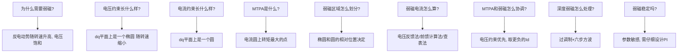
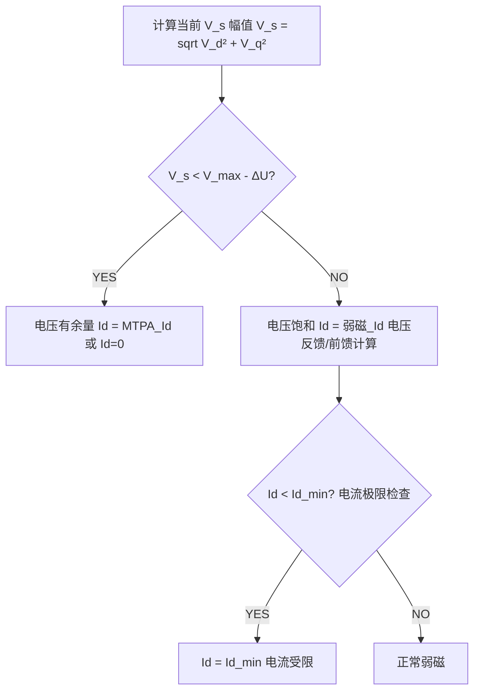
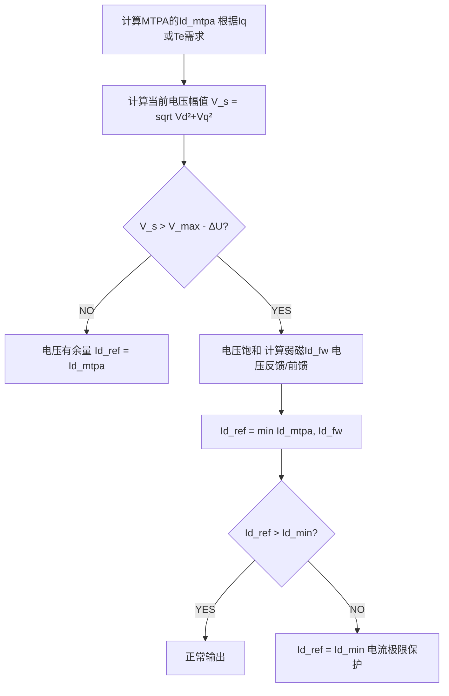
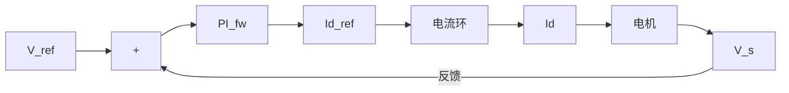

# ADV-ALG-05 弱磁控制与MTPA深度

**模块编号：** ADV-ALG-05
**模块名称：** 弱磁控制与MTPA深度（Field Weakening Control & MTPA Deep Dive）
**文档版本：** v2.0
**适用对象：** 已掌握FOC基本原理、PI控制、带宽设计的嵌入式工程师
**前置知识：** ALG-01 FOC理论基础、ALG-05 有感FOC实现、ALG-13 保护与优化、ADV-ALG-01 控制环带宽设计
**基础概念参考：** [ALG-11 MTPA与弱磁控制](../../algorithm/ALG-11-MTPA-Flux-Weakening.md) — 提供 MTPA 与弱磁的概念概述、转矩方程速查、运行区域划分。建议先阅读 ALG-11 建立整体认知，再深入本文档的数学推导与工程实现。
**难度等级：** ★★★★★

---

## 1. 核心摘要

**一句话：** 弱磁控制是电机突破基速壁垒的"变速箱"——通过注入负d轴电流削弱气隙磁链来降低反电动势，使电机在电压饱和后仍能升速；MTPA是IPMSM的"省油模式"——在相同转矩下最小化定子电流幅值，二者在全速域内必须协调运行。

**认知挂钩：** 把电机想象成一辆汽车：低速时油门（q轴电流）直接决定动力，但到了高速，发动机转速（反电动势）已经到达红线，再踩油门也没用——此时需要换挡（弱磁），降低发动机的有效排量（气隙磁链），让转速继续攀升。而MTPA就像是在每个挡位下找到最省油的油门开度——同样的动力输出，用最少的燃料（电流）。换挡和省油需要协调：不能为了省油而不换挡（MTPA拒绝弱磁），也不能盲目换挡而不考虑油耗（弱磁偏离MTPA）。

**核心问题链：**



**全速域控制轨迹速查：**

| 运行区域 | 转速范围 | Id决策 | Iq决策 | 约束状态 |
|---------|---------|--------|--------|---------|
| 恒转矩区（MTPA） | $0 \sim \omega_{base}$ | MTPA轨迹 | 转矩需求 | 仅电流受限 |
| 弱磁I区 | $\omega_{base} \sim \omega_{c1}$ | 电压约束 | 转矩需求 | 电压受限，电流有余量 |
| 弱磁II区 | $\omega_{c1} \sim \omega_{max}$ | 电压+电流约束 | 电压+电流约束 | 电压和电流同时受限 |
| 深度弱磁（MTPV） | 接近 $\omega_{max}$ | MTPV轨迹 | MTPV轨迹 | 电压极限，电流沿电压椭圆 |

---

## 2. 电压椭圆与电流圆

### 2.1 PMSM稳态电压方程

在dq同步旋转坐标系下，PMSM的稳态电压方程为：

$$
\begin{cases}
V_d = R_s I_d - \omega_e L_q I_q \\
V_q = R_s I_q + \omega_e (L_d I_d + \psi_f)
\end{cases}
$$

其中：
- $R_s$：定子电阻
- $L_d, L_q$：d轴、q轴电感
- $\psi_f$：永磁体磁链
- $\omega_e$：电角速度（rad/s）
- $I_d, I_q$：d轴、q轴电流
- $V_d, V_q$：d轴、q轴电压

### 2.2 电压约束——电压椭圆

逆变器输出电压受到母线电压限制。在SVPWM线性调制区：

$$
\boxed{V_{max} = \frac{V_{dc}}{\sqrt{3}}}
$$

其中：
- $V_{max}$：SVPWM线性调制区最大输出相电压幅值（V）
- $V_{dc}$：直流母线电压（V）

电压幅值约束：

$$
\sqrt{V_d^2 + V_q^2} \leq V_{max}
$$

将稳态电压方程代入（忽略电阻压降 $R_s \approx 0$）：

$$
V_d \approx -\omega_e L_q I_q, \quad V_q \approx \omega_e (L_d I_d + \psi_f)
$$

因此：

$$
(\omega_e L_q I_q)^2 + [\omega_e(L_d I_d + \psi_f)]^2 \leq V_{max}^2
$$

整理为标准椭圆方程：

$$
\boxed{\frac{(I_d + \frac{\psi_f}{L_d})^2}{\left(\frac{V_{max}}{\omega_e L_d}\right)^2} + \frac{I_q^2}{\left(\frac{V_{max}}{\omega_e L_q}\right)^2} \leq 1}
$$

其中：
- $I_d, I_q$：d轴、q轴电流（A）
- $\psi_f$：永磁体磁链（Wb）
- $L_d, L_q$：d轴、q轴电感（H）
- $V_{max}$：最大输出相电压幅值（V）
- $\omega_e$：电角速度（rad/s）
- 椭圆中心位于 $I_d = -\psi_f / L_d$，$I_q = 0$
- d轴半轴长 $a = V_{max} / (\omega_e L_d)$（A），q轴半轴长 $b = V_{max} / (\omega_e L_q)$（A）

**几何含义：**

- 椭圆中心位于 $I_d = -\psi_f / L_d$，$I_q = 0$（即短路电流点）
- d轴半轴长：$a = V_{max} / (\omega_e L_d)$
- q轴半轴长：$b = V_{max} / (\omega_e L_q)$
- **随转速 $\omega_e$ 升高，椭圆等比例缩小**

> **SPMSM特殊情况：** $L_d = L_q = L_s$，电压椭圆退化为**圆**，圆心仍在 $(-\psi_f/L_s, 0)$，半径为 $V_{max}/(\omega_e L_s)$。

### 2.3 电流约束——电流圆

逆变器最大输出电流受器件容量限制：

$$
\boxed{\sqrt{I_d^2 + I_q^2} \leq I_{max}}
$$

其中：
- $I_d, I_q$：d轴、q轴电流（A）
- $I_{max}$：逆变器最大允许输出电流（A）

在 $I_d$-$I_q$ 平面上，这是一个以原点为圆心、$I_{max}$ 为半径的**圆**。

### 2.4 电压椭圆随转速的变化

**关键物理图像：** 随着转速升高，反电动势 $\omega_e \psi_f$ 增大，电压椭圆不断缩小，从"包含电流圆"逐渐收缩到"被电流圆包含"。

```
Iq
↑
│     低速：椭圆包含电流圆        中速：椭圆与电流圆相交
│     ────────                    ────────
│        ╱ ╲                        ╱╲
│      ╱     ╲                    ╱    ╲
│    ╱  ┌───┐  ╲                ╱ ┌──┐  ╲
│   │   │   │   │              ╱  │  │   ╲
│   │   │ O │   │            ╱   │O │    ╲
│    ╲  └───┘  ╱             ╲  └──┘   ╱
│      ╲     ╱                  ╲    ╱
│        ╲ ╱                      ╲╱
│  ──────────────→ Id        ──────────────→ Id
│   -ψf/Ld                    -ψf/Ld
│
│     高速：椭圆被电流圆包含      极高速：椭圆极度缩小
│     ────────                    ────────
│        ┌─────┐                  ┌─────────┐
│        │ ╱╲  │                  │    ·    │
│        │╱  ╲ │                  │  (几乎  │
│        │ O  ╲│                  │   一点) │
│        │╲  ╱ │                  │    ·    │
│        │ ╲╱  │                  │         │
│        └─────┘                  └─────────┘
│  ──────────────→ Id        ──────────────→ Id
```

### 2.5 基速与恒转矩/恒功率区

**基速（Base Speed）** $\omega_{base}$：电压椭圆恰好与电流圆内切时的转速，即不弱磁条件下能达到的最高转速。

在基速处，电压椭圆与电流圆在 $I_d = 0$（SPMSM）或MTPA轨迹（IPMSM）上相切。

**SPMSM基速计算（$I_d = 0$）：**

$$
\omega_{base} = \frac{V_{max}}{\sqrt{(\psi_f)^2 + (L_s I_{max})^2}}
$$

其中：
- $\omega_{base}$：基速对应的电角速度（rad/s）
- $V_{max}$：最大输出相电压幅值（V）
- $\psi_f$：永磁体磁链（Wb）
- $L_s$：相电感（H），SPMSM中 $L_s = L_d = L_q$
- $I_{max}$：最大允许电流（A）

**IPMSM基速计算（沿MTPA轨迹）：** 需要数值求解，因为MTPA轨迹上的 $I_d$ 和 $I_q$ 是耦合的。

简化估算（忽略电阻和 $L_d I_d$ 项）：

$$
\omega_{base} \approx \frac{V_{max}}{\psi_f + L_s I_{max}}
$$

其中 $\omega_{base}$ 为基速电角速度（rad/s），$V_{max}$ 为最大相电压幅值（V），$\psi_f$ 为永磁体磁链（Wb），$L_s$ 为相电感（H），$I_{max}$ 为最大允许电流（A）。

**恒转矩区与恒功率区：**

| 区域 | 转速范围 | 转矩能力 | 功率特性 | 电压状态 |
|------|---------|---------|---------|---------|
| 恒转矩区 | $0 \sim \omega_{base}$ | 额定转矩 | 功率随转速线性增加 | 电压有余量 |
| 恒功率区（弱磁I） | $\omega_{base} \sim \omega_{c1}$ | 转矩随转速反比下降 | 功率近似恒定 | 电压饱和 |
| 恒功率区（弱磁II） | $\omega_{c1} \sim \omega_{max}$ | 转矩急剧下降 | 功率下降 | 电压和电流均饱和 |

> **注意：** "恒功率"是理想情况，实际弱磁II区功率会下降，因为电流圆和电压椭圆的交点限制了可用转矩。

---

## 3. 弱磁区域划分

### 3.1 三个运行区域

根据电压椭圆和电流圆的相对位置，将运行区域划分为三个：

#### 区域1：恒转矩区（$\omega < \omega_{base}$）

电压椭圆完全包含电流圆（或至少包含工作点），电压不是限制因素。

- **SPMSM：** $I_d = 0$，$I_q$ 由转矩需求决定
- **IPMSM：** 沿MTPA轨迹运行，$I_d$ 由MTPA计算

#### 区域2：弱磁I区（$\omega_{base} < \omega < \omega_{c1}$）

电压椭圆缩小到与电流圆相交，但交点处电流幅值小于 $I_{max}$。

- 电压受限，但电流有余量
- 可通过调节 $I_d/I_q$ 分配来满足电压约束
- $I_d$ 由电压约束决定（比MTPA的 $I_d$ 更负）
- $I_q$ 仍由转矩需求决定（只要不超过电流极限）

#### 区域3：弱磁II区（$\omega > \omega_{c1}$）

电压椭圆缩小到完全在电流圆内部，电压和电流**同时**受限。

- 只能沿电压椭圆和电流圆的交点运行
- $I_d$ 和 $I_q$ 都由约束决定，无法独立选择
- 转矩能力急剧下降

**临界转速 $\omega_{c1}$：** 电压椭圆恰好与电流圆内切的转速。超过此转速，工作点必须同时满足电压约束和电流约束，即只能运行在椭圆和圆的交点。

### 3.2 临界转速计算

在 $\omega_{c1}$ 处，电压椭圆与电流圆内切，切点处两个约束同时取等号：

$$
\begin{cases}
I_d^2 + I_q^2 = I_{max}^2 \\
(\omega_e L_q I_q)^2 + [\omega_e(L_d I_d + \psi_f)]^2 = V_{max}^2
\end{cases}
$$

这是一个关于 $\omega_e$、$I_d$、$I_q$ 的方程组，通常需要数值求解。

**SPMSM简化计算：** $L_d = L_q = L_s$，切点在 $I_d$ 轴负方向：

$$
\omega_{c1} = \frac{V_{max}}{|\psi_f - L_s I_{max}|}
$$

其中 $\omega_{c1}$ 为临界转速对应的电角速度（rad/s），$V_{max}$ 为最大相电压幅值（V），$\psi_f$ 为永磁体磁链（Wb），$L_s$ 为相电感（H），$I_{max}$ 为最大允许电流（A）。

> **注意：** 如果 $\psi_f / L_s > I_{max}$（即短路电流超过电流极限），则 $\omega_{c1}$ 有限；如果 $\psi_f / L_s \leq I_{max}$，理论上不存在弱磁II区，电机可以无限弱磁——但这在实际中很少见。

### 3.3 各区域的 $I_d^{ref}$ 计算方法



---

## 4. 弱磁电流计算（重点）

### 4.1 方法一：电压反馈法（最常用）

#### 4.1.1 基本原理

电压反馈法的核心思想：**不直接计算弱磁电流，而是通过电压幅值反馈自动调节 $I_d$**。

当检测到电压幅值超过限制时，增加负 $I_d$（弱磁）；当电压有裕度时，减小负 $I_d$（恢复MTPA）。

#### 4.1.2 算法流程

**Step 1：** 计算当前电压幅值

$$
V_s = \sqrt{V_d^2 + V_q^2}
$$

其中 $V_s$ 为当前电压幅值（V），$V_d$、$V_q$ 为d轴、q轴电压给定值（V），即电流环PI控制器的输出。

**Step 2：** 计算电压误差

$$
e_v = V_{max} - V_s
$$

其中 $e_v$ 为电压误差（V），$V_{max}$ 为电压极限（V），$V_s$ 为当前电压幅值（V）。

**Step 3：** 弱磁PI控制器

$$
I_d^{fw} = K_{p,fw} \cdot e_v + K_{i,fw} \cdot \int e_v \, dt
$$

其中：
- $I_d^{fw}$：弱磁PI控制器输出的d轴电流参考值（A）
- $K_{p,fw}$：弱磁PI比例增益（A/V）
- $K_{i,fw}$：弱磁PI积分增益（A/(V·s)）
- $e_v$：电压误差（V）

**Step 4：** $I_d$ 参考值选择

$$
I_d^{ref} = \min(I_d^{MTPA},\; I_d^{fw})
$$

其中 $I_d^{ref}$ 为最终d轴电流参考值（A），$I_d^{MTPA}$ 为MTPA计算的d轴电流（A），$I_d^{fw}$ 为弱磁PI计算的d轴电流（A），取更负的值（电压约束优先）。

取更负的值（电压约束优先）。

**Step 5：** 限幅

$$
I_d^{ref} = \max(I_d^{ref},\; I_{d,min})
$$

其中 $I_{d,min}$ 是最大允许弱磁电流（受电流极限和退磁约束）。

#### 4.1.3 C代码实现

```c
/**
 * @brief  电压反馈法弱磁控制器
 * @param  fw: 弱磁控制器结构体
 * @param  Vd: d轴电压给定（电流环输出）
 * @param  Vq: q轴电压给定（电流环输出）
 * @param  Id_mtpa: MTPA计算得到的Id参考值
 * @retval Id弱磁参考值
 */
typedef struct {
    float kp;           // 弱磁PI比例增益（通常为负值或输出取反）
    float ki;           // 弱磁PI积分增益
    float integral;     // 积分累积项
    float V_max;        // 电压极限值 V_dc / sqrt(3)
    float V_margin;     // 电压裕度（避免在边界频繁切换）
    float Id_min;       // 最大弱磁电流（负值，如-Imax）
    float V_s;          // 当前电压幅值
    float Id_fw;        // 弱磁Id输出
} fw_ctrl_t;

float field_weakening_voltage_feedback(fw_ctrl_t *fw,
                                        float Vd, float Vq,
                                        float Id_mtpa)
{
    // Step 1: 计算电压幅值
    fw->V_s = sqrtf(Vd * Vd + Vq * Vq);

    // Step 2: 计算电压误差（含裕度）
    float V_ref = fw->V_max - fw->V_margin;
    float error = V_ref - fw->V_s;

    // Step 3: PI控制（注意：error > 0 表示电压有余量，应减小弱磁）
    //         error < 0 表示电压饱和，应增加弱磁
    //         积分项只在电压饱和时累积（条件积分，防过冲）
    if (error < 0.0f) {
        fw->integral += error * fw->ki;
    } else {
        // 电压有余量时，积分项缓慢衰减（避免突变）
        fw->integral *= 0.99f;
    }

    // 积分限幅
    if (fw->integral < fw->Id_min) {
        fw->integral = fw->Id_min;
    }
    if (fw->integral > 0.0f) {
        fw->integral = 0.0f;  // 弱磁积分项不应为正
    }

    fw->Id_fw = fw->kp * error + fw->integral;

    // Step 4: 取MTPA和弱磁中更负的Id
    float Id_ref = (fw->Id_fw < Id_mtpa) ? fw->Id_fw : Id_mtpa;

    // Step 5: 限幅
    if (Id_ref < fw->Id_min) {
        Id_ref = fw->Id_min;
    }

    return Id_ref;
}
```

#### 4.1.4 PI参数设计

弱磁PI控制器的带宽应远低于电流环带宽（通常为电流环带宽的1/5~1/10），避免弱磁与电流环耦合振荡。

**经验参数：**

| 参数 | 推荐值 | 说明 |
|------|--------|------|
| $K_{p,fw}$ | $-0.5 \sim -2.0\;\text{A/V}$ | 负值：电压超限时增加负Id |
| $K_{i,fw}$ | $-50 \sim -200\;\text{A/(V\cdot s)}$ | 负值：积分消除稳态误差 |
| $V_{margin}$ | $5\% \sim 10\%\;V_{max}$ | 电压裕度，避免频繁进出弱磁 |
| $I_{d,min}$ | $-I_{max}$ 或 $-0.8 I_{max}$ | 最大弱磁电流 |

> **关键：** $K_{p,fw}$ 和 $K_{i,fw}$ 的符号取决于PI结构。如果PI输出直接作为 $I_d^{fw}$，则增益应为负值（电压超限→增加负Id）。如果PI输出取反后再作为 $I_d^{fw}$，则增益为正值。

#### 4.1.5 优缺点

| 优点 | 缺点 |
|------|------|
| 实现简单，代码量小 | 响应有延迟（PI调节需要时间） |
| 不依赖电机参数（鲁棒性好） | 弱磁进入/退出有过渡过程 |
| 自动适应母线电压变化 | PI参数需要现场调试 |
| 电压裕度可调，避免频繁切换 | 深度弱磁时响应可能不够快 |

### 4.2 方法二：前馈计算法

#### 4.2.1 基本原理

从电压方程直接计算满足电压约束所需的最小负 $I_d$，无需PI调节，响应更快。

#### 4.2.2 数学推导

稳态电压方程（忽略电阻）：

$$
V_d = -\omega_e L_q I_q, \quad V_q = \omega_e(L_d I_d + \psi_f)
$$

电压约束取等号：

$$
(\omega_e L_q I_q)^2 + [\omega_e(L_d I_d + \psi_f)]^2 = V_{max}^2
$$

解出 $I_d$：

$$
\omega_e^2 L_d^2 \left(I_d + \frac{\psi_f}{L_d}\right)^2 = V_{max}^2 - (\omega_e L_q I_q)^2
$$

$$
\boxed{I_d^{fw} = -\frac{\psi_f}{L_d} + \frac{1}{L_d}\sqrt{\frac{V_{max}^2}{\omega_e^2} - (L_q I_q)^2}}
$$

其中：
- $I_d^{fw}$：前馈法计算的弱磁d轴电流（A）
- $\psi_f$：永磁体磁链（Wb）
- $L_d, L_q$：d轴、q轴电感（H）
- $V_{max}$：最大相电压幅值（V）
- $\omega_e$：电角速度（rad/s）
- $I_q$：q轴电流给定（A）

> **注意：** 如果根号内为负，即 $V_{max}^2 / \omega_e^2 < (L_q I_q)^2$，说明在该转速下即使 $I_d$ 降到最低也无法满足电压约束，必须减小 $I_q$（降低转矩）。

#### 4.2.3 考虑电阻压降的修正

当电阻压降不可忽略（低速大电流）时：

$$
V_d = R_s I_d - \omega_e L_q I_q
$$

$$
V_q = R_s I_q + \omega_e(L_d I_d + \psi_f)
$$

代入电压约束：

$$
(R_s I_d - \omega_e L_q I_q)^2 + [R_s I_q + \omega_e(L_d I_d + \psi_f)]^2 = V_{max}^2
$$

展开后是关于 $I_d$ 的一元二次方程：

$$
AI_d^2 + BI_d + C = 0
$$

其中：

$$
A = R_s^2 + \omega_e^2 L_d^2
$$

$$
B = 2\omega_e L_d(R_s I_q + \omega_e \psi_f) - 2R_s \omega_e L_q I_q
$$

$$
C = (R_s I_q + \omega_e \psi_f)^2 + (\omega_e L_q I_q)^2 - V_{max}^2
$$

其中 $A, B, C$ 为一元二次方程系数，$R_s$ 为定子电阻（Ω），$\omega_e$ 为电角速度（rad/s），$L_d, L_q$ 为d轴、q轴电感（H），$I_q$ 为q轴电流（A），$\psi_f$ 为永磁体磁链（Wb），$V_{max}$ 为最大相电压幅值（V）。

解为：

$$
I_d^{fw} = \frac{-B - \sqrt{B^2 - 4AC}}{2A}
$$

取"-"号是因为我们需要更负的 $I_d$（弱磁方向）。

#### 4.2.4 C代码实现

```c
/**
 * @brief  前馈法弱磁电流计算（忽略电阻）
 * @param  omega_e: 电角速度 (rad/s)
 * @param  Iq: q轴电流给定 (A)
 * @param  V_max: 电压极限 (V)
 * @param  Ld: d轴电感 (H)
 * @param  Lq: q轴电感 (H)
 * @param  psi_f: 永磁体磁链 (Wb)
 * @retval 弱磁Id参考值 (A)
 */
float field_weakening_feedforward(float omega_e, float Iq,
                                   float V_max,
                                   float Ld, float Lq,
                                   float psi_f)
{
    // 避免除零
    if (omega_e < 1.0f) {
        return 0.0f;  // 极低速不需要弱磁
    }

    // 计算根号内的项
    float V_max_over_omega = V_max / omega_e;
    float term = V_max_over_omega * V_max_over_omega - (Lq * Iq) * (Lq * Iq);

    if (term < 0.0f) {
        // 电压约束无法满足，需要减小Iq
        // 返回最大弱磁电流
        return -psi_f / Ld;
    }

    // 计算弱磁Id
    float Id_fw = -psi_f / Ld + sqrtf(term) / Ld;

    return Id_fw;
}

/**
 * @brief  前馈法弱磁电流计算（含电阻压降）
 */
float field_weakening_feedforward_full(float omega_e, float Iq,
                                        float V_max, float Rs,
                                        float Ld, float Lq,
                                        float psi_f)
{
    if (omega_e < 1.0f) {
        return 0.0f;
    }

    float A = Rs * Rs + omega_e * omega_e * Ld * Ld;
    float B = 2.0f * omega_e * Ld * (Rs * Iq + omega_e * psi_f)
            - 2.0f * Rs * omega_e * Lq * Iq;
    float C = (Rs * Iq + omega_e * psi_f) * (Rs * Iq + omega_e * psi_f)
            + (omega_e * Lq * Iq) * (omega_e * Lq * Iq)
            - V_max * V_max;

    float discriminant = B * B - 4.0f * A * C;

    if (discriminant < 0.0f) {
        return -psi_f / Ld;  // 无解，返回最大弱磁
    }

    // 取更负的解
    float Id_fw = (-B - sqrtf(discriminant)) / (2.0f * A);

    return Id_fw;
}
```

#### 4.2.5 优缺点

| 优点 | 缺点 |
|------|------|
| 响应快（无PI延迟） | 严重依赖电机参数精度 |
| 理论上无稳态误差 | $L_d$、$L_q$、$\psi_f$ 随工作点变化 |
| 可预测弱磁电流需求 | 需要准确的转速信息 |
| 适合对动态响应要求高的场合 | 参数偏差可能导致弱磁不足或过度弱磁 |

### 4.3 方法三：查表法

#### 4.3.1 基本原理

预先离线计算不同转速和转矩（或 $I_q$）下的最优 $I_d$ 值，存储为二维查找表（LUT）。运行时根据当前转速和转矩需求查表插值。

#### 4.3.2 查找表结构

```c
/**
 * @brief  弱磁/MTPA二维查找表
 * @note   表的行索引为转速，列索引为Iq（或转矩）
 *         表中存储最优Id值
 */
typedef struct {
    const float *speed_axis;    // 转速断点数组 (rad/s)
    const float *iq_axis;       // Iq断点数组 (A)
    const float *id_table;      // Id查找表 [speed_cnt][iq_cnt]
    uint16_t speed_cnt;         // 转速断点数
    uint16_t iq_cnt;            // Iq断点数
    float Id_min;               // Id下限
} fw_lut_t;

/**
 * @brief  双线性插值查表
 */
float fw_lut_lookup(const fw_lut_t *lut, float speed, float Iq)
{
    // 查找转速区间
    uint16_t si = 0;
    while (si < lut->speed_cnt - 1 && lut->speed_axis[si + 1] < speed) {
        si++;
    }
    uint16_t si_next = (si < lut->speed_cnt - 1) ? si + 1 : si;
    float s_ratio = (speed - lut->speed_axis[si]) /
                    (lut->speed_axis[si_next] - lut->speed_axis[si] + 1e-9f);
    if (s_ratio < 0.0f) s_ratio = 0.0f;
    if (s_ratio > 1.0f) s_ratio = 1.0f;

    // 查找Iq区间
    uint16_t qi = 0;
    while (qi < lut->iq_cnt - 1 && lut->iq_axis[qi + 1] < Iq) {
        qi++;
    }
    uint16_t qi_next = (qi < lut->iq_cnt - 1) ? qi + 1 : qi;
    float q_ratio = (Iq - lut->iq_axis[qi]) /
                    (lut->iq_axis[qi_next] - lut->iq_axis[qi] + 1e-9f);
    if (q_ratio < 0.0f) q_ratio = 0.0f;
    if (q_ratio > 1.0f) q_ratio = 1.0f;

    // 双线性插值
    float v00 = lut->id_table[si * lut->iq_cnt + qi];
    float v01 = lut->id_table[si * lut->iq_cnt + qi_next];
    float v10 = lut->id_table[si_next * lut->iq_cnt + qi];
    float v11 = lut->id_table[si_next * lut->iq_cnt + qi_next];

    float v0 = v00 + q_ratio * (v01 - v00);
    float v1 = v10 + q_ratio * (v11 - v10);

    float Id_ref = v0 + s_ratio * (v1 - v0);

    // 限幅
    if (Id_ref < lut->Id_min) {
        Id_ref = lut->Id_min;
    }

    return Id_ref;
}
```

#### 4.3.3 查找表生成

离线生成查找表的伪代码：

```python
import numpy as np

# 电机参数
Rs = 0.5       # 定子电阻 (Ohm)
Ld = 0.5e-3    # d轴电感 (H)
Lq = 1.2e-3    # q轴电感 (H)
psi_f = 0.0085 # 永磁体磁链 (Wb)
V_dc = 300     # 母线电压 (V)
I_max = 20     # 最大电流 (A)
V_max = V_dc / np.sqrt(3)

# 断点
speed_axis = np.linspace(0, 10000, 50) * 2 * np.pi / 60  # RPM -> rad/s
iq_axis = np.linspace(0, I_max, 20)

# 生成查找表
id_table = np.zeros((len(speed_axis), len(iq_axis)))

for i, omega in enumerate(speed_axis):
    for j, Iq in enumerate(iq_axis):
        # 先计算MTPA的Id
        Id_mtpa = mtpa_calc(Iq, psi_f, Ld, Lq)

        if omega < 1.0:
            id_table[i, j] = Id_mtpa
            continue

        # 计算前馈弱磁Id
        term = (V_max / omega)**2 - (Lq * Iq)**2
        if term >= 0:
            Id_fw = -psi_f / Ld + np.sqrt(term) / Ld
        else:
            Id_fw = -psi_f / Ld  # 最大弱磁

        # 取更负的值
        id_table[i, j] = min(Id_mtpa, Id_fw)

        # 电流极限检查
        Is = np.sqrt(id_table[i, j]**2 + Iq**2)
        if Is > I_max:
            # 需要沿电流圆重新分配Id和Iq
            # 简化处理：限制Id
            id_table[i, j] = -np.sqrt(I_max**2 - Iq**2) if Iq < I_max else -I_max
```

#### 4.3.4 优缺点

| 优点 | 缺点 |
|------|------|
| 运行时计算量极小 | 需要大量标定工作 |
| 无计算延迟 | 占用Flash存储空间 |
| 可包含非线性效应 | 参数变化时表失效 |
| MTPA和弱磁自然衔接 | 表的精度取决于断点密度 |

### 4.4 三种方法对比与选择

| 特性 | 电压反馈法 | 前馈计算法 | 查表法 |
|------|-----------|-----------|--------|
| 响应速度 | 慢（PI调节） | 快（直接计算） | 最快（查表） |
| 参数依赖 | 低 | 高 | 中（表生成时依赖） |
| 实现复杂度 | 低 | 中 | 高（需标定） |
| 鲁棒性 | 好 | 差 | 中 |
| 适应参数变化 | 好（反馈自适应） | 差（需在线辨识） | 差（需重新标定） |
| 适用场景 | 通用工业驱动 | 高性能伺服 | 量产产品（参数固定） |

**工程推荐：**

- **首选电压反馈法**——简单、鲁棒、适应性强
- **电压反馈+前馈混合**——前馈提供初始值，反馈修正误差
- **查表法**用于量产产品——性能最优但开发成本高

---

## 5. MTPA轨迹推导（重点）

### 5.1 IPMSM转矩方程

$$
\boxed{T_e = \frac{3}{2}p\left[\psi_f I_q + (L_d - L_q) I_d I_q\right]}
$$

其中：
- $T_e$：电磁转矩（N·m）
- $p$：极对数
- $\psi_f$：永磁体磁链（Wb）
- $I_d, I_q$：d轴、q轴电流（A）
- $L_d, L_q$：d轴、q轴电感（H）
- 第一项 $\frac{3}{2}p\psi_f I_q$：永磁转矩（PM Torque）
- 第二项 $\frac{3}{2}p(L_d - L_q) I_d I_q$：磁阻转矩（Reluctance Torque）

> **SPMSM：** $L_d = L_q$，磁阻转矩为零，$T_e = \frac{3}{2}p\psi_f I_q$，$I_q$ 直接决定转矩。
>
> **IPMSM：** $L_d < L_q$，$(L_d - L_q) < 0$。当 $I_d < 0$ 时，$(L_d - L_q) I_d I_q > 0$（$I_q > 0$ 时），磁阻转矩为正，增加了总转矩。这就是MTPA利用负 $I_d$ 的物理本质。

### 5.2 MTPA条件推导

**目标：** 在给定转矩 $T_e$ 下，最小化定子电流幅值 $I_s = \sqrt{I_d^2 + I_q^2}$。

等价表述：在电流圆 $I_d^2 + I_q^2 = I_s^2$ 上，找到转矩最大的点。

**方法：Lagrange乘子法**

构造Lagrange函数：

$$
\mathcal{L}(I_d, I_q, \lambda) = T_e - \lambda(I_d^2 + I_q^2 - I_s^2)
$$

对 $I_d$ 和 $I_q$ 求偏导并令其为零：

$$
\frac{\partial \mathcal{L}}{\partial I_d} = \frac{3}{2}p(L_d - L_q)I_q - 2\lambda I_d = 0
$$

$$
\frac{\partial \mathcal{L}}{\partial I_q} = \frac{3}{2}p[\psi_f + (L_d - L_q)I_d] - 2\lambda I_q = 0
$$

消去 $\lambda$：

$$
\frac{(L_d - L_q)I_q}{I_d} = \frac{\psi_f + (L_d - L_q)I_d}{I_q}
$$

整理得MTPA条件：

$$
\boxed{I_d^2 - I_q^2 + \frac{\psi_f}{L_d - L_q}I_d = 0}
$$

其中 $I_d, I_q$ 为d轴、q轴电流（A），$\psi_f$ 为永磁体磁链（Wb），$L_d, L_q$ 为d轴、q轴电感（H）。

或等价地：

$$
\boxed{2(L_d - L_q)I_d^2 + \psi_f I_d - (L_d - L_q)I_s^2 = 0}
$$

其中 $I_d$ 为d轴电流（A），$I_s$ 为定子电流幅值（A），$\psi_f$ 为永磁体磁链（Wb），$L_d, L_q$ 为d轴、q轴电感（H）。

### 5.3 MTPA轨迹显式表达式

从MTPA条件和电流圆约束 $I_d^2 + I_q^2 = I_s^2$，可以解出 $I_d$ 关于 $I_q$ 的表达式：

$$
\boxed{I_d^{MTPA} = \frac{-\psi_f + \sqrt{\psi_f^2 + 4(L_d - L_q)^2 I_q^2}}{2(L_d - L_q)}}
$$

其中：
- $I_d^{MTPA}$：MTPA轨迹上的d轴电流（A）
- $\psi_f$：永磁体磁链（Wb）
- $L_d, L_q$：d轴、q轴电感（H），IPMSM中 $L_d < L_q$
- $I_q$：q轴电流（A）

> **注意：** 因为 $L_d < L_q$，所以 $L_d - L_q < 0$，$\psi_f / [2(L_d - L_q)] < 0$。因此 $I_d^{MTPA}$ 始终为负值，即MTPA要求负d轴电流。

**另一种形式（关于 $I_s$）：**

$$
I_d^{MTPA} = \frac{-\psi_f + \sqrt{\psi_f^2 + 8(L_q - L_d)^2 I_s^2}}{4(L_d - L_q)}
$$

$$
I_q^{MTPA} = \sqrt{I_s^2 - (I_d^{MTPA})^2}
$$

其中 $I_s$ 为定子电流幅值（A），$I_d^{MTPA}$ 为MTPA轨迹上的d轴电流（A），$I_q^{MTPA}$ 为MTPA轨迹上的q轴电流（A），$\psi_f$ 为永磁体磁链（Wb），$L_d, L_q$ 为d轴、q轴电感（H）。

### 5.4 SPMSM的MTPA

对于SPMSM，$L_d = L_q$，代入MTPA条件：

$$
2(L_d - L_q)I_d^2 + \psi_f I_d - (L_d - L_q)I_s^2 = 0
$$

$$
\psi_f I_d = 0 \implies I_d = 0
$$

**结论：SPMSM的MTPA轨迹就是 $I_d = 0$。** 这是因为SPMSM没有磁阻转矩，负 $I_d$ 只会减小d轴磁链（弱磁效果），不会增加转矩，反而浪费电流。

### 5.5 MTPA轨迹的几何表示

在 $I_d$-$I_q$ 平面上，MTPA轨迹是一条从原点出发、向左下方弯曲的曲线：

```
Iq
↑
│ Iq_max ─ ─ ─ ─ ─ ─ ─ ─ ─ ─ ─ ─ ●
│                                ╱ │
│                            ╱     │
│                        ╱         │ 电流圆
│                    ╱             │
│                ● MTPA轨迹       │
│            ╱ ╱                   │
│        ╱ ╱                       │
│    ╱ ╱                           │
│ ╱ ╱                              │
╱╱                                  │
┼───────────────────────────────────┼──→ Id
│  0                          -Id_max
│
│  MTPA轨迹在Id<0区域
│  与电流圆的交点 = 该电流幅值下最大转矩点
```

### 5.6 MTPA在线计算C代码

```c
/**
 * @brief  MTPA轨迹在线计算（给定Iq求Id）
 * @param  Iq: q轴电流给定 (A)
 * @param  psi_f: 永磁体磁链 (Wb)
 * @param  Ld: d轴电感 (H)
 * @param  Lq: q轴电感 (H)
 * @retval MTPA轨迹上的Id (A)
 */
float mtpa_calc_Id(float Iq, float psi_f, float Ld, float Lq)
{
    float Ldiff = Ld - Lq;  // 通常为负值（IPMSM）

    if (fabsf(Ldiff) < 1e-9f) {
        // SPMSM: Ld ≈ Lq, MTPA就是Id=0
        return 0.0f;
    }

    float discriminant = psi_f * psi_f + 4.0f * Ldiff * Ldiff * Iq * Iq;
    return (-psi_f + sqrtf(discriminant)) / (2.0f * Ldiff);
}

/**
 * @brief  MTPA轨迹在线计算（给定Is求Id和Iq）
 * @param  Is: 定子电流幅值 (A)
 * @param  psi_f: 永磁体磁链 (Wb)
 * @param  Ld: d轴电感 (H)
 * @param  Lq: q轴电感 (H)
 * @param [out] pId: MTPA的Id
 * @param  [out] pIq: MTPA的Iq
 */
void mtpa_calc_IdIq(float Is, float psi_f, float Ld, float Lq,
                     float *pId, float *pIq)
{
    float Ldiff = Ld - Lq;

    if (fabsf(Ldiff) < 1e-9f) {
        *pId = 0.0f;
        *pIq = Is;
        return;
    }

    // Id = (-psi_f + sqrt(psi_f^2 + 8*(Lq-Ld)^2 * Is^2)) / (4*(Ld-Lq))
    float Ldiff_abs = Lq - Ld;
    float discriminant = psi_f * psi_f + 8.0f * Ldiff_abs * Ldiff_abs * Is * Is;
    float Id = (-psi_f + sqrtf(discriminant)) / (4.0f * Ldiff);

    float Iq_sq = Is * Is - Id * Id;
    float Iq = (Iq_sq > 0.0f) ? sqrtf(Iq_sq) : 0.0f;

    *pId = Id;
    *pIq = Iq;
}
```

### 5.7 MTPA计算示例

> **电机参数：** IPMSM
> - $R_s = 0.3\,\Omega$
> - $L_d = 0.5\,\text{mH}$
> - $L_q = 1.2\,\text{mH}$
> - $\psi_f = 0.0085\,\text{Wb}$
> - 极对数 $p = 4$
> - $I_{max} = 20\,\text{A}$

**问题：** 在 $I_q = 15\,\text{A}$ 时，MTPA的 $I_d$ 是多少？与 $I_d = 0$ 相比，转矩提升了多少？

**解：**

$L_{diff} = L_d - L_q = 0.0005 - 0.0012 = -0.0007$

判别式 $\Delta = \psi_f^2 + 4(L_d - L_q)^2 I_q^2 = 0.0085^2 + 4 \times (-0.0007)^2 \times 15^2$

$$
= 7.225 \times 10^{-5} + 4 \times 4.9 \times 10^{-7} \times 225 = 7.225 \times 10^{-5} + 4.41 \times 10^{-4}
$$

$$
= 5.1325 \times 10^{-4}, \quad \sqrt{\Delta} = 0.02266
$$

$$
I_d^{MTPA} = \frac{-0.0085 + 0.02266}{2 \times (-0.0007)} = \frac{0.01416}{-0.0014} = -10.11\;\text{A}
$$

定子电流幅值 $I_s = \sqrt{10.11^2 + 15^2} = \sqrt{102.2 + 225} = \sqrt{327.2} = 18.09\;\text{A} \leq I_{max}$，电流未超限。

**MTPA转矩（$I_q=15\,\text{A}$，$I_d=-10.11\,\text{A}$）：**

$$
T_e^{MTPA} = 1.5 \times 4 \times [0.0085 \times 15 + (0.0005 - 0.0012) \times (-10.11) \times 15]
$$

$$
= 6 \times [0.1275 + 0.1062] = 6 \times 0.2337 = 1.402\;\text{N\cdot m}
$$

**$I_d = 0$ 转矩（相同 $I_s = 18.09\,\text{A}$，则 $I_q = 18.09\,\text{A}$）：**

$$
T_e^{Id=0} = 1.5 \times 4 \times 0.0085 \times 18.09 = 6 \times 0.1538 = 0.923\;\text{N\cdot m}
$$

**转矩提升（同电流幅值对比）：**

$$
\Delta T = \frac{1.402 - 0.923}{0.923} = 51.9\%
$$

**在最大电流 $I_s = I_{max} = 20\,\text{A}$ 下的MTPA工作点：**

判别式 $\Delta_{Is} = \psi_f^2 + 8(L_q - L_d)^2 I_s^2 = 7.225 \times 10^{-5} + 8 \times 0.0007^2 \times 400$

$$
= 7.225 \times 10^{-5} + 1.568 \times 10^{-3} = 1.64025 \times 10^{-3}, \quad \sqrt{\Delta_{Is}} = 0.04050
$$

$$
I_d = \frac{-0.0085 + 0.04050}{4 \times (-0.0007)} = \frac{0.0320}{-0.0028} = -11.43\;\text{A}
$$

$$
I_q = \sqrt{400 - 130.6} = \sqrt{269.4} = 16.41\;\text{A}
$$

$$
T_e^{MTPA, max} = 6 \times [0.0085 \times 16.41 + 0.0007 \times 11.43 \times 16.41] = 6 \times [0.1395 + 0.1313] = 6 \times 0.2708 = 1.625\;\text{N\cdot m}
$$

$$
T_e^{Id=0, max} = 1.5 \times 4 \times 0.0085 \times 20 = 1.02\;\text{N\cdot m}
$$

$$
\Delta T_{max} = \frac{1.625 - 1.02}{1.02} = 59.3\%
$$

> **结论：** 对于该IPMSM，MTPA相比 $I_d = 0$ 控制转矩提升显著（同电流幅值下约52%，最大电流下约59%）。磁阻转矩贡献了约33%的总转矩。

---

## 6. MTPA与弱磁的协调（重点）

### 6.1 协调原则

**核心原则：电压约束优先于效率优化。**

- 电压约束是**硬约束**——违反会导致电流环饱和、控制失效
- MTPA是**软约束**——不满足只是效率降低，不会导致失稳

因此：

$$
\boxed{I_d^{ref} = \min(I_d^{MTPA},\; I_d^{FW})}
$$

其中 $I_d^{ref}$ 为最终d轴电流参考值（A），$I_d^{MTPA}$ 为MTPA计算的d轴电流（A），$I_d^{FW}$ 为弱磁计算的d轴电流（A），取更负的值。

取更负的值。

### 6.2 全速域Id决策流程



### 6.3 电压反馈法实现MTPA+弱磁协调

```c
/**
 * @brief  MTPA + 弱磁协调控制器
 * @note   电压反馈法实现，最常用的工业方案
 */
typedef struct {
    /* MTPA参数 */
    float psi_f;        // 永磁体磁链 (Wb)
    float Ld;           // d轴电感 (H)
    float Lq;           // q轴电感 (H)
    float p;            // 极对数

    /* 弱磁参数 */
    float kp_fw;        // 弱磁PI比例增益
    float ki_fw;        // 弱磁PI积分增益
    float integral_fw;  // 弱磁积分项
    float V_max;        // 电压极限
    float V_margin;     // 电压裕度
    float Id_min;       // 最大弱磁电流（负值）

    /* 输出 */
    float Id_ref;       // 最终Id参考值
    float Id_mtpa;      // MTPA计算的Id
    float Id_fw;        // 弱磁计算的Id
    float V_s;          // 当前电压幅值
} mtpa_fw_ctrl_t;

/**
 * @brief  MTPA+弱磁协调计算
 * @param  ctrl: 控制器结构体
 * @param  Iq_ref: q轴电流给定（来自速度环）
 * @param  Vd: d轴电压给定（电流环输出）
 * @param  Vq: q轴电压给定（电流环输出）
 * @retval Id参考值
 */
float mtpa_fw_coordinate(mtpa_fw_ctrl_t *ctrl,
                          float Iq_ref,
                          float Vd, float Vq)
{
    // ===== Step 1: 计算MTPA的Id =====
    float Ldiff = ctrl->Ld - ctrl->Lq;
    if (fabsf(Ldiff) < 1e-9f) {
        ctrl->Id_mtpa = 0.0f;  // SPMSM
    } else {
        float discriminant = ctrl->psi_f * ctrl->psi_f +
                             4.0f * Ldiff * Ldiff * Iq_ref * Iq_ref;
        ctrl->Id_mtpa = (-ctrl->psi_f + sqrtf(discriminant)) / (2.0f * Ldiff);
    }

    // ===== Step 2: 计算电压幅值 =====
    ctrl->V_s = sqrtf(Vd * Vd + Vq * Vq);

    // ===== Step 3: 弱磁PI控制 =====
    float V_target = ctrl->V_max - ctrl->V_margin;
    float error = V_target - ctrl->V_s;

    // 条件积分：只在电压饱和时积分
    if (error < 0.0f) {
        ctrl->integral_fw += error * ctrl->ki_fw;
    } else {
        // 电压有余量时缓慢衰减
        ctrl->integral_fw *= 0.995f;
    }

    // 积分限幅
    if (ctrl->integral_fw < ctrl->Id_min) {
        ctrl->integral_fw = ctrl->Id_min;
    }
    if (ctrl->integral_fw > 0.0f) {
        ctrl->integral_fw = 0.0f;
    }

    ctrl->Id_fw = ctrl->kp_fw * error + ctrl->integral_fw;

    // ===== Step 4: 协调——取更负的Id =====
    ctrl->Id_ref = (ctrl->Id_fw < ctrl->Id_mtpa) ? ctrl->Id_fw : ctrl->Id_mtpa;

    // ===== Step 5: 限幅 =====
    if (ctrl->Id_ref < ctrl->Id_min) {
        ctrl->Id_ref = ctrl->Id_min;
    }

    return ctrl->Id_ref;
}
```

### 6.4 MTPA到弱磁的平滑过渡

**问题：** MTPA和弱磁之间的切换如果不平滑，会导致 $I_d$ 参考值跳变，引起转矩脉动。

**解决方案：**

1. **电压反馈法天然平滑**——PI控制器的积分特性使 $I_d$ 连续变化
2. **电压裕度 $\Delta U$**——设置5%~10%的裕度，避免在边界频繁切换
3. **积分衰减**——电压有余量时积分项缓慢衰减，而非直接清零
4. **避免硬切换**——不要用if-else在MTPA和弱磁之间跳变

**错误做法：**

```c
// 错误：硬切换导致Id跳变
if (Vs > Vmax) {
    Id_ref = Id_fw;   // 突然切换到弱磁Id
} else {
    Id_ref = Id_mtpa; // 突然切换回MTPA Id
}
```

**正确做法：**

```c
// 正确：连续过渡
Id_ref = min(Id_mtpa, Id_fw);  // 取更负的值，自然过渡
```

### 6.5 MTPV（Maximum Torque Per Voltage）

在深度弱磁区（弱磁II区），电压椭圆极度缩小，工作点沿电压椭圆运行。此时需要优化 $I_d$/$I_q$ 分配，使在给定电压约束下转矩最大——这就是MTPV。

**MTPV条件推导：**

在电压椭圆上，最大化转矩。Lagrange函数：

$$
\mathcal{L} = T_e(I_d, I_q) - \lambda\left[(\omega_e L_q I_q)^2 + \omega_e^2(L_d I_d + \psi_f)^2 - V_{max}^2\right]
$$

对 $I_d$ 和 $I_q$ 求偏导并令为零，得到MTPV轨迹方程：

$$
\boxed{\psi_f I_q - 2(L_q - L_d) I_d I_q - (L_q - L_d) I_d^2 \cdot \frac{L_d}{L_q} = 0}
$$

MTPV轨迹在 $I_d$-$I_q$ 平面上是一条从短路电流点 $(-\psi_f/L_d, 0)$ 出发的曲线。

> **何时使用MTPV？** 只有在深度弱磁区（电压椭圆完全在电流圆内部），且需要最大化转矩输出时才使用。大多数工业应用中，弱磁II区直接沿电压椭圆和电流圆的交点运行即可，不需要MTPV优化。

---

## 7. 深度弱磁

### 7.1 电压利用率极限

SVPWM线性调制区的电压极限：

$$
V_{max,linear} = \frac{V_{dc}}{\sqrt{3}} \approx 0.577 \, V_{dc}
$$

其中 $V_{max,linear}$ 为SVPWM线性调制区最大相电压幅值（V），$V_{dc}$ 为直流母线电压（V）。

六步方波（Six-Step）的电压极限：

$$
V_{max,six-step} = \frac{2}{\pi} V_{dc} \approx 0.637 \, V_{dc}
$$

其中 $V_{max,six-step}$ 为六步方波调制最大相电压基波幅值（V），$V_{dc}$ 为直流母线电压（V）。

电压利用率提升：

$$
\frac{V_{max,six-step}}{V_{max,linear}} = \frac{2\sqrt{3}}{\pi} \approx 1.103
$$

其中 $V_{max,six-step}$ 为六步方波最大电压（V），$V_{max,linear}$ 为线性调制区最大电压（V）。

即六步方波比线性调制区多利用约10.3%的电压，对应转速可提升约10.3%。

### 7.2 过调制策略

从SVPWM线性区到六步方波，需要经过过调制过渡：

| 调制模式 | 调制比范围 | 电压利用率 | 特点 |
|---------|-----------|-----------|------|
| 线性SVPWM | $0 \leq m \leq 1$ | $0 \sim V_{dc}/\sqrt{3}$ | 无畸变 |
| 过调制I区 | $1 < m \leq 1.05$ | $V_{dc}/\sqrt{3} \sim$ 约$0.61 V_{dc}$ | 轻微畸变，轨迹保持连续 |
| 过调制II区 | $1.05 < m \leq 2/\sqrt{3}$ | 约$0.61 V_{dc} \sim 2V_{dc}/\pi$ | 明显畸变，轨迹变为六边形 |
| 六步方波 | $m = 2/\sqrt{3}$ | $2V_{dc}/\pi$ | 最大电压利用，谐波最大 |

### 7.3 过调制实现

```c
/**
 * @brief  过调制处理
 * @param  Valpha, Vbeta: αβ轴电压给定
 * @param  V_dc: 母线电压
 * @retval 过调制后的αβ轴电压
 * @note   实现从线性区到六步方波的平滑过渡
 */
typedef struct {
    float V_linear;     // 线性调制极限 V_dc/sqrt(3)
    float V_sixstep;    // 六步方波极限 2*V_dc/pi
    float m_index;      // 当前调制比
} overmod_t;

void overmod_process(overmod_t *om,
                      float *Valpha, float *Vbeta,
                      float V_dc)
{
    om->V_linear = V_dc / 1.7320508f;
    om->V_sixstep = 2.0f * V_dc / 3.14159265f;

    float Vs = sqrtf((*Valpha) * (*Valpha) + (*Vbeta) * (*Vbeta));

    if (Vs < 1e-9f) {
        om->m_index = 0.0f;
        return;
    }

    om->m_index = Vs / om->V_linear;

    if (om->m_index <= 1.0f) {
        // 线性区，无需处理
        return;
    }

    if (om->m_index >= 1.1547f) {
        // 2/sqrt(3) ≈ 1.1547，六步方波区
        // 输出幅值钳位到六步方波极限
        float scale = om->V_sixstep / Vs;
        *Valpha *= scale;
        *Vbeta *= scale;
        return;
    }

    // 过调制区：介于线性和六步方波之间
    // 简化处理：线性缩放
    // 更精确的方法需要角度补偿和轨迹修正
    float V_target = om->V_linear + (om->V_sixstep - om->V_linear)
                   * (om->m_index - 1.0f) / 0.1547f;
    float scale = V_target / Vs;
    *Valpha *= scale;
    *Vbeta *= scale;
}
```

### 7.4 过调制时的角度补偿

过调制区电压矢量轨迹不再是圆形，而是逐渐趋近六边形。这导致：

1. **基波电压幅值增大**——这正是弱磁需要的
2. **谐波含量增加**——导致电流和转矩脉动
3. **角度误差**——电压矢量角度与给定角度不一致

**角度补偿方法：**

在过调制I区，保持电压矢量角度不变，仅增大幅值。

在过调制II区，电压矢量角度需要向最近的六边形顶点偏移：

```c
/**
 * @brief  过调制II区角度补偿
 * @param  angle: 原始电压矢量角度 (rad)
 * @param  overmod_depth: 过调制深度 0~1
 * @retval 补偿后的角度 (rad)
 */
float overmod_angle_compensation(float angle, float overmod_depth)
{
    // 将角度映射到0~60度扇区
    float sector_angle = fmodf(angle, M_PI / 3.0f);
    if (sector_angle < 0.0f) sector_angle += M_PI / 3.0f;

    // 六边形顶点在30度处
    float deviation = sector_angle - M_PI / 6.0f;

    // 角度补偿：向30度（扇区中心）偏移
    float compensated = angle + deviation * overmod_depth;

    return compensated;
}
```

### 7.5 深度弱磁的稳定性问题

深度弱磁区（高调制比、接近六步方波）面临以下稳定性挑战：

| 问题 | 原因 | 影响 | 对策 |
|------|------|------|------|
| 电流波形畸变 | 过调制谐波 | 转矩脉动增大 | 增大电流环带宽 |
| 参数敏感性增大 | 弱磁Id大，Ld变化 | 弱磁计算不准 | 在线参数辨识 |
| 电流环稳定性下降 | 电压裕度极小 | 电流环易振荡 | 降低电流环带宽 |
| 永磁体退磁风险 | 大负Id | 不可逆退磁 | 限制Id_min |
| d轴电压饱和 | 弱磁深度大 | Id无法跟踪 | 前馈解耦 |

> **安全警告：** 深度弱磁时，$I_d$ 可达额定电流的数倍。必须确认电机永磁体在此电流下不会发生不可逆退磁。查阅电机数据手册中的最大去磁电流 $I_{d,demag}$，确保 $I_{d,min} > I_{d,demag}$。

---

## 8. 弱磁稳定性分析

### 8.1 弱磁回路的小信号模型

弱磁控制引入了一个额外的反馈回路：$I_d$ 变化 → 磁链变化 → 反电动势变化 → 电压变化 → $I_d$ 参考值变化。

**简化小信号模型：**



从 $I_d$ 到 $V_s$ 的传递函数（简化）：

$$
G_{v-id}(s) \approx -\frac{\omega_e^2 L_d}{s + \omega_{cl}}
$$

其中 $G_{v-id}(s)$ 为从 $I_d$ 到 $V_s$ 的传递函数，$\omega_e$ 为电角速度（rad/s），$L_d$ 为d轴电感（H），$\omega_{cl}$ 为电流环闭环带宽（rad/s）。

**物理含义：** 增加 $I_d$（更负）→ 减小d轴磁链 → 减小反电动势 → 减小 $V_s$。增益前的负号表示这是一个**负反馈**回路（稳定）。

### 8.2 弱磁PI参数设计

弱磁回路的开环传递函数：

$$
G_{ol,fw}(s) = K_{p,fw} \cdot \frac{s + K_{i,fw}/K_{p,fw}}{s} \cdot \frac{\omega_e^2 L_d}{s + \omega_{cl}}
$$

**设计原则：**

1. **弱磁回路带宽 << 电流环带宽**（至少5倍分离）
2. **PI零点频率 < 弱磁回路穿越频率**
3. **相角裕度 > 45°**

**推荐参数计算：**

设弱磁回路期望带宽为 $\omega_{fw}$（通常 $\omega_{fw} = \omega_{cl} / 10$）：

$$
K_{p,fw} = \frac{\omega_{fw}}{\omega_e^2 L_d}
$$

$$
K_{i,fw} = K_{p,fw} \cdot \frac{\omega_{fw}}{5}
$$

其中：
- $K_{p,fw}$：弱磁PI比例增益（A/V）
- $K_{i,fw}$：弱磁PI积分增益（A/(V·s)）
- $\omega_{fw}$：弱磁回路期望带宽（rad/s）
- $\omega_e$：电角速度（rad/s）
- $L_d$：d轴电感（H）

> **注意：** $K_{p,fw}$ 与 $\omega_e^2$ 成反比，这意味着在低速时弱磁增益很大，可能导致不稳定。实际中需要限制弱磁PI的输出变化率，或在低速时禁用弱磁。

### 8.3 弱磁与电流环的耦合

**问题：** $I_d$ 的变化不仅影响d轴电压，还通过交叉耦合影响q轴电压：

$$
V_q = R_s I_q + \omega_e(L_d I_d + \psi_f)
$$

当 $I_d$ 变化 $\Delta I_d$ 时，$V_q$ 变化 $\omega_e L_d \Delta I_d$。在高速时，这个耦合效应很强，可能导致q轴电流环扰动。

**对策：**

1. **前馈解耦**——在电流环中补偿交叉耦合项
2. **限制 $I_d$ 变化率**——弱磁PI输出加斜率限制
3. **降低弱磁带宽**——使弱磁响应慢于电流环

```c
// 弱磁PI输出斜率限制
#define FW_ID_SLEW_RATE  500.0f  // A/s，Id变化率限制

float fw_slew_rate_limit(float Id_new, float Id_old, float dt)
{
    float delta = Id_new - Id_old;
    float max_delta = FW_ID_SLEW_RATE * dt;

    if (delta > max_delta) {
        return Id_old + max_delta;
    } else if (delta < -max_delta) {
        return Id_old - max_delta;
    }
    return Id_new;
}
```

### 8.4 参数偏差对弱磁性能的影响

| 参数偏差 | 对前馈法的影响 | 对电压反馈法的影响 |
|---------|--------------|------------------|
| $L_d$ 偏大 | 弱磁Id计算偏小（弱磁不足） | 无直接影响（反馈自适应） |
| $L_d$ 偏小 | 弱磁Id计算偏大（过度弱磁） | 无直接影响 |
| $\psi_f$ 偏大 | 弱磁Id计算偏大（过度弱磁） | 无直接影响 |
| $\psi_f$ 偏小 | 弱磁Id计算偏小（弱磁不足） | 无直接影响 |
| $V_{dc}$ 测量偏大 | $V_{max}$ 偏大，弱磁延迟进入 | 同左 |
| $V_{dc}$ 测量偏小 | $V_{max}$ 偏小，弱磁提前进入 | 同左 |

> **关键结论：** 电压反馈法对参数偏差的鲁棒性远优于前馈法。这就是为什么工业应用首选电压反馈法。

**参数偏差的定量分析（前馈法）：**

设 $L_d$ 有 $\Delta L_d$ 的偏差，则弱磁Id的误差为：

$$
\Delta I_d^{fw} \approx \frac{\partial I_d^{fw}}{\partial L_d} \cdot \Delta L_d
$$

从 $I_d^{fw} = -\psi_f/L_d + \sqrt{V_{max}^2/\omega_e^2 - L_q^2 I_q^2}/L_d$：

$$
\frac{\partial I_d^{fw}}{\partial L_d} = \frac{\psi_f}{L_d^2} - \frac{\sqrt{V_{max}^2/\omega_e^2 - L_q^2 I_q^2}}{L_d^2}
$$

在深度弱磁区，$\sqrt{V_{max}^2/\omega_e^2 - L_q^2 I_q^2} \approx 0$，因此：

$$
\Delta I_d^{fw} \approx \frac{\psi_f}{L_d^2} \cdot \Delta L_d
$$

如果 $L_d$ 偏差10%，则弱磁Id误差约为 $\psi_f / (10 L_d)$，这在高速时可能非常显著。

---

## 9. MTPA查表法 vs 在线计算法

### 9.1 查表法（LUT）

#### 9.1.1 实现方式

离线计算MTPA轨迹，存储为一维或二维查找表。

**一维表（以 $I_q$ 或 $T_e$ 为索引）：**

```c
// 一维MTPA查找表：Iq -> Id
#define MTPA_TABLE_SIZE  33

// 断点：Iq从0到Imax
const float mtpa_Iq_axis[MTPA_TABLE_SIZE] = {
    0.0f, 0.625f, 1.25f, 1.875f, 2.5f, 3.125f, 3.75f, 4.375f,
    5.0f, 5.625f, 6.25f, 6.875f, 7.5f, 8.125f, 8.75f, 9.375f,
    10.0f, 10.625f, 11.25f, 11.875f, 12.5f, 13.125f, 13.75f, 14.375f,
    15.0f, 15.625f, 16.25f, 16.875f, 17.5f, 18.125f, 18.75f, 19.375f,
    20.0f
};

// 对应的MTPA Id值（负值）
const float mtpa_Id_table[MTPA_TABLE_SIZE] = {
    0.0f, -0.02f, -0.05f, -0.09f, -0.14f, -0.20f, -0.27f, -0.35f,
    -0.44f, -0.54f, -0.65f, -0.77f, -0.90f, -1.04f, -1.19f, -1.35f,
    -1.52f, -1.70f, -1.89f, -2.09f, -2.30f, -2.52f, -2.75f, -2.99f,
    -3.24f, -3.50f, -3.77f, -4.05f, -4.34f, -4.64f, -4.95f, -5.27f,
    -5.60f
};

/**
 * @brief  一维MTPA查表（线性插值）
 */
float mtpa_lookup_1d(float Iq)
{
    // 二分查找
    int lo = 0, hi = MTPA_TABLE_SIZE - 1;
    while (lo < hi - 1) {
        int mid = (lo + hi) / 2;
        if (mtpa_Iq_axis[mid] <= Iq) {
            lo = mid;
        } else {
            hi = mid;
        }
    }

    // 线性插值
    float ratio = (Iq - mtpa_Iq_axis[lo]) /
                  (mtpa_Iq_axis[hi] - mtpa_Iq_axis[lo] + 1e-9f);
    if (ratio < 0.0f) ratio = 0.0f;
    if (ratio > 1.0f) ratio = 1.0f;

    return mtpa_Id_table[lo] + ratio * (mtpa_Id_table[hi] - mtpa_Id_table[lo]);
}
```

**二维表（以转速和 $I_q$ 为索引）：**

同时包含MTPA和弱磁轨迹，转速变化时自然过渡。

### 9.2 在线计算法

即第5节中推导的MTPA公式，运行时实时计算 $I_d^{MTPA}$。

**计算量分析：**

| 操作 | 次数 | 说明 |
|------|------|------|
| 乘法 | 4 | $\psi_f^2$, $I_q^2$, $4(L_d-L_q)^2$, 乘法 |
| 加法 | 2 | 加 $I_q^2$，减项 |
| 开方 | 1 | $\sqrt{\psi_f^2/(4\Delta L^2) + I_q^2}$ |
| 除法 | 1 | 除以 $2(L_d - L_q)$ |

在Cortex-M4F上，一次sqrtf约14个时钟周期，整个计算约50个时钟周期，在20kHz控制环中完全可行。

### 9.3 混合方案：粗查表+细在线修正

```c
/**
 * @brief  MTPA混合计算：查表提供粗值，在线修正补偿参数变化
 * @note   查表使用额定参数计算，在线修正补偿温度/饱和效应
 */
float mtpa_hybrid(float Iq, float psi_f_actual, float Ld_actual, float Lq_actual,
                   const float *Id_table, const float *Iq_axis, int table_size)
{
    // Step 1: 查表获取额定参数下的Id
    float Id_nominal = mtpa_lookup_1d(Iq);

    // Step 2: 在线修正（一阶近似）
    // dId/dpsi_f 和 dId/dLd 的灵敏度
    float Ldiff = Ld_actual - Lq_actual;
    if (fabsf(Ldiff) < 1e-9f) {
        return 0.0f;
    }

    float term2_sq = psi_f_actual * psi_f_actual / (4.0f * Ldiff * Ldiff) + Iq * Iq;
    float Id_online = psi_f_actual / (2.0f * Ldiff) - sqrtf(term2_sq);

    // Step 3: 加权融合
    // 低速时信任查表（参数偏差小），高速时信任在线计算（弱磁需要精度）
    float weight = 0.3f;  // 在线计算权重
    float Id_ref = (1.0f - weight) * Id_nominal + weight * Id_online;

    return Id_ref;
}
```

### 9.4 三种方案对比

| 特性 | 查表法 | 在线计算法 | 混合方案 |
|------|--------|-----------|---------|
| 计算时间 | <1 μs | 2-3 μs | 3-4 μs |
| Flash占用 | 200-500字节 | 0 | 200-500字节 |
| 参数适应性 | 差 | 好 | 中 |
| 精度 | 取决于断点密度 | 取决于参数精度 | 综合最优 |
| 开发成本 | 高（需标定） | 低 | 中 |
| 适用场景 | 量产产品 | 原型开发 | 工业产品 |

---

## 10. 综合设计示例

### 10.1 完整系统参数

> **电机：** IPMSM
> - 额定电流：$I_{rated} = 10\,\text{A}$
> - 最大电流：$I_{max} = 20\,\text{A}$
> - 定子电阻：$R_s = 0.3\,\Omega$
> - d轴电感：$L_d = 0.5\,\text{mH}$
> - q轴电感：$L_q = 1.2\,\text{mH}$
> - 永磁体磁链：$\psi_f = 0.0085\,\text{Wb}$
> - 极对数：$p = 4$
> - 转动惯量：$J = 0.0001\,\text{kg}\cdot\text{m}^2$
> - 最大去磁电流：$I_{d,demag} = -25\,\text{A}$
>
> **驱动器：**
> - PWM频率：$f_{PWM} = 20\,\text{kHz}$
> - 母线电压：$V_{dc} = 48\,\text{V}$
> - 电流环带宽：$f_{BW,current} = 1500\,\text{Hz}$

### 10.2 基速计算

$$
V_{max} = \frac{48}{\sqrt{3}} = 27.71\;\text{V}
$$

**SPMSM简化估算（$I_d = 0$）：**

$$
\omega_{base} = \frac{V_{max}}{\sqrt{\psi_f^2 + (L_q I_{max})^2}} = \frac{27.71}{\sqrt{0.0085^2 + (0.0012 \times 20)^2}}
$$

$$
= \frac{27.71}{\sqrt{7.225 \times 10^{-5} + 5.76 \times 10^{-4}}} = \frac{27.71}{0.02537} = 1092\;\text{rad/s}
$$

$$
n_{base} = \frac{1092}{4} \times \frac{60}{2\pi} = 2610\;\text{RPM}
$$

**考虑MTPA的修正：** MTPA使 $I_d < 0$，d轴磁链减小，反电动势降低，基速会略高。但MTPA同时增加了 $I_q$（磁阻转矩），使得总电流可能更大。精确计算需要数值迭代。

### 10.3 MTPA轨迹计算

在额定电流 $I_s = 10\,\text{A}$ 下：

$$
I_d^{MTPA} = \frac{-0.0085 + \sqrt{0.0085^2 + 8 \times 0.0007^2 \times 100}}{4 \times (-0.0007)}
$$

$$
= \frac{-0.0085 + \sqrt{7.225 \times 10^{-5} + 3.92 \times 10^{-4}}}{-0.0028}
$$

$$
= \frac{-0.0085 + 0.02155}{-0.0028} = \frac{0.01305}{-0.0028} = -4.66\;\text{A}
$$

$$
I_q^{MTPA} = \sqrt{100 - 21.72} = \sqrt{78.28} = 8.85\;\text{A}
$$

**MTPA转矩：**

$$
T_e = 1.5 \times 4 \times [0.0085 \times 8.85 + (0.0005 - 0.0012) \times (-4.66) \times 8.85]
$$

$$
= 6 \times [0.07523 + 0.02886] = 6 \times 0.10409 = 0.6245\;\text{N\cdot m}
$$

**$I_d = 0$ 转矩（$I_q = 10\,\text{A}$）：**

$$
T_e^{Id=0} = 1.5 \times 4 \times 0.0085 \times 10 = 0.51\;\text{N\cdot m}
$$

**MTPA提升：** $(0.6245 - 0.51) / 0.51 = 22.5\%$

### 10.4 弱磁电流计算（前馈法）

在2倍基速 $\omega_e = 2 \times 1092 = 2184\;\text{rad/s}$，$I_q = 5\,\text{A}$ 时：

$$
I_d^{fw} = -\frac{0.0085}{0.0005} + \frac{1}{0.0005}\sqrt{\frac{27.71^2}{2184^2} - (0.0012 \times 5)^2}
$$

$$
= -17 + 2000 \times \sqrt{1.611 \times 10^{-4} - 3.6 \times 10^{-5}}
$$

$$
= -17 + 2000 \times \sqrt{1.251 \times 10^{-4}} = -17 + 2000 \times 0.01118 = -17 + 22.36 = 5.36\;\text{A}
$$

> **问题：** $I_d^{fw} = 5.36\,\text{A}$ 为正值，这不是弱磁！说明在2倍基速、$I_q = 5\,\text{A}$ 时，电压还有裕度，不需要弱磁。

重新计算：在2倍基速，$I_q = 10\,\text{A}$ 时：

$$
I_d^{fw} = -17 + 2000 \times \sqrt{\frac{767.8}{4769856} - (0.012)^2}
$$

$$
= -17 + 2000 \times \sqrt{1.611 \times 10^{-4} - 1.44 \times 10^{-4}}
$$

$$
= -17 + 2000 \times \sqrt{1.71 \times 10^{-5}} = -17 + 2000 \times 0.00414 = -17 + 8.27 = -8.73\;\text{A}
$$

此时 $I_d^{fw} = -8.73\,\text{A}$，需要弱磁。

**检查电流极限：** $\sqrt{8.73^2 + 10^2} = \sqrt{76.2 + 100} = 13.3\,\text{A} < 20\,\text{A}$，电流有余量，处于弱磁I区。

### 10.5 弱磁PI参数设计

**电流环带宽：** $\omega_{cl} = 2\pi \times 1500 = 9425\;\text{rad/s}$

**弱磁回路期望带宽：** $\omega_{fw} = \omega_{cl} / 10 = 942.5\;\text{rad/s}$

在基速 $\omega_e = 1092\;\text{rad/s}$ 时：

$$
K_{p,fw} = \frac{\omega_{fw}}{\omega_e^2 L_d} = \frac{942.5}{1092^2 \times 0.0005} = \frac{942.5}{596.4} = 1.58\;\text{A/V}
$$

$$
K_{i,fw} = K_{p,fw} \times \frac{\omega_{fw}}{5} = 1.58 \times 188.5 = 297.8\;\text{A/(V\cdot s)}
$$

> **注意：** $K_{p,fw}$ 与 $\omega_e^2$ 有关，在不同转速下最优增益不同。实际工程中通常使用固定增益（保守设计），在最高转速下验证稳定性。

**保守设计（固定增益）：** 在最高工作转速下计算增益：

设最高转速 $n_{max} = 6000\;\text{RPM}$，$\omega_{e,max} = 6000/60 \times 4 \times 2\pi = 2513\;\text{rad/s}$

$$
K_{p,fw} = \frac{942.5}{2513^2 \times 0.0005} = \frac{942.5}{3157.6} = 0.299\;\text{A/V}
$$

取 $K_{p,fw} = -0.3\;\text{A/V}$（负号表示电压超限时增加负Id）。

### 10.6 参数汇总

| 参数 | 值 | 单位 | 说明 |
|------|-----|------|------|
| **电压约束** | | | |
| $V_{dc}$ | 48 | V | 母线电压 |
| $V_{max}$ | 27.71 | V | SVPWM线性区极限 |
| $V_{margin}$ | 2.0 | V | 电压裕度（约7%） |
| **电流约束** | | | |
| $I_{max}$ | 20 | A | 最大电流 |
| $I_{d,min}$ | -20 | A | 最大弱磁电流 |
| $I_{d,demag}$ | -25 | A | 永磁体退磁极限 |
| **MTPA** | | | |
| $I_d^{MTPA}$ ($I_s=10$A) | -4.66 | A | 额定电流下MTPA的Id |
| $I_q^{MTPA}$ ($I_s=10$A) | 8.85 | A | 额定电流下MTPA的Iq |
| 转矩提升 | 22.5 | % | 相比Id=0 |
| **弱磁** | | | |
| $\omega_{base}$ | 1092 | rad/s | 基速 |
| $n_{base}$ | 2610 | RPM | 基速 |
| $K_{p,fw}$ | -0.3 | A/V | 弱磁PI比例增益 |
| $K_{i,fw}$ | -60 | A/(V*s) | 弱磁PI积分增益 |
| 弱磁回路带宽 | ~150 | Hz | 约电流环带宽的1/10 |

---

## 11. 工程实践要点

### 11.1 弱磁调试步骤

```mermaid
flowchart TD
    S1["Step 1: 确认基速"]
    S1 --> S1a["先不使能弱磁, Id=0或MTPA"]
    S1 --> S1b["逐步升速, 观察电压幅值Vs"]
    S1 --> S1c["当Vs接近Vmax时的转速即为基速"]
    S1 --> S1d["记录基速和对应的Vs波形"]
    S2["Step 2: 使能弱磁 电压反馈法"]
    S2 --> S2a["设置保守的弱磁PI参数 Kp的1/3"]
    S2 --> S2b["V_margin设为10% Vmax"]
    S2 --> S2c["逐步升速到基速以上"]
    S2 --> S2d["观察Id是否自动变负, 转速是否继续升高"]
    S3["Step 3: 调整弱磁PI参数"]
    S3 --> S3a["逐步增大Kp, 观察弱磁响应速度"]
    S3 --> S3b["如果高速时速度波动, 降低Kp"]
    S3 --> S3c["如果弱磁进入太慢, 增大Kp"]
    S3 --> S3d["确认全速域速度稳定"]
    S4["Step 4: 验证动态性能"]
    S4 --> S4a["从低速阶跃到高速 弱磁区"]
    S4 --> S4b["从高速阶跃到低速 退出弱磁"]
    S4 --> S4c["观察过渡过程是否平滑"]
    S4 --> S4d["确认无振荡、无转矩突变"]
    S5["Step 5: 极限测试"]
    S5 --> S5a["最高转速下的持续运行"]
    S5 --> S5b["负载突变时的弱磁响应"]
    S5 --> S5c["母线电压波动时的稳定性"]
    S5 --> S5d["确认Id不超过退磁极限"]
```



### 11.2 常见问题与诊断

| 现象 | 可能原因 | 诊断方法 | 解决方案 |
|------|---------|---------|---------|
| 无法升到基速以上 | 弱磁未使能或参数错误 | 检查Vs是否达到Vmax | 使能弱磁，检查PI参数 |
| 高速速度波动 | 弱磁PI增益过大 | 观察Id波形是否振荡 | 降低Kp_fw，增大V_margin |
| 弱磁进入时转矩突变 | MTPA到弱磁硬切换 | 观察Id参考值是否跳变 | 使用min()连续过渡 |
| 高速电流波形畸变 | 过调制谐波 | 示波器看相电流 | 增大电流环带宽或降低调制比 |
| 弱磁退出迟缓 | 积分项衰减太慢 | 观察Id积分项 | 增大积分衰减系数 |
| 高速效率低 | MTPA轨迹不准 | 测量实际Id/Iq与理论值对比 | 重新辨识Ld/Lq |
| 弱磁区电流超限 | Id_min设置不当 | 检查Is是否超过Imax | 调整Id_min，加入Is限幅 |
| 母线电压跌落时失稳 | Vmax随Vdc变化 | 监测Vdc波形 | Vmax使用实测Vdc计算 |

### 11.3 母线电压自适应

母线电压不是恒定的——在加速时跌落，在制动时升高。弱磁的 $V_{max}$ 必须跟随实际母线电压：

```c
/**
 * @brief  母线电压自适应弱磁
 * @note   V_max使用实测Vdc计算，而非固定值
 */
float field_weakening_adaptive(fw_ctrl_t *fw,
                                float Vd, float Vq,
                                float Vdc_measured,
                                float Id_mtpa)
{
    // 实时更新V_max
    fw->V_max = Vdc_measured / 1.7320508f;

    // 以下与标准电压反馈法相同
    return field_weakening_voltage_feedback(fw, Vd, Vq, Id_mtpa);
}
```

> **注意：** 母线电压测量需要滤波（截止频率约100-500 Hz），避免纹波导致弱磁频繁进出。但滤波不能太强，否则在母线电压快速跌落时弱磁响应不及时。

### 11.4 退磁保护

永磁体在过大负d轴电流下可能发生不可逆退磁。必须设置退磁保护：

```c
/**
 * @brief  退磁保护
 * @param  Id_ref: 弱磁计算的Id参考值
 * @param  Id_demag: 永磁体退磁电流极限（负值）
 * @param  temp_coeff: 温度系数（高温时退磁电流更大）
 * @retval 受限后的Id参考值
 */
float demag_protection(float Id_ref, float Id_demag, float temp_coeff)
{
    // 温度修正：高温时退磁电流绝对值减小（更容易退磁）
    float Id_limit = Id_demag * temp_coeff;  // temp_coeff < 1.0 at high temp

    if (Id_ref < Id_limit) {
        return Id_limit;
    }
    return Id_ref;
}
```

---

## 12. 附录

### 12.1 关键公式速查

| 公式 | 表达式 | 说明 |
|------|--------|------|
| 电压极限 | $V_{max} = V_{dc}/\sqrt{3}$ | SVPWM线性调制区 |
| 电压椭圆 | $(I_d + \psi_f/L_d)^2/a^2 + I_q^2/b^2 \leq 1$ | $a=V_{max}/(\omega_e L_d)$, $b=V_{max}/(\omega_e L_q)$ |
| 电流圆 | $I_d^2 + I_q^2 \leq I_{max}^2$ | 电流极限 |
| 基速 | $\omega_{base} = V_{max}/\sqrt{\psi_f^2 + (L_q I_{max})^2}$ | SPMSM, $I_d=0$ |
| MTPA轨迹 | $I_d = (-\psi_f + \sqrt{\psi_f^2 + 4(L_d-L_q)^2 I_q^2})/(2(L_d-L_q))$ | IPMSM |
| 弱磁Id（前馈） | $I_d^{fw} = -\psi_f/L_d + \sqrt{V_{max}^2/\omega_e^2 - L_q^2 I_q^2}/L_d$ | 忽略电阻 |
| MTPA+弱磁协调 | $I_d^{ref} = \min(I_d^{MTPA}, I_d^{FW})$ | 取更负的值 |
| 六步方波电压 | $V_{max,six-step} = 2V_{dc}/\pi$ | 最大电压利用 |
| 短路电流 | $I_{sc} = \psi_f / L_d$ | 电压椭圆中心 |

### 12.2 术语对照

| 中文 | 英文 | 缩写 |
|------|------|------|
| 弱磁控制 | Field Weakening Control | FW |
| 最大转矩每安培 | Maximum Torque Per Ampere | MTPA |
| 最大转矩每伏特 | Maximum Torque Per Voltage | MTPV |
| 基速 | Base Speed | - |
| 电压椭圆 | Voltage Ellipse | - |
| 电流圆 | Current Circle | - |
| 恒转矩区 | Constant Torque Region | - |
| 恒功率区 | Constant Power Region | - |
| 过调制 | Overmodulation | - |
| 六步方波 | Six-Step Square Wave | - |
| 退磁 | Demagnetization | - |
| 磁阻转矩 | Reluctance Torque | - |
| 永磁转矩 | Permanent Magnet Torque | - |
| 内埋式永磁同步电机 | Interior PMSM | IPMSM |
| 表贴式永磁同步电机 | Surface-mounted PMSM | SPMSM |
| 查找表 | Look-Up Table | LUT |
| 电压反馈法 | Voltage Feedback Method | - |
| 前馈计算法 | Feedforward Calculation Method | - |
| 电压裕度 | Voltage Margin | - |
| 调制比 | Modulation Index | - |

### 12.3 与本项目的代码关联

| 本文档概念 | 项目代码位置 | 说明 |
|-----------|-------------|------|
| 电流环PI输出(Vd/Vq) | [foc_ctrl.c](file:///e:/gitee_CodeStorage/学习/MotorControl-main/AxDr/AxDr/User/motor/foc_ctrl.c#L124-L129) | `serial_pid_ctrl(&id_pi, ...)` / `serial_pid_ctrl(&iq_pi, ...)` |
| PI控制器实现 | [pid.c](file:///e:/gitee_CodeStorage/学习/MotorControl-main/AxDr/AxDr/User/utils/pid.c) | 串联PI结构 |
| SVPWM调制 | [foc_calc.c](file:///e:/gitee_CodeStorage/学习/MotorControl-main/AxDr/AxDr/User/motor/foc_calc.c) | 电压矢量到PWM占空比 |
| 低通滤波器 | [lpf.c](file:///e:/gitee_CodeStorage/学习/MotorControl-main/AxDr/AxDr/User/utils/lpf.c) | 电压/电流滤波 |
| 查表工具 | [table.c](file:///e:/gitee_CodeStorage/学习/MotorControl-main/AxDr/AxDr/User/utils/table.c) | 插值查表基础工具 |

### 12.4 延伸阅读

- ADV-ALG-01 控制环带宽设计与滤波器工程：弱磁PI参数设计的理论基础
- ADV-ALG-07 前馈解耦与扰动补偿：弱磁区交叉耦合的解耦方法
- ADV-HW-01 PWM深度配置与电流采样时序联动：过调制与PWM配置的关系
- ALG-11 MTPA与弱磁控制：弱磁和MTPA的基础概念介绍
- SYS-04 仿真到实现——连续域到离散域：弱磁控制器的离散化设计

### 🔗 hpm_MC 工程关联

**弱磁策略**:
- hpm_mcl_v2 弱磁集成在路径规划中：超越基速时 `acc_max × (基速/speed)` 自动降额
- 应用层可在 d 轴电流参考注入弱磁分量 Id_ref

参考: `SDK-05-HPM-MC-v2-Path-Plan.md` 第6节「弱磁控制关联」+ `ALG-11-MTPA-Flux-Weakening.md`
