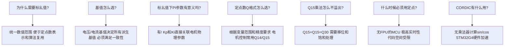

# ADV-ALG-09 标幺值系统与定点数运算

**模块编号：** ADV-ALG-09
**模块名称：** 标幺值系统与定点数运算（Per-Unit System & Fixed-Point Arithmetic）
**文档版本：** v2.0
**适用对象：** 已掌握FOC基本原理，需要将浮点算法移植到资源受限MCU的嵌入式工程师
**前置知识：** ALG-01 FOC理论基础、ALG-05 有感FOC实现、ALG-15 前沿研究（浮点算法实现）
**难度等级：** ★★★☆☆

---

## 1. 核心摘要

**一句话：** 标幺值把不同量纲的物理量归一化到 $[-1, 1]$，定点数让没有FPU的MCU也能跑FOC——二者结合，是电机控制算法从"实验室浮点仿真"走向"量产级嵌入式实现"的关键桥梁。

**认知挂钩：** 把标幺值想象成"货币汇率"——不同国家的商品价格（电压、电流、转速）用各自货币表示时数值差异巨大，但换算成美元（标幺值）后，所有商品都在一个统一的尺度上比较。定点数则是"硬币面额"——没有信用卡（FPU）的小卖部，只能用整数面额的硬币来表示价格，精度取决于最小面额。

**核心问题链：**



**标幺值-定点数联合设计速查表：**

| 物理量 | 基值 | 标幺值范围 | 推荐Q格式 | 定点范围 |
|--------|------|-----------|----------|---------|
| 相电压 | $V_{base}$ | $[-1, 1)$ | Q14 | $[-16384, 16383]$ |
| 相电流 | $I_{base}$ | $[-1, 1)$ | Q14 | $[-16384, 16383]$ |
| 电角度 | $2\pi$ | $[0, 1)$ | Q14(无符号) | $[0, 16383]$ |
| 转速 | $\omega_{base}$ | $[-1, 1)$ | Q14 | $[-16384, 16383]$ |
| 占空比 | 1.0 | $[0, 1)$ | Q15(无符号) | $[0, 32767]$ |
| PI积分项 | — | $[-1, 1)$ | Q28 | $[-268435456, 268435455]$ |
| sin/cos | 1.0 | $[-1, 1)$ | Q15 | $[-32768, 32767]$ |

---

## 2. 标幺值定义与基值选取

### 2.1 标幺值基本定义

标幺值（Per-Unit Value, PU）是实际物理量与其对应基值（Base Value）的比值：

$$x_{pu} = \frac{x_{actual}}{x_{base}}$$

**核心思想：** 将所有物理量归一化到 $[-1, 1]$ 或 $[0, 1]$ 的范围内，使得不同功率等级、不同电压等级的电机系统可以使用同一套算法代码。

### 2.2 基值选取原则

基值选取是标幺值系统设计的核心，选取不当会导致：
- 标幺值范围溢出（基值太小）或精度不足（基值太大）
- 派生基值不一致，导致方程形式改变
- PI参数失去物理意义

#### 2.2.1 基本基值

**电压基值 $V_{base}$：**

$$V_{base} = \text{ADC可测量的最大相电压峰值}$$

常见选取方案：

| 方案 | 公式 | 适用场景 | 备注 |
|------|------|---------|------|
| 方案A | $V_{base} = V_{dc}/\sqrt{3}$ | SVPWM线性调制区 | 最常用，保证线性调制区内标幺值 $\leq 1$ |
| 方案B | $V_{base} = V_{dc}/2$ | SPWM调制 | 与SPWM调制比对应 |
| 方案C | $V_{base} = V_{dc}$ | 过调制区域 | 需要标幺值超过1 |

> **工程建议：** 方案A最常用。SVPWM线性调制区的最大相电压峰值为 $V_{dc}/\sqrt{3}$，以此为基值意味着在线性调制区内，电压标幺值不会超过1，便于定点数表示和超限检测。

**电流基值 $I_{base}$：**

$$I_{base} = \text{ADC可测量的最大相电流峰值}$$

常见选取方案：

| 方案 | 公式 | 适用场景 | 备注 |
|------|------|---------|------|
| 方案A | $I_{base} = I_{rated\_peak}$ | 额定工况 | 标幺值在额定点附近约为1 |
| 方案B | $I_{base} = I_{max\_peak}$ | 包含过载 | 标幺值始终 $\leq 1$，但额定点标幺值较小 |
| 方案C | $I_{base} = V_{base}/Z_{base}$ | 阻抗一致性 | 由电压和阻抗基值派生 |

> **MC_LIB实践：** 在 [PMSM_PARA.h](file:///e:/gitee_CodeStorage/学习/MotorControl-main/MC_LIB/3_MC/PMSM_PARA.h) 中，电压基值取 `HAL_ADC_VOLTAGE_MAX`（ADC可测最大电压），电流基值取 `HAL_ADC_CURRENT_MAX`（ADC可测最大电流），频率基值取 `MOTOR_MAX_FREQ`（最大电频率）。

#### 2.2.2 派生基值

所有派生基值必须满足量纲一致性，即从基本基值 $V_{base}$ 和 $I_{base}$ 出发推导：

$$\boxed{Z_{base} = \frac{V_{base}}{I_{base}}}$$

$$\boxed{P_{base} = \frac{3}{2} \cdot V_{base} \cdot I_{base}}$$

> 注意：三相PMSM的功率基值使用 $3/2$ 系数，因为 $V_{base}$ 和 $I_{base}$ 是相电压/相电流峰值，而三相功率 $P = \frac{3}{2}(v_d i_d + v_q i_q)$。

$$\boxed{\omega_{base} = \frac{V_{base}}{\psi_f}}$$

转速基值的物理意义：**反电动势等于电压基值时的电角速度**。当 $\omega_e = \omega_{base}$ 时，反电动势 $E = \omega_e \psi_f = V_{base}$，即标幺值为1。这正是弱磁控制的起始点。

$$\boxed{T_{base} = \frac{3}{2} \cdot p \cdot \psi_f \cdot I_{base}}$$

其中 $p$ 为极对数。转矩基值对应额定电流下产生的电磁转矩。

$$\boxed{L_{base} = \frac{Z_{base}}{\omega_{base}} = \frac{\psi_f}{I_{base}}}$$

$$\boxed{\psi_{base} = \frac{V_{base}}{\omega_{base}} = \psi_f}$$

磁链基值等于永磁体磁链 $\psi_f$，这意味着标幺值下 $\psi_{f,pu} = 1.0$。

$$\boxed{t_{base} = \frac{1}{\omega_{base}}}$$

时间基值，用于将采样周期 $T_s$ 转换为标幺值。

#### 2.2.3 基值一致性验证

所有基值必须满足以下关系，否则标幺值下的方程形式会改变：

$$V_{base} = I_{base} \times Z_{base}$$

$$Z_{base} = \omega_{base} \times L_{base}$$

$$V_{base} = \omega_{base} \times \psi_{base}$$

$$P_{base} = T_{base} \times \frac{\omega_{base}}{p}$$

**验证方法：** 任选两个独立基值（如 $V_{base}$ 和 $I_{base}$），其余基值全部由这两个派生。**绝不能**独立选取三个或更多基值，否则必然出现不一致。

### 2.3 不同基值选取方案对比

以一台24V/8A PMSM为例，对比三种基值选取方案：

**电机参数：** $V_{dc}=24\text{V}$, $I_{rated}=8\text{A}$, $R_s=0.562\Omega$, $L_s=0.385\text{mH}$, $\psi_f=8.75\text{mWb}$, $p=4$, $n_{max}=4000\text{rpm}$

| 基值 | 方案A：SVPWM线性调制 | 方案B：母线电压 | 方案C：MC_LIB方案 |
|------|---------------------|---------------|-----------------|
| $V_{base}$ | $24/\sqrt{3}=13.86\text{V}$ | $24\text{V}$ | ADC最大量程 |
| $I_{base}$ | $8\text{A}$ | $8\text{A}$ | ADC最大量程 |
| $Z_{base}$ | $1.732\Omega$ | $3.0\Omega$ | $V_{base}/I_{base}$ |
| $\omega_{base}$ | $1584\text{rad/s}$ | $2743\text{rad/s}$ | $V_{base}/\psi_f$ |
| $L_{base}$ | $1.093\text{mH}$ | $1.093\text{mH}$ | $Z_{base}/\omega_{base}$ |
| 额定电压PU | $0.866$ | $0.500$ | 取决于ADC量程 |
| 额定电流PU | $1.000$ | $1.000$ | 取决于ADC量程 |
| 弱磁起始PU | $1.000$ | $0.577$ | 取决于ADC量程 |

**方案A的优势：** 线性调制区内电压标幺值 $\leq 1$，弱磁起始点恰好是 $\omega_{pu}=1$，物理意义最清晰。

**方案C（MC_LIB方案）的优势：** 基值直接取ADC量程，标幺值与ADC读数直接对应，不需要额外的标度变换，代码最简洁。

---

## 3. 标幺值在电机控制中的优势

### 3.1 数值范围统一

有名值下各物理量的数值范围差异巨大：

| 物理量 | 有名值典型范围 | 标幺值范围 |
|--------|--------------|-----------|
| 电压 | 0 ~ 400 V | 0 ~ 1 |
| 电流 | 0 ~ 100 A | 0 ~ 1 |
| 转速 | 0 ~ 10000 rpm | 0 ~ 1 |
| 电感 | 0.1 ~ 100 mH | 0 ~ 1 |
| 磁链 | 0.01 ~ 1 Wb | 0 ~ 1 |

**标幺值将所有变量统一到 $[-1, 1]$ 范围**，这是定点数表示的最佳输入条件。

### 3.2 便于定点数表示

标幺值范围 $[-1, 1)$ 恰好对应Q15/Q14格式的表示范围：

```
有名值：  Ia = 5.0A       → 需要浮点数或自定义定点格式
标幺值：  Ia_pu = 0.625   → 直接用Q15表示为 0.625 × 32768 = 20480
```

### 3.3 算法代码可复用

同一套FOC算法代码，只需修改基值定义，即可适配不同电机：

```c
// 24V/8A电机
#define V_BASE    (13.86f)   // V
#define I_BASE    (8.0f)     // A
#define F_BASE    (252.0f)   // Hz (电频率)

// 380V/50A电机——只需修改基值，算法代码完全不变
#define V_BASE    (219.4f)   // V
#define I_BASE    (50.0f)    // A
#define F_BASE    (100.0f)   // Hz
```

### 3.4 PI参数与电机参数解耦

**这是标幺值系统最被低估的优势。** 在有名值下，PI参数的数值与电机参数强耦合：

有名值下电流环PI参数（零极点对消法）：

$$K_p = \omega_{bw} \cdot L_s, \quad K_i = \omega_{bw} \cdot R_s$$

不同电机的 $L_s$ 和 $R_s$ 差异巨大，导致 $K_p$、$K_i$ 的数值范围完全不同。

**标幺值下电流环PI参数：**

$$K_{p,pu} = \omega_{bw,pu} \cdot L_{s,pu}, \quad K_{i,pu} = \omega_{bw,pu} \cdot R_{s,pu}$$

由于 $L_{s,pu}$ 和 $R_{s,pu}$ 通常在 $[0, 1]$ 范围内，PI参数的数值范围也相对统一。更重要的是：

- $K_{p,pu}$ 的物理意义：**以标幺电感为比例的带宽响应**
- $K_{i,pu}$ 的物理意义：**以标幺电阻为比例的带宽响应**

当带宽标幺值 $\omega_{bw,pu}$ 相同时，不同电机的PI参数标幺值在同一量级。

### 3.5 便于超限判断

$$|x_{pu}| > 1 \iff |x_{actual}| > x_{base}$$

标幺值超过1即意味着物理量超过基值（通常是额定值或最大值），这为保护判断提供了统一的阈值：

```c
// 标幺值下的统一超限检测
if (MATH_ABS_T(Id_pu) > Q14_PU) {
    // 电流超过基值，触发保护
    fault_handler(OVERCURRENT);
}
```

---

## 4. 标幺值系统设计实例

### 4.1 电机参数与基值计算

以MC_LIB中的24V/8A PMSM为例（参见 [PMSM_PARA.h](file:///e:/gitee_CodeStorage/学习/MotorControl-main/MC_LIB/3_MC/PMSM_PARA.h)）：

**电机有名值参数：**

| 参数 | 符号 | 值 | 单位 |
|------|------|-----|------|
| 母线电压 | $V_{dc}$ | 24 | V |
| 额定相电流峰值 | $I_{rated}$ | 8 | A |
| 定子电阻 | $R_s$ | 0.562 | $\Omega$ |
| d轴电感 | $L_d$ | 0.365 | mH |
| q轴电感 | $L_q$ | 0.405 | mH |
| 平均电感 | $L_s$ | 0.385 | mH |
| 永磁体磁链 | $\psi_f$ | 8.75 | mWb |
| 极对数 | $p$ | 4 | — |
| 最大转速 | $n_{max}$ | 4000 | rpm |

**基值计算（MC_LIB方案）：**

```c
// 基值定义（PMSM_PARA.h 中的实际代码）
#define V_BASE    (HAL_ADC_VOLTAGE_MAX)    // 电压基值 = ADC最大量程
#define I_BASE    (HAL_ADC_CURRENT_MAX)    // 电流基值 = ADC最大量程
#define F_BASE    (MOTOR_MAX_FREQ)         // 频率基值 = 最大电频率

// 派生基值
#define R_BASE    (V_BASE / I_BASE)        // 阻抗基值
#define L_BASE    (V_BASE / F_BASE / I_BASE) // 电感基值
#define P_BASE    (V_BASE / F_BASE)        // 磁链基值
#define T_BASE    (1.0f / F_BASE)          // 时间基值
```

**具体数值计算（假设ADC量程恰好覆盖额定值）：**

设 $V_{base} = 24/\sqrt{3} = 13.86\text{V}$, $I_{base} = 8\text{A}$:

| 基值 | 计算 | 结果 |
|------|------|------|
| $V_{base}$ | $24/\sqrt{3}$ | 13.86 V |
| $I_{base}$ | 额定相电流峰值 | 8.0 A |
| $Z_{base}$ | $13.86/8.0$ | 1.732 $\Omega$ |
| $\omega_{base}$ | $13.86/0.00875$ | 1584 rad/s = 252 Hz |
| $L_{base}$ | $1.732/1584$ | 1.093 mH |
| $\psi_{base}$ | $13.86/1584$ | 8.75 mWb = $\psi_f$ |
| $T_{base}$ | $1/1584$ | 0.631 ms |
| $P_{base}$ | $\frac{3}{2} \times 13.86 \times 8$ | 166.3 W |

### 4.2 电机参数的标幺值

$$R_{s,pu} = \frac{R_s}{Z_{base}} = \frac{0.562}{1.732} = 0.324$$

$$L_{s,pu} = \frac{L_s}{L_{base}} = \frac{0.385 \times 10^{-3}}{1.093 \times 10^{-3}} = 0.352$$

$$\psi_{f,pu} = \frac{\psi_f}{\psi_{base}} = \frac{8.75 \times 10^{-3}}{8.75 \times 10^{-3}} = 1.0$$

> 注意 $\psi_{f,pu} = 1.0$ 是必然结果，因为 $\psi_{base} = \psi_f$。

**标幺值下的电压方程（dq坐标系）：**

$$\begin{cases}
u_{d,pu} = R_{s,pu} \cdot i_{d,pu} + \frac{L_{d,pu}}{\omega_{base} \cdot T_s} \cdot \frac{\Delta i_{d,pu}}{\Delta t_{pu}} - \omega_{e,pu} \cdot L_{q,pu} \cdot i_{q,pu} \\
u_{q,pu} = R_{s,pu} \cdot i_{q,pu} + \frac{L_{q,pu}}{\omega_{base} \cdot T_s} \cdot \frac{\Delta i_{q,pu}}{\Delta t_{pu}} + \omega_{e,pu} \cdot (L_{d,pu} \cdot i_{d,pu} + \psi_{f,pu})
\end{cases}$$

由于 $\psi_{f,pu} = 1$，q轴方程简化为：

$$u_{q,pu} = R_{s,pu} \cdot i_{q,pu} + L_{q,pu} \cdot \frac{di_{q,pu}}{dt_{pu}} + \omega_{e,pu} \cdot (L_{d,pu} \cdot i_{d,pu} + 1)$$

### 4.3 标幺值下的PI参数物理意义

**电流环PI参数（零极点对消法）：**

有名值：

$$K_p = \omega_{bw} \cdot L_s, \quad K_i = \omega_{bw} \cdot R_s$$

标幺值：

$$K_{p,pu} = \frac{K_p \cdot I_{base}}{V_{base}} = \frac{\omega_{bw} \cdot L_s \cdot I_{base}}{V_{base}} = \omega_{bw,pu} \cdot L_{s,pu}$$

$$K_{i,pu} = \frac{K_i \cdot I_{base}}{V_{base} \cdot T_s} = \frac{\omega_{bw} \cdot R_s \cdot I_{base}}{V_{base} \cdot T_s}$$

**MC_LIB中的实际PI参数计算**（参见 [MCFOC_PARA_T.h](file:///e:/gitee_CodeStorage/学习/MotorControl-main/MC_LIB/3_MC/31_FOC/311_FOC_T/MCFOC_PARA_T.h)）：

```c
// 电流环PI参数——标幺值下的计算
#define MOTOR_CURRENT_PID_Coeff             (0.05f)
#define MOTOR_CURRENT_KP_GAIN  ((Q32I_)(MOTOR_CURRENT_PID_Coeff * MOTOR_Ls * MATH_2PI_F \
                                / MOTOR_HTs * I_BASE / V_BASE * 16384.0f))
#define MOTOR_CURRENT_KI_GAIN  ((Q32I_)(MOTOR_CURRENT_PID_Coeff * MOTOR_Rs \
                                * I_BASE / V_BASE * 16384.0f))
```

**解读：**
- `MOTOR_CURRENT_PID_Coeff * MOTOR_Ls * MATH_2PI_F / MOTOR_HTs`：这是带宽 $\omega_{bw}$ 与电感的乘积
- `I_BASE / V_BASE`：标幺值转换系数
- `* 16384.0f`：转换为Q14定点格式

### 4.4 标幺值与有名值的转换代码

**浮点版本**（参见 [PMSM_PARA.h](file:///e:/gitee_CodeStorage/学习/MotorControl-main/MC_LIB/3_MC/PMSM_PARA.h) 第190-200行）：

```c
// 有名值 → 标幺值（浮点）
#define VOLTAGE_TO_PU(A)    ((A) / V_BASE)
#define CURRENT_TO_PU(A)    ((A) / I_BASE)
#define FREQ_TO_PU(A)       ((A) / F_BASE)
#define ANGLE_TO_PU(A)      ((A) / MATH_2PI_F)

// 标幺值 → 有名值（浮点）
#define PU_TO_VOLTAGE(A)    ((A) * V_BASE)
#define PU_TO_CURRENT(A)    ((A) * I_BASE)
#define PU_TO_FREQ(A)       ((A) * F_BASE)
#define PU_TO_ANGLE(A)      ((A) * MATH_2PI_F)
```

**定点版本**（Q14格式，参见 [PMSM_PARA.h](file:///e:/gitee_CodeStorage/学习/MotorControl-main/MC_LIB/3_MC/PMSM_PARA.h) 第162-171行）：

```c
// 有名值 → 标幺值（Q14定点）
#define Q14I_VOLTAGE_TO_PU(A)   ((Q32I_)(MOTOR_Q14_PU * (A) / V_BASE))
#define Q14I_CURRENT_TO_PU(A)   ((Q32I_)(MOTOR_Q14_PU * (A) / I_BASE))
#define Q14I_FREQ_TO_PU(A)      ((Q32I_)(MOTOR_Q14_PU * (A) / F_BASE))
#define Q14I_ANGLE_TO_PU(A)     ((Q32I_)(MOTOR_Q14_PU * (A) / MATH_2PI_F))

// Q28格式（更高精度，用于斜坡、积分等）
#define Q28I_VOLTAGE_TO_PU(A)   ((Q32I_)(MOTOR_Q28_PU * (A) / V_BASE))
#define Q28I_CURRENT_TO_PU(A)   ((Q32I_)(MOTOR_Q28_PU * (A) / I_BASE))
#define Q28I_FREQ_TO_PU(A)      ((Q32I_)(MOTOR_Q28_PU * (A) / F_BASE))
#define Q28I_ANGLE_TO_PU(A)     ((Q32I_)(MOTOR_Q28_PU * (A) / MATH_2PI_F))
```

**标幺值 → 有名值（Q14定点反转换）：**

```c
// 标幺值(Q14) → 有名值
#define PU_TO_VOLTAGE_Q14(A)    ((float)(A) / MOTOR_Q14_PU * V_BASE)
#define PU_TO_CURRENT_Q14(A)    ((float)(A) / MOTOR_Q14_PU * I_BASE)
#define PU_TO_FREQ_Q14(A)       ((float)(A) / MOTOR_Q14_PU * F_BASE)
```

---

## 5. 定点数表示——Q格式

### 5.1 Q格式定义

Q格式是一种用整数表示小数的方法。$Q_{n.m}$ 格式表示：$n$ 位整数（含1位符号位）+ $m$ 位小数，总位宽为 $n + m$。

对于32位有符号整数：

$$Q_{n.m}: \quad \underbrace{[s]}_{1位符号} \underbrace{[i_{n-2} \cdots i_1 i_0]}_{n-1位整数} \underbrace{[f_{m-1} \cdots f_1 f_0]}_{m位小数}$$

**数值与码值的关系：**

$$\text{实际值} = \frac{\text{码值}}{2^m}$$

$$\text{码值} = \text{实际值} \times 2^m$$

### 5.2 电机控制常用Q格式

#### Q15（16位）

$$Q_{1.15}: \quad 1位符号 + 15位小数$$

- 表示范围：$[-1, 1 - 2^{-15}] = [-1, 0.9999695]$
- 分辨率：$2^{-15} = 3.052 \times 10^{-5}$
- 码值范围：$[-32768, 32767]$

```c
// Q15示例
int16_t voltage_q15 = (int16_t)(0.5f * 32768);    // 0.5 → 16384
int16_t current_q15 = (int16_t)(-0.3f * 32768);   // -0.3 → -9830
```

#### Q31（32位）

$$Q_{1.31}: \quad 1位符号 + 31位小数$$

- 表示范围：$[-1, 1 - 2^{-31}] = [-1, 0.9999999995]$
- 分辨率：$2^{-31} = 4.657 \times 10^{-10}$
- 码值范围：$[-2147483648, 2147483647]$

```c
// Q31示例
int32_t integral_q31 = (int32_t)(0.5f * 2147483648);  // 0.5 → 1073741824
```

#### Q14（MC_LIB特色格式）

MC_LIB使用Q14作为主要定点格式，其1.0对应码值16384：

$$Q_{1.14}: \quad 1位符号 + 14位小数$$

- 表示范围：$[-2, 2 - 2^{-14}]$（但标幺值下通常只用 $[-1, 1)$）
- 分辨率：$2^{-14} = 6.104 \times 10^{-5}$
- 1.0对应码值：$2^{14} = 16384$

```c
// MC_LIB中的Q14定义
#define MOTOR_Q14_PU   (Q14U_MAX)   // 16384
#define MOTOR_Q28_PU   (Q28U_MAX)   // 268435456
```

> **为什么MC_LIB选Q14而不是Q15？** Q14的1.0对应16384，留出了1位的余量空间，允许标幺值超过1.0（如过调制时电压可达1.15 PU）。Q15的1.0对应32767，超过1.0就溢出了。

### 5.3 Q格式选择原则

**选择Q格式的三步法：**

1. **确定变量范围：** 最大值 $|x_{max}|$ 是多少？
2. **确定精度要求：** 最小可分辨变化量 $\Delta x_{min}$ 是多少？
3. **选择Q格式：** 确保范围不溢出、精度满足要求

$$m \geq \lceil \log_2(1/\Delta x_{min}) \rceil \quad \text{(精度约束)}$$

$$n \geq \lceil \log_2(|x_{max}|) \rceil + 1 \quad \text{(范围约束，含符号位)}$$

**电机控制各变量推荐Q格式：**

| 变量 | 范围 | 精度要求 | 推荐Q格式 | 理由 |
|------|------|---------|----------|------|
| 电流/电压(标幺值) | $[-1, 1)$ | $10^{-4}$ | Q14/Q15 | 标幺值天然在 $[-1,1]$ |
| 电角度 | $[0, 2\pi)$ | $0.01^\circ$ | Q14(无符号) | 0~16383映射0~$2\pi$ |
| sin/cos | $[-1, 1)$ | $10^{-4}$ | Q15 | CMSIS-DSP标准格式 |
| 占空比 | $[0, 1)$ | $10^{-4}$ | Q15(无符号) | 0~32767映射0~100% |
| PI积分项 | $[-1, 1)$ | $10^{-7}$ | Q28/Q31 | 防止积分溢出和稳态误差 |
| 转速(标幺值) | $[-1, 1)$ | $10^{-4}$ | Q14 | 与电流/电压统一 |
| 电机参数(Rs, Ls) | $[0, 1)$ | $10^{-4}$ | Q14 | 标幺值下参数 $\leq 1$ |

### 5.4 MC_LIB中的Q格式体系

MC_LIB建立了一套完整的Q格式命名规范（参见 [MATH.h](file:///e:/gitee_CodeStorage/学习/MotorControl-main/MC_LIB/2_COM/21_MATH/MATH.h)）：

```c
// 基本类型定义
typedef signed   short int  Q16I_;   // 16位有符号（用于Q15）
typedef signed   int         Q32I_;   // 32位有符号（用于Q14/Q28/Q31）
typedef unsigned short int  Q16U_;   // 16位无符号
typedef unsigned int         Q32U_;   // 32位无符号

// Q格式最大值常量
#define Q14U_MAX    (16384.0f)
#define Q28U_MAX    (268435456.0f)
#define Q30U_MAX    (1073741824.0f)

// 移位宏（避免魔法数字）
#define Q16I_LFT_14(A)   ((A) << 14U)   // 左移14位：Q14 → Q28
#define Q32I_RHT_14(A)   ((A) >> 14U)   // 右移14位：Q28 → Q14
```

**变量命名规范：**

```
_V_Q14I_Id_Real    →  V=变量, Q14=Q14格式, I=有符号, Id_Real=变量名
_I_Q12I_Ia_Data    →  I=输入, Q12=Q12格式, I=有符号, Ia_Data=变量名
_O_Q14I_Freq       →  O=输出, Q14=Q14格式, I=有符号, Freq=变量名
_P_Q14I_Rs         →  P=参数, Q14=Q14格式, I=有符号, Rs=变量名
```

命名规则：`{方向}_{Q格式}{符号类型}_{变量名}`

- 方向：`I`=输入, `V`=中间变量, `O`=输出, `P`=参数
- Q格式：`Q14`=Q14, `Q12`=Q12, `Q28`=Q28, `Q08`=Q8
- 符号：`I`=有符号(signed), `U`=无符号(unsigned)

---

## 6. 定点数运算

### 6.1 加减法

**同Q格式直接加减：**

```c
// Q14 + Q14 = Q14
Q32I_ result_q14 = a_q14 + b_q14;

// Q14 - Q14 = Q14
Q32I_ result_q14 = a_q14 - b_q14;
```

**不同Q格式需要先对齐：**

```c
// Q14 + Q28 → 先将Q14左移14位变Q28，相加后再右移14位回Q14
Q32I_ result_q28 = (a_q14 << 14) + b_q28;
Q32I_ result_q14 = result_q28 >> 14;
```

### 6.2 乘法

**Q格式乘法规则：** $Q_{a} \times Q_{b} = Q_{a+b}$

#### Q14 x Q14 = Q28

这是MC_LIB中最常见的乘法模式：

```c
// Q14 × Q14 = Q28
Q32I_ a_q14 = 8192;    // 0.5 in Q14
Q32I_ b_q14 = 4096;    // 0.25 in Q14
Q32I_ result_q28 = a_q14 * b_q14;  // 33554432 = 0.125 in Q28

// Q28 → Q14（右移14位，截断）
Q32I_ result_q14 = result_q28 >> 14;  // 2048 = 0.125 in Q14
```

#### Q15 x Q15 = Q30

```c
// Q15 × Q15 = Q30
int16_t a_q15 = 16384;     // 0.5 in Q15
int16_t b_q15 = 8192;      // 0.25 in Q15
int32_t result_q30 = (int32_t)a_q15 * b_q15;  // 134217728 = 0.125 in Q30

// Q30 → Q15（右移15位）
int16_t result_q15 = (int16_t)(result_q30 >> 15);  // 4096 = 0.125 in Q15
```

#### MC_LIB PID中的乘法实例

参见 [MATH_PID_T.c](file:///e:/gitee_CodeStorage/学习/MotorControl-main/MC_LIB/2_COM/21_MATH/21_MATH_T/MATH_PID_T.c) 中的位置式PID：

```c
void PID_Pos_Cal_T(ST_PID_POS_T* pPID)
{
    Q32I_ Q14I_Error = pPID->Q14I_Rf - pPID->Q14I_Fb;  // Q14 - Q14 = Q14

    // Ki × Error = Q14 × Q14 = Q28，累加到Q28积分项
    pPID->Q28I_Ui_tmp += pPID->Q14I_Ki * Q14I_Error;

    // 积分限幅（Q14范围左移14位变成Q28范围）
    pPID->Q28I_Ui_tmp = MATH_SAT_T(pPID->Q28I_Ui_tmp,
                                     Q16I_LFT_14(pPID->Q14I_OutMax),
                                     Q16I_LFT_14(pPID->Q14I_OutMin));

    // Q28 → Q14（右移14位）
    pPID->Q14I_Int = Q32I_RHT_14(pPID->Q28I_Ui_tmp);

    // Kp × Error = Q14 × Q14 = Q28，右移14位变Q14，加上积分项
    pPID->Q14I_Output = Q32I_RHT_14(pPID->Q14I_Kp * Q14I_Error) + pPID->Q14I_Int;

    // 输出限幅
    pPID->Q14I_Output = MATH_SAT_T(pPID->Q14I_Output,
                                    pPID->Q14I_OutMax, pPID->Q14I_OutMin);
}
```

**数据流图：**

```
Error(Q14) ──┬── × Kp(Q14) ──→ Q28 ──>>14──→ Q14 ──┐
             │                                      ├──→ Output(Q14)
             └── × Ki(Q14) ──→ Q28 ──累加──>>14──→ Q14 ──┘
                                ↑
                          Ui_tmp(Q28)
```

### 6.3 除法

**Q格式除法规则：** $Q_{a} / Q_{b} = Q_{a-b}$

**Q15 / Q15：** 需要先左移15位再除，否则结果为0或1：

```c
// 错误：Q15 / Q15 直接除，结果只有 -1, 0, 1
int16_t wrong = a_q15 / b_q15;

// 正确：先左移15位，再除
int32_t result_q30 = ((int32_t)a_q15 << 15) / b_q15;
int16_t result_q15 = (int16_t)(result_q30 >> 15);
```

> **工程建议：** 定点数除法开销大（通常20~40个时钟周期），在实时控制环中应尽量避免。常用替代方案：
> - 预计算倒数，用乘法代替除法
> - 查表法（如 $1/V_{bus}$ 预计算）
> - 使用Newton-Raphson迭代近似

**MC_LIB中的1/Vbus预计算：**

```c
// 预计算 1/Vbus 的Q14表示
Q32I_ one_over_vbus_q14 = (Q32I_)(MOTOR_Q14_PU / vbus_actual);
```

### 6.4 饱和处理

饱和（Saturation）是定点数运算的安全网，防止溢出导致符号翻转等灾难性后果：

```c
// 通用饱和宏
#define MATH_SAT_T(A, MAX, MIN)  (MATH_MAX_T(MATH_MIN_T((A), (MAX)), (MIN)))

// 使用示例
Q32I_ output = MATH_SAT_T(raw_result, Q14U_MAX, -Q14U_MAX);

// CMSIS-DSP内置饱和函数
int16_t arm_sat_q15(int32_t x);  // 饱和到Q15范围
int32_t arm_sat_q31(int64_t x);  // 饱和到Q31范围
```

**溢出的危害——符号翻转示例：**

```c
// Q14格式，最大值为16383
int32_t a = 16383;  // 接近Q14最大值
int32_t b = 16383;
int32_t sum = a + b;  // = 32766，在Q14中代表 32766/16384 ≈ 2.0

// 如果用int16_t存储，32766不会溢出
// 但如果 a = 16384, b = 16384，sum = 32768
// int16_t下32768变成-32768！符号翻转！
```

### 6.5 舍入模式

定点数右移（降精度）时的舍入方式：

**截断（Truncation，向零取整）：**

```c
// 直接右移，总是向零取整
int32_t result_q14 = result_q28 >> 14;
// 0.9999 → 0（正数偏小）
// -0.9999 → 0（负数偏大）
```

**四舍五入（Rounding，加0.5后截断）：**

```c
// 加上半个LSB后右移
int32_t result_q14 = (result_q28 + (1 << 13)) >> 14;
// 0.9999 → 1（更精确）
// -0.9999 → -1（更精确）
```

> **工程建议：** 电流环和速度环的PI计算中，推荐使用截断（直接右移），因为四舍五入可能引入极限环振荡（limit cycle）。观测器和滤波器中可考虑四舍五入以减少稳态误差。

### 6.6 CMSIS-DSP库的Q15/Q31运算函数

CMSIS-DSP提供了高度优化的定点运算函数，利用Cortex-M4/M7的SIMD指令（SADD16、SMULBB等）加速：

```c
#include "arm_math.h"

// Q15乘法（带饱和）
q15_t arm_mul_q15(q15_t a, q15_t b);

// Q31乘法（带饱和）
q31_t arm_mul_q31(q31_t a, q31_t b);

// Q15向量点积
void arm_dot_prod_q15(const q15_t *pSrcA, const q15_t *pSrcB,
                       uint32_t blockSize, q63_t *result);

// Q15 PID控制器
typedef struct {
    q31_t A0;           // Kp + Ki + Kd
    q31_t A1;           // -(Kp + 2*Kd)
    q31_t A2;           // Kd
    q31_t state[3];     // 状态
    q31_t Kp;           // 比例增益
    q31_t Ki;           // 积分增益
    q31_t Kd;           // 微分增益
} arm_pid_instance_q31;

// 初始化Q31 PID
void arm_pid_init_q31(arm_pid_instance_q31 *S, int32_t resetStateFlag);

// Q31 PID计算
q31_t arm_pid_q31(arm_pid_instance_q31 *S, q31_t in);
```

**Clarke变换的Q15实现示例：**

```c
// 浮点版
void Clarke_Float(float Ia, float Ib, float *Ialpha, float *Ibeta)
{
    *Ialpha = Ia;
    *Ibeta  = (Ia + 2.0f * Ib) / 1.7320508f;
}

// Q15定点版（使用CMSIS-DSP）
void Clarke_Q15(q15_t Ia, q15_t Ib, q15_t *Ialpha, q15_t *Ibeta)
{
    *Ialpha = Ia;
    // (Ia + 2*Ib) / sqrt(3)
    // Q15: 1/sqrt(3) ≈ 0.57735 → Q15 = 18919
    int32_t tmp = (int32_t)Ia + 2 * (int32_t)Ib;
    *Ibeta = (q15_t)(__SSAT(((tmp * 18919) >> 15), 16));
}
```

---

## 7. 浮点转定点的工程实践

### 7.1 逐步转换法

**核心原则：** 先浮点验证，再逐模块转定点，每一步都可对比验证。

```
浮点验证通过
    │
    ▼
Step 1: 确定变量范围和精度 → 选择Q格式
    │
    ▼
Step 2: 在浮点代码中加入Q格式转换宏 → 对比浮点输出
    │
    ▼
Step 3: 逐模块替换浮点运算为定点运算 → 对比每个模块的输出误差
    │
    ▼
Step 4: 全部替换完成 → 系统级对比测试
    │
    ▼
Step 5: 优化关键路径 → 利用CMSIS-DSP或硬件加速
```

### 7.2 关键步骤详解

#### Step 1: 确定变量范围和精度

**方法：** 在浮点代码中添加范围检测，运行典型工况，记录每个变量的最大值、最小值和有效位数。

```c
// 范围检测宏（开发阶段使用）
#define RANGE_CHECK(var, name) \
    do { \
        static float max_##name = -1e30f, min_##name = 1e30f; \
        if (var > max_##name) { max_##name = var; printf("%s max=%f\n", name, max_##name); } \
        if (var < min_##name) { min_##name = var; printf("%s min=%f\n", name, min_##name); } \
    } while(0)

// 使用
RANGE_CHECK(Id_pu, "Id_pu");
RANGE_CHECK(Iq_pu, "Iq_pu");
RANGE_CHECK(Ud_pu, "Ud_pu");
RANGE_CHECK(theta,  "theta");
```

#### Step 2: 选择Q格式

根据Step 1的结果选择Q格式：

| 变量范围 | 推荐Q格式 | 理由 |
|---------|----------|------|
| $[-1, 1)$ | Q15 | 标准选择，CMSIS-DSP原生支持 |
| $[-2, 2)$ | Q14 | 留余量，MC_LIB方案 |
| $[-4, 4)$ | Q13 | 允许超调 |
| $[0, 1)$ | Q15(无符号) | 占空比等 |
| $[0, 2\pi)$ | Q14(无符号) | 角度，0~16383映射0~$2\pi$ |

#### Step 3: 在浮点代码中加入Q格式转换宏

```c
// 在浮点代码中插入定点转换，对比结果
float Id_pu = ...;  // 原浮点计算

// 插入定点转换
Q32I_ Id_q14 = (Q32I_)(Id_pu * 16384.0f);  // 浮点→Q14
float Id_pu_from_q14 = (float)Id_q14 / 16384.0f;  // Q14→浮点

// 对比误差
float error = Id_pu - Id_pu_from_q14;
assert(fabs(error) < 0.001);  // Q14精度约6e-5
```

#### Step 4: 逐步替换浮点运算为定点运算

**替换顺序建议：**

1. **电流采样→Clarke变换**（最简单，线性运算）
2. **Park/反Park变换**（涉及sin/cos，需要查表或CORDIC）
3. **PI控制器**（涉及积分和乘法，需要注意Q格式提升）
4. **SVPWM**（涉及扇区判断和占空比计算）
5. **观测器**（最复杂，涉及多步迭代）

**每替换一个模块，立即对比浮点和定点的输出误差：**

```c
// 误差检测框架
typedef struct {
    float max_error;
    float rms_error;
    int   sample_count;
} ErrorStats;

void update_error_stats(ErrorStats *stats, float ref, float test)
{
    float err = fabs(ref - test);
    if (err > stats->max_error) stats->max_error = err;
    stats->rms_error += err * err;
    stats->sample_count++;
}
```

#### Step 5: 对比浮点和定点的输出误差

**可接受的误差范围：**

| 变量 | 可接受最大误差 | 理由 |
|------|--------------|------|
| 电流(标幺值) | $< 0.001$ | Q14分辨率 $6 \times 10^{-5}$ |
| 电压(标幺值) | $< 0.001$ | Q14分辨率 $6 \times 10^{-5}$ |
| 角度 | $< 0.01^\circ$ | Q14角度分辨率 $0.022^\circ$ |
| 占空比 | $< 0.01\%$ | Q15占空比分辨率 $0.003\%$ |

### 7.3 常见陷阱

#### 陷阱1：中间结果溢出

**问题：** 两个Q14数相乘得到Q28，但Q28的表示范围只有 $[-2, 2)$。如果两个接近1.0的Q14数相乘，Q28结果不会溢出；但如果中间有加法，可能溢出。

```c
// 危险：Q14 × Q14 = Q28，但多个Q28累加可能溢出！
Q32I_ sum_q28 = 0;
for (int i = 0; i < N; i++) {
    sum_q28 += a_q14[i] * b_q14[i];  // N个Q28累加，可能溢出32位！
}

// 安全：使用64位累加器
int64_t sum_q28_64 = 0;
for (int i = 0; i < N; i++) {
    sum_q28_64 += (int64_t)a_q14[i] * b_q14[i];
}
Q32I_ sum_q14 = (Q32I_)(sum_q28_64 >> 14);
```

#### 陷阱2：精度损失累积

**问题：** 多次乘法后右移截断，误差逐步累积。

```c
// 危险：每步都截断
Q32I_ a = (x1_q14 * y1_q14) >> 14;  // 第1次截断
Q32I_ b = (a * y2_q14) >> 14;       // 第2次截断，误差累积
Q32I_ c = (b * y3_q14) >> 14;       // 第3次截断，误差更大

// 安全：延迟截断，只在最后一步
Q32I_ tmp_q42 = x1_q14 * y1_q14 * y2_q14;  // Q14×Q14×Q14 = Q42
Q32I_ c = tmp_q42 >> 28;                     // 一步截断到Q14
```

#### 陷阱3：角度归一化

**问题：** 浮点下的角度归一化 `angle %= 2*PI` 在定点下不能直接用取模运算。

```c
// 浮点版
float angle_mod(float angle) {
    angle = fmod(angle, 2.0f * PI);
    if (angle < 0) angle += 2.0f * PI;
    return angle;
}

// Q14定点版（0~16383表示0~2π）
// MC_LIB的实现
#define MATH_2PI_T    (Q14U_MAX)   // 16384
#define MATH_ANGLE_MOD_T(A)  if(A >= MATH_2PI_T){A -= MATH_2PI_T;} \
                              if(A < 0){A += MATH_2PI_T;}

// 注意：这只处理了[0, 2*2π)范围，更通用的方法：
Q32I_ angle_mod_q14(Q32I_ angle)
{
    while (angle >= 16384) angle -= 16384;
    while (angle < 0)      angle += 16384;
    return angle;
}
```

#### 陷阱4：符号扩展

**问题：** 16位Q15转32位时，必须进行符号扩展。

```c
// 错误：直接赋值可能丢失符号
int32_t q31_val = (int32_t)q15_val << 16;  // 如果q15_val是负数，这是正确的
// 但如果先转无符号再移位，符号丢失！
int32_t wrong = (int32_t)(uint16_t)q15_val << 16;  // 负数变正数！

// 正确：C语言中int16_t到int32_t自动符号扩展
int16_t q15_val = -16384;  // -0.5 in Q15
int32_t q31_val = (int32_t)q15_val << 16;  // 正确：-1073741824 in Q31
```

---

## 8. CORDIC算法

### 8.1 CORDIC原理

CORDIC（COordinate Rotation DIgital Computer）是一种通过**移位和加法迭代**计算三角函数、反三角函数、双曲函数等的算法。其核心思想是将旋转角度分解为一系列固定角度的逐次逼近。

**旋转模式（Rotation Mode）：** 已知角度 $\theta$，求 $\sin\theta$ 和 $\cos\theta$。

将向量 $(x_0, y_0) = (1, 0)$ 旋转角度 $\theta$，经过 $n$ 次迭代后：

$$\begin{pmatrix} x_n \\ y_n \end{pmatrix} = K_n \begin{pmatrix} \cos\theta & -\sin\theta \\ \sin\theta & \cos\theta \end{pmatrix} \begin{pmatrix} x_0 \\ y_0 \end{pmatrix}$$

其中 $K_n = \prod_{i=0}^{n-1} \sqrt{1 + 2^{-2i}}$ 是CORDIC增益。

当 $n \to \infty$ 时，$K_n \to 1.6468$。因此：

$$\cos\theta = \frac{x_n}{K_n}, \quad \sin\theta = \frac{y_n}{K_n}$$

**每次迭代的操作：**

$$\begin{cases}
x_{i+1} = x_i - d_i \cdot y_i \cdot 2^{-i} \\
y_{i+1} = y_i + d_i \cdot x_i \cdot 2^{-i} \\
z_{i+1} = z_i - d_i \cdot \arctan(2^{-i})
\end{cases}$$

其中 $d_i = \text{sign}(z_i)$，决定旋转方向。

**关键优势：** 每次迭代只需要**移位和加法**，不需要乘法器！这对没有硬件乘法器的MCU极为重要。

### 8.2 CORDIC在电机控制中的应用

| 应用 | 输入 | 输出 | 说明 |
|------|------|------|------|
| Park变换 | $\theta$, $i_\alpha$, $i_\beta$ | $i_d$, $i_q$ | 旋转变换 |
| 反Park变换 | $\theta$, $u_d$, $u_q$ | $u_\alpha$, $u_\beta$ | 逆旋转变换 |
| 角度计算 | $x$, $y$ | $\theta = \arctan(y/x)$ | 向量模式 |
| SVPWM扇区判断 | $u_\alpha$, $u_\beta$ | 角度 | 判断参考电压矢量位置 |

### 8.3 CORDIC软件实现

```c
// CORDIC旋转模式——计算sin/cos（Q15格式）
// 输入：angle_q15，范围[-32768, 32767]映射[-π, π)
// 输出：sin_q15, cos_q15

// CORDIC增益倒数 1/K ≈ 0.60725，Q15格式 = 19900
#define CORDIC_GAIN_INV_Q15   19900

// 预计算的arctan表（Q15格式）
static const int16_t atan_table_q15[16] = {
    25736,  15193,   8027,   4075,   2045,   1024,    512,    256,
      128,     64,     32,     16,      8,      4,      2,      1
};

void CORDIC_SinCos_Q15(int16_t angle_q15, int16_t *sin_q15, int16_t *cos_q15)
{
    int32_t x = CORDIC_GAIN_INV_Q15;  // 初始x = 1/K（预补偿增益）
    int32_t y = 0;                     // 初始y = 0
    int32_t z = angle_q15;             // 目标角度

    for (int i = 0; i < 16; i++) {
        int32_t x_new, y_new;

        if (z >= 0) {
            // 正向旋转
            x_new = x - (y >> i);
            y_new = y + (x >> i);
            z = z - atan_table_q15[i];
        } else {
            // 反向旋转
            x_new = x + (y >> i);
            y_new = y - (x >> i);
            z = z + atan_table_q15[i];
        }

        x = x_new;
        y = y_new;
    }

    *cos_q15 = (int16_t)x;
    *sin_q15 = (int16_t)y;
}
```

### 8.4 STM32G4硬件CORDIC

STM32G4内置了CORDIC加速器，可以在**4个时钟周期**内完成一次sin/cos计算（6次迭代精度），远快于软件实现。

参见 [cordic.c](file:///e:/gitee_CodeStorage/学习/MotorControl-main/AxDr/AxDr/Core/Src/cordic.c) 和 [cordic.h](file:///e:/gitee_CodeStorage/学习/MotorControl-main/AxDr/AxDr/Core/Inc/cordic.h) 中的实际配置：

```c
// STM32G4 CORDIC配置（cordic.c中的实际代码）
CORDIC_ConfigTypeDef sCordicConfig;

void cordic_config(void)
{
    sCordicConfig.Function  = CORDIC_FUNCTION_SINE;      // 正弦函数
    sCordicConfig.Precision = CORDIC_PRECISION_6CYCLES;  // 6次迭代（最高精度）
    sCordicConfig.Scale     = CORDIC_SCALE_0;            // 无缩放
    sCordicConfig.NbWrite   = CORDIC_NBWRITE_1;          // 1个输入（角度）
    sCordicConfig.NbRead    = CORDIC_NBREAD_2;           // 2个输出（sin, cos）
    sCordicConfig.InSize    = CORDIC_INSIZE_32BITS;      // Q1.31输入
    sCordicConfig.OutSize   = CORDIC_OUTSIZE_32BITS;     // Q1.31输出

    HAL_CORDIC_Configure(&hcordic, &sCordicConfig);
}
```

**Q1.31格式角度输入：** STM32G4 CORDIC要求角度输入为Q1.31格式，其中 $[-0.5, 0.5)$ 映射 $[-\pi, \pi)$。

```c
// 浮点角度 → CORDIC Q1.31格式
int32_t value_to_cordic31(float value, float coeff)
{
    // value/coeff归一化到[-1,1]，再乘以2^31得到Q31
    int32_t cordic31 = (int32_t)((value / coeff) * 0x80000000);
    return cordic31;
}

// CORDIC Q1.31 → 浮点值
void cordic31_to_value(int cordic31, float *res)
{
    if (cordic31 & 0x80000000) {  // 负数
        cordic31 = cordic31 & 0x7fffffff;
        *res = ((float)(cordic31) - 0x80000000) / 0x80000000;
    } else {                       // 正数
        *res = (float)(cordic31) / 0x80000000;
    }
}
```

**DMA加速计算：**

```c
int32_t pInBuff;        // 输入缓冲
int32_t pOutBuff[2];    // 输出缓冲（sin, cos）

void cordic_calculate_start(float arg1)
{
    // 归一化角度到[0, 1.0]范围
    if (arg1 > 0.5f)
        arg1 -= 1.0f;  // [0, 1.0] → [-0.5, 0.5]

    // 转换为Q1.31格式
    pInBuff = value_to_cordic31(arg1, 0.5f);

    // 启动DMA计算（非阻塞）
    HAL_CORDIC_Calculate_DMA(&hcordic, &pInBuff, pOutBuff, 1,
                              CORDIC_DMA_DIR_IN_OUT);
}

void cordic_get_result(float *res1, float *res2)
{
    // 等待计算完成
    while (HAL_CORDIC_GetState(&hcordic) != HAL_CORDIC_STATE_READY);

    // Q1.31 → 浮点
    cordic31_to_value(pOutBuff[0], res1);  // cos
    cordic31_to_value(pOutBuff[1], res2);  // sin
}
```

### 8.5 CORDIC vs 查表法

| 对比项 | CORDIC | 查表法 |
|--------|--------|--------|
| 计算速度 | 4~10个时钟周期（硬件）/ 100~200周期（软件） | 2~5个时钟周期 |
| 内存占用 | 几十个字节（arctan表） | 数KB~数十KB（sin表） |
| 精度 | 均匀，约 $2^{-n}$（n次迭代） | 取决于表大小和插值方法 |
| 灵活性 | 可计算sin/cos/arctan/atan2/hypot | 每个函数需要单独的表 |
| 适用MCU | 有硬件CORDIC（STM32G4）或无乘法器 | 有足够Flash的MCU |

**MC_LIB的查表法实现**（参见 [MATH_ANGLE_T.h](file:///e:/gitee_CodeStorage/学习/MotorControl-main/MC_LIB/2_COM/21_MATH/21_MATH_T/MATH_ANGLE_T.h)）：

```c
// MC_LIB使用查表法计算sin/cos
typedef struct {
    Q32I_ Q14U_Angle;    // 输入角度，0~16383映射0~2π
    Q32I_ Q14I_Cos;      // 输出cos值，Q14格式
    Q32I_ Q14I_Sin;      // 输出sin值，Q14格式
    Q32I_ Q14U_ReAngle;  // 剩余角度
} ST_TRIG_T;

void Math_SinCos_T(ST_TRIG_T* pTIG);
```

**选择建议：**

- **STM32G4/Cortex-M33（有硬件CORDIC）：** 优先用硬件CORDIC，速度快、精度高、不占Flash
- **Cortex-M0/M3（无FPU、Flash紧张）：** CORDIC软件实现，省Flash
- **Cortex-M4F/M7（有FPU、Flash充裕）：** 查表法+线性插值，速度最快
- **混合方案：** 电流环用查表法（最快），启动/观测器用CORDIC（灵活）

---

## 9. 何时使用标幺值/定点数

### 9.1 必须用定点数的场景

#### 场景1：无FPU的MCU

| MCU系列 | 内核 | FPU | 典型应用 |
|---------|------|-----|---------|
| STM32G0 | Cortex-M0+ | 无 | 低成本家电 |
| STM32F1 | Cortex-M3 | 无 | 工业控制 |
| STM32F0 | Cortex-M0 | 无 | 消费电子 |
| RX32H6 | RXv2 | 无 | 车规级 |

**浮点vs定点性能对比（Cortex-M3 @ 72MHz）：**

| 运算 | 浮点耗时 | 定点耗时 | 加速比 |
|------|---------|---------|--------|
| 乘法 | ~20周期（软浮点） | ~2周期 | 10x |
| 加法 | ~15周期 | ~1周期 | 15x |
| 除法 | ~60周期 | ~4周期（倒数乘法） | 15x |
| sin/cos | ~100周期 | ~20周期（查表） | 5x |
| 完整FOC电流环 | ~15μs | ~3μs | 5x |

#### 场景2：极高实时性要求

即使有FPU，某些场景下定点数仍然更快：

- 电流环周期 $< 50\mu s$（20kHz以上PWM频率）
- 多电机并行控制（CPU时间紧张）
- 需要在单个PWM周期内完成FOC + 观测器 + 保护

#### 场景3：代码空间受限

| 库 | Flash占用 | 说明 |
|----|----------|------|
| 浮点数学库（soft-fp） | ~8KB | 软浮点需要链接浮点库 |
| 定点数学库 | ~2KB | 只需基本运算和查表 |
| CMSIS-DSP Q15/Q31 | ~4KB | 按需裁剪 |

### 9.2 可以用浮点的场景

#### 场景1：有FPU的MCU

| MCU系列 | 内核 | FPU | 典型应用 |
|---------|------|-----|---------|
| STM32G4 | Cortex-M4F | 单精度 | 电机控制/数字电源 |
| STM32H7 | Cortex-M7 | 双精度 | 高性能伺服 |
| STM32F4 | Cortex-M4F | 单精度 | 通用电机控制 |
| ESP32-S3 | Xtensa LX7 | 单精度 | 机器人/无人机 |

**Cortex-M4F FPU性能：**

- 单精度浮点乘法：1个时钟周期
- 单精度浮点加法：1个时钟周期
- 浮点除法：14个时钟周期

在Cortex-M4F上，浮点运算与定点运算速度几乎相同，此时浮点的开发效率优势更明显。

#### 场景2：开发调试阶段

浮点代码更直观、更易调试，适合算法验证阶段：

```c
// 浮点版——直观易读
float Id = Ialpha * cos_theta + Ibeta * sin_theta;
float Iq = -Ialpha * sin_theta + Ibeta * cos_theta;

// 定点版——需要关注Q格式
Q32I_ Id_q14 = Q32I_RHT_14(Ialpha_q14 * cos_q14 + Ibeta_q14 * sin_q14);
Q32I_ Iq_q14 = Q32I_RHT_14(-Ialpha_q14 * sin_q14 + Ibeta_q14 * cos_q14);
```

#### 场景3：算法验证阶段

新算法（如新观测器、自适应控制）先用浮点验证，确认正确后再转定点。

### 9.3 混合方案

**最实用的方案是混合使用：**

```
┌─────────────────────────────────────────────┐
│              应用层（浮点）                    │
│  参数配置、状态监控、通信协议、日志             │
│  → 直观、易维护、对实时性要求低                │
├─────────────────────────────────────────────┤
│              控制层（定点/标幺值）              │
│  FOC电流环、速度环、Park/Clarke变换           │
│  → 高实时性、代码可复用、资源占用低            │
├─────────────────────────────────────────────┤
│              驱动层（混合）                    │
│  ADC读取（定点）→ 标幺值转换 → 控制层          │
│  控制层输出（定点）→ 占空比转换 → PWM设置       │
│  → 接口清晰、转换集中                         │
└─────────────────────────────────────────────┘
```

**MC_LIB的双版本实现：**

MC_LIB同时提供浮点版（`310_FOC_F`）和定点版（`311_FOC_T`），这是最佳实践：

| 模块 | 浮点版 | 定点版 |
|------|--------|--------|
| FOC核心 | `MCFOC_PMSM_F.c/h` | `MCFOC_PMSM_T.c/h` |
| 控制环 | `MCFOC_LOOP_F.c/h` | `MCFOC_LOOP_T.c/h` |
| 参数 | `MCFOC_PARA_F.c/h` | `MCFOC_PARA_T.c/h` |
| 观测器 | `MCFOC_EST_F.c/h` | `MCFOC_EST_T.c/h` |
| SVPWM | `MCFOC_SVPWM_F.c/h` | `MCFOC_SVPWM_T.c/h` |

**数据类型对比：**

```c
// 浮点版（MCFOC_PMSM_F.h）
float _V_F_Ia;         // a相电流(A)
float _V_F_Ialpha;     // α轴电流(A)
float _V_F_Id_Real;    // d轴电流(A)

// 定点版（MCFOC_PMSM_T.h）
Q32I_ _V_Q14I_Ia;      // a相电流(Q14标幺值)
Q32I_ _V_Q14I_Ialfa;   // α轴电流(Q14标幺值)
Q32I_ _V_Q14I_Id_Real; // d轴电流(Q14标幺值)
```

### 9.4 决策流程图

```
是否有FPU？
├── 否 → 必须用定点数
│   └── MCU是否有硬件CORDIC？
│       ├── 是（STM32G4）→ 定点 + 硬件CORDIC
│       └── 否 → 定点 + 查表法
│
└── 是（Cortex-M4F/M7）
    ├── 电流环周期 ≤ 50μs？
    │   ├── 是 → 控制环用定点，监控用浮点
    │   └── 否 → 全部用浮点（开发效率优先）
    │
    └── 是否需要跨平台代码复用？
        ├── 是 → 标幺值 + 定点（可复用到无FPU平台）
        └── 否 → 标幺值 + 浮点（开发效率优先）
```

---

## 10. 完整工程实例

### 10.1 标幺值+定点数FOC电流环

以下是一个完整的Q14标幺值FOC电流环实现，参照MC_LIB的架构风格：

```c
/*****************************************************************************
 * @brief  FOC电流环——Q14标幺值定点实现
 * @note   所有变量均为标幺值，Q14格式
 *         1.0 PU = 16384 (Q14)
 *         角度：0~16383 映射 0~2π
 *****************************************************************************/

/* ==================== 基值与转换宏 ==================== */
#define PU_Q14          16384
#define PU_Q28          268435456

// 有名值 → Q14标幺值
#define CURRENT_TO_Q14PU(A)      ((Q32I_)(PU_Q14 * (A) / I_BASE))
#define VOLTAGE_TO_Q14PU(A)      ((Q32I_)(PU_Q14 * (A) / V_BASE))
#define FREQ_TO_Q14PU(A)         ((Q32I_)(PU_Q14 * (A) / F_BASE))
#define ANGLE_TO_Q14PU(A)        ((Q32I_)(PU_Q14 * (A) / MATH_2PI_F))

// Q14标幺值 → 有名值
#define Q14PU_TO_CURRENT(A)      ((float)(A) / PU_Q14 * I_BASE)
#define Q14PU_TO_VOLTAGE(A)      ((float)(A) / PU_Q14 * V_BASE)

/* ==================== Clarke变换（Q14） ==================== */
void FOC_Clark_Q14(Q32I_ Ia_q14, Q32I_ Ib_q14,
                    Q32I_ *Ialpha_q14, Q32I_ *Ibeta_q14)
{
    *Ialpha_q14 = Ia_q14;
    // Ibeta = (Ia + 2*Ib) / sqrt(3)
    // 1/sqrt(3) in Q14 = 9460
    *Ibeta_q14 = (Q32I_)(((int64_t)(Ia_q14 + 2 * Ib_q14) * 9460) >> 14);
}

/* ==================== Park变换（Q14） ==================== */
void FOC_Park_Q14(Q32I_ Ialpha_q14, Q32I_ Ibeta_q14,
                   Q32I_ sin_q14, Q32I_ cos_q14,
                   Q32I_ *Id_q14, Q32I_ *Iq_q14)
{
    // Id =  Ialpha * cos + Ibeta * sin
    *Id_q14 = (Q32I_)(((int64_t)Ialpha_q14 * cos_q14
                     + (int64_t)Ibeta_q14 * sin_q14) >> 14);
    // Iq = -Ialpha * sin + Ibeta * cos
    *Iq_q14 = (Q32I_)(((int64_t)-Ialpha_q14 * sin_q14
                     + (int64_t)Ibeta_q14 * cos_q14) >> 14);
}

/* ==================== 逆Park变换（Q14） ==================== */
void FOC_InvPark_Q14(Q32I_ Ud_q14, Q32I_ Uq_q14,
                      Q32I_ sin_q14, Q32I_ cos_q14,
                      Q32I_ *Ualpha_q14, Q32I_ *Ubeta_q14)
{
    // Ualpha = Ud * cos - Uq * sin
    *Ualpha_q14 = (Q32I_)(((int64_t)Ud_q14 * cos_q14
                         - (int64_t)Uq_q14 * sin_q14) >> 14);
    // Ubeta = Ud * sin + Uq * cos
    *Ubeta_q14 = (Q32I_)(((int64_t)Ud_q14 * sin_q14
                         + (int64_t)Uq_q14 * cos_q14) >> 14);
}

/* ==================== PI控制器（Q14/Q28） ==================== */
typedef struct {
    Q32I_ Kp_q14;       // 比例增益（Q14）
    Q32I_ Ki_q14;       // 积分增益（Q14）
    Q32I_ Int_q14;      // 积分项（Q14）
    Q32I_ Int_tmp_q28;  // 积分暂存（Q28，防溢出）
    Q32I_ OutMax_q14;   // 输出上限（Q14）
    Q32I_ OutMin_q14;   // 输出下限（Q14）
} PI_SAT_Q14_T;

void PI_Sat_Cal_Q14(PI_SAT_Q14_T *pPI, Q32I_ Ref_q14, Q32I_ Fb_q14)
{
    Q32I_ Error_q14 = Ref_q14 - Fb_q14;

    // 积分：Ki × Error = Q14 × Q14 = Q28，累加到Q28
    pPI->Int_tmp_q28 += (int64_t)pPI->Ki_q14 * Error_q14;

    // 积分限幅（Q14范围左移14位 = Q28范围）
    if (pPI->Int_tmp_q28 > ((int64_t)pPI->OutMax_q14 << 14))
        pPI->Int_tmp_q28 = (int64_t)pPI->OutMax_q14 << 14;
    if (pPI->Int_tmp_q28 < ((int64_t)pPI->OutMin_q14 << 14))
        pPI->Int_tmp_q28 = (int64_t)pPI->OutMin_q14 << 14;

    // Q28 → Q14
    pPI->Int_q14 = (Q32I_)(pPI->Int_tmp_q28 >> 14);

    // 比例：Kp × Error = Q14 × Q14 = Q28 → Q14
    Q32I_ Output_q14 = (Q32I_)(((int64_t)pPI->Kp_q14 * Error_q14) >> 14)
                       + pPI->Int_q14;

    // 输出限幅
    if (Output_q14 > pPI->OutMax_q14) Output_q14 = pPI->OutMax_q14;
    if (Output_q14 < pPI->OutMin_q14) Output_q14 = pPI->OutMin_q14;

    // 抗积分饱和
    Q32I_ Usat_q14 = Output_q14
                   - (Q32I_)(((int64_t)pPI->Kp_q14 * Error_q14) >> 14)
                   - pPI->Int_q14;
    pPI->Int_tmp_q28 -= (int64_t)pPI->Ki_q14 * Usat_q14;
}
```

### 10.2 电流环PI参数计算（标幺值）

以24V/8A电机为例，电流环带宽 $\omega_{bw} = 2000\text{rad/s}$：

```c
// 电机参数（有名值）
#define MOTOR_Rs        (0.562f)        // Ω
#define MOTOR_Ls        (0.385e-3f)     // H
#define MOTOR_HTs       (1.0f/20000.0f) // 20kHz采样

// 基值
#define V_BASE          (13.86f)        // V
#define I_BASE          (8.0f)          // A
#define F_BASE          (252.0f)        // Hz

// 电流环PI参数（标幺值下零极点对消法）
// Kp_pu = ωbw * Ls * I_BASE / V_BASE
// Ki_pu = ωbw * Rs * I_BASE / V_BASE
#define CURRENT_LOOP_BW     (2000.0f)   // rad/s
#define CURRENT_KP_PU       (CURRENT_LOOP_BW * MOTOR_Ls * I_BASE / V_BASE)
#define CURRENT_KI_PU       (CURRENT_LOOP_BW * MOTOR_Rs * I_BASE / V_BASE)

// 转换为Q14定点
#define CURRENT_KP_Q14      ((Q32I_)(CURRENT_KP_PU * PU_Q14))
#define CURRENT_KI_Q14      ((Q32I_)(CURRENT_KI_PU * PU_Q14))

// 数值验证：
// Kp_pu = 2000 * 0.385e-3 * 8 / 13.86 = 0.444 → Q14 = 7275
// Ki_pu = 2000 * 0.562 * 8 / 13.86 = 648 → 超过1.0！
// → Ki_pu = 648，需要用更高Q格式或调整带宽
```

> **注意：** 上例中 $K_{i,pu} = 648$，远超Q14的表示范围。这说明直接用 $\omega_{bw}$ 计算的Ki在标幺值下可能超过1.0。MC_LIB的解决方案是将Ki乘以采样周期 $T_s$，使Ki变为增量形式：

```c
// MC_LIB的实际做法
// Ki = ωbw * Rs * I_BASE / V_BASE * Ts
// 即 Ki_pu = Kp_pu * Rs_pu / Ls_pu * Ts_pu
#define MOTOR_CURRENT_PID_Coeff  (0.05f)
#define CURRENT_KP_Q14  ((Q32I_)(MOTOR_CURRENT_PID_Coeff * MOTOR_Ls \
                          * MATH_2PI_F / MOTOR_HTs * I_BASE / V_BASE * 16384.0f))
#define CURRENT_KI_Q14  ((Q32I_)(MOTOR_CURRENT_PID_Coeff * MOTOR_Rs \
                          * I_BASE / V_BASE * 16384.0f))
```

### 10.3 完整控制环时序

```
PWM中心对齐模式，20kHz
    │
    ├── ADC在PWM峰值触发 ──→ 读取Ia, Ib, Vbus
    │
    ├── 电流环（50μs周期）
    │   ├── ADC → Q12原始值
    │   ├── 减偏置 → Q12有符号
    │   ├── Q12 → Q14标幺值转换
    │   ├── Clarke变换（Q14）
    │   ├── sin/cos查表（Q14）
    │   ├── Park变换（Q14）
    │   ├── PI_d控制器（Q14/Q28）
    │   ├── PI_q控制器（Q14/Q28）
    │   ├── 前馈解耦（Q14）
    │   ├── 逆Park变换（Q14）
    │   ├── SVPWM（Q14 → Q0占空比）
    │   └── 写入PWM比较寄存器
    │
    └── 速度环（1ms周期，每20个电流环执行一次）
        ├── 编码器读取 → 角度/转速
        ├── 转速标幺值转换（Q14）
        ├── PI_speed控制器（Q14/Q28）
        └── 输出Iq_ref（Q14）
```

---

## 11. 常见问题与调试技巧

### 11.1 定点数调试方法

**方法1：在线标幺值监视**

在调试器Watch窗口中直接显示标幺值的浮点等效值：

```c
// 调试辅助宏——将Q14转换为float显示
#ifdef DEBUG
  #define Q14_TO_FLOAT(A)  ((float)(A) / 16384.0f)
  // 在Watch窗口中添加：Q14_TO_FLOAT(Id_q14)
#endif
```

**方法2：Vofa+实时波形**

```c
// MC_LIB中的Vofa接口
void Vofa_Output_Float(float ch0, float ch1, float ch2, float ch3)
{
    printf("%.4f,%.4f,%.4f,%.4f\n", ch0, ch1, ch2, ch3);
}

// 在控制环中输出标幺值
Vofa_Output_Float(
    Q14_TO_FLOAT(Id_q14),
    Q14_TO_FLOAT(Iq_q14),
    Q14_TO_FLOAT(Ud_q14),
    Q14_TO_FLOAT(Uq_q14)
);
```

### 11.2 常见Bug清单

| 现象 | 可能原因 | 排查方法 |
|------|---------|---------|
| 电流突然跳变到最大值 | Q格式溢出导致符号翻转 | 检查中间结果范围，添加饱和 |
| 电机低频抖动 | PI积分项截断误差导致极限环 | 增大积分项Q格式（Q28→Q31） |
| 稳态误差大 | 定点精度不足 | 检查关键变量的Q格式是否足够 |
| 角度跳变 | 角度归一化不完整 | 检查角度模运算是否覆盖所有情况 |
| sin/cos值异常 | 查表索引越界或CORDIC输入范围错误 | 检查角度输入是否在有效范围 |
| 启动失败 | 标幺值转换宏中基值为0 | 检查基值定义是否正确初始化 |

### 11.3 精度验证清单

- [ ] 电流采样→Clarke变换：定点vs浮点误差 $< 0.1\%$
- [ ] Park变换：定点vs浮点误差 $< 0.1\%$
- [ ] PI控制器：稳态输出误差 $< 0.5\%$
- [ ] SVPWM：占空比误差 $< 0.01\%$
- [ ] 完整电流环：阶跃响应超调差异 $< 2\%$
- [ ] 观测器：角度估计误差 $< 1^\circ$

---

## 12. 参考资料

### 12.1 项目内参考

| 文件 | 内容 | 路径 |
|------|------|------|
| PMSM_PARA.h | 基值定义、标幺值转换宏 | `MC_LIB/3_MC/PMSM_PARA.h` |
| MATH.h | Q格式类型定义、移位宏 | `MC_LIB/2_COM/21_MATH/MATH.h` |
| MATH_PID_T.c/h | 定点PID实现 | `MC_LIB/2_COM/21_MATH/21_MATH_T/MATH_PID_T.c/h` |
| MATH_ANGLE_T.c/h | 定点sin/cos查表 | `MC_LIB/2_COM/21_MATH/21_MATH_T/MATH_ANGLE_T.c/h` |
| MCFOC_PMSM_T.h | 定点FOC数据结构 | `MC_LIB/3_MC/31_FOC/311_FOC_T/MCFOC_PMSM_T.h` |
| MCFOC_PARA_T.h | 定点FOC参数定义 | `MC_LIB/3_MC/31_FOC/311_FOC_T/MCFOC_PARA_T.h` |
| cordic.c/h | STM32G4 CORDIC配置 | `AxDr/AxDr/Core/Src/cordic.c` |

### 12.2 外部参考

1. **ST MC_LIB文档** — ST官方电机控制库，提供浮点/定点双版本实现
2. **CMSIS-DSP库文档** — ARM官方DSP库，Q15/Q31运算函数
3. **STM32G4 CORDIC应用笔记** (AN5325) — 硬件CORDIC配置与使用
4. **Texas Instruments, "Per-Unit System"** — TI电机控制中的标幺值系统
5. **IEEE Std 1110-2019** — 标幺值系统标准

### 12.3 关联模块

| 模块 | 关联内容 |
|------|---------|
| ADV-ALG-01 | 带宽设计——标幺值下PI参数与带宽的关系 |
| ADV-ALG-13 | PID结构选择——定点PID的实现细节 |
| SYS-04 | 仿真到离散——连续域到离散域的定点化 |
| ALG-15 | 前沿研究——浮点算法的原始实现 |

### 🔗 hpm_MC 工程关联

**定点数运算** (`hpm_mcl_v2/hpm_mcl_math.h`):
- `hpm_mcl_type_t` 编译时选择 float 或 int32_t（Q格式），支持标幺值运算
- Q15/Q31 定点格式在无 FPU 芯片上保证精度和速度
- `hpm_motor_math.h` (v1) 支持五种运算模式：Q_SW/Q_HW/DSP_FP/Q_ALL/FP

参考: `SDK-01-HPM-MC-Architecture.md` 第6节「数学库与硬件加速」
