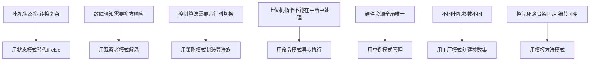

# SYS-01 设计模式在电机控制中的应用

**模块编号：** SYS-01
**模块名称：** 设计模式在电机控制中的应用（Design Patterns in Motor Control Software）
**文档版本：** v2.0
**适用对象：** 具备C语言和电机控制基础的嵌入式工程师
**前置知识：** ALG-05 有感FOC实现、C语言函数指针、基本面向对象思想
**难度等级：** ★★★☆☆

---

## 1. 核心摘要

**一句话：** 设计模式不是Java/C++的专利——用函数指针和结构体，C语言一样能实现状态模式、策略模式、观察者模式等核心设计模式，让电机控制代码从"面条式if-else"蜕变为"可扩展、可维护的工业级架构"。

**认知挂钩：** 把电机控制软件想象成一座工厂：状态模式是车间主任，决定当前在哪个工序；策略模式是工艺卡，同一产品可以切换不同工艺流程；观察者模式是广播系统，出了事故所有人都能听到；命令模式是工单系统，指令排队执行不堵生产线；单例模式是唯一设备，一台电机只有一个PWM定时器；工厂模式是配方库，不同电机用不同参数配方；模板方法模式是标准作业流程，固定步骤中允许定制化操作。

**核心问题链：**



**设计模式速查表：**

| 设计模式 | 电机控制场景 | C语言实现核心 | 解决的痛点 |
|---------|-------------|-------------|-----------|
| 状态模式 | 电机运行状态机 | 函数指针表 + 枚举 | 大量if-else/switch-case |
| 观察者模式 | 故障通知系统 | 回调函数链表 | 故障处理逻辑耦合 |
| 策略模式 | 控制算法切换 | 函数指针结构体 | 新增算法需改框架 |
| 命令模式 | 上位机指令处理 | 命令结构体 + 命令表 | 中断中处理复杂逻辑 |
| 单例模式 | 硬件资源管理 | 全局结构体 + 防重入 | 全局变量无保护 |
| 工厂模式 | 电机参数配置 | 参数表 + 查找函数 | 硬编码参数不灵活 |
| 模板方法模式 | 控制环路框架 | 基函数 + 钩子函数 | 算法步骤重复 |

---

## 2. 状态模式（State Pattern）——电机运行状态机

### 2.1 问题：为什么需要状态模式

电机控制天然是一个状态机。一个典型的FOC电机从上电到运行，经历以下阶段：

```
上电 → 偏置校准 → 定位(Align) → 开环启动(IF) → 闭环运行 → 故障停机
```

如果用传统的`switch-case`实现：

```c
// 传统实现：随着状态增多，代码急剧膨胀
void Motor_Run(void) {
    switch(motor_state) {
        case IDLE:
            if (start_cmd) {
                // 100行初始化代码...
                motor_state = ALIGN;
            }
            break;
        case ALIGN:
            if (align_done) {
                // 50行切换代码...
                motor_state = OPEN_LOOP;
            } else if (fault) {
                // 30行故障处理...
                motor_state = FAULT;
            }
            break;
        case OPEN_LOOP:
            // 又是100行...
            break;
        // ... 更多状态
    }
}
```

**问题：**
1. 所有状态的逻辑挤在一个函数里，函数长度失控
2. 新增状态需要修改这个巨型switch，违反开闭原则
3. 状态进入/退出动作难以统一管理
4. 无法单独测试某个状态的行为

### 2.2 状态定义与转换

#### 2.2.1 电机状态枚举

```c
/**
 * @brief 电机运行状态定义
 * 
 * 完整的FOC电机状态流转：
 *   IDLE → ALIGN → OPEN_LOOP → CLOSED_LOOP → IDLE
 *   任何状态 → FAULT（故障）
 *   FAULT → IDLE（故障清除后）
 */
typedef enum {
    MOTOR_STATE_IDLE = 0,       /* 空闲：等待启动命令 */
    MOTOR_STATE_ALIGN,          /* 定位：注入Id电流确定转子初始位置 */
    MOTOR_STATE_OPEN_LOOP,      /* 开环：IF启动，强制电角度旋转 */
    MOTOR_STATE_CLOSED_LOOP,    /* 闭环：观测器+PI闭环控制 */
    MOTOR_STATE_FAULT,          /* 故障：保护停机 */
    MOTOR_STATE_COUNT           /* 状态总数，用于数组边界检查 */
} EM_MotorState;
```

#### 2.2.2 状态转换图

```
                    ┌─────────────────────────────────────────┐
                    │           任何状态                        │
                    │     (过流/过压/过温/通信丢失)              │
                    │           ↓                              │
                    │     ┌──────────┐                         │
        故障清除     │     │  FAULT   │ ←─────────────────────  │
     ┌──────────────│     │ 故障停机  │                        │
     │              │     └──────────┘                         │
     │              │        ↓                                 │
     │              │     故障复位                               │
     │              │        ↓                                 │
     │              │     ┌──────────┐    启动命令              │
     │              └────│  IDLE    │ ←──────────────────────  │
     │                   │ 等待启动  │                          │
     │                   └──────────┘                          │
     │                      │ 启动命令                          │
     │                      ↓                                   │
     │                ┌──────────┐                              │
     │                │  ALIGN   │                              │
     │                │ 转子定位  │                              │
     │                └──────────┘                              │
     │                      │ 定位完成                           │
     │                      ↓                                   │
     │                ┌──────────┐                              │
     │                │OPEN_LOOP │                              │
     │                │ IF开环启动│                              │
     │                └──────────┘                              │
     │                      │ 角度误差<阈值 && 转速>阈值          │
     │                      ↓                                   │
     │                ┌──────────┐     停机命令                  │
     └───────────────│CLOSED_LOOP│──────────────────────────→  │
                      │ 闭环运行  │                              │
                      └──────────┘                              │
                                                               │
                    ┌─────────────────────────────────────────┘
                    │
                    │  各状态详细进入/退出条件：
                    │
                    │  IDLE → ALIGN:     收到启动命令
                    │  ALIGN → OPEN_LOOP: 定位超时或定位成功
                    │  OPEN_LOOP → CLOSED_LOOP: 
                    │      观测器角度与IF角度误差 < MOTOR_IF_ANGLE_ERROR
                    │      且连续满足 MOTOR_IF_SWITCH_COUNT 次
                    │  CLOSED_LOOP → IDLE: 收到停机命令
                    │  * → FAULT:       任何故障标志置位
                    │  FAULT → IDLE:     故障清除 + 复位命令
                    └─────────────────────────────────────────
```

#### 2.2.3 各状态的进入条件、执行动作、退出条件

| 状态 | 进入条件 | 执行动作 | 退出条件 |
|------|---------|---------|---------|
| **IDLE** | 上电复位 / 故障复位 / 停机完成 | PWM输出关闭；偏置校准使能；等待启动命令 | 收到`Motor_Start`命令 |
| **ALIGN** | IDLE收到启动命令 | 注入$d$轴电流$I_d = I_{align}$；角度锁定$\theta = 0$；$I_d$斜坡上升 | 定位计时到达`MOTOR_ALIGN_COUNT` |
| **OPEN_LOOP** | ALIGN完成 | IF模式：强制角度斜坡旋转；$I_q$斜坡上升；频率斜坡至目标值 | 角度误差连续N次小于阈值 |
| **CLOSED_LOOP** | IF→闭环切换条件满足 | 观测器提供角度/速度；速度PI闭环；电流PI闭环；弱磁控制 | 收到`Motor_Stop`命令 |
| **FAULT** | 任何故障标志置位 | PWM立即关闭；故障码记录；LED闪烁报警 | 故障清除 + 收到复位命令 |

### 2.3 C语言实现：函数指针表 + 状态变量

#### 2.3.1 状态接口定义

```c
/**
 * @brief 状态处理函数类型
 * 
 * 每个状态有三个处理函数：
 *   OnEntry  - 进入状态时执行一次（初始化该状态的资源）
 *   OnRun    - 每个控制周期执行（该状态的核心逻辑）
 *   OnExit   - 退出状态时执行一次（清理该状态的资源）
 */
typedef void (*StateHandler)(ST_MOTOR_TASK *pMotor);

/**
 * @brief 状态描述结构体
 * 
 * 将一个状态的所有行为封装在一个结构体中，
 * 类似面向对象中"一个类封装其所有方法"的思想
 */
typedef struct {
    StateHandler    onEntry;    /* 进入状态动作 */
    StateHandler    onRun;      /* 状态运行动作（每个控制周期调用） */
    StateHandler    onExit;     /* 退出状态动作 */
    const char     *name;       /* 状态名称（调试用） */
} ST_StateDescriptor;
```

#### 2.3.2 各状态处理函数实现

```c
/* ============================================================
 * IDLE 状态处理
 * ============================================================ */
static void State_Idle_OnEntry(ST_MOTOR_TASK *pMotor)
{
    /* 关闭PWM输出 */
    BSP_PWM_Output_Disable();
    /* 启动偏置校准 */
    MCFOC_Offset_Check_Init_F(&pMotor->MCFOC_OFFSET);
    /* 清除运行标志 */
    pMotor->Motor_State_Flag.bit.motor_run_flag = 0;
}

static void State_Idle_OnRun(ST_MOTOR_TASK *pMotor)
{
    /* 执行偏置校准（每次电流中断调用） */
    MCFOC_Offset_Check(&pMotor->MCFOC_OFFSET, &pMotor->PMSM_ELEC_CTRL);
}

static void State_Idle_OnExit(ST_MOTOR_TASK *pMotor)
{
    /* 偏置校准完成，保存偏置值 */
    /* 无需额外操作，偏置值已在结构体中 */
}

/* ============================================================
 * ALIGN 状态处理
 * ============================================================ */
static void State_Align_OnEntry(ST_MOTOR_TASK *pMotor)
{
    /* 初始化ALIGN控制器 */
    MCFOC_ALIGN_Init_F(&pMotor->ALIGN_CTRL);
    /* 使能PWM输出 */
    BSP_PWM_Output_Enable();
    /* 设置运行标志 */
    pMotor->Motor_State_Flag.bit.motor_run_flag = 1;
}

static void State_Align_OnRun(ST_MOTOR_TASK *pMotor)
{
    /* ALIGN速度环：Id斜坡上升至目标值，角度锁定0 */
    MCFOC_ALIGN_SpeedLoop_F(&pMotor->ALIGN_CTRL);
    /* ALIGN电流环：Id闭环控制 */
    MCFOC_ALIGN_CurrentLoop_F(&pMotor->ALIGN_CTRL);
}

static void State_Align_OnExit(ST_MOTOR_TASK *pMotor)
{
    /* ALIGN完成，记录转子初始位置 */
    /* 无需额外操作，角度已在PMSM_ELEC_CTRL中 */
}

/* ============================================================
 * OPEN_LOOP (IF) 状态处理
 * ============================================================ */
static void State_OpenLoop_OnEntry(ST_MOTOR_TASK *pMotor)
{
    /* 初始化IF控制器 */
    MCFOC_IF_Init_F(&pMotor->IF_CTRL);
    /* 切换到开环模式 */
    pMotor->Motor_Loop_Mode = MOTOR_OPENLOOP;
}

static void State_OpenLoop_OnRun(ST_MOTOR_TASK *pMotor)
{
    /* IF速度环：Iq斜坡上升，频率斜坡上升 */
    MCFOC_IF_SpeedLoop_F(&pMotor->IF_CTRL, &pMotor->PMSM_ELEC_CTRL);
    /* IF电流环：dq电流闭环控制 */
    MCFOC_IF_CurrentLoop_F(&pMotor->IF_CTRL, &pMotor->PMSM_ELEC_CTRL, 
                           &pMotor->PMSM_PARA_CTRL);
}

static void State_OpenLoop_OnExit(ST_MOTOR_TASK *pMotor)
{
    /* 开环退出时，切换角度源为观测器 */
    /* 无需额外操作，状态切换时自动使用观测器角度 */
}

/* ============================================================
 * CLOSED_LOOP 状态处理
 * ============================================================ */
static void State_ClosedLoop_OnEntry(ST_MOTOR_TASK *pMotor)
{
    /* 初始化速度环和电流环 */
    MCFOC_SpeedLoop_Init_F(&pMotor->FREQ_CTRL);
    MCFOC_CurrentLoop_Init_F(&pMotor->CURRENT_CTRL);
    /* 切换到闭环模式 */
    pMotor->Motor_Loop_Mode = MOTOR_CLOSELOOP;
}

static void State_ClosedLoop_OnRun(ST_MOTOR_TASK *pMotor)
{
    /* 速度环：速度PI → Iq参考 */
    MCFOC_SpeedLoop_F(&pMotor->FREQ_CTRL, &pMotor->PMSM_ELEC_CTRL, 
                      &pMotor->PMSM_PARA_CTRL);
    /* 电流环：电流PI → Vd/Vq */
    MCFOC_CurrentLoop_F(&pMotor->CURRENT_CTRL, &pMotor->PMSM_ELEC_CTRL);
}

static void State_ClosedLoop_OnExit(ST_MOTOR_TASK *pMotor)
{
    /* 闭环退出，准备停机 */
    /* 无需额外操作 */
}

/* ============================================================
 * FAULT 状态处理
 * ============================================================ */
static void State_Fault_OnEntry(ST_MOTOR_TASK *pMotor)
{
    /* 立即关闭PWM输出（安全第一） */
    BSP_PWM_Output_Disable();
    /* 清除运行标志 */
    pMotor->Motor_State_Flag.bit.motor_run_flag = 0;
    /* 故障码已在MC_Error模块中记录 */
}

static void State_Fault_OnRun(ST_MOTOR_TASK *pMotor)
{
    /* 故障状态：持续监测故障是否清除 */
    /* 可选：LED闪烁报警 */
}

static void State_Fault_OnExit(ST_MOTOR_TASK *pMotor)
{
    /* 清除故障标志 */
    MC_Error_Clear(&pMotor->MC_ERR);
}
```

#### 2.3.3 状态描述表（核心：函数指针表）

```c
/**
 * @brief 状态描述表
 * 
 * 这是状态模式的核心：将每个状态的行为封装为一张表，
 * 通过索引（枚举值）直接查找，无需switch-case。
 * 
 * 新增状态只需：
 *   1. 在枚举中添加新状态
 *   2. 实现该状态的三个处理函数
 *   3. 在此表中添加一行
 *   无需修改任何已有代码！
 */
static const ST_StateDescriptor StateTable[MOTOR_STATE_COUNT] = {
    /*  onEntry                 onRun                    onExit                  name        */
    { State_Idle_OnEntry,      State_Idle_OnRun,       State_Idle_OnExit,      "IDLE"       },
    { State_Align_OnEntry,     State_Align_OnRun,      State_Align_OnExit,     "ALIGN"      },
    { State_OpenLoop_OnEntry,  State_OpenLoop_OnRun,   State_OpenLoop_OnExit,  "OPEN_LOOP"  },
    { State_ClosedLoop_OnEntry,State_ClosedLoop_OnRun, State_ClosedLoop_OnExit,"CLOSED_LOOP"},
    { State_Fault_OnEntry,     State_Fault_OnRun,      State_Fault_OnExit,     "FAULT"      },
};
```

#### 2.3.4 状态机引擎

```c
/**
 * @brief 状态机引擎
 * 
 * 核心逻辑：
 *   1. 执行当前状态的OnRun
 *   2. 检查状态转换条件
 *   3. 如果需要转换，执行旧状态OnExit → 更新状态 → 执行新状态OnEntry
 * 
 * @param pMotor 电机任务结构体指针
 * @param newState 目标状态（MOTOR_STATE_COUNT表示不转换）
 */
static void Motor_StateEngine(ST_MOTOR_TASK *pMotor, EM_MotorState newState)
{
    EM_MotorState currentState = pMotor->Motor_Flow;
    
    /* 执行当前状态的周期动作 */
    if (currentState < MOTOR_STATE_COUNT) {
        StateTable[currentState].onRun(pMotor);
    }
    
    /* 检查是否需要状态转换 */
    if (newState != currentState && newState < MOTOR_STATE_COUNT) {
        /* 执行旧状态的退出动作 */
        if (currentState < MOTOR_STATE_COUNT) {
            StateTable[currentState].onExit(pMotor);
        }
        
        /* 更新状态 */
        pMotor->Motor_Flow = newState;
        
        /* 执行新状态的进入动作 */
        StateTable[newState].onEntry(pMotor);
    }
}

/**
 * @brief 速度环状态转换判断
 * 
 * 在速度环中断中调用，判断状态转换条件
 */
void MotorTask_Speed_Flow_F(ST_MOTOR_TASK *pMotor)
{
    EM_MotorState nextState = pMotor->Motor_Flow;
    
    switch (pMotor->Motor_Flow) {
    case MOTOR_STATE_IDLE:
        /* IDLE → ALIGN：收到启动命令 */
        if (pMotor->Motor_State_Flag.bit.motor_run_flag) {
            nextState = MOTOR_STATE_ALIGN;
        }
        break;
        
    case MOTOR_STATE_ALIGN:
        /* ALIGN → OPEN_LOOP：定位完成 */
        if (pMotor->ALIGN_CTRL._V_Q32U_Align_Check_cnt >= 
            pMotor->ALIGN_CTRL._P_Q32U_Align_Check_Count) {
            nextState = MOTOR_STATE_OPEN_LOOP;
        }
        break;
        
    case MOTOR_STATE_OPEN_LOOP:
        /* OPEN_LOOP → CLOSED_LOOP：IF切换条件满足 */
        if (pMotor->IF_CTRL._O_Q32U_Switch_Flag) {
            nextState = MOTOR_STATE_CLOSED_LOOP;
        }
        break;
        
    case MOTOR_STATE_CLOSED_LOOP:
        /* CLOSED_LOOP → IDLE：收到停机命令 */
        if (!pMotor->Motor_State_Flag.bit.motor_run_flag) {
            nextState = MOTOR_STATE_IDLE;
        }
        break;
        
    case MOTOR_STATE_FAULT:
        /* FAULT → IDLE：故障清除 */
        if (pMotor->MC_ERR.Motor_Error_Flag.all == 0) {
            nextState = MOTOR_STATE_IDLE;
        }
        break;
        
    default:
        nextState = MOTOR_STATE_FAULT;
        break;
    }
    
    /* 全局故障检查：任何状态均可转入FAULT */
    if (pMotor->MC_ERR.Motor_Error_Flag.all != 0 && 
        pMotor->Motor_Flow != MOTOR_STATE_FAULT) {
        nextState = MOTOR_STATE_FAULT;
    }
    
    /* 执行状态机引擎 */
    Motor_StateEngine(pMotor, nextState);
}
```

### 2.4 优势分析

| 对比维度 | switch-case实现 | 状态模式实现 |
|---------|----------------|------------|
| 新增状态 | 修改巨型switch函数 | 新增3个处理函数 + 表中加1行 |
| 代码可读性 | 所有逻辑混在一起 | 每个状态独立，职责清晰 |
| 进入/退出动作 | 容易遗漏 | 框架保证自动调用 |
| 可测试性 | 难以单独测试某状态 | 每个状态可独立测试 |
| Flash占用 | 可能更大（分支预测差） | 函数指针表紧凑 |
| RAM占用 | 仅状态变量 | 状态变量 + 函数指针表（const，在Flash中） |

> **注意：** 函数指针表是`const`的，存储在Flash中，不占用RAM。每次状态查找仅需一次数组索引，时间复杂度$O(1)$，远优于switch-case的分支预测开销。

---

## 3. 观察者模式（Observer Pattern）——故障通知

### 3.1 问题：为什么需要观察者模式

电机控制系统中的故障事件需要多方响应：

```
过流事件发生 → 保护模块（立即关PWM）+ 日志模块（记录故障码）+ LED模块（闪烁报警）+ 上位机（发送故障帧）
```

如果直接在故障检测代码中调用所有响应函数：

```c
// 糟糕的实现：故障检测与处理逻辑严重耦合
void Check_OverCurrent(void) {
    if (current > threshold) {
        PWM_Disable();           // 保护
        Log_Write(ERR_OVERCURRENT); // 日志
        LED_Blink(FAST);         // LED
        UART_SendFault(ERR_OVERCURRENT); // 上位机
        // 新增需求？继续加...
    }
}
```

**问题：**
1. 新增订阅者（如新增CAN通知）需要修改故障检测代码
2. 不同故障的处理逻辑可能不同，代码急剧膨胀
3. 无法动态增减订阅者
4. 故障检测模块与所有响应模块形成强耦合

### 3.2 观察者模式设计

#### 3.2.1 故障事件定义

```c
/**
 * @brief 故障事件类型
 */
typedef enum {
    FAULT_OVER_CURRENT = 0,     /* 过流 */
    FAULT_OVER_VOLTAGE,         /* 过压 */
    FAULT_UNDER_VOLTAGE,        /* 欠压 */
    FAULT_OVER_TEMP,            /* 过温 */
    FAULT_COMM_LOSS,            /* 通信丢失 */
    FAULT_ROTOR_LOCK,           /* 堵转 */
    FAULT_PHASE_LOSS,           /* 缺相 */
    FAULT_TYPE_COUNT            /* 故障类型总数 */
} EM_FaultType;

/**
 * @brief 故障事件数据
 * 
 * 携带故障的详细信息，传递给所有订阅者
 */
typedef struct {
    EM_FaultType    type;       /* 故障类型 */
    uint32_t        timestamp;  /* 故障发生时刻（ms） */
    float           value;      /* 触发故障的物理量值 */
    float           threshold;  /* 故障阈值 */
} ST_FaultEvent;
```

#### 3.2.2 回调函数类型与订阅者链表

```c
/**
 * @brief 故障通知回调函数类型
 * 
 * @param pEvent 故障事件数据指针
 */
typedef void (*FaultCallback)(const ST_FaultEvent *pEvent);

/**
 * @brief 订阅者节点
 * 
 * 使用链表管理订阅者，支持动态增减
 */
typedef struct FaultSubscriber {
    FaultCallback           callback;       /* 回调函数 */
    struct FaultSubscriber *pNext;          /* 下一个订阅者 */
} ST_FaultSubscriber;

/**
 * @brief 故障主题（Subject）
 * 
 * 每种故障类型维护一个订阅者链表
 */
typedef struct {
    ST_FaultSubscriber *pHead[FAULT_TYPE_COUNT]; /* 每种故障的订阅者链表头 */
    ST_FaultEvent       lastEvent;                /* 最近一次故障事件 */
} ST_FaultSubject;
```

#### 3.2.3 观察者模式核心实现

```c
/* 全局唯一的故障主题实例 */
static ST_FaultSubject g_faultSubject = {0};

/**
 * @brief 订阅故障事件
 * 
 * @param type 故障类型
 * @param callback 回调函数
 * @return 0=成功, -1=失败
 */
int Fault_Subscribe(EM_FaultType type, FaultCallback callback)
{
    if (type >= FAULT_TYPE_COUNT || callback == NULL) {
        return -1;
    }
    
    /* 分配订阅者节点（实际项目中应使用内存池） */
    ST_FaultSubscriber *pSub = (ST_FaultSubscriber *)malloc(sizeof(ST_FaultSubscriber));
    if (pSub == NULL) {
        return -1;
    }
    
    pSub->callback = callback;
    pSub->pNext = NULL;
    
    /* 头插法加入链表 */
    pSub->pNext = g_faultSubject.pHead[type];
    g_faultSubject.pHead[type] = pSub;
    
    return 0;
}

/**
 * @brief 发布故障事件
 * 
 * 遍历该故障类型的所有订阅者，依次调用回调函数
 * 
 * @param type 故障类型
 * @param value 触发故障的物理量值
 * @param threshold 故障阈值
 */
void Fault_Notify(EM_FaultType type, float value, float threshold)
{
    if (type >= FAULT_TYPE_COUNT) {
        return;
    }
    
    /* 构造故障事件 */
    ST_FaultEvent event = {
        .type      = type,
        .timestamp = HAL_GetTick(),
        .value     = value,
        .threshold = threshold
    };
    
    g_faultSubject.lastEvent = event;
    
    /* 通知所有订阅者 */
    ST_FaultSubscriber *pSub = g_faultSubject.pHead[type];
    while (pSub != NULL) {
        pSub->callback(&event);
        pSub = pSub->pNext;
    }
}

/**
 * @brief 取消订阅
 */
int Fault_Unsubscribe(EM_FaultType type, FaultCallback callback)
{
    if (type >= FAULT_TYPE_COUNT || callback == NULL) {
        return -1;
    }
    
    ST_FaultSubscriber *pPrev = NULL;
    ST_FaultSubscriber *pCurr = g_faultSubject.pHead[type];
    
    while (pCurr != NULL) {
        if (pCurr->callback == callback) {
            if (pPrev == NULL) {
                g_faultSubject.pHead[type] = pCurr->pNext;
            } else {
                pPrev->pNext = pCurr->pNext;
            }
            free(pCurr);
            return 0;
        }
        pPrev = pCurr;
        pCurr = pCurr->pNext;
    }
    
    return -1;
}
```

#### 3.2.4 订阅者实现示例

```c
/* 保护模块：立即关闭PWM */
static void Protection_OnFault(const ST_FaultEvent *pEvent)
{
    /* 任何故障都立即关闭PWM输出 */
    BSP_PWM_Output_Disable();
}

/* 日志模块：记录故障信息 */
static void Logger_OnFault(const ST_FaultEvent *pEvent)
{
    /* 将故障信息写入环形缓冲区 */
    Log_Write(pEvent->type, pEvent->timestamp, pEvent->value, pEvent->threshold);
}

/* LED模块：故障指示 */
static void LED_OnFault(const ST_FaultEvent *pEvent)
{
    switch (pEvent->type) {
    case FAULT_OVER_CURRENT: LED_SetPattern(LED_FAST_BLINK, 2); break;  /* 快闪2次 */
    case FAULT_OVER_VOLTAGE: LED_SetPattern(LED_FAST_BLINK, 3); break;  /* 快闪3次 */
    case FAULT_OVER_TEMP:    LED_SetPattern(LED_SLOW_BLINK, 0); break;  /* 慢闪 */
    default:                 LED_SetPattern(LED_ON, 0);           break; /* 常亮 */
    }
}

/* 上位机通知模块：发送故障帧 */
static void HostComm_OnFault(const ST_FaultEvent *pEvent)
{
    uint8_t frame[8];
    frame[0] = 0xAA;                              /* 帧头 */
    frame[1] = 0x01;                              /* 命令字：故障通知 */
    frame[2] = (uint8_t)pEvent->type;             /* 故障类型 */
    memcpy(&frame[3], &pEvent->value, 4);         /* 故障值（float） */
    frame[7] = CRC8(frame, 7);                    /* 校验 */
    UART_Send(frame, 8);
}

/**
 * @brief 初始化故障通知系统
 * 
 * 注册所有订阅者
 */
void Fault_System_Init(void)
{
    /* 保护模块订阅所有故障 */
    for (int i = 0; i < FAULT_TYPE_COUNT; i++) {
        Fault_Subscribe(i, Protection_OnFault);
    }
    
    /* 日志模块订阅所有故障 */
    for (int i = 0; i < FAULT_TYPE_COUNT; i++) {
        Fault_Subscribe(i, Logger_OnFault);
    }
    
    /* LED模块订阅所有故障 */
    for (int i = 0; i < FAULT_TYPE_COUNT; i++) {
        Fault_Subscribe(i, LED_OnFault);
    }
    
    /* 上位机仅订阅关键故障 */
    Fault_Subscribe(FAULT_OVER_CURRENT, HostComm_OnFault);
    Fault_Subscribe(FAULT_OVER_VOLTAGE, HostComm_OnFault);
    Fault_Subscribe(FAULT_OVER_TEMP,    HostComm_OnFault);
}
```

#### 3.2.5 故障发布示例

```c
/**
 * @brief 在MC_ERR模块中发布故障事件
 * 
 * 替代原来直接调用处理函数的方式
 */
void MC_Error_Current_Flow(ST_MOTOR_ERROR *pERR)
{
    float current_pu = pERR->_I_Q14U_Iphase_Max_pu / (float)Q14U_MAX;
    float current_A  = current_pu * I_BASE;
    
    /* 过流检测（使用ST_CHECK延时确认） */
    if (MATH_CHECK_Rise(&pERR->Over_Current1, 
                        current_pu > CURRENT_PROTECT_LEVEL_1_TL)) {
        pERR->Motor_Error_Flag.bit.over_current1 = 1;
        /* 发布故障事件 */
        Fault_Notify(FAULT_OVER_CURRENT, current_A, 
                     CURRENT_PROTECT_LEVEL_1_TL * I_BASE);
    }
}
```

### 3.3 优势分析

| 对比维度 | 直接调用 | 观察者模式 |
|---------|---------|-----------|
| 新增订阅者 | 修改发布者代码 | 注册新回调即可 |
| 订阅者数量 | 编译时固定 | 运行时动态 |
| 发布者与订阅者耦合 | 强耦合 | 完全解耦 |
| 选择性订阅 | 需要条件判断 | 按类型注册 |
| 可测试性 | 难以单独测试 | 每个订阅者独立测试 |

> **实时性警告：** 观察者模式中，`Fault_Notify`是同步调用所有回调。在电流中断中调用时，必须确保所有回调函数执行时间之和不超过中断时限。对于保护模块这种必须立即响应的场景，建议放在链表头部，确保最先执行。

---

## 4. 策略模式（Strategy Pattern）——控制算法切换

### 4.1 问题：为什么需要策略模式

电机控制存在多种控制算法，且可能需要运行时切换：

| 控制策略 | 适用场景 | 特点 |
|---------|---------|------|
| 有感FOC | 高精度伺服 | 需要编码器，性能最优 |
| 无感FOC | 成本敏感 | 无需编码器，低速性能受限 |
| 六步换相 | BLDC电机 | 算法简单，转矩脉动大 |
| V/F控制 | 风机水泵 | 最简单，无闭环 |

如果硬编码：

```c
// 糟糕的实现：控制算法与框架耦合
void Motor_CurrentLoop(void) {
    #ifdef USE_FOC_SENSORED
        FOC_Sensored_CurrentLoop();
    #elif USE_FOC_SENSORLESS
        FOC_Sensorless_CurrentLoop();
    #elif USE_SIX_STEP
        SixStep_CurrentLoop();
    #elif USE_VF
        VF_CurrentLoop();
    #endif
}
```

**问题：**
1. 编译时确定，无法运行时切换
2. 新增算法需要修改框架代码
3. 多算法共存时代码膨胀
4. 无法根据工况自动选择最优策略

### 4.2 策略模式设计

#### 4.2.1 策略接口定义

```c
/**
 * @brief 控制策略接口
 * 
 * 所有控制算法必须实现这组统一接口，
 * 类似面向对象中的"纯虚函数"或"接口类"
 */
typedef struct {
    /* 生命周期管理 */
    void (*init)(ST_MOTOR_TASK *pMotor);       /* 初始化策略 */
    void (*deinit)(ST_MOTOR_TASK *pMotor);     /* 反初始化策略 */
    
    /* 控制环路 */
    void (*speedLoop)(ST_MOTOR_TASK *pMotor);  /* 速度环计算 */
    void (*currentLoop)(ST_MOTOR_TASK *pMotor);/* 电流环计算 */
    
    /* 观测器 */
    void (*observer)(ST_MOTOR_TASK *pMotor);   /* 观测器计算 */
    void (*observerAdapt)(ST_MOTOR_TASK *pMotor); /* 观测器参数自适应 */
    
    /* 状态查询 */
    float (*getSpeed)(ST_MOTOR_TASK *pMotor);  /* 获取当前速度 */
    float (*getAngle)(ST_MOTOR_TASK *pMotor);  /* 获取转子角度 */
    
    /* 策略标识 */
    const char *name;                          /* 策略名称 */
} ST_ControlStrategy;
```

#### 4.2.2 具体策略实现

```c
/* ============================================================
 * 策略1：有感FOC（Sensored FOC）
 * ============================================================ */
static void FOC_Sensored_Init(ST_MOTOR_TASK *pMotor)
{
    MCFOC_SpeedLoop_Init_F(&pMotor->FREQ_CTRL);
    MCFOC_CurrentLoop_Init_F(&pMotor->CURRENT_CTRL);
    Encoder_Init();  /* 编码器初始化 */
}

static void FOC_Sensored_SpeedLoop(ST_MOTOR_TASK *pMotor)
{
    MCFOC_SpeedLoop_F(&pMotor->FREQ_CTRL, &pMotor->PMSM_ELEC_CTRL, 
                      &pMotor->PMSM_PARA_CTRL);
}

static void FOC_Sensored_CurrentLoop(ST_MOTOR_TASK *pMotor)
{
    MCFOC_CurrentLoop_F(&pMotor->CURRENT_CTRL, &pMotor->PMSM_ELEC_CTRL);
}

static void FOC_Sensored_Observer(ST_MOTOR_TASK *pMotor)
{
    /* 有感模式：直接读取编码器角度，无需观测器 */
    Encoder_Update(&pMotor->PMSM_ELEC_CTRL);
}

static void FOC_Sensored_ObserverAdapt(ST_MOTOR_TASK *pMotor)
{
    /* 有感模式无需参数自适应 */
}

static float FOC_Sensored_GetSpeed(ST_MOTOR_TASK *pMotor)
{
    return Encoder_GetSpeed_rpm();
}

static float FOC_Sensored_GetAngle(ST_MOTOR_TASK *pMotor)
{
    return pMotor->PMSM_ELEC_CTRL._O_F_Elec_Angle;
}

/* 有感FOC策略实例 */
const ST_ControlStrategy Strategy_FOC_Sensored = {
    .init          = FOC_Sensored_Init,
    .deinit        = NULL,
    .speedLoop     = FOC_Sensored_SpeedLoop,
    .currentLoop   = FOC_Sensored_CurrentLoop,
    .observer      = FOC_Sensored_Observer,
    .observerAdapt = FOC_Sensored_ObserverAdapt,
    .getSpeed      = FOC_Sensored_GetSpeed,
    .getAngle      = FOC_Sensored_GetAngle,
    .name          = "FOC_Sensored"
};

/* ============================================================
 * 策略2：无感FOC - SMO观测器（Sensorless FOC with SMO）
 * ============================================================ */
static void FOC_SMO_Init(ST_MOTOR_TASK *pMotor)
{
    MCFOC_SpeedLoop_Init_F(&pMotor->FREQ_CTRL);
    MCFOC_CurrentLoop_Init_F(&pMotor->CURRENT_CTRL);
    MCFOC_EST_SMO_Init_F(&pMotor->SMO_CTRL);
}

static void FOC_SMO_Observer(ST_MOTOR_TASK *pMotor)
{
    /* 无感模式：使用SMO观测器估计转子角度 */
    MCFOC_EST_SMO_F(&pMotor->SMO_CTRL, &pMotor->PMSM_ELEC_CTRL);
}

static void FOC_SMO_ObserverAdapt(ST_MOTOR_TASK *pMotor)
{
    /* SMO参数自适应：增益随速度变化 */
    MCFOC_EST_SMO_Adapt_F(&pMotor->SMO_CTRL, &pMotor->PMSM_ELEC_CTRL, 
                          &pMotor->PMSM_PARA_CTRL);
}

static float FOC_SMO_GetSpeed(ST_MOTOR_TASK *pMotor)
{
    return pMotor->SMO_CTRL.FL_SMO_FREQ.F_LPF_Out * F_BASE * 60.0f / MOTOR_POLE_PAIR;
}

static float FOC_SMO_GetAngle(ST_MOTOR_TASK *pMotor)
{
    return pMotor->SMO_CTRL.TG_SMO_Triangle.F_Out;
}

/* 无感FOC-SMO策略实例 */
const ST_ControlStrategy Strategy_FOC_SMO = {
    .init          = FOC_SMO_Init,
    .deinit        = NULL,
    .speedLoop     = FOC_Sensored_SpeedLoop,   /* 速度环算法相同，复用 */
    .currentLoop   = FOC_Sensored_CurrentLoop,  /* 电流环算法相同，复用 */
    .observer      = FOC_SMO_Observer,
    .observerAdapt = FOC_SMO_ObserverAdapt,
    .getSpeed      = FOC_SMO_GetSpeed,
    .getAngle      = FOC_SMO_GetAngle,
    .name          = "FOC_SMO"
};

/* ============================================================
 * 策略3：无感FOC - 磁链观测器（Sensorless FOC with Flux Observer）
 * ============================================================ */
static void FOC_Flux_Init(ST_MOTOR_TASK *pMotor)
{
    MCFOC_SpeedLoop_Init_F(&pMotor->FREQ_CTRL);
    MCFOC_CurrentLoop_Init_F(&pMotor->CURRENT_CTRL);
    MCFOC_EST_FLUX_Init_F(&pMotor->FLUX_CTRL);
}

static void FOC_Flux_Observer(ST_MOTOR_TASK *pMotor)
{
    MCFOC_EST_FLUX_F(&pMotor->FLUX_CTRL, &pMotor->PMSM_ELEC_CTRL);
}

static void FOC_Flux_ObserverAdapt(ST_MOTOR_TASK *pMotor)
{
    MCFOC_EST_FLUX_Adapt_F(&pMotor->FLUX_CTRL, &pMotor->PMSM_ELEC_CTRL, 
                           &pMotor->PMSM_PARA_CTRL);
}

static float FOC_Flux_GetSpeed(ST_MOTOR_TASK *pMotor)
{
    return pMotor->FLUX_CTRL.FL_FLUX_FREQ.F_LPF_Out * F_BASE * 60.0f / MOTOR_POLE_PAIR;
}

static float FOC_Flux_GetAngle(ST_MOTOR_TASK *pMotor)
{
    return pMotor->FLUX_CTRL.TG_FLUX_Triangle.F_Out;
}

/* 无感FOC-Flux策略实例 */
const ST_ControlStrategy Strategy_FOC_Flux = {
    .init          = FOC_Flux_Init,
    .deinit        = NULL,
    .speedLoop     = FOC_Sensored_SpeedLoop,   /* 速度环复用 */
    .currentLoop   = FOC_Sensored_CurrentLoop,  /* 电流环复用 */
    .observer      = FOC_Flux_Observer,
    .observerAdapt = FOC_Flux_ObserverAdapt,
    .getSpeed      = FOC_Flux_GetSpeed,
    .getAngle      = FOC_Flux_GetAngle,
    .name          = "FOC_Flux"
};

/* ============================================================
 * 策略4：六步换相（Six-Step Commutation）
 * ============================================================ */
static void SixStep_Init(ST_MOTOR_TASK *pMotor)
{
    MCSQ_BLDC_Init();
}

static void SixStep_SpeedLoop(ST_MOTOR_TASK *pMotor)
{
    MCSQ_Speed_Loop();
}

static void SixStep_CurrentLoop(ST_MOTOR_TASK *pMotor)
{
    MCSQ_Current_Loop();
}

static void SixStep_Observer(ST_MOTOR_TASK *pMotor)
{
    /* 六步换相：反电动势过零检测 */
    MCSQ_BEMF_Detect();
}

/* 六步换相策略实例 */
const ST_ControlStrategy Strategy_SixStep = {
    .init          = SixStep_Init,
    .deinit        = NULL,
    .speedLoop     = SixStep_SpeedLoop,
    .currentLoop   = SixStep_CurrentLoop,
    .observer      = SixStep_Observer,
    .observerAdapt = NULL,
    .getSpeed      = NULL,  /* 由MCSQ模块内部管理 */
    .getAngle      = NULL,  /* 六步换相不需要精确角度 */
    .name          = "SixStep"
};
```

#### 4.2.3 策略上下文（Context）

```c
/**
 * @brief 策略上下文
 * 
 * 持有当前策略的指针，通过统一接口调用
 */
typedef struct {
    const ST_ControlStrategy *pStrategy;   /* 当前策略指针 */
    EM_MotorState             state;       /* 当前电机状态 */
} ST_StrategyContext;

/* 全局策略上下文 */
static ST_StrategyContext g_strategyCtx = {0};

/**
 * @brief 设置控制策略
 * 
 * 运行时切换控制算法
 * 
 * @param pStrategy 新策略指针
 * @return 0=成功, -1=失败
 */
int Motor_SetStrategy(const ST_ControlStrategy *pStrategy)
{
    if (pStrategy == NULL) {
        return -1;
    }
    
    /* 反初始化旧策略 */
    if (g_strategyCtx.pStrategy != NULL && 
        g_strategyCtx.pStrategy->deinit != NULL) {
        g_strategyCtx.pStrategy->deinit(&Motor_F);
    }
    
    /* 切换策略 */
    g_strategyCtx.pStrategy = pStrategy;
    
    /* 初始化新策略 */
    if (pStrategy->init != NULL) {
        pStrategy->init(&Motor_F);
    }
    
    return 0;
}

/**
 * @brief 速度环入口（策略模式调用）
 */
void MotorTask_Speed_Flow_F(ST_MOTOR_TASK *pMotor)
{
    if (g_strategyCtx.pStrategy != NULL && 
        g_strategyCtx.pStrategy->speedLoop != NULL) {
        g_strategyCtx.pStrategy->speedLoop(pMotor);
    }
}

/**
 * @brief 电流环入口（策略模式调用）
 */
void MotorTask_Current_Flow_F(ST_MOTOR_TASK *pMotor)
{
    if (g_strategyCtx.pStrategy != NULL && 
        g_strategyCtx.pStrategy->currentLoop != NULL) {
        g_strategyCtx.pStrategy->currentLoop(pMotor);
    }
}
```

#### 4.2.4 运行时策略选择

```c
/**
 * @brief 根据工况自动选择控制策略
 * 
 * 示例：低速用有感FOC，高速切无感FOC
 */
void Motor_AutoSelectStrategy(ST_MOTOR_TASK *pMotor)
{
    float speed_rpm = 0;
    
    if (g_strategyCtx.pStrategy && g_strategyCtx.pStrategy->getSpeed) {
        speed_rpm = g_strategyCtx.pStrategy->getSpeed(pMotor);
    }
    
    /* 低速区域：使用有感FOC（编码器精度高） */
    if (speed_rpm < 500.0f && g_strategyCtx.pStrategy != &Strategy_FOC_Sensored) {
        Motor_SetStrategy(&Strategy_FOC_Sensored);
    }
    /* 中高速区域：使用无感FOC-SMO（避免编码器带宽限制） */
    else if (speed_rpm >= 500.0f && speed_rpm < 3000.0f && 
             g_strategyCtx.pStrategy != &Strategy_FOC_SMO) {
        Motor_SetStrategy(&Strategy_FOC_SMO);
    }
    /* 超高速区域：使用磁链观测器（SMO高速性能下降） */
    else if (speed_rpm >= 3000.0f && 
             g_strategyCtx.pStrategy != &Strategy_FOC_Flux) {
        Motor_SetStrategy(&Strategy_FOC_Flux);
    }
}
```

### 4.3 MC_LIB中的策略模式体现

MC_LIB通过**编译时宏定义**实现了策略模式的编译时版本：

```c
/* MCFOC_PARA_F.h 中的观测器策略选择 */
#if (MOTOR_EST_MODE == MOTOR_EST_SMO)
    #define Motor_EST_FUNCTION  MCFOC_EST_SMO_F(&pMotor->SMO_CTRL, &pMotor->PMSM_ELEC_CTRL)
#elif (MOTOR_EST_MODE == MOTOR_EST_FLUX)
    #define Motor_EST_FUNCTION  MCFOC_EST_FLUX_F(&pMotor->FLUX_CTRL, &pMotor->PMSM_ELEC_CTRL)
#endif

/* 采样策略选择 */
#ifdef MCFOC_CJYS_3
    #define MotorTask_Run_Flow_ADC_Read  MotorTask_Run_Flow_ADC_Read_Three_F
#elif MCFOC_CJYS_1
    #define MotorTask_Run_Flow_ADC_Read  MotorTask_Run_Flow_ADC_Read_One_F
#endif
```

这是策略模式的**编译时静态版本**——通过宏定义在编译期选择具体策略，优点是零运行时开销，缺点是无法运行时切换。

---

## 5. 命令模式（Command Pattern）——上位机指令处理

### 5.1 问题：为什么需要命令模式

上位机通过串口/CAN发送控制指令，如果在中断中直接处理：

```c
// 糟糕的实现：在中断中处理复杂逻辑
void UART_IRQHandler(void) {
    uint8_t cmd = UART_ReadByte();
    switch (cmd) {
    case CMD_START:
        Motor_Start();      // 可能耗时！
        break;
    case CMD_SET_SPEED:
        Motor_SetSpeed(UART_ReadDWord()); // 等待数据？
        break;
    // ...
    }
}
```

**问题：**
1. 中断中执行耗时操作，影响实时性
2. 命令参数可能跨多个字节，中断中难以处理
3. 新增命令需要修改中断处理函数
4. 无法实现命令的撤销/重做/日志

### 5.2 命令模式设计

#### 5.2.1 命令结构体定义

```c
/**
 * @brief 命令ID定义
 */
typedef enum {
    CMD_MOTOR_START = 0x01,     /* 启动电机 */
    CMD_MOTOR_STOP = 0x02,      /* 停止电机 */
    CMD_SET_SPEED = 0x03,       /* 设置目标转速 */
    CMD_SET_DIR = 0x04,         /* 设置方向 */
    CMD_CLEAR_FAULT = 0x05,     /* 清除故障 */
    CMD_READ_SPEED = 0x10,      /* 读取转速 */
    CMD_READ_CURRENT = 0x11,    /* 读取电流 */
    CMD_READ_ERROR = 0x12,      /* 读取故障码 */
    CMD_SET_PID_KP = 0x20,      /* 设置PID比例增益 */
    CMD_SET_PID_KI = 0x21,      /* 设置PID积分增益 */
    CMD_SAVE_PARAMS = 0x30,     /* 保存参数到Flash */
} EM_CommandID;

/**
 * @brief 命令对象
 * 
 * 将指令+参数封装为一个命令对象，
 * 类似面向对象中的"命令类"
 */
typedef struct {
    EM_CommandID    cmdId;              /* 命令ID */
    uint8_t         paramLen;           /* 参数长度 */
    uint8_t         params[8];          /* 参数数据 */
    uint32_t        timestamp;          /* 接收时间戳 */
} ST_Command;

/**
 * @brief 命令执行函数类型
 * 
 * @param pCmd 命令对象指针
 * @return 0=成功, 负数=错误码
 */
typedef int (*CommandExecutor)(const ST_Command *pCmd);
```

#### 5.2.2 命令队列

```c
/**
 * @brief 环形命令队列
 * 
 * ISR中入队，主循环中出队执行
 * 实现生产者-消费者模式
 */
#define CMD_QUEUE_SIZE  16

typedef struct {
    ST_Command  buffer[CMD_QUEUE_SIZE];
    volatile uint16_t head;     /* 出队位置（消费者） */
    volatile uint16_t tail;     /* 入队位置（生产者） */
} ST_CommandQueue;

static ST_CommandQueue g_cmdQueue = {0};

/**
 * @brief 命令入队（ISR中调用）
 */
int CmdQueue_Push(const ST_Command *pCmd)
{
    uint16_t nextTail = (g_cmdQueue.tail + 1) % CMD_QUEUE_SIZE;
    
    /* 队列满检查 */
    if (nextTail == g_cmdQueue.head) {
        return -1;  /* 队列满 */
    }
    
    g_cmdQueue.buffer[g_cmdQueue.tail] = *pCmd;
    g_cmdQueue.tail = nextTail;
    
    return 0;
}

/**
 * @brief 命令出队（主循环中调用）
 */
int CmdQueue_Pop(ST_Command *pCmd)
{
    /* 队列空检查 */
    if (g_cmdQueue.head == g_cmdQueue.tail) {
        return -1;  /* 队列空 */
    }
    
    *pCmd = g_cmdQueue.buffer[g_cmdQueue.head];
    g_cmdQueue.head = (g_cmdQueue.head + 1) % CMD_QUEUE_SIZE;
    
    return 0;
}
```

#### 5.2.3 命令表与命令分发

```c
/**
 * @brief 命令描述结构体
 */
typedef struct {
    EM_CommandID        cmdId;          /* 命令ID */
    CommandExecutor     executor;       /* 执行函数 */
    uint8_t             expectedLen;    /* 期望参数长度 */
    const char         *name;           /* 命令名称（调试用） */
} ST_CommandDescriptor;

/* 命令执行函数声明 */
static int Cmd_StartMotor(const ST_Command *pCmd);
static int Cmd_StopMotor(const ST_Command *pCmd);
static int Cmd_SetSpeed(const ST_Command *pCmd);
static int Cmd_SetDirection(const ST_Command *pCmd);
static int Cmd_ClearFault(const ST_Command *pCmd);
static int Cmd_ReadSpeed(const ST_Command *pCmd);
static int Cmd_ReadCurrent(const ST_Command *pCmd);
static int Cmd_ReadError(const ST_Command *pCmd);
static int Cmd_SetPID_Kp(const ST_Command *pCmd);
static int Cmd_SetPID_Ki(const ST_Command *pCmd);
static int Cmd_SaveParams(const ST_Command *pCmd);

/**
 * @brief 命令表
 * 
 * 命令ID作为索引，直接查找执行函数
 * 新增命令只需在此表中添加一行
 */
static const ST_CommandDescriptor CmdTable[] = {
    /* cmdId              executor          expectedLen  name           */
    { CMD_MOTOR_START,    Cmd_StartMotor,   0,           "START"       },
    { CMD_MOTOR_STOP,     Cmd_StopMotor,    0,           "STOP"        },
    { CMD_SET_SPEED,      Cmd_SetSpeed,     4,           "SET_SPEED"   },
    { CMD_SET_DIR,        Cmd_SetDirection, 1,           "SET_DIR"     },
    { CMD_CLEAR_FAULT,    Cmd_ClearFault,   0,           "CLR_FAULT"   },
    { CMD_READ_SPEED,     Cmd_ReadSpeed,    0,           "RD_SPEED"    },
    { CMD_READ_CURRENT,   Cmd_ReadCurrent,  0,           "RD_CURRENT"  },
    { CMD_READ_ERROR,     Cmd_ReadError,    0,           "RD_ERROR"    },
    { CMD_SET_PID_KP,     Cmd_SetPID_Kp,    4,           "SET_KP"      },
    { CMD_SET_PID_KI,     Cmd_SetPID_Ki,    4,           "SET_KI"      },
    { CMD_SAVE_PARAMS,    Cmd_SaveParams,   0,           "SAVE"        },
};

#define CMD_TABLE_SIZE  (sizeof(CmdTable) / sizeof(CmdTable[0]))
```

#### 5.2.4 命令执行函数实现

```c
static int Cmd_StartMotor(const ST_Command *pCmd)
{
    Motor_Start_F(&Motor_F);
    return 0;
}

static int Cmd_StopMotor(const ST_Command *pCmd)
{
    Motor_Stop_F(&Motor_F);
    return 0;
}

static int Cmd_SetSpeed(const ST_Command *pCmd)
{
    /* 参数：4字节int32，目标转速rpm */
    int32_t speed_rpm;
    memcpy(&speed_rpm, pCmd->params, 4);
    
    /* 限幅检查 */
    if (speed_rpm > (int32_t)MOTOR_MAX_SPEED || 
        speed_rpm < -(int32_t)MOTOR_MAX_SPEED) {
        return -2;  /* 参数超限 */
    }
    
    Motor_Set_Target_Speed_F(&Motor_F, speed_rpm);
    return 0;
}

static int Cmd_SetDirection(const ST_Command *pCmd)
{
    /* 参数：1字节，1=正转，-1=反转 */
    int8_t dir = (int8_t)pCmd->params[0];
    if (dir != 1 && dir != -1) {
        return -2;
    }
    Motor_Set_Dir_F(&Motor_F, dir);
    return 0;
}

static int Cmd_ClearFault(const ST_Command *pCmd)
{
    Motor_Clear_Error_F(&Motor_F);
    return 0;
}

static int Cmd_ReadSpeed(const ST_Command *pCmd)
{
    int32_t speed = Motor_Read_Speed_F(&Motor_F);
    /* 构造响应帧并发送 */
    uint8_t resp[6] = {0xAA, 0x10, 0x00, 0x00, 0x00, 0x00};
    memcpy(&resp[2], &speed, 4);
    resp[5] = CRC8(resp, 5);
    UART_Send(resp, 6);
    return 0;
}

static int Cmd_ReadCurrent(const ST_Command *pCmd)
{
    /* 类似ReadSpeed */
    return 0;
}

static int Cmd_ReadError(const ST_Command *pCmd)
{
    uint32_t errCode = Motor_Read_Error_F(&Motor_F);
    uint8_t resp[6] = {0xAA, 0x12, 0x00, 0x00, 0x00, 0x00};
    memcpy(&resp[2], &errCode, 4);
    resp[5] = CRC8(resp, 5);
    UART_Send(resp, 6);
    return 0;
}

static int Cmd_SetPID_Kp(const ST_Command *pCmd)
{
    float kp;
    memcpy(&kp, pCmd->params, 4);
    Motor_F.FREQ_CTRL.PID_FREQ.Kp = kp;
    return 0;
}

static int Cmd_SetPID_Ki(const ST_Command *pCmd)
{
    float ki;
    memcpy(&ki, pCmd->params, 4);
    Motor_F.FREQ_CTRL.PID_FREQ.Ki = ki;
    return 0;
}

static int Cmd_SaveParams(const ST_Command *pCmd)
{
    /* 将当前参数写入Flash */
    return Flash_SaveMotorParams(&Motor_F);
}
```

#### 5.2.5 协议帧解析与命令分发

```c
/**
 * @brief 协议帧格式
 * 
 * [帧头 0xAA] [命令ID 1B] [参数长度 1B] [参数 NB] [CRC8 1B]
 */
#define FRAME_HEADER     0xAA
#define FRAME_MIN_LEN    4   /* 帧头+命令+长度+CRC */

typedef enum {
    PARSE_IDLE,
    PARSE_CMD,
    PARSE_LEN,
    PARSE_PARAMS,
    PARSE_CRC
} EM_ParseState;

static struct {
    EM_ParseState   state;
    ST_Command      cmd;
    uint8_t         paramIdx;
    uint8_t         crc;
} g_parser = {0};

/**
 * @brief 逐字节解析协议帧（ISR中调用）
 * 
 * 状态机解析，每次只处理一个字节，不会阻塞
 */
void UART_ParseByte(uint8_t byte)
{
    switch (g_parser.state) {
    case PARSE_IDLE:
        if (byte == FRAME_HEADER) {
            g_parser.state = PARSE_CMD;
            g_parser.crc = byte;
        }
        break;
        
    case PARSE_CMD:
        g_parser.cmd.cmdId = byte;
        g_parser.crc ^= byte;
        g_parser.state = PARSE_LEN;
        break;
        
    case PARSE_LEN:
        g_parser.cmd.paramLen = byte;
        g_parser.crc ^= byte;
        g_parser.paramIdx = 0;
        if (byte == 0) {
            g_parser.state = PARSE_CRC;
        } else {
            g_parser.state = PARSE_PARAMS;
        }
        break;
        
    case PARSE_PARAMS:
        g_parser.cmd.params[g_parser.paramIdx++] = byte;
        g_parser.crc ^= byte;
        if (g_parser.paramIdx >= g_parser.cmd.paramLen) {
            g_parser.state = PARSE_CRC;
        }
        break;
        
    case PARSE_CRC:
        if (byte == g_parser.crc) {
            /* CRC校验通过，命令入队 */
            g_parser.cmd.timestamp = HAL_GetTick();
            CmdQueue_Push(&g_parser.cmd);
        }
        g_parser.state = PARSE_IDLE;
        break;
    }
}

/**
 * @brief 命令处理（主循环中调用）
 * 
 * 从队列中取出命令，查找命令表，执行对应函数
 */
void Command_Process(void)
{
    ST_Command cmd;
    
    while (CmdQueue_Pop(&cmd) == 0) {
        /* 在命令表中查找 */
        for (uint16_t i = 0; i < CMD_TABLE_SIZE; i++) {
            if (CmdTable[i].cmdId == cmd.cmdId) {
                /* 参数长度校验 */
                if (cmd.paramLen >= CmdTable[i].expectedLen) {
                    CmdTable[i].executor(&cmd);
                }
                break;
            }
        }
    }
}
```

### 5.3 优势分析

| 对比维度 | 中断中直接处理 | 命令模式 |
|---------|-------------|---------|
| 实时性 | 中断耗时不可控 | ISR仅入队，微秒级 |
| 可扩展性 | 修改中断函数 | 命令表中加一行 |
| 命令日志 | 无 | 队列中可记录 |
| 参数校验 | 分散在各处 | 统一在执行函数中 |
| 错误处理 | 难以统一 | 执行函数返回错误码 |

---

## 6. 单例模式（Singleton Pattern）——硬件资源管理

### 6.1 为什么需要单例模式

电机控制系统中的硬件资源是全局唯一的：

| 硬件资源 | 为什么唯一 | 全局变量的问题 |
|---------|-----------|-------------|
| PWM定时器 | 一个电机对应一组PWM | 全局变量可被意外修改 |
| ADC模块 | 电流采样通道固定 | 无初始化保护 |
| 编码器接口 | 一个电机一个编码器 | 多处初始化冲突 |
| 电机参数结构体 | 一台电机一套参数 | 无访问控制 |

### 6.2 C语言实现

```c
/**
 * @brief 电机驱动单例
 * 
 * 全局唯一的电机驱动实例，通过函数接口访问
 * 类似面向对象中的"私有静态实例 + 公有静态方法"
 */

/* 私有：电机驱动结构体（外部不可直接访问） */
typedef struct {
    ST_MOTOR_TASK   motorTask;          /* 电机任务 */
    volatile uint8_t isInitialized;     /* 初始化标志（防重入） */
} ST_MotorDriver;

/* 全局唯一实例（static限制文件作用域） */
static ST_MotorDriver g_motorDriver = {
    .isInitialized = 0
};

/**
 * @brief 获取电机驱动实例
 * 
 * 单例模式的核心：全局唯一入口
 * 
 * @return 电机任务结构体指针，未初始化返回NULL
 */
ST_MOTOR_TASK* Motor_GetInstance(void)
{
    if (!g_motorDriver.isInitialized) {
        return NULL;
    }
    return &g_motorDriver.motorTask;
}

/**
 * @brief 初始化电机驱动（带防重入检查）
 * 
 * @return 0=成功, -1=已初始化, -2=硬件初始化失败
 */
int Motor_Init(void)
{
    /* 防重入检查 */
    if (g_motorDriver.isInitialized) {
        return -1;  /* 已经初始化，拒绝重复初始化 */
    }
    
    /* 硬件初始化 */
    if (BSP_Init() != 0) {
        return -2;  /* 硬件初始化失败 */
    }
    
    /* 电机参数初始化 */
    Motor_ParamInit(&g_motorDriver.motorTask);
    
    /* 标记已初始化 */
    g_motorDriver.isInitialized = 1;
    
    return 0;
}

/**
 * @brief 反初始化电机驱动
 */
int Motor_Deinit(void)
{
    if (!g_motorDriver.isInitialized) {
        return -1;
    }
    
    /* 停止电机 */
    Motor_Stop_F(&g_motorDriver.motorTask);
    
    /* 关闭硬件 */
    BSP_PWM_Output_Disable();
    
    /* 清除初始化标志 */
    g_motorDriver.isInitialized = 0;
    
    return 0;
}
```

### 6.3 与全局变量的区别

| 对比维度 | 全局变量 | 单例模式 |
|---------|---------|---------|
| 初始化保护 | 无，可被多次初始化 | 有，防重入检查 |
| 访问接口 | 任意文件直接访问 | 只能通过函数接口 |
| 状态检查 | 无 | 可检查是否已初始化 |
| 资源释放 | 无 | 有Deinit函数 |
| 调试追踪 | 难以设断点 | 可在接口函数中设断点 |

> **嵌入式实践：** 在资源受限的嵌入式系统中，单例模式不需要像Java那样处理多线程双重检查锁定。因为电机控制通常是单线程+中断模型，只需一个`isInitialized`标志即可。但要注意：如果`Motor_Init`可能在中断和主循环中同时调用，需要使用`__disable_irq()`保护。

---

## 7. 工厂模式（Factory Pattern）——电机参数配置

### 7.1 问题：为什么需要工厂模式

不同电机需要不同的参数集：

```c
// 糟糕的实现：硬编码，换电机就要改代码
#define MOTOR_Rs    0.562f    // 电机A的电阻
#define MOTOR_Ld    0.365e-3f // 电机A的电感
// ... 换电机B？注释掉A，取消注释B...
```

MC_LIB的`PMSM_PARA.h`中正是这样做的——多组电机参数用注释切换，这在生产环境中极不安全。

### 7.2 工厂模式设计

#### 7.2.1 电机参数结构体

```c
/**
 * @brief 电机参数结构体
 * 
 * 包含电机运行所需的全部电气参数
 */
typedef struct {
    /* 电机标识 */
    uint16_t    motorId;            /* 电机型号ID */
    const char *motorName;          /* 电机型号名称 */
    
    /* 电气参数 */
    float       Rs;                 /* 定子电阻 (Ohm) */
    float       Ld;                 /* d轴电感 (H) */
    float       Lq;                 /* q轴电感 (H) */
    float       Flux;               /* 永磁体磁链 (Wb) */
    float       polePairs;          /* 极对数 */
    
    /* 额定参数 */
    float       ratedVoltage;       /* 额定电压 (V) */
    float       ratedCurrent;       /* 额定相电流 (A) */
    float       ratedSpeed;         /* 额定转速 (rpm) */
    float       maxSpeed;           /* 最高转速 (rpm) */
    
    /* 控制参数 */
    float       currentKp;          /* 电流环比例增益 */
    float       currentKi;          /* 电流环积分增益 */
    float       speedKp;            /* 速度环比例增益 */
    float       speedKi;            /* 速度环积分增益 */
    float       alignCurrent;       /* 定位电流 (A) */
    float       ifStartCurrent;     /* IF启动电流 (A) */
    float       ifStartFreq;        /* IF启动频率 (Hz) */
    
    /* 保护参数 */
    float       overCurrentLevel;   /* 过流保护阈值 (A) */
    float       overVoltageLevel;   /* 过压保护阈值 (V) */
    float       underVoltageLevel;  /* 欠压保护阈值 (V) */
    float       overTempLevel;      /* 过温保护阈值 (degC) */
} ST_MotorParams;
```

#### 7.2.2 参数表（产品目录）

```c
/**
 * @brief 电机参数表
 * 
 * 预定义的电机参数集，类似工厂的产品目录
 */
static const ST_MotorParams MotorParamTable[] = {
    /* motorId  name            Rs       Ld          Lq          Flux        poles  
       Vrated   Irated   Nrated   Nmax    
       Kp_curr  Ki_curr  Kp_speed Ki_speed  I_align  I_if     F_if    
       I_oc     V_oc     V_uc     T_oc    */
    
    /* 电机0：云台电机（24V, 8A, 4000rpm） */
    { 0x0001, "Gimbal_24V",
      0.562f,  0.365e-3f,  0.405e-3f,  0.00875f,   4.0f,
      24.0f,   8.0f,    4000.0f,  4000.0f,
      0.05f,   0.05f,   1.0f,    0.05f,   1.0f,  5.0f,  20.0f,
      40.0f,   28.0f,   10.0f,   100.0f },
    
    /* 电机1：云台电机（12V, 8A, 4000rpm） */
    { 0x0002, "Gimbal_12V",
      0.365f,  0.251e-3f,  0.271e-3f,  0.00504f,   4.0f,
      12.0f,   8.0f,    3600.0f,  3600.0f,
      0.05f,   0.05f,   1.0f,    0.05f,   1.0f,  5.0f,  20.0f,
      40.0f,   16.0f,   6.0f,    100.0f },
    
    /* 电机2：航模电机（12V, 12A, 24000rpm） */
    { 0x0003, "Drone_12V",
      0.0756f, 0.0188e-3f, 0.0197e-3f, 0.00975f,   2.0f,
      12.0f,   12.0f,   24000.0f, 24000.0f,
      0.05f,   0.05f,   0.5f,    0.02f,   2.0f,  8.0f,  50.0f,
      50.0f,   16.0f,   6.0f,    120.0f },
    
    /* 电机3：小型云台电机（24V, 3A, 3000rpm） */
    { 0x0004, "Gimbal_Small",
      8.39f,   2.38e-3f,   2.45e-3f,   0.0341f,    2.0f,
      24.0f,   3.0f,    3000.0f,  3000.0f,
      0.05f,   0.05f,   2.0f,    0.1f,    0.5f,  2.0f,  10.0f,
      15.0f,   28.0f,   10.0f,   80.0f  },
};

#define MOTOR_PARAM_COUNT  (sizeof(MotorParamTable) / sizeof(MotorParamTable[0]))
```

#### 7.2.3 工厂方法

```c
/**
 * @brief 根据电机型号ID查找参数
 * 
 * 工厂方法：根据输入创建/查找对应的产品（参数集）
 * 
 * @param motorId 电机型号ID
 * @return 参数结构体指针，未找到返回NULL
 */
const ST_MotorParams* MotorParams_Create(uint16_t motorId)
{
    for (uint16_t i = 0; i < MOTOR_PARAM_COUNT; i++) {
        if (MotorParamTable[i].motorId == motorId) {
            return &MotorParamTable[i];
        }
    }
    return NULL;  /* 未找到对应型号 */
}

/**
 * @brief 根据索引获取参数
 */
const ST_MotorParams* MotorParams_GetByIndex(uint16_t index)
{
    if (index >= MOTOR_PARAM_COUNT) {
        return NULL;
    }
    return &MotorParamTable[index];
}

/**
 * @brief 将参数应用到电机任务结构体
 * 
 * 将工厂生产的参数"装配"到电机驱动中
 */
int MotorParams_Apply(ST_MOTOR_TASK *pMotor, const ST_MotorParams *pParams)
{
    if (pMotor == NULL || pParams == NULL) {
        return -1;
    }
    
    /* 应用电气参数到PMSM_PARA模块 */
    pMotor->PMSM_PARA_CTRL.Rs    = pParams->Rs;
    pMotor->PMSM_PARA_CTRL.Ld    = pParams->Ld;
    pMotor->PMSM_PARA_CTRL.Lq    = pParams->Lq;
    pMotor->PMSM_PARA_CTRL.Flux  = pParams->Flux;
    pMotor->PMSM_PARA_CTRL.Poles = pParams->polePairs;
    
    /* 应用控制参数到LOOP模块 */
    pMotor->CURRENT_CTRL.PID_Id.Kp = pParams->currentKp;
    pMotor->CURRENT_CTRL.PID_Id.Ki = pParams->currentKi;
    pMotor->CURRENT_CTRL.PID_Iq.Kp = pParams->currentKp;
    pMotor->CURRENT_CTRL.PID_Iq.Ki = pParams->currentKi;
    pMotor->FREQ_CTRL.PID_FREQ.Kp  = pParams->speedKp;
    pMotor->FREQ_CTRL.PID_FREQ.Ki  = pParams->speedKi;
    
    /* 应用保护参数到MC_ERR模块 */
    /* ... */
    
    return 0;
}
```

#### 7.2.4 使用示例

```c
/**
 * @brief 初始化电机，根据型号加载参数
 */
int App_Init(uint16_t motorId)
{
    /* 从工厂获取参数 */
    const ST_MotorParams *pParams = MotorParams_Create(motorId);
    if (pParams == NULL) {
        return -1;  /* 未知电机型号 */
    }
    
    /* 初始化电机驱动 */
    if (Motor_Init() != 0) {
        return -2;
    }
    
    /* 应用参数 */
    ST_MOTOR_TASK *pMotor = Motor_GetInstance();
    if (MotorParams_Apply(pMotor, pParams) != 0) {
        return -3;
    }
    
    return 0;
}
```

---

## 8. 模板方法模式（Template Method Pattern）——控制环路框架

### 8.1 问题：为什么需要模板方法模式

FOC控制环路有一个固定的执行骨架：

```
采样 → 坐标变换 → 观测器 → PI控制 → 反变换 → SVPWM输出
```

但其中某些步骤是可变的：
- 观测器：SMO / 磁链 / 编码器
- 前馈：反电动势前馈 / 交叉解耦前馈
- 保护判断：过流 / 过压 / 过温

如果每个变体都写一个完整控制环路，代码大量重复。

### 8.2 模板方法设计

#### 8.2.1 钩子函数定义

```c
/**
 * @brief 控制环路钩子函数类型
 * 
 * 模板方法中的"可变步骤"，由子类（具体策略）实现
 */
typedef void (*HookFunc)(ST_MOTOR_TASK *pMotor);

/**
 * @brief 控制环路钩子集合
 * 
 * 定义控制环路中所有可替换的步骤
 */
typedef struct {
    HookFunc    onADCRead;          /* 采样钩子：三电阻/单电阻 */
    HookFunc    onObserver;         /* 观测器钩子：SMO/Flux/编码器 */
    HookFunc    onObserverAdapt;    /* 观测器自适应钩子 */
    HookFunc    onFeedforward;      /* 前馈钩子：反电动势/交叉解耦 */
    HookFunc    onProtection;       /* 保护钩子：过流/过压/过温 */
    HookFunc    onPWMSet;           /* PWM输出钩子：三电阻/单电阻 */
} ST_ControlLoopHooks;
```

#### 8.2.2 模板方法实现

```c
/**
 * @brief 电流环模板方法
 * 
 * 固定骨架：采样 → 变换 → 观测器 → PI → 反变换 → 输出
 * 可变步骤：通过钩子函数替换
 * 
 * @param pMotor 电机任务结构体
 * @param pHooks 钩子函数集合
 */
void MotorTask_Current_Flow_Template(ST_MOTOR_TASK *pMotor, 
                                      const ST_ControlLoopHooks *pHooks)
{
    /* ===== 步骤1：ADC采样（可变：三电阻/单电阻） ===== */
    if (pHooks->onADCRead) {
        pHooks->onADCRead(pMotor);
    }
    
    /* ===== 步骤2：Clarke变换（固定） ===== */
    MCFOC_Clarke_F(&pMotor->PMSM_ELEC_CTRL);
    
    /* ===== 步骤3：Park变换（固定） ===== */
    MCFOC_Park_F(&pMotor->PMSM_ELEC_CTRL);
    
    /* ===== 步骤4：观测器（可变：SMO/Flux/编码器） ===== */
    if (pHooks->onObserver) {
        pHooks->onObserver(pMotor);
    }
    
    /* ===== 步骤5：观测器参数自适应（可变） ===== */
    if (pHooks->onObserverAdapt) {
        pHooks->onObserverAdapt(pMotor);
    }
    
    /* ===== 步骤6：前馈补偿（可变：反电动势/交叉解耦） ===== */
    if (pHooks->onFeedforward) {
        pHooks->onFeedforward(pMotor);
    }
    
    /* ===== 步骤7：电流PI控制（固定） ===== */
    MCFOC_CurrentLoop_F(&pMotor->CURRENT_CTRL, &pMotor->PMSM_ELEC_CTRL);
    
    /* ===== 步骤8：反Park变换（固定） ===== */
    MCFOC_InvPark_F(&pMotor->PMSM_ELEC_CTRL);
    
    /* ===== 步骤9：SVPWM调制（固定） ===== */
    MCFOC_SVPWM_F(&pMotor->SVPWM_CTRL, &pMotor->PMSM_ELEC_CTRL);
    
    /* ===== 步骤10：保护判断（可变） ===== */
    if (pHooks->onProtection) {
        pHooks->onProtection(pMotor);
    }
    
    /* ===== 步骤11：PWM输出（可变：三电阻/单电阻） ===== */
    if (pHooks->onPWMSet) {
        pHooks->onPWMSet(pMotor);
    }
}

/**
 * @brief 速度环模板方法
 */
void MotorTask_Speed_Flow_Template(ST_MOTOR_TASK *pMotor,
                                    const ST_ControlLoopHooks *pHooks)
{
    /* ===== 速度环固定骨架 ===== */
    
    /* 步骤1：速度斜坡（固定） */
    RAMP_Cal_F(&pMotor->FREQ_CTRL.Ramp_FREQ);
    
    /* 步骤2：观测器自适应（可变） */
    if (pHooks->onObserverAdapt) {
        pHooks->onObserverAdapt(pMotor);
    }
    
    /* 步骤3：速度PI控制（固定） */
    MCFOC_SpeedLoop_F(&pMotor->FREQ_CTRL, &pMotor->PMSM_ELEC_CTRL, 
                      &pMotor->PMSM_PARA_CTRL);
    
    /* 步骤4：保护判断（可变） */
    if (pHooks->onProtection) {
        pHooks->onProtection(pMotor);
    }
}
```

#### 8.2.3 具体钩子实现

```c
/* ===== 三电阻采样钩子 ===== */
static void Hook_ADCRead_ThreeRes(ST_MOTOR_TASK *pMotor)
{
    MotorTask_Run_Flow_ADC_Read_Three_F(pMotor);
}

/* ===== 单电阻采样钩子 ===== */
static void Hook_ADCRead_OneRes(ST_MOTOR_TASK *pMotor)
{
    MotorTask_Run_Flow_ADC_Read_One_F(pMotor);
}

/* ===== SMO观测器钩子 ===== */
static void Hook_Observer_SMO(ST_MOTOR_TASK *pMotor)
{
    MCFOC_EST_SMO_F(&pMotor->SMO_CTRL, &pMotor->PMSM_ELEC_CTRL);
}

/* ===== 磁链观测器钩子 ===== */
static void Hook_Observer_Flux(ST_MOTOR_TASK *pMotor)
{
    MCFOC_EST_FLUX_F(&pMotor->FLUX_CTRL, &pMotor->PMSM_ELEC_CTRL);
}

/* ===== 编码器观测器钩子 ===== */
static void Hook_Observer_Encoder(ST_MOTOR_TASK *pMotor)
{
    Encoder_Update(&pMotor->PMSM_ELEC_CTRL);
}

/* ===== 前馈钩子：反电动势 + 交叉解耦 ===== */
static void Hook_Feedforward_Decouple(ST_MOTOR_TASK *pMotor)
{
    float omega_e = pMotor->PMSM_ELEC_CTRL._O_F_Elec_Omega;
    float id = pMotor->PMSM_ELEC_CTRL._O_F_Id;
    float iq = pMotor->PMSM_ELEC_CTRL._O_F_Iq;
    float Ld = pMotor->PMSM_PARA_CTRL.Ld;
    float Lq = pMotor->PMSM_PARA_CTRL.Lq;
    float Flux = pMotor->PMSM_PARA_CTRL.Flux;
    
    /* 反电动势前馈 */
    pMotor->CURRENT_CTRL.PID_Id.FF_Out = -omega_e * Lq * iq;
    pMotor->CURRENT_CTRL.PID_Iq.FF_Out =  omega_e * (Ld * id + Flux);
}

/* ===== 保护钩子 ===== */
static void Hook_Protection_FOC(ST_MOTOR_TASK *pMotor)
{
    MC_Error_Current_Flow(&pMotor->MC_ERR);
    MC_Error_Speed_Flow_FOC(&pMotor->MC_ERR, 
                             pMotor->Motor_State_Flag.bit.motor_run_flag);
}

/* ===== PWM输出钩子：三电阻 ===== */
static void Hook_PWMSet_ThreeRes(ST_MOTOR_TASK *pMotor)
{
    MotorTask_Run_Flow_PWM_Set_Three_F(pMotor);
}

/* ===== PWM输出钩子：单电阻 ===== */
static void Hook_PWMSet_OneRes(ST_MOTOR_TASK *pMotor)
{
    MotorTask_Run_Flow_PWM_Set_One_F(pMotor);
}
```

#### 8.2.4 钩子组合

```c
/**
 * @brief 构建控制环路钩子集合
 * 
 * 根据配置组合不同的钩子，形成完整的控制环路
 */
void Motor_BuildHooks(ST_ControlLoopHooks *pHooks, 
                      uint8_t samplingMode, 
                      uint8_t observerMode)
{
    memset(pHooks, 0, sizeof(ST_ControlLoopHooks));
    
    /* 采样模式选择 */
    if (samplingMode == 3) {
        pHooks->onADCRead = Hook_ADCRead_ThreeRes;
        pHooks->onPWMSet  = Hook_PWMSet_ThreeRes;
    } else {
        pHooks->onADCRead = Hook_ADCRead_OneRes;
        pHooks->onPWMSet  = Hook_PWMSet_OneRes;
    }
    
    /* 观测器选择 */
    switch (observerMode) {
    case MOTOR_EST_SMO:
        pHooks->onObserver     = Hook_Observer_SMO;
        pHooks->onObserverAdapt = Hook_Observer_SMO_Adapt;
        break;
    case MOTOR_EST_FLUX:
        pHooks->onObserver     = Hook_Observer_Flux;
        pHooks->onObserverAdapt = Hook_Observer_Flux_Adapt;
        break;
    default:
        pHooks->onObserver     = Hook_Observer_Encoder;
        pHooks->onObserverAdapt = NULL;
        break;
    }
    
    /* 前馈（始终启用） */
    pHooks->onFeedforward = Hook_Feedforward_Decouple;
    
    /* 保护（始终启用） */
    pHooks->onProtection = Hook_Protection_FOC;
}
```

### 8.3 MC_LIB中的模板方法体现

MC_LIB的`MCFOC_TASK_F.c`中，控制环路正是模板方法模式的编译时版本：

```c
/* MC_LIB中的电流环模板（简化） */
void MotorTask_Current_Flow_F(ST_MOTOR_TASK *pMotor)
{
    /* 固定步骤1：ADC采样（编译时选择三电阻/单电阻） */
    MotorTask_Run_Flow_ADC_Read(pMotor);
    
    /* 固定步骤2：Clarke变换 */
    MCFOC_Clarke_F(&pMotor->PMSM_ELEC_CTRL);
    
    /* 固定步骤3：Park变换 */
    MCFOC_Park_F(&pMotor->PMSM_ELEC_CTRL);
    
    /* 可变步骤4：观测器（编译时选择SMO/Flux） */
    Motor_EST_FUNCTION;  /* 宏展开为具体观测器调用 */
    
    /* 固定步骤5：电流PI */
    MCFOC_CurrentLoop_F(&pMotor->CURRENT_CTRL, &pMotor->PMSM_ELEC_CTRL);
    
    /* 固定步骤6：反Park变换 */
    MCFOC_InvPark_F(&pMotor->PMSM_ELEC_CTRL);
    
    /* 固定步骤7：SVPWM */
    MCFOC_SVPWM_F(&pMotor->SVPWM_CTRL, &pMotor->PMSM_ELEC_CTRL);
    
    /* 固定步骤8：保护 */
    MC_Error_Current_Flow(&pMotor->MC_ERR);
    
    /* 可变步骤9：PWM输出（编译时选择） */
    MotorTask_Run_Flow_PWM_Set(pMotor);
}
```

其中`Motor_EST_FUNCTION`和`MotorTask_Run_Flow_ADC_Read`等宏在编译时展开为具体函数调用，是模板方法的**静态多态**实现。

---

## 9. 设计模式在MC_LIB中的实际应用

### 9.1 MC_LIB分层架构与设计模式的对应关系

```
┌──────────────────────────────────────────────────────────────────┐
│  MC_LIB分层架构              对应的设计模式                       │
├──────────────────────────────────────────────────────────────────┤
│                                                                   │
│  第5层：项目层 (5_PRO)                                            │
│  ├── main.c                  → 单例模式（获取Motor_F实例）        │
│  └── 应用代码                → 命令模式（上位机指令处理）          │
│                                                                   │
│  第4层：系统层 (4_SYS)                                            │
│  ├── SYSTASK.c               → 模板方法模式（任务调度骨架）       │
│  └── SYS_ERR.c               → 观察者模式（故障通知）            │
│                                                                   │
│  第3层：电机控制层 (3_MC)                                         │
│  ├── MCFOC_API_F.c           → 策略模式（统一控制接口）          │
│  ├── MCFOC_TASK_F.c          → 模板方法模式（控制环路骨架）      │
│  │   └── 函数指针 pMOTOR_FUN → 状态模式（状态流转）             │
│  ├── MCFOC_LOOP_F.c          → 模板方法中的"固定步骤"            │
│  ├── MCFOC_EST_F.c           → 策略模式中的"可变策略"            │
│  ├── MCFOC_PARA_F.c          → 工厂模式（参数初始化）            │
│  └── MC_ERR.c                → 观察者模式（故障检测与通知）      │
│                                                                   │
│  第2层：通用组件层 (2_COM)                                        │
│  └── MATH_PID_F.c            → 策略模式（PID算法可替换）         │
│                                                                   │
│  第1层：硬件驱动层 (1_HD)                                         │
│  └── BSP_*.c                 → 单例模式（硬件资源唯一性）        │
│                                                                   │
│  第0层：MCU层 (0_MCU)                                             │
│  └── 寄存器操作               → 单例模式（外设实例唯一）         │
│                                                                   │
└──────────────────────────────────────────────────────────────────┘
```

### 9.2 MC_LIB的API层——策略模式体现

MC_LIB的FOC和六步换相模块提供了**完全一致的API接口**：

```c
/* FOC浮点版API（MCFOC_API_F.h） */
void Motor_Start_F(ST_MOTOR_TASK* pMotor);
void Motor_Stop_F(ST_MOTOR_TASK* pMotor);
void Motor_Set_Dir_F(ST_MOTOR_TASK* pMotor, Q32I_ Dir);
void Motor_Set_Target_Speed_F(ST_MOTOR_TASK* pMotor, Q32I_ Speed);
Q32I_ Motor_Read_Speed_F(ST_MOTOR_TASK* pMotor);
Q32U_ Motor_Read_Error_F(ST_MOTOR_TASK* pMotor);
void Motor_Clear_Error_F(ST_MOTOR_TASK* pMotor);

/* 六步换相API（MCSQ_API.h）——函数签名完全一致！ */
void Motor_Start(ST_MOTOR_TASK* pMotor);
void Motor_Stop(ST_MOTOR_TASK* pMotor);
void Motor_Set_Dir(ST_MOTOR_TASK* pMotor, Q32I_ Dir);
void Motor_Set_Target_Speed(ST_MOTOR_TASK* pMotor, Q32I_ Speed);
Q32U_ Motor_Read_Speed(ST_MOTOR_TASK* pMotor);
Q32U_ Motor_Read_Error(ST_MOTOR_TASK* pMotor);
void Motor_Clear_Error(ST_MOTOR_TASK* pMotor);
```

这就是策略模式的精髓——**不同的控制算法（FOC vs 六步换相）暴露相同的接口**，上层代码无需关心底层用的是哪种算法。

如果将函数签名统一为函数指针结构体，就能实现运行时切换：

```c
/* 统一策略接口 */
typedef struct {
    void (*start)(ST_MOTOR_TASK*);
    void (*stop)(ST_MOTOR_TASK*);
    void (*setDir)(ST_MOTOR_TASK*, Q32I_);
    void (*setSpeed)(ST_MOTOR_TASK*, Q32I_);
    Q32I_ (*readSpeed)(ST_MOTOR_TASK*);
    Q32U_ (*readError)(ST_MOTOR_TASK*);
    void (*clearError)(ST_MOTOR_TASK*);
} ST_MotorAPI;

/* FOC策略 */
const ST_MotorAPI API_FOC_F = {
    .start      = Motor_Start_F,
    .stop       = Motor_Stop_F,
    .setDir     = Motor_Set_Dir_F,
    .setSpeed   = Motor_Set_Target_Speed_F,
    .readSpeed  = Motor_Read_Speed_F,
    .readError  = Motor_Read_Error_F,
    .clearError = Motor_Clear_Error_F,
};

/* 六步换相策略 */
const ST_MotorAPI API_SixStep = {
    .start      = Motor_Start,
    .stop       = Motor_Stop,
    .setDir     = Motor_Set_Dir,
    .setSpeed   = Motor_Set_Target_Speed,
    .readSpeed  = Motor_Read_Speed,
    .readError  = Motor_Read_Error,
    .clearError = Motor_Clear_Error,
};
```

### 9.3 MC_LIB的TASK层——模板方法模式体现

MC_LIB的`MCFOC_TASK_F.h`中定义了关键的函数指针类型：

```c
typedef void(*pMOTOR_FUN)(ST_MOTOR_TASK*);
```

这个函数指针就是模板方法中的"钩子"。TASK层的三个核心函数：

```c
void MotorTask_Speed_Flow_F(ST_MOTOR_TASK* pMotor);   /* 速度环模板 */
void MotorTask_Current_Flow_F(ST_MOTOR_TASK* pMotor); /* 电流环模板 */
void MotorTask_Shut_Flow_F(ST_MOTOR_TASK* pMotor);    /* 关断模板 */
```

它们定义了控制环路的**固定骨架**，而骨架中的可变步骤通过宏定义（编译时多态）或函数指针（运行时多态）实现。

MC_LIB选择了**编译时多态**（宏定义），这是嵌入式系统的常见选择：

| 多态方式 | 实现机制 | 运行时开销 | 灵活性 | 适用场景 |
|---------|---------|-----------|-------|---------|
| 编译时多态 | 宏定义`#define` | 零 | 编译时确定 | 资源极度受限 |
| 运行时多态 | 函数指针 | 间接调用开销 | 运行时切换 | 需要动态配置 |
| 虚函数多态 | C++虚函数表 | vtable查找 | 运行时切换 | C++项目 |

### 9.4 MC_LIB的PARA层——工厂模式体现

MC_LIB的`PMSM_PARA.h`中，多组电机参数用注释切换：

```c
/* 当前使用的电机参数 */
#define MOTOR_Rs    0.562f
#define MOTOR_Ld    0.365e-3f
// ...

/* 电机B的参数（注释掉） */
//#define MOTOR_Rs    0.233f
//#define MOTOR_Ld    0.381e-3f
// ...

/* 电机C的参数（注释掉） */
//#define MOTOR_Rs    0.175f
//#define MOTOR_Ld    0.0379e-3f
// ...
```

这是工厂模式的**最原始形态**——手动选择产品。如果升级为运行时工厂模式，就能通过电机ID自动加载参数，无需修改代码。

MC_LIB的`MCFOC_PARA_F.h`中的`ST_MOTOR_TASK`结构体，本质上就是工厂模式的"产品"——它将电机运行所需的所有参数和状态打包为一个结构体，通过初始化函数"生产"：

```c
/* ST_MOTOR_TASK：工厂的产品 */
typedef struct {
    EM_MOTOR_STATE_FLOW     Motor_Flow;          /* 状态 */
    EM_MOTOR_LOOP_MODE      Motor_Loop_Mode;     /* 控制模式 */
    UN_MOTOR_STATE_FLAG     Motor_State_Flag;    /* 状态标志 */
    
    ST_PMSM_FILTER_F        PMSM_FILTER_CTRL;    /* 滤波器 */
    ST_PMSM_ELEC_F          PMSM_ELEC_CTRL;      /* 电气量 */
    ST_PMSM_PARA_F          PMSM_PARA_CTRL;      /* 电机参数 */
    
    ST_MCFOC_OFFSET_F       MCFOC_OFFSET;        /* 偏置校准 */
    ST_ALIGN_CONTROL_F      ALIGN_CTRL;          /* 定位控制 */
    ST_IF_CONTROL_F         IF_CTRL;             /* IF控制 */
    ST_FREQ_CONTROL_F       FREQ_CTRL;           /* 速度环 */
    ST_CURRENT_CONTROL_F    CURRENT_CTRL;        /* 电流环 */
    ST_SVPWM_CONTROL_F      SVPWM_CTRL;          /* SVPWM */
    
    ST_EMF_CONTROL_F        EMF_CTRL;            /* 反电动势观测器 */
    ST_SMO_CONTROL_F        SMO_CTRL;            /* SMO观测器 */
    ST_FLUX_CONTROL_F       FLUX_CTRL;           /* 磁链观测器 */
    
    ST_MOTOR_ERROR          MC_ERR;              /* 故障管理 */
} ST_MOTOR_TASK;

/* 全局唯一实例（单例 + 工厂产品） */
extern ST_MOTOR_TASK Motor_F;
```

### 9.5 MC_LIB的EST层——策略模式的深层体现

MC_LIB的观测器模块（`MCFOC_EST_F.h`）是策略模式最典型的体现。三种观测器（SMO、Flux、EMF）实现了相同的接口模式：

```c
/* 三种观测器遵循相同的接口模式：Init → Adapt → Run */
void MCFOC_EST_SMO_Init_F(ST_SMO_CONTROL_F* pSMO);
void MCFOC_EST_SMO_Adapt_F(ST_SMO_CONTROL_F* pSMO, ST_PMSM_ELEC_F*, ST_PMSM_PARA_F*);
void MCFOC_EST_SMO_F(ST_SMO_CONTROL_F* pSMO, ST_PMSM_ELEC_F* pPMSMe);

void MCFOC_EST_FLUX_Init_F(ST_FLUX_CONTROL_F* pFLUX);
void MCFOC_EST_FLUX_Adapt_F(ST_FLUX_CONTROL_F* pFLUX, ST_PMSM_ELEC_F*, ST_PMSM_PARA_F*);
void MCFOC_EST_FLUX_F(ST_FLUX_CONTROL_F* pFLUX, ST_PMSM_ELEC_F* pPMSMe);

void MCFOC_EST_EMF_Init_F(ST_EMF_CONTROL_F* pEMF);
void MCFOC_EST_EMF_Adapt_F(ST_EMF_CONTROL_F* pEMF, ST_PMSM_PARA_F* pPMSMa);
void MCFOC_EST_EMF_F(ST_EMF_CONTROL_F* pEMF, ST_PMSM_ELEC_F* pPMSMe);
```

在`MCFOC_PARA_F.h`中，通过宏定义选择具体策略：

```c
#if (MOTOR_EST_MODE == MOTOR_EST_SMO)
    #define Motor_EST_FUNCTION  MCFOC_EST_SMO_F(&pMotor->SMO_CTRL, &pMotor->PMSM_ELEC_CTRL)
#elif (MOTOR_EST_MODE == MOTOR_EST_FLUX)
    #define Motor_EST_FUNCTION  MCFOC_EST_FLUX_F(&pMotor->FLUX_CTRL, &pMotor->PMSM_ELEC_CTRL)
#endif
```

---

## 10. 设计模式选择指南

### 10.1 何时使用何种模式

```
                    需要解决的问题
                         │
            ┌────────────┼────────────┐
            │            │            │
        状态管理      解耦需求      算法替换
            │            │            │
     ┌──────┴──────┐  ┌──┴──┐  ┌─────┴─────┐
     │             │  │     │  │           │
  状态模式     命令模式  观察者  策略模式   模板方法
  (状态多)    (异步执行) (通知)  (算法族)  (骨架固定)
```

### 10.2 模式组合使用

在实际项目中，多种模式通常组合使用：

```
电机控制系统架构：

┌─────────────────────────────────────────────────┐
│  上位机通信层                                     │
│  └── 命令模式：指令解析→队列→执行→响应            │
├─────────────────────────────────────────────────┤
│  应用层                                          │
│  └── 策略模式：选择控制算法（FOC/SixStep/VF）     │
├─────────────────────────────────────────────────┤
│  控制层                                          │
│  ├── 状态模式：IDLE→ALIGN→IF→CLOSED→FAULT       │
│  ├── 模板方法：控制环路骨架（采样→变换→PI→输出） │
│  └── 观察者模式：故障通知（保护/日志/LED/通信）   │
├─────────────────────────────────────────────────┤
│  驱动层                                          │
│  ├── 单例模式：PWM/ADC/编码器资源管理            │
│  └── 工厂模式：电机参数配置                       │
└─────────────────────────────────────────────────┘
```

### 10.3 嵌入式环境下的注意事项

| 注意事项 | 说明 | 建议 |
|---------|------|------|
| 函数指针开销 | 间接跳转破坏流水线 | 关键路径（电流环）慎用，非关键路径（速度环）可用 |
| 动态内存 | `malloc/free`导致碎片 | 使用静态内存池或固定大小数组 |
| 中断安全 | 回调函数可能在ISR中执行 | 确保回调可重入，或使用队列延迟执行 |
| Flash占用 | 函数指针表占Flash | `const`修饰确保存在Flash而非RAM |
| 调试难度 | 函数指针无法设断点 | 保留名称字符串辅助调试 |
| 编译优化 | 函数指针阻止内联 | 性能关键路径用宏/内联替代 |

### 10.4 编译时多态 vs 运行时多态的选择

```
                    性能要求高？
                    │
               ┌────┴────┐
               │         │
              是         否
               │         │
          编译时多态   需要运行时切换？
          (宏/内联)    │
                  ┌────┴────┐
                  │         │
                 是         否
                  │         │
             运行时多态   编译时多态
           (函数指针)    (宏/内联)
```

**经验法则：**
- 电流环（10us级）：编译时多态，零开销
- 速度环（100us级）：运行时多态可接受
- 应用层（ms级）：运行时多态，灵活性优先
- 故障处理（事件驱动）：观察者模式，解耦优先

---

## 11. 总结

设计模式在电机控制软件中的应用不是"为了模式而模式"，而是解决实际工程问题的有效工具：

1. **状态模式**将电机状态机从面条式if-else解耦为独立的状态处理函数，新增状态不影响已有代码
2. **观察者模式**将故障通知从紧耦合的直接调用解耦为发布-订阅模型，新增响应模块无需修改检测代码
3. **策略模式**将控制算法封装为可替换的策略对象，运行时切换算法无需修改框架
4. **命令模式**将上位机指令封装为命令对象，异步执行避免中断阻塞
5. **单例模式**为硬件资源提供受控的全局访问点，防止重复初始化和意外修改
6. **工厂模式**将电机参数从硬编码解耦为参数表，换电机只需换ID
7. **模板方法模式**将控制环路的固定骨架与可变步骤分离，复用骨架代码

MC_LIB的分层架构天然体现了这些设计模式的思想，虽然它使用编译时多态（宏定义）而非运行时多态（函数指针），但核心设计理念是一致的。理解这些模式，有助于深入理解MC_LIB的架构设计，也为开发自己的电机控制框架提供了方法论指导。

---

## 参考文献

1. Gamma E, et al. *Design Patterns: Elements of Reusable Object-Oriented Software*. Addison-Wesley, 1994.
2. MISRA C:2012 - *Guidelines for the Use of the C Language in Critical Systems*
3. MC_LIB源码 - `MC_LIB/3_MC/31_FOC/310_FOC_F/`
4. [ADV-ALG-13 PID结构选择与深度整定](../algorithm/ADV-ALG-13-PID-Structure-Tuning.md) - PID参数与策略模式的关系
5. [MC-LIB-Architecture](../../algorithm/MC-LIB/MC-LIB-Architecture.md) - MC_LIB分层架构详解

### 🔗 hpm_MC 工程关联

**hpm_mcl_v2 架构方法论**:
- 分层设计: 应用层→Core层→驱动层→硬件加速层→HAL层（五层架构）
- 面向对象设计: `mcl_loop_t` 聚合体 + `mcl_control_method_t` 函数指针表（策略模式）
- 统一调度: 6种运行模式由单一 `hpm_mcl_loop()` 调度
- 编译时配置: `hpm_mcl_cfg.h` 宏配置控制特性使能（死区补偿/dq解耦/角度预测/无感SMC）
- API 版本管理: v1.9.0→v1.10.0 新增 hw_loop 参数，宏重载保证向后兼容

参考: `SDK-01-HPM-MC-Architecture.md` — 完整架构分析
