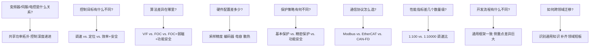
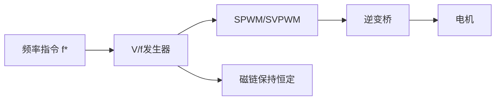
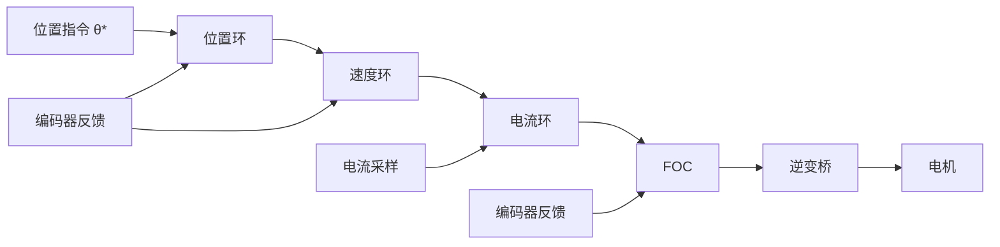

# SYS-02 变频器开发与电控开发异同

**模块编号：** SYS-02
**模块名称：** 变频器开发与电控开发异同（Inverter Development vs. Motor Control Development）
**文档版本：** v2.0
**适用对象：** 已掌握FOC基本原理、电力电子基础、嵌入式开发流程的工程师
**前置知识：** ALG-01 FOC理论基础、ALG-05 有感FOC实现、HW-01 电机基础、HW-05 功率器件与栅极驱动
**难度等级：** ★★★★☆

---

## 1. 核心摘要

**一句话：** 变频器、伺服驱动器、新能源汽车电控——三者共享同一套三相逆变桥功率拓扑，但控制目标、算法深度、硬件配置和保护策略截然不同；理解这些差异是跨领域迁移的前提，也是避免"拿着锤子看什么都像钉子"的关键。

**认知挂钩：** 把电力变换装置想象成交通工具：变频器是"货车"——载重大、速度不要求快，但必须稳定可靠、什么货都能拉；伺服驱动器是"赛车"——追求极致的操控精度和响应速度，每一个弯道（位置指令）都必须精确跟踪；新能源汽车电控是"混合动力超跑"——既要赛车的加速性能，又要货车的可靠性，还要满足交通法规（功能安全），而且油箱（电池）和发动机（电机）的特性随时在变。

**核心问题链：**



---

## 2. 变频器 vs 伺服驱动器 vs 电控——概念澄清

### 2.1 变频器（VFD, Variable Frequency Drive）

变频器是控制交流电机转速的电力变换装置，核心思想是通过改变输出电压的频率和幅值来调节电机转速。

**基本原理：**

$$n = \frac{60 f_s}{p}(1 - s)$$

其中 $n$ 为转速（rpm），$f_s$ 为供电频率（Hz），$p$ 为极对数，$s$ 为转差率。

**典型特征：**
- 控制方式以 V/F（标量控制）为主，高端型号支持 FOC
- 适配感应电机（IM）为主，兼顾同步电机
- 强调通用性——一台变频器驱动不同品牌、不同功率等级的电机
- 典型应用：风机、水泵、输送带、压缩机等工业场景
- 功率范围：0.75 kW ~ 几千 kW
- 典型厂商：ABB（ACS系列）、西门子（Sinamics）、丹佛斯（FC系列）、汇川（MD系列）

**V/F控制的核心：**

$$\frac{V}{f} = \text{const}$$

保持电压与频率的比值恒定，维持气隙磁链基本不变。这是最简单的变频控制策略：



### 2.2 伺服驱动器（Servo Drive）

伺服驱动器是实现高精度位置/速度/转矩控制的电力变换装置，核心思想是通过闭环矢量控制实现对电机状态的精确调控。

**典型特征：**
- 控制方式以 FOC（磁场定向控制）为绝对主流
- 适配 PMSM（永磁同步电机）为主，少量 AC Servo IM
- 强调精度和动态响应——定位精度到亚微米级，响应时间到亚毫秒级
- 必须配备高精度编码器（17~23 bit绝对值编码器）
- 功率范围：50 W ~ 几十 kW
- 典型厂商：安川（Sigma系列）、松下（MINAS系列）、倍福（AX系列）、汇川（IS系列）

**FOC控制的核心：**

$$\begin{bmatrix} V_d \\ V_q \end{bmatrix} = \begin{bmatrix} R_s + L_d \frac{d}{dt} & -\omega_e L_q \\ \omega_e L_d & R_s + L_q \frac{d}{dt} \end{bmatrix} \begin{bmatrix} I_d \\ I_q \end{bmatrix} + \begin{bmatrix} 0 \\ \omega_e \psi_f \end{bmatrix}$$

其中：
- $V_d, V_q$：d/q轴电压 (V)
- $I_d, I_q$：d/q轴电流 (A)
- $R_s$：定子电阻 ($\Omega$)
- $L_d, L_q$：d/q轴电感 (H)
- $\omega_e$：电角速度 (rad/s)
- $\psi_f$：永磁体磁链 (Wb)

通过Clarke/Park变换将三相交流量转化为旋转坐标系下的直流量，实现转矩和磁链的解耦控制：



### 2.3 电控（新能源汽车电机控制器，MCU/Traction Inverter）

电控是新能源汽车的核心功率变换装置，将电池直流电转换为驱动电机的三相交流电，核心思想是在宽速域内实现高效率驱动，同时满足功能安全要求。

**典型特征：**
- 控制方式以 FOC + 弱磁控制为主，高速区域需深度弱磁甚至过调制
- 适配车用 PMSM（内置式IPMSM为主，兼顾SPM）
- 强调全速域效率优化——效率MAP上每一个百分点都关乎续航里程
- 必须满足功能安全 ASIL-C/D 等级（ISO 26262）
- 高度集成：电机控制器 + 减速器 + 高压配电（多合一）
- 功率范围：30 kW ~ 300 kW
- 典型厂商：特斯拉（自研）、比亚迪（自研）、汇川（乘用车电控）、精进电动、博世

**弱磁控制的核心：**

在基速以上，反电动势接近母线电压极限，需注入负d轴电流削弱气隙磁链：

$$I_d < 0, \quad |I_d| = \frac{\psi_f}{L_d} - \frac{V_{max}}{\omega_e L_d}$$

其中：
- $I_d$：d轴电流（弱磁时为负值）(A)
- $\psi_f$：永磁体磁链 (Wb)
- $L_d$：d轴电感 (H)
- $V_{max}$：电压极限值 (V)
- $\omega_e$：电角速度 (rad/s)

弱磁使电机在电压受限后仍能升速，但以牺牲转矩输出能力为代价。

### 2.4 三者定位差异总览

| 维度 | 变频器 | 伺服驱动器 | 新能源电控 |
|------|--------|-----------|-----------|
| **核心定位** | 通用调速装置 | 精密运动控制 | 车辆动力驱动 |
| **控制深度** | 调速（速度环为主） | 定位（三环全闭环） | 效率+安全（多目标优化） |
| **适配电机** | IM为主 | PMSM为主 | IPMSM为主 |
| **控制算法** | V/F，高端FOC | FOC | FOC+弱磁+MTPA |
| **编码器** | 可选/无 | 必须（高精度） | 必须（中等精度） |
| **功率等级** | 0.75kW~MW | 50W~几十kW | 30kW~300kW |
| **成本敏感度** | 中 | 高 | 极高（量产） |
| **安全等级** | 基本保护 | 增强保护 | ASIL-C/D |
| **典型应用** | 风机水泵、输送带 | 数控机床、机器人 | 电动汽车驱动 |
| **开发周期** | 6~12个月 | 12~24个月 | 24~36个月 |
| **生命周期** | 10~20年 | 5~10年 | 5~15年（车规） |

---

## 3. 控制目标差异

### 3.1 变频器：调速范围、节能、多电机驱动

**核心目标：** 让电机"转起来"且"转得稳"，在宽调速范围内维持稳定运行。

**关键指标：**

| 指标 | 典型值 | 说明 |
|------|--------|------|
| 调速比 | 1:100 | 0.5 Hz ~ 50 Hz（额定） |
| 稳速精度 | 0.5%~1% | 开环V/F更差 |
| 转矩脉动 | 5%~10% | 对风机水泵影响不大 |
| 启动转矩 | 150% / 1min | 重载启动能力 |
| 节能率 | 20%~50% | 相比阀门/挡板调节 |

**变频器的"够用哲学"：** 风机水泵的转矩特性为 $T \propto n^2$，低速时转矩需求极低，对动态响应和低速性能要求不高。V/F控制在这些场景下已经"够用"，追求更高性能意味着更高成本，而用户不愿为此买单。

**多电机驱动是变频器的独特需求：** 一台变频器驱动多台并联电机（如多台水泵），要求：
- V/F控制（无法对单台电机做闭环）
- 电机参数差异的容忍度
- 各电机负载不均衡时的保护

### 3.2 伺服驱动器：定位精度、动态响应、低速性能

**核心目标：** 让电机"指哪打哪"，在极短时间内精确到达指定位置并保持。

**关键指标：**

| 指标 | 典型值 | 说明 |
|------|--------|------|
| 调速比 | 1:10000 | 0.01 rpm ~ 额定转速 |
| 速度波动 | <0.01% | 额定转速下 |
| 位置精度 | <1 pulse | 编码器分辨率内 |
| 响应时间 | <1ms | 速度阶跃响应 |
| 转矩脉动 | <1% | 额定转矩下 |
| 零速转矩 | 100%~300% | 保持定位不漂移 |

**伺服的"极限哲学"：** 数控机床的加工精度直接取决于伺服定位精度，1个脉冲的误差可能导致工件报废。机器人关节的动态响应决定轨迹跟踪精度，毫秒级的延迟意味着高速运动时的路径偏差。

**伺服独有的性能要求：**

1. **零速转矩（Zero-speed Torque/ Holding Torque）：** 电机静止时必须输出足够转矩抵抗外力（如重力），且不产生爬行和抖动
2. **超低速平稳性：** 0.1 rpm 以下仍需平滑运行，无爬行现象
3. **频繁加减速：** 每秒数十次的加减速循环，要求极小的速度环响应时间
4. **前馈跟踪精度：** 速度/转矩前馈必须精确，否则高速运动时跟随误差过大

### 3.3 电控：效率MAP、NVH、功能安全、ASIL等级

**核心目标：** 在全速域、全转矩范围内实现最高效率驱动，同时满足功能安全要求，且NVH（噪声、振动、声振粗糙度）表现优秀。

**关键指标：**

| 指标 | 典型值 | 说明 |
|------|--------|------|
| 综合效率 | >94% | 全工况加权 |
| 峰值效率 | >97% | 最优工作点 |
| 弱磁扩速比 | 1:3~1:5 | 基速到最高速 |
| 响应时间 | <10ms | 转矩阶跃响应 |
| 功能安全 | ASIL-C/D | ISO 26262 |
| NVH | <65dB(A) | 车内噪声 |
| EMC | CISPR 25 Class 5 | 车规EMC |

**电控的"平衡哲学"：** 不是追求单一指标最优，而是在效率、安全、NVH、成本之间找到全局最优解。例如：
- 注入高频信号可以辨识转子位置（无感启动），但会增加NVH
- 过调制可以扩展弱磁区域，但会增加谐波和EMC风险
- 更高的开关频率可以降低电流纹波，但会增加开关损耗降低效率

**电控独有的控制目标：**

1. **效率MAP全局优化：** 不是某个工作点最优，而是整个转矩-转速平面上的加权效率最高
2. **弱磁深度控制：** 车用电机基速比通常1:3~1:5，弱磁区域占工作面积50%以上
3. **功能安全完整性：** 转矩安全（非预期加速/减速）、监控安全（传感器故障检测）、通信安全
4. **热管理协同：** 电机温度、IGBT温度、冷却液温度的联合管理

### 3.4 控制目标对比

```
控制目标深度递进：

变频器：  速度稳定 ──────────────────────────────────── [够用即可]
伺服：    位置精确 ── 速度精确 ── 转矩精确 ──────────── [极限性能]
电控：    效率最优 ── 安全完整 ── NVH优秀 ── 宽速域 ── [全局平衡]
```

---

## 4. 控制算法差异

### 4.1 V/F控制（标量控制）

**基本原理：** 保持 $V/f$ 恒定，维持磁链基本不变，属于开环或简单闭环控制。

**数学描述：**

$$V_s = k \cdot f_s + V_0$$

其中 $k$ 为 V/F 斜率，$V_0$ 为低频电压补偿（补偿定子电阻压降）。

**V/F控制的变体：**

| 变体 | 特点 | 适用场景 |
|------|------|---------|
| 线性V/F | $V/f = \text{const}$，低频转矩不足 | 风机水泵（平方转矩） |
| 平方V/F | $V \propto f^2$，匹配风机特性 | 风机专用 |
| 带电压补偿的V/F | 低频时提升电压补偿 $R_s$ 压降 | 需要启动转矩的场合 |
| 矢量V/F | 分离磁链和转矩分量，简单解耦 | 提升低速性能 |
| 闭环V/F（转差频率控制） | 检测转速，控制转差频率 | 需要速度精度的场合 |

**V/F控制的局限：**

1. **无法精确控制转矩：** 转矩是磁链和电流的交叉乘积，V/F只控制了电压幅值和频率
2. **动态响应差：** 负载突变时，转速波动大，恢复慢
3. **低速性能差：** 低频时电阻压降占比增大，磁链维持困难
4. **参数敏感：** 电机参数变化时，V/F比不再最优

**V/F控制的适用场景判断：**

```
是否需要精确定位？ ── 是 ──→ 不适合V/F
                      │
                      否
                      │
是否需要快速动态响应？ ── 是 ──→ 不适合V/F
                      │
                      否
                      │
是否需要低速大转矩？ ── 是 ──→ 需要带补偿的V/F或FOC
                      │
                      否
                      │
负载是否为风机/水泵？ ── 是 ──→ V/F完全够用 ✓
                      │
                      否
                      │
是否多电机并联？ ── 是 ──→ V/F是唯一选择
                      │
                      否 ──→ 考虑FOC
```

### 4.2 矢量控制（FOC, Field Oriented Control）

**基本原理：** 通过坐标变换将三相交流量转化为旋转坐标系下的直流量，实现磁链和转矩的解耦控制。

**FOC的核心变换链：**

$$\text{abc} \xrightarrow{\text{Clarke}} \alpha\beta \xrightarrow{\text{Park}} dq$$

**Clarke变换：**

$$\begin{bmatrix} i_\alpha \\ i_\beta \end{bmatrix} = \frac{2}{3} \begin{bmatrix} 1 & -\frac{1}{2} & -\frac{1}{2} \\ 0 & \frac{\sqrt{3}}{2} & -\frac{\sqrt{3}}{2} \end{bmatrix} \begin{bmatrix} i_a \\ i_b \\ i_c \end{bmatrix}$$

其中：
- $i_\alpha, i_\beta$：静止两相坐标系电流 (A)
- $i_a, i_b, i_c$：三相定子电流 (A)

**Park变换：**

$$\begin{bmatrix} i_d \\ i_q \end{bmatrix} = \begin{bmatrix} \cos\theta_e & \sin\theta_e \\ -\sin\theta_e & \cos\theta_e \end{bmatrix} \begin{bmatrix} i_\alpha \\ i_\beta \end{bmatrix}$$

其中：
- $i_d, i_q$：旋转坐标系d/q轴电流 (A)
- $i_\alpha, i_\beta$：静止两相坐标系电流 (A)
- $\theta_e$：转子电角度 (rad)

**FOC在三种装置中的应用差异：**

| 维度 | 变频器FOC | 伺服FOC | 电控FOC |
|------|----------|---------|---------|
| **Id策略** | $I_d = 0$（SPM）或简单MTPA | $I_d = 0$ 或MTPA | MTPA + 弱磁 + MTPV |
| **Iq策略** | 速度环输出 | 位置/速度环输出 | 转矩指令映射 |
| **角度获取** | 无感观测器为主 | 编码器（高精度） | 编码器 + 无感切换 |
| **电流环带宽** | 200~500 Hz | 1~3 kHz | 500~1500 Hz |
| **速度环带宽** | 10~50 Hz | 200~500 Hz | 50~200 Hz |
| **弱磁控制** | 通常无 | 通常无 | 必须 |
| **死区补偿** | 简单或无 | 必须 | 必须+过调制 |
| **电流采样** | 1~2相 | 2~3相 | 2~3相 |

### 4.3 直接转矩控制（DTC, Direct Torque Control）

**基本原理：** 不进行坐标变换，直接在定子坐标系下控制转矩和磁链的幅值，通过磁链滞环和转矩滞环选择最优电压矢量。

**DTC的核心方程：**

$$T_e = \frac{3}{2} \frac{p}{2} \frac{L_m}{\sigma L_s L_r} |\psi_s| |\psi_r| \sin\delta$$

其中：
- $T_e$：电磁转矩 (N·m)
- $p$：极对数
- $L_m$：互感 (H)
- $\sigma$：漏感系数，$\sigma = 1 - \frac{L_m^2}{L_s L_r}$
- $L_s, L_r$：定子/转子电感 (H)
- $|\psi_s|, |\psi_r|$：定子/转子磁链幅值 (Wb)
- $\delta$：定子磁链和转子磁链的夹角（转矩角）(rad)

**DTC的工作机制：**

```
磁链误差 Δψ ──→ 磁链滞环 ──┐
                              ├──→ 电压矢量选择表 ──→ 逆变桥
转矩误差 ΔT ──→ 转矩滞环 ──┘          ↑
                                        │
扇区判断（ψ_s所在扇区）────────────────┘
```

**DTC vs FOC 对比：**

| 维度 | DTC | FOC |
|------|-----|-----|
| **坐标变换** | 不需要 | Clarke + Park |
| **电流环** | 无（直接控制转矩） | 有（PI控制器） |
| **PWM调制** | 无（滞环控制） | SVPWM |
| **转矩响应** | 极快（1~2个控制周期） | 快（取决于电流环带宽） |
| **转矩脉动** | 较大（滞环导致） | 小（PI精确控制） |
| **开关频率** | 不固定 | 固定 |
| **低速性能** | 较差（磁链观测困难） | 优秀 |
| **实现复杂度** | 算法简单，调试简单 | 算法复杂，调试复杂 |
| **EMC** | 较差（开关频率不固定） | 较好 |
| **典型应用** | ABB ACS800（DTC版本） | 大部分伺服和电控 |

**DTC的工程现实：** 纯DTC在工业中应用较少，主要因为转矩脉动和开关频率不固定的问题。实践中多采用DTC+SVPWM的混合方案（如ABB的DTC实际上已经融合了SVPWM），或者采用预测转矩控制（PTC）等改进方案。

### 4.4 算法选择决策树

```
你的应用需求是什么？
│
├── 只需要调速，不要求精度
│   ├── 负载是风机/水泵 ──→ V/F（平方V/F）
│   ├── 需要多电机并联 ──→ V/F
│   ├── 需要一定启动转矩 ──→ 带补偿的V/F
│   └── 需要速度闭环 ──→ 闭环V/F（转差频率控制）
│
├── 需要精确速度/转矩控制
│   ├── 有编码器 ──→ 有感FOC
│   ├── 无编码器 ──→ 无感FOC（高频注入/滑模观测器）
│   └── 追求最快转矩响应 ──→ DTC（接受转矩脉动）
│
├── 需要精确定位
│   └── 必须有感FOC + 高精度编码器
│
└── 需要宽速域高效率
    └── FOC + 弱磁 + MTPA + 过调制
```

### 4.5 算法性能对比总表

| 性能指标 | V/F | 闭环V/F | DTC | FOC | FOC+弱磁 |
|---------|-----|---------|-----|-----|---------|
| **调速比** | 1:50 | 1:100 | 1:200 | 1:1000 | 1:10000 |
| **速度精度** | 3%~5% | 0.5%~1% | 0.1%~0.5% | 0.01%~0.1% | 0.01%~0.1% |
| **转矩脉动** | 10%~20% | 5%~10% | 5%~15% | 1%~3% | 1%~3% |
| **转矩响应** | >100ms | 50~100ms | 1~5ms | 2~10ms | 5~20ms |
| **低速性能** | 差 | 一般 | 较差 | 优秀 | 优秀 |
| **弱磁能力** | 无 | 无 | 有限 | 无 | 优秀 |
| **效率** | 一般 | 一般 | 良好 | 良好 | 最优 |
| **实现复杂度** | ★☆☆☆☆ | ★★☆☆☆ | ★★★☆☆ | ★★★★☆ | ★★★★★ |
| **调试难度** | ★☆☆☆☆ | ★★☆☆☆ | ★★★☆☆ | ★★★★☆ | ★★★★★ |
| **成本** | 最低 | 低 | 中 | 中高 | 高 |

---

## 5. 硬件架构异同

### 5.1 功率拓扑——三者相同

**核心拓扑：** 三相电压源型逆变桥（Six-Switch VSI）

```
          Vdc+
     ┌──────┬──────┬──────
     │      │      │
    Q1     Q3     Q5
     │      │      │
     ├─A    ├─B    ├─C     ──→ 电机
     │      │      │
    Q4     Q6     Q2
     │      │      │
     └──────┴──────┴──────
          Vdc-
```

**功率器件选择差异：**

| 维度 | 变频器 | 伺服驱动器 | 新能源电控 |
|------|--------|-----------|-----------|
| **器件类型** | IGBT模块 | MOSFET/IGBT | SiC MOSFET / IGBT |
| **典型电压** | 380V/690V AC | 380V AC | 400V~800V DC |
| **开关频率** | 2~8 kHz | 8~20 kHz | 6~16 kHz |
| **功率模块** | 6合1/7合1模块 | IPM或分立 | 6合1 SiC模块 |
| **母线电压** | 540V/1100V DC | 540V DC | 400~800V DC |
| **散热方式** | 风冷/水冷 | 风冷 | 水冷集成 |

**关键差异解读：**
- 变频器用IGBT：功率大、开关频率低（2~8kHz），开关损耗可接受
- 伺服用MOSFET：功率小、开关频率高（8~20kHz），降低电流纹波
- 电控用SiC：高压（800V）、高效率、高功率密度，SiC的开关损耗比IGBT低70%以上

### 5.2 电流采样——精度递进

**电流采样方案对比：**

| 方案 | 变频器 | 伺服 | 电控 |
|------|--------|------|------|
| **单电阻采样** | 低端型号 | 不用 | 不用 |
| **双电阻采样** | 中端型号 | 少用 | 常用 |
| **三电阻采样** | 高端型号 | 常用 | 常用 |
| **霍尔电流传感器** | 大功率型号 | 不用 | 不用 |
| **采样精度** | 8~12 bit | 12~16 bit | 12~14 bit |
| **采样同步** | 简单 | 严格（PWM中心） | 严格（PWM中心） |
| **采样频率** | 与PWM同频 | 与PWM同频或2倍 | 与PWM同频 |

**单电阻采样的原理与限制：**

单电阻采样利用母线电流在PWM不同扇区下的信息重建三相电流：

$$i_{dc}(t) = S_a \cdot i_a + S_b \cdot i_b + S_c \cdot i_c$$

其中 $S_a, S_b, S_c$ 为开关状态。

**限制：**
- 需要复杂的PWM移相来创造采样窗口
- 低速时有效矢量时间短，采样窗口不足
- 重建算法复杂，对PWM模式有特殊要求
- 精度有限，不适合高性能控制

**伺服为什么不用单电阻：** 伺服要求电流环带宽1~3kHz，电流采样精度直接影响转矩精度，单电阻重建的延迟和误差不可接受。

### 5.3 编码器——从无到有到精密

**编码器方案对比：**

| 方案 | 变频器 | 伺服 | 电控 |
|------|--------|------|------|
| **无编码器** | 常用（V/F模式） | 不用 | 启动阶段可能用 |
| **霍尔传感器** | 低端FOC用 | 不用 | 少用 |
| **增量式编码器** | 中端用 | 少用 | 少用 |
| **绝对值编码器** | 高端用 | **必须** | 常用 |
| **磁编码器** | 少用 | 少用 | 常用（旋变） |
| **分辨率** | 1024~4096 | 17~23 bit | 12~16 bit |
| **通信接口** | ABZ/SSI | BiSS/COSIW |旋变/EnDat |

**编码器选型的工程考量：**

| 考量因素 | 变频器 | 伺服 | 电控 |
|---------|--------|------|------|
| **精度要求** | 低（速度闭环即可） | 极高（位置闭环） | 中高（效率优化） |
| **成本敏感度** | 高（编码器占成本比例大） | 中（系统成本高） | 极高（量产） |
| **环境要求** | 工业级 | 工业级 | 车规级（-40~150C） |
| **抗振要求** | 一般 | 一般 | 极高（车载） |
| **线束长度** | 短 | 短 | 长（电机到控制器距离远） |

**旋变（Resolver）在电控中的特殊地位：** 旋变是可变磁阻式的角度传感器，虽然分辨率不如光电编码器，但具有以下车规优势：
- 耐高温（-55~175C）
- 抗振动（无光学元件）
- 抗EMI（模拟信号，不易受干扰）
- 寿命长（无接触磨损）

### 5.4 母线电容——容量与体积的博弈

**母线电容方案对比：**

| 维度 | 变频器 | 伺服 | 电控 |
|------|--------|------|------|
| **电容类型** | 电解电容 | 薄膜/电解 | 薄膜电容 |
| **容量** | 大（60~100uF/kW） | 中（30~60uF/kW） | 小（10~30uF/kW） |
| **主要功能** | 工频纹波滤波 | 高频纹波滤波 | 高频纹波滤波+体积限制 |
| **寿命要求** | 10年 | 5~10年 | 15年（车规） |
| **体积占比** | 大（可接受） | 中 | 小（必须压缩） |
| **纹波电流** | 工频为主 | 开关频率为主 | 开关频率+电机频率 |

**变频器为什么需要大电容：** 变频器前端是二极管整流桥，输入电流是脉动的，需要大电容平滑母线电压：

$$C_{bus} \geq \frac{I_{load}}{2 \cdot f_{line} \cdot \Delta V_{dc}}$$

其中 $f_{line}$ 为工频（50/60Hz），$\Delta V_{dc}$ 为允许的母线电压纹波。

**电控为什么用小电容：** 电控前端是电池（低内阻电压源），不需要大电容平滑工频纹波；但体积和重量是硬约束，电容必须尽可能小。薄膜电容替代电解电容的原因：
- 寿命更长（无电解液干涸）
- ESR更低（纹波电流承受能力强）
- 失效模式安全（开路而非短路）

### 5.5 散热——从风冷到集成水冷

**散热方案对比：**

| 维度 | 变频器 | 伺服 | 电控 |
|------|--------|------|------|
| **散热方式** | 风冷/水冷 | 风冷 | 水冷集成 |
| **散热器** | 独立铝散热器 | 铝散热器+风扇 | 铝基板+水道 |
| **热界面材料** | 导热硅脂 | 导热硅脂 | 导热垫/焊接 |
| **温度监控** | 模块NTC | 模块NTC | 多点NTC |
| **功率密度** | 1~3 kW/L | 3~5 kW/L | 10~30 kW/L |
| **环境温度** | -10~50C | 0~55C | -40~85C |

**电控散热设计的核心挑战：** 功率密度是变频器的10倍，必须用集成水冷：
- IGBT/SiC模块直接焊接在覆铜陶瓷板（DBC）上
- DBC直接钎焊到水冷基板
- 水道设计优化（蛇形/并联）
- 进出水温差控制在5C以内

### 5.6 硬件架构总对比

```
变频器硬件特征：
┌─────────────────────────────────────────────────┐
│ 整流桥 ──→ 大电解电容 ──→ IGBT模块 ──→ 电机    │
│ (二极管)    (工频滤波)    (2~8kHz)              │
│                          风冷散热                │
│ 电流采样：1~2相，8~12bit                         │
│ 编码器：可选                                      │
│ 通信：RS485/Modbus                                │
└─────────────────────────────────────────────────┘

伺服硬件特征：
┌─────────────────────────────────────────────────┐
│ 直流母线 ──→ 小薄膜电容 ──→ MOSFET/IPM ──→ 电机 │
│ (外部供电)   (高频滤波)    (8~20kHz)             │
│                          风冷散热                │
│ 电流采样：3相，12~16bit                          │
│ 编码器：17~23bit绝对值（必须）                    │
│ 通信：EtherCAT/CANopen                           │
└─────────────────────────────────────────────────┘

电控硬件特征：
┌─────────────────────────────────────────────────┐
│ 电池 ──→ 小薄膜电容 ──→ SiC模块 ──→ 电机        │
│ (高压DC)  (体积受限)    (6~16kHz)               │
│                        集成水冷                  │
│ 电流采样：2~3相，12~14bit                        │
│ 编码器：旋变/12~16bit（必须）                     │
│ 通信：CAN/CAN-FD                                 │
└─────────────────────────────────────────────────┘
```

---

## 6. 保护策略差异

### 6.1 变频器保护

**基本保护功能：**

| 保护类型 | 检测方法 | 阈值设定 | 动作 |
|---------|---------|---------|------|
| 过流（OC） | 电流采样 / 硬件比较器 | 150%~200% 额定 | 立即封锁PWM |
| 过压（OV） | 母线电压采样 | 1.3~1.5倍额定母线电压 | 封锁PWM + 制动电阻 |
| 欠压（UV） | 母线电压采样 | 0.7~0.8倍额定母线电压 | 封锁PWM |
| 过温（OT） | NTC / 模块内置 | 散热器90C / 模块125C | 降额运行或停机 |
| 接地故障（GF） | 漏电流互感器 | 30mA~500mA | 报警或停机 |
| 过载（OL） | $I^2t$ 热模型 | 110% / 60s | 报警后停机 |
| 输出短路（SC） | 硬件比较器 / di/dt | 硬件级快速保护 | <10us封锁PWM |

**变频器保护的"粗犷"特征：**
- 保护阈值宽裕（150%~200%），允许短时过载
- 响应时间在毫秒级即可（负载惯性大，不会瞬间损坏）
- 接地故障检测是变频器独有需求（工业现场电缆长，绝缘老化风险高）
- $I^2t$ 热模型用于模拟电机热状态，实现反时限保护

### 6.2 伺服保护

**在变频器基础上增加的保护：**

| 保护类型 | 检测方法 | 阈值设定 | 动作 |
|---------|---------|---------|------|
| 位置超限（PL） | 编码器位置比较 | 软限位 / 硬限位开关 | 减速停止 + 报警 |
| 跟随误差过大（FE） | 指令位置 - 实际位置 | 典型100~1000 pulse | 停止 + 报警 |
| 编码器断线（EL） | 通信超时 / 数据校验 | BiSS/COSIW帧校验 | 立即停止 |
| 编码器数据异常 | CRC校验 / 合理性检查 | 增量溢出 / 角度跳变 | 停止 + 报警 |
| 转矩限制（TL） | 电流幅值限制 | 可配置 | 限幅运行 |
| 速度限制（SL） | 速度反馈比较 | 最大转速 | 限幅运行 |
| 再生过压 | 母线电压 + 减速功率 | 动态计算 | 减速限制 + 制动电阻 |
| 机械共振检测 | 电流频谱分析 | 特定频率分量超限 | 陷波滤波器 / 报警 |

**伺服保护的"精密"特征：**
- 跟随误差过大保护是伺服独有——位置环的偏差直接反映机械异常
- 编码器断线保护至关重要——编码器故障意味着位置环开环，失控风险极高
- 机械共振检测是伺服的"高级功能"——通过FFT分析电流频谱，自动识别共振频率并插入陷波滤波器
- 转矩限制和速度限制是"软保护"——不立即停机，而是限幅运行

### 6.3 电控保护

**在伺服基础上增加的保护：**

| 保护类型 | 检测方法 | 阈值设定 | 动作 |
|---------|---------|---------|------|
| 绝缘检测（IM） | 高压对地绝缘阻抗 | >500Ω/V | 禁止上高压 |
| 碰撞保护（CP） | 碰撞信号 / 加速度传感器 | 车辆碰撞信号 | 立即断开高压 |
| 相间短路 | 电流采样 + 残压检测 | 硬件级快速保护 | <5us封锁PWM |
| 旋变故障 | 信号幅值 / 频率 / 一致性 | 双通道交叉校验 | 降级运行 / 停机 |
| 电池过放 | SOC估算 + 电压监控 | SOC<5% 或 V<最低值 | 限制功率输出 |
| 转矩安全（ASIL） | 双通道计算 + 交叉校验 | 转矩偏差>阈值 | 安全转矩关断 |
| 看门狗安全 | 独立硬件看门狗 | 程序跑飞检测 | 安全关断 |
| 通信安全 | CRC + 滚动计数 + E2E | 通信超时 / CRC错误 | 安全状态 |
| 过温降额 | 多点温度监控 | 动态降额曲线 | 限制输出功率 |

**电控保护的"功能安全"特征：**

功能安全是电控与变频器/伺服最本质的区别。ISO 26262要求：

1. **安全目标（Safety Goal）：** 非预期加速/减速必须被检测和抑制
2. **ASIL等级：** 转矩控制相关功能通常要求ASIL-C或ASIL-D
3. **故障检测时间（FHTI）：** 从故障发生到进入安全状态的时间必须足够短
4. **诊断覆盖率（DC）：** 硬件和软件的诊断覆盖率必须满足ASIL要求

**转矩安全（STO, Safe Torque Off）的实现：**

```
正常路径：VCU转矩指令 ──→ 转矩映射 ──→ Id/Iq指令 ──→ FOC ──→ PWM
                                                    │
安全监控：独立计算 ──→ 转矩估算 ──→ 与指令比较 ──→ 偏差>阈值？
                                                    │
                                              是 ──→ STO：封锁PWM
```

### 6.4 保护策略对比总表

| 保护功能 | 变频器 | 伺服 | 电控 |
|---------|--------|------|------|
| 过流/过压/欠压 | 有 | 有 | 有 |
| 过温 | 有 | 有 | 有（多点+降额） |
| 过载（$I^2t$） | 有 | 有 | 有 |
| 接地故障 | 有 | 少有 | 有（绝缘检测） |
| 位置超限 | 无 | 有 | 无（VCU负责） |
| 跟随误差 | 无 | 有 | 无 |
| 编码器断线 | 无 | 有 | 有（旋变故障） |
| 机械共振 | 无 | 有 | 少有 |
| 碰撞保护 | 无 | 无 | 有 |
| 功能安全（ASIL） | 无 | 少有 | 必须 |
| 转矩安全 | 无 | 无 | 必须 |
| 通信安全 | 无 | 少有 | 必须 |
| 绝缘检测 | 无 | 无 | 有 |

---

## 7. 通信协议差异

### 7.1 变频器通信

**主流协议：**

| 协议 | 物理层 | 速率 | 特点 | 典型应用 |
|------|--------|------|------|---------|
| Modbus RTU | RS-485 | 9.6~115.2 kbps | 简单、广泛、低成本 | 基本参数配置和监控 |
| Modbus TCP | Ethernet | 10/100 Mbps | Modbus的网络版 | 远程监控 |
| Profibus DP | RS-485 | 12 Mbps | 西门子生态 | 西门子PLC集成 |
| Profinet | Ethernet | 100 Mbps | 实时以太网 | 高端工业集成 |
| DeviceNet | CAN | 500 kbps | ODVA标准 | 美系设备集成 |
| CC-Link | RS-485 | 10 Mbps | 日系标准 | 三菱PLC集成 |

**变频器通信的特征：**
- 以参数读写为主（启动/停止、频率设定、状态读取）
- 实时性要求不高（100ms级更新即可）
- 通信故障通常不导致停机（降级为本地控制）
- Modbus RTU是"最低公约数"——几乎所有变频器都支持

### 7.2 伺服通信

**主流协议：**

| 协议 | 物理层 | 速率 | 特点 | 典型应用 |
|------|--------|------|------|---------|
| EtherCAT | Ethernet | 100 Mbps | 确定性实时，分布式时钟 | 高性能多轴运动控制 |
| Ethernet/IP | Ethernet | 100 Mbps | ODVA标准，CIP协议 | 罗克韦尔生态 |
| CANopen | CAN/CAN-FD | 1 Mbps | DS402设备协议 | 中等性能多轴控制 |
| PROFINET IRT | Ethernet | 100 Mbps | 等时同步实时 | 西门子运动控制 |
| SERCOS III | Ethernet | 100 Mbps | 专用运动控制总线 | 高端数控 |
| MECHATROLINK | RS-485/Ethernet | 10/100 Mbps | 安川主导 | 安川伺服系统 |

**伺服通信的特征：**
- 必须支持DS402/CiA402设备协议——标准化的状态机和命令接口
- 实时性要求极高（1ms周期，抖动<1us）
- 分布式时钟（DC）同步——多轴之间的同步精度<1us
- 通信故障通常导致急停（安全要求）

**DS402（CiA402）状态机：**

```
Not Ready to Switch On
        │
        ▼
Switch On Disabled ←────────────────────────┐
        │                                    │
        ▼                                    │
Ready to Switch On ←──────────────┐         │
        │                         │         │
        ▼                         │         │
Switched On ←─────────────┐      │         │
        │                 │      │         │
        ▼                 │      │         │
Operation Enabled ────→ Quick Stop Active ──┘
        │                 │
        ▼                 ▼
Fault ────────────────→ Fault Reaction Active
```

### 7.3 电控通信

**主流协议：**

| 协议 | 物理层 | 速率 | 特点 | 典型应用 |
|------|--------|------|------|---------|
| CAN 2.0B | CAN-H/L | 500 kbps | 经典汽车总线 | 基本整车通信 |
| CAN-FD | CAN-H/L | 2~5 Mbps | CAN的升级版 | 高带宽整车通信 |
| FlexRay | 双绞线 | 10 Mbps | 确定性通信 | 安全关键系统 |
| Ethernet (SOME/IP) | Ethernet | 100/1000 Mbps | 车载以太网 | 智能座舱/ADAS |

**电控通信的特征：**
- 以信号（Signal）而非参数（Parameter）为中心——VCU发送转矩指令，MCU返回状态
- 实时性要求中等（10ms周期），但可靠性要求极高
- 通信安全（E2E保护）是强制要求——CRC校验 + 滚动计数 + 超时检测
- 通信故障必须进入安全状态（安全转矩关断）

**典型电控通信报文：**

| 报文 | 方向 | 周期 | 内容 |
|------|------|------|------|
| 转矩指令 | VCU→MCU | 10ms | 目标转矩、方向、使能 |
| 速度指令 | VCU→MCU | 10ms | 目标转速（巡航模式） |
| 电机状态 | MCU→VCU | 10ms | 转速、转矩、温度 |
| 故障状态 | MCU→VCU | 10ms | 故障码、故障等级 |
| 高压状态 | MCU→VCU | 50ms | 母线电压、电流、绝缘 |
| 旋变角度 | MCU内部 | 0.1ms | 内部FOC使用 |

### 7.4 通信协议对比

| 维度 | 变频器 | 伺服 | 电控 |
|------|--------|------|------|
| **实时性** | 100ms级 | 1ms级 | 10ms级 |
| **同步精度** | 不要求 | <1us | <100us |
| **安全要求** | 低 | 中 | 极高（E2E） |
| **通信故障处理** | 降级运行 | 急停 | 安全关断 |
| **标准协议** | Modbus | DS402 | AUTOSAR |
| **总线利用率** | 低 | 高 | 中 |
| **线束成本** | 低 | 中 | 高（车规线束） |

---

## 8. 性能指标差异

### 8.1 核心性能指标对比

| 性能指标 | 变频器 | 伺服驱动器 | 新能源电控 |
|---------|--------|-----------|-----------|
| **调速比** | 1:50~1:100 | 1:5000~1:10000 | 1:1000~1:5000 |
| **速度精度** | 0.5%~3% | 0.001%~0.01% | 0.05%~0.5% |
| **速度波动** | 0.5%~1% | <0.01% | 0.1%~0.5% |
| **转矩脉动** | 5%~10% | <1% | 1%~3% |
| **转矩响应** | 50~200ms | 0.5~2ms | 5~20ms |
| **位置精度** | N/A | <1 encoder count | N/A |
| **零速转矩** | 50%~100% | 100%~300% | 100%~200% |
| **电流环带宽** | 200~500 Hz | 1~3 kHz | 500~1500 Hz |
| **速度环带宽** | 10~50 Hz | 200~500 Hz | 50~200 Hz |
| **位置环带宽** | N/A | 50~200 Hz | N/A |
| **效率** | 90%~95% | 93%~96% | 94%~97% |
| **功率密度** | 1~3 kW/L | 3~5 kW/L | 10~30 kW/L |

### 8.2 调速比详解

**变频器调速比 1:100：**

$$\text{调速比} = \frac{n_{max}}{n_{min}} = \frac{1500}{15} = 100$$

- $n_{max}$ = 额定转速（如1500 rpm，4极50Hz）
- $n_{min}$ = 最低稳定运行转速（如15 rpm，V/F控制下更低转速不稳定）

**伺服调速比 1:10000：**

$$\text{调速比} = \frac{n_{max}}{n_{min}} = \frac{3000}{0.3} = 10000$$

- $n_{max}$ = 额定转速（如3000 rpm）
- $n_{min}$ = 最低稳定运行转速（如0.3 rpm，FOC+高精度编码器可实现）

**为什么差100倍？**

1. **编码器分辨率：** 变频器可能无编码器或1024线增量式，伺服是17~23bit绝对值（131072~8388608 counts/rev）
2. **控制算法：** V/F在低速时磁链维持困难，FOC可以精确控制电流
3. **电流采样：** 变频器8~12bit精度，伺服12~16bit，低速时电流信号微弱需要高精度
4. **摩擦补偿：** 伺服有精密的摩擦模型和补偿，变频器通常不做

### 8.3 响应时间详解

**变频器响应时间 100ms级：**

$$t_{response} \approx \frac{1}{2\pi \cdot f_{bw,speed}} = \frac{1}{2\pi \cdot 5} \approx 32ms$$

速度环带宽仅5~10Hz（V/F模式），响应时间在几十到几百毫秒。

**伺服响应时间 1ms级：**

$$t_{response} \approx \frac{1}{2\pi \cdot f_{bw,speed}} = \frac{1}{2\pi \cdot 300} \approx 0.5ms$$

速度环带宽200~500Hz，加上前馈补偿，实际响应可达亚毫秒级。

**为什么差100倍？**

1. **控制环带宽：** 伺服电流环1~3kHz vs 变频器200~500Hz
2. **惯量比：** 伺服电机惯量小，机械时间常数短
3. **前馈：** 伺服有速度和转矩前馈，变频器通常没有
4. **采样与执行延迟：** 伺服控制周期50~100us，变频器可能250us~1ms

### 8.4 转矩脉动详解

**变频器转矩脉动 5%~10%：**

主要来源：
- V/F控制的谐波电流（5次、7次、11次、13次）
- 死区时间引起的电压畸变
- 电流采样误差
- 低开关频率导致的电流纹波

**伺服转矩脉动 <1%：**

主要来源：
- 编码器角度量化误差
- 电流采样噪声
- 死区补偿残差
- 电机本体齿槽转矩

**降低转矩脉动的关键技术：**

| 技术 | 变频器 | 伺服 | 电控 |
|------|--------|------|------|
| 死区补偿 | 简单或无 | 精密 | 精密 |
| 电流采样校准 | 无 | 有（偏置+增益） | 有 |
| 逆变器非线性补偿 | 无 | 有 | 有 |
| 齿槽转矩补偿 | 无 | 有 | 有 |
| 电流谐波抑制 | 无 | 有（重复控制） | 有（谐波注入） |
| 自整定 | 无 | 有 | 有 |

---

## 9. 开发流程异同

### 9.1 通用开发框架

三者共享的基本开发流程：

```
需求分析 ──→ 架构设计 ──→ 硬件开发 ──→ 软件开发 ──→ 集成测试 ──→ 验证交付
    │            │            │            │            │            │
    ▼            ▼            ▼            ▼            ▼            ▼
  性能指标    拓扑选择     原理图/PCB    控制算法     功能测试     型式试验
  安全等级    MCU选型      EMC设计       通信协议     保护验证     EMC测试
  成本目标    任务划分      热设计        状态机       效率测试     可靠性测试
  环境条件    接口定义      样板制作      保护策略     动态测试     认证测试
```

### 9.2 变频器开发侧重

**变频器开发的独特关注点：**

1. **参数自整定：** 变频器适配不同电机，必须能自动辨识电机参数
   - 静止自整定：注入电压脉冲，测量电流响应，辨识 $R_s$, $L_s$
   - 旋转自整定：电机空载旋转，辨识 $\psi_f$, $J$
   - 在线自整定：运行中持续更新参数

2. **多电机适配：** 一台变频器可能驱动不同功率、不同品牌的电机
   - 电机参数库（预设常见电机参数）
   - V/F曲线可编程
   - 多组参数切换

3. **EMC设计：** 变频器是严重的EMI源
   - 输入侧EMC滤波器设计
   - 输出侧dv/dt滤波器
   - 共模电流抑制

4. **工艺适配：** 不同工艺对控制的要求差异大
   - 纺织：多电机同步
   - 起重：防溜钩、制动时序
   - 挤出机：转矩控制模式

**变频器典型开发周期：6~12个月**

```
月1~2：需求分析 + 架构设计
月2~4：硬件设计 + 样板
月3~6：软件开发（V/F + 基本FOC）
月5~8：参数自整定 + 多电机适配
月7~10：保护功能 + 通信协议
月9~12：EMC整改 + 型式试验 + 认证
```

### 9.3 伺服开发侧重

**伺服开发的独特关注点：**

1. **精度标定：** 编码器精度直接决定系统性能
   - 编码器安装偏心补偿
   - 磁极位置标定（电角度零点）
   - 编码器非线性补偿
   - 温度漂移补偿

2. **机械共振抑制：** 伺服系统与机械负载的耦合会产生共振
   - 频率响应测量（Bode图）
   - 自动陷波滤波器设计
   - 自适应共振抑制
   - 刚性/柔性负载适配

3. **整定便利性：** 用户期望"一键整定"
   - 自动惯量辨识
   - 自动PID整定
   - 在线参数优化
   - 免整定算法

4. **运动控制功能：** 伺服不仅仅是驱动，还需要运动控制
   - 电子齿轮/电子凸轮
   - 飞剪/追剪
   - 多轴同步
   - 前馈补偿

**伺服典型开发周期：12~24个月**

```
月1~3：需求分析 + 架构设计
月2~5：硬件设计 + 样板
月3~8：FOC核心算法开发
月6~12：编码器处理 + 精度标定
月8~14：共振抑制 + 自动整定
月10~16：运动控制功能
月14~20：通信协议（EtherCAT/CANopen）
月18~24：全面测试 + 优化 + 认证
```

### 9.4 电控开发侧重

**电控开发的独特关注点：**

1. **效率优化：** 每一个百分点都关乎续航
   - 全速域效率MAP优化
   - MTPA轨迹精确标定
   - 弱磁区域效率优化
   - 开关频率与效率的权衡
   - 死区时间与效率的权衡

2. **功能安全：** ASIL-C/D等级的完整实现
   - 安全目标分解
   - 硬件安全机制设计（双通道、看门狗、电压监控）
   - 软件安全机制设计（E2E保护、程序流监控、数据完整性）
   - 故障树分析（FTA）和失效模式分析（FMEA）
   - 安全验证和确认

3. **EMC：** 车规EMC是硬门槛
   - CISPR 25 Class 5/6
   - 传导发射和辐射发射
   - 传导抗扰和辐射抗扰
   - 大电流注入（BCI）
   - 静电放电（ESD）

4. **AUTOSAR：** 车规软件架构
   - 分层架构（BSW + ASW + RTE）
   - 标准化接口
   - 配置工具链
   - 代码生成

5. **NVH：** 电机噪声直接影响驾乘体验
   - 电流谐波优化
   - 开关频率随机调制
   - 死区补偿优化
   - 扭矩平滑控制

**电控典型开发周期：24~36个月**

```
月1~4：需求分析 + 安全目标分解 + 架构设计
月3~8：硬件设计 + 样板 + EMC预测试
月4~12：FOC + 弱磁 + MTPA算法开发
月8~16：效率MAP标定 + 优化
月10~18：功能安全实现 + 验证
月12~20：NVH优化 + EMC整改
月16~24：AUTOSAR集成 + 通信
月20~30：整车集成 + 标定
月28~36：型式认证 + 量产准备
```

### 9.5 开发流程对比

| 维度 | 变频器 | 伺服 | 电控 |
|------|--------|------|------|
| **开发周期** | 6~12月 | 12~24月 | 24~36月 |
| **团队规模** | 5~10人 | 10~20人 | 20~50人 |
| **硬件迭代** | 2~3版 | 3~5版 | 4~8版 |
| **软件架构** | 前后台/简单RTOS | RTOS | AUTOSAR |
| **测试设备** | 电机台架 | 精密台架+负载 | 整车+环境仓 |
| **认证要求** | CE/UL | CE/UL | 车规（CCC/COP） |
| **安全标准** | IEC 61800-5-2 | IEC 61800-5-2 | ISO 26262 |
| **EMC标准** | IEC 61800-3 | IEC 61800-3 | CISPR 25 |
| **版本管理** | Git/SVN | Git | Git+AUTOSAR工具链 |
| **标定工具** | 上位机 | 上位机 | CANape/INCA |

---

## 10. 知识迁移指南

### 10.1 通用知识（三者共享）

无论从哪个领域起步，以下知识是通用的：

**电力电子基础：**
- 三相逆变桥工作原理
- SVPWM调制原理
- 死区时间及其影响
- 功率器件特性（IGBT/MOSFET/SiC）
- 栅极驱动电路设计
- 母线电容选型与纹波计算

**控制理论：**
- PID控制器设计与整定
- 闭环稳定性分析（Bode图、Nyquist图）
- 离散化方法（Tustin、ZOH）
- 抗积分饱和方法
- 前馈补偿原理

**信号处理：**
- ADC采样与量化
- 数字滤波器设计（FIR/IIR）
- FFT频谱分析
- 传感器信号调理

**嵌入式开发：**
- MCU外设配置（PWM、ADC、DMA、定时器）
- 中断优先级设计
- 实时性保证
- 代码架构与模块化

### 10.2 变频器 → 伺服

**需要学习的核心知识：**

| 知识领域 | 学习内容 | 难度 | 重要性 |
|---------|---------|------|--------|
| FOC算法 | Clarke/Park变换、电流环PI设计、SVPWM | ★★★★☆ | 极高 |
| 编码器处理 | 绝对值编码器接口、角度校准、速度计算 | ★★★☆☆ | 极高 |
| 三环控制 | 位置环+速度环+电流环的级联设计 | ★★★★☆ | 极高 |
| 带宽设计 | 电流环带宽确定、速度环带宽设计 | ★★★★☆ | 高 |
| 前馈补偿 | 速度前馈、转矩前馈、重力补偿 | ★★★☆☆ | 高 |
| 共振抑制 | 陷波滤波器、自适应共振抑制 | ★★★★★ | 高 |
| 精度标定 | 编码器偏心补偿、磁极标定 | ★★★☆☆ | 中 |
| DS402协议 | 状态机、命令接口、PDO映射 | ★★★☆☆ | 中 |
| 自动整定 | 惯量辨识、PID自整定 | ★★★★☆ | 中 |

**学习路径建议：**

```
第一步（1~2月）：FOC算法从理论到实现
    └── 从V/F过渡到FOC，理解坐标变换的物理意义
    └── 在现有硬件上实现有感FOC

第二步（1~2月）：编码器处理与三环控制
    └── 学习绝对值编码器接口（BiSS/EnDat）
    └── 实现位置环+速度环+电流环

第三步（2~3月）：带宽设计与前馈补偿
    └── 学习带宽驱动的PI参数设计方法
    └── 实现速度前馈和转矩前馈

第四步（2~3月）：共振抑制与精度标定
    └── 学习频率响应测量和陷波滤波器设计
    └── 实现编码器偏心补偿和磁极标定

第五步（1~2月）：通信协议与自动整定
    └── 学习EtherCAT/CANopen协议栈
    └── 实现惯量辨识和PID自整定
```

**常见误区：**

1. **"FOC就是加个坐标变换"** —— 错！FOC的核心是电流环的精确控制，坐标变换只是手段。电流环带宽、解耦、死区补偿才是难点。
2. **"编码器接上就能用"** —— 错！编码器安装偏心、磁极位置标定、非线性补偿都需要仔细处理。
3. **"PID参数靠试"** —— 错！伺服的三环带宽有严格的级联关系，必须从电流环开始系统设计。

### 10.3 变频器 → 电控

**需要学习的核心知识：**

| 知识领域 | 学习内容 | 难度 | 重要性 |
|---------|---------|------|--------|
| FOC算法 | 同变频器→伺服 | ★★★★☆ | 极高 |
| 弱磁控制 | 电压反馈法、前馈计算法、弱磁PI设计 | ★★★★★ | 极高 |
| MTPA | IPMSM的MTPA轨迹推导与实现 | ★★★★☆ | 极高 |
| 功能安全 | ISO 26262、ASIL等级、安全机制 | ★★★★★ | 极高 |
| 效率优化 | 效率MAP标定、全局优化策略 | ★★★★☆ | 高 |
| 车规通信 | CAN/CAN-FD、AUTOSAR COM | ★★★☆☆ | 高 |
| EMC设计 | CISPR 25、传导/辐射发射与抗扰 | ★★★★☆ | 高 |
| NVH优化 | 电流谐波优化、随机PWM | ★★★☆☆ | 中 |
| AUTOSAR | BSW/RTE/ASW分层、配置工具 | ★★★★☆ | 中 |
| 旋变处理 | 旋变解码、故障检测 | ★★★☆☆ | 中 |
| 过调制 | 六步方波、过调制区域处理 | ★★★★★ | 中 |

**学习路径建议：**

```
第一步（1~2月）：FOC算法 + 弱磁控制
    └── 从V/F过渡到FOC
    └── 实现弱磁控制（电压反馈法入门）

第二步（2~3月）：MTPA + 效率优化
    └── 学习IPMSM的MTPA轨迹推导
    └── 实现MTPA与弱磁的协调控制

第三步（3~4月）：功能安全
    └── 学习ISO 26262标准框架
    └── 实现转矩安全（STO）和基本安全机制

第四步（2~3月）：车规通信 + EMC
    └── 学习CAN-FD通信和AUTOSAR COM
    └── 学习CISPR 25测试要求和整改方法

第五步（2~3月）：NVH + 过调制 + 标定
    └── 学习电流谐波优化和随机PWM
    └── 学习过调制区域处理
    └── 实现效率MAP标定流程
```

**常见误区：**

1. **"弱磁就是加大负Id"** —— 错！弱磁需要精确的电压约束计算，盲目加大负Id会导致效率下降和稳定性问题。
2. **"功能安全就是加个看门狗"** —— 错！ASIL-D要求诊断覆盖率>99%，需要完整的双通道架构和故障树分析。
3. **"效率优化就是调PI参数"** —— 错！效率优化需要精确的电机参数标定、MTPA轨迹优化、开关频率优化等系统级工作。

### 10.4 伺服 → 电控

**需要学习的核心知识：**

| 知识领域 | 学习内容 | 难度 | 重要性 |
|---------|---------|------|--------|
| 弱磁控制 | 深度弱磁、MTPV、过调制 | ★★★★★ | 极高 |
| MTPA | IPMSM的MTPA轨迹 | ★★★★☆ | 极高 |
| 功能安全 | ISO 26262、ASIL等级 | ★★★★★ | 极高 |
| 效率优化 | 效率MAP全局优化 | ★★★★☆ | 高 |
| 车规通信 | CAN/CAN-FD | ★★★☆☆ | 高 |
| EMC设计 | CISPR 25 | ★★★★☆ | 高 |
| AUTOSAR | 分层架构、配置工具 | ★★★★☆ | 中 |
| 旋变处理 | 旋变解码（替代高精度编码器） | ★★★☆☆ | 中 |
| NVH优化 | 电流谐波优化 | ★★★☆☆ | 中 |
| 热管理 | 水冷设计、温度降额 | ★★★☆☆ | 中 |

**学习路径建议：**

```
第一步（1~2月）：弱磁控制 + MTPA
    └── 从Id=0策略过渡到MTPA+弱磁
    └── 理解电压椭圆和电流圆的约束关系

第二步（2~3月）：功能安全
    └── 从工业安全过渡到汽车功能安全
    └── 学习ISO 26262的完整流程

第三步（2~3月）：效率优化 + 标定
    └── 从精度优先转向效率优先的思维转变
    └── 学习效率MAP标定方法

第四步（2~3月）：车规通信 + EMC + AUTOSAR
    └── 学习CAN-FD和AUTOSAR架构
    └── 学习车规EMC测试和整改
```

**伺服工程师转电控的思维转变：**

1. **精度 → 效率：** 伺服追求极致精度，电控追求全局效率最优。0.01%的速度精度在电控中没有意义，但1%的效率提升直接影响续航。
2. **响应 → 平衡：** 伺服追求最快响应，电控需要在响应、效率、NVH之间平衡。过快的电流环响应可能增加开关损耗和噪声。
3. **编码器 → 旋变：** 伺服用17~23bit绝对值编码器，电控用旋变（12~14bit等效精度）。精度下降但可靠性提升。
4. **工业标准 → 车规标准：** IEC标准 → ISO标准，CE认证 → 车规认证，开发流程从"够用"变为"可追溯"。
5. **单机 → 系统：** 伺服是独立驱动单元，电控是整车系统的一部分，需要与VCU、BMS、OBC等协同工作。

### 10.5 知识迁移矩阵

| 源领域 → 目标领域 | 需要新学的核心知识 | 可直接复用的知识 | 学习难度 |
|------------------|-------------------|-----------------|---------|
| 变频器 → 伺服 | FOC、编码器、三环控制、共振抑制 | 电力电子、保护策略、通信基础 | ★★★★☆ |
| 变频器 → 电控 | FOC、弱磁、MTPA、功能安全、EMC | 电力电子、保护策略、V/F经验 | ★★★★★ |
| 伺服 → 电控 | 弱磁、MTPA、功能安全、效率优化、车规 | FOC、编码器处理、三环控制 | ★★★☆☆ |
| 伺服 → 变频器 | V/F控制、多电机适配、参数自整定 | 电力电子、保护策略 | ★★☆☆☆ |
| 电控 → 伺服 | 三环控制、共振抑制、DS402、精度标定 | FOC、弱磁经验、功能安全 | ★★★☆☆ |
| 电控 → 变频器 | V/F控制、多电机适配、工频EMC | 电力电子、保护策略、功能安全 | ★★☆☆☆ |

**关键洞察：** 变频器→电控是最难的迁移路径，因为需要同时学习FOC、弱磁、功能安全三个大块；伺服→电控是最自然的迁移路径，因为FOC基础已经具备，只需要补充弱磁和功能安全。

---

## 11. 工程实践建议

### 11.1 选型决策——什么场景用什么方案

**决策流程：**

```
你的应用是什么？
│
├── 工业调速（风机/水泵/输送带）
│   ├── 精度要求不高 ──→ 变频器（V/F）
│   └── 需要节能 ──→ 变频器（V/F + 节能模式）
│
├── 工业精密控制（数控/机器人/半导体）
│   └── 伺服驱动器（FOC + 高精度编码器）
│
├── 电动汽车驱动
│   └── 电控（FOC + 弱磁 + 功能安全）
│
├── 电动工具/家电
│   ├── 成本敏感 ──→ 方波控制（六步换相）
│   └── 噪声敏感 ──→ FOC（无感）
│
└── 无人机/机器人关节
    └── 伺服级FOC（紧凑型）
```

### 11.2 成本与性能的权衡

**成本递增与性能递增的关系：**

| 方案 | BOM成本（相对） | 开发成本（相对） | 性能（相对） |
|------|----------------|----------------|-------------|
| V/F + 无传感器 | 1x | 1x | 1x |
| V/F + 霍尔传感器 | 1.2x | 1.2x | 1.5x |
| FOC + 霍尔传感器 | 1.3x | 2x | 3x |
| FOC + 增量编码器 | 1.5x | 2.5x | 5x |
| FOC + 绝对值编码器 | 2x | 3x | 10x |
| FOC + 弱磁 + 功能安全 | 3x | 5x | 15x |

**关键洞察：** 从V/F到FOC的性能提升是"质变"（3~5倍），而从FOC到FOC+弱磁+功能安全的提升是"量变"（2~3倍），但开发成本的增加是"质变"（2~5倍）。

### 11.3 面试与简历中的常见误区

**在简历中看到以下描述需要警惕：**

1. **"精通变频器、伺服、电控"** —— 三者的技术深度差异巨大，不可能同时精通。追问：你做的变频器是V/F还是FOC？伺服的电流环带宽做到多少？电控的ASIL等级是什么？
2. **"做过电机控制"** —— 太模糊。追问：什么电机？什么算法？什么MCU？控制环频率多少？
3. **"熟悉FOC算法"** —— 需要具体化。追问：有感还是无感？Id策略是什么？弱磁怎么实现的？电流环带宽多少？
4. **"负责电机控制器开发"** —— 需要明确职责。追问：你负责算法还是硬件还是系统？控制算法是你写的还是用的库？

---

## 12. 总结

### 12.1 一张图看懂三者关系

```
                    控制深度递增 →
                    ┌──────────────────────────────────────────┐
                    │                                          │
  变频器            │  V/F → 闭环V/F → FOC → FOC+弱磁         │
  (调速为主)        │                                          │
                    ├──────────────────────────────────────────┤
                    │                                          │
  伺服              │  FOC → FOC+前馈 → FOC+共振抑制           │
  (精度为主)        │                                          │
                    ├──────────────────────────────────────────┤
                    │                                          │
  电控              │  FOC+弱磁+MTPA → 功能安全 → 效率优化     │
  (效率+安全为主)   │                                          │
                    └──────────────────────────────────────────┘
                                        ↑
                              通用基础：电力电子 + 控制理论
```

### 12.2 核心差异一句话总结

- **变频器**：让电机转起来，稳定可靠，什么电机都能带
- **伺服**：让电机指哪打哪，精确快速，每一个脉冲都算数
- **电控**：让电机跑得远，安全高效，每一个百分点都关乎续航

### 12.3 跨领域迁移的核心心法

1. **识别通用知识**：电力电子、控制理论、信号处理是永恒的底层能力
2. **理解目标差异**：调速 vs. 定位 vs. 效率+安全，目标决定技术选择
3. **补齐领域短板**：变频器缺FOC，伺服缺弱磁，电控缺精度——缺什么补什么
4. **尊重领域深度**：每个领域都有"看似简单实则极深"的技术点，不要轻视
5. **实践验证认知**：纸上得来终觉浅，必须在实际硬件上验证

---

> **交叉引用：**
> - 弱磁控制与MTPA深度：[ADV-ALG-05](../algorithm/ADV-ALG-05-Field-Weakening-MTPA.md)
> - 控制环带宽设计：[ADV-ALG-01](../algorithm/ADV-ALG-01-Bandwidth-Filter.md)
> - PID结构选择与整定：[ADV-ALG-13](../algorithm/ADV-ALG-13-PID-Structure-Tuning.md)
> - PWM深度配置与电流采样：[ADV-HW-01](../hardware-algorithm-bridge/ADV-HW-01-PWM-Current-Sampling.md)
> - 编码器深度处理：[ADV-HW-03](../hardware-algorithm-bridge/ADV-HW-03-Encoder-Speed.md)
> - FOC理论基础：[ALG-01](../../algorithm/ALG-01-FOC-Theory.md)
> - 有感FOC实现：[ALG-05](../../algorithm/ALG-05-Sensored-FOC.md)
> - 功率器件与栅极驱动：[HW-05](../../hardware/HW-05-Power-Devices-Gate-Drivers.md)

### 🔗 hpm_MC 工程关联

**hpm_mcl_v2 架构方法论**:
- 分层设计: 应用层→Core层→驱动层→硬件加速层→HAL层（五层架构）
- 面向对象设计: `mcl_loop_t` 聚合体 + `mcl_control_method_t` 函数指针表（策略模式）
- 统一调度: 6种运行模式由单一 `hpm_mcl_loop()` 调度
- 编译时配置: `hpm_mcl_cfg.h` 宏配置控制特性使能（死区补偿/dq解耦/角度预测/无感SMC）
- API 版本管理: v1.9.0→v1.10.0 新增 hw_loop 参数，宏重载保证向后兼容

参考: `SDK-01-HPM-MC-Architecture.md` — 完整架构分析
