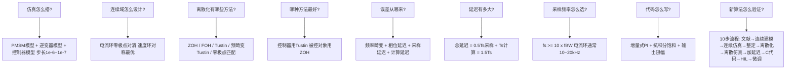

# SYS-04 从仿真到离散：连续域到离散域的完整转换工作流

**模块编号：** SYS-04
**模块名称：** 仿真到实现——连续域到离散域转换方法论（Simulation to Implementation: Continuous-to-Discrete Domain Conversion）
**文档版本：** v2.0
**适用对象：** 已掌握FOC基本原理和PI控制，需要将仿真算法落地到嵌入式硬件的嵌入式工程师
**前置知识：** ADV-ALG-13 PID结构选择与深度整定、ADV-ALG-01 控制环带宽设计、自动控制原理、数字信号处理基础
**难度等级：** ★★★★★

---

## 目录

1. [核心摘要](#1-核心摘要)
2. [MATLAB/Simulink仿真环境搭建](#2-matlabsimulink仿真环境搭建)
3. [连续域控制器设计](#3-连续域控制器设计)
4. [离散化方法](#4-离散化方法)
5. [离散化误差分析](#5-离散化误差分析)
6. [采样频率选择](#6-采样频率选择)
7. [离散域控制器验证](#7-离散域控制器验证)
8. [从仿真到代码的转换](#8-从仿真到代码的转换)
9. [新算法仿真验证流程](#9-新算法仿真验证流程)

---

## 1. 核心摘要

**一句话：** 从连续域设计到离散域实现不是"换个公式"那么简单——它是把一个理想化的数学世界映射到受采样延迟、计算延迟、量化噪声和有限字长约束的物理世界，每一步映射都引入误差，而工程师的任务是理解、量化并控制这些误差。

**认知挂钩：** 把连续域控制器想象成一张高分辨率的照片，离散化就是把它打印出来——打印分辨率（采样频率）决定了清晰度，色彩映射方式（离散化方法）决定了色彩还原度，打印机的机械精度（延迟和量化）决定了最终效果。如果直接拿低分辨率的打印稿去和原照片比，当然会有差距；但如果理解了打印过程的每一步损失，就可以在拍摄时（连续域设计时）预留补偿。

**核心问题链：**



**离散化方法速查表：**

| 离散化方法 | 适用对象 | 稳定性保持 | 频率响应精度 | MATLAB命令 | 推荐场景 |
|-----------|---------|-----------|------------|-----------|---------|
| ZOH | 被控对象 | 保持 | 低频好，高频差 | `c2d(G,Ts,'zoh')` | 电机模型离散化 |
| FOH | 被控对象 | 保持 | 比ZOH好 | `c2d(G,Ts,'foh')` | 输入变化较平滑时 |
| Tustin | 控制器 | **保持** | 中频好，高频畸变 | `c2d(G,Ts,'tustin')` | PI控制器离散化 |
| 预畸变Tustin | 控制器 | **保持** | 特定频率精确 | `c2d(G,Ts,'prewarp',wc)` | 关注穿越频率处精度 |
| 零极点匹配 | 控制器/对象 | 保持 | 取决于增益匹配 | `c2d(G,Ts,'matched')` | 需保持零极点结构时 |

---

## 2. MATLAB/Simulink仿真环境搭建

### 2.1 PMSM模型搭建

永磁同步电机的数学模型是整个仿真系统的核心。在 $d$-$q$ 旋转坐标系下，PMSM的电压方程为：

$$
\begin{cases}
v_d = R_s \cdot i_d + L_d \cdot \frac{di_d}{dt} - \omega_e \cdot L_q \cdot i_q \\
v_q = R_s \cdot i_q + L_q \cdot \frac{di_q}{dt} + \omega_e \cdot L_d \cdot i_d + \omega_e \cdot \lambda_m
\end{cases}
$$

其中：
- $R_s$：定子电阻 ($\Omega$)
- $L_d, L_q$：$d$/$q$ 轴电感 ($H$)，表贴式电机 $L_d = L_q = L_s$
- $\omega_e$：电角速度 ($rad/s$)
- $\lambda_m$：永磁体磁链 ($Wb$)

转矩方程：

$$
T_e = \frac{3}{2} \cdot p \cdot \left[ \lambda_m \cdot i_q + (L_d - L_q) \cdot i_d \cdot i_q \right]
$$

其中：
- $T_e$：电磁转矩 (N·m)
- $p$：极对数
- $\lambda_m$：永磁体磁链 (Wb)
- $i_d, i_q$：d/q轴电流 (A)
- $L_d, L_q$：d/q轴电感 (H)

对于表贴式电机（SPMSM），$L_d = L_q$，转矩方程简化为：

$$
T_e = \frac{3}{2} \cdot p \cdot \lambda_m \cdot i_q
$$

运动方程：

$$
J \cdot \frac{d\omega_m}{dt} = T_e - T_L - B \cdot \omega_m
$$

其中：
- $J$：转动惯量 ($kg \cdot m^2$)
- $\omega_m$：机械角速度 ($rad/s$)，$\omega_e = p \cdot \omega_m$
- $T_L$：负载转矩 ($N \cdot m$)
- $B$：粘滞摩擦系数 ($N \cdot m \cdot s/rad$)
- $p$：极对数

**Simulink搭建要点：**

1. **使用Simscape Electrical中的PMSM模块**：该模块已内置上述方程，支持表贴式和内置式两种类型
2. **参数配置**：在PMSM模块的"Configuration"选项卡中设置极对数、定子电阻、电感、磁链、惯量等
3. **初始条件**：注意设置合理的初始转子位置角，否则启动时可能出现电流冲击

**典型PMSM参数示例（1kW伺服电机）：**

| 参数 | 符号 | 数值 | 单位 |
|------|------|------|------|
| 极对数 | $p$ | 4 | - |
| 定子电阻 | $R_s$ | 0.85 | $\Omega$ |
| $d$轴电感 | $L_d$ | 3.5 | $mH$ |
| $q$轴电感 | $L_q$ | 3.5 | $mH$ |
| 永磁体磁链 | $\lambda_m$ | 0.075 | $Wb$ |
| 转动惯量 | $J$ | 0.0008 | $kg \cdot m^2$ |
| 粘滞摩擦 | $B$ | 0.001 | $N \cdot m \cdot s/rad$ |
| 额定转速 | $n_N$ | 3000 | $rpm$ |
| 额定电流 | $I_N$ | 5 | $A$ |

### 2.2 逆变器模型

#### 2.2.1 理想开关模型

最简化的逆变器模型，将每个桥臂等效为一个理想开关：

$$
v_{aN} = S_a \cdot V_{dc}, \quad v_{bN} = S_b \cdot V_{dc}, \quad v_{cN} = S_c \cdot V_{dc}
$$

其中 $S_a, S_b, S_c \in \{0, 1\}$ 为开关状态。

**Simulink实现**：使用"Universal Bridge"模块，开关器件选择"MOSFET"或"IGBT"，将导通电阻和正向压降设为0即可近似理想开关。

**适用场景**：算法验证初期，关注控制逻辑正确性，不关注逆变器非线性。

#### 2.2.2 带死区模型

实际逆变器中，上下桥臂开关切换之间必须插入死区时间（Dead Time），防止直通短路。死区引入输出电压畸变：

$$
\Delta V_{dead} = \frac{t_{DT}}{T_{PWM}} \cdot V_{dc} \cdot \text{sign}(i_{phase})
$$

其中 $t_{DT}$ 为死区时间，$T_{PWM}$ 为PWM周期。

**死区对输出电压的影响**：

| 电流方向 | 上管导通时间 | 下管导通时间 | 电压误差 |
|---------|------------|------------|---------|
| $i > 0$ | 减少 $t_{DT}$ | 不变 | 输出电压偏低 |
| $i < 0$ | 不变 | 减少 $t_{DT}$ | 输出电压偏高 |
| $i \approx 0$ | 不确定 | 不确定 | 严重畸变（过零畸变） |

**Simulink实现**：

1. 在"Universal Bridge"模块的"Device parameters"中设置死区时间（如 $2\mu s$）
2. 或使用"Dead Time"模块手动构建死区逻辑
3. 需配合死区补偿算法进行对比验证

**死区补偿的仿真验证**：在控制器中加入死区补偿后，对比补偿前后的相电流THD（Total Harmonic Distortion）。典型改善：THD从15%降至5%以下。

### 2.3 控制器模型

FOC控制器在Simulink中的典型模块结构：

```
                    ┌─────────────────────────────────────────────────┐
                    │              FOC Controller                      │
                    │                                                  │
  ω_ref ──→[速度PI]──→ i_q_ref ──┐                                   │
                                 │   ┌──────────┐    ┌──────────┐    │
  i_d_ref = 0 ──────────────────┼──→│ d轴PI    │──→→│          │    │
                                 │   └──────────┘    │  反Park   │    │
                    ┌──────────┐ │   ┌──────────┐    │  变换     │    │
  θ_e ─────────────→│  Park    │─┼──→│ q轴PI    │──→→│          │──→→ v_α, v_β
  i_a,b,c ──→[Clarke]→[Park]──→│   └──────────┘    └──────────┘    │
                    └──────────┘ │                                   │
                                 │   ┌──────────┐                    │
                                 └──→│ SVPWM    │──→ S_a, S_b, S_c  │
                                     └──────────┘                    │
                    └─────────────────────────────────────────────────┘
```

**关键模块说明：**

1. **Clarke变换**：$i_{\alpha}, i_{\beta} = f(i_a, i_b, i_c)$
2. **Park变换**：$i_d, i_q = f(i_{\alpha}, i_{\beta}, \theta_e)$
3. **PI控制器**：$d$轴和$q$轴各一个，并联型位置式
4. **反Park变换**：$v_{\alpha}, v_{\beta} = f(v_d, v_q, \theta_e)$
5. **SVPWM**：根据 $v_{\alpha}, v_{\beta}$ 计算三相占空比

### 2.4 仿真步长选择

仿真步长直接决定了数值计算的精度和稳定性。

**步长选择原则：**

| 仿真对象 | 推荐步长 | 理由 |
|---------|---------|------|
| Power Electronics（开关模型） | $1 \times 10^{-6} \sim 1 \times 10^{-7}$ $s$ | 需捕捉开关瞬态 |
| 控制算法（连续域） | $1 \times 10^{-5} \sim 1 \times 10^{-6}$ $s$ | 需与电气模型匹配 |
| 控制算法（离散域） | 等于实际采样周期 $T_s$ | 1:1还原真实时序 |
| 机械系统 | $1 \times 10^{-4} \sim 1 \times 10^{-5}$ $s$ | 机械时间常数远大于电气 |

**PowerGUI配置**：

```matlab
% PowerGUI设置为离散仿真模式
% Simulation > Configuration Parameters > Solver:
%   Type: Fixed-step
%   Solver: ode3 (Bogacki-Shampine) 或 ode1 (Euler)
%   Fixed-step size: 1e-6

% 或通过命令行设置
set_param(gcs, 'SolverType', 'Fixed-step');
set_param(gcs, 'Solver', 'ode3');
set_param(gcs, 'FixedStep', '1e-6');
```

**为什么必须用离散求解器？**

连续求解器（如ode45）在处理开关非线性时会产生数值振荡（chattering），且仿真速度极慢。离散求解器在每个步长内假设系统为线性时不变，通过状态空间递推计算，既保证了数值稳定性，又大幅提升了仿真速度。

**步长与精度的关系**：

以PWM频率10kHz为例，PWM周期 $T_{PWM} = 100\mu s$：

- 步长 $1\mu s$：每个PWM周期100个采样点，精度足够
- 步长 $0.1\mu s$：每个PWM周期1000个采样点，精度极高但速度慢10倍
- 步长 $10\mu s$：每个PWM周期10个采样点，可能丢失关键瞬态

**经验法则**：仿真步长 $\leq T_{PWM} / 100$，即10kHz PWM时步长 $\leq 1\mu s$。

### 2.5 仿真加速技巧

#### 2.5.1 加速模式

```matlab
% 方法1：Simulink Accelerator模式（JIT编译）
% Simulation > Mode > Accelerator
set_param(gcs, 'SimulationMode', 'accelerator');

% 方法2：Rapid Accelerator模式（生成独立可执行文件）
set_param(gcs, 'SimulationMode', 'rapid');

% 方法3：使用MATLAB Coder生成MEX函数（适用于纯MATLAB模型）
% 适用于S-Function编写的控制器模型
```

**加速效果对比**：

| 模式 | 编译时间 | 仿真速度 | 调试能力 | 适用场景 |
|------|---------|---------|---------|---------|
| Normal | 无 | 1x | 完全 | 开发调试 |
| Accelerator | 中等 | 2~5x | 有限 | 参数扫描 |
| Rapid Accelerator | 较长 | 5~20x | 无 | 批量仿真 |

#### 2.5.2 并行仿真

当需要扫描大量参数组合时，使用 `parsim` 进行并行仿真：

```matlab
% 参数扫描：Kp从0.1到2.0，步长0.1
Kp_values = 0.1:0.1:2.0;
numSims = length(Kp_values);

% 创建Simulink.SimulationInput对象数组
in(1:numSims) = Simulink.SimulationInput('foc_model');
for i = 1:numSims
    in(i) = in(i).setVariable('Kp_current', Kp_values(i));
end

% 并行仿真
out = parsim(in, 'ShowProgress', 'on', ...
    'TransferBaseWorkspaceVariables', 'on');
```

#### 2.5.3 其他加速技巧

1. **降低仿真精度**：将PowerGUI步长从 $0.1\mu s$ 放大到 $1\mu s$，速度提升约10倍
2. **简化模型**：调试阶段用理想开关，验证阶段再换带死区模型
3. **使用phasor方法**：只关注基波分量时，PowerGUI可设置为Phasor模式，速度提升100倍以上
4. **减少示波器**：Simulink Scope是性能杀手，尽量用To Workspace模块替代

---

## 3. 连续域控制器设计

### 3.1 电流环设计：零极点对消法

电流环是FOC控制的核心，其带宽直接决定了系统的动态响应性能。

#### 3.1.1 被控对象模型

以 $q$ 轴电流环为例（$d$ 轴同理），被控对象为 $R_s$-$L_s$ 电路：

$$
G_{plant}(s) = \frac{I_q(s)}{V_q(s)} = \frac{1}{R_s + L_s \cdot s} = \frac{1/R_s}{1 + (L_s/R_s) \cdot s} = \frac{K}{\tau \cdot s + 1}
$$

其中：
- $K = 1/R_s$：稳态增益
- $\tau = L_s/R_s$：电气时间常数

代入典型参数：$R_s = 0.85\Omega$，$L_s = 3.5mH$：

$$
K = \frac{1}{0.85} = 1.176 \; A/V, \quad \tau = \frac{3.5 \times 10^{-3}}{0.85} = 4.12 \times 10^{-3} \; s
$$

#### 3.1.2 零极点对消法原理

PI控制器的传递函数：

$$
C_{PI}(s) = K_p + \frac{K_i}{s} = K_p \cdot \frac{s + K_i/K_p}{s} = K_p \cdot \frac{s + \omega_z}{s}
$$

零极点对消的核心思想：**令PI控制器的零点等于被控对象的极点**，即：

$$
\omega_z = \frac{K_i}{K_p} = \frac{R_s}{L_s} = \frac{1}{\tau}
$$

对消后，开环传递函数简化为：

$$
G_{ol}(s) = C_{PI}(s) \cdot G_{plant}(s) = K_p \cdot \frac{s + 1/\tau}{s} \cdot \frac{1/R_s}{\tau s + 1} = \frac{K_p / (R_s \cdot \tau)}{s} = \frac{K_p / L_s}{s}
$$

这是一个纯积分环节！闭环传递函数为：

$$
G_{cl}(s) = \frac{G_{ol}(s)}{1 + G_{ol}(s)} = \frac{K_p / L_s}{s + K_p / L_s} = \frac{\omega_c}{s + \omega_c}
$$

其中 $\omega_c = K_p / L_s$ 即为电流环的闭环带宽。

#### 3.1.3 参数计算

设定期望电流环带宽 $f_{BW}$（通常1~3kHz），则：

$$
\omega_c = 2\pi \cdot f_{BW}
$$

$$
K_p = \omega_c \cdot L_s = 2\pi \cdot f_{BW} \cdot L_s
$$

$$
K_i = \frac{K_p}{\tau} = \frac{K_p \cdot R_s}{L_s} = \omega_c \cdot R_s = 2\pi \cdot f_{BW} \cdot R_s
$$

**计算示例**：设 $f_{BW} = 2000 \; Hz$，$L_s = 3.5mH$，$R_s = 0.85\Omega$：

$$
K_p = 2\pi \times 2000 \times 3.5 \times 10^{-3} = 43.98 \; V/A
$$

$$
K_i = 2\pi \times 2000 \times 0.85 = 10681 \; V/(A \cdot s)
$$

**验证**：零极点对消条件 $K_i/K_p = R_s/L_s = 0.85/0.0035 = 242.86$，而 $K_i/K_p = 10681/43.98 = 242.88$，吻合。

#### 3.1.4 交叉耦合的影响

上述设计忽略了 $d$-$q$ 轴交叉耦合项 $-\omega_e L_s i_q$ 和 $\omega_e L_s i_d + \omega_e \lambda_m$。在高速运行时，这些耦合项会显著影响电流环性能。

**前馈解耦**：在控制器中加入交叉耦合前馈：

$$
\begin{cases}
v_d^{ff} = -\omega_e \cdot L_s \cdot i_q \\
v_q^{ff} = \omega_e \cdot L_s \cdot i_d + \omega_e \cdot \lambda_m
\end{cases}
$$

加入前馈后，$d$/$q$ 轴电流环完全解耦，可独立设计。

### 3.2 速度环设计：对称最优法

速度环的被控对象包括电流环（简化为一阶惯性）和机械系统（积分环节）：

$$
G_{speed\_plant}(s) = \frac{\omega_m(s)}{I_q^*(s)} = \frac{K_t}{J \cdot s} \cdot \frac{1}{\tau_c \cdot s + 1}
$$

其中：
- $K_t = \frac{3}{2} p \lambda_m$：转矩常数
- $\tau_c = 1/\omega_c$：电流环等效时间常数

**对称最优法原理**：

开环传递函数：

$$
G_{ol}(s) = K_{p\omega} \cdot \frac{s + \omega_{z\omega}}{s} \cdot \frac{K_t}{J \cdot s \cdot (\tau_c s + 1)}
$$

对称最优法要求开环Bode图在穿越频率处以 $-20dB/dec$ 穿越，且穿越频率位于两个转折频率的几何中点：

$$
\omega_{BW\omega} = \sqrt{\omega_{z\omega} \cdot \omega_{p\omega}} = \sqrt{\omega_{z\omega} \cdot \frac{1}{\tau_c}}
$$

参数设计：

$$
\omega_{z\omega} = \frac{1}{a \cdot \tau_c}, \quad a \geq 2
$$

$$
K_{p\omega} = \frac{J}{a \cdot K_t \cdot \tau_c}
$$

$$
K_{i\omega} = \frac{K_{p\omega}}{a \cdot \tau_c} = \frac{J}{a^2 \cdot K_t \cdot \tau_c^2}
$$

其中 $a$ 为对称最优参数，通常取 $a = 2$（临界阻尼）或 $a = 3$（过阻尼，更稳定）。

**计算示例**：设 $a = 2$，$K_t = 0.9 \; Nm/A$，$J = 0.0008 \; kg \cdot m^2$，$\tau_c = 1/(2\pi \times 2000) = 7.96 \times 10^{-5} \; s$：

$$
K_{p\omega} = \frac{0.0008}{2 \times 0.9 \times 7.96 \times 10^{-5}} = 5.59 \; A/(rad/s)
$$

$$
K_{i\omega} = \frac{0.0008}{4 \times 0.9 \times (7.96 \times 10^{-5})^2} = 35079 \; A/rad
$$

速度环带宽：

$$
f_{BW\omega} = \frac{1}{2\pi \cdot a \cdot \tau_c} = \frac{1}{2\pi \times 2 \times 7.96 \times 10^{-5}} = 1000 \; Hz
$$

**注意**：速度环带宽通常为电流环带宽的1/5~1/10，以确保足够的带宽分离。

### 3.3 仿真验证

#### 3.3.1 阶跃响应验证

```matlab
% 构建闭环系统
s = tf('s');
Ls = 3.5e-3; Rs = 0.85;
Kp_i = 43.98; Ki_i = 10681;

G_plant = 1 / (Ls*s + Rs);
C_PI = Kp_i + Ki_i/s;
G_ol = C_PI * G_plant;
G_cl = feedback(G_ol, 1);

% 阶跃响应
figure;
step(G_cl);
title('电流环阶跃响应（连续域）');
grid on;

% 提取性能指标
info = stepinfo(G_cl);
fprintf('上升时间: %.4f s\n', info.RiseTime);
fprintf('调节时间: %.4f s\n', info.SettlingTime);
fprintf('超调量: %.2f %%\n', info.Overshoot);
```

#### 3.3.2 Bode图验证

```matlab
% 开环Bode图
figure;
margin(G_ol);
title('电流环开环Bode图');
grid on;

% 验证穿越频率和相位裕度
[Gm, Pm, Wcg, Wcp] = margin(G_ol);
fprintf('增益裕度: %.2f dB @ %.2f Hz\n', 20*log10(Gm), Wcg/(2*pi));
fprintf('相位裕度: %.2f deg @ %.2f Hz\n', Pm, Wcp/(2*pi));
```

### 3.4 连续域设计的局限性

连续域设计在理想假设下进行，但实际数字控制系统存在以下未被考虑的因素：

| 未考虑因素 | 影响 | 量化 |
|-----------|------|------|
| 采样延迟 | 等效于半个采样周期的纯滞后 | $-0.5 T_s \cdot \omega$ 相位延迟 |
| 计算延迟 | 从采样到PWM更新有一个 $T_s$ 延迟 | $-T_s \cdot \omega$ 相位延迟 |
| 零阶保持器 | 采样保持引入额外相位 | $-\frac{\omega T_s}{2}$ 相位延迟 |
| PWM延迟 | 占空比更新延迟 | 0~1个 $T_s$ |
| 量化误差 | ADC分辨率有限 | 12-bit ADC: LSB = $V_{ref}/4096$ |
| 截断误差 | 定点数运算 | 取决于数据格式 |

**关键结论**：连续域设计的带宽和相位裕度在实际系统中会降低，必须在离散化时进行补偿。

---

## 4. 离散化方法

### 4.1 零阶保持器（Zero-Order Hold, ZOH）

#### 4.1.1 原理

ZOH是最自然的离散化方式——数字控制器的输出在两个采样时刻之间保持恒定，这恰好对应了DAC或PWM的行为。

ZOH的脉冲传递函数：

$$
G_{ZOH}(z) = (1 - z^{-1}) \cdot \mathcal{Z}\left\{ \frac{G(s)}{s} \right\}
$$

**推导过程**：

1. 连续信号 $u(t)$ 经过ZOH后变为阶梯信号 $u_{ZOH}(t)$
2. ZOH的冲激响应为 $h_{ZOH}(t) = \mathbf{1}_{[0, T_s)}(t)$
3. ZOH的传递函数为 $G_{ZOH}(s) = \frac{1 - e^{-T_s s}}{s}$
4. 离散化等效：$G(z) = \mathcal{Z}\left\{ \mathcal{L}^{-1}\left[ G_{ZOH}(s) \cdot G(s) \right] \right\}$

#### 4.1.2 一阶系统ZOH离散化示例

被控对象 $G(s) = \frac{K}{\tau s + 1}$：

$$
G(z) = \frac{K(1 - e^{-T_s/\tau})}{z - e^{-T_s/\tau}} = \frac{K(1 - e^{-T_s/\tau}) \cdot z^{-1}}{1 - e^{-T_s/\tau} \cdot z^{-1}}
$$

其中：
- $K$：稳态增益
- $\tau$：系统时间常数 (s)
- $T_s$：采样周期 (s)
- $e^{-T_s/\tau}$：离散极点位置

代入参数 $K = 1/0.85 = 1.176$，$\tau = 4.12ms$，$T_s = 100\mu s$：

$$
e^{-T_s/\tau} = e^{-0.1/4.12} = e^{-0.0243} = 0.9760
$$

$$
G(z) = \frac{1.176 \times (1 - 0.9760)}{z - 0.9760} = \frac{0.0282}{z - 0.9760}
$$

#### 4.1.3 MATLAB实现

```matlab
% 定义连续被控对象
Rs = 0.85; Ls = 3.5e-3;
G_s = tf(1, [Ls, Rs]);

% ZOH离散化
Ts = 100e-6;  % 采样周期100us
G_z_zoh = c2d(G_s, Ts, 'zoh');

% 对比连续和离散的阶跃响应
figure;
step(G_s, 'b', G_z_zoh, 'r--');
legend('连续', 'ZOH离散');
title('被控对象阶跃响应对比');
grid on;
```

#### 4.1.4 适用场景

ZOH离散化最适合**被控对象**的离散化，因为数字控制系统的DAC/PWM输出本质上就是零阶保持器。自然采样过程就是ZOH过程，因此ZOH离散化在物理上是精确的。

### 4.2 一阶保持器（First-Order Hold, FOH）

#### 4.2.1 原理

FOH假设输入信号在两个采样点之间线性变化，而非恒定：

$$
u_{FOH}(t) = u[k] + \frac{u[k] - u[k-1]}{T_s} \cdot (t - kT_s), \quad t \in [kT_s, (k+1)T_s)
$$

其中：
- $u_{FOH}(t)$：FOH重构信号
- $u[k], u[k-1]$：当前和上一采样时刻的值
- $T_s$：采样周期 (s)
- $kT_s$：当前采样时刻 (s)

FOH的传递函数：

$$
G_{FOH}(s) = \frac{1 + T_s s}{T_s} \cdot \left( \frac{1 - e^{-T_s s}}{s} \right)^2
$$

#### 4.2.2 MATLAB实现

```matlab
G_z_foh = c2d(G_s, Ts, 'foh');
```

#### 4.2.3 ZOH vs FOH对比

| 特性 | ZOH | FOH |
|------|-----|-----|
| 假设 | 输入在采样间恒定 | 输入在采样间线性变化 |
| 相位延迟 | 较大（$\omega T_s / 2$） | 较小 |
| 精度 | 低频好 | 全频段更好 |
| 物理对应 | DAC/PWM输出 | 无直接物理对应 |
| 计算复杂度 | 低 | 略高 |
| 推荐场景 | 被控对象离散化 | 输入变化平滑时的精确建模 |

**关键结论**：FOH在仿真中可能更精确，但在实际数字控制系统中，由于DAC/PWM是ZOH行为，**被控对象离散化应首选ZOH**。

### 4.3 Tustin变换（双线性变换）

#### 4.3.1 原理

Tustin变换（也称双线性变换）是最常用的控制器离散化方法。它通过以下替换将 $s$ 域映射到 $z$ 域：

$$
s = \frac{2}{T_s} \cdot \frac{z - 1}{z + 1}
$$

或等价地：

$$
z = \frac{1 + T_s s / 2}{1 - T_s s / 2}
$$

**稳定性保持**：Tustin变换将 $s$ 平面的左半平面映射到 $z$ 平面的单位圆内，因此**连续域稳定的系统，离散后一定稳定**。

证明：设 $s = \sigma + j\omega$，$\sigma < 0$（稳定），则：

$$
|z| = \left| \frac{1 + T_s(\sigma + j\omega)/2}{1 - T_s(\sigma + j\omega)/2} \right| = \sqrt{\frac{(1 + T_s\sigma/2)^2 + (T_s\omega/2)^2}{(1 - T_s\sigma/2)^2 + (T_s\omega/2)^2}}
$$

当 $\sigma < 0$ 时，分子 $< $ 分母，因此 $|z| < 1$，即映射到单位圆内。

#### 4.3.2 频率畸变

Tustin变换的频率映射是非线性的。设 $s = j\omega_a$（模拟频率），则：

$$
z = \frac{1 + j\omega_a T_s/2}{1 - j\omega_a T_s/2} = e^{j\omega_d T_s}
$$

解得离散频率与模拟频率的关系：

$$
\omega_d = \frac{2}{T_s} \cdot \arctan\left(\frac{\omega_a T_s}{2}\right)
$$

这就是**频率畸变**公式。当 $\omega_a T_s \ll 2$ 时，$\omega_d \approx \omega_a$；但当频率较高时，$\omega_d$ 趋近于 $\pi/T_s = \omega_s/2$（Nyquist频率），即高频被"压缩"。

**频率畸变的数值示例**：

设 $T_s = 100\mu s$，$f_s = 10kHz$：

| 模拟频率 $f_a$ | 离散频率 $f_d$ | 畸变率 |
|---------------|---------------|--------|
| 100 Hz | 100.0 Hz | 0.00% |
| 500 Hz | 499.4 Hz | -0.12% |
| 1000 Hz | 997.6 Hz | -0.24% |
| 2000 Hz | 1990.4 Hz | -0.48% |
| 5000 Hz | 4908.4 Hz | -1.83% |

可见，在电流环带宽（1~3kHz）范围内，畸变率小于0.5%，影响可忽略。但在高速观测器等高频应用中，需考虑畸变补偿。

#### 4.3.3 预畸变Tustin

预畸变Tustin的核心思想：**在Tustin变换之前，先对关注频率进行预畸变，使得该频率处的响应精确匹配**。

预畸变系数：

$$
\omega_c' = \frac{2}{T_s} \cdot \tan\left(\frac{\omega_c T_s}{2}\right)
$$

其中 $\omega_c$ 是需要精确匹配的频率（通常选穿越频率）。

**操作步骤**：

1. 将连续传递函数 $G(s)$ 中的 $s$ 替换为 $s \cdot \omega_c' / \omega_c$
2. 对替换后的传递函数进行标准Tustin变换

```matlab
% 标准Tustin
G_z_tustin = c2d(G_s, Ts, 'tustin');

% 预畸变Tustin，穿越频率处精确匹配
wc = 2*pi*2000;  % 穿越频率2000Hz
G_z_prewarp = c2d(G_s, Ts, 'prewarp', wc);
```

#### 4.3.4 PI控制器Tustin离散化示例

连续PI控制器：

$$
C_{PI}(s) = K_p + \frac{K_i}{s} = \frac{K_p \cdot s + K_i}{s}
$$

Tustin替换 $s = \frac{2}{T_s} \cdot \frac{z-1}{z+1}$：

$$
C_{PI}(z) = \frac{K_p \cdot \frac{2}{T_s} \cdot \frac{z-1}{z+1} + K_i}{\frac{2}{T_s} \cdot \frac{z-1}{z+1}} = \frac{K_p \cdot \frac{2}{T_s}(z-1) + K_i(z+1)}{\frac{2}{T_s}(z-1)}
$$

化简：

$$
C_{PI}(z) = \frac{(K_p \cdot \frac{2}{T_s} + K_i) \cdot z + (K_i - K_p \cdot \frac{2}{T_s})}{\frac{2}{T_s} \cdot (z - 1)}
$$

令 $a_0 = K_p + K_i T_s/2$，$a_1 = -(K_p - K_i T_s/2)$，$b_0 = 1$，$b_1 = -1$：

$$
C_{PI}(z) = \frac{a_0 + a_1 z^{-1}}{1 - z^{-1}} = \frac{a_0 z + a_1}{z - 1}
$$

**差分方程**：

$$
u[k] = u[k-1] + a_0 \cdot e[k] + a_1 \cdot e[k-1]
$$

代入 $K_p = 43.98$，$K_i = 10681$，$T_s = 100\mu s$：

$$
a_0 = 43.98 + 10681 \times 50 \times 10^{-6} = 43.98 + 0.534 = 44.514
$$

$$
a_1 = -(43.98 - 0.534) = -43.446
$$

### 4.4 零极点匹配法（Matched ZOH / Matched Pole-Zero）

#### 4.4.1 原理

零极点匹配法直接将 $s$ 域的零极点映射到 $z$ 域：

- 极点映射：$s = -a \rightarrow z = e^{-aT_s}$，即 $1 + s/a \rightarrow 1 - z^{-1}e^{-aT_s}$
- 零点映射：$s = -b \rightarrow z = e^{-bT_s}$，即 $1 + s/b \rightarrow 1 - z^{-1}e^{-bT_s}$
- 无穷远零点：$s \rightarrow \infty$ 映射到 $z = -1$（或 $z = 0$，取决于实现）

**增益匹配**：离散化后的增益需要与连续系统匹配。通常选择直流增益匹配：

$$
G_{z}(1) = G_{s}(0) \quad \text{（直流增益匹配）}
$$

或高频增益匹配：

$$
\lim_{z \rightarrow -1} (z+1) G_z(z) = \lim_{s \rightarrow \infty} s \cdot G_s(s) \quad \text{（高频增益匹配）}
$$

#### 4.4.2 一阶系统示例

$$
G(s) = \frac{K}{\tau s + 1} = \frac{K/\tau}{s + 1/\tau}
$$

极点 $s = -1/\tau$ 映射到 $z = e^{-T_s/\tau}$：

$$
G(z) = \frac{K_z}{1 - e^{-T_s/\tau} \cdot z^{-1}}
$$

直流增益匹配：$G_z(1) = G_s(0) = K$：

$$
\frac{K_z}{1 - e^{-T_s/\tau}} = K \Rightarrow K_z = K(1 - e^{-T_s/\tau})
$$

结果与ZOH离散化完全一致！对于一阶系统，零极点匹配法（直流增益匹配）等价于ZOH。

#### 4.4.3 PI控制器零极点匹配

$$
C_{PI}(s) = K_p \cdot \frac{s + K_i/K_p}{s}
$$

- 零点 $s = -K_i/K_p$ 映射到 $z = e^{-K_i T_s/K_p}$
- 极点 $s = 0$ 映射到 $z = 1$

$$
C_{PI}(z) = K_z \cdot \frac{1 - e^{-K_i T_s/K_p} \cdot z^{-1}}{1 - z^{-1}}
$$

直流增益匹配：$C_s(0) = \infty$（积分器），无法匹配直流增益。改用高频增益匹配：

$$
\lim_{s \rightarrow \infty} C_{PI}(s) = K_p, \quad \lim_{z \rightarrow -1} C_{PI}(z) = K_z \cdot \frac{1 + e^{-K_i T_s/K_p}}{2}
$$

$$
K_z = \frac{2K_p}{1 + e^{-K_i T_s/K_p}}
$$

```matlab
% 零极点匹配法
G_z_matched = c2d(G_s, Ts, 'matched');
```

### 4.5 各方法对比

#### 4.5.1 精度对比

以PI控制器 $C(s) = 43.98 + 10681/s$，$T_s = 100\mu s$ 为例：

```matlab
% 定义连续PI控制器
Kp = 43.98; Ki = 10681; Ts = 100e-6;
C_s = tf([Kp, Ki], [1, 0]);

% 各种离散化方法
C_z_zoh = c2d(C_s, Ts, 'zoh');
C_z_foh = c2d(C_s, Ts, 'foh');
C_z_tustin = c2d(C_s, Ts, 'tustin');
C_z_matched = c2d(C_s, Ts, 'matched');

% Bode图对比
figure;
bode(C_s, C_z_zoh, C_z_tustin, C_z_matched);
legend('连续', 'ZOH', 'Tustin', 'Matched');
title('PI控制器离散化Bode图对比');
grid on;
```

#### 4.5.2 综合对比表

| 对比维度 | ZOH | FOH | Tustin | 预畸变Tustin | 零极点匹配 |
|---------|-----|-----|--------|------------|-----------|
| 稳定性保持 | 是 | 是 | **是** | **是** | 是 |
| 直流增益精确 | 是 | 是 | 是 | 是 | 取决于匹配方式 |
| 穿越频率精确 | 否 | 否 | 否 | **是** | 否 |
| 频率畸变 | 无 | 无 | 有（高频） | 特定频率无 | 无 |
| 相位保持 | 差 | 中 | 好 | 特定频率好 | 中 |
| 计算复杂度 | 低 | 中 | 低 | 低 | 低 |
| 物理对应 | DAC/PWM | 无 | 无 | 无 | 无 |
| **推荐用途** | **被控对象** | 特殊建模 | **控制器** | **高精度控制器** | 零极点结构重要时 |

#### 4.5.3 选择决策树

```
需要离散化什么？
├── 被控对象（电机、滤波器等）
│   └── → ZOH（物理对应最准确）
└── 控制器（PI、观测器等）
    ├── 关注穿越频率处精度？
    │   ├── 是 → 预畸变Tustin
    │   └── 否 → Tustin
    └── 需要保持零极点结构？
        └── 是 → 零极点匹配
```

---

## 5. 离散化误差分析

### 5.1 频率畸变

Tustin变换的频率畸变已在4.3.2节中分析。这里补充其对控制系统的影响。

**对电流环的影响**：

设电流环穿越频率 $f_c = 2000Hz$，$T_s = 100\mu s$：

$$
f_d = \frac{1}{\pi T_s} \cdot \arctan(\pi f_c T_s) = \frac{1}{\pi \times 10^{-4}} \cdot \arctan(\pi \times 2000 \times 10^{-4}) = 1997.6 \; Hz
$$

畸变率仅0.12%，对电流环几乎无影响。

**对高速观测器的影响**：

设观测器带宽 $f_{obs} = 5000Hz$：

$$
f_d = \frac{1}{\pi \times 10^{-4}} \cdot \arctan(\pi \times 5000 \times 10^{-4}) = 4908.4 \; Hz
$$

畸变率1.83%，对于观测器可能需要预畸变补偿。

### 5.2 相位误差

离散化引入的相位误差主要来自两个方面：

1. **离散化方法本身的相位误差**：ZOH比Tustin的相位误差更大
2. **采样和计算延迟的相位误差**：这是最主要的误差源

**ZOH的相位延迟**：

$$
\angle G_{ZOH}(j\omega) = -\frac{\omega T_s}{2}
$$

在穿越频率 $\omega_c = 2\pi \times 2000 \; rad/s$ 处：

$$
\angle G_{ZOH}(j\omega_c) = -\frac{2\pi \times 2000 \times 10^{-4}}{2} = -0.628 \; rad = -36.0°
$$

这意味着仅ZOH就引入了36度的相位延迟！

**Tustin的相位延迟**：

Tustin变换保持频率响应的形状，但频率轴有畸变。在穿越频率处，Tustin的相位与连续域几乎一致（畸变率0.12%对应约0.4度误差）。

### 5.3 采样延迟

采样过程等效于一个ZOH，引入半个采样周期的等效延迟：

$$
G_{sample}(s) \approx e^{-0.5 T_s s}
$$

**物理本质**：在一个采样周期内，信号在任意时刻被采样，但等效来看，平均采样时刻在采样区间的中点，因此等效延迟为 $T_s/2$。

在穿越频率处的相位延迟：

$$
\angle G_{sample}(j\omega_c) = -0.5 T_s \omega_c = -0.5 \times 10^{-4} \times 2\pi \times 2000 = -0.628 \; rad = -36.0°
$$

### 5.4 计算延迟

从ADC采样到PWM占空比更新，存在一个完整的采样周期延迟：

```
时间轴：
  ┌──────────────┬──────────────┬──────────────┐
  │   k-1周期    │    k周期     │   k+1周期    │
  ├──────────────┼──────────────┼──────────────┤
  │              │↑ADC采样      │              │
  │              │  ↓计算       │              │
  │              │              │↑PWM更新      │
  └──────────────┴──────────────┴──────────────┘
                    │←── 1个Ts ──→│
```

计算延迟的传递函数：

$$
G_{compute}(s) = e^{-T_s s}
$$

在穿越频率处的相位延迟：

$$
\angle G_{compute}(j\omega_c) = -T_s \omega_c = -10^{-4} \times 2\pi \times 2000 = -1.257 \; rad = -72.0°
$$

### 5.5 总延迟分析

**总延迟**：

$$
T_{delay} = 0.5 T_s \text{（采样）} + 1.0 T_s \text{（计算）} = 1.5 T_s
$$

$$
G_{delay}(s) = e^{-1.5 T_s s}
$$

**在穿越频率处的相位延迟**：

$$
\angle G_{delay}(j\omega_c) = -1.5 T_s \omega_c = -1.5 \times 10^{-4} \times 2\pi \times 2000 = -1.885 \; rad = -108.0°
$$

**对相位裕度的影响**：

连续域设计时电流环的相位裕度约为90度（一阶系统+PI控制器），延迟引入108度相位延迟后，相位裕度降为 $90 - 108 = -18$ 度，**系统不稳定**！

**这说明直接将连续域设计参数用于离散系统，很可能导致不稳定。**

### 5.6 延迟补偿方法

#### 5.6.1 方法一：降低带宽预留相位裕度

在连续域设计时，将延迟的相位影响纳入考量，降低带宽使相位裕度满足要求：

$$
PM_{required} = PM_{continuous} - 1.5 T_s \omega_c \geq PM_{min}
$$

通常要求 $PM_{min} \geq 30°$，则：

$$
\omega_c \leq \frac{PM_{continuous} - 30°}{1.5 T_s \times (180°/\pi)}
$$

对于零极点对消法，$PM_{continuous} = 90°$：

$$
\omega_c \leq \frac{90° - 30°}{1.5 \times 10^{-4} \times 57.3°} = \frac{60°}{0.00860°} = 6981 \; rad/s
$$

$$
f_c \leq 1111 \; Hz
$$

即：在 $T_s = 100\mu s$ 时，考虑1.5Ts延迟后，电流环带宽上限约为1100Hz。

#### 5.6.2 方法二：在连续域设计中加入延迟模型

将延迟近似为一阶Padé近似：

$$
e^{-1.5 T_s s} \approx \frac{1 - 0.75 T_s s}{1 + 0.75 T_s s}
$$

在连续域设计时，将被控对象修改为：

$$
G_{plant\_delay}(s) = G_{plant}(s) \cdot \frac{1 - 0.75 T_s s}{1 + 0.75 T_s s}
$$

然后基于 $G_{plant\_delay}(s)$ 进行零极点对消设计，这样设计出的控制器自动补偿了延迟。

```matlab
% 加入延迟的连续域设计
Ts = 100e-6;
delay_approx = tf([1, -0.75*Ts], [1, 0.75*Ts]);  % Padé近似
G_plant_delay = G_plant * delay_approx;

% 基于含延迟模型重新设计PI参数
% 此时的带宽会自动降低到延迟允许的范围内
```

#### 5.6.3 方法三：Smith预估器

对于大延迟系统，Smith预估器可以有效补偿：

$$
u[k] = C(z) \cdot e[k] + G_{model}(z) \cdot (u[k] - G_{model\_delay}(z) \cdot u[k])
$$

但在电机控制中，1.5Ts延迟相对较小（通常 $1.5 T_s \omega_c < 1$），Smith预估器的优势不明显，方法一和方法二更实用。

#### 5.6.4 方法四：减小计算延迟

通过优化软件架构，将计算延迟从1个 $T_s$ 减小到0.5个 $T_s$ 甚至更小：

1. **ADC在PWM中心采样**：电流采样在PWM计数器峰值时刻触发
2. **计算完成后立即更新PWM**：不等下一个PWM周期，而是在计算完成后立即更新影子寄存器
3. **使用PWM双更新模式**：在PWM周期的峰值和谷值各更新一次

```
优化后的时序：
  ┌──────────────┬──────────────┐
  │    k周期     │   k+1周期    │
  ├──────────────┼──────────────┤
  │    ↑ADC采样  │              │
  │    ↓计算     │              │
  │    ↓PWM更新  │              │
  └──────────────┴──────────────┘
  延迟：0.5Ts(采样) + 0.5Ts(计算) = 1.0Ts
```

优化后总延迟从1.5Ts降至1.0Ts，带宽上限提升约50%。

---

## 6. 采样频率选择

### 6.1 电流环采样频率

电流环是内环，对采样频率要求最高：

$$
f_s \geq 10 \times f_{BW\_current}
$$

**推导**：根据5.5节的分析，1.5Ts延迟在穿越频率处引入的相位延迟为：

$$
\Delta\phi = -1.5 T_s \omega_c = -1.5 \times \frac{2\pi f_c}{f_s} \times \frac{180°}{\pi} = -\frac{540° \cdot f_c}{f_s}
$$

要求 $\Delta\phi \leq 30°$（保留足够的相位裕度）：

$$
f_s \geq 18 \times f_c
$$

工程上取 $f_s \geq 10 \times f_c$ 是一个较宽松的标准，适用于对相位裕度要求不极端的场合。

**典型配置**：

| 电流环带宽 | 最低采样频率 | 推荐采样频率 | PWM频率 |
|-----------|------------|------------|--------|
| 500 Hz | 5 kHz | 10 kHz | 10 kHz |
| 1000 Hz | 10 kHz | 20 kHz | 20 kHz |
| 2000 Hz | 20 kHz | 40 kHz | 20 kHz（双更新） |
| 3000 Hz | 30 kHz | 60 kHz | 30 kHz（双更新） |

### 6.2 速度环采样频率

速度环带宽远低于电流环，通常：

$$
f_{BW\_speed} = \frac{1}{5 \sim 10} \times f_{BW\_current}
$$

速度环采样频率可以与电流环相同（每个电流环周期执行一次速度环），也可以降频（每N个电流环周期执行一次）：

$$
f_{s\_speed} = \frac{f_{s\_current}}{N}, \quad N = 1, 2, 4, 8, \ldots
$$

**降频的条件**：$f_{s\_speed} \geq 10 \times f_{BW\_speed}$

**典型配置**：电流环20kHz，速度环2kHz（$N = 10$）或5kHz（$N = 4$）。

### 6.3 PWM频率与采样频率的关系

#### 6.3.1 单更新模式

采样频率 = PWM频率，每个PWM周期采样一次电流：

$$
f_s = f_{PWM}
$$

ADC在PWM计数器峰值时刻触发采样（中心对齐模式下电流纹波最小）。

#### 6.3.2 双更新模式

采样频率 = 2 x PWM频率，每个PWM周期采样两次电流（峰值和谷值各一次）：

$$
f_s = 2 \times f_{PWM}
$$

**优势**：
- 采样频率翻倍，等效延迟减半
- 电流环带宽可以更高
- 电流纹波平均效果更好

**代价**：
- 计算量翻倍
- 需要ADC在PWM谷值时刻也能触发
- 两次采样的电流值不同（纹波导致），需要合理处理

**STM32双更新模式配置**：

```c
// TIM1中心对齐模式，使能双更新
TIM1->CR1 |= TIM_CR1_CMS_0;      // 中心对齐模式1
TIM1->CR1 |= TIM_CR1_URS;        // 只有溢出产生更新
TIM1->BDTR |= TIM_BDTR_OSSR;     // 空闲状态高阻

// ADC在峰值和谷值各触发一次
// 峰值：TIM1->CCR4 = TIM1->ARR - 死区时间 - 采样偏移
// 谷值：通过TIM1的TRGO2触发ADC
```

### 6.4 过高采样频率的问题

采样频率并非越高越好：

1. **噪声放大**：ADC量化噪声的功率谱密度为 $N_0 = q^2 / (12 f_s)$，虽然提高 $f_s$ 可以降低噪声密度，但高频采样会捕捉更多开关噪声
2. **计算负担**：CPU利用率 $U = T_{exec} \times f_s$，$T_{exec}$ 为控制算法执行时间。当 $U > 0.8$ 时，系统可靠性下降
3. **PWM分辨率下降**：PWM占空比分辨率 = $f_{TIM\_CLK} / f_{PWM}$，提高 $f_{PWM}$ 会降低分辨率
4. **ADC精度下降**：ADC采样时间缩短，采样保持电容充电不充分

**PWM分辨率计算**：

$$
\text{分辨率} = \frac{f_{TIM\_CLK}}{f_{PWM} \times 2} \quad \text{（中心对齐模式）}
$$

STM32G474的TIM1时钟170MHz，PWM频率20kHz时：

$$
\text{分辨率} = \frac{170 \times 10^6}{20 \times 10^3 \times 2} = 4250 \approx 12 \text{ bit}
$$

PWM频率40kHz时：

$$
\text{分辨率} = \frac{170 \times 10^6}{40 \times 10^3 \times 2} = 2125 \approx 11 \text{ bit}
$$

分辨率从12bit降到11bit，电压控制精度下降一半。

### 6.5 过低采样频率的问题

1. **带宽受限**：$f_{BW} \leq f_s / 10$，低采样频率直接限制控制带宽
2. **稳定性下降**：延迟相位增大，相位裕度减小
3. **混叠**：高于Nyquist频率的噪声被折叠到低频，污染控制信号
4. **电流纹波增大**：低采样频率意味着低PWM频率，电流纹波 $\Delta I \propto V_{dc} / (L_s \cdot f_{PWM})$

---

## 7. 离散域控制器验证

### 7.1 在Simulink中用离散控制器替换连续控制器

**操作步骤**：

1. 将PI控制器模块从连续域（`Transfer Fcn`）替换为离散域（`Discrete Transfer Fcn`）
2. 设置采样时间 $T_s$
3. 输入Tustin离散化后的分子分母系数

```matlab
% 连续PI参数
Kp = 43.98; Ki = 10681; Ts = 100e-6;

% Tustin离散化
C_s = tf([Kp, Ki], [1, 0]);
C_z = c2d(C_s, Ts, 'tustin');

% 提取离散传递函数系数
[num, den] = tfdata(C_z, 'v');
fprintf('分子系数: [%.6f, %.6f]\n', num(1), num(2));
fprintf('分母系数: [%.6f, %.6f]\n', den(1), den(2));
```

### 7.2 对比连续域和离散域的阶跃响应

```matlab
% 构建闭环系统
Rs = 0.85; Ls = 3.5e-3;
G_plant = tf(1, [Ls, Rs]);

% 连续闭环
G_ol_s = C_s * G_plant;
G_cl_s = feedback(G_ol_s, 1);

% 离散闭环（含ZOH）
G_plant_z = c2d(G_plant, Ts, 'zoh');
G_ol_z = C_z * G_plant_z;
G_cl_z = feedback(G_ol_z, 1);

% 阶跃响应对比
figure;
step(G_cl_s, G_cl_z);
legend('连续域', '离散域（Tustin）');
title('电流环阶跃响应：连续域 vs 离散域');
grid on;
```

**预期结果**：离散域的阶跃响应与连续域非常接近，但可能存在微小超调差异（取决于采样频率与带宽之比）。

### 7.3 加入延迟的仿真验证

```matlab
% 加入1.5Ts延迟
delay_z = tf(1, 1, Ts, 'InputDelay', 1.5);  % 1.5个采样周期延迟

% 含延迟的离散闭环
G_ol_z_delay = C_z * delay_z * G_plant_z;
G_cl_z_delay = feedback(G_ol_z_delay, 1);

% 对比
figure;
step(G_cl_s, G_cl_z, G_cl_z_delay);
legend('连续域（无延迟）', '离散域（无延迟）', '离散域（含1.5Ts延迟）');
title('电流环阶跃响应：延迟影响');
grid on;
```

**关键验证点**：
- 无延迟的离散响应应与连续响应接近
- 含延迟的离散响应超调增大、调节时间变长
- 如果含延迟后系统不稳定，说明带宽需要降低

### 7.4 检查离散域的稳定性边界

```matlab
% 扫描Kp，检查稳定性
Kp_range = 0:5:200;
for i = 1:length(Kp_range)
    C_z_test = c2d(tf([Kp_range(i), Ki], [1, 0]), Ts, 'tustin');
    G_ol_test = C_z_test * delay_z * G_plant_z;
    G_cl_test = feedback(G_ol_test, 1);
    poles_test = pole(G_cl_test);
    stable(i) = all(abs(poles_test) < 1);  % z域稳定条件
end

figure;
plot(Kp_range, stable, 'LineWidth', 2);
xlabel('K_p');
ylabel('稳定性（1=稳定）');
title('离散域稳定性边界');
grid on;
```

### 7.5 蒙特卡洛仿真：参数偏差鲁棒性

电机参数（特别是电阻和电感）会随温度和饱和程度变化，需要验证控制器在参数偏差下的鲁棒性。

```matlab
% 蒙特卡洛仿真：R和L偏差±20%
numSims = 100;
Kp_nom = 43.98; Ki_nom = 10681;

% 生成随机参数
R_dev = 1 + 0.2 * (2*rand(numSims, 1) - 1);  % ±20%
L_dev = 1 + 0.2 * (2*rand(numSims, 1) - 1);  % ±20%

rise_time = zeros(numSims, 1);
overshoot = zeros(numSims, 1);

for i = 1:numSims
    Rs_i = 0.85 * R_dev(i);
    Ls_i = 3.5e-3 * L_dev(i);

    G_i = c2d(tf(1, [Ls_i, Rs_i]), Ts, 'zoh');
    G_ol_i = C_z * delay_z * G_i;
    G_cl_i = feedback(G_ol_i, 1);

    info_i = stepinfo(G_cl_i);
    rise_time(i) = info_i.RiseTime;
    overshoot(i) = info_i.Overshoot;
end

% 绘制散点图
figure;
scatter(rise_time*1000, overshoot, 20, 'filled');
xlabel('上升时间 (ms)');
ylabel('超调量 (%)');
title('蒙特卡洛仿真：参数偏差±20%');
grid on;

% 统计
fprintf('上升时间: %.2f ~ %.2f ms\n', min(rise_time)*1000, max(rise_time)*1000);
fprintf('超调量: %.1f ~ %.1f %%\n', min(overshoot), max(overshoot));
fprintf('不稳定次数: %d / %d\n', sum(overshoot > 100), numSims);
```

**验收标准**：
- 所有参数偏差组合下系统稳定
- 超调量 < 20%
- 上升时间变化 < 50%

---

## 8. 从仿真到代码的转换

### 8.1 PI控制器的离散实现

#### 8.1.1 位置式PI（直接形式）

连续域：

$$
u(t) = K_p \cdot e(t) + K_i \cdot \int_0^t e(\tau) \, d\tau
$$

离散化（后向欧拉积分）：

$$
u[k] = K_p \cdot e[k] + K_i \cdot T_s \cdot \sum_{j=0}^{k} e[j]
$$

令积分项 $I[k] = I[k-1] + K_i \cdot T_s \cdot e[k]$：

$$
u[k] = K_p \cdot e[k] + I[k]
$$

#### 8.1.2 增量式PI（速度形式）

$$
\Delta u[k] = u[k] - u[k-1] = K_p \cdot (e[k] - e[k-1]) + K_i \cdot T_s \cdot e[k]
$$

$$
u[k] = u[k-1] + K_p \cdot (e[k] - e[k-1]) + K_i \cdot T_s \cdot e[k]
$$

#### 8.1.3 Tustin离散化PI

根据4.3.4节的推导：

$$
u[k] = u[k-1] + a_0 \cdot e[k] + a_1 \cdot e[k-1]
$$

其中：

$$
a_0 = K_p + \frac{K_i T_s}{2}, \quad a_1 = -K_p + \frac{K_i T_s}{2}
$$

#### 8.1.4 三种实现方式对比

| 实现方式 | 优点 | 缺点 | 推荐场景 |
|---------|------|------|---------|
| 位置式 | 直观，输出绝对值 | 积分累积，需单独限幅 | 电流环 |
| 增量式 | 无积分累积，自动抗饱和 | 输出需保持寄存器 | 速度环、位置环 |
| Tustin | 精度最高，与仿真一致 | 系数非整数 | 高精度要求 |

#### 8.1.5 生产级C代码实现

```c
/**
 * @file    pid.c
 * @brief   PI控制器离散实现（增量式 + 抗积分饱和 + 输出限幅）
 * @note    采用Tustin离散化，增量式实现
 *          包含Back-calculation抗积分饱和和输出限幅
 */

#include "pid.h"

/**
 * @brief   PI控制器初始化
 * @param   pid: PI结构体指针
 * @param   Kp: 比例增益
 * @param   Ki: 积分增益 (1/s)
 * @param   Ts: 采样周期 (s)
 * @param   out_max: 输出上限
 * @param   out_min: 输出下限
 */
void PI_Init(PI_Handle_t *pid, float Kp, float Ki, float Ts,
             float out_max, float out_min)
{
    /* Tustin离散化系数 */
    pid->a0 = Kp + Ki * Ts / 2.0f;
    pid->a1 = -Kp + Ki * Ts / 2.0f;

    /* 输出限幅 */
    pid->out_max = out_max;
    pid->out_min = out_min;

    /* 状态清零 */
    pid->error_prev  = 0.0f;
    pid->output_prev = 0.0f;
    pid->integral    = 0.0f;
}

/**
 * @brief   PI控制器计算（增量式 + 抗积分饱和）
 * @param   pid: PI结构体指针
 * @param   ref: 参考值
 * @param   fdb: 反馈值
 * @retval  控制器输出
 * @note    计算流程：
 *          1. 计算误差
 *          2. 增量式计算输出
 *          3. 输出限幅
 *          4. Back-calculation抗饱和
 */
float PI_Calculate(PI_Handle_t *pid, float ref, float fdb)
{
    float error;
    float output;
    float output_sat;

    /* 1. 计算误差 */
    error = ref - fdb;

    /* 2. 增量式PI计算（Tustin离散化） */
    output = pid->output_prev
           + pid->a0 * error
           + pid->a1 * pid->error_prev;

    /* 3. 输出限幅 */
    if (output > pid->out_max) {
        output_sat = pid->out_max;
    } else if (output < pid->out_min) {
        output_sat = pid->out_min;
    } else {
        output_sat = output;
    }

    /* 4. Back-calculation抗积分饱和
     *    当输出饱和时，将饱和值回代，防止积分项继续累积
     *    等效于：integral += Kb * (output_sat - output)
     *    Kb = 1 / Kp (典型值)，这里通过output_prev间接实现
     */
    pid->output_prev = output_sat;

    /* 5. 保存误差 */
    pid->error_prev = error;

    return output_sat;
}

/**
 * @brief   PI控制器复位
 * @param   pid: PI结构体指针
 */
void PI_Reset(PI_Handle_t *pid)
{
    pid->error_prev  = 0.0f;
    pid->output_prev = 0.0f;
    pid->integral    = 0.0f;
}
```

对应的头文件：

```c
/**
 * @file    pid.h
 * @brief   PI控制器离散实现
 */

#ifndef PID_H
#define PID_H

#include <stdint.h>

typedef struct {
    /* Tustin离散化系数 */
    float a0;           /**< Kp + Ki*Ts/2 */
    float a1;           /**< -Kp + Ki*Ts/2 */

    /* 输出限幅 */
    float out_max;      /**< 输出上限 */
    float out_min;      /**< 输出下限 */

    /* 内部状态 */
    float error_prev;   /**< 上一次误差 e[k-1] */
    float output_prev;  /**< 上一次输出 u[k-1] */
    float integral;     /**< 积分累积项（位置式用） */
} PI_Handle_t;

void  PI_Init(PI_Handle_t *pid, float Kp, float Ki, float Ts,
              float out_max, float out_min);
float PI_Calculate(PI_Handle_t *pid, float ref, float fdb);
void  PI_Reset(PI_Handle_t *pid);

#endif /* PID_H */
```

### 8.2 坐标变换的离散实现

#### 8.2.1 Clarke变换

$$
\begin{bmatrix} i_\alpha \\ i_\beta \end{bmatrix} = \frac{2}{3} \begin{bmatrix} 1 & -\frac{1}{2} & -\frac{1}{2} \\ 0 & \frac{\sqrt{3}}{2} & -\frac{\sqrt{3}}{2} \end{bmatrix} \begin{bmatrix} i_a \\ i_b \\ i_c \end{bmatrix}
$$

利用 $i_a + i_b + i_c = 0$，简化为：

$$
\begin{cases}
i_\alpha = i_a \\
i_\beta = \frac{1}{\sqrt{3}} (i_a + 2 i_b)
\end{cases}
$$

```c
/**
 * @brief   Clarke变换（三相等采样简化版）
 * @param   i_a: A相电流
 * @param   i_b: B相电流
 * @param   i_alpha: [out] alpha轴电流
 * @param   i_beta:  [out] beta轴电流
 */
static inline void Clarke_Transform(float i_a, float i_b,
                                     float *i_alpha, float *i_beta)
{
    *i_alpha = i_a;
    *i_beta  = 0.57735026919f * (i_a + 2.0f * i_b);  /* 1/sqrt(3) */
}
```

#### 8.2.2 Park变换

$$
\begin{bmatrix} i_d \\ i_q \end{bmatrix} = \begin{bmatrix} \cos\theta_e & \sin\theta_e \\ -\sin\theta_e & \cos\theta_e \end{bmatrix} \begin{bmatrix} i_\alpha \\ i_\beta \end{bmatrix}
$$

**查表法实现**：

```c
/**
 * @brief   Park变换（查表法）
 * @param   i_alpha: alpha轴电流
 * @param   i_beta:  beta轴电流
 * @param   theta:   电角度 (0~65535 对应 0~2π)
 * @param   i_d:     [out] d轴电流
 * @param   i_q:     [out] q轴电流
 * @note    使用16位角度查表，表大小512项
 *          角度分辨率: 2π/65536 ≈ 0.0055°
 */
#define SIN_TABLE_SIZE  512

/* 外部正弦表（在table.c中定义） */
extern const int16_t sin_table[SIN_TABLE_SIZE];

static inline void Park_Transform(float i_alpha, float i_beta,
                                   uint16_t theta,
                                   float *i_d, float *i_q)
{
    int16_t cos_val, sin_val;
    uint16_t index;

    /* 查表获取sin和cos */
    index = theta >> 7;  /* 65536/512 = 128，右移7位得到表索引 */
    sin_val = sin_table[index];
    cos_val = sin_table[(index + SIN_TABLE_SIZE / 4) & (SIN_TABLE_SIZE - 1)];

    /* 归一化到 [-1.0, 1.0] */
    float sin_f = (float)sin_val / 32768.0f;
    float cos_f = (float)cos_val / 32768.0f;

    /* Park变换 */
    *i_d =  cos_f * i_alpha + sin_f * i_beta;
    *i_q = -sin_f * i_alpha + cos_f * i_beta;
}
```

**CORDIC实现**（适用于带CORDIC硬件的MCU，如STM32G4）：

```c
/**
 * @brief   Park变换（CORDIC硬件加速）
 * @note    STM32G4的CORDIC模块可在3个时钟周期内完成sin/cos计算
 *          比查表法更快且更精确
 */
void Park_Transform_CORDIC(float i_alpha, float i_beta,
                            float theta,
                            float *i_d, float *i_q)
{
    /* 配置CORDIC为Cos/Sin模式 */
    CORDIC->CSR = CORDIC_CONFIG_COSIN;

    /* 写入角度（Q1.31格式） */
    int32_t theta_q31 = (int32_t)(theta / (2.0f * 3.14159265f) * 2147483648.0f);
    CORDIC->WDATA = theta_q31;

    /* 读取结果 */
    int32_t cos_q31 = CORDIC->RDATA;
    int32_t sin_q31 = CORDIC->RDATA;

    float cos_f = (float)cos_q31 / 2147483648.0f;
    float sin_f = (float)sin_q31 / 2147483648.0f;

    *i_d =  cos_f * i_alpha + sin_f * i_beta;
    *i_q = -sin_f * i_alpha + cos_f * i_beta;
}
```

**查表法 vs CORDIC对比**：

| 特性 | 查表法 | CORDIC |
|------|--------|--------|
| 精度 | 取决于表大小（512项约12bit） | 可达16~24bit |
| 速度 | ~10个时钟周期 | ~3个时钟周期 |
| 内存 | 1KB（512 x 16bit） | 无额外内存 |
| 灵活性 | 角度格式固定 | 任意角度格式 |
| 适用MCU | 所有 | 仅带CORDIC硬件的MCU |

### 8.3 SVPWM的离散实现

#### 8.3.1 扇区判断

根据 $v_\alpha$ 和 $v_\beta$ 刡断电压矢量所在扇区：

```c
/**
 * @brief   SVPWM扇区判断
 * @param   v_alpha: alpha轴电压
 * @param   v_beta:  beta轴电压
 * @retval  扇区号 1~6
 */
uint8_t SVPWM_GetSector(float v_alpha, float v_beta)
{
    uint8_t sector = 0;

    /* 判断三个条件 */
    if (v_beta > 0.0f)                    sector |= 0x01;
    if (v_beta - 1.7320508f * v_alpha > 0) sector |= 0x02;  /* sqrt(3) */
    if (-v_beta - 1.7320508f * v_alpha > 0) sector |= 0x04;

    /* 条件编码到扇区号 */
    switch (sector) {
        case 0x01: return 2;  /* 扇区II */
        case 0x02: return 6;  /* 扇区VI */
        case 0x03: return 1;  /* 扇区I */
        case 0x04: return 4;  /* 扇区IV */
        case 0x05: return 3;  /* 扇区III */
        case 0x06: return 5;  /* 扇区V */
        default:   return 1;  /* 不应到达 */
    }
}
```

#### 8.3.2 时间计算

```c
/**
 * @brief   SVPWM占空比计算
 * @param   v_alpha: alpha轴电压
 * @param   v_beta:  beta轴电压
 * @param   v_dc:    直流母线电压
 * @param   sector:  扇区号
 * @param   duty_a:  [out] A相占空比 (0~1)
 * @param   duty_b:  [out] B相占空比 (0~1)
 * @param   duty_c:  [out] C相占空比 (0~1)
 */
void SVPWM_Calculate(float v_alpha, float v_beta, float v_dc,
                     uint8_t sector,
                     float *duty_a, float *duty_b, float *duty_c)
{
    float T1, T2, T0;
    float X, Y, Z;
    float ta, tb, tc;

    /* 中间变量 */
    float sqrt3_vdc = 1.7320508f / v_dc;
    X = sqrt3_vdc * v_beta;
    Y = sqrt3_vdc * (0.5f * v_beta + 0.8660254f * v_alpha);  /* sqrt(3)/2 */
    Z = sqrt3_vdc * (0.5f * v_beta - 0.8660254f * v_alpha);

    /* 根据扇区计算T1, T2 */
    switch (sector) {
        case 1: T1 =  Z; T2 =  Y; break;
        case 2: T1 =  Y; T2 = -X; break;
        case 3: T1 = -Z; T2 =  X; break;
        case 4: T1 = -X; T2 =  Z; break;
        case 5: T1 =  X; T2 = -Y; break;
        case 6: T1 = -Y; T2 = -Z; break;
        default: T1 = 0; T2 = 0; break;
    }

    /* 过调制处理 */
    if (T1 + T2 > 1.0f) {
        float scale = 1.0f / (T1 + T2);
        T1 *= scale;
        T2 *= scale;
    }

    /* 零矢量时间 */
    T0 = 1.0f - T1 - T2;

    /* 三相占空比 */
    switch (sector) {
        case 1: ta = T1 + T2 + T0/2; tb = T2 + T0/2; tc = T0/2; break;
        case 2: ta = T1 + T0/2;      tb = T1 + T2 + T0/2; tc = T0/2; break;
        case 3: ta = T0/2;           tb = T1 + T2 + T0/2; tc = T2 + T0/2; break;
        case 4: ta = T0/2;           tb = T1 + T0/2;      tc = T1 + T2 + T0/2; break;
        case 5: ta = T2 + T0/2;      tb = T0/2;           tc = T1 + T2 + T0/2; break;
        case 6: ta = T1 + T2 + T0/2; tb = T0/2;           tc = T1 + T0/2; break;
        default: ta = 0.5f; tb = 0.5f; tc = 0.5f; break;
    }

    *duty_a = ta;
    *duty_b = tb;
    *duty_c = tc;
}
```

### 8.4 抗积分饱和的离散实现

#### 8.4.1 Back-calculation方法

当控制器输出饱和时，将饱和值与未限幅值之差反馈到积分项：

$$
I[k] = I[k-1] + K_i \cdot T_s \cdot e[k] + K_b \cdot (u_{sat}[k-1] - u[k-1])
$$

其中 $K_b$ 为抗饱和增益，通常取 $K_b = K_i / K_p = 1/T_i$。

```c
/**
 * @brief   PI控制器计算（位置式 + Back-calculation抗饱和）
 * @param   pid: PI结构体指针
 * @param   ref: 参考值
 * @param   fdb: 反馈值
 * @retval  控制器输出（已限幅）
 */
float PI_Calculate_BackCalc(PI_Handle_t *pid, float ref, float fdb)
{
    float error;
    float p_term, i_term;
    float output;
    float output_sat;

    error = ref - fdb;

    /* 比例项 */
    p_term = pid->Kp * error;

    /* 积分项（含Back-calculation抗饱和） */
    pid->integral += pid->Ki * pid->Ts * error
                   + pid->Kb * (pid->output_sat_prev - pid->output_unsat_prev);
    i_term = pid->integral;

    /* 输出 */
    output = p_term + i_term;
    pid->output_unsat_prev = output;

    /* 限幅 */
    if (output > pid->out_max) {
        output_sat = pid->out_max;
    } else if (output < pid->out_min) {
        output_sat = pid->out_min;
    } else {
        output_sat = output;
    }
    pid->output_sat_prev = output_sat;

    return output_sat;
}
```

#### 8.4.2 条件积分法

当输出饱和时，停止积分：

```c
/**
 * @brief   条件积分法抗饱和
 * @note    仅当以下条件同时满足时才允许积分：
 *          1. 输出未饱和，或
 *          2. 误差方向有助于退出饱和
 */
float PI_Calculate_CondInt(PI_Handle_t *pid, float ref, float fdb)
{
    float error;
    float output;

    error = ref - fdb;

    /* 条件积分判断 */
    int8_t integrate = 1;

    if (pid->output_prev >= pid->out_max && error > 0) {
        integrate = 0;  /* 正饱和且误差为正，停止积分 */
    }
    if (pid->output_prev <= pid->out_min && error < 0) {
        integrate = 0;  /* 负饱和且误差为负，停止积分 */
    }

    /* 积分更新 */
    if (integrate) {
        pid->integral += pid->Ki * pid->Ts * error;
    }

    /* 输出 */
    output = pid->Kp * error + pid->integral;

    /* 限幅 */
    if (output > pid->out_max) output = pid->out_max;
    if (output < pid->out_min) output = pid->out_min;

    pid->output_prev = output;
    return output;
}
```

**Back-calculation vs 条件积分对比**：

| 特性 | Back-calculation | 条件积分 |
|------|-----------------|---------|
| 退饱和速度 | 快（积分项自动减小） | 慢（需等误差变号） |
| 实现复杂度 | 中 | 低 |
| 参数敏感度 | 需选择 $K_b$ | 无额外参数 |
| 推荐场景 | **电机控制（电流环/速度环）** | 简单应用 |

### 8.5 代码生成工具

#### 8.5.1 Simulink Coder / Embedded Coder

**工作流程**：

1. 在Simulink中搭建离散域控制器模型
2. 配置代码生成选项（目标MCU、数据类型、命名规则）
3. 生成C代码
4. 集成到目标工程中

**配置要点**：

```matlab
% 代码生成配置
set_param(gcs, 'SystemTargetFile', 'ert.tlc');      % Embedded Coder目标
set_param(gcs, 'TargetLang', 'C');                   % 生成C代码
set_param(gcs, 'GenerateReport', 'on');               % 生成代码报告
set_param(gcs, 'LaunchReport', 'on');                 % 自动打开报告
set_param(gcs, 'MaxIdLength', 31);                    % 标识符最大长度
set_param(gcs, 'CustomSymbolStr', '$R$N$M');         % 命名规则

% 定点数配置（可选）
set_param(gcs, 'TargetWordSize', 32);                 % 32位目标

% 优化选项
set_param(gcs, 'OptimizationCustomize', 'on');
set_param(gcs, 'OptimizationLevel', 'O3');            % 最高优化级别
set_param(gcs, 'InlineParams', 'on');                 % 内联参数
set_param(gcs, 'BufferReuse', 'on');                  % 缓冲区复用
```

#### 8.5.2 手写代码 vs 代码生成

| 对比维度 | 手写代码 | 代码生成 |
|---------|---------|---------|
| 开发速度 | 慢 | 快 |
| 可读性 | 高（如果写得好） | 中（命名冗长） |
| 可维护性 | 高 | 低（修改需回到Simulink） |
| 调试便利性 | 高（直接设断点） | 中（需理解生成代码结构） |
| 代码效率 | 取决于工程师水平 | 优化后接近手写 |
| 一致性保证 | 低（人容易犯错） | 高（模型与代码一致） |
| 灵活性 | 高 | 低（受限于模块库） |
| 适合场景 | 核心算法、定制需求 | 快速原型、标准算法 |

**推荐策略**：

- **核心控制算法**（PI、坐标变换、SVPWM）：手写代码，确保可读性和可维护性
- **复杂算法**（观测器、自适应控制）：代码生成，确保与仿真一致
- **混合方式**：在Simulink中验证算法，确认正确后手动转换为C代码

---

## 9. 新算法仿真验证流程

### 9.1 十步验证流程

从文献中的一个新算法到实际硬件上运行，需要经过严格的十步验证流程：

```
┌─────────────────────────────────────────────────────────────────────┐
│                    新算法仿真验证完整流程                              │
│                                                                      │
│  Step 1: 文献调研 ──→ 理解算法原理、数学推导、适用条件               │
│       │                                                              │
│  Step 2: 连续域建模 ──→ 传递函数/状态空间/微分方程                    │
│       │                                                              │
│  Step 3: 连续域仿真 ──→ Simulink验证算法可行性                       │
│       │                                                              │
│  Step 4: 连续域整定 ──→ 零极点对消/对称最优/优化方法                  │
│       │                                                              │
│  Step 5: 离散化 ──→ Tustin/预畸变Tustin/零极点匹配                   │
│       │                                                              │
│  Step 6: 离散域仿真 ──→ 对比连续域，验证离散化精度                    │
│       │                                                              │
│  Step 7: 加入延迟和量化 ──→ 1.5Ts延迟 + ADC量化 + PWM分辨率          │
│       │                                                              │
│  Step 8: C代码实现 ──→ 增量式PI + 抗饱和 + 定点/浮点                 │
│       │                                                              │
│  Step 9: HIL/硬件验证 ──→ HIL测试或目标MCU运行                       │
│       │                                                              │
│  Step 10: 参数微调 ──→ 根据实际硬件响应微调参数                      │
│                                                                      │
└─────────────────────────────────────────────────────────────────────┘
```

### 9.2 Step 1：文献调研

**目标**：深入理解算法原理，明确适用条件和局限性。

**关键问题清单**：

1. 算法的数学模型是什么？（传递函数、状态空间、微分方程）
2. 算法的假设条件是什么？（参数精确已知？无延迟？连续时间？）
3. 算法的稳定性条件是什么？（Lyapunov函数？线性化条件？）
4. 算法与现有方法的区别和优势？
5. 算法的计算复杂度？（乘法次数、除法次数、三角函数次数）
6. 是否有开源实现或仿真模型可供参考？

**文献调研输出**：一份算法原理总结文档，包含数学公式、假设条件、适用范围。

### 9.3 Step 2：连续域数学建模

**目标**：将文献中的算法转化为可仿真的数学模型。

**建模方法选择**：

| 算法类型 | 建模方法 | MATLAB/Simulink工具 |
|---------|---------|-------------------|
| 线性控制器 | 传递函数 | `tf`, `zpk`, `ss` |
| 非线性控制器 | 状态空间/微分方程 | S-Function, MATLAB Function |
| 观测器 | 状态空间 | `ss`, S-Function |
| 自适应算法 | 微分方程 | S-Function, MATLAB Function |

**示例：滑模观测器（SMO）建模**

SMO的连续域方程：

$$
\begin{cases}
\frac{d\hat{i}_\alpha}{dt} = -\frac{R_s}{L_s}\hat{i}_\alpha + \frac{1}{L_s}(v_\alpha - K_{smc} \cdot \text{sign}(\hat{i}_\alpha - i_\alpha)) \\
\frac{d\hat{i}_\beta}{dt} = -\frac{R_s}{L_s}\hat{i}_\beta + \frac{1}{L_s}(v_\beta - K_{smc} \cdot \text{sign}(\hat{i}_\beta - i_\beta))
\end{cases}
$$

其中：
- $\hat{i}_\alpha, \hat{i}_\beta$：估计的$\alpha/\beta$轴电流 (A)
- $i_\alpha, i_\beta$：实际采样的$\alpha/\beta$轴电流 (A)
- $v_\alpha, v_\beta$：$\alpha/\beta$轴电压 (V)
- $R_s$：定子电阻 ($\Omega$)
- $L_s$：定子电感 (H)
- $K_{smc}$：滑模增益，需满足$K_{smc} > \max(|e_\alpha|, |e_\beta|)$

反电动势估计：

$$
\begin{cases}
\hat{e}_\alpha = (K_{smc} - \frac{L_s}{R_s}) \cdot \text{sign}(\hat{i}_\alpha - i_\alpha) \approx K_{smc} \cdot \text{sign}(\hat{i}_\alpha - i_\alpha) \\
\hat{e}_\beta = (K_{smc} - \frac{L_s}{R_s}) \cdot \text{sign}(\hat{i}_\beta - i_\beta) \approx K_{smc} \cdot \text{sign}(\hat{i}_\beta - i_\beta)
\end{cases}
$$

其中：
- $\hat{e}_\alpha, \hat{e}_\beta$：估计的反电动势$\alpha/\beta$轴分量 (V)
- 近似条件：$K_{smc} \gg L_s/R_s$

转子位置估计：

$$
\hat{\theta}_e = -\arctan\left(\frac{\hat{e}_\alpha}{\hat{e}_\beta}\right)
$$

### 9.4 Step 3：Simulink连续域仿真验证

**目标**：验证算法在理想条件下的可行性。

**仿真配置**：

```matlab
% 连续域仿真配置
% - 求解器：ode45（Runge-Kutta）
% - 步长：auto（自适应）
% - 仿真时间：0.5s（含启动+稳态+负载突变）

% 搭建模型：
% 1. PMSM模型（Simscape Electrical）
% 2. 逆变器模型（理想开关）
% 3. FOC控制器（连续PI + 连续Park/Clarke）
% 4. 新算法模块（连续域S-Function）
```

**验证指标**：

| 指标 | 验收标准 |
|------|---------|
| 电流跟踪误差 | $< 2\%$ 额定电流 |
| 速度跟踪误差 | $< 1\%$ 额定转速 |
| 位置估计误差 | $< 5°$ 电角度 |
| 启动时间 | $< 0.5s$ |
| 负载突变恢复 | $< 0.1s$ |

### 9.5 Step 4：连续域参数整定

**目标**：在连续域中优化控制器参数。

**整定方法**：

1. **解析法**：零极点对消（电流环）、对称最优（速度环）
2. **优化法**：使用Simulink Design Optimization自动整定
3. **手动调参**：基于Bode图和阶跃响应

```matlab
% 使用Simulink Design Optimization自动整定
% 定义优化变量
params = sdo.getParameterFromModel('foc_model', ...
    {'Kp_i', 'Ki_i', 'Kp_w', 'Ki_w'});

% 设定参数范围
params(1).Minimum = 1;   params(1).Maximum = 200;  % Kp_i
params(2).Minimum = 100; params(2).Maximum = 50000; % Ki_i
params(3).Minimum = 0.1; params(3).Maximum = 50;   % Kp_w
params(4).Minimum = 10;  params(4).Maximum = 100000; % Ki_w

% 定义优化目标
requirements = sdo.requirements.StepResponseEnvelope;
requirements.FinalValue = 5;     % 额定电流5A
requirements.RiseTime = 0.001;   % 上升时间1ms
requirements.PercentOvershoot = 5; % 超调5%

% 运行优化
[optParams, info] = sdo.optimize(@myObjective, params);
```

### 9.6 Step 5：离散化

**目标**：将连续域控制器和观测器转换为离散域。

**离散化策略**：

| 组件 | 推荐方法 | 理由 |
|------|---------|------|
| PI控制器 | Tustin | 保持稳定性，频率响应好 |
| 低通滤波器 | 预畸变Tustin | 在截止频率处精确匹配 |
| 滑模观测器 | 前向欧拉 | 简单，但需注意稳定性 |
| PLL | Tustin | 保持稳定性 |
| 被控对象 | ZOH | 物理对应准确 |

**离散化后的参数验证**：

```matlab
% 验证离散化精度
Ts = 100e-6;

% 连续域
C_s = tf([Kp, Ki], [1, 0]);

% 离散域（Tustin）
C_z = c2d(C_s, Ts, 'tustin');

% 频率响应对比
figure;
bode(C_s, C_z);
legend('连续', '离散');
title('PI控制器频率响应对比');

% 计算穿越频率处的误差
[mag_s, phase_s] = bode(C_s, 2*pi*2000);
[mag_z, phase_z] = bode(C_z, 2*pi*2000);
fprintf('穿越频率处幅值误差: %.2f %%\n', ...
    abs(mag_z - mag_s) / mag_s * 100);
fprintf('穿越频率处相位误差: %.2f 度\n', ...
    abs(phase_z - phase_s));
```

### 9.7 Step 6：Simulink离散域仿真验证

**目标**：验证离散域控制器与连续域控制器的性能差异。

**关键配置**：

1. 所有控制器模块设置为离散采样时间 $T_s$
2. 被控对象保持连续（或ZOH离散化）
3. 添加零阶保持器（ZOH）模块在控制器输出端

```matlab
% 离散域仿真配置
set_param(gcs, 'SolverType', 'Fixed-step');
set_param(gcs, 'Solver', 'ode3');
set_param(gcs, 'FixedStep', '1e-6');  % 电气仿真步长

% 控制器采样时间
Ts_ctrl = 100e-6;  % 控制器采样周期
```

**对比验证**：

```matlab
% 同时运行连续和离散控制器，对比输出
% 在Simulink中搭建两个并行的控制回路：
% 回路1：连续域PI + 连续被控对象
% 回路2：离散域PI + ZOH + 连续被控对象
% 比较两者的电流响应
```

### 9.8 Step 7：考虑延迟和量化的仿真

**目标**：在仿真中加入实际硬件的延迟和量化效应。

**延迟建模**：

```matlab
% 1.5Ts总延迟
Ts = 100e-6;
delay_block = tf(1, 1, Ts, 'InputDelay', 1.5);

% 或在Simulink中使用Transport Delay模块
% Delay time = 1.5 * Ts = 150e-6
```

**量化建模**：

```matlab
% ADC量化（12-bit, 满量程3.3V）
% 量化步长: 3.3 / 4096 = 0.000806V
% 在Simulink中使用Quantizer模块
% Quantization interval = 3.3 / 4096

% PWM量化（12-bit分辨率）
% 量化步长: 1 / 4250 = 0.000235
% 在Simulink中使用Quantizer模块
```

**完整延迟+量化仿真模型**：

```
ADC采样 → [Quantizer] → [ZOH] → 控制器计算 → [1.5Ts Delay] → [Quantizer] → PWM更新
```

### 9.9 Step 8：C代码实现

**目标**：将离散域算法转化为嵌入式C代码。

**代码实现检查清单**：

- [ ] 所有浮点运算是否考虑了FPU支持？
- [ ] 是否使用了volatile关键字修饰中断共享变量？
- [ ] 是否实现了抗积分饱和？
- [ ] 是否实现了输出限幅？
- [ ] 是否处理了除零保护？
- [ ] 是否处理了溢出保护？
- [ ] 中断服务程序是否足够短小？
- [ ] 是否使用了DMA减轻CPU负担？
- [ ] 是否考虑了编译器优化对代码顺序的影响？
- [ ] 是否添加了运行时监控（看门狗、栈溢出检测）？

### 9.10 Step 9：HIL测试或目标硬件验证

**目标**：在真实硬件上验证算法性能。

**HIL测试（Hardware-in-the-Loop）**：

| HIL类型 | 描述 | 适用阶段 |
|---------|------|---------|
| 信号级HIL | 控制器输出信号连接仿真器 | 算法验证 |
| 功率级HIL | 控制器驱动真实逆变器+仿真电机 | 逆变器验证 |
| 实物测试 | 控制器驱动真实逆变器+真实电机 | 最终验证 |

**目标硬件验证流程**：

1. **空载测试**：电机空载启动，验证基本功能
2. **阶跃响应测试**：电流阶跃、速度阶跃，测量响应时间和超调
3. **负载测试**：施加额定负载，验证稳态性能
4. **参数鲁棒性测试**：改变电机参数（串联电阻、电感），验证稳定性
5. **极限工况测试**：最高转速、最大电流、最低电压
6. **长时间运行测试**：连续运行24小时，检查温升和稳定性

### 9.11 Step 10：参数微调

**目标**：根据实际硬件测试结果，微调控制器参数。

**微调方法**：

1. **电流环微调**：
   - 观察电流阶跃响应，如果超调过大，降低 $K_p$
   - 如果稳态误差恢复慢，增大 $K_i$
   - 如果振荡，两个参数都降低

2. **速度环微调**：
   - 观察速度阶跃响应，调整 $K_{p\omega}$ 和 $K_{i\omega}$
   - 负载突变时速度跌落过大，增大 $K_{p\omega}$
   - 速度恢复后有振荡，降低 $K_{i\omega}$

3. **观测器微调**：
   - 观测器增益 $K_{smc}$ 需根据实际噪声水平调整
   - 低通滤波器截止频率需根据转速范围调整
   - PLL带宽需根据动态性能要求调整

**微调记录模板**：

```
日期：2024-XX-XX
测试条件：空载，DC 48V，目标转速1000rpm
参数调整：
  Kp_i: 43.98 → 40.00（减小超调）
  Ki_i: 10681 → 9500（减小振荡）
  Kp_w: 5.59 → 5.00
  Ki_w: 35079 → 30000
结果：
  电流超调：15% → 8%
  速度超调：12% → 6%
  稳态误差：< 0.5%
```

### 9.12 完整流程图

```
                         ┌──────────────┐
                         │ Step 1:      │
                         │ 文献调研      │
                         └──────┬───────┘
                                │
                         ┌──────▼───────┐
                         │ Step 2:      │
                         │ 连续域建模    │
                         └──────┬───────┘
                                │
                    ┌───────────▼───────────┐
                    │ Step 3:               │
                    │ 连续域仿真验证         │
                    │ (理想条件)             │
                    └───────────┬───────────┘
                                │
                         ┌──────▼───────┐
                    ┌────│ Step 4:      │────┐
                    │    │ 连续域整定    │    │
                    │    └──────────────┘    │
                    │ 不满足性能要求          │ 满足性能要求
                    │                        │
                    └────────┐               │
                             │         ┌─────▼──────┐
                             │         │ Step 5:    │
                             │         │ 离散化     │
                             │         └─────┬──────┘
                             │               │
                             │         ┌─────▼──────┐
                             │    ┌────│ Step 6:    │────┐
                             │    │    │ 离散域仿真  │    │
                             │    │    └────────────┘    │
                             │    │ 离散误差过大         │ 离散误差可接受
                             │    │                     │
                             │    └──────┐         ┌───▼──────────┐
                             │           │         │ Step 7:      │
                             │           │         │ 加延迟+量化  │
                             │           │         └───┬──────────┘
                             │           │             │
                             │           │        ┌────▼──────────┐
                             │           │   ┌────│ Step 8:       │────┐
                             │           │   │    │ C代码实现     │    │
                             │           │   │    └───────────────┘    │
                             │           │   │ 代码有Bug              │ 代码正确
                             │           │   │                        │
                             │           │   └────┐          ┌───────▼──────┐
                             │           │        │          │ Step 9:      │
                             │           │        │          │ HIL/硬件验证 │
                             │           │        │          └───────┬──────┘
                             │           │        │                  │
                             │           │        │           ┌──────▼──────┐
                             │           │        │      ┌────│ Step 10:    │────┐
                             │           │        │      │    │ 参数微调    │    │
                             │           │        │      │    └─────────────┘    │
                             │           │        │      │ 仍不满足            │ 满足要求
                             │           │        │      │                     │
                             │           │        │      └──────┐         ┌───▼───┐
                             │           │        │             │         │ 完成  │
                             │           │        │             │         └───────┘
                             │           │        │             │
                             └───────────┴────────┴─────────────┘
                                    返回对应Step重新设计
```

---

## 附录A：MATLAB离散化速查脚本

```matlab
%% ============================================================
%% 电机控制离散化速查脚本
%% 用法：修改参数后直接运行
%% ============================================================

clear; clc; close all;

%% 电机参数
Rs = 0.85;          % 定子电阻 (Ohm)
Ls = 3.5e-3;        % 电感 (H)
J  = 0.0008;        % 惯量 (kg*m^2)
p  = 4;             % 极对数
lambda_m = 0.075;   % 磁链 (Wb)
Kt = 1.5 * p * lambda_m;  % 转矩常数

%% 采样参数
Ts = 100e-6;        % 采样周期 (s)
fs = 1/Ts;          % 采样频率 (Hz)
fPWM = 10000;       % PWM频率 (Hz)

%% 电流环设计（零极点对消法）
fBW_i = 2000;       % 电流环带宽 (Hz)
omega_c = 2*pi*fBW_i;

Kp_i = omega_c * Ls;
Ki_i = omega_c * Rs;

fprintf('=== 电流环参数 ===\n');
fprintf('Kp_i = %.4f V/A\n', Kp_i);
fprintf('Ki_i = %.2f V/(A*s)\n', Ki_i);
fprintf('Ki/Kp = %.4f (应等于 R/L = %.4f)\n', Ki_i/Kp_i, Rs/Ls);

%% 速度环设计（对称最优法）
tau_c = 1/omega_c;  % 电流环等效时间常数
a = 2;              % 对称最优参数

Kp_w = J / (a * Kt * tau_c);
Ki_w = J / (a^2 * Kt * tau_c^2);
fBW_w = 1 / (2*pi * a * tau_c);

fprintf('\n=== 速度环参数 ===\n');
fprintf('Kp_w = %.4f A/(rad/s)\n', Kp_w);
fprintf('Ki_w = %.2f A/rad\n', Ki_w);
fprintf('速度环带宽 = %.1f Hz\n', fBW_w);

%% 延迟分析
delay_total = 1.5 * Ts;
phase_delay_i = delay_total * omega_c * 180 / pi;
phase_delay_w = delay_total * 2*pi*fBW_w * 180 / pi;

fprintf('\n=== 延迟分析 ===\n');
fprintf('总延迟 = %.1f us (1.5Ts)\n', delay_total*1e6);
fprintf('电流环穿越频率处相位延迟 = %.1f 度\n', phase_delay_i);
fprintf('速度环穿越频率处相位延迟 = %.1f 度\n', phase_delay_w);

%% 离散化
s = tf('s');

% 电流环PI
C_i_s = tf([Kp_i, Ki_i], [1, 0]);
C_i_zoh    = c2d(C_i_s, Ts, 'zoh');
C_i_tustin = c2d(C_i_s, Ts, 'tustin');
C_i_prewarp = c2d(C_i_s, Ts, 'prewarp', omega_c);
C_i_matched = c2d(C_i_s, Ts, 'matched');

fprintf('\n=== 离散化结果 ===\n');
fprintf('Tustin:  %s\n', tf2str(C_i_tustin));
fprintf('预畸变:  %s\n', tf2str(C_i_prewarp));

% Tustin系数提取
[num_t, den_t] = tfdata(C_i_tustin, 'v');
a0 = num_t(1); a1 = num_t(2);
fprintf('\nTustin差分方程系数:\n');
fprintf('  a0 = %.6f (Kp + Ki*Ts/2 = %.6f)\n', a0, Kp_i + Ki_i*Ts/2);
fprintf('  a1 = %.6f (-Kp + Ki*Ts/2 = %.6f)\n', a1, -Kp_i + Ki_i*Ts/2);
fprintf('  差分方程: u[k] = u[k-1] + a0*e[k] + a1*e[k-1]\n');

%% Bode图对比
figure('Name', 'PI控制器离散化对比');
bode(C_i_s, C_i_zoh, C_i_tustin, C_i_prewarp);
legend('连续', 'ZOH', 'Tustin', '预畸变Tustin');
title('电流环PI控制器离散化Bode图对比');

%% 频率畸变分析
f_test = logspace(1, 4, 1000);  % 10Hz ~ 10kHz
omega_test = 2*pi*f_test;
f_distorted = (2/Ts) * atan(omega_test*Ts/2) / (2*pi);

figure('Name', 'Tustin频率畸变');
semilogx(f_test, (f_distorted - f_test)./f_test * 100);
xlabel('模拟频率 (Hz)');
ylabel('畸变率 (%)');
title('Tustin变换频率畸变');
grid on;
```

---

## 附录B：离散化方法选择决策表

| 应用场景 | 被离散化对象 | 推荐方法 | 备选方法 | 注意事项 |
|---------|------------|---------|---------|---------|
| 电流环PI | 控制器 | Tustin | 预畸变Tustin | 穿越频率<fs/10时差异小 |
| 速度环PI | 控制器 | Tustin | 预畸变Tustin | 带宽低，ZOH也可 |
| 电流环被控对象 | 被控对象 | ZOH | - | 物理对应最准确 |
| 低通滤波器 | 滤波器 | 预畸变Tustin | Tustin | 截止频率处需精确 |
| 观测器（SMO/EKF） | 观测器 | 前向欧拉 | Tustin | 前向欧拉需验证稳定性 |
| PLL | 控制器 | Tustin | 预畸变Tustin | 保持稳定性 |
| 前馈解耦 | 前馈 | 直接离散 | - | 无动态，直接乘法 |
| 抗积分饱和 | 控制器 | Back-calculation | 条件积分 | 电流环推荐Back-calc |

---

## 附录C：常见错误与排查

| 错误现象 | 可能原因 | 排查方法 |
|---------|---------|---------|
| 离散域系统不稳定 | 带宽过高，延迟导致相位裕度不足 | 降低带宽至 $f_s/15$ 以下 |
| 离散域超调远大于连续域 | 未考虑1.5Ts延迟 | 在仿真中加入延迟模型 |
| 电流环振荡 | $K_i$ 过大或采样延迟未补偿 | 降低 $K_i$，检查ADC触发时刻 |
| 速度环振荡 | 带宽分离不足 | 确保速度环带宽 < 电流环带宽/5 |
| Tustin离散后频率偏移 | 频率畸变 | 使用预畸变Tustin |
| 代码实现后性能下降 | 定点数截断/量化 | 检查数据格式，改用浮点验证 |
| 启动时电流冲击 | 积分项初始值不为零 | 启动前调用PI_Reset() |
| 负载突变时积分饱和 | 抗饱和未实现或参数不当 | 检查Back-calculation的 $K_b$ |

---

**文档维护记录**：

| 版本 | 日期 | 修改内容 | 作者 |
|------|------|---------|------|
| v1.0 | 2024-01 | 初版创建 | - |
| v2.0 | 2024-06 | 增加延迟分析、蒙特卡洛仿真、代码生成对比 | - |

### 🔗 hpm_MC 工程关联

**hpm_mcl_v2 架构方法论**:
- 分层设计: 应用层→Core层→驱动层→硬件加速层→HAL层（五层架构）
- 面向对象设计: `mcl_loop_t` 聚合体 + `mcl_control_method_t` 函数指针表（策略模式）
- 统一调度: 6种运行模式由单一 `hpm_mcl_loop()` 调度
- 编译时配置: `hpm_mcl_cfg.h` 宏配置控制特性使能（死区补偿/dq解耦/角度预测/无感SMC）
- API 版本管理: v1.9.0→v1.10.0 新增 hw_loop 参数，宏重载保证向后兼容

参考: `SDK-01-HPM-MC-Architecture.md` — 完整架构分析
