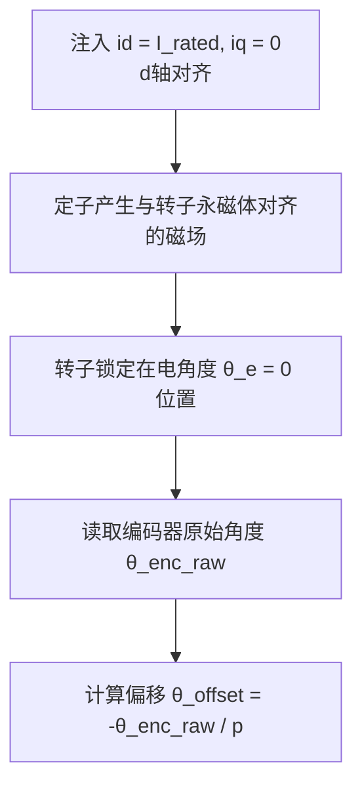
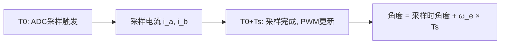
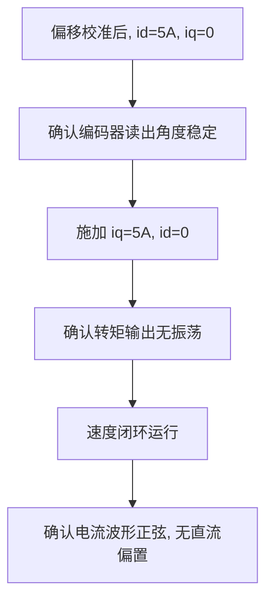
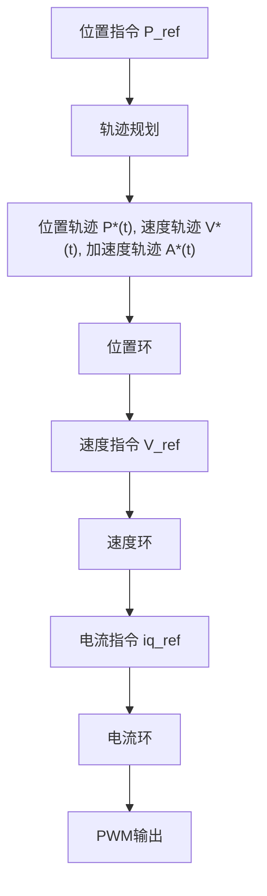
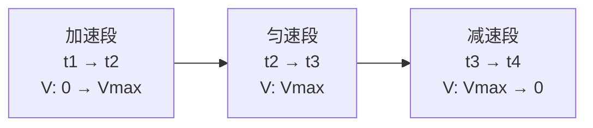
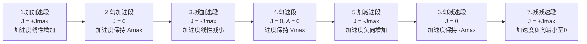

# ALG-01 FOC理论基础

**模块编号：** ALG-01
**模块名称：** FOC理论基础（Field-Oriented Control Theory）
**文档版本：** v2.0
**适用对象：** 电机控制工程师、嵌入式开发者
**前置知识：** 线性代数、电路原理、自动控制理论

---

## 1. 📌 核心摘要 ★★★★☆ 🔰📚

**一句话：** FOC通过Clarke变换和Park变换将三相交流电机的控制问题转化为类似直流电机的控制问题，实现磁场与转矩的解耦控制。

**认知挂钩：** 就像直流电机中励磁电流和电枢电流天然解耦一样，FOC通过坐标变换让交流电机也获得这种"直流级"的控制简洁性——d轴管磁场，q轴管转矩，各司其职。

### 核心流程


### FOC vs 传统标量控制

| 特性 | 传统标量控制 | FOC矢量控制 |
|------|-------------|------------|
| 响应速度 | 慢（秒级） | 快（毫秒级） |
| 转矩脉动 | 大 | 小 |
| 效率 | 中等 | 高 |
| 低速性能 | 差 | 优秀 |
| 控制复杂度 | 简单 | 复杂 |

### 为什么FOC有效？

FOC的核心洞察在于：三相交流电机的定子绕组在空间上互差120°电角度，所产生的旋转磁场与转子永磁体相互作用。通过两次坐标变换：

1. **Clarke变换（降维）：** 利用三相电流之和为零的约束条件（$i_a + i_b + i_c = 0$），将3条120°轴映射到2条90°正交轴（αβ），信息不丢失。
2. **Park变换（旋转）：** 将αβ平面整体旋转转子电角度 $\theta_e$，使得正弦变化的交流量变为直流量，便于PI控制器处理。

变换后，**d轴 = 磁链轴**（对齐转子永磁体N极），**q轴 = 转矩轴**（超前d轴90°电角度）。$i_d$ 控制磁场强度，$i_q$ 控制输出转矩——与直流电机如出一辙。

**相关模块：** [ALG-02 电流采样时序](ALG-02-Current-Sampling-Timing.md) | [ALG-03 PI电流调节器](ALG-03-PI-Current-Regulator.md) | [ALG-04 死区补偿](ALG-04-Deadtime-Compensation.md) | [ALG-05 有感FOC](ALG-05-Sensored-FOC.md) | [ALG-07 无感观测器](ALG-07-Sensorless-Observers.md)

---

## 2. 📐 原理推导 ★★★★★ 📚

### 2.1 三相坐标系（ABC）

三相永磁同步电机（PMSM）的定子绕组在空间上互差120°电角度，三相电流分别为：

$$
\begin{cases}
i_a = I_m \cos(\omega_e t) \\
i_b = I_m \cos(\omega_e t - \frac{2\pi}{3}) \\
i_c = I_m \cos(\omega_e t + \frac{2\pi}{3})
\end{cases}
$$

其中：
- $I_m$：电流幅值 ($A$)
- $\omega_e$：电角速度 ($rad/s$)
- $t$：时间 ($s$)

**三相电流的特点：**
1. 三相电流之和为零：$i_a + i_b + i_c = 0$（平衡系统）
2. 在空间产生旋转磁场
3. 难以直接控制转矩和磁通

### 2.2 Clarke变换（3相→2相静止）

#### 2.2.1 变换目的

将三相静止坐标系（ABC）变换为两相静止坐标系（αβ），简化控制问题。

#### 2.2.2 几何推导

**坐标系定义：**
- A相绕组轴线与α轴重合
- B相绕组轴线超前α轴120°
- C相绕组轴线滞后A相120°

**矢量分解原理：**

将三相电流矢量投影到αβ轴：

$$
\vec{i} = i_a \cdot \vec{a} + i_b \cdot \vec{b} + i_c \cdot \vec{c}
$$

其中：
- $\vec{a}$：A相单位矢量，方向角0°
- $\vec{b}$：B相单位矢量，方向角120°
- $\vec{c}$：C相单位矢量，方向角-120°

**投影到α轴：**

$$
\begin{aligned}
i_\alpha &= i_a \cdot \cos(0°) + i_b \cdot \cos(120°) + i_c \cdot \cos(-120°) \\
&= i_a \cdot 1 + i_b \cdot (-\frac{1}{2}) + i_c \cdot (-\frac{1}{2}) \\
&= i_a - \frac{1}{2}(i_b + i_c)
\end{aligned}
$$

由于 $i_a + i_b + i_c = 0$，所以 $i_b + i_c = -i_a$：

$$
i_\alpha = i_a - \frac{1}{2}(-i_a) = \frac{3}{2}i_a
$$

**投影到β轴：**

$$
\begin{aligned}
i_\beta &= i_a \cdot \sin(0°) + i_b \cdot \sin(120°) + i_c \cdot \sin(-120°) \\
&= 0 + i_b \cdot \frac{\sqrt{3}}{2} + i_c \cdot (-\frac{\sqrt{3}}{2}) \\
&= \frac{\sqrt{3}}{2}(i_b - i_c)
\end{aligned}
$$

#### 2.2.3 功率等效变换

为了保持变换前后功率不变，需要引入系数 $k$：

**变换前功率：**
$$
P_{abc} = u_a i_a + u_b i_b + u_c i_c
$$

**变换后功率：**
$$
P_{\alpha\beta} = u_\alpha i_\alpha + u_\beta i_\beta
$$

根据功率等效原则 $P_{abc} = P_{\alpha\beta}$，推导得到 $k = \frac{2}{3}$。

### 2.3 Park变换（静止→旋转）

#### 2.3.1 变换目的

将两相静止坐标系（αβ）变换为两相旋转坐标系（dq），使交流量变为直流量，便于PI控制。

#### 2.3.2 几何推导

**坐标系定义：**
- αβ坐标系：静止坐标系，固定在定子上
- dq坐标系：旋转坐标系，以同步角速度 $\omega_e$ 旋转
- $\theta$：转子电角度，d轴与α轴的夹角

**旋转变换原理：**

矢量 $\vec{i}$ 在αβ坐标系中表示为 $(i_\alpha, i_\beta)$，在dq坐标系中表示为 $(i_d, i_q)$。

根据坐标旋转公式：

$$
\begin{bmatrix} i_d \\ i_q \end{bmatrix} = \begin{bmatrix} \cos\theta & \sin\theta \\ -\sin\theta & \cos\theta \end{bmatrix} \begin{bmatrix} i_\alpha \\ i_\beta \end{bmatrix}
$$

**展开：**

$$
\begin{cases}
i_d = i_\alpha \cos\theta + i_\beta \sin\theta \\
i_q = -i_\alpha \sin\theta + i_\beta \cos\theta
\end{cases}
$$

#### 2.3.3 物理意义

**d轴（直轴）：**
- 方向：与转子磁链方向一致
- 作用：控制励磁（对于PMSM，控制弱磁）
- 电流：$i_d$ 通常为0（表贴式PMSM）或负值（弱磁控制）

**q轴（交轴）：**
- 方向：与转子磁链垂直
- 作用：控制转矩
- 电流：$i_q$ 与转矩成正比

**类比直流电机：**
- $i_d$ → 励磁电流 $I_f$
- $i_q$ → 电枢电流 $I_a$

**关键理解：**
- **Clarke = 降维**：3条120°轴 → 2条90°轴，信息不丢失（$i_a+i_b+i_c=0$约束）
- **Park = 旋转**：αβ平面整体旋转 $\theta_e$，使正弦量变成直流量，便于PI控制
- **d轴 = 磁链轴**，**q轴 = 转矩轴**：d轴对齐转子永磁体N极，q轴超前d轴90°电角度
- 变换矩阵是正交的，保证变换前后功率/幅值关系可控

### 2.4 逆变换

#### 2.4.1 逆Park变换（旋转→静止）

**变换矩阵：**

$$
\begin{bmatrix} u_\alpha \\ u_\beta \end{bmatrix} = \begin{bmatrix} \cos\theta & -\sin\theta \\ \sin\theta & \cos\theta \end{bmatrix} \begin{bmatrix} u_d \\ u_q \end{bmatrix}
$$

**展开：**

$$
\begin{cases}
u_\alpha = u_d \cos\theta - u_q \sin\theta \\
u_\beta = u_d \sin\theta + u_q \cos\theta
\end{cases}
$$

#### 2.4.2 逆Clarke变换（2相→3相）

**变换矩阵：**

$$
\begin{bmatrix} u_a \\ u_b \\ u_c \end{bmatrix} = \begin{bmatrix} 1 & 0 \\ -\frac{1}{2} & \frac{\sqrt{3}}{2} \\ -\frac{1}{2} & -\frac{\sqrt{3}}{2} \end{bmatrix} \begin{bmatrix} u_\alpha \\ u_\beta \end{bmatrix}
$$

**展开：**

$$
\begin{cases}
u_a = u_\alpha \\
u_b = -\frac{1}{2}u_\alpha + \frac{\sqrt{3}}{2}u_\beta \\
u_c = -\frac{1}{2}u_\alpha - \frac{\sqrt{3}}{2}u_\beta
\end{cases}
$$

### 2.5 磁场定向的物理意义

**磁场定向** 是指将dq坐标系的d轴定向在转子磁链方向上，使得：

1. **d轴电流 $i_d$**：控制磁场强度（励磁）
2. **q轴电流 $i_q$**：控制转矩大小

通过坐标变换，实现了：

| 控制目标 | 控制变量 | 物理意义 |
|---------|---------|---------|
| 磁场强度 | $i_d$ | 励磁电流（SPMSM通常为0） |
| 输出转矩 | $i_q$ | 转矩电流（与转矩成正比） |

### 2.6 转矩产生机制

#### 2.6.1 洛伦兹力原理

**载流导体在磁场中受力：**

$$
\vec{F} = I \vec{l} \times \vec{B}
$$

其中：
- $I$：导体电流 ($A$)
- $\vec{l}$：导体长度矢量 ($m$)
- $\vec{B}$：磁感应强度 ($T$)

**转矩 = 力 × 力臂：**

$$
T = F \cdot r = B \cdot I \cdot l \cdot r
$$

其中 $r$ 为转子半径 ($m$)。

#### 2.6.2 旋转磁场

三相绕组通入三相交流电，产生旋转磁场：

$$
\vec{B}(t) = B_m \cdot e^{j\omega_e t}
$$

---

## 3. 🔢 数学建模 ★★★★☆ 📚

### 3.1 PMSM数学模型

#### 3.1.1 dq坐标系下的电压方程

**表贴式PMSM（SPMSM）：** $L_d = L_q = L_s$

$$
\begin{cases}
u_d = R_s i_d + L_s \frac{di_d}{dt} - \omega_e L_s i_q \\
u_q = R_s i_q + L_s \frac{di_q}{dt} + \omega_e (L_s i_d + \psi_f)
\end{cases}
$$

**内置式PMSM（IPMSM）：** $L_d \neq L_q$

$$
\begin{cases}
u_d = R_s i_d + L_d \frac{di_d}{dt} - \omega_e L_q i_q \\
u_q = R_s i_q + L_q \frac{di_q}{dt} + \omega_e (L_d i_d + \psi_f)
\end{cases}
$$

其中：
- $R_s$：定子电阻 ($\Omega$)
- $L_d, L_q$：d轴、q轴电感 ($H$)
- $\omega_e$：电角速度 ($rad/s$)
- $\psi_f$：永磁体磁链 ($Wb$)
- $u_d, u_q$：d轴、q轴电压 ($V$)
- $i_d, i_q$：d轴、q轴电流 ($A$)

#### 3.1.2 磁链方程

$$
\begin{cases}
\psi_d = L_d i_d + \psi_f \\
\psi_q = L_q i_q
\end{cases}
$$

其中：
- $\psi_d$：d轴磁链 ($Wb$)，由d轴电流产生的磁链与永磁体磁链之和
- $\psi_q$：q轴磁链 ($Wb$)，仅由q轴电流产生
- $L_d, L_q$：d轴、q轴电感 ($H$)
- $i_d, i_q$：d轴、q轴电流 ($A$)
- $\psi_f$：永磁体磁链 ($Wb$)

#### 3.1.3 转矩方程

$$
T_e = \frac{3}{2} p (\psi_d i_q - \psi_q i_d)
$$

展开：

$$
T_e = \frac{3}{2} p [\psi_f i_q + (L_d - L_q) i_d i_q]
$$

其中：
- $p$：极对数
- 第一项：永磁转矩（主要）
- 第二项：磁阻转矩（IPMSM特有）

#### 3.1.4 转矩方程推导（能量法）

**电磁功率：**

$$
P_e = \frac{3}{2} (u_d i_d + u_q i_q)
$$

其中：
- $P_e$：电磁功率 ($W$)
- $u_d, u_q$：d轴、q轴电压 ($V$)
- $i_d, i_q$：d轴、q轴电流 ($A$)
- $\frac{3}{2}$：等幅值变换下的功率系数

**机械功率：**

$$
P_m = T_e \omega_m = T_e \frac{\omega_e}{p}
$$

其中：
- $P_m$：机械功率 ($W$)
- $T_e$：电磁转矩 ($N \cdot m$)
- $\omega_m$：机械角速度 ($rad/s$)
- $\omega_e$：电角速度 ($rad/s$)
- $p$：极对数

**功率平衡：** $P_e = P_m$

$$
T_e = \frac{3}{2} p \frac{u_d i_d + u_q i_q}{\omega_e}
$$

代入电压方程，化简得到：

$$
T_e = \frac{3}{2} p [\psi_f i_q + (L_d - L_q) i_d i_q]
$$

#### 3.1.5 转矩分量分析

**永磁转矩：**

$$
T_{pm} = \frac{3}{2} p \psi_f i_q
$$

- 由永磁体磁场与q轴电流相互作用产生
- 与 $i_q$ 成正比

**磁阻转矩：**

$$
T_{rel} = \frac{3}{2} p (L_d - L_q) i_d i_q
$$

- 由d轴、q轴磁阻差异产生
- 仅IPMSM存在（$L_d < L_q$）
- 需要合理控制 $i_d$ 来利用

### 3.2 $i_d=0$ 控制策略

#### 3.2.1 适用对象

**表贴式PMSM（SPMSM）：** $L_d = L_q$，磁阻转矩为0

#### 3.2.2 控制原理

设定 $i_d = 0$，转矩方程简化为：

$$
T_e = \frac{3}{2} p \psi_f i_q
$$

**特点：**
1. 转矩与 $i_q$ 成正比，线性关系
2. 控制简单，易于实现
3. 单位电流转矩最大（对于SPMSM即为MTPA）

#### 3.2.3 电压方程简化

$$
\begin{cases}
u_d = -\omega_e L_s i_q \\
u_q = R_s i_q + L_s \frac{di_q}{dt} + \omega_e \psi_f
\end{cases}
$$

**分析：**
- $u_d$：解耦项，补偿旋转电动势
- $u_q$：包含电阻压降、电感压降、反电动势

### 3.3 最大转矩电流比（MTPA）

#### 3.3.1 问题定义

在给定电流幅值 $I_s = \sqrt{i_d^2 + i_q^2}$ 下，求最大转矩。

#### 3.3.2 数学推导

**构造拉格朗日函数：**

$$
\mathcal{L} = T_e + \lambda (I_s^2 - i_d^2 - i_q^2)
$$

**求极值：**

$$
\begin{cases}
\frac{\partial \mathcal{L}}{\partial i_d} = 0 \\
\frac{\partial \mathcal{L}}{\partial i_q} = 0
\end{cases}
$$

**求解得到：**

$$
i_d = \frac{\psi_f}{2(L_q - L_d)} - \sqrt{\frac{\psi_f^2}{4(L_q - L_d)^2} + i_q^2}
$$

#### 3.3.3 工程实现

**查表法：** 离线计算MTPA曲线，存储为查找表

$$
\begin{cases}
i_d = f_1(T_{ref}) \\
i_q = f_2(T_{ref})
\end{cases}
$$

### 3.4 dq轴解耦控制

#### 3.4.1 耦合问题分析

从电压方程：

$$
\begin{cases}
u_d = R_s i_d + L_d \frac{di_d}{dt} - \omega_e L_q i_q \\
u_q = R_s i_q + L_q \frac{di_q}{dt} + \omega_e (L_d i_d + \psi_f)
\end{cases}
$$

**耦合项：**
1. $-\omega_e L_q i_q$：q轴电流对d轴的影响
2. $\omega_e L_d i_d$：d轴电流对q轴的影响
3. $\omega_e \psi_f$：反电动势

**耦合的影响：**
1. **动态响应变差：** d轴、q轴相互影响
2. **PI参数难以整定：** 需要考虑耦合效应
3. **高速性能下降：** 耦合项与转速成正比

#### 3.4.2 前馈解耦控制

**控制律设计：**

$$
\begin{cases}
u_d = u_d^{PI} + u_d^{dec} \\
u_q = u_q^{PI} + u_q^{dec}
\end{cases}
$$

其中：
- $u_d^{PI}, u_q^{PI}$：PI控制器输出
- $u_d^{dec}, u_q^{dec}$：前馈解耦项

**解耦项设计：**

$$
\begin{cases}
u_d^{dec} = -\omega_e \hat{L}_q i_q \\
u_q^{dec} = \omega_e (\hat{L}_d i_d + \hat{\psi}_f)
\end{cases}
$$

其中 $\hat{L}_d, \hat{L}_q, \hat{\psi}_f$ 为参数估计值。

#### 3.4.3 解耦后的等效模型

$$
\begin{cases}
u_d^{PI} = R_s i_d + L_d \frac{di_d}{dt} \\
u_q^{PI} = R_s i_q + L_q \frac{di_q}{dt}
\end{cases}
$$

**特点：**
1. d轴、q轴完全解耦
2. 可独立设计PI控制器
3. 动态性能大幅提升

### 3.5 电流环PI设计

#### 3.5.1 传递函数

解耦后，单轴传递函数：

$$
G(s) = \frac{i(s)}{u(s)} = \frac{1}{R_s + L_s s} = \frac{1/R_s}{1 + \frac{L_s}{R_s} s}
$$

**时间常数：** $\tau = \frac{L_s}{R_s}$

#### 3.5.2 PI控制器设计

**PI传递函数：**

$$
G_{PI}(s) = K_p + \frac{K_i}{s} = K_p \frac{s + K_i/K_p}{s}
$$

**闭环传递函数：**

$$
G_{cl}(s) = \frac{G_{PI}(s) G(s)}{1 + G_{PI}(s) G(s)}
$$

**典型设计方法：零极点对消**

选择 $K_i/K_p = R_s/L_s$，对消电机极点：

$$
K_p = \frac{L_s}{\tau_c}, \quad K_i = \frac{R_s}{\tau_c}
$$

其中 $\tau_c$ 为期望的闭环时间常数。

#### 3.5.3 带宽设计

**闭环带宽：**

$$
\omega_c = \frac{1}{\tau_c}
$$

**设计原则：**
1. 电流环带宽：$\omega_c = (5 \sim 10) \omega_{e,max}$
2. 速度环带宽：$\omega_s = \frac{1}{5} \omega_c$
3. 位置环带宽：$\omega_p = \frac{1}{5} \omega_s$

### 3.6 Clarke变换最终变换矩阵

**等幅值变换（常用）：**

$$
\begin{bmatrix} i_\alpha \\ i_\beta \end{bmatrix} = \frac{2}{3} \begin{bmatrix} 1 & -\frac{1}{2} & -\frac{1}{2} \\ 0 & \frac{\sqrt{3}}{2} & -\frac{\sqrt{3}}{2} \end{bmatrix} \begin{bmatrix} i_a \\ i_b \\ i_c \end{bmatrix}
$$

**简化形式（利用三相平衡条件）：**

$$
\begin{cases}
i_\alpha = i_a \\
i_\beta = \frac{1}{\sqrt{3}}(i_a + 2i_b) = \frac{1}{\sqrt{3}}(i_b - i_c)
\end{cases}
$$

---

## 4. 💻 代码实现 ★★★☆☆ 🔧

### 4.1 FOC算法主流程

**代码位置：** [foc_calc.c](AxDr/AxDr/User/motor/foc_calc.c)

```c
void foc_calc(foc_para_t *foc)
{
    sin_cos_val(foc);          // 计算sin/cos
    clarke_transform(foc);      // Clarke变换
    park_transform(foc);        // Park变换
    inverse_park(foc);          // 逆Park变换
    svpwm_sector(foc);          // SVPWM调制
}
```

**执行流程：**

```text
1. sin_cos_val()
   - 输入：theta（转子电角度）
   - 输出：sin_val, cos_val
   - 作用：为Park变换提供三角函数值

2. clarke_transform()
   - 输入：i_a, i_b, i_c（三相电流）
   - 输出：i_alpha, i_beta
   - 作用：三相→两相静止

3. park_transform()
   - 输入：i_alpha, i_beta, sin_val, cos_val
   - 输出：i_d, i_q
   - 作用：静止→旋转，得到直流分量

4. inverse_park()
   - 输入：v_d, v_q（PI控制器输出）
   - 输出：v_alpha, v_beta
   - 作用：旋转→静止

5. svpwm_sector()
   - 输入：v_alpha, v_beta
   - 输出：dtc_a, dtc_b, dtc_c（占空比）
   - 作用：生成三相PWM
```

### 4.2 Clarke变换实现

**代码位置：** [foc_calc.c](AxDr/AxDr/User/motor/foc_calc.c)

```c
void clarke_transform(foc_para_t *foc)
{
    foc->i_alpha = foc->i_a;
    foc->i_beta = (foc->i_b - foc->i_c) * ONE_BY_SQRT3;
}
```

**代码分析：**

1. **简化计算：** 利用三相平衡条件 $i_a + i_b + i_c = 0$，只需采样两相电流
2. **系数定义：** `ONE_BY_SQRT3 = 0.57735026919f`，即 $\frac{1}{\sqrt{3}}$
3. **内存访问：** 结构体指针访问，效率高
4. **计算量：** 1次减法 + 1次乘法

**对比MC_LIB实现：** [MCFOC_PMSM_F.c](MC_LIB/3_MC/31_FOC/310_FOC_F/MCFOC_PMSM_F.c)

```c
void MCFOC_Clark_F(ST_PMSM_ELEC_F* pPMSMe)
{
    pPMSMe->_V_F_Ialfa = pPMSMe->_V_F_Ia;
    pPMSMe->_V_F_Ibeta = MATH_ONE_OVER_SQRT_THREE_F*(pPMSMe->_V_F_Ib - pPMSMe->_V_F_Ic);
}
```

**两者实现完全一致，说明这是标准做法。**

### 4.3 Park变换实现

**代码位置：** [foc_calc.c](AxDr/AxDr/User/motor/foc_calc.c)

```c
void park_transform(foc_para_t *foc)
{
    foc->i_d = foc->i_alpha * foc->cos_val + foc->i_beta * foc->sin_val;
    foc->i_q = foc->i_beta * foc->cos_val - foc->i_alpha * foc->sin_val;
}
```

**代码分析：**

1. **三角函数预计算：** `sin_val` 和 `cos_val` 在 `sin_cos_val()` 函数中预先计算
2. **计算量：** 4次乘法 + 2次加法/减法
3. **精度问题：** 浮点数计算，需注意数值稳定性

**对比MC_LIB实现：** [MCFOC_PMSM_F.c](MC_LIB/3_MC/31_FOC/310_FOC_F/MCFOC_PMSM_F.c)

```c
void MCFOC_Park_F(ST_PMSM_ELEC_F* pPMSMe)
{
    pPMSMe->_V_F_Sin_Real = pPMSMe->TG_Triangle_Est.F_Sin*pPMSMe->TG_Triangle_Comp.F_Cos
                          + pPMSMe->TG_Triangle_Est.F_Cos*pPMSMe->TG_Triangle_Comp.F_Sin;
    pPMSMe->_V_F_Cos_Real = pPMSMe->TG_Triangle_Est.F_Cos*pPMSMe->TG_Triangle_Comp.F_Cos
                          - pPMSMe->TG_Triangle_Est.F_Sin*pPMSMe->TG_Triangle_Comp.F_Sin;

    pPMSMe->_V_F_Id_Real =   pPMSMe->_V_F_Ialfa*pPMSMe->_V_F_Cos_Real
                           + pPMSMe->_V_F_Ibeta*pPMSMe->_V_F_Sin_Real;
    pPMSMe->_V_F_Iq_Real = - pPMSMe->_V_F_Ialfa*pPMSMe->_V_F_Sin_Real
                           + pPMSMe->_V_F_Ibeta*pPMSMe->_V_F_Cos_Real;
}
```

**MC_LIB增加了角度补偿机制：**
- `TG_Triangle_Comp`：角度补偿项
- `TG_Triangle_Est`：估算角度
- 实际角度 = 估算角度 + 补偿角度

**角度补偿的作用：**
- 补偿采样延迟
- 补偿滤波器延迟
- 提高角度精度

### 4.4 逆Park变换实现

**代码位置：** [foc_calc.c](AxDr/AxDr/User/motor/foc_calc.c)

```c
void inverse_park(foc_para_t *foc)
{
    foc->v_alpha = (foc->v_d * foc->cos_val - foc->v_q * foc->sin_val);
    foc->v_beta  = (foc->v_d * foc->sin_val + foc->v_q * foc->cos_val);
}
```

### 4.5 逆Clarke变换实现

**代码位置：** [foc_calc.c](AxDr/AxDr/User/motor/foc_calc.c)

```c
void inverse_clarke(foc_para_t *foc)
{
    foc->v_a = foc->v_alpha;
    foc->v_b = -0.5f * foc->v_alpha + SQRT3_BY_2 * foc->v_beta;
    foc->v_c = -0.5f * foc->v_alpha - SQRT3_BY_2 * foc->v_beta;
}
```

### 4.6 数据结构设计

**代码位置：** [foc_calc.h](AxDr/AxDr/User/motor/foc_calc.h)

```c
typedef struct
{
    float vbus;        // 母线电压
    float inv_vbus;    // 母线电压倒数

    float theta;       // 电角度
    float sin_val;     // sin(theta)
    float cos_val;     // cos(theta)

    float i_a, i_b, i_c;        // 三相电流
    float v_a, v_b, v_c;        // 三相电压

    float i_d, i_q;             // dq轴电流
    float v_d, v_q;             // dq轴电压

    float i_alpha, i_beta;      // αβ轴电流
    float v_alpha, v_beta;      // αβ轴电压

    float dtc_a, dtc_b, dtc_c;  // 三相占空比
} foc_para_t;
```

**设计分析：**

1. **数据集中管理：** 所有FOC相关变量集中在一个结构体
2. **内存布局优化：** 连续存储，提高缓存命中率
3. **命名规范：** 前缀区分物理量（i_电流, v_电压, dtc_占空比）

### 4.7 常量定义

**代码位置：** [foc_calc.h](AxDr/AxDr/User/motor/foc_calc.h)

```c
#define M_PI (3.14159265358f)         // 圆周率
#define M_2PI (6.28318530716f)        // 2倍圆周率
#define SQRT3 (1.73205080757f)        // √3
#define SQRT3_BY_2 (0.86602540378f)   // √3/2
#define ONE_BY_SQRT3 (0.57735026919f) // 1/√3
#define TWO_BY_SQRT3 (1.15470053838f) // 2/√3
```

**精度分析：**
- 使用 `float` 类型，有效数字约7位
- 常量精度足够，不会引入显著误差
- 预定义常量避免重复计算

### 4.8 SVPWM扇区判断实现

**代码位置：** [foc_calc.c](AxDr/AxDr/User/motor/foc_calc.c)

**核心思想：** 通过三个比较判断扇区

```c
float va = foc->v_beta;
float vb = (SQRT3 * foc->v_alpha - foc->v_beta) * 0.5f;
float vc = (-SQRT3 * foc->v_alpha - foc->v_beta) * 0.5f;

int a = (va > 0.0f) ? 1 : 0;
int b = (vb > 0.0f) ? 1 : 0;
int c = (vc > 0.0f) ? 1 : 0;

int sextant = (c << 2) + (b << 1) + a;
```

**扇区映射：**

| sextant | 扇区 | 主矢量 |
|---------|------|--------|
| 3 | I | V4, V6 |
| 1 | II | V2, V6 |
| 5 | III | V2, V3 |
| 4 | IV | V1, V3 |
| 6 | V | V1, V5 |
| 2 | VI | V4, V5 |

### 4.9 MC_LIB SVPWM实现

**代码位置：** [MCFOC_SVPWM_F.c](MC_LIB/3_MC/31_FOC/310_FOC_F/MCFOC_SVPWM_F.c)

**特点：**
1. 支持三电阻采样和单电阻采样
2. 集成死区补偿
3. 五段式调制支持

**三电阻采样电流重构：**

```c
void MCFOC_ThreeShunt_Current_Cal_F(ST_SVPWM_CONTROL_F* pSVPWM, ST_PMSM_ELEC_F* pPMSMe)
{
    switch(pSVPWM->_O_Q32U_Sector)
    {
        case 3U:{pPMSMe->_V_F_Ia = - pPMSMe->_V_F_Ib - pPMSMe->_V_F_Ic;break;}
        case 1U:{pPMSMe->_V_F_Ib = - pPMSMe->_V_F_Ia - pPMSMe->_V_F_Ic;break;}
        case 5U:{pPMSMe->_V_F_Ib = - pPMSMe->_V_F_Ia - pPMSMe->_V_F_Ic;break;}
        case 4U:{pPMSMe->_V_F_Ic = - pPMSMe->_V_F_Ia - pPMSMe->_V_F_Ib;break;}
        case 6U:{pPMSMe->_V_F_Ic = - pPMSMe->_V_F_Ia - pPMSMe->_V_F_Ib;break;}
        case 2U:{pPMSMe->_V_F_Ia = - pPMSMe->_V_F_Ib - pPMSMe->_V_F_Ic;break;}
        default:break;
    }
}
```

**原理：** 利用三相电流之和为零的特性，只采样两相，第三相通过计算得到。

### 4.10 🔗 hpm_MC 代码实现参考

**v2 坐标变换实现** (`hpm_mcl_v2/core/control/hpm_mcl_control.h`):
- `mcl_control_method_t` 函数指针表中定义了 Clarke/Park/InvPark/Ipark 的标准化接口
- 坐标变换作为控制链的第一步：`analog→clarke→park→(d/q PID)→ipark→svpwm→drivers`

**v1 坐标变换实现** (`hpm_mcl/inc/hpm_foc.h`):
- `hpm_foc_clarke()` / `hpm_foc_park()` / `hpm_foc_ipark()` / `hpm_foc_iclrk()` — 四函数覆盖完整变换链

**硬件加速支持**:
- HPM 芯片内置 VSC（Vector Signal Controller）硬件加速 Clarke/Park 变换
- QEO（Quadrature Encoder Output）硬件加速逆 Park/Ipark 变换
- 参考 `SDK-01-HPM-MC-Architecture.md` 第 "数学库与硬件加速" 章节

**与 MC_LIB 对比**:
- MC_LIB: `MCFOC_Clark_F()` / `MCFOC_Park_F()` 纯软件实现
- hpm_MCL: 相同数学原理，但多了硬件加速选项，函数指针表机制更灵活

---

## 5. 🔧 参数整定 ★★★☆☆ 🔧

### 5.1 电流环PI参数整定

**零极点对消法：**

$$
K_p = \frac{L_s}{\tau_c}, \quad K_i = \frac{R_s}{\tau_c}
$$

其中 $\tau_c$ 为期望的闭环时间常数。

**整定步骤：**

1. **测量电机参数：** 获取 $R_s$、$L_s$、$\psi_f$
2. **确定带宽：** 电流环带宽通常设为 $500 \sim 2000\text{Hz}$
3. **计算PI参数：** 根据公式计算初始值
4. **实际调试：**
   - 先只用P控制，观察响应
   - 加入I控制，消除稳态误差
   - 调整参数，优化动态响应

**带宽关系：**

$$
\omega_{c,cur} = (5 \sim 10) \cdot \omega_{c,spd}
$$

### 5.2 前馈解耦参数

**解耦项：**

$$
\begin{cases}
u_d^{dec} = -\omega_e \hat{L}_q i_q \\
u_q^{dec} = \omega_e (\hat{L}_d i_d + \hat{\psi}_f)
\end{cases}
$$

**参数估计：** $\hat{L}_d, \hat{L}_q, \hat{\psi}_f$ 的精度直接影响解耦效果。

### 5.3 编码器校准

#### 5.3.1 编码器类型与校准概述

FOC控制的核心前提是获取精确的转子电角度 $\theta_e$。角度误差会直接导致：
1. **转矩精度下降：** Park变换角度偏差 $\Delta\theta$ 使 $i_d/i_q$ 解耦失败，实际转矩 $T_e \propto \cos(\Delta\theta)$
2. **效率降低：** id=0控制偏离，产生额外无功电流
3. **稳定性问题：** 高速时角度误差被放大，可能引发失步

常见编码器类型：

| 类型 | 分辨率 | 特点 | 校准需求 |
|------|--------|------|---------|
| 增量式编码器 | 1000~10000 PPR | 需Z信号找零位 | 每次上电需归零 |
| 绝对值编码器 | 12~24 bit | 上电即有绝对角度 | 偏移校准 |
| 旋转变压器 | 模拟信号 | 高可靠、耐振动 | 解码器校准 |
| 霍尔传感器 | 6步换相 | 低成本 | 仅支持方波控制 |

#### 5.3.2 电角度偏移校准

**问题描述：**

编码器实际安装时，零点（Z信号或绝对零位）与电机A相绕组轴线之间存在未知的机械偏移角 $\theta_{offset}$。

电角度与编码器读数关系：

$$
\theta_e = p \cdot (\theta_{enc} + \theta_{offset})
$$

其中：
- $p$：极对数
- $\theta_{enc}$：编码器机械角度读数
- $\theta_{offset}$：偏移角（待校准）

**直流锁定法（最常用）：**

原理：给定固定电流矢量，转子自动对齐到该方向，此时读取编码器值与理论电角度的差即为偏移。

步骤：



**C代码实现：**

```c
float calibrate_encoder_offset(float rated_current) {
    id_ref = rated_current;
    iq_ref = 0.0f;

    delay_ms(2000);  // 等待转子锁定

    float enc_angle = read_encoder_mechanical();
    return -enc_angle / pole_pairs;
}
```

#### 5.3.3 A/B相电流相位对齐法

对于增量式编码器，可以利用编码器Z信号（零点脉冲）对齐：
1. 开环拖动电机至低速旋转
2. 同时记录相电流和Z信号
3. A相电流过零点的电角度为0°，对比Z信号位置得到偏移

#### 5.3.4 反电动势法

电机空载旋转时，反电动势 $E_a$ 过零点对应电角度90°（或270°），可用来验证偏移校准结果：

$$
E_a = -\omega_e \psi_f \sin(\theta_e)
$$

$E_a = 0$ 时 $\theta_e = 0°$ 或 $180°$，对应转子N极/S极与A相轴线对齐。

#### 5.3.5 编码器线性度校准

**误差来源：**

实际编码器存在周期性误差和非周期性误差：
- **安装偏心：** 机械安装偏心导致正弦形角度误差，频率 = 1×机械频率
- **刻度不均：** 增量式编码器光栅刻度不均匀
- **电气谐波：** 旋变解码器引入的谐波误差

**分段线性化校准：**

方法：在已知角度位置（如用高精度编码器做参考）记录误差，建立查找表。

```c
#define CAL_POINTS 128

float error_lut[CAL_POINTS];  // 角度误差查找表

float get_corrected_angle(float raw_angle) {
    int idx = (int)(raw_angle / (360.0f / CAL_POINTS));
    float frac = (raw_angle - idx * (360.0f / CAL_POINTS)) / (360.0f / CAL_POINTS);

    // 线性插值
    float err0 = error_lut[idx];
    float err1 = error_lut[(idx + 1) % CAL_POINTS];
    float correction = err0 + frac * (err1 - err0);

    return raw_angle - correction;
}
```

**谐波补偿：**

角度周期性误差可建模为傅里叶级数：

$$
\theta_{err} = \sum_{k=1}^{N} A_k \sin(k\theta_{enc} + \phi_k)
$$

通常在线辨识前几个显著谐波分量（$k=1,2,4$ 最常见）进行补偿。

#### 5.3.6 角度延时补偿

**采样延迟：**

电流采样和PWM更新之间存在延时，导致Park变换使用的角度滞后：



**补偿方法：** 前向预测角度

```c
float theta_compensated = theta_measured + omega_e * Ts_delay;
```

其中 $T_{s\_delay}$ 包括：
- ADC采样转换时间
- 运算时间（FOC计算）
- PWM影子寄存器更新延迟

**速度前馈补偿：**

利用当前转速预测未来角度：

$$
\theta_{comp}(k+1) = \theta(k) + \omega_e(k) \cdot T_s + \frac{1}{2} \alpha(k) \cdot T_s^2
$$

其中 $\alpha(k)$ 为角加速度，可从速度环输出获得。

#### 5.3.7 校准验证方法

校准完成后需验证：
1. **静态验证：** 注入不同角度的电流矢量，确认转子对齐位置偏差 < 1°（电角度）
2. **动态验证：** 开环运行，观测id/iq波形是否平稳
3. **反转测试：** 正反转运行，转矩对称性检查



### 5.4 参数辨识

#### 5.4.1 辨识概述

FOC控制的精度和稳定性高度依赖电机参数准确性。参数辨识分为：

| 阶段 | 辨识内容 | 方法 |
|------|---------|------|
| 离线辨识 | $R_s, L_d, L_q, \psi_f$ | 出厂前或上电自检 |
| 在线辨识 | $R_s$ (温升), $\psi_f$ (温退磁) | 运行中实时更新 |
| 机械辨识 | $J, B, T_c$ | 转动惯量、摩擦、死区 |

**辨识精度影响链：**


#### 5.4.2 定子电阻辨识

**直流注入法：**

原理：给定直流电压，稳态时电感压降为零，电阻 = 电压/电流

步骤：

```text
1. 注入 d轴直流电压: u_d = U_dc, u_q = 0
2. 角度锁定: θ_e = 0（或任意固定角度）
3. 等待电流稳定（>5×L/R时间常数）
4. 测量 i_d 稳态值
5. R_s = U_dc / i_d_steady
```

```c
float identify_resistance(float ud_test) {
    theta_e = 0.0f;
    ud_ref = ud_test;
    uq_ref = 0.0f;

    delay_ms(500);  // 等待电流稳定

    float id_avg = average(id_measured, 100);
    return ud_test / id_avg;
}
```

**注意事项：**
- 测试电压不宜过大，避免过流或转子转动
- 多次测量取平均，消除噪声
- 正反方向各测一次，消除逆变器非线性影响：

$$
R_s = \frac{U_{dc+} - U_{dc-}}{I_{d+} - I_{d-}}
$$

#### 5.4.3 电感辨识

**d轴电感辨识（电压脉冲法）：**

原理：给定阶跃电压，根据电流上升斜率计算电感

$$
L_d = \frac{U_d \cdot \Delta t}{\Delta i_d}
$$

步骤：

```text
1. 角度锁定 θ_e = 0
2. 施加 d轴方波电压: ud = ±U_test
3. 测量 id 上升/下降斜率
4. L_d = 2 × U_test × Δt / Δi_d
```

```c
float identify_ld(float u_pulse, float dt) {
    theta_e = 0.0f;
    ud_ref = u_pulse;

    delay_us(100);
    float id1 = id_measured;
    delay_us((int)(dt * 1e6));
    float id2 = id_measured;

    return u_pulse * dt / (id2 - id1);
}
```

**q轴电感辨识：**

类似d轴辨识，但需要锁定在 $\theta_e = 90°$（q轴对齐d轴绕组）：

```text
1. 角度锁定 θ_e = 90°（电角度）
2. 施加 q轴方波电压
3. 测量 iq 上升斜率
4. L_q = u_q × Δt / Δi_q
```

**高频注入法（适用于IPMSM）：**

原理：注入高频旋转电压信号，从响应电流中提取d/q轴电感差异。

注入信号：

$$
\begin{bmatrix} u_{dh} \\ u_{qh} \end{bmatrix} = U_h \begin{bmatrix} \cos(\omega_h t) \\ \sin(\omega_h t) \end{bmatrix}
$$

高频电流响应包含正序和负序分量，从负序分量幅值可辨识 $L_d, L_q$。

**优势：** 不需要转子锁定，可在静止状态下完成辨识；对SPMSM和IPMSM均适用。

#### 5.4.4 永磁体磁链辨识

**空载反电动势法：**

原理：电机由外部拖动至恒定转速，测量空载线电压

$$
\psi_f = \frac{V_{line-rms}}{\sqrt{3} \cdot \omega_e}
$$

其中 $\omega_e = p \cdot \omega_m$ 为电角速度。

步骤：

```text
1. 断开逆变器输出（或使电机开路）
2. 外部拖动电机至恒定转速 ω_m
3. 测量三相线电压 V_ab, V_bc, V_ca
4. 计算反电动势系数: K_E = V_peak / ω_e = V_line_rms × √2 / ω_e
5. ψ_f = K_E (V·s/rad)
```

**电压方程法（在线辨识）：**

稳态dq轴电压方程（忽略微分项）：

$$
\begin{cases}
u_d = R_s i_d - \omega_e L_q i_q \\
u_q = R_s i_q + \omega_e(L_d i_d + \psi_f)
\end{cases}
$$

已知 $R_s$，从q轴电压方程可反推 $\psi_f$：

$$
\psi_f = \frac{u_q - R_s i_q}{\omega_e} - L_d i_d
$$

**推荐条件：** $i_d = 0$ 时，$\psi_f = (u_q - R_s i_q) / \omega_e$，简化为仅需 $R_s$ 和转速。

#### 5.4.5 机械参数辨识

**转动惯量辨识：**

**机械运动方程：**

$$
J \frac{d\omega_m}{dt} = T_e - B\omega_m - T_L
$$

**加减速法：**

```text
1. 恒加速运行: ω_m 从 ω1 → ω2，记录 T_e 平均值
2. 恒减速运行: ω_m 从 ω2 → ω1，记录 T_e 平均值

J = (T_accel - T_decel) / (2 × α)
   = ΔT / (2 × |dω/dt|)
```

**摩擦系数辨识：**

低速稳态运行，加速度为零：

$$
T_e = B\omega_m + T_c
$$

在不同转速下测量 $T_e$，线性拟合得到 $B$（粘滞摩擦系数）和 $T_c$（库仑摩擦转矩）。

#### 5.4.6 在线参数跟踪

运行时参数会因工况变化：

| 参数 | 变化原因 | 典型变化量 | 跟踪方法 |
|------|---------|-----------|---------|
| $R_s$ | 温度变化 | +40%/100°C | 模型参考自适应 |
| $\psi_f$ | 温度退磁 | -10%/100°C | 反电动势观测 |
| $L_d, L_q$ | 磁饱和 | -30% 大电流 | 高频信号注入 |

**递推最小二乘法（RLS）框架：**

$$
y(k) = \varphi^T(k) \cdot \theta
$$

对电阻辨识：
- $y(k) = u_d(k)$
- $\varphi(k) = [i_d(k)]$
- $\theta = [R_s]$

RLS迭代公式：

$$
\begin{aligned}
\hat{\theta}(k) &= \hat{\theta}(k-1) + K(k)[y(k) - \varphi^T(k)\hat{\theta}(k-1)] \\
K(k) &= \frac{P(k-1)\varphi(k)}{\lambda + \varphi^T(k)P(k-1)\varphi(k)} \\
P(k) &= \frac{1}{\lambda}[I - K(k)\varphi^T(k)]P(k-1)
\end{aligned}
$$

其中 $\lambda \in (0.95, 0.999)$ 为遗忘因子。

### 5.5 T/S型加减速轨迹规划

#### 5.5.1 轨迹规划概述

在伺服控制中，直接给定阶跃位置/速度指令会产生冲击和超调。轨迹规划通过生成连续平滑的参考轨迹，实现：

1. **减小机械冲击：** 限制加速度，保护机械结构
2. **避免电流饱和：** 加速度对应转矩，限制加速度 = 限制最大电流
3. **提高跟踪精度：** 平滑轨迹使控制器更容易跟踪
4. **抑制振动：** 合理的加加速度限制避免激发机械谐振

**轨迹规划层次：**



#### 5.5.2 梯形速度曲线（T型规划）

**基本原理：**

T型曲线将运动分为三个阶段：**加速段 → 匀速段 → 减速段**



**参数定义：**
- $A_{max}$：最大加速度 ($rad/s^2$ 或 $mm/s^2$)
- $V_{max}$：最大速度 ($rad/s$ 或 $mm/s$)
- $D$：总位移 ($rad$ 或 $mm$)

**轨迹计算：**

**情况1：能达到最大速度（$D \geq V_{max}^2 / A_{max}$）：**

$$
\begin{aligned}
t_a &= V_{max} / A_{max}  \quad \text{(加速时间)} \\
t_d &= V_{max} / A_{max}  \quad \text{(减速时间)} \\
D_{acc} &= \frac{1}{2} A_{max} t_a^2  \quad \text{(加速段位移)} \\
D_{dec} &= \frac{1}{2} A_{max} t_d^2  \quad \text{(减速段位移)} \\
t_{const} &= (D - D_{acc} - D_{dec}) / V_{max}  \quad \text{(匀速段时间)}
\end{aligned}
$$

**情况2：不能达到最大速度（三角形速度曲线）：**

当 $D < V_{max}^2 / A_{max}$ 时，实际最大速度降低：

$$
V_{peak} = \sqrt{A_{max} \cdot D}
$$

加速减速对称：$t_a = t_d = V_{peak} / A_{max}$

**C代码实现：**

```c
typedef struct {
    float target_pos;
    float v_max;
    float a_max;

    float v_ref, p_ref;
    float phase;  // 0=加速, 1=匀速, 2=减速, 3=完成
    float t_phase;
    float t_acc, t_const, t_dec;
} t_curve_planner_t;

void t_curve_update(t_curve_planner_t *tc, float dt) {
    tc->t_phase += dt;

    switch (tc->phase) {
    case 0:  // 加速段
        tc->v_ref = tc->a_max * tc->t_phase;
        tc->p_ref += tc->v_ref * dt;
        if (tc->t_phase >= tc->t_acc) {
            tc->phase = 1;
            tc->t_phase = 0;
            tc->v_ref = tc->v_max;
        }
        break;

    case 1:  // 匀速段
        tc->p_ref += tc->v_max * dt;
        if (tc->t_phase >= tc->t_const) {
            tc->phase = 2;
            tc->t_phase = 0;
        }
        break;

    case 2:  // 减速段
        tc->v_ref = tc->v_max - tc->a_max * tc->t_phase;
        if (tc->v_ref < 0) tc->v_ref = 0;
        tc->p_ref += tc->v_ref * dt;
        if (tc->t_phase >= tc->t_dec) {
            tc->phase = 3;
            tc->v_ref = 0;
        }
        break;

    default:
        break;
    }
}
```

#### 5.5.3 S型速度曲线

**基本原理：**

S型曲线在T型基础上增加**加加速度（Jerk）**限制，将加速度的突变变为缓变。曲线分为7段：



**7段分解：**
1. 加加速段：$J = +J_{max}$，加速度线性增加
2. 匀加速段：$J = 0$，加速度保持 $A_{max}$
3. 减加速段：$J = -J_{max}$，加速度线性减小
4. 匀速段：$J = 0, A = 0$，速度保持 $V_{max}$
5. 加减速段：$J = -J_{max}$，加速度负向增加
6. 匀减速段：$J = 0$，加速度保持 $-A_{max}$
7. 减减速段：$J = +J_{max}$，加速度负向减小至0

**数学推导：**

S型曲线的峰值为加加速度 $J_{max}$ 受限于：

$$
\begin{aligned}
J(t) &= J_{max} \cdot s(t) \\
a(t) &= \int J(t) dt = a_0 + J_{max} \cdot s(t) \cdot t \\
v(t) &= \int a(t) dt = v_0 + a_0 t + \frac{1}{2} J_{max} \cdot s(t) \cdot t^2 \\
p(t) &= \int v(t) dt = p_0 + v_0 t + \frac{1}{2} a_0 t^2 + \frac{1}{6} J_{max} \cdot s(t) \cdot t^3
\end{aligned}
$$

其中 $s(t) \in \{+1, 0, -1\}$ 为各段Jerk符号。

**各段持续时间：**

$$
\begin{aligned}
T_1 &= T_3 = T_5 = T_7 = A_{max} / J_{max}  \quad \text{(Jerk变化段)} \\
T_2 &= (V_{max} - V_{start}) / A_{max} - T_1  \quad \text{(匀加速段)} \\
T_4 &= (D - D_{acc} - D_{dec}) / V_{max}  \quad \text{(匀速段)} \\
T_6 &= (V_{max} - V_{end}) / A_{max} - T_5  \quad \text{(匀减速段)}
\end{aligned}
$$

**C代码实现（简化版）：**

```c
typedef struct {
    float j_max;   // 最大加加速度
    float a_max;   // 最大加速度
    float v_max;   // 最大速度

    float p_ref, v_ref, a_ref;
    float jerk;     // 当前jerk值
    uint8_t phase;  // 0~6: S型7段
    float t_acc_to_max;  // 加速到 Amax 的时间
} s_curve_planner_t;

void s_curve_init(s_curve_planner_t *sc, float target, float current) {
    float D = target - current;

    // 计算能否达到 Amax
    sc->t_acc_to_max = sc->a_max / sc->j_max;
    float v_jerk = sc->j_max * sc->t_acc_to_max * sc->t_acc_to_max;

    if (D > 0) {
        // 正向运动：加加速(j=+Jmax) → 匀加速(j=0) → 减加速(j=-Jmax)
        if (sc->a_ref < sc->a_max) {
            sc->jerk = sc->j_max;  // 加加速
        } else {
            sc->jerk = 0;  // 匀加速
        }
    }

    // 位置接近目标时进入减速段
    float decel_dist = sc->v_ref * sc->v_ref / (2 * sc->a_max);
    if (fabs(D) < decel_dist) {
        sc->jerk = -sc->j_max;  // 减加速
    }
}

void s_curve_update(s_curve_planner_t *sc, float dt) {
    sc->a_ref += sc->jerk * dt;
    sc->a_ref = CLAMP(sc->a_ref, -sc->a_max, sc->a_max);

    sc->v_ref += sc->a_ref * dt;
    sc->v_ref = CLAMP(sc->v_ref, -sc->v_max, sc->v_max);

    sc->p_ref += sc->v_ref * dt;
}
```

#### 5.5.4 Jerk限制的物理意义

**加加速度（Jerk）** 是加速度的变化率，单位 $m/s^3$ 或 $rad/s^3$：

$$
J = \frac{da}{dt} = \frac{d^3p}{dt^3}
$$

**Jerk限制的重要性：**

1. **机械保护：** 高Jerk产生冲击力，激发机械谐振
   - 机床加工：$J \leq 50 m/s^3$（精加工）或 $J \leq 500 m/s^3$（粗加工）
2. **电机电流平滑：** 加速度正比于转矩电流 $i_q$
   - $d(i_q)/dt \propto J$，限制Jerk = 限制电流变化率
3. **残余振动抑制：** S型曲线比T型曲线残余振动小（约80%降低）

#### 5.5.5 多段轨迹拼接

复杂运动可分解为多段轨迹（Point-to-Point P2P）：


每段独立规划，段间速度连续（V_start = V_end_prev）

**Blend（融合）技术：** 相邻轨迹段之间重叠速度过渡段，避免停顿：


#### 5.5.6 实际应用要点

1. **在线计算 vs 离线查表：**
   - 简单轨迹：在线实时计算（MCU运算足够）
   - 复杂轨迹：离线生成查找表，运行时查表+插值

2. **MCU资源估算（S型7段）：**
   ```
   - 每段判定：2次比较
   - 位置/速度/加速度更新：3次乘法 + 3次加法
   - 总耗时：~50个CPU周期 @ 168MHz
   ```

3. **典型参数参考（伺服电机）：**

   | 参数 | 典型值 |
   |------|--------|
   | $V_{max}$ | 3000 rpm |
   | $A_{max}$ | 5000 rpm/s |
   | $J_{max}$ | 50000 rpm/s² |
   | 定位时间 (90°) | < 50ms |

4. **与FOC集成：**
   ```
   轨迹规划输出 → p_ref(t), v_ref(t), a_ref(t)
   a_ref(t) → 前馈转矩 T_ff = J × a_ref / K_t
   p_ref → 位置环参考输入
   v_ref → 速度环参考输入
   ```

### 5.6 常见问题与解决方案

| 问题 | 现象 | 可能原因 | 解决方案 |
|------|------|---------|---------|
| 电流振荡 | 电流波形抖动 | PI参数过大 | 降低Kp，检查带宽 |
| 稳态误差 | 电流跟踪不上给定 | Ki太小 | 增大Ki |
| 耦合严重 | d轴电流随q轴变化 | 解耦不充分 | 检查电感参数，增加前馈解耦 |
| 高速失控 | 高速时电流发散 | 反电动势补偿不足 | 增加反电动势前馈 |

---

## 6. 🔗 硬件约束 ★★★★☆ ⚠️

### 6.1 Clarke变换→三相绕组结构

🔗 **硬件约束：Clarke变换依赖三相绕组空间对称性**

Clarke变换的核心前提是三相绕组在空间上严格互差120°电角度，且三相绕组参数（匝数、电阻、电感）完全对称。实际硬件中：

- **绕组不对称：** 制造工艺导致三相绕组匝数不完全一致，引起变换误差，表现为电流谐波增大
- **磁路饱和：** 局部磁饱和导致三相电感不对称，Clarke变换后αβ轴电流出现二倍频纹波
- **解决方案：** 在高精度应用中，需测量实际三相参数，使用修正的变换矩阵替代标准Clarke变换

### 6.2 Park变换→极对数

🔗 **硬件约束：Park变换的角度精度受极对数影响**

电角度与机械角度的关系为 $\theta_e = p \cdot \theta_m$，极对数 $p$ 直接影响角度分辨率：

- **角度放大效应：** 极对数越大，机械角度误差被放大越多。例如7对极电机，0.1°机械角度误差对应0.7°电角度误差
- **编码器选型：** 极对数多的电机需要更高分辨率的编码器。14位编码器（16384线）对7对极电机，电角度分辨率为 $360° \times 7 / 16384 \approx 0.154°$
- **角度插值：** 高极对数电机在低速时角度变化缓慢，需注意编码器量化噪声

### 6.3 转矩方程→磁链参数

🔗 **硬件约束：转矩精度依赖磁链参数的准确性**

转矩方程 $T_e = \frac{3}{2} p \psi_f i_q$ 中，永磁体磁链 $\psi_f$ 是关键参数：

- **温度漂移：** NdFeB永磁体温度系数约 -0.1%/°C，温升100°C时磁链下降约10%，导致转矩估算偏差
- **磁链测量：** 需要通过空载反电动势法或堵转测试准确测量 $\psi_f$
- **在线补偿：** 高精度应用需建立磁链-温度查找表，实时补偿磁链变化

### 6.4 电流采样→硬件时序约束

🔗 **硬件约束：电流采样时序影响坐标变换精度**

Park变换使用的角度必须与电流采样时刻严格对应：

- **采样延迟：** ADC转换时间、运放延迟导致采样时刻滞后，角度不匹配
- **PWM同步：** 电流采样必须在PWM开通期间（下桥臂导通时）进行，避开开关噪声
- **角度补偿：** MC_LIB中的 `TG_Triangle_Comp` 即为补偿采样延迟引入的角度误差

---

## 7. 🚀 前沿拓展 ★★★★★ 💡

### 7.1 无差拍电流控制

传统PI控制在数字实现中存在一拍延迟，无差拍控制（Deadbeat Control）可在一个采样周期内使电流跟踪到给定值：

$$
u(k) = \frac{L_s}{T_s}[i_{ref}(k+1) - i(k)] + R_s i(k) + \omega_e L_s i_q(k)
$$

其中：
- $u(k)$：第$k$拍的控制电压输出 ($V$)
- $L_s$：定子电感 ($H$)
- $T_s$：采样周期 ($s$)
- $i_{ref}(k+1)$：下一拍电流参考值 ($A$)
- $i(k)$：当前拍电流采样值 ($A$)
- $R_s$：定子电阻 ($\Omega$)
- $\omega_e$：电角速度 ($rad/s$)
- $i_q(k)$：当前拍q轴电流 ($A$)

**优势：** 响应速度极快，适合高性能伺服

**挑战：** 对模型参数敏感，鲁棒性需额外设计

### 7.2 模型预测控制（MPC）

基于电机模型预测下一时刻的状态，选择最优电压矢量：

**有限集MPC（FCS-MPC）：**
- 枚举8个电压矢量，选择使代价函数最小的矢量
- 无需调制器，直接输出开关状态
- 开关频率不固定，需优化

**连续集MPC（CCS-MPC）：**
- 结合SVPWM，计算最优占空比
- 开关频率固定，谐波特性好

### 7.3 自适应PI参数

根据运行工况自动调整PI参数：
- **增益调度：** 根据速度/电流查表调整Kp、Ki
- **模型参考自适应（MRAC）：** 根据参考模型与实际响应的偏差调整参数
- **神经网络PI：** 使用神经网络在线学习最优PI参数

### 7.4 弱磁控制与MTPV

高速运行时电压饱和，需弱磁控制扩展调速范围：
- **MTPA→弱磁→MTPV：** 随速度升高，控制轨迹从最大转矩电流比过渡到弱磁区，再到最大转矩电压比
- **前馈弱磁：** 根据速度和电压饱和程度计算 $i_d$ 给定
- **反馈弱磁：** 通过电压反馈自动调节弱磁深度

### 7.5 基于深度学习的坐标变换优化

- **神经网络替代三角函数：** 用轻量级网络替代sin/cos计算，减少查表误差
- **端到端学习控制：** 从电流/电压直接映射到PWM占空比，跳过传统坐标变换
- **数字孪生辅助调参：** 利用电机数字孪生模型在线优化控制参数

**相关模块：** [ALG-07 无感观测器](ALG-07-Sensorless-Observers.md) | [ALG-09 高频注入](ALG-09-High-Frequency-Injection.md) | [ALG-11 MTPA与弱磁](ALG-11-MTPA-Flux-Weakening.md) | [ALG-15 前沿研究](ALG-15-Advanced-Research.md)

---

## 关键公式速查表

| 名称 | 公式 | 说明 |
|------|------|------|
| Clarke变换 | $i_\beta = \frac{1}{\sqrt{3}}(i_b - i_c)$ | 三相→两相（简化式） |
| Park变换 | $i_d = i_\alpha \cos\theta + i_\beta \sin\theta$ | 静止→旋转 |
| 逆Park变换 | $u_\alpha = u_d \cos\theta - u_q \sin\theta$ | 旋转→静止 |
| 转矩方程 | $T_e = \frac{3}{2}p[\psi_f i_q + (L_d-L_q)i_d i_q]$ | 永磁+磁阻 |
| SPMSM电压方程 | $u_q = R_s i_q + L_s \frac{di_q}{dt} + \omega_e (L_s i_d + \psi_f)$ | $i_d=0$条件下 |
| PI参数 | $K_p = \frac{L_s}{\tau_c}, K_i = \frac{R_s}{\tau_c}$ | 零极点对消 |
| 前馈解耦 | $u_d^{dec} = -\omega_e L_q i_q$ | 消除耦合 |
| 电角度 | $\theta_e = p \cdot \theta_m$ | 极对数倍关系 |
| 电流环带宽 | $\omega_c = \frac{1}{\tau_c} = \frac{K_p}{L_s}$ | 闭环带宽定义 |
| 编码器偏移 | $\theta_e = p \cdot (\theta_{enc} + \theta_{offset})$ | 校准用 |
| T型加速段 | $t_a = V_{max} / A_{max}$ | 梯形速度规划 |
| S型Jerk | $J = \frac{da}{dt} = \frac{d^3p}{dt^3}$ | 加加速度定义 |
| 无差拍控制 | $u(k) = \frac{L_s}{T_s}[i_{ref}(k+1) - i(k)] + R_s i(k) + \omega_e L_s i_q(k)$ | 一拍跟随 |

:::sim park-transform

:::sim clarke-park

:::sim-html foc_sim.html