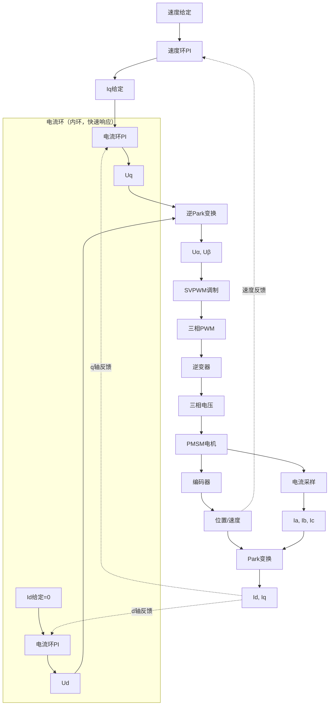
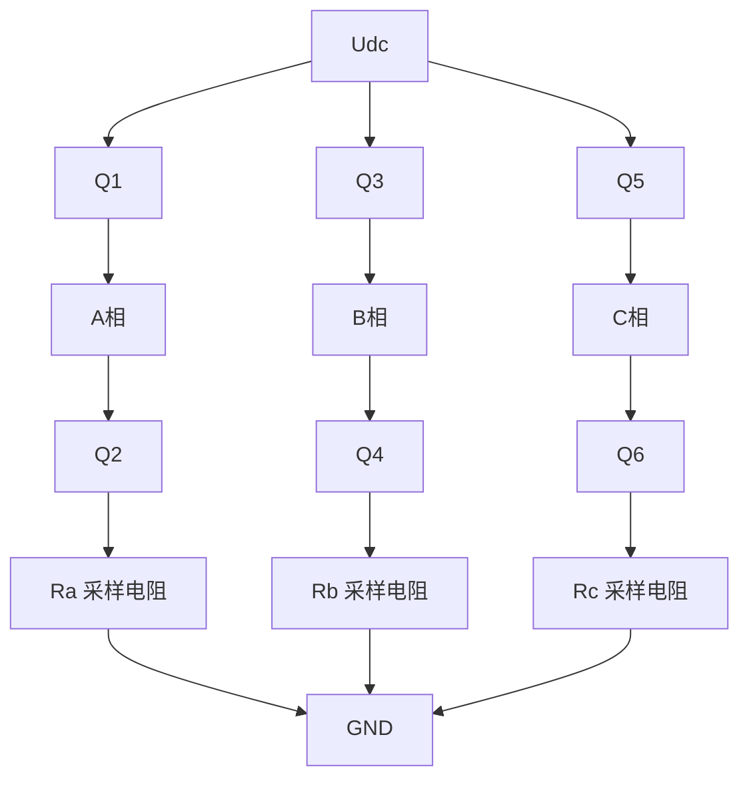
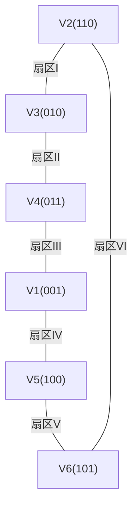

# ALG-05 有感FOC实现

**模块编号：** ALG-05  
**模块名称：** 有感FOC实现（Sensored FOC Implementation）  
**文档版本：** v2.0  
**适用对象：** 电机控制工程师、嵌入式开发者  
**前置知识：** ALG-01 FOC理论基础、C语言编程、STM32外设配置  

---

## 1. ?? 核心摘要 ★★☆☆☆ ??

**一句话：** 有感FOC通过编码器获取精确转子位置，结合双闭环PI控制（电流环+速度环）和SVPWM调制，实现高性能的电机速度/位置伺服控制。

**认知挂钩：** 如果说FOC理论是"地图"，有感FOC就是"带GPS导航的驾驶"——编码器提供精确位置，PI控制器是油门和方向盘，SVPWM是发动机的喷油系统，三者协同实现精准驱动。

**有感FOC vs 无感FOC：**

| 特性 | 有感FOC | 无感FOC |
|------|---------|---------|
| 位置获取 | 编码器/霍尔传感器 | 观测器估算 |
| 低速性能 | 优秀 | 依赖观测器算法 |
| 成本 | 较高（需传感器） | 较低 |
| 控制精度 | 高 | 中等 |
| 启动方式 | 直接启动 | 需要特殊启动策略 |
| 适用场景 | 伺服、精密定位 | 风机、水泵 |

**系统架构：**



---

## 2. ?? 原理推导 ★★★☆☆ ??

### 2.1 编码器接口与角度获取

#### 2.1.1 增量式编码器

**工作原理：** 输出A、B两相正交脉冲信号，通过计数脉冲确定位置增量。

**特点：**
- 分辨率：每转脉冲数（PPR）
- 需要零位信号（Z相）进行位置校准
- 掉电后位置丢失

**接口方式：**
- 正交编码器接口（QEI/Encoder Timer）
- 方向判断：A相超前B相90°为正转，反之为反转

#### 2.1.2 绝对值编码器

**工作原理：** 直接输出绝对位置信息，无需计数。

**特点：**
- 掉电后位置保持
- 分辨率高（12bit~21bit）
- 成本较高

**接口方式：**
- SSI（同步串行接口）
- SPI接口
- BiSS-C接口

### 2.2 电角度与机械角度关系

$$
\theta_e = p \cdot \theta_m
$$

其中：
- $\theta_e$：电角度（rad）
- $\theta_m$：机械角度（rad）
- $p$：极对数

**极对数的影响：**

| 极对数 | 电角度/机械角度 | 电气转速/机械转速 |
|--------|----------------|------------------|
| 1 | 1:1 | 相同 |
| 2 | 2:1 | 电气转速2倍 |
| 4 | 4:1 | 电气转速4倍 |
| 7 | 7:1 | 电气转速7倍 |

### 2.3 电流采样原理

#### 2.3.1 三电阻采样



**采样原理：** 通过测量采样电阻上的电压降，计算相电流。

$$
I_{phase} = \frac{V_{sense}}{R_{sense}}
$$

其中：
- $I_{phase}$：相电流 ($A$)
- $V_{sense}$：采样电阻上的电压降 ($V$)
- $R_{sense}$：采样电阻阻值 ($\Omega$)

#### 2.3.2 PWM与ADC同步

```text
        ┌────┐    ┌────┐    ┌────┐    ┌────┐
PWM_A   │    │    │    │    │    │    │    │
        └────┘    └────┘    └────┘    └────┘
             ↑         ↑         ↑
          采样点    采样点    采样点
          
        开关动作后等待稳定再采样
```

**同步原则：**
1. 在PWM开通期间采样（下桥臂导通时）
2. 避开开关噪声区域
3. 采样点应在PWM脉冲中间

### 2.4 速度计算方法

#### 2.4.1 角度差分法

$$
\omega = \frac{\theta(k) - \theta(k-1)}{T_s}
$$

其中：
- $\omega$：角速度 ($rad/s$)
- $\theta(k)$：当前时刻角度 ($rad$)
- $\theta(k-1)$：上一时刻角度 ($rad$)
- $T_s$：采样周期 ($s$)

**优点：** 计算简单，实时性好  
**缺点：** 高频噪声大，低速精度差

#### 2.4.2 M法（脉冲计数法）

$$
\omega = \frac{M}{T_s \cdot PPR}
$$

其中：
- $\omega$：角速度 ($rad/s$)
- $M$：采样周期内脉冲计数值
- $T_s$：采样周期 ($s$)
- $PPR$：编码器每转脉冲数 (Pulses Per Revolution)

**适用场景：** 中高速测量

#### 2.4.3 T法（周期测量法）

$$
\omega = \frac{f_{clock}}{N \cdot PPR}
$$

其中：
- $\omega$：角速度 ($rad/s$)
- $f_{clock}$：参考时钟频率 ($Hz$)
- $N$：相邻两个脉冲之间的时钟计数值
- $PPR$：编码器每转脉冲数 (Pulses Per Revolution)

**适用场景：** 低速测量

### 2.5 SVPWM原理

#### 2.5.1 空间矢量定义

三相逆变器有8种开关状态，对应8个电压矢量：

| 状态 | A | B | C | 矢量 |
|------|---|---|---|------|
| V0 | 0 | 0 | 0 | 零矢量 |
| V1 | 1 | 0 | 0 | 有效矢量 |
| V2 | 1 | 1 | 0 | 有效矢量 |
| V3 | 0 | 1 | 0 | 有效矢量 |
| V4 | 0 | 1 | 1 | 有效矢量 |
| V5 | 0 | 0 | 1 | 有效矢量 |
| V6 | 1 | 0 | 1 | 有效矢量 |
| V7 | 1 | 1 | 1 | 零矢量 |

#### 2.5.2 六扇区划分



### 2.6 启动状态机原理

#### 2.6.1 转子定位

**目的：** 将转子磁极对准到已知位置（通常为电角度0°）。

**方法：** 在d轴注入直流电流，产生固定磁场，吸引转子对齐。

**定位电流选择：**

$$
I_{align} = (0.5 \sim 1.0) \times I_{rated}
$$

其中：
- $I_{align}$：定位电流 ($A$)
- $I_{rated}$：电机额定电流 ($A$)

**定位时间：**

$$
t_{align} > \frac{5J}{B}
$$

其中：
- $t_{align}$：定位所需最短时间 ($s$)
- $J$：转子转动惯量 ($kg \cdot m^2$)
- $B$：粘滞阻尼系数 ($N \cdot m \cdot s/rad$)

#### 2.6.2 IF强拖启动

**IF（Current-Frequency）启动：** 电流闭环+开环频率斜坡。

**原理：** 角度自增（开环），电流闭环控制，逐步提升频率使电机加速。

---

## 3. ?? 数学建模 ★★★★☆ ??

### 3.1 电流环传递函数

解耦后，单轴电流环传递函数：

$$
G(s) = \frac{I(s)}{U(s)} = \frac{1}{R_s + L_s s} = \frac{1/R_s}{1 + \tau s}
$$

其中时间常数 $\tau = L_s / R_s$。

### 3.2 电流环PI参数计算

**零极点对消法：**

选择PI控制器的零点对消电机极点：

$$
\frac{K_i}{K_p} = \frac{R_s}{L_s}
$$

期望闭环时间常数 $\tau_c$：

$$
K_p = \frac{L_s}{\tau_c}, \quad K_i = \frac{R_s}{\tau_c}
$$

### 3.3 速度环传递函数

速度环被控对象包含电流环和机械系统：

$$
G_{spd}(s) = \frac{\omega(s)}{I_q(s)} = \frac{K_t}{J s}
$$

其中：
- $K_t$：转矩常数
- $J$：转动惯量

### 3.4 速度环PI参数计算

转矩常数：

$$
K_t = \frac{3}{2} p \psi_f
$$

速度环PI参数：

$$
K_{p,spd} = \frac{J \cdot \omega_{c,spd}}{K_t}
$$

$$
K_{i,spd} = \frac{K_{p,spd} \cdot \omega_{c,spd}}{4}
$$

**带宽关系：**

$$
\omega_{c,spd} = \frac{1}{5} \omega_{c,cur}
$$

### 3.5 SVPWM作用时间计算

**扇区I计算：**

$$
T_4 = \frac{\sqrt{3} T_s}{U_{dc}} V_{ref} \sin(\frac{\pi}{3} - \theta)
$$

$$
T_6 = \frac{\sqrt{3} T_s}{U_{dc}} V_{ref} \sin(\theta)
$$

$$
T_0 = T_s - T_4 - T_6
$$

其中：
- $T_4, T_6$：相邻两个有效矢量的作用时间 ($s$)
- $T_0$：零矢量作用时间 ($s$)
- $T_s$：PWM周期 ($s$)
- $U_{dc}$：直流母线电压 ($V$)
- $V_{ref}$：参考电压矢量幅值 ($V$)
- $\theta$：参考电压矢量在扇区内的角度 ($rad$)，范围 $[0, \pi/3]$

### 3.6 电流比例系数计算

$$
I_{phase} = \frac{V_{ADC}}{R_{sense} \cdot G_{opamp}}
$$

其中：
- $I_{phase}$：相电流 ($A$)
- $V_{ADC}$：ADC采样电压 ($V$)
- $R_{sense}$：采样电阻阻值 ($\Omega$)
- $G_{opamp}$：运放增益倍数

$$
iratio = \frac{V_{ref} / ADC_{max}}{R_{sense} \cdot G_{opamp}} = \frac{3.3 / 4095}{0.005 \times 20} \approx 0.00805 A/LSB
$$

其中：
- $iratio$：电流比例系数 ($A/LSB$)，将ADC原始值转换为实际电流
- $V_{ref}$：ADC参考电压 ($V$)，典型值3.3V
- $ADC_{max}$：ADC满量程值，12位ADC为4095
- $R_{sense}$：采样电阻阻值 ($\Omega$)，示例中为0.005Ω
- $G_{opamp}$：运放增益倍数，示例中为20

---

## 4. ?? 代码实现 ★★★★☆ ??

### 4.1 控制模式定义

**代码位置：** [foc_drv.h:19-40](../../AxDr/AxDr/User/motor/foc_drv.h#L19)

```c
typedef enum
{
    dragvf_mode = 0,       // VF开环强拖
    dragif_mode = 1,       // IF电流闭环强拖
    
    volt_mode   = 2,       // 电压开环模式
    spd_volt    = 3,       // 速度-电压模式
    pos_volt    = 4,       // 位置-电压模式
    pos_spd_volt= 5,       // 位置-速度-电压模式
    
    curr_mode   = 6,       // 电流闭环模式
    spd_curr    = 7,       // 速度-电流闭环模式
    pos_curr    = 8,       // 位置-电流模式
    pos_spd_curr= 9,       // 位置-速度-电流模式
    
    mag_enc_cali= 10,      // 磁编码器校准
    hall_cali   = 11,      // 霍尔校准
    iden_para   = 12,      // 参数辨识
} ctrl_mode_t;
```

**模式说明：**

| 模式 | 角度来源 | 电流环 | 速度环 | 应用场景 |
|------|---------|--------|--------|---------|
| dragvf_mode | 自增角度 | 无 | 无 | 开环启动 |
| dragif_mode | 自增角度 | 有 | 无 | 电流闭环启动 |
| curr_mode | 编码器 | 有 | 无 | 转矩控制 |
| spd_curr | 编码器 | 有 | 有 | 速度控制 |

### 4.2 MT6816磁编码器接口

**代码位置：** [encoder.c:11-51](../../AxDr/AxDr/User/motor/encoder.c#L11)

#### 4.2.1 SPI通信时序

```c
void RINE_MT6816_SPI_Get_AngleData(void)
{
    uint16_t data_t[2];
    uint16_t data_r[2];
    uint8_t h_count;
    
    // 构造读取命令：地址0x03和0x04
    data_t[0] = (0x80 | 0x03) << 8;  // 读命令 + 地址
    data_t[1] = (0x80 | 0x04) << 8;
    
    for(uint8_t i=0; i<3; i++){
        // SPI读取操作
        MT6816_SPI_CS_L();
        HAL_SPI_TransmitReceive(&MT6816_SPI_Get_HSPI, 
                                (uint8_t*)&data_t[0], 
                                (uint8_t*)&data_r[0], 1, HAL_MAX_DELAY);
        MT6816_SPI_CS_H();
        
        MT6816_SPI_CS_L();
        HAL_SPI_TransmitReceive(&MT6816_SPI_Get_HSPI, 
                                (uint8_t*)&data_t[1], 
                                (uint8_t*)&data_r[1], 1, HAL_MAX_DELAY);
        MT6816_SPI_CS_H();
        
        // 组合数据
        mt6816_spi.sample_data = ((data_r[0] & 0x00FF) << 8) | 
                                  (data_r[1] & 0x00FF);
        
        // 奇偶校验验证
        h_count = 0;
        for(uint8_t j=0; j<16; j++){
            if(mt6816_spi.sample_data & (0x0001 << j))
                h_count++;
        }
        if(!(h_count & 0x01)){
            mt6816_spi.pc_flag = true;
            break;
        }
    }
    
    if(mt6816_spi.pc_flag){
        mt6816_spi.angle = mt6816_spi.sample_data >> 2;  // 14位角度
        mt6816_spi.no_mag_flag = (bool)(mt6816_spi.sample_data & (0x0001 << 1));
    }
}
```

**数据格式分析：**

| 位 | 内容 | 说明 |
|----|------|------|
| D15 | 奇偶校验位 | 奇校验 |
| D14 | 无磁标志 | 1=无磁 |
| D13~D0 | 角度数据 | 14位分辨率（16384线） |

#### 4.2.2 角度计算

**代码位置：** [encoder.c:61-83](../../AxDr/AxDr/User/motor/encoder.c#L61)

```c
void MT6816_Calc_Elec_Angle(uint8_t pole_pairs)
{
    float angle_diff;
    
    // 读取原始角度
    RINE_MT6816_SPI_Get_AngleData();
    mt6816.angle_data = mt6816_spi.angle;
    
    // 机械角度计算（弧度）
    mt6816.mech_angle = (float)mt6816.angle_data * (2.0f * PI) / 16384.0f;
    
    // 速度计算（角度差分法）
    angle_diff = mt6816.mech_angle - mt6816.last_angle;
    
    // 角度过零处理
    if (angle_diff > PI)
        angle_diff -= 2.0f * PI;
    else if (angle_diff < -PI)
        angle_diff += 2.0f * PI;
    
    // 速度 = 角度差 / 采样周期
    mt6816.speed = angle_diff * 20000.0f;  // 采样频率20kHz
    mt6816.last_angle = mt6816.mech_angle;
    
    // 电角度 = 机械角度 × 极对数
    mt6816.elec_angle = mt6816.mech_angle * (float)pole_pairs;
    
    // 角度归一化到[0, 2π)
    while(mt6816.elec_angle > 2.0f * PI)
    {
        mt6816.elec_angle -= 2.0f * PI;
    }
}
```

### 4.3 ADC采样回调

**代码位置：** [foc_ctrl.c:14-38](../../AxDr/AxDr/User/motor/foc_ctrl.c#L14)

```c
void HAL_ADCEx_InjectedConvCpltCallback(ADC_HandleTypeDef* hadc)
{
    TIM3->CNT = 0;
    start_time = TIM3->CNT;
    
    // 读取ADC注入通道数据
    mc_adc.ia   = ADC1->JDR3;  // A相电流
    mc_adc.ib   = ADC1->JDR2;  // B相电流
    mc_adc.ic   = ADC1->JDR1;  // C相电流
    mc_adc.vbus = ADC2->JDR1;  // 母线电压
    
    // 母线电压转换
    foc.vbus = ((float)mc_adc.vbus * vratio);
    
    // 电流转换（减去偏置，乘以比例系数）
    foc.i_a = ((float)mc_adc.ia - mc_adc.ia_off) * iratio;
    foc.i_b = ((float)mc_adc.ib - mc_adc.ib_off) * iratio;
    foc.i_c = ((float)mc_adc.ic - mc_adc.ic_off) * iratio;
    
    motor_ctrl();  // 执行电机控制
    
    stop_time = TIM3->CNT;
    run_time = stop_time - start_time;
}
```

### 4.4 电流校准

**代码位置：** [foc_drv.c:75-89](../../AxDr/AxDr/User/motor/foc_drv.c#L75)

```c
void get_curr_off(void)
{
    float sum_a, sum_b, sum_c;
    
    // 多次采样取平均
    for(int i=0; i<1000; i++)
    {
        HAL_Delay(1);
        sum_a += (float)(ADC1->JDR3);
        sum_b += (float)(ADC1->JDR2);
        sum_c += (float)(ADC1->JDR1);
    }
    
    // 计算偏置值
    mc_adc.ia_off = sum_a / 1000;
    mc_adc.ib_off = sum_b / 1000;
    mc_adc.ic_off = sum_c / 1000;
}
```

**校准条件：**
- 电机未通电
- 采样电阻无电流流过
- 环境温度稳定

### 4.5 PI控制器实现

#### 4.5.1 串级PI控制器

**代码位置：** [pid.c:128-157](../../AxDr/AxDr/User/utils/pid.c#L128)

```c
float serial_pid_ctrl(pid_para_t *pid, float ref_value, float fdback_value)
{
    pid->ref_value = ref_value;
    pid->fback_value = fdback_value;
    
    // 误差计算
    pid->error = pid->ref_value - pid->fback_value;
    
    // 比例项
    pid->p_term = pid->kp * pid->error;
    
    // 积分项（对比例项积分）
    pid->i_term += pid->ki * pid->p_term;
    
    // 积分限幅
    if (pid->i_term > pid->i_term_max)
        pid->i_term = pid->i_term_max;
    else if (pid->i_term < pid->i_term_min)
        pid->i_term = pid->i_term_min;
    
    // 输出 = P项 + I项
    pid->out_value = pid->p_term + pid->i_term;
    
    // 输出限幅
    if (pid->out_value > pid->out_max)
        pid->out_value = pid->out_max;
    else if (pid->out_value < pid->out_min)
        pid->out_value = pid->out_min;
    
    return pid->out_value;
}
```

#### 4.5.2 并行PI控制器

**代码位置：** [pid.c:92-125](../../AxDr/AxDr/User/utils/pid.c#L92)

```c
float parallel_pid_ctrl(pid_para_t *pid, float ref_value, float fback_value) 
{
    pid->error = ref_value - fback_value;
    
    // 比例项
    pid->p_term = pid->kp * pid->error;
    
    // 积分项（对误差积分）
    pid->i_term += pid->ki * pid->error;
    
    // 积分限幅
    if (pid->i_term > pid->i_term_max)
        pid->i_term = pid->i_term_max;
    else if (pid->i_term < pid->i_term_min)
        pid->i_term = pid->i_term_min;
    
    // 微分项
    pid->d_term = pid->kd * (pid->error - pid->pre_err);
    pid->pre_err = pid->error;
    
    // 输出 = P + I + D
    pid->out_value = pid->p_term + pid->i_term + pid->d_term;
    
    // 输出限幅
    if (pid->out_value > pid->out_max)
        pid->out_value = pid->out_max;
    else if (pid->out_value < pid->out_min)
        pid->out_value = pid->out_min;
    
    return pid->out_value;
}
```

**串级PI vs 并行PI：**

| 特性 | 串级PI | 并行PI |
|------|--------|--------|
| 积分对象 | 对P项积分 | 对误差积分 |
| 抗积分饱和 | 天然抗饱和 | 需要额外处理 |
| 参数整定 | 相对简单 | 需要更多调试 |
| 响应特性 | 更平滑 | 可能超调 |

### 4.6 PI参数自动计算

**代码位置：** [foc_drv.c:20-35](../../AxDr/AxDr/User/motor/foc_drv.c#L20)

```c
void foc_update_current_ctrl_gain(uint16_t bandwidth)
{
    // 电流环Kp = Ls × 带宽
    id_pi.kp = mt.para.Ls * bandwidth * i_base;
    
    // 电流环Ki = Rs / Ls × 采样周期
    id_pi.ki = mt.para.Rs / mt.para.Ls * 0.00005f;
    
    iq_pi.kp = mt.para.Ls * bandwidth * i_base;
    iq_pi.ki = mt.para.Rs / mt.para.Ls * 0.00005f;
    
    // 速度环参数计算
    K = (3.0f * mt.para.pairs * mt.para.flux) / (4.0f * mt.para.Jx);
    
    spd_pi.kp = iq_pi.kp / (mt.para.Ls * mt.para.delta * K);
    spd_pi.ki = iq_pi.kp / (mt.para.delta * mt.para.delta * mt.para.Ls) / 10000;
}
```

**电机参数配置：**

```c
mt.para.Rs = 0.17780f;      // 定子电阻 (Ω)
mt.para.Ls = 0.000095f;     // 定子电感 (H)
mt.para.flux = 0.00192f;    // 永磁体磁链 (Wb)
mt.para.Jx = 0.0000009935f; // 转动惯量 (kg·m2)
mt.para.pairs = 7;          // 极对数
```

### 4.7 速度环控制实现

**代码位置：** [foc_ctrl.c:158-171](../../AxDr/AxDr/User/motor/foc_ctrl.c#L158)

```c
case spd_curr:
{
    // 获取电角度
    MT6816_Calc_Elec_Angle(mt.para.pairs);
    foc.theta = mt6816.elec_angle;
    
    // 速度斜坡控制
    foc_speed_ctrl(2);
    
    // 速度环PI（每4个电流环周期执行一次）
    if (++mt.period.spd_pid_cnt >= 4)
    { 
        mt.period.spd_pid_cnt = 0;
        serial_pid_ctrl(&spd_pi, mc.spd_set, mt6816.speed);
        mc.iq_set = spd_pi.out_value;
    }
    
    // 电流环PI（每个电流环周期执行）
    if (++mt.period.cur_pid_cnt >= 1)
    {
        mt.period.cur_pid_cnt = 0;
        serial_pid_ctrl(&id_pi, mc.id_set, foc.i_d);
        foc.v_d = id_pi.out_value;
        serial_pid_ctrl(&iq_pi, mc.iq_set, foc.i_q);
        foc.v_q = iq_pi.out_value;
    }
    break;
}
```

### 4.8 速度斜坡控制

**代码位置：** [foc_ctrl.c:180-203](../../AxDr/AxDr/User/motor/foc_ctrl.c#L180)

```c
void foc_speed_ctrl(uint8_t N)
{
    if (++mt.period.spd_set_cnt >= N && N != 0)
    {
        if (mc.new_spd > mc.spd_set)
        {
            mc.spd_set += mc.spd_acc;  // 加速
            if (mc.spd_set > mc.new_spd)
                mc.spd_set = mc.new_spd;
        }
        else if (mc.new_spd < mc.spd_set)
        {
            mc.spd_set -= mc.spd_acc;  // 减速
            if (mc.spd_set < mc.new_spd)
                mc.spd_set = mc.new_spd;
        }
        else
            mt.period.spd_set_cnt = 0;
    }
    else if (N == 0)
    {
        mc.spd_set = mc.new_spd;  // 直接设定
    }
}
```

### 4.9 SVPWM扇区判断

**代码位置：** [foc_calc.c:115-131](../../AxDr/AxDr/User/motor/foc_calc.c#L115)

```c
void svpwm_sector(foc_para_t *foc)
{
    float TS = 1.0f;
    float ta = 0.0f, tb = 0.0f, tc = 0.0f;
    
    float k = (TS * SQRT3) * foc->inv_vbus;
    
    // 扇区判断变量
    float va = foc->v_beta;
    float vb = (SQRT3 * foc->v_alpha - foc->v_beta) * 0.5f;
    float vc = (-SQRT3 * foc->v_alpha - foc->v_beta) * 0.5f;
    
    // 三值判断
    int a = (va > 0.0f) ? 1 : 0;
    int b = (vb > 0.0f) ? 1 : 0;
    int c = (vc > 0.0f) ? 1 : 0;
    
    // 扇区编码
    int sextant = (c << 2) + (b << 1) + a;
    
    // ... 后续时间计算
}
```

### 4.10 SVPWM中点钳位调制

**代码位置：** [foc_calc.c:96-113](../../AxDr/AxDr/User/motor/foc_calc.c#L96)

```c
void svpwm_midpoint(foc_para_t *foc)
{
    // 归一化电压
    foc->v_alpha = foc->inv_vbus * foc->v_alpha;
    foc->v_beta = foc->inv_vbus * foc->v_beta;
    
    // 计算三相电压
    float va = foc->v_alpha;
    float vb = -0.5f * foc->v_alpha + SQRT3_BY_2 * foc->v_beta;
    float vc = -0.5f * foc->v_alpha - SQRT3_BY_2 * foc->v_beta;
    
    // 找最大最小值
    float vmax = max(max(va, vb), vc);
    float vmin = min(min(va, vb), vc);
    
    // 中点偏移
    float vcom = (vmax + vmin) * 0.5f;
    
    // 占空比计算
    foc->dtc_a = (vcom - va) + 0.5f;
    foc->dtc_b = (vcom - vb) + 0.5f;
    foc->dtc_c = (vcom - vc) + 0.5f;
}
```

### 4.11 启动状态机

**代码位置：** [foc_ctrl.c:39-96](../../AxDr/AxDr/User/motor/foc_ctrl.c#L39)

```c
void motor_ctrl(void)
{
    switch (mt.state)
    {
    case mt_start:        // 启动初始化
        foc_pwm_start();
        mt.period.start_cnt = 0;
        mt.state = mt_precharge;
        break;
        
    case mt_precharge:    // 预充电
        if(++mt.period.start_cnt > 10)
        {
            mt.period.start_cnt = 0;
            mt.ctrl_mode = dragif_mode;
            mt.state = mt_align;
        }
        break;
        
    case mt_align:        // 转子定位
        foc_pwm_run(&foc);
        foc_ctrl_mode();
        foc_calc(&foc);
        foc_ctrl_mode();
        if(++mt.period.start_cnt > 200)
        {
            mt.period.start_cnt = 0;
            pid_clear(&spd_pi);
            pid_clear(&id_pi);
            pid_clear(&iq_pi);
            mt.ctrl_mode = spd_curr;
            mt.state = mt_run;
        }
        break;
        
    case mt_run:          // 正常运行
        foc_pwm_run(&foc);
        foc_ctrl_mode();
        foc_calc(&foc);
        foc_ctrl_mode();
        break;
        
    case mt_stop:         // 停止
        if(++mt.period.stop_cnt > 5)
        {
            foc_pwm_stop();
            mt.period.stop_cnt = 0;
            mt.state = mt_wait;
        }
        break;
        
    case mt_wait:         // 等待
        break;
    }
}
```

### 4.12 IF强拖启动实现

**代码位置：** [foc_ctrl.c:116-130](../../AxDr/AxDr/User/motor/foc_ctrl.c#L116)

```c
case dragif_mode:
{
    // 角度自增（开环）
    foc.theta += mc.theta_acc;
    if (foc.theta > M_2PI)
        foc.theta = 0.0f;
    else if (foc.theta < 0)
        foc.theta = M_2PI;
    
    // 电流闭环
    serial_pid_ctrl(&id_pi, mc.id_set, foc.i_d);
    foc.v_d = id_pi.out_value;
    
    serial_pid_ctrl(&iq_pi, mc.iq_set, foc.i_q);
    foc.v_q = iq_pi.out_value;
    break;
}
```

**启动参数配置：**

```c
mc.theta_acc = 0.001f;   // 角度增量（对应加速度）
mc.id_set = 0.0f;        // d轴电流（通常为0）
mc.iq_set = 1.0f;        // q轴电流（启动转矩）
```

### 4.13 高级启动状态机（含观测器切换）

**代码位置：** [startup.c:71-163](../../AxDr/AxDr/User/motor/startup.c#L71)

```c
void startup_update(startup_t *startup, observer_t *obs)
{
    switch (startup->state)
    {
    case STARTUP_STATE_ALIGN:  // 转子定位
        startup->align.align_cnt++;
        startup->theta_openloop = 0.0f;
        startup->speed_openloop = 0.0f;
        
        if (startup->align.align_cnt >= startup->align.align_cnt_max)
        {
            startup->state = STARTUP_STATE_RAMP;
        }
        break;
        
    case STARTUP_STATE_RAMP:   // 开环斜坡
        startup->ramp.current_freq += startup->ramp.ramp_rate * startup->Ts;
        
        if (startup->ramp.current_freq >= startup->ramp.end_freq)
        {
            startup->ramp.current_freq = startup->ramp.end_freq;
        }
        
        startup->speed_openloop = startup->ramp.current_freq;
        startup->theta_openloop += startup->ramp.current_freq * startup->Ts;
        
        // 检查观测器是否收敛
        if (observer_is_converged(obs))
        {
            startup->state = STARTUP_STATE_SWITCH;
        }
        break;
        
    case STARTUP_STATE_SWITCH: // 切换到闭环
        startup->sw.switch_cnt++;
        startup->sw.blend_weight = (float)startup->sw.switch_cnt / 
                                   (float)startup->sw.switch_cnt_max;
        
        // 角度混合
        float theta_obs = observer_get_angle(obs);
        startup->theta_openloop = startup->theta_openloop * (1.0f - startup->sw.blend_weight) +
                                  theta_obs * startup->sw.blend_weight;
        
        if (startup->sw.switch_cnt >= startup->sw.switch_cnt_max)
        {
            startup->state = STARTUP_STATE_DONE;
        }
        break;
        
    case STARTUP_STATE_DONE:   // 启动完成
        startup->theta_openloop = observer_get_angle(obs);
        startup->speed_openloop = observer_get_speed(obs);
        break;
    }
}
```

### 4.14 制动策略

**能耗制动：**

```c
void foc_pwm_stop(void)
{
    set_dtc_a(PWM_ARR());  // 下桥臂全开
    set_dtc_b(PWM_ARR());
    set_dtc_c(PWM_ARR());
}
```

**再生制动：** 速度环给定负值，电流环自动产生反向电流。

### 4.15 数据结构设计

#### 4.15.1 FOC参数结构体

```c
typedef struct
{
    float vbus;        // 母线电压
    float inv_vbus;    // 母线电压倒数
    
    float theta;       // 电角度
    float sin_val;     // sin(theta)
    float cos_val;     // cos(theta)
    
    float i_a, i_b, i_c;        // 三相电流
    float v_a, v_b, v_c;        // 三相电压
    
    float i_d, i_q;             // dq轴电流
    float v_d, v_q;             // dq轴电压
    
    float i_alpha, i_beta;      // αβ轴电流
    float v_alpha, v_beta;      // αβ轴电压
    
    float dtc_a, dtc_b, dtc_c;  // 三相占空比
} foc_para_t;
```

#### 4.15.2 电机参数结构体

```c
typedef struct
{
    float Rs;       // 定子电阻
    float Ls;       // 定子电感
    float flux;     // 永磁体磁链
    uint8_t pairs;  // 极对数
    float Jx;       // 转动惯量
    float delta;    // 速度环带宽系数
} mt_para_t;
```

#### 4.15.3 PID控制器结构体

```c
typedef struct
{
    volatile float kp;           // 比例系数
    volatile float ki;           // 积分系数
    volatile float kd;           // 微分系数
    
    volatile float p_term;       // 比例项
    volatile float i_term;       // 积分项
    volatile float d_term;       // 微分项
    
    volatile float i_term_max;   // 积分上限
    volatile float i_term_min;   // 积分下限
    
    volatile float ref_value;    // 目标值
    volatile float fback_value;  // 反馈值
    
    volatile float error;        // 误差
    volatile float pre_err;      // 前一次误差
    
    volatile float out_min;      // 输出下限
    volatile float out_max;      // 输出上限
    volatile float out_value;    // 输出值
} pid_para_t;
```

### 4.16 计算效率分析

| 函数 | 乘法 | 加法 | 除法 | 三角函数 |
|------|------|------|------|---------|
| sin_cos_val | 0 | 0 | 0 | 2 |
| clarke_transform | 1 | 1 | 0 | 0 |
| park_transform | 4 | 2 | 0 | 0 |
| inverse_park | 4 | 2 | 0 | 0 |
| svpwm_sector | 6~10 | 8~12 | 0 | 0 |
| **总计** | **15~19** | **13~17** | **0** | **2** |

### 4.17 ?? hpm_MC 代码实现参考

**v2 有感FOC控制链** (`hpm_mcl_v2/core/control/hpm_mcl_control.h`, `hpm_mcl_v2/core/loop/hpm_mcl_loop.h`):
- `mcl_mode_foc` 模式支持有感FOC运行
- 编码器位置通过 `mcl_encoder_t` 管理，支持 ABZ/UVW/Hall 三种传感器
- 速度计算支持 T法/M法/M-T法/PLL法 四种方法

**v1 有感FOC实现** (`hpm_mcl/inc/hpm_foc.h`):
- `hpm_foc_speed_pi()` — 速度环 PI 控制
- `hpm_foc_posotion_pi()` — 位置环 PI 控制
- 依赖外部提供角度（如编码器/霍尔）

**编码器处理** (`hpm_mcl_v2/core/sensor/hpm_mcl_encoder.h`):
- `mcl_encoder_t` 管理 IIR 滤波、theta_forecast（角度预测）
- 支持 QEI/ABZ 正交编码器、UVW/Hall 三路霍尔

**示例应用**: `hpm_MC/samples/motor_ctrl/bldc_foc/` — 完整有感/无感FOC示例

**参考**: `SDK-02-HPM-MC-v2-Core-Loop.md` 第5节「传感器处理」

---

## 5. ?? 参数整定 ★★★★☆ ??

### 5.1 电流环PI参数整定

**零极点对消法：**

$$
K_p = \frac{L_s}{\tau_c}, \quad K_i = \frac{R_s}{\tau_c}
$$

**整定步骤：**

1. **确定电流环参数**：先整定电流环，确保电流响应快速稳定
2. **设置电流环带宽**：通常为 $500 \sim 2000\text{Hz}$
3. **计算初始参数**：根据电机参数计算PI参数
4. **实际调试**：
   - 先只用P控制，观察响应
   - 加入I控制，消除稳态误差
   - 调整参数，优化动态响应

**代码中的带宽配置：**

```c
foc_update_current_ctrl_gain(500);  // 电流环带宽500Hz
```

### 5.2 速度环PI参数整定

**整定步骤：**

1. **确定电流环参数**：先整定电流环，确保电流响应快速稳定
2. **设置速度环带宽**：通常为电流环带宽的1/5~1/10
3. **计算初始参数**：根据电机参数计算PI参数
4. **实际调试**：
   - 先只用P控制，观察响应
   - 加入I控制，消除稳态误差
   - 调整参数，优化动态响应

**抗积分饱和限幅配置：**

```c
pid_limit_init(&id_pi, 10.8f, -10.8f, 10.8f, -10.8f);  // 电流环
pid_limit_init(&iq_pi, 10.8f, -10.8f, 10.8f, -10.8f);  // 电流环
pid_limit_init(&spd_pi, 5.0f, -5.0f, 5.0f, -5.0f);     // 速度环
```

### 5.3 采样精度优化

| 误差源 | 影响程度 | 补偿方法 |
|--------|---------|---------|
| ADC量化误差 | ±0.5 LSB | 提高ADC分辨率 |
| 采样电阻温漂 | 中 | 温度补偿 |
| 运放偏置漂移 | 中 | 定期校准 |
| 开关噪声耦合 | 高 | 硬件滤波+软件滤波 |
| 采样时序偏差 | 中 | 精确同步 |

**提高精度的方法：**

1. **硬件措施：**
   - 使用低温度系数采样电阻
   - 运放选择低偏置、低噪声型号
   - PCB布局优化，减少噪声耦合

2. **软件措施：**
   - 多次采样取平均
   - 数字滤波（低通滤波、滑动平均）
   - 动态偏置校准

### 5.4 常见问题与解决方案

| 问题 | 现象 | 可能原因 | 解决方案 |
|------|------|---------|---------|
| 电流偏置漂移 | 零电流时读数不为零 | 运放温漂 | 上电校准+定期校准 |
| 速度波动 | 速度不稳 | 编码器噪声/PI参数不当 | 滤波+调整PI |
| 启动失步 | IF启动时电机抖动 | 角度增量过大/电流不足 | 降低加速度/增大启动电流 |
| SVPWM过调制 | 电流波形畸变 | 电压矢量超出六边形 | 限制调制比/弱磁 |
| 编码器跳变 | 角度突变 | SPI通信错误 | 奇偶校验+滤波 |

---

## 6. ?? 硬件约束 ★★★★☆ ??

### 6.1 PI参数→电感电阻

?? **硬件约束：PI参数精度直接依赖电感电阻的测量精度**

电流环PI参数由零极点对消法确定：$K_p = L_s / \tau_c$，$K_i = R_s / \tau_c$。电机参数的准确性直接决定控制性能：

- **电阻温度系数：** 铜绕组温度系数约0.393%/°C，温升80°C时电阻增大约31%，导致Ki不匹配，电流环出现稳态误差
- **电感饱和效应：** 大电流时铁芯磁饱和导致电感值下降，Kp偏大引起振荡
- **参数辨识：** 需通过堵转测试（测Rs、Ls）和空载反电动势测试（测ψf）获取准确参数
- **在线自适应：** 高精度应用需在线辨识Rs变化，动态调整Ki

### 6.2 SVPWM→逆变器拓扑

?? **硬件约束：SVPWM调制受逆变器死区时间和母线电压限制**

SVPWM输出电压矢量的精度受硬件约束：

- **死区效应：** 为防止上下桥臂直通，需插入死区时间（通常0.5~2μs）。死区导致实际输出电压偏离给定值，尤其在低调制比和低速时影响显著，表现为电流6次谐波和转矩脉动
- **死区补偿：** 需根据电流方向判断实际电压误差，进行前馈补偿。MC_LIB中集成了死区补偿功能
- **母线电压限制：** SVPWM线性调制范围为 $V_{ref} \leq U_{dc}/\sqrt{3}$，超出则进入过调制区，需弱磁控制
- **开关频率约束：** IGBT/MOSFET的开关频率上限（通常10~20kHz）限制了电流环带宽

### 6.3 电流采样→采样电路设计

?? **硬件约束：电流采样精度受采样电路和同步时序约束**

电流采样是FOC控制的"眼睛"，采样质量直接决定控制精度：

- **采样电阻选型：** 阻值过小降低信噪比，阻值过大增加功耗和发热。典型值5mΩ（代码中 `rse = 0.005f`）
- **运放增益匹配：** 增益过高导致大电流时ADC饱和，增益过低降低小电流分辨率。代码中 `iop = 20`，对应满量程电流 $3.3/(4095 \times 0.005 \times 20) ≈ 8.05A$
- **ADC分辨率：** 12位ADC的量化步长为 $3.3/4096 ≈ 0.805mV$，对应电流分辨率约8mA
- **PWM-ADC同步：** 注入通道由TIM1 TRGO在PWM周期中间位置触发，确保采样点在下桥臂导通期间

### 6.4 编码器→安装精度

?? **硬件约束：编码器安装精度影响角度获取准确性**

- **磁编码器安装距离：** MT6816磁编码器对磁铁与芯片的距离敏感（典型1~3mm），距离偏差导致角度非线性
- **磁铁偏心：** 磁铁与转子轴不同心导致角度周期性误差，表现为1次谐波
- **SPI通信延迟：** 每次角度读取需2次SPI传输+奇偶校验，通信时间约10~20μs，高速时需补偿此延迟

---

## 7. ?? 前沿拓展 ★★★★☆ ??

### 7.1 自抗扰控制（ADRC）

用扩张状态观测器（ESO）替代PI控制器，将耦合项和扰动作为"总扰动"进行估计和补偿：

- **优势：** 不依赖精确电机参数，对参数变化和外部扰动鲁棒
- **挑战：** 带宽整定、ESO参数调试需要经验

### 7.2 复合观测器全速域方案

有感FOC在编码器故障时需要降级运行，可结合无感观测器实现冗余：

- **编码器+SMO双模：** 正常使用编码器，编码器异常时切换到SMO
- **角度融合：** 用卡尔曼滤波融合编码器和观测器角度，提高可靠性
- **故障检测：** 通过编码器角度与观测器角度偏差检测编码器故障

### 7.3 数字双闭环优化

- **内模控制（IMC）：** 将电机模型嵌入控制器，只有一个调节参数（滤波时间常数）
- **H∞鲁棒控制：** 在保证稳定性的前提下优化最坏情况性能
- **重复控制：** 抑制周期性扰动（如齿槽转矩引起的转矩脉动）

### 7.4 智能参数自整定

- **继电反馈法：** 自动测量系统临界增益和周期，计算PI参数
- **模型参考自适应：** 根据参考模型与实际响应偏差自动调整参数
- **强化学习调参：** 离线训练强化学习Agent，在线实时调整PI参数

### 7.5 高性能编码器接口

- **BiSS-C接口：** 支持高速（10Mbps）全双工通信，延迟低于5μs
- **EnDat 2.2：** 支持位置+温度+诊断信息，适用于高端伺服
- **多圈绝对值编码器：** 无需Z信号校准，掉电不丢位置

---

## 关键公式速查表

| 名称 | 公式 | 说明 |
|------|------|------|
| 电角度 | $\theta_e = p \cdot \theta_m$ | 极对数倍关系 |
| 电流比例 | $I = V_{ADC} / (R_s \cdot G)$ | ADC值转电流 |
| 电流环PI | $K_p = L_s / \tau_c, K_i = R_s / \tau_c$ | 零极点对消 |
| 转矩常数 | $K_t = \frac{3}{2} p \psi_f$ | 电流转转矩 |
| 速度环PI | $K_{p,spd} = J \omega_{c,spd} / K_t$ | 速度环设计 |
| SVPWM调制范围 | $V_{ref} \leq U_{dc}/\sqrt{3}$ | 线性调制区 |
| 速度差分 | $\omega = \Delta\theta / T_s$ | 角度差分法 |


## 🧪 仿真验证
> 本模块的理论可在 [C 语言仿真](../simulation/SIM-00-C-Simulation-Overview.md) 中验证。
> 对应仿真模式：MODE_SELECT_VELOCITY_LOOP (4)，关键操作：修改 pmsm_comm.c 的 _user_commands() 中转速指令序列和负载阶跃，观察 Speed/Torque 子图