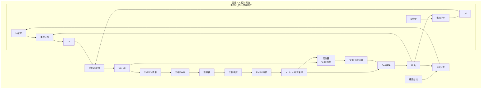

# ALG-07 无感FOC观测器

**模块编号：** ALG-07  
**模块名称：** 无感FOC观测器（Sensorless FOC Observers）  
**文档版本：** v2.0  
**适用对象：** 电机控制工程师、嵌入式开发者  
**前置知识：** ALG-01 FOC理论基础、ALG-05 有感FOC实现、控制理论  

---

## 1. 🎯 核心摘要 ★★★☆☆ 🎯

> **📌 文档定位：** 本文是 **[ALG-06 位置与速度观测器](./ALG-06-Position-Speed-Observer.md)** 的**深化篇**。在 ALG-06 建立的观测器基本概念（SMO/Luenberger/PLL 概览）基础上，系统深入地讲解无传感器场景下各类观测器的完整数学推导、工程代码实现、参数整定方法及硬件约束分析。如果你是第一次接触观测器，建议先阅读 ALG-06 建立整体认知。

**一句话：** 无感FOC通过观测器算法从电压电流中估算转子位置和速度，消除对物理传感器的依赖，在成本、可靠性、体积上具有显著优势，但低速性能和参数鲁棒性是核心挑战。

**认知挂钩：** 如果说有感FOC是"带GPS导航"，无感FOC就是"靠星象导航"——通过测量电机自身的"星象"（电压、电流），利用数学模型推算出"位置"（转子角度），精度取决于模型和"天气"（参数漂移、噪声）。

**无感FOC优势：**

| 优势 | 说明 |
|------|------|
| 降低成本 | 省去编码器/霍尔传感器 |
| 提高可靠性 | 消除传感器故障点 |
| 减小体积 | 无需传感器安装空间 |
| 简化安装 | 无需传感器对位校准 |

**观测器类型总览：**

| 观测器类型 | 原理 | 适用速度范围 | 特点 |
|-----------|------|-------------|------|
| 反电动势观测器 | 测量反电动势 | >10%额定转速 | 简单，低速性能差 |
| 滑模观测器(SMO) | 滑模控制理论 | >5%额定转速 | 鲁棒性好，有抖振 |
| 磁链观测器 | 磁链积分 | >10%额定转速 | 参数敏感 |
| 扩展卡尔曼滤波(EKF) | 状态估计 | >5%额定转速 | 精度高，计算量大 |
| 高频注入(HFI) | 电感凸极效应 | 0~15%额定转速 | 零速启动，有噪声 |

**系统架构：**



---

## 2. ?? 原理推导 ★★★★☆ ??

### 2.1 反电动势观测器原理

#### 2.1.1 PMSM电压方程

在αβ静止坐标系下：

$$
\begin{cases}
u_\alpha = R_s i_\alpha + L_s \frac{di_\alpha}{dt} + e_\alpha \\
u_\beta = R_s i_\beta + L_s \frac{di_\beta}{dt} + e_\beta
\end{cases}
$$

其中反电动势：

$$
\begin{cases}
e_\alpha = -\omega_e \psi_f \sin\theta_e \\
e_\beta = \omega_e \psi_f \cos\theta_e
\end{cases}
$$

其中：
- $e_\alpha, e_\beta$：αβ轴反电动势 ($V$)
- $\omega_e$：电角速度 ($rad/s$)
- $\psi_f$：永磁体磁链 ($Wb$)
- $\theta_e$：转子电角度 ($rad$)

#### 2.1.2 反电动势与角度关系

从反电动势表达式可得：

$$
\theta_e = \arctan\left(\frac{-e_\alpha}{e_\beta}\right)
$$

其中：
- $\theta_e$：转子电角度 ($rad$)
- $e_\alpha, e_\beta$：αβ轴反电动势 ($V$)

**速度估算：**

$$
\omega_e = \frac{\sqrt{e_\alpha^2 + e_\beta^2}}{\psi_f}
$$

其中：
- $\omega_e$：电角速度 ($rad/s$)
- $e_\alpha, e_\beta$：αβ轴反电动势 ($V$)
- $\psi_f$：永磁体磁链 ($Wb$)

#### 2.1.3 反电动势观测器局限性

**低速问题：**

反电动势与转速成正比：

$$
E = \omega_e \psi_f
$$

其中：
- $E$：反电动势幅值 ($V$)
- $\omega_e$：电角速度 ($rad/s$)
- $\psi_f$：永磁体磁链 ($Wb$)

**低速时：**
- 反电动势幅值很小
- 信噪比低
- 角度估算误差大

**参数敏感性：**

需要准确知道：
- 定子电阻 $R_s$
- 定子电感 $L_s$
- 永磁体磁链 $\psi_f$

**参数误差影响：**
- 电阻误差：影响低速精度
- 电感误差：影响动态响应
- 磁链误差：影响速度估算

### 2.2 滑模观测器（SMO）原理

#### 2.2.1 滑模控制基础

**滑模控制**是一种非线性控制方法，通过设计切换面和切换控制律，使系统状态在有限时间内到达切换面并沿切换面运动。

**核心思想：** 构建电流观测器，通过滑模控制使观测电流跟踪实际电流，从滑模控制量中提取反电动势。

#### 2.2.2 观测器设计

**电流观测器方程：**

$$
\begin{cases}
\frac{d\hat{i}_\alpha}{dt} = -\frac{R_s}{L_s}\hat{i}_\alpha + \frac{1}{L_s}(u_\alpha - z_\alpha) \\
\frac{d\hat{i}_\beta}{dt} = -\frac{R_s}{L_s}\hat{i}_\beta + \frac{1}{L_s}(u_\beta - z_\beta)
\end{cases}
$$

其中：
- $\hat{i}_\alpha, \hat{i}_\beta$：αβ轴观测电流 ($A$)
- $R_s$：定子电阻 ($\Omega$)
- $L_s$：定子电感 ($H$)
- $u_\alpha, u_\beta$：αβ轴定子电压 ($V$)
- $z_\alpha, z_\beta$：滑模控制律输出，等效反电动势 ($V$)

**滑模控制律：**

$$
\begin{cases}
z_\alpha = K_{slide} \cdot \text{sign}(\hat{i}_\alpha - i_\alpha) \\
z_\beta = K_{slide} \cdot \text{sign}(\hat{i}_\beta - i_\beta)
\end{cases}
$$

其中 $K_{slide}$ 为滑模增益 ($V$)，需满足 $K_{slide} > |e_{max}|$ 以保证滑模面可达。

#### 2.2.3 增益条件

为保证滑模存在，需要：

$$
K_{slide} > |e_{max}|
$$

其中 $e_{max}$ 为最大反电动势 ($V$)，$e_{max} = \omega_{max} \psi_f$，$\omega_{max}$ 为最高电角速度 ($rad/s$)，$\psi_f$ 为永磁体磁链 ($Wb$)。

:::sim-html foc_sim.html

### 2.3 磁链观测器原理

#### 2.3.1 磁链方程

在αβ坐标系下，磁链与电压、电流的关系：

$$
\psi_\alpha = \int (u_\alpha - R_s i_\alpha) dt
$$

$$
\psi_\beta = \int (u_\beta - R_s i_\beta) dt
$$

其中：
- $\psi_\alpha, \psi_\beta$：αβ轴定子总磁链 ($Wb$)
- $u_\alpha, u_\beta$：αβ轴定子电压 ($V$)
- $R_s$：定子电阻 ($\Omega$)
- $i_\alpha, i_\beta$：αβ轴定子电流 ($A$)

#### 2.3.2 角度计算

转子磁链：

$$
\begin{cases}
\psi_{f\alpha} = \psi_\alpha - L_s i_\alpha \\
\psi_{f\beta} = \psi_\beta - L_s i_\beta
\end{cases}
$$

其中：
- $\psi_{f\alpha}, \psi_{f\beta}$：αβ轴转子（永磁体）磁链分量 ($Wb$)
- $\psi_\alpha, \psi_\beta$：αβ轴定子总磁链 ($Wb$)
- $L_s$：定子电感 ($H$)
- $i_\alpha, i_\beta$：αβ轴定子电流 ($A$)

转子位置：

$$
\theta_e = \arctan\left(\frac{\psi_{f\beta}}{\psi_{f\alpha}}\right)
$$

其中：
- $\theta_e$：转子电角度 ($rad$)
- $\psi_{f\alpha}, \psi_{f\beta}$：αβ轴转子磁链分量 ($Wb$)

#### 2.3.3 直流漂移问题

纯积分器会累积直流偏移：

$$
\psi = \int e \, dt = \int (e_{ac} + e_{dc}) \, dt = \psi_{ac} + e_{dc} \cdot t
$$

其中：
- $\psi$：磁链 ($Wb$)
- $e_{ac}$：交流分量（有用信号）($V$)
- $e_{dc}$：直流偏移分量 ($V$)，导致磁链随时间线性漂移
- $\psi_{ac}$：交流磁链分量 ($Wb$)
- $t$：时间 ($s$)

**解决方法：** 用低通滤波器替代纯积分

$$
\psi(s) = \frac{1}{s + \omega_c} \cdot e(s)
$$

其中：
- $\psi(s)$：磁链的拉普拉斯变换 ($Wb$)
- $e(s)$：反电动势的拉普拉斯变换 ($V$)
- $\omega_c$：低通滤波器截止角频率 ($rad/s$)，折中选择：过低则相位延迟大，过高则直流抑制差

### 2.4 扩展卡尔曼滤波（EKF）原理

#### 2.4.1 状态空间模型

选择状态变量：

$$
\mathbf{x} = [i_\alpha, i_\beta, \omega_e, \theta_e]^T
$$

状态方程：

$$
\frac{d\mathbf{x}}{dt} = f(\mathbf{x}, \mathbf{u}) + \mathbf{w}
$$

其中：
- $\mathbf{u} = [u_\alpha, u_\beta]^T$：输入电压
- $\mathbf{w}$：过程噪声

#### 2.4.2 EKF算法流程

**预测步骤：**

$$
\hat{\mathbf{x}}_{k|k-1} = \hat{\mathbf{x}}_{k-1} + T_s \cdot f(\hat{\mathbf{x}}_{k-1}, \mathbf{u}_{k-1})
$$

$$
\mathbf{P}_{k|k-1} = \mathbf{F}_k \mathbf{P}_{k-1} \mathbf{F}_k^T + \mathbf{Q}
$$

其中：
- $\hat{\mathbf{x}}_{k|k-1}$：先验状态估计
- $\hat{\mathbf{x}}_{k-1}$：上一时刻后验状态估计
- $T_s$：采样周期 ($s$)
- $f(\cdot)$：非线性状态转移函数
- $\mathbf{P}_{k|k-1}$：先验估计误差协方差矩阵
- $\mathbf{F}_k$：状态转移矩阵的雅可比矩阵
- $\mathbf{P}_{k-1}$：上一时刻后验误差协方差矩阵
- $\mathbf{Q}$：过程噪声协方差矩阵

**更新步骤：**

$$
\mathbf{K}_k = \mathbf{P}_{k|k-1} \mathbf{H}^T (\mathbf{H} \mathbf{P}_{k|k-1} \mathbf{H}^T + \mathbf{R})^{-1}
$$

$$
\hat{\mathbf{x}}_k = \hat{\mathbf{x}}_{k|k-1} + \mathbf{K}_k (\mathbf{z}_k - \mathbf{H} \hat{\mathbf{x}}_{k|k-1})
$$

$$
\mathbf{P}_k = (\mathbf{I} - \mathbf{K}_k \mathbf{H}) \mathbf{P}_{k|k-1}
$$

其中：
- $\mathbf{K}_k$：卡尔曼增益矩阵
- $\mathbf{H}$：观测矩阵的雅可比矩阵
- $\mathbf{R}$：测量噪声协方差矩阵
- $\hat{\mathbf{x}}_k$：当前时刻后验状态估计
- $\mathbf{z}_k$：当前时刻测量值
- $\mathbf{P}_k$：当前时刻后验误差协方差矩阵
- $\mathbf{I}$：单位矩阵

### 2.5 启动策略原理

#### 2.5.1 无感FOC启动挑战

**问题：**
- 零速时反电动势为零，观测器无法工作
- 需要特殊的启动方法将电机加速到观测器可工作速度

#### 2.5.2 IF强拖启动

**原理：** 开环给定角度，电流闭环控制

**优点：** 简单可靠  
**缺点：** 负载能力有限，可能失步

#### 2.5.3 V/f启动

**原理：** 电压和频率按比例增加

$$
\frac{U}{f} = \text{const}
$$

**优点：** 实现简单  
**缺点：** 转矩控制能力差

#### 2.5.4 高频注入启动

**原理：** 利用电机凸极效应估算位置

**优点：** 零速转矩可控  
**缺点：** 需要IPM电机，有噪声

---

## 3. ?? 数学建模 ★★★★★ ??

### 3.1 反电动势观测器数学模型

#### 3.1.1 反电动势计算

从电压方程：

$$
e_\alpha = u_\alpha - R_s i_\alpha - L_s \frac{di_\alpha}{dt}
$$

离散化：

$$
e_\alpha(k) = u_\alpha(k) - R_s i_\alpha(k) - L_s \frac{i_\alpha(k) - i_\alpha(k-1)}{T_s}
$$

其中：
- $e_\alpha(k)$：第$k$拍α轴反电动势 ($V$)
- $u_\alpha(k)$：第$k$拍α轴定子电压 ($V$)
- $R_s$：定子电阻 ($\Omega$)
- $i_\alpha(k), i_\alpha(k-1)$：当前拍和上一拍α轴电流 ($A$)
- $L_s$：定子电感 ($H$)
- $T_s$：采样周期 ($s$)

#### 3.1.2 角度和速度计算

$$
\theta_e = \arctan\left(\frac{-e_\alpha}{e_\beta}\right)
$$

$$
\omega_e = \frac{\sqrt{e_\alpha^2 + e_\beta^2}}{\psi_f}
$$

### 3.2 滑模观测器数学模型

#### 3.2.1 电流观测器方程

$$
\begin{cases}
\frac{d\hat{i}_\alpha}{dt} = -\frac{R_s}{L_s}\hat{i}_\alpha + \frac{1}{L_s}(u_\alpha - z_\alpha) \\
\frac{d\hat{i}_\beta}{dt} = -\frac{R_s}{L_s}\hat{i}_\beta + \frac{1}{L_s}(u_\beta - z_\beta)
\end{cases}
$$

#### 3.2.2 滑模控制律

**标准符号函数：**

$$
\begin{cases}
z_\alpha = K_{slide} \cdot \text{sign}(\hat{i}_\alpha - i_\alpha) \\
z_\beta = K_{slide} \cdot \text{sign}(\hat{i}_\beta - i_\beta)
\end{cases}
$$

**饱和函数替代（减少抖振）：**

$$
\begin{cases}
z_\alpha = K_{slide} \cdot \text{sat}\left(\frac{\hat{i}_\alpha - i_\alpha}{\epsilon}\right) \\
z_\beta = K_{slide} \cdot \text{sat}\left(\frac{\hat{i}_\beta - i_\beta}{\epsilon}\right)
\end{cases}
$$

其中 $\epsilon$ 为边界层厚度，值越大抖振越小但稳态误差越大。

#### 3.2.3 反电动势提取

滑模控制量 $z$ 包含反电动势信息，通过低通滤波提取：

$$
\begin{cases}
\hat{e}_\alpha = \frac{1}{\tau_f s + 1} z_\alpha \\
\hat{e}_\beta = \frac{1}{\tau_f s + 1} z_\beta
\end{cases}
$$

其中：
- $\hat{e}_\alpha, \hat{e}_\beta$：滤波后的αβ轴反电动势估计值 ($V$)
- $\tau_f$：滤波器时间常数 ($s$)，$\tau_f = 1/\omega_c$，$\omega_c$为截止角频率
- $z_\alpha, z_\beta$：滑模控制律输出 ($V$)

#### 3.2.4 自适应滤波器截止频率

$$
f_c = 2\pi \cdot |\omega_e|
$$

其中：
- $f_c$：自适应滤波器截止频率 ($Hz$)
- $\omega_e$：电角速度 ($rad/s$)

**优点：**
- 低速时截止频率低，噪声抑制好
- 高速时截止频率高，相位滞后小

#### 3.2.5 相位补偿

低通滤波器引入相位滞后：

$$
\phi = -\arctan\left(\frac{\omega_e}{\omega_c}\right)
$$

其中：
- $\phi$：低通滤波器引入的相位滞后 ($rad$)
- $\omega_e$：电角速度 ($rad/s$)
- $\omega_c$：滤波器截止角频率 ($rad/s$)

### 3.3 磁链观测器数学模型

#### 3.3.1 基本磁链积分

$$
\psi_\alpha = \int (u_\alpha - R_s i_\alpha) dt
$$

$$
\psi_\beta = \int (u_\beta - R_s i_\beta) dt
$$

#### 3.3.2 改进型磁链观测器（带反馈校正）

$$
\dot{x}_\alpha = v_\alpha + \gamma(\psi_\alpha^{model} - x_\alpha)
$$

$$
\dot{x}_\beta = v_\beta + \gamma(\psi_\beta^{model} - x_\beta)
$$

其中：
- $x_\alpha, x_\beta$：观测磁链
- $\psi_\alpha^{model}, \psi_\beta^{model}$：模型计算磁链
- $\gamma$：反馈校正增益

#### 3.3.3 磁链观测器优缺点

**优点：**
- 不需要磁链参数
- 对电阻变化相对不敏感
- 适合高速运行

**缺点：**
- 低速时磁链幅值小，精度差
- 积分漂移问题
- 需要准确的电感参数

### 3.4 EKF数学模型

#### 3.4.1 雅可比矩阵计算

$$
\mathbf{F} = \frac{\partial f}{\partial \mathbf{x}}
$$

#### 3.4.2 协方差矩阵整定

- $\mathbf{Q}$：过程噪声协方差，反映模型不确定性
- $\mathbf{R}$：测量噪声协方差，反映传感器噪声
- $\mathbf{P}_0$：初始状态协方差

#### 3.4.3 EKF优缺点

**优点：**
- 精度高
- 可以同时估计多个状态
- 对噪声有良好的抑制作用

**缺点：**
- 计算量大
- 参数整定复杂
- 需要准确的电机模型

### 3.5 全速域切换数学模型

**线性加权过渡：**

$$
\theta = (1 - K_{smo}) \cdot \theta_{HFI} + K_{smo} \cdot \theta_{SMO}
$$

其中：
- $\theta$：混合后的估算角度 ($rad$)
- $K_{smo}$：SMO权重系数，范围 $[0, 1]$
- $\theta_{HFI}$：高频注入估算角度 ($rad$)
- $\theta_{SMO}$：滑模观测器估算角度 ($rad$)

$$
K_{smo} = \frac{\omega - \omega_{Lo}}{\omega_{Hi} - \omega_{Lo}}
$$

其中：
- $K_{smo}$：SMO权重系数，$K_{smo}=0$时完全使用HFI，$K_{smo}=1$时完全使用SMO
- $\omega$：当前电角速度 ($rad/s$)
- $\omega_{Lo}$：HFI→SMO过渡起始速度 ($rad/s$)
- $\omega_{Hi}$：HFI→SMO过渡结束速度 ($rad/s$)

---

## 4. ?? 代码实现 ★★★★★ ??

### 4.1 反电动势观测器实现

**代码位置：** [observer.c:8-35](../../AxDr/AxDr/User/motor/observer.c#L8)

#### 4.1.1 观测器初始化

```c
static void observer_emf_init(obs_emf_t *emf, observer_motor_para_t *para)
{
    // 低通滤波器初始化，用于滤除电流微分噪声
    lpf_init(&emf->lpf_i_alpha_err, 0.0f, 500.0f, 1.0f / para->Ts);
    lpf_init(&emf->lpf_i_beta_err, 0.0f, 500.0f, 1.0f / para->Ts);
    
    emf->i_alpha_last = 0.0f;
    emf->i_beta_last = 0.0f;
    emf->emf_alpha = 0.0f;
    emf->emf_beta = 0.0f;
    
    emf->Rs = para->Rs;
    emf->Ls_over_Ts = para->Ls / para->Ts;
}
```

#### 4.1.2 反电动势计算

```c
static void observer_emf_update(obs_emf_t *emf, float i_alpha, float i_beta, 
                                 float v_alpha, float v_beta)
{
    // 电流变化量
    float di_alpha = i_alpha - emf->i_alpha_last;
    float di_beta = i_beta - emf->i_beta_last;
    
    // 低通滤波电流变化量（减少噪声）
    lpf_calc(&emf->lpf_i_alpha_err, di_alpha);
    lpf_calc(&emf->lpf_i_beta_err, di_beta);
    
    // 反电动势计算：e = u - Rs*i - Ls*di/dt
    emf->emf_alpha = v_alpha - emf->Rs * i_alpha 
                   - emf->Ls_over_Ts * emf->lpf_i_alpha_err.out;
    emf->emf_beta = v_beta - emf->Rs * i_beta 
                  - emf->Ls_over_Ts * emf->lpf_i_beta_err.out;
    
    // 保存当前电流
    emf->i_alpha_last = i_alpha;
    emf->i_beta_last = i_beta;
}
```

#### 4.1.3 角度和速度计算

```c
case OBS_TYPE_EMF:
    observer_emf_update(&obs->emf, i_alpha, i_beta, v_alpha, v_beta);
    
    // 角度计算
    obs->theta_est = atan2f(-obs->emf.emf_alpha, obs->emf.emf_beta) / (2.0f * M_PI);
    if (obs->theta_est < 0.0f)
    {
        obs->theta_est += 1.0f;
    }
    
    // 速度估算（反电动势幅值）
    obs->speed_est = sqrtf(obs->emf.emf_alpha * obs->emf.emf_alpha + 
                           obs->emf.emf_beta * obs->emf.emf_beta);
    break;
```

### 4.2 滑模观测器实现

**代码位置：** [observer.c:37-99](../../AxDr/AxDr/User/motor/observer.c#L37)

#### 4.2.1 观测器初始化

```c
static void observer_smo_init(obs_smo_t *smo, observer_motor_para_t *para)
{
    // PLL初始化
    pid_init(&smo->pid_pll, 0.0f, 0.0f, 0.0f, 1000.0f, -1000.0f);
    
    // 频率低通滤波器
    lpf_init(&smo->lpf_freq, 0.0f, 100.0f, 1.0f / para->Ts);
    
    // 三角函数初始化
    smo->trig.angle = 0.0f;
    smo->trig.sin_val = 0.0f;
    smo->trig.cos_val = 1.0f;
    
    // 状态变量初始化
    smo->a_alpha = 0.0f;
    smo->a_beta = 0.0f;
    smo->e_alpha = 0.0f;
    smo->e_beta = 0.0f;
    
    // 参数计算
    smo->Ts = para->Ts;
    smo->one_over_Ld = 1.0f / para->Ld;
    smo->Rs_over_Ld = para->Rs / para->Ld;
    smo->Ld_Lq_over_Ld = (para->Ld - para->Lq) / para->Ld;
}
```

#### 4.2.2 观测器更新

```c
static void observer_smo_update(obs_smo_t *smo, float i_alpha, float i_beta, 
                                 float v_alpha, float v_beta, float dir)
{
    // 电流观测器（考虑凸极效应）
    smo->a_alpha += smo->Ts * (
        -smo->Rs_over_Ld * smo->a_alpha
        - smo->Ld_Lq_over_Ld * smo->lpf_freq.out * smo->a_beta
        + smo->one_over_Ld * v_alpha
        - smo->one_over_Ld * smo->e_alpha
    );
    
    smo->a_beta += smo->Ts * (
        -smo->Rs_over_Ld * smo->a_beta
        + smo->Ld_Lq_over_Ld * smo->lpf_freq.out * smo->a_alpha
        + smo->one_over_Ld * v_beta
        - smo->one_over_Ld * smo->e_beta
    );
    
    // 滑模控制律
    smo->e_alpha = smo->h1_set * (smo->a_alpha - i_alpha);
    smo->e_beta = smo->h1_set * (smo->a_beta - i_beta);
    
    // PLL角度跟踪
    smo->pid_pll.ref = -dir * smo->e_alpha * smo->trig.cos_val;
    smo->pid_pll.fdb = dir * smo->e_beta * smo->trig.sin_val;
    pid_calc(&smo->pid_pll);
    
    // 频率滤波
    lpf_calc(&smo->lpf_freq, smo->pid_pll.out);
    
    // 角度积分
    smo->trig.angle += smo->Ts * smo->lpf_freq.out;
    angle_normalize(&smo->trig.angle);
    sincos_calc(&smo->trig);
}
```

#### 4.2.3 滑模增益自适应

```c
static void observer_smo_adapt(obs_smo_t *smo, float speed, float current)
{
    float speed_abs = fabsf(speed);
    float current_abs = fabsf(current);
    
    // 根据速度调整滑模增益
    smo->h1_set = smo->h1_base * table_1d_interp(&smo->tab_h1_coeff, speed_abs);
    
    // 根据速度调整PLL参数
    smo->pid_pll.kp = smo->pll_kp_base * table_1d_interp(&smo->tab_kp_coeff, speed_abs);
    smo->pid_pll.ki = smo->pll_ki_base * table_1d_interp(&smo->tab_ki_coeff, speed_abs);
    
    // 角度补偿查表
    smo->trig_comp.angle = table_2d_interp(&smo->tab_angle_comp, speed_abs, current_abs);
}
```

### 4.3 增强型滑模观测器（eSMO）

**代码位置：** [eSMO.c:18-49](../../脉振和方波高频注入+观测器_无感全速域运行/基于DSP脉振方波高频注入与增强型滑模/hfi +esmo/Source/eSMO.c#L18)

#### 4.3.1 核心算法

```c
void eSMO_MODULE(ESMOPOS *v)
{
    // 滑模电流观测器
    v->EstIalpha = _IQmpy(v->Fsmopos, v->EstIalpha) + 
                   _IQmpy(v->Gsmopos, (v->Valpha - v->Ealpha - v->Zalpha));
    v->EstIbeta  = _IQmpy(v->Fsmopos, v->EstIbeta) + 
                   _IQmpy(v->Gsmopos, (v->Vbeta - v->Ebeta - v->Zbeta));

    // 电流误差
    v->IalphaError = v->EstIalpha - v->Ialpha;
    v->IbetaError  = v->EstIbeta  - v->Ibeta;

    // 滑模控制律（饱和函数）
    v->Zalpha = _IQmpy(_IQsat(v->IalphaError, v->E0, -v->E0), _IQmpy2(v->Kslide));
    v->Zbeta  = _IQmpy(_IQsat(v->IbetaError, v->E0, -v->E0), _IQmpy2(v->Kslide));

    // 自适应滤波器截止频率
    v->smoFreq = _IQabs(_IQmpy2(v->runSpeed));
    if (v->smoFreq < _IQ(0.2)) v->smoFreq = _IQ(0.2);
    v->Kslf = _IQmpy(v->smoFreq, _IQmpy(_IQ(2*PI), v->base_wTs));

    // 反电动势提取（一阶低通滤波）
    v->Ealpha = v->Ealpha + _IQmpy(v->Kslf, (v->Zalpha - v->Ealpha));
    v->Ebeta  = v->Ebeta  + _IQmpy(v->Kslf, (v->Zbeta - v->Ebeta));

    // 角度计算（含补偿）
    v->smoShift = _IQatan2PU(v->runSpeed, v->smoFreq);
    v->Theta = _IQatan2PU(-v->Ealpha, v->Ebeta) + v->smoShift;
    if (v->cmdSpeed < 0) v->Theta -= _IQ(0.5);
    ANGLE_WRAP(v->Theta);
}
```

### 4.4 磁链观测器实现

**代码位置：** [flux_observer.c:58-87](../../脉振和方波高频注入+观测器_无感全速域运行/F4脉振高频注入+磁链观测器/motor/flux_observer.c#L58)

```c
void flux_observer_Outputs_wrapper(CURRENT_ALPHA_BETA_DEF i_alpha_beta,
                                   VOLTAGE_ALPHA_BETA_DEF v_alpha_beta,
                                   FLUX_OBSERVER_DEF* flux_observer)
{
    // 磁链积分（电压模型）
    alpha_int += (v_alpha_beta.Valpha - i_alpha_beta.Ialpha * Rs) * 0.0001f;
    alpha_temp = alpha_int - i_alpha_beta.Ialpha * Ld;
    
    // 低通滤波消除直流漂移
    Alpha_psi = alpha_temp * 0.001f + (1.0f - 0.001f) * Alpha_psi_pre;
    Alpha_psi_pre = Alpha_psi;

    // β轴磁链
    beta_int += (v_alpha_beta.Vbeta - i_alpha_beta.Ibeta * Rs) * 0.0001f;
    beta_temp = beta_int - i_alpha_beta.Ibeta * Ld;
    Beta_psi = beta_temp * 0.001f + (1.0f - 0.001f) * Beta_psi_pre;
    Beta_psi_pre = Beta_psi;

    // 角度计算
    flux_observer->theta = atan2f(beta_temp - Beta_psi, alpha_temp - Alpha_psi);
    if(flux_observer->theta < 0.0f)
    {
        flux_observer->theta += 6.2831853f;
    }
    
    // 速度计算（角度差分）
    theta_error = flux_observer->theta - pre_theta;
    pre_theta = flux_observer->theta;
    
    // 过零处理
    if((theta_error < -1.0f) || (theta_error > 1.0f))
    {
        theta_error = pre_theta_error;
    }
    flux_observer->we = theta_error / 0.0001f;
    pre_theta_error = theta_error;
}
```

### 4.5 改进型磁链观测器（带反馈校正+PLL）

**代码位置：** [observer.c:101-156](../../AxDr/AxDr/User/motor/observer.c#L101)

```c
static void observer_flux_update(obs_flux_t *flux, float i_alpha, float i_beta, 
                                  float v_alpha, float v_beta)
{
    // 计算dq轴电流
    float id = i_alpha * flux->trig.cos_val + i_beta * flux->trig.sin_val;
    float iq = -i_alpha * flux->trig.sin_val + i_beta * flux->trig.cos_val;
    
    // 计算dq轴磁链
    float psi_d = id * flux->Ld + flux->flux;
    float psi_q = iq * flux->Lq;
    
    // 转换到αβ坐标系
    float psi_alpha = psi_d * flux->trig.cos_val - psi_q * flux->trig.sin_val;
    float psi_beta = psi_d * flux->trig.sin_val + psi_q * flux->trig.cos_val;
    
    // 磁链观测器（带反馈校正）
    flux->x_alpha += flux->Ts * (v_alpha + flux->gamma_set * (psi_alpha - flux->x_alpha));
    flux->x_beta += flux->Ts * (v_beta + flux->gamma_set * (psi_beta - flux->x_beta));
    
    // PLL角度跟踪
    flux->pid_pll.ref = (flux->x_beta - flux->Lq * i_beta) * flux->trig.cos_val;
    flux->pid_pll.fdb = (flux->x_alpha - flux->Lq * i_alpha) * flux->trig.sin_val;
    pid_calc(&flux->pid_pll);
    
    // 频率滤波
    lpf_calc(&flux->lpf_freq, flux->pid_pll.out);
    
    // 角度积分
    flux->trig.angle += flux->Ts * flux->lpf_freq.out;
    angle_normalize(&flux->trig.angle);
    sincos_calc(&flux->trig);
}
```

### 4.6 观测器接口设计

**代码位置：** [observer.h:106-126](../../AxDr/AxDr/User/motor/observer.h#L106)

```c
typedef struct
{
    observer_type_t type;       // 观测器类型
    observer_state_t state;     // 观测器状态
    
    obs_emf_t emf;              // 反电动势观测器
    obs_smo_t smo;              // 滑模观测器
    obs_flux_t flux;            // 磁链观测器
    
    observer_motor_para_t motor_para;  // 电机参数
    
    float theta_est;            // 估算角度
    float speed_est;            // 估算速度
    float sin_val;              // sin(theta)
    float cos_val;              // cos(theta)
    
    uint8_t converged;          // 收敛标志
    uint8_t valid;              // 有效标志
    uint32_t converge_cnt;      // 收敛计数
} observer_t;
```

### 4.7 观测器更新流程

```c
void observer_update(observer_t *obs, float i_alpha, float i_beta, 
                     float v_alpha, float v_beta, float dir)
{
    if (obs->state != OBS_STATE_RUNNING && obs->state != OBS_STATE_CONVERGED)
    {
        return;
    }
    
    switch (obs->type)
    {
    case OBS_TYPE_EMF:
        observer_emf_update(&obs->emf, i_alpha, i_beta, v_alpha, v_beta);
        obs->theta_est = atan2f(-obs->emf.emf_alpha, obs->emf.emf_beta) / (2.0f * M_PI);
        obs->speed_est = sqrtf(obs->emf.emf_alpha * obs->emf.emf_alpha + 
                               obs->emf.emf_beta * obs->emf.emf_beta);
        break;
        
    case OBS_TYPE_SMO:
        observer_smo_update(&obs->smo, i_alpha, i_beta, v_alpha, v_beta, dir);
        obs->theta_est = obs->smo.trig.angle;
        obs->speed_est = obs->smo.lpf_freq.out;
        break;
        
    case OBS_TYPE_FLUX:
        observer_flux_update(&obs->flux, i_alpha, i_beta, v_alpha, v_beta);
        obs->theta_est = obs->flux.trig.angle;
        obs->speed_est = obs->flux.lpf_freq.out;
        break;
    }
    
    // 收敛判断
    float emf_mag = sqrtf(v_alpha * v_alpha + v_beta * v_beta);
    if (emf_mag > 0.5f)
    {
        obs->converge_cnt++;
        if (obs->converge_cnt > 100)
        {
            obs->converged = 1;
            obs->valid = 1;
            obs->state = OBS_STATE_CONVERGED;
        }
    }
}
```

### 4.8 观测器自适应

```c
void observer_adapt(observer_t *obs, float speed, float current)
{
    if (obs->type == OBS_TYPE_SMO)
    {
        observer_smo_adapt(&obs->smo, speed, current);
    }
    else if (obs->type == OBS_TYPE_FLUX)
    {
        observer_flux_adapt(&obs->flux, speed, current);
    }
}
```

### 4.9 全速域切换实现

```c
void ANGLE_TRANSIT(TRANSITION *v) {
    _iq Ksmo, spd = _IQabs(v->spd);
    
    if (spd >= v->spdHi)
        v->angle = v->angleSMO;  // 高速完全使用SMO
    
    else if (spd >= v->spdLo) {
        // 线性加权过渡
        Ksmo = (spd - v->spdLo) * v->scale;
        v->angle = _IQmpy(v->angleHFI, _IQ(1.0) - Ksmo) + 
                   _IQmpy(v->angleSMO, Ksmo);
    }
    else
        v->angle = v->angleHFI;  // 低速完全使用HFI
}
```

### 4.10 启动状态机

**代码位置：** [startup.c:71-163](../../AxDr/AxDr/User/motor/startup.c#L71)

```c
void startup_update(startup_t *startup, observer_t *obs)
{
    switch (startup->state)
    {
    case STARTUP_STATE_ALIGN:  // 转子定位
        startup->theta_openloop = 0.0f;
        if (startup->align.align_cnt >= startup->align.align_cnt_max)
        {
            startup->state = STARTUP_STATE_RAMP;
        }
        break;
        
    case STARTUP_STATE_RAMP:   // 开环斜坡加速
        startup->ramp.current_freq += startup->ramp.ramp_rate * startup->Ts;
        startup->theta_openloop += startup->ramp.current_freq * startup->Ts;
        
        // 检查观测器是否收敛
        if (observer_is_converged(obs))
        {
            startup->state = STARTUP_STATE_SWITCH;
        }
        break;
        
    case STARTUP_STATE_SWITCH: // 切换到闭环
        // 角度混合
        float theta_obs = observer_get_angle(obs);
        startup->theta_openloop = startup->theta_openloop * (1.0f - blend_weight) +
                                  theta_obs * blend_weight;
        
        if (startup->sw.switch_cnt >= startup->sw.switch_cnt_max)
        {
            startup->state = STARTUP_STATE_DONE;
        }
        break;
    }
}
```

### 4.11 ?? hpm_MC 代码实现参考

**v1 SMC滑模观测器** (`hpm_mcl/inc/hpm_smc.h`):
- `hpm_smc_para_t` 观测器参数结构体：ksmc（滑模增益）、filter_coeff（反电动势滤波器系数）
- `hpm_smc_pll_para_t` PLL锁相环参数：kp/ki（PI系数）、low_pass_filter（速度低通滤波器系数）
- SMC观测器→PLL的角度提取链

**v2 SMC观测器** (`hpm_mcl_v2/core/control/hpm_mcl_control.h`):
- `mcl_control_smc_cfg_t` 统一 SMC 配置结构体
- 集成到 `mcl_control_method_t` 函数指针表中
- 编译宏 `HPM_MCL_ENABLE_SENSORLESS_SMC` 控制编译

**策略切换**:
- 低速/零速：HFI（高频注入）→ 见 ALG-09
- 中高速：SMO（滑模观测器）
- 全速域：混合控制（Hybrid Ctrl）→ 见 `SDK-04-HPM-MC-v2-Hybrid-Ctrl.md`

**示例应用**:
- `hpm_MC/samples/motor_ctrl/bldc_smc/` — SMO无感FOC，IF拖动启动，15→40r/s自动循环
- `hpm_MC/samples/motor_ctrl/bldc_hfi/` — HFI无感FOC，极低速1.1r/s

**参考**: `SDK-01-HPM-MC-Architecture.md` 第3节「v1 SMC分析」+ 第4节「v2 SMC配置」

#### 过零检测算法细节 — HPM 官方资料补充

**虚拟中性点方法**（来自 `hpm_over_zero` 源码分析）:

HPM MCL 的过零检测不直接测量中性点电压，而是用导通两相电压的均值估算：

```c
// 检测 U 相过零时: 比较 V_U 与 (V_V + V_W)/2
// 检测 V 相过零时: 比较 V_V 与 (V_W + V_U)/2
// 检测 W 相过零时: 比较 V_W 与 (V_U + V_V)/2
```

过零条件: 悬浮相电压 - 虚拟中性点电压 = 0

**30° 延迟换相**:
- 过零点对应转子磁极轴线与定子绕组轴线垂直的瞬间（换相区间中点）
- 需延迟 30° 电角度后换相以获得最大转矩
- 延迟时间: t_delay = T_last_interval / 6（上一个换相间隔的 1/6）

**三阶段状态机**:
1. `hpm_mcl_over_zero_fsm_init` → 初始化参数
2. `hpm_mcl_over_zero_fsm_location` → 三阶段验证定位（Phase 0: 等待过零 → Phase 1: 再确认 → Phase 2: 切换换相区间）
3. `hpm_mcl_over_zero_fsm_running` → 正常运行，持续过零检测 + PI 速度闭环

参考: [HPM KB: BLDC 过零控制技术](https://kb.hpmicro.com/2025/09/23/)

---

## 5. ?? 参数整定 ★★★★★ ??

### 5.1 反电动势观测器参数整定

**关键参数：**

| 参数 | 说明 | 整定方法 |
|------|------|---------|
| 低通滤波器截止频率 | 滤除电流微分噪声 | 从高频开始，逐步降低直到噪声可接受 |
| Rs | 定子电阻 | 堵转测试测量，注意温度补偿 |
| Ls | 定子电感 | 高频注入法或LCR电桥测量 |

**整定步骤：**

1. **准确测量电机参数：** Rs、Ls、ψf
2. **设置滤波器参数：** 截止频率设为电流环带宽的2~5倍
3. **低速测试：** 观察角度估算精度
4. **高速测试：** 验证速度估算准确性

### 5.2 滑模观测器参数整定

**关键参数：**

| 参数 | 说明 | 整定方法 |
|------|------|---------|
| $K_{slide}$ | 滑模增益 | 需大于最大反电动势，从大值开始调 |
| PLL Kp | PLL比例增益 | 影响角度跟踪速度 |
| PLL Ki | PLL积分增益 | 影响稳态精度 |
| 边界层ε | 饱和函数参数 | 影响抖振大小 |

**整定步骤：**

1. **设置滑模增益：** $K_{slide} > |e_{max}| = \omega_{max} \psi_f$
2. **整定PLL参数：** 先Kp后Ki，观察角度跟踪
3. **调整边界层：** 平衡抖振和精度
4. **自适应参数：** 建立速度-增益查找表

### 5.3 磁链观测器参数整定

**关键参数：**

| 参数 | 说明 | 整定方法 |
|------|------|---------|
| γ | 反馈校正增益 | 影响模型与积分的权重 |
| PLL Kp/Ki | PLL参数 | 同SMO |
| Ld/Lq | 电感参数 | 需准确测量 |

**整定步骤：**

1. **测量电感参数：** Ld、Lq需准确
2. **设置γ值：** 从小值开始，逐步增大
3. **验证积分漂移：** 长时间运行观察角度偏移
4. **调整PLL参数：** 优化角度跟踪

### 5.4 EKF参数整定

**关键参数：**

| 参数 | 说明 | 整定方法 |
|------|------|---------|
| Q矩阵 | 过程噪声协方差 | 增大Q→更信任测量，响应快但噪声大 |
| R矩阵 | 测量噪声协方差 | 增大R→更信任模型，平滑但滞后 |
| P0 | 初始协方差 | 设较大值，让滤波器快速收敛 |

### 5.5 常见问题与解决方案

| 问题 | 现象 | 可能原因 | 解决方案 |
|------|------|---------|---------|
| 低速角度跳变 | 角度估算不稳定 | 反电动势太小/噪声大 | 增加滤波/使用HFI |
| 高速角度滞后 | 实际角度超前估算 | 滤波器相位滞后 | 相位补偿/提高截止频率 |
| 滑模抖振 | 电流高频振荡 | 滑模增益过大 | 用饱和函数替代符号函数 |
| 磁链漂移 | 角度缓慢偏移 | 积分器直流偏移 | 增加反馈校正/高通滤波 |
| 观测器发散 | 角度估算失效 | 参数严重偏差/数值不稳定 | 参数校验/增加保护 |
| 切换冲击 | HFI→SMO切换时抖动 | 角度不连续 | 平滑过渡/角度混合 |

---

## 6. ?? 硬件约束 ★★★★☆ ??

### 6.1 观测器精度→电流采样精度

?? **硬件约束：观测器角度估算精度直接受限于电流采样精度**

所有观测器（反电动势、SMO、磁链）都依赖电流采样作为输入，采样精度决定观测器性能上限：

- **ADC量化误差：** 12位ADC量化步长约0.805mV，对应电流约8mA。在额定电流1%以下时，量化噪声严重影响观测器精度
- **采样噪声：** 开关噪声耦合到采样电路，导致电流微分 $\frac{di}{dt}$ 计算出现巨大误差。反电动势观测器中 `lpf_i_alpha_err` 低通滤波器即为此设计
- **偏置漂移：** 运放偏置随温度漂移，导致电流零点偏移，直接影响反电动势计算 $e = u - Rs \cdot i - Ls \cdot di/dt$ 中的 $Rs \cdot i$ 项
- **多通道同步：** αβ轴电流需同步采样，通道间延迟导致Park变换角度误差

### 6.2 反电动势→PWM频率

?? **硬件约束：反电动势观测精度受PWM频率和逆变器死区约束**

- **PWM频率与采样率：** 反电动势计算需要电压和电流在同一时刻的值。PWM频率决定控制周期（如20kHz→50μs），电流微分 $Ls \cdot di/dt$ 的精度与采样率成正比
- **死区效应：** 逆变器死区导致实际输出电压偏离给定值，尤其在低调制比（低速）时，死区电压占比大，反电动势计算严重失真。需死区补偿算法修正 $u_\alpha, u_\beta$
- **电压重构：** 代码中使用的是给定电压（来自PI输出），而非实际测量电压。实际电压与给定电压的差异（死区、管压降、母线电压纹波）直接作为观测器输入误差

### 6.3 磁链估计→电阻参数

?? **硬件约束：磁链观测器精度高度依赖电阻参数的准确性**

磁链观测器核心方程 $\psi = \int(u - R_s \cdot i)dt$ 中，电阻误差通过积分不断累积：

- **电阻温度漂移：** 铜绕组温度系数0.393%/°C，温升80°C时Rs增大约31%。磁链积分中 $R_s \cdot i$ 项误差随时间累积，导致磁链估算漂移
- **积分漂移：** 即使Rs误差仅1%，长时间积分后磁链偏移可达显著水平。改进型观测器通过反馈校正项 $\gamma(\psi_{model} - x)$ 抑制漂移
- **在线电阻辨识：** 高精度应用需在线辨识Rs变化，常用方法包括：直流注入法、模型参考自适应法（MRAS）

### 6.4 SMO抖振→开关频率限制

?? **硬件约束：滑模观测器抖振频率受开关频率限制**

- **抖振频率上限：** 滑模控制量 $z = K \cdot sign(\hat{i} - i)$ 的切换频率受限于控制周期。20kHz PWM频率下，最大切换频率为20kHz，低于理想滑模的"无限频率"
- **抖振幅度：** 有限切换频率导致电流误差在 $[-\epsilon, +\epsilon]$ 区间内振荡，振荡幅度与 $K_{slide}$ 和采样周期成正比
- **饱和函数替代：** eSMO中用 `_IQsat()` 替代 `sign()` 函数，在边界层内线性化，有效抑制抖振

---

## 7. ?? 前沿拓展 ★★★★★ ??

### 7.1 高频注入（HFI）零速启动

利用IPM电机凸极效应，注入高频电压信号检测电感变化，实现零速位置估算：

- **脉振高频注入：** 在估算d轴注入高频电压，检测q轴电流响应
- **方波高频注入：** 注入方波电压，利用其宽频谱特性提高位置估算精度
- **HFI+SMO全速域：** 低速HFI、高速SMO，线性加权过渡

### 7.2 无差拍观测器

基于电机精确模型，在一个采样周期内使观测电流跟踪实际电流：

$$
\hat{i}(k+1) = i(k) + \frac{T_s}{L_s}[u(k) - R_s i(k) - e(k)]
$$

其中：
- $\hat{i}(k+1)$：下一拍预测电流 ($A$)
- $i(k)$：当前拍电流采样值 ($A$)
- $T_s$：采样周期 ($s$)
- $L_s$：定子电感 ($H$)
- $u(k)$：当前拍控制电压 ($V$)
- $R_s$：定子电阻 ($\Omega$)
- $e(k)$：当前拍反电动势估计值 ($V$)

**优势：** 响应速度极快  
**挑战：** 对模型参数极度敏感

### 7.3 基于深度学习的观测器

- **神经网络观测器：** 用LSTM网络学习电压电流到角度的映射，无需精确数学模型
- **物理信息神经网络（PINN）：** 将电机方程作为约束嵌入网络，保证物理合理性
- **迁移学习：** 在仿真环境预训练，迁移到实际电机微调

### 7.4 自适应观测器

- **模型参考自适应系统（MRAS）：** 构建参考模型和可调模型，通过误差驱动参数调整
- **Lyapunov稳定性设计：** 确保观测器在参数变化下全局稳定
- **在线参数辨识：** 同时辨识Rs、Ls、ψf，提高观测器鲁棒性

### 7.5 降维EKF与无迹卡尔曼滤波

- **降维EKF：** 减少状态维数（如仅估计角度和速度），降低计算量
- **无迹卡尔曼滤波（UKF）：** 用sigma点采样替代雅可比矩阵计算，避免线性化误差
- **粒子滤波（PF）：** 适用于强非线性系统，但计算量极大

### 7.6 主动磁链观测器

- **主动磁链概念：** 将永磁体磁链扩展为包含凸极效应的等效磁链
- **统一框架：** SPMSM和IPMSM使用同一观测器结构
- **低速性能改善：** 通过主动磁链设计增强低速可观测性

---

## 观测器性能对比

| 观测器 | 低速性能 | 高速性能 | 计算量 | 参数敏感性 | 鲁棒性 |
|--------|---------|---------|--------|-----------|--------|
| 反电动势 | 差 | 好 | 低 | 高 | 低 |
| SMO | 中 | 好 | 中 | 中 | 高 |
| 磁链 | 差 | 好 | 中 | 中 | 中 |
| EKF | 中 | 好 | 高 | 中 | 高 |
| HFI | 好 | 差 | 中 | 低 | 高 |

## 适用场景推荐

| 应用场景 | 推荐观测器 | 理由 |
|---------|-----------|------|
| 风机、水泵 | 反电动势 | 低成本，高速运行 |
| 伺服驱动 | SMO + HFI | 全速域覆盖 |
| 电动汽车 | EKF | 高精度，高可靠性 |
| 家电 | SMO | 鲁棒性好，成本适中 |

## 关键公式速查表

| 名称 | 公式 | 说明 |
|------|------|------|
| 反电动势 | $e = u - Rs \cdot i - Ls \cdot di/dt$ | 电压方程 |
| 角度计算 | $\theta = \arctan(-e_\alpha, e_\beta)$ | 反电动势角度 |
| 滑模控制 | $z = K \cdot sign(\hat{i} - i)$ | 切换函数 |
| 磁链积分 | $\psi = \int(u - Rs \cdot i)dt$ | 磁链计算 |
| EKF预测 | $\hat{x}_{k|k-1} = \hat{x}_{k-1} + T_s \cdot f(\hat{x}_{k-1}, u)$ | 状态预测 |
| 全速域切换 | $\theta = (1-K)\theta_{HFI} + K\theta_{SMO}$ | 线性加权 |


## 🧪 仿真验证
> 本模块的理论可在 [C 语言仿真](../simulation/SIM-00-C-Simulation-Overview.md) 中验证。
> 对应仿真模式：MODE_SELECT_VELOCITY_LOOP_SENSORLESS (41)，关键操作：切换观测器类型，观察低速和高速下的角度误差、反转时的跟踪性能