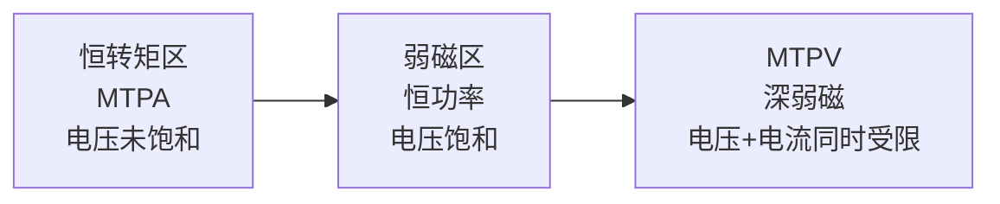

# ALG-11 MTPA 与弱磁控制

**模块编号：** ALG-11
**模块名称：** MTPA 与弱磁控制（MTPA & Flux Weakening）
**难度等级：** ★★★☆☆
**前置知识：** ALG-01 FOC理论基础、ALG-05 有感FOC实现

---

## 1. 概念概述

### 1.1 什么是 MTPA？

**MTPA（Maximum Torque Per Ampere，每安培最大转矩）** 是指在给定定子电流幅值下，通过优化 d/q 轴电流分配（$I_d$ / $I_q$），使电机输出最大电磁转矩的控制策略。

- **SPMSM（表贴式）**：$I_d = 0$ 即为 MTPA，因无磁阻转矩。
- **IPMSM（内嵌式）**：需施加负 $I_d$ 来利用磁阻转矩，提升转矩输出。

### 1.2 什么是弱磁控制？

**弱磁控制（Field Weakening）** 是指通过注入负 d 轴电流削弱永磁体气隙磁链，从而降低反电动势，使电机在母线电压饱和后仍能继续升速的控制策略。

本质：用电流换转速——牺牲部分转矩能力，换取更高的运行转速。

### 1.3 为什么需要它们？

| 策略   | 需求场景                                         |
| ------ | ------------------------------------------------ |
| MTPA   | 提升效率——相同转矩下最小化电流，减少铜损         |
| 弱磁   | 扩展转速范围——突破基速壁垒，实现恒功率运行       |

---

## 2. 转矩方程速查

电磁转矩由永磁转矩 + 磁阻转矩组成：

$$T_e = \frac{3}{2}p[\psi_f i_q + (L_d - L_q)i_d i_q]$$

| 项                                | 名称       | 说明                       |
| --------------------------------- | ---------- | -------------------------- |
| $\frac{3}{2}p\psi_f i_q$          | 永磁转矩   | q轴电流与永磁体磁链相互作用 |
| $\frac{3}{2}p(L_d-L_q)i_d i_q$   | 磁阻转矩   | d/q轴电感差异产生（仅IPMSM） |

---

## 3. 运行区域划分

| 区域       | 转速范围                       | Id 决策           | 约束状态               |
| ---------- | ------------------------------ | ----------------- | ---------------------- |
| 恒转矩区   | $0 \sim \omega_{base}$         | MTPA 轨迹         | 仅电流受限             |
| 弱磁 I 区  | $\omega_{base} \sim \omega_{c1}$ | 电压约束          | 电压受限，电流有余量   |
| 弱磁 II 区 | $\omega_{c1} \sim \omega_{max}$ | 电压+电流约束     | 电压和电流同时受限     |

---

## 4. 凸极比的影响

| 电机类型              | 特点         | MTPA        | 弱磁能力                     |
| --------------------- | ------------ | ----------- | ---------------------------- |
| SPM（$L_d \approx L_q$） | 无磁阻转矩   | $I_d = 0$  | 有限（仅靠负 $I_d$ 削弱磁链） |
| IPM（$L_q > L_d$）      | 有磁阻转矩   | $I_d < 0$  | 更宽，高速转矩更大           |

---

## 5. 深入学习

> **详见：** [ADV-ALG-05 弱磁控制与MTPA深度](../advanced/algorithm/ADV-ALG-05-Field-Weakening-MTPA.md)
>
> 进阶文档涵盖：
> - 电压椭圆与电流圆的完整数学推导
> - 三种弱磁电流计算方法（电压反馈法 / 前馈法 / 查表法）及 C 代码实现
> - MTPA 轨迹的 Lagrange 乘子法推导与在线计算公式
> - MTPA 与弱磁的全速域协调策略
> - 深度弱磁与过调制
> - 弱磁稳定性分析与 PI 参数设计
> - 完整工程实践示例与调试指南

---

### 🔗 hpm_MC 代码实现参考

**弱磁控制**（无独立 MTPA 模块）:
- hpm_mcl_v2 不包含显式的 MTPA 前馈计算模块
- 弱磁策略集成在路径规划中：当目标速度超过基速时，路径规划自动降低加速度需求
- 应用层可在 Id_ref 中添加 d 轴弱磁电流分量

**路径规划中的弱磁协调** (`hpm_mcl_v2/core/control/hpm_mcl_path_plan.h`):
- 超越基速时加速度降额公式：`acc_max × (基速 / speed)`
- 参考: `SDK-05-HPM-MC-v2-Path-Plan.md` 第6节「弱磁控制关联」

**与 MC_LIB 对比**:
- MC_LIB: 内置 `MCFOC_MTPA_F()` 函数，支持凸极电机 MTPA 前馈
- hpm_MCL: 无内置 MTPA，需应用层自行实现 Id 弱磁分量