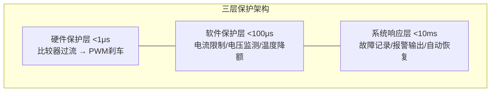
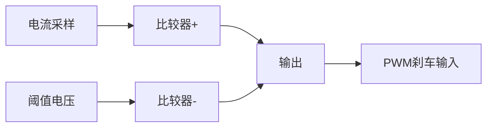

# ALG-13 保护与优化

**模块编号：** ALG-13  
**模块名称：** 保护与优化（Protection and Optimization）  
**文档版本：** v2.0  
**适用对象：** 电机控制工程师、嵌入式开发者  
**前置知识：** ALG-01 FOC理论基础、ALG-05 有感FOC实现、ALG-07 无感FOC观测器

---

## 1. 📌 核心摘要 ★★★☆☆ 🔰📚

**一句话：** 保护系统是电机控制器的"安全带"，确保设备在异常工况下不损坏；优化技术是"加速器"，通过死区补偿、弱磁控制、参数自整定等手段榨取系统极限性能——两者缺一不可，保护是底线，优化是上限。

**认知挂钩：** 电机控制器就像一辆汽车——保护系统是刹车和安全气囊（关键时刻救命），优化技术是涡轮增压和换挡策略（提升性能）。没有刹车的车不敢开快，没有涡轮增压的车开不快。

**保护系统架构总览：**



**优化技术总览：**

| 优化方向 | 技术手段 | 性能提升 |
|---------|---------|---------|
| 电压利用率 | 死区补偿 | 低速转矩脉动↓50% |
| 高速范围 | 弱磁控制 | 转速范围↑2~3倍 |
| 转矩效率 | MTPA | 转矩/电流比最大化 |
| 参数鲁棒性 | 参数自整定 | 适配不同电机 |
| 计算效率 | CORDIC/查表/DMA | CPU占用↓30% |

---

## 2. 📐 原理推导 ★★★★☆ 📚

### 2.1 过流保护原理

#### 2.1.1 过流原因分类

| 类型 | 原因 | 电流上升速度 | 保护方式 |
|------|------|-------------|---------|
| 短路过流 | 相间短路/对地短路/桥臂直通 | 极快（μs级） | 硬件比较器 |
| 过载过流 | 负载过大/启动电流/堵转 | 较慢（ms级） | 软件限流 |
| 再生过流 | 急减速能量回馈 | 中等 | 母线电压保护 |

#### 2.1.2 硬件比较器保护原理



阈值电压计算：

$$
V_{th} = I_{th} \cdot R_{sense} \cdot G_{opamp} + V_{offset}
$$

$$
I_{th} = K_{safety} \cdot I_{max}, \quad K_{safety} = 1.2 \sim 1.5
$$

其中：
- $V_{th}$：过流比较器阈值电压 ($V$)
- $I_{th}$：过流保护电流阈值 ($A$)
- $R_{sense}$：采样电阻阻值 ($\Omega$)
- $G_{opamp}$：运放增益倍数
- $V_{offset}$：运放偏置电压 ($V$)，通常为$V_{ref}/2$
- $K_{safety}$：安全系数，留出裕量
- $I_{max}$：电机最大允许电流 ($A$)

### 2.2 过压与欠压保护原理

#### 2.2.1 母线电压采样

分压电路：

$$
V_{ADC} = U_{dc} \cdot \frac{R_2}{R_1 + R_2}
$$

其中：
- $V_{ADC}$：ADC采样电压 ($V$)
- $U_{dc}$：直流母线电压 ($V$)
- $R_1, R_2$：分压电阻阻值 ($\Omega$)，$R_1$为上臂，$R_2$为下臂

#### 2.2.2 过压原因

- 再生制动能量回馈（最常见）
- 输入电压异常升高
- 电容充电浪涌

#### 2.2.3 欠压原因

- 电源故障
- 线路压降过大
- 电容放电

### 2.3 过温保护原理

#### 2.3.1 NTC热敏电阻

R-T关系：

$$
R_T = R_{25} \cdot e^{B\left(\frac{1}{T} - \frac{1}{T_{25}}\right)}
$$

其中：
- $R_T$：温度$T$下的NTC电阻值 ($\Omega$)
- $R_{25}$：25°C时的标称电阻值 ($\Omega$)
- $B$：NTC材料常数 ($K$)，典型值3000~4000
- $T$：当前绝对温度 ($K$)
- $T_{25}$：参考温度，$T_{25} = 298.15K$（即25°C）

温度计算：

$$
T = \frac{1}{\frac{1}{T_{25}} + \frac{\ln(R_T/R_{25})}{B}}
$$

其中各变量含义同上。

### 2.4 死区补偿原理

#### 2.4.1 死区效应分析

死区导致输出电压偏离给定值：

$$
U_{out} = U_{dc} \cdot D \mp U_{dt}
$$

其中：
- $U_{out}$：实际输出电压 ($V$)
- $U_{dc}$：直流母线电压 ($V$)
- $D$：占空比
- $U_{dt}$：死区导致的电压误差 ($V$)，$U_{dt} = U_{dc} \cdot T_{dt} / T_{pwm}$
- $T_{dt}$：死区时间 ($s$)
- $T_{pwm}$：PWM周期 ($s$)
- 符号取决于电流极性：电流正向时取减号，电流负向时取加号

**死区对FOC的影响：**
- 低速时死区电压占比大，导致电流畸变
- 电流过零点附近极性判断困难
- 6次谐波转矩脉动

#### 2.4.2 基于电流极性的补偿

$$
\Delta U_a = \frac{U_{dc} \cdot T_{dt}}{T_{pwm}} \cdot \text{sign}(i_a)
$$

其中：
- $\Delta U_a$：a相死区补偿电压 ($V$)
- $U_{dc}$：直流母线电压 ($V$)
- $T_{dt}$：死区时间 ($s$)
- $T_{pwm}$：PWM周期 ($s$)
- $\text{sign}(i_a)$：a相电流极性符号函数

### 2.5 弱磁控制原理

#### 2.5.1 弱磁的必要性

当电机转速升高到反电动势接近母线电压时：

$$
\omega_e \psi_f \approx \frac{U_{dc}}{\sqrt{3}}
$$

其中：
- $\omega_e$：电角速度 ($rad/s$)
- $\psi_f$：永磁体磁链 ($Wb$)
- $U_{dc}$：直流母线电压 ($V$)
- $\sqrt{3}$：SVPWM调制下的线电压系数

无法继续提供q轴电流，需要注入负d轴电流削弱磁链：

$$
\psi_{net} = \psi_f + L_d \cdot i_d < \psi_f \quad (i_d < 0)
$$

其中：
- $\psi_{net}$：净磁链 ($Wb$)，注入负d轴电流后减小
- $\psi_f$：永磁体磁链 ($Wb$)
- $L_d$：d轴电感 ($H$)
- $i_d$：d轴电流 ($A$)，弱磁时为负值

#### 2.5.2 弱磁区域划分

| 区域 | 条件 | 控制策略 |
|------|------|---------|
| 恒转矩区 | $\omega < \omega_{base}$ | $i_d = 0$（SPMSM）或MTPA（IPMSM） |
| 弱磁区I | $\omega_{base} < \omega < \omega_{max1}$ | $i_d < 0$，电压受限 |
| 弱磁区II | $\omega > \omega_{max1}$ | $i_d < 0$，电流和电压同时受限 |

### 2.6 MTPA原理

#### 2.6.1 最大转矩每安培

对于IPMSM，转矩方程：

$$
T_e = \frac{3}{2} p \left[\psi_f i_q + (L_d - L_q) i_d i_q\right]
$$

其中：
- $T_e$：电磁转矩 ($N \cdot m$)
- $p$：极对数
- $\psi_f$：永磁体磁链 ($Wb$)
- $i_d, i_q$：d轴、q轴电流 ($A$)
- $L_d, L_q$：d轴、q轴电感 ($H$)

在给定转矩 $T_e$ 下，最小化电流幅值 $I_s = \sqrt{i_d^2 + i_q^2}$：

$$
i_d^{MTPA} = \frac{\psi_f}{2(L_q - L_d)} - \sqrt{\frac{\psi_f^2}{4(L_q - L_d)^2} + i_q^2}
$$

其中：
- $i_d^{MTPA}$：MTPA最优d轴电流 ($A$)
- $\psi_f$：永磁体磁链 ($Wb$)
- $L_d, L_q$：d轴、q轴电感 ($H$)，$L_q > L_d$（IPM电机）
- $i_q$：q轴电流 ($A$)

---

## 3. 🔢 数学建模 ★★★★★ 📚

### 3.1 保护阈值数学模型

#### 3.1.1 过流阈值

$$
I_{th} = K_{safety} \cdot I_{rated}
$$

$$
V_{DAC} = I_{th} \cdot R_{sense} \cdot G_{amp} \cdot \frac{R_2}{R_1 + R_2}
$$

其中：
- $I_{th}$：过流保护电流阈值 ($A$)
- $K_{safety}$：安全系数，通常1.2~1.5
- $I_{rated}$：电机额定电流 ($A$)
- $V_{DAC}$：DAC输出的比较器参考电压 ($V$)
- $R_{sense}$：采样电阻阻值 ($\Omega$)
- $G_{amp}$：运放增益倍数
- $R_1, R_2$：分压电阻阻值 ($\Omega$)

#### 3.1.2 电压阈值

| 保护类型 | 阈值公式 | 24V系统典型值 |
|---------|---------|-------------|
| 过压跳闸 | $1.2 \cdot V_{rated}$ | 28.8V |
| 过压预警 | $1.1 \cdot V_{rated}$ | 26.4V |
| 欠压预警 | $0.85 \cdot V_{rated}$ | 20.4V |
| 欠压跳闸 | $0.7 \cdot V_{rated}$ | 16.8V |

#### 3.1.3 温度降额模型

$$
I_{limit}(T) = \begin{cases}
I_{rated} & T < T_{warn} \\
I_{rated} \cdot \frac{T_{trip} - T}{T_{trip} - T_{warn}} & T_{warn} \leq T < T_{trip} \\
0 & T \geq T_{trip}
\end{cases}
$$

其中：
- $I_{limit}(T)$：温度$T$下的电流限值 ($A$)
- $I_{rated}$：额定电流 ($A$)
- $T$：当前温度 ($°C$)
- $T_{warn}$：预警温度 ($°C$)，典型值80°C
- $T_{trip}$：跳闸温度 ($°C$)，典型值100°C

### 3.2 死区补偿数学模型

#### 3.2.1 死区电压误差

$$
\Delta U_{dt} = \frac{T_{dt}}{T_{pwm}} \cdot U_{dc} \cdot \text{sign}(i)
$$

其中：
- $\Delta U_{dt}$：死区电压误差 ($V$)
- $T_{dt}$：死区时间 ($s$)
- $T_{pwm}$：PWM周期 ($s$)
- $U_{dc}$：直流母线电压 ($V$)
- $\text{sign}(i)$：电流极性符号函数

#### 3.2.2 αβ坐标系补偿

$$
\begin{cases}
\Delta U_\alpha = \Delta U_{dt} \cdot \text{sign}(i_\alpha) \\
\Delta U_\beta = \Delta U_{dt} \cdot \text{sign}(i_\beta)
\end{cases}
$$

其中：
- $\Delta U_\alpha, \Delta U_\beta$：αβ轴死区补偿电压 ($V$)
- $\Delta U_{dt}$：死区电压误差幅值 ($V$)
- $\text{sign}(i_\alpha), \text{sign}(i_\beta)$：αβ轴电流极性符号函数

#### 3.2.3 电流过零点处理

在电流过零点附近，使用平滑过渡函数替代硬切换：

$$
\text{sign}_{smooth}(i) = \frac{2}{\pi}\arctan\left(\frac{i}{\delta}\right)
$$

其中 $\delta$ 为过渡区间宽度。

### 3.3 弱磁控制数学模型

#### 3.3.1 电压极限椭圆与电流极限圆

电压极限椭圆——由母线电压和转速决定的 dq 电流可行域边界：

$$
(L_d i_d + \psi_f)^2 + (L_q i_q)^2 \leq \left(\frac{U_{max}}{\omega_e}\right)^2
$$

电流极限圆——由逆变器和电机额定电流决定：

$$
i_d^2 + i_q^2 \leq I_{max}^2
$$

#### 3.3.2 弱磁电流给定

稳态下忽略电阻压降：

$$
\begin{cases}
U_d = -\omega_e L_q i_q \\
U_q = \omega_e L_d i_d + \omega_e \psi_f
\end{cases}
$$

代入电压约束：

$$
(\omega_e L_q i_q)^2 + (\omega_e L_d i_d + \omega_e \psi_f)^2 \leq U_{max}^2
$$

弱磁d轴电流：

$$
i_d^{FW} = -\frac{\psi_f}{L_d} + \frac{1}{L_d}\sqrt{\frac{U_{max}^2}{\omega_e^2} - (L_q i_q)^2}
$$

#### 3.3.3 弱磁控制器设计

$$
i_d^{ref} = \begin{cases}
0 \text{ 或 } i_d^{MTPA} & |U_s| < U_{max} - \Delta U \\
-K_{fw} \cdot (|U_s| - U_{max} + \Delta U) & |U_s| \geq U_{max} - \Delta U
\end{cases}
$$

### 3.4 MTPA数学模型

#### 3.4.1 拉格朗日法求解

最小化 $I_s^2 = i_d^2 + i_q^2$，约束 $T_e = \frac{3}{2}p[\psi_f i_q + (L_d - L_q)i_d i_q]$

构造拉格朗日函数：

$$
\mathcal{L} = i_d^2 + i_q^2 + \lambda\left[T_e - \frac{3}{2}p(\psi_f i_q + (L_d - L_q)i_d i_q)\right]
$$

对 $i_d, i_q$ 求偏导并令其为零：

$$
2i_d + \lambda \cdot \frac{3}{2}p(L_d - L_q)i_q = 0
$$

$$
2i_q + \lambda \cdot \frac{3}{2}p[\psi_f + (L_d - L_q)i_d] = 0
$$

消去 $\lambda$ 得到MTPA轨迹：

$$
i_d^{MTPA} = \frac{\psi_f}{2(L_q - L_d)} - \sqrt{\frac{\psi_f^2}{4(L_q - L_d)^2} + i_q^2}
$$

### 3.5 参数自整定数学模型

#### 3.5.1 电阻辨识

直流测试法：

$$
R_s = \frac{U_d}{I_d}
$$

#### 3.5.2 电感辨识

高频注入法：

$$
L = \frac{U_{ac}}{\omega_{ac} \cdot I_{ac}}
$$

#### 3.5.3 磁链辨识

空载测试法：

$$
\psi_f = \frac{E}{\omega_e} = \frac{U_q - R_s I_q}{\omega_e}
$$

#### 3.5.4 PI参数自整定

电流环带宽法：

$$
K_p = L_s \cdot \omega_{bw}, \quad K_i = R_s \cdot \omega_{bw}
$$

其中 $\omega_{bw}$ 为期望电流环带宽。

---

## 4. 💻 代码实现 ★★★★☆ 🔧

### 4.1 硬件过流保护（STM32比较器+刹车）

```c
void comparator_overcurrent_init(void)
{
    COMP_TypeDef *comp = COMP1;
    comp->CSR |= COMP_CSR_COMPxINPSEL_1;
    comp->CSR |= COMP_CSR_COMPxINMSEL_2;
    comp->CSR |= COMP_CSR_COMPxPOL;
    comp->CSR |= COMP_CSR_COMPxEN;
    
    TIM1->BDTR |= TIM_BDTR_BKE;
    TIM1->BDTR |= TIM_BDTR_BKP;
}
```

### 4.2 软件过流保护

```c
void current_limit(foc_para_t *foc, float i_max)
{
    float i_mag = sqrtf(foc->i_d * foc->i_d + foc->i_q * foc->i_q);
    
    if (i_mag > i_max)
    {
        float scale = i_max / i_mag;
        foc->i_d *= scale;
        foc->i_q *= scale;
    }
}
```

### 4.3 过流故障状态机

```c
typedef enum {
    FAULT_NONE = 0,
    FAULT_OVERCURRENT_WARN,
    FAULT_OVERCURRENT_TRIP,
    FAULT_OVERCURRENT_LOCK
} overcurrent_state_t;

void overcurrent_protection(float current, float i_warn, float i_trip)
{
    static overcurrent_state_t state = FAULT_NONE;
    static uint32_t fault_cnt = 0;
    
    switch (state)
    {
    case FAULT_NONE:
        if (current > i_warn)
            state = FAULT_OVERCURRENT_WARN;
        break;
        
    case FAULT_OVERCURRENT_WARN:
        if (current > i_trip)
        {
            fault_cnt++;
            if (fault_cnt > 100)
                state = FAULT_OVERCURRENT_TRIP;
        }
        else if (current < i_warn)
        {
            fault_cnt = 0;
            state = FAULT_NONE;
        }
        break;
        
    case FAULT_OVERCURRENT_TRIP:
        foc_pwm_stop();
        fault_log(FAULT_OVERCURRENT);
        state = FAULT_OVERCURRENT_LOCK;
        break;
        
    case FAULT_OVERCURRENT_LOCK:
        break;
    }
}
```

### 4.4 过压/欠压保护

```c
void overvoltage_protection(float vbus, float v_warn, float v_trip)
{
    if (vbus > v_trip)
    {
        foc_pwm_stop();
        fault_log(FAULT_OVERVOLTAGE);
    }
    else if (vbus > v_warn)
    {
        brake_resistor_enable(true);
    }
    else
    {
        brake_resistor_enable(false);
    }
}

void undervoltage_protection(float vbus, float v_warn, float v_trip)
{
    static uint32_t uv_cnt = 0;
    
    if (vbus < v_trip)
    {
        uv_cnt++;
        if (uv_cnt > 100)
        {
            foc_pwm_stop();
            fault_log(FAULT_UNDERVOLTAGE);
        }
    }
    else if (vbus < v_warn)
    {
        mc.iq_max *= 0.5f;
    }
    else
    {
        uv_cnt = 0;
    }
}
```

### 4.5 过温保护

```c
float ntc_temperature(uint16_t adc_value)
{
    float r_ntc;
    float temp;
    
    r_ntc = (float)adc_value * R_PULLUP / (ADC_MAX - adc_value);
    temp = 1.0f / (1.0f / T25 + logf(r_ntc / R25) / B_VALUE);
    temp -= 273.15f;
    
    return temp;
}

void thermal_derating(float temp, float temp_warn, float temp_trip)
{
    float derating_factor;
    
    if (temp >= temp_trip)
    {
        foc_pwm_stop();
        fault_log(FAULT_OVERTEMP);
    }
    else if (temp >= temp_warn)
    {
        derating_factor = (temp_trip - temp) / (temp_trip - temp_warn);
        mc.iq_max *= derating_factor;
    }
}
```

### 4.6 堵转保护

```c
bool stall_detection(float speed, float current, float speed_th, float current_th)
{
    static uint32_t stall_cnt = 0;
    
    if (fabsf(speed) < speed_th && fabsf(current) > current_th)
    {
        stall_cnt++;
        if (stall_cnt > 1000)
            return true;
    }
    else
    {
        stall_cnt = 0;
    }
    return false;
}
```

### 4.7 死区补偿

```c
void deadtime_compensation(foc_para_t *foc, float u_dt)
{
    if (foc->i_a > 0)
        foc->dtc_a += u_dt / foc->vbus;
    else
        foc->dtc_a -= u_dt / foc->vbus;
        
    if (foc->i_b > 0)
        foc->dtc_b += u_dt / foc->vbus;
    else
        foc->dtc_b -= u_dt / foc->vbus;
        
    if (foc->i_c > 0)
        foc->dtc_c += u_dt / foc->vbus;
    else
        foc->dtc_c -= u_dt / foc->vbus;
}

void deadtime_compensation_volt(foc_para_t *foc, float u_dt)
{
    float u_comp;
    
    u_comp = u_dt * signf(foc->i_alpha);
    foc->v_alpha += u_comp;
    
    u_comp = u_dt * signf(foc->i_beta);
    foc->v_beta += u_comp;
}
```

### 4.8 参数自整定

```c
void pi_autotuning(mt_para_t *para, pid_para_t *id_pi, pid_para_t *iq_pi, float bandwidth)
{
    id_pi->kp = para->Ls * bandwidth;
    iq_pi->kp = para->Ls * bandwidth;
    
    id_pi->ki = para->Rs * bandwidth;
    iq_pi->ki = para->Rs * bandwidth;
}
```

### 4.9 计算效率优化

```c
#define SIN_TABLE_SIZE 256
const float sin_table[SIN_TABLE_SIZE] = { /* 预计算值 */ };

float sin_lookup(float angle)
{
    uint16_t index = (uint16_t)(angle / (2.0f * PI) * SIN_TABLE_SIZE);
    return sin_table[index % SIN_TABLE_SIZE];
}
```

### 4.10 🔗 hpm_MC 代码实现参考

**v2 故障检测系统** (`hpm_mcl_v2/core/detect/hpm_mcl_detect.h`):
- 独立监控四子系统：loop（控制环）、encoder（编码器）、analog（模拟采样）、drivers（驱动）
- 1ms 定时器触发周期性检测
- 故障回调机制 → 输出禁用保护（PWM紧急封锁）
- 编译宏 `HPM_MCL_ENABLE_DRIVERS_FAULT_CALLBACK` 控制使能

**v2 控制参数保护** (`hpm_mcl_v2/hpm_mcl_cfg.h`):
- theta_forecast（角度预测）
- dq_decoupling_enable（d/q轴解耦）
- dead_area_compensation_enable（死区补偿）
- sensorless_smc（无感观测器开关）

**v1 保护策略** (`hpm_mcl/inc/hpm_bldc_define.h`):
- `BLDC_CONTRL_SPD_PARA` 包含速度保护阈值
- `BLDC_CONTROL_FOC_PARA` 包含电流保护参数
- 额定电流/电压限制在 `hpm_motor_para_t` 中定义

**与 MC_LIB 对比**:
- MC_LIB: `SYS_ERR.c/h` 系统级错误处理 + `MC_ERR.c/h` 电机级错误处理
- hpm_MCL: 统一 detect 模块监控全部子系统，回调机制更解耦

**参考**: `SDK-02-HPM-MC-v2-Core-Loop.md` 第7节「故障检测」

---

## 5. 🔧 参数整定 ★★★★★ 🔧

### 5.1 保护阈值整定

| 保护类型 | 参数 | 整定方法 |
|---------|------|---------|
| 过流 | $I_{th}$ | 从1.5倍额定开始，逐步降低 |
| 过压 | $V_{ov}$ | 1.1~1.2倍额定母线电压 |
| 欠压 | $V_{uv}$ | 0.7~0.85倍额定母线电压 |
| 过温 | $T_{warn}/T_{trip}$ | 功率管80/100°C，电机100/130°C |
| 堵转 | 速度/电流阈值 | 速度<5%额定且电流>50%额定 |

**保护优先级设计：**

$$
\text{硬件过流} > \text{软件过流} > \text{过压} > \text{欠压} > \text{过温} > \text{堵转}
$$

### 5.2 死区补偿参数整定

| 参数 | 说明 | 整定方法 |
|------|------|---------|
| $T_{dt}$ | 死区时间 | 根据功率器件开关时间确定 |
| 过渡区间 $\delta$ | 电流过零平滑宽度 | 从小值开始，观察电流畸变 |

**验证方法：**
1. 低速空载运行，观察电流波形是否正弦
2. 测量5次、7次谐波含量
3. 对比补偿前后的转矩脉动

### 5.3 弱磁控制参数整定

| 参数 | 说明 | 整定方法 |
|------|------|---------|
| 弱磁进入阈值 $\Delta U$ | 电压裕度 | 5~10% $U_{max}$ |
| 弱磁增益 $K_{fw}$ | d轴电流响应速度 | 从小值开始，逐步增大 |
| 最大弱磁电流 $i_{d,min}$ | d轴电流下限 | 不超过额定电流 |

**整定步骤：**
1. 先调恒转矩区，确保 $i_d = 0$ 运行正常
2. 逐步提高速度，观察电压是否饱和
3. 使能弱磁，从弱增益开始
4. 验证弱磁区的速度稳定性和动态响应

### 5.4 MTPA参数整定

| 参数 | 说明 | 整定方法 |
|------|------|---------|
| $L_d, L_q$ | d/q轴电感 | 需准确测量，影响MTPA轨迹 |
| $\psi_f$ | 永磁体磁链 | 空载测试测量 |

**验证方法：**
1. 给定转矩下，对比MTPA和 $i_d = 0$ 的电流幅值
2. 测量效率提升
3. 验证全速域MTPA+弱磁的平滑过渡

### 5.5 常见问题与解决方案

| 问题 | 现象 | 可能原因 | 解决方案 |
|------|------|---------|---------|
| 误触发过流 | 正常运行时频繁跳闸 | 阈值过低/噪声干扰 | 提高阈值/增加滤波 |
| 死区补偿振荡 | 电流过零点振荡 | 极性判断延迟 | 使用平滑过渡函数 |
| 弱磁不稳定 | 高速时速度波动 | 弱磁增益过大 | 降低增益/增加电压滤波 |
| MTPA偏移 | 效率未达预期 | 电感参数不准 | 重新辨识Ld/Lq |
| 温度保护误报 | 温度读数跳变 | NTC接触不良 | 检查硬件/增加滤波 |
| 堵转误判 | 正常启动时触发 | 启动时间过短 | 增加堵转检测延时 |

---

## 6. 🔗 硬件约束 ★★★★☆ ⚠️

### 6.1 死区补偿→功率器件特性

🔗 **硬件约束：死区补偿效果直接受功率器件开关特性约束**

- **开关时间差异：** MOSFET开通时间（10~50ns）远小于IGBT（100~500ns），死区时间需求不同。死区补偿需要准确知道实际死区时间，而非配置值
- **管压降非线性：** IGBT饱和压降约1.5~2.5V，MOSFET导通电阻压降 $R_{ds,on} \cdot I$。管压降随温度和电流变化，简单的极性补偿无法完全消除误差
- **反向恢复：** 续流二极管反向恢复导致额外电压误差，在电流过零点附近尤为明显 → [HW-05 功率器件与栅极驱动](../hardware/HW-05-Power-Devices-Gate-Drivers.md#411-死区时间)

### 6.2 弱磁控制→母线电压

🔗 **硬件约束：弱磁控制的有效性受母线电压限制**

- **母线电压纹波：** 弱磁进入阈值基于 $U_{max} = U_{dc}/\sqrt{3}$，但母线电压存在纹波（典型5~10%），导致弱磁频繁进出
- **电压测量精度：** 母线电压分压电路和ADC精度直接影响弱磁判断。12位ADC在24V系统下分辨率约6mV，足够但需滤波
- **电缆压降：** 长电缆导致电机端电压低于逆变器端电压，弱磁提前进入 → [HW-06 电源管理与保护](../hardware/HW-06-Power-Management-Protection.md#474-泵升电压处理再生制动)

### 6.3 保护算法→硬件保护电路

🔗 **硬件约束：软件保护无法替代硬件保护，两者必须协同设计**

- **响应时间差异：** 硬件比较器过流保护响应时间<1μs，软件保护最快也需要一个控制周期（50μs@20kHz）。短路电流在50μs内可能已损坏功率管
- **比较器阈值精度：** DAC输出阈值电压的精度和漂移直接影响过流保护点。DAC 12位分辨率在3.3V参考下约0.8mV，对应电流精度取决于采样电阻和放大倍数
- **刹车电路可靠性：** STM32 TIM1刹车输入必须正确配置，包括极性、滤波、紧急停止模式。刹车后需软件复位才能恢复 → [HW-06 电源管理与保护](../hardware/HW-06-Power-Management-Protection.md#462-硬件过流保护电路)

### 6.4 温度监测→NTC安装位置

🔗 **硬件约束：温度保护的有效性取决于NTC安装位置和热耦合**

- **热延迟：** NTC安装在散热器上，功率管结温到NTC的热阻导致温度读数滞后。结温可能已超限但NTC尚未达到预警值
- **安装位置：** NTC应尽量靠近热源（功率管），但受PCB布局限制
- **多热点：** 逆变器有多个功率管，单个NTC无法覆盖所有热点 → [HW-07 热设计与EMC](../hardware/HW-07-Thermal-EMC-Design.md#a-热阻计算)

---

## 7. 🚀 前沿拓展 ★★★★★ 💡

### 7.1 自适应死区补偿

- **基于电流观测器：** 通过比较实际电流与模型电流，在线估计死区电压误差
- **基于扰动观测器：** 将死区视为扰动，设计观测器实时估计并补偿
- **机器学习方法：** 用神经网络学习死区非线性映射，实现精确补偿

### 7.2 智能弱磁控制

- **最大转矩电压比（MTPV）：** 在深度弱磁区，沿电压极限椭圆优化转矩输出
- **自适应弱磁：** 根据母线电压和负载动态调整弱磁策略
- **损耗最小化：** 在弱磁区同时优化铜损和铁损

### 7.3 在线参数辨识

- **MRAS方法：** 模型参考自适应系统辨识Rs、Ls、ψf
- **递推最小二乘（RLS）：** 在线拟合电机参数
- **高频信号注入：** 利用HFI信号同时辨识电感参数

### 7.4 预测性维护

- **绝缘老化监测：** 通过漏电流变化趋势预测电机绝缘劣化
- **轴承故障诊断：** 电流频谱分析检测轴承故障特征频率
- **功率器件健康状态：** 监测Vce(sat)/Rds(on)变化趋势

### 7.5 功能安全集成

- **ISO 26262/IEC 61508：** 将保护系统设计为安全相关功能
- **双通道监测：** 硬件+软件独立监测，交叉验证
- **安全状态设计：** 故障后进入确定的安全状态（如自由停机）

---

## 保护等级速查表

| 等级 | 描述 | 响应时间 | 响应动作 |
|------|------|---------|---------|
| 一级 | 紧急故障 | <1μs | 立即封锁PWM |
| 二级 | 严重故障 | <100μs | 停机保护 |
| 三级 | 一般故障 | <10ms | 降额运行 |
| 四级 | 预警 | <100ms | 记录日志 |

## 关键公式速查表

| 名称 | 公式 | 说明 |
|------|------|------|
| 过流阈值 | $I_{th} = K \cdot I_{max}$ | 安全系数1.2~1.5 |
| NTC温度 | $T = \frac{1}{\frac{1}{T_{25}} + \frac{\ln(R/R_{25})}{B}}$ | B值法 |
| 死区电压 | $U_{dt} = U_{dc} \cdot T_{dt} / T_{pwm}$ | 死区影响 |
| 弱磁电流 | $i_d^{FW} = -\frac{\psi_f}{L_d} + \frac{1}{L_d}\sqrt{\frac{U_{max}^2}{\omega_e^2} - (L_q i_q)^2}$ | 电压约束 |
| MTPA轨迹 | $i_d^{MTPA} = \frac{\psi_f}{2(L_q-L_d)} - \sqrt{\frac{\psi_f^2}{4(L_q-L_d)^2} + i_q^2}$ | 最小电流 |
| PI自整定 | $K_p = L_s \cdot \omega_{bw}$ | 带宽法 |
| 温度降额 | $I_{lim} = I_{rated} \cdot \frac{T_{trip}-T}{T_{trip}-T_{warn}}$ | 线性降额 |

:::sim-html foc_sim.html


## 🧪 仿真验证
> 本模块的理论可在 [C 语言仿真](../simulation/SIM-00-C-Simulation-Overview.md) 中验证。
> 对应仿真模式：MODE_SELECT_COMMISSIONING (9)，关键操作：观察控制台输出：R→L→KE→Js 分步辨识过程和辨识精度