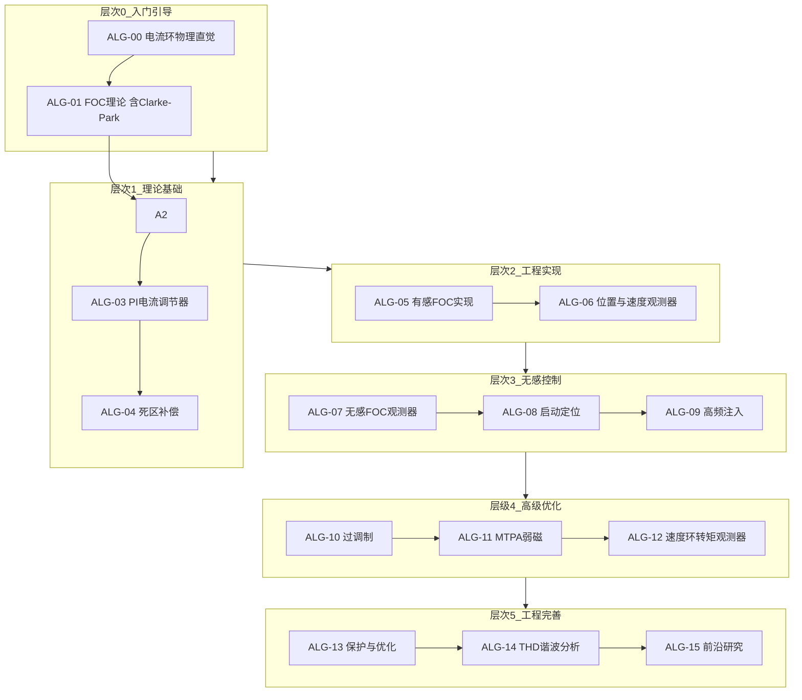

# 🧮 算法学习路径

> **核心理念**：从控制算法理解电控系统，建立"算法受硬件约束"的认知

---

## 学习路径总览

---

## 模块列表

| 编号 | 模块 | 核心问题 | 难度 |
|------|------|---------|------|
| 0 | [电流环PI整定的物理直觉](./ALG-00-Current-Loop-Intuition.md) | 为什么要这样设Kp和Ki？带宽是什么？ | ★☆☆☆☆ |
| 1 | [FOC理论基础](./ALG-01-FOC-Theory.md) | FOC为什么能实现高性能控制？ | ★★☆☆☆ |
| 2 | [ADC电流采样时序](./ALG-02-Current-Sampling-Timing.md) | 如何正确采样相电流？ | ★★★☆☆ |
| 3 | [PI电流调节器设计](./ALG-03-PI-Current-Regulator.md) | 电流环PI参数怎么设计？ | ★★★☆☆ |
| 4 | [死区补偿策略](./ALG-04-Deadtime-Compensation.md) | 如何消除逆变器非线性？ | ★★★★☆ |
| 5 | [有感FOC实现](./ALG-05-Sensored-FOC.md) | 如何从理论到工程实现？ | ★★★☆☆ |
| 6 | [位置与速度观测器](./ALG-06-Position-Speed-Observer.md) | 如何从电流估算位置速度？ | ★★★★☆ |
| 7 | [无感FOC观测器](./ALG-07-Sensorless-Observers.md) | 不用传感器如何获取位置？ | ★★★★☆ |
| 8 | [启动定位与预定位](./ALG-08-Initial-Position-Detection.md) | 无感启动前如何找到转子？ | ★★★★☆ |
| 9 | [高频注入法](./ALG-09-High-Frequency-Injection.md) | 零速/低速如何无感运行？ | ★★★★☆ |
| 10 | [过调制与六阶梯波](./ALG-10-Overmodulation.md) | 如何提升电压利用率？ | ★★★☆☆ |
| 11 | [MTPA与弱磁控制](./ALG-11-MTPA-Flux-Weakening.md) | 如何最大化转矩输出？ | ★★★★☆ |
| 12 | [速度环与转矩观测器](./ALG-12-Speed-Loop-Torque-Observer.md) | 外环如何设计？ | ★★★★☆ |
| 13 | [保护与优化](./ALG-13-Protection-Optimization.md) | 如何保证安全并提升性能？ | ★★★☆☆ |
| 14 | [THD谐波分析](./ALG-14-THD-Harmonic-Analysis.md) | 如何量化电流质量？ | ★★★☆☆ |
| 15 | [前沿研究](./ALG-15-Advanced-Research.md) | 低载波比下如何保证稳定？ | ★★★★★ |

---

## MC_LIB代码实践

算法路径配套MC_LIB电机控制库的代码实践文档：

| 文档 | 核心内容 | 关联模块 |
|------|---------|---------|
| [架构总览](./MC-LIB/MC-LIB-Architecture.md) | 分层架构、模块依赖、数据流 | 全部 |
| [FOC核心模块](./MC-LIB/MC-LIB-FOC-Core.md) | FOC算法实现细节 | ALG-01, ALG-05 |
| [SVPWM模块](./MC-LIB/MC-LIB-SVPWM.md) | 空间矢量调制实现 | ALG-05 |
| [控制环模块](./MC-LIB/MC-LIB-Control-Loop.md) | PI控制器、环路设计 | ALG-03, ALG-05, ALG-13 |
| [观测器模块](./MC-LIB/MC-LIB-Observer.md) | 无感观测器实现 | ALG-06, ALG-07 |
| [六步换相模块](./MC-LIB/MC-LIB-Six-Step.md) | BLDC六步换相实现 | ALG-05 |
| [移植使用指南](./MC-LIB/MC-LIB-Porting-Guide.md) | 跨平台移植方法 | 全部 |

---

## 学习建议

### 零算法基础入门路线
1. **先学ALG-00（电流环物理直觉），建立"为什么这样设计PI参数"的直观理解** ← 🆕 新增第一步
2. 再学ALG-01（FOC理论），理解坐标变换和控制原理
3. 然后学ALG-03（PI设计），掌握完整的数学推导和工程方法
4. 接着学ALG-02（电流采样）和ALG-05（有感FOC），掌握FOC基础组件与实现
5. 进阶ALG-07（无感观测器），突破传感器依赖
6. 按需学习ALG-08到ALG-15

### 有算法基础进阶路线
1. 直接从ALG-07（无感观测器）开始，深入理解观测器设计
2. 学习ALG-09（高频注入），掌握全速域无感控制
3. 学习ALG-12（速度环+转矩观测器）和ALG-11（MTPA弱磁）
4. 学习ALG-15（前沿研究），了解最新学术进展
5. 结合MC_LIB和hpm_MC代码实践，将理论转化为代码

### 每个模块的学习方法
1. 先读"核心摘要"，快速把握要点
2. 精读"原理推导"，理解数学本质
3. 跟读"代码实现"，对照MC_LIB源码
4. 实践"参数整定"，在真实硬件上调参
5. 必读"硬件约束"，理解算法的物理边界
6. 选读"前沿拓展"，了解学术前沿