# COM-06 EtherCAT协议

> 路径：📡 工业通信协议 > COM-06

**难度：** ★★★★★

## 概述

EtherCAT（Ethernet for Control Automation Technology）是由德国倍福（Beckhoff）公司于2003年提出的高性能实时以太网协议，后成为IEC 61158和IEC 61784国际标准。EtherCAT的核心创新在于**"On-the-Fly"处理机制**——以太网帧在经过每个从站时，从站硬件在帧传输的同时提取/插入数据，无需接收完整帧后再处理，使得整个网络的刷新周期可达**31.25μs**（100Mbps下），同步精度优于**1μs**。

在多轴伺服同步控制领域，EtherCAT凭借其极高的通信效率、纳秒级同步精度和灵活的拓扑结构，已成为事实上的工业标准。理解EtherCAT的帧结构、分布式时钟、过程数据映射和CoE协议，是构建高性能多轴运动控制系统的基础。

## 正文

### 1. EtherCAT帧结构

#### 1.1 以太网帧封装

EtherCAT帧直接封装在标准Ethernet帧中，EtherType为0x88A4。

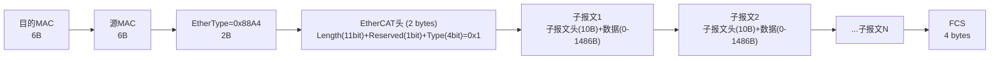

#### 1.2 EtherCAT子报文结构

每个子报文（Datagram）包含独立的寻址和工作计数器（Working Counter, WKC）。

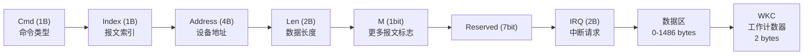

#### 1.3 命令类型（Cmd）

| 命令码 | 名称 | 寻址方式 | 操作 | 说明 |
|--------|------|----------|------|------|
| 0x00 | NOP | — | 无操作 | 占位 |
| 0x01-0x03 | APRD/FPRD/BRD | 自动/固定/广播 | 读 | 从从站读取数据 |
| 0x04-0x06 | APWR/FPWR/BWR | 自动/固定/广播 | 写 | 向从站写入数据 |
| 0x07 | BRW | 广播 | 读写 | 广播读写 |
| 0x08-0x0A | APRW/FPRW/FRMW | 自动/固定/配置 | 读写 | 从站读写 |
| 0x0B-0x0D | ARMW/FRMW/— | — | 读多写一 | 多从站读、一从站写 |

**寻址方式**：
- **自动增量寻址（Auto-Increment, APx）**：地址字段为偏移量，每经过一个从站自动减1，适用于拓扑发现
- **固定寻址（Fixed Position, FPx）**：地址字段为从站配置站地址，适用于运行时通信
- **广播寻址（Broadcast, Bx）**：所有从站同时处理

#### 1.4 工作计数器（WKC）

WKC是EtherCAT可靠性的关键机制。每个从站处理子报文后根据操作类型递增WKC：

| 操作 | WKC增量 |
|------|---------|
| 读 | +1 |
| 写 | +2 |
| 读写 | +3 |

主站通过检查返回的WKC值是否等于预期值，判断所有从站是否正确处理了该子报文。

```
预期WKC = 读操作从站数×1 + 写操作从站数×2 + 读写操作从站数×3

示例：3个从站执行读写操作
预期WKC = 3 × 3 = 9
若返回WKC ≠ 9，说明有从站未正确响应
```

### 2. 分布式时钟（DC）机制

#### 2.1 时钟同步原理

EtherCAT分布式时钟（Distributed Clocks, DC）是实现多轴伺服精确同步的核心机制。

**同步过程**：
1. 主站发送广播读命令，获取所有从站的本地时钟值
2. 计算传播延迟（相邻从站间的时间差）
3. 选取参考时钟（通常为第一个支持DC的从站）
4. 计算各从站相对于参考时钟的偏移量（Offset）和漂移率（Drift）
5. 周期性发送同步信号，各从站根据偏移量调整本地时钟

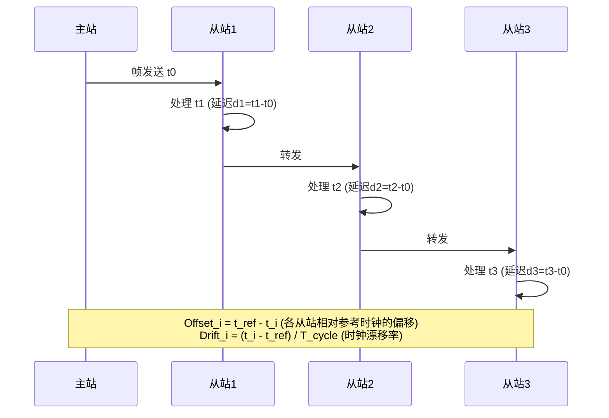

#### 2.2 同步模式

| 模式 | 说明 | 适用场景 |
|------|------|----------|
| Free Run | 从站独立运行，不同步 | 非实时I/O |
| SM-Synchronous | 从站以SyncManager事件为同步基准 | 一般伺服驱动 |
| DC-Synchronous | 从站以DC同步信号为基准，中断触发 | 高精度多轴同步 |
| DC-Synchronous with Shift | DC同步但偏移一定相位 | 避免多从站同时中断 |

#### 2.3 同步精度分析

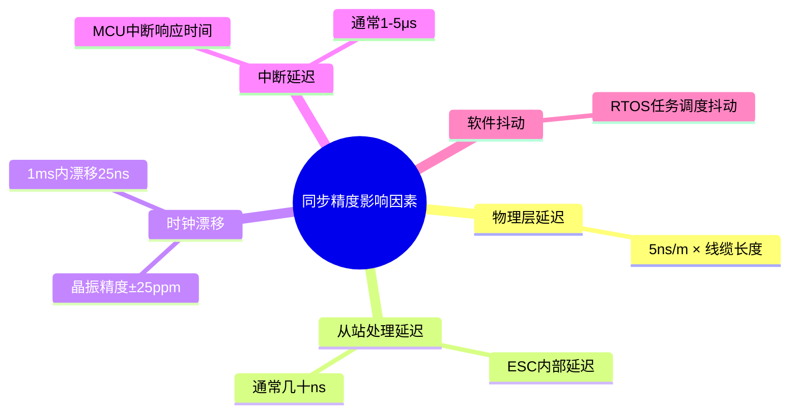

> 典型同步精度：
> - 纯DC硬件同步：< 100ns
> - DC + 中断触发：< 1μs
> - SM同步：10-100μs
> - Free Run：无保证

### 3. 从站ESC（EtherCAT Slave Controller）架构

#### 3.1 ESC功能框图

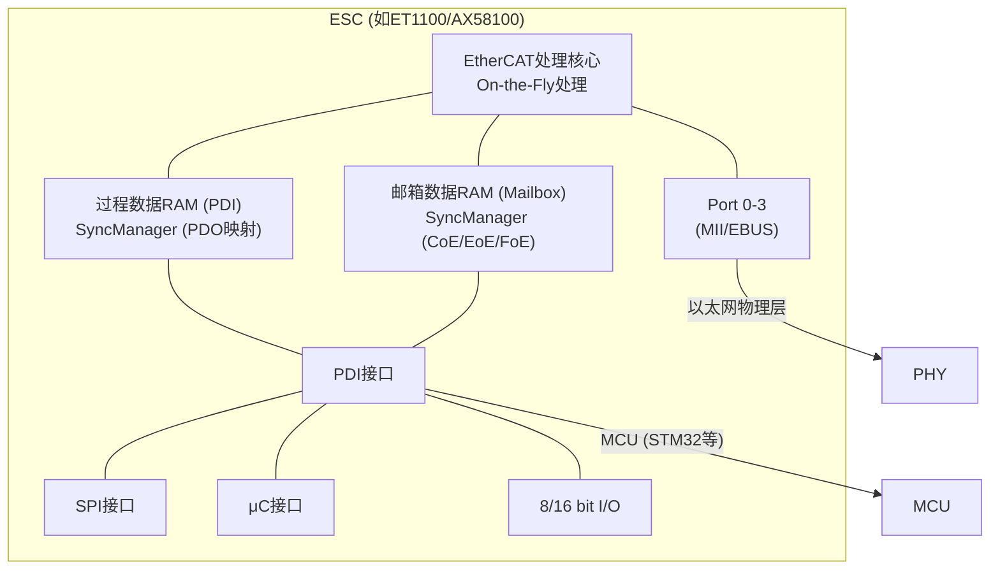

#### 3.2 常用ESC芯片

| 型号 | 厂商 | 接口 | 特点 |
|------|------|------|------|
| ET1100 | Beckhoff | MII/EBUS | 经典方案，4端口 |
| ET1200 | Beckhoff | MII | 2端口，低成本 |
| AX58100 | ASIX | MII/SPI | 兼容ET1100，国产替代 |
| LAN9252 | Microchip | MII/SPI | 集成PHY，2端口 |
| NXET32 | 纳芯微 | — | 国产ESC方案 |

#### 3.3 PDI接口选择

| 接口 | 带宽 | 引脚数 | 适用场景 |
|------|------|--------|----------|
| SPI (30MHz) | ~3.75MB/s | 5-7 | 简单I/O模块 |
| 8-bit并行 | ~10MB/s | 12+ | 中等复杂度从站 |
| 16-bit并行 | ~20MB/s | 20+ | 伺服驱动器 |
| μC接口 (异步) | ~15MB/s | 15+ | 32-bit MCU |

**伺服驱动器推荐**：16-bit并行接口或μC接口，确保过程数据在伺服周期内完成交换。

### 4. 过程数据映射（PDO映射与SyncManager）

#### 4.1 SyncManager机制

SyncManager（SM）是ESC中的硬件机制，用于管理主站与从站之间的数据交换，提供双端口RAM访问和中断通知。

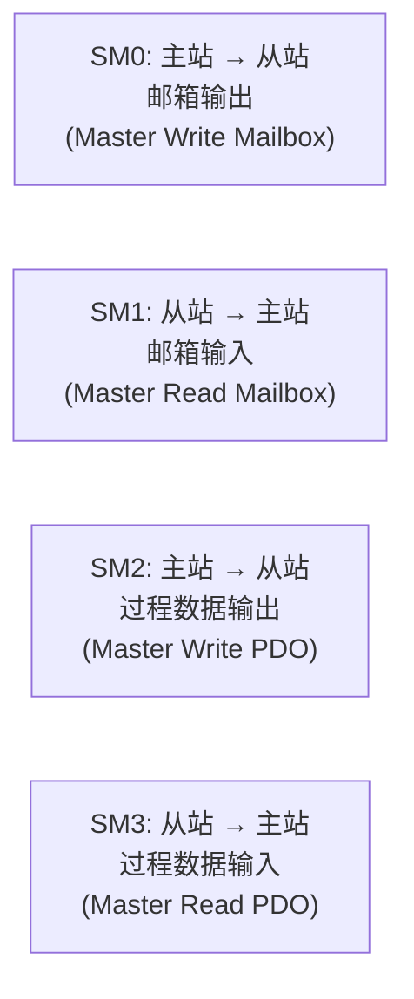

**SM工作模式**：
- **Buffered模式**：新数据覆盖旧数据，适用于过程数据（PDO），允许丢失
- **Mailbox模式**：握手确认机制，适用于非周期数据（CoE），不允许丢失

#### 4.2 PDO映射

PDO（Process Data Object）映射定义了过程数据在SM缓冲区中的布局。

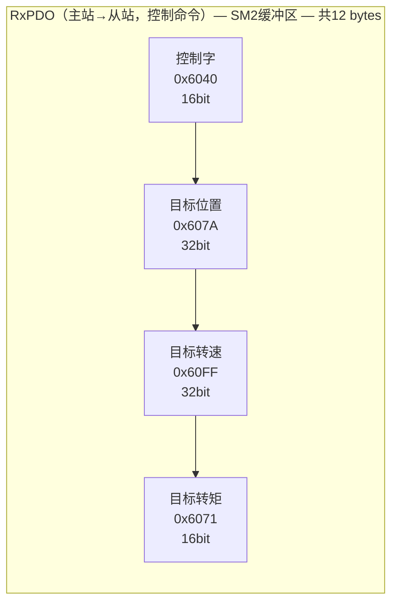

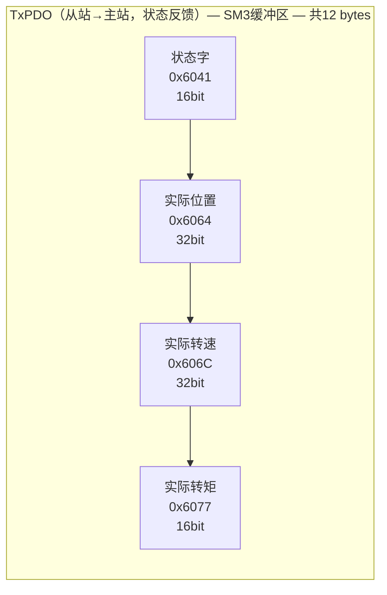

#### 4.3 PDO映射配置流程

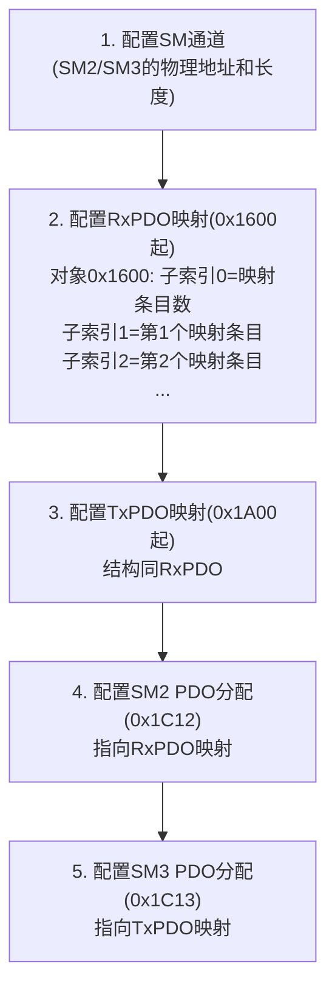

**映射条目编码**（32位）：

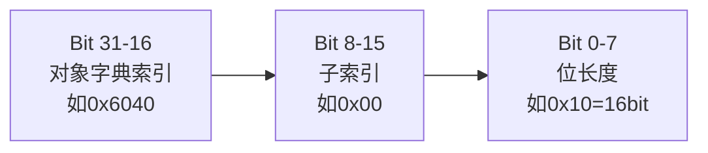

> 示例：控制字映射 = 0x60400010
> 索引0x6040, 子索引0x00, 16bit

### 5. CoE（CANopen over EtherCAT）协议

#### 5.1 CoE架构

CoE将CANopen的应用层协议（对象字典、SDO、PDO、Emergency）移植到EtherCAT的邮箱通信上，实现CANopen与EtherCAT的无缝融合。

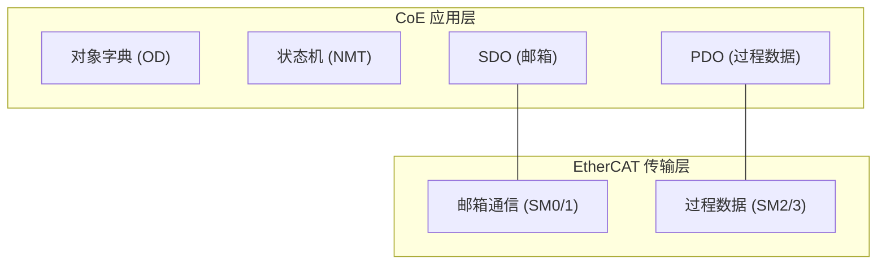

#### 5.2 SDO服务

SDO（Service Data Object）通过邮箱通信访问对象字典，用于参数配置和非周期数据交换。

| CoE服务 | 说明 | 用途 |
|---------|------|------|
| SDO Upload | 从站→主站读取对象 | 读取参数 |
| SDO Download | 主站→从站写入对象 | 配置参数 |
| SDO Information | 查询对象字典信息 | 在线描述 |
| Emergency Request | 从站主动上报紧急事件 | 故障通知 |

**SDO邮箱帧格式**：

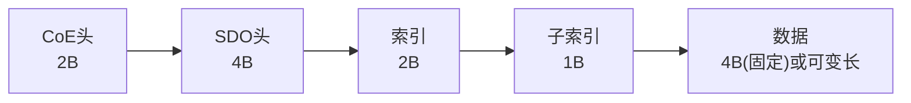

> CoE头: Number=0, Service=SDO
> SDO头: COE-ID, Transfer Type, Block Size, Command, Complete Access

#### 5.3 CiA 402驱动器协议

CoE继承了CANopen的CiA 402（DS402）驱动器设备子协议，定义了伺服驱动器的标准对象字典和状态机。

**DS402状态机**：

```mermaid
stateDiagram-v2
    [*] --> NotReadyToSwitchOn
    NotReadyToSwitchOn --> SwitchOnDisabled : 故障复位
    SwitchOnDisabled --> ReadyToSwitchOn : Shutdown
    ReadyToSwitchOn --> SwitchedOnDisabled : Enable Op
    SwitchedOnDisabled --> OperationEnabled : Enable Op
    OperationEnabled --> SwitchedOnDisabled : Disable Op
    OperationEnabled --> QuickStopActive : Quick Stop
    QuickStopActive --> SwitchOnDisabled : Quick Stop完成
    OperationEnabled --> SwitchOnDisabled : Disable Op
    SwitchedOnDisabled --> ReadyToSwitchOn : Shutdown
    ReadyToSwitchOn --> SwitchOnDisabled : Shutdown

    state NotReadyToSwitchOn as "Not Ready to Switch On"
    state SwitchOnDisabled as "Switched On Disabled"
    state ReadyToSwitchOn as "Ready to Switch On"
    state SwitchedOnDisabled as "Switched On Disabled"
    state OperationEnabled as "Operation Enabled"
    state QuickStopActive as "Quick Stop Active"
```

> 状态转换由控制字(0x6040)和状态字(0x6041)驱动

**关键对象字典条目**：

| 索引 | 名称 | 类型 | 访问 | 说明 |
|------|------|------|------|------|
| 0x6040 | 控制字 | UINT16 | RW | 状态机控制 |
| 0x6041 | 状态字 | UINT16 | RO | 状态机反馈 |
| 0x6060 | 运行模式 | INT8 | RW | 0=位置,1=速度,2=转矩 |
| 0x607A | 目标位置 | INT32 | RW | 位置模式目标 |
| 0x60FF | 目标速度 | INT32 | RW | 速度模式目标 |
| 0x6071 | 目标转矩 | INT16 | RW | 转矩模式目标 |
| 0x6064 | 实际位置 | INT32 | RO | 编码器反馈位置 |
| 0x606C | 实际速度 | INT32 | RO | 实际转速反馈 |
| 0x6077 | 实际转矩 | INT16 | RO | 实际转矩反馈 |
| 0x6062 | 位置需求 | INT32 | RO | 位置环输出 |
| 0x1000 | 设备类型 | UINT32 | RO | CoE设备类型码 |
| 0x1018 | 设备标识 | — | RO | 厂商/产品/序列号 |

### 6. 与CANopen对比

| 对比维度 | CANopen | EtherCAT (CoE) |
|----------|---------|----------------|
| **物理层** | CAN 2.0/FD | 100Mbps Ethernet |
| **最大波特率** | 1Mbps (CAN 2.0) / 5Mbps (CAN FD) | 100Mbps |
| **帧效率** | 8字节/帧(CAN 2.0), 64字节/帧(CAN FD) | 单帧最多1490字节 |
| **周期时间** | 典型1-10ms | 典型31.25μs-1ms |
| **节点数** | 127 (8bit ID) | 65535 (16bit地址) |
| **同步精度** | ~1ms (SYNC对象) | <1μs (DC) |
| **确定性** | 非确定性（CSMA/CA） | 确定性（主站调度） |
| **拓扑** | 线性（需终端电阻） | 线性/星型/树型/环型 |
| **线缆** | 屏蔽双绞线 | 标准以太网线Cat5e |
| **线缆成本** | 中等 | 低（标准以太网线） |
| **实现复杂度** | 低（CAN控制器集成） | 高（需ESC芯片） |
| **协议栈** | 轻量（~10KB RAM） | 较重（需CoE对象字典） |
| **应用层** | 原生CANopen | CoE（CANopen over EtherCAT） |
| **适合场景** | 单轴/简单多轴 | 多轴高精度同步 |

**关键差异解读**：

1. **实时性**：CANopen的CSMA/CA仲裁机制导致消息延迟不确定；EtherCAT主站轮询机制保证确定性
2. **带宽**：CANopen 1Mbps下8字节有效载荷效率仅~50%；EtherCAT单帧可承载数十个从站的过程数据
3. **同步**：CANopen SYNC是软件同步，精度受总线负载影响；EtherCAT DC是硬件同步，精度与负载无关
4. **兼容性**：EtherCAT CoE复用CANopen对象字典，迁移成本低

### 7. EtherCAT在多轴伺服系统中的应用

#### 7.1 典型系统架构

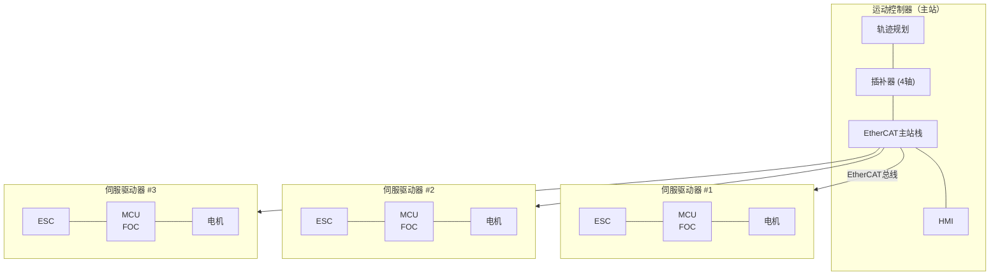

#### 7.2 通信周期设计

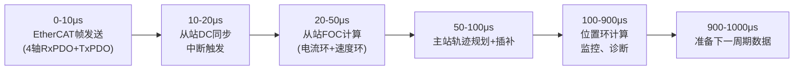

> 典型4轴伺服系统通信周期 = 1ms
> 数据量估算（4轴）：
> - RxPDO: 4轴 × 12字节 = 48字节
> - TxPDO: 4轴 × 12字节 = 48字节
> - EtherCAT帧开销: ~30字节
> - 总计: ~126字节
> - 传输时间: 126 × 8 / 100Mbps ≈ 10μs

#### 7.3 同步控制策略

| 策略 | 说明 | 同步精度 | 适用场景 |
|------|------|----------|----------|
| 集中插补 | 主站完成插补，从站仅执行位置/速度环 | 高 | 通用多轴 |
| 分布式插补 | 主站下发轨迹参数，从站本地插补 | 极高 | 高速凸轮 |
| 电子齿轮 | 从站跟随主轴位置，齿轮比可调 | 极高 | 套色印刷 |
| 电子凸轮 | 从站按凸轮曲线跟随主轴 | 极高 | 包装机械 |

### 8. 主站实现选项

#### 8.1 SOEM（Simple Open EtherCAT Master）

**特点**：
- 开源（BSD许可），轻量级
- 适用于嵌入式Linux/RTOS
- 无需专用硬件，标准以太网卡即可
- 不支持DC同步主站（仅从站DC）

**适用场景**：简单多轴控制、非硬实时要求的场合。

```c
#include "soem/ethercat.h"

#define ECAT_IFNAME  "eth0"
#define ECAT_TIMEOUT 5000

int main(void)
{
    int expected_wkc;
    int oloop, iloop;

    if (!ec_init(ECAT_IFNAME)) {
        printf("ec_init failed\n");
        return -1;
    }

    if (ec_config_init(FALSE) <= 0) {
        printf("No slaves found\n");
        return -1;
    }

    ec_config_map(&IOmap);
    ec_configdc();

    expected_wkc = (ec_group[0].outputsWKC * 2) + ec_group[0].inputsWKC;
    printf("Expected WKC: %d\n", expected_wkc);

    ec_slave[0].state = EC_STATE_OPERATIONAL;
    ec_send_processdata();
    ec_receive_processdata(EC_TIMEOUT_US);
    ec_writestate(0);

    int chk = 40;
    do {
        ec_send_processdata();
        ec_receive_processdata(EC_TIMEOUT_US);
        ec_statecheck(0, EC_STATE_OPERATIONAL, 50000);
    } while (chk-- && (ec_slave[0].state != EC_STATE_OPERATIONAL));

    while (1) {
        ec_send_processdata();
        ec_receive_processdata(EC_TIMEOUT_US);

        int wkc = ec_group[0].inputsWKC * 2 + ec_group[0].outputsWKC;
        if (wkc != expected_wkc) {
            printf("WKC error: got %d, expected %d\n", wkc, expected_wkc);
        }

        osal_usleep(1000);
    }

    ec_slave[0].state = EC_STATE_INIT;
    ec_writestate(0);
    ec_close();
    return 0;
}
```

#### 8.2 IgH EtherCAT Master

**特点**：
- 开源（GPL许可），功能完整
- Linux内核模块实现，实时性优
- 支持DC同步主站
- 支持FSoE（Safety over EtherCAT）
- 完整的CoE、EoE、FoE协议栈
- 需配合PREEMPT_RT或Xenomai补丁

**适用场景**：高性能多轴伺服、需要硬实时的工业控制。

```bash
# IgH EtherCAT Master 编译安装
git clone https://gitlab.com/etherlab.org/ethercat.git
cd ethercat
./bootstrap
./configure --enable-kernel-module --with-linux-dir=/usr/src/linux
make -j$(nproc)
sudo make modules_install
sudo modprobe ec_master
```

```c
#include <ecrt.h>

int main(void)
{
    ec_master_t *master;
    ec_domain_t *domain;
    ec_slave_config_t *sc;
    ec_pdo_entry_reg_t pdo_regs[] = {
        {0, 0, 0x6040, 0, &off_control_word},
        {0, 0, 0x607A, 0, &off_target_pos},
        {0, 0, 0x6041, 0, &off_status_word},
        {0, 0, 0x6064, 0, &off_actual_pos},
        {}
    };

    master = ecrt_request_master(0);
    domain = ecrt_master_create_domain(master);

    sc = ecrt_master_slave_config(master, 0, 0, VID, PID);
    ecrt_slave_config_pdos(sc, EC_END, servo_syncs);
    ecrt_domain_reg_pdo_entry_list(domain, pdo_regs);

    ecrt_master_activate(master);

    while (1) {
        ecrt_master_receive(master);
        ecrt_domain_process(domain);

        EC_WRITE_U16(domain_pd + off_control_word, 0x000F);
        EC_WRITE_S32(domain_pd + off_target_pos, target_position);
        uint16_t status = EC_READ_U16(domain_pd + off_status_word);
        int32_t actual = EC_READ_S32(domain_pd + off_actual_pos);

        ecrt_domain_queue(domain);
        ecrt_master_send(master);

        usleep(1000);
    }

    ecrt_master_deactivate(master);
    ecrt_release_master(master);
    return 0;
}
```

#### 8.3 主站方案对比

| 对比项 | SOEM | IgH EtherCAT Master | TwinCAT (Beckhoff) |
|--------|------|---------------------|---------------------|
| 许可证 | BSD | GPL | 商业 |
| 平台 | 裸机/Linux/RTOS | Linux (RT) | Windows+实时内核 |
| DC同步 | 从站DC | 主站+从站DC | 主站+从站DC |
| CoE | 基础 | 完整 | 完整 |
| 实时性 | 软实时 | 硬实时(RT) | 硬实时 |
| 开发难度 | 低 | 中 | 低（图形化配置） |
| 成本 | 免费 | 免费 | 付费 |
| 适用规模 | <16轴 | <64轴 | <256轴 |

## 小结

EtherCAT是当前多轴伺服同步控制领域最先进的实时以太网协议，关键要点：

1. **On-the-Fly处理**：帧在传输过程中被从站处理，实现极高通信效率，31.25μs刷新周期
2. **分布式时钟（DC）**：硬件级时钟同步，精度<1μs，是高精度多轴同步的基础
3. **ESC架构**：从站需要专用ESC芯片（如ET1100/LAN9252/AX58100），MCU通过PDI接口访问
4. **PDO映射**：过程数据通过SyncManager和PDO映射在周期帧中高效交换
5. **CoE协议**：复用CANopen对象字典和CiA 402驱动器协议，降低迁移成本
6. **主站选型**：SOEM适合轻量级应用，IgH适合高性能Linux方案，TwinCAT提供最完整的商业方案

## 参考

- IEC 61158 Type 12 (EtherCAT Protocol)
- IEC 61784-2 CPF 12 (EtherCAT Communication Profile)
- EtherCAT Specification, ETG.1000, EtherCAT Technology Group
- CiA 402: CANopen Device Profile Drives and Motion Control
- ETG.5001: EtherCAT Implementation Guide
- ETG.1020: EtherCAT Slave Implementation Guide
- SOEM Project: https://openethercatsociety.github.io/doc/soem/
- IgH EtherCAT Master: https://gitlab.com/etherlab.org/ethercat
- Beckhoff TwinCAT: https://www.beckhoff.com/twincat
