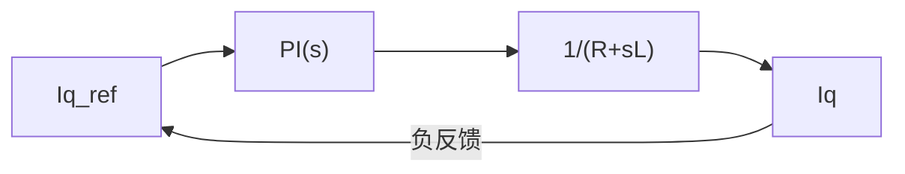

# CT-02: 时域响应分析

**副标题：从一阶系统时间常数到二阶系统超调量——时域指标如何指导电流环和速度环的PI整定**
**难度：** ★★★☆☆ 进阶级
**适用对象：** 电机控制工程师、控制系统设计者
**前置知识：** 传递函数、拉普拉斯反变换、开环/闭环系统概念

---

## 1. 📌 核心摘要

**一句话讲清楚**：时域响应分析回答的是「系统接到指令后，输出随时间如何变化」——对于电机控制，这直接对应「给定Iq阶跃后，实际Iq的上升时间、超调量和稳态误差」，是PI参数整定好坏的最终裁判。

**认知挂钩**：很多工程师对着示波器看电流阶跃响应波形，凭感觉调Kp和Ki。「再大一点就超调了」「这里还有静差，Ki再大点」——这些都是时域指标的直觉应用。本模块将这种直觉系统化，给出数学公式和定量指导。

**与FOC算法的关联**：
- 🔗 **电流环阶跃响应**：$t_r$（上升时间）、$M_p$（超调）、$t_s$（调节时间）是PI整定的直接目标
- 🔗 **速度环阶跃响应**：机械时间常数 $\tau_m = J/B$ 决定了速度环的自然响应速度
- 🔗 **电气vs机械时间常数**：$\tau_e = L_s/R_s$（通常1~10ms），$\tau_m$（通常10~500ms），决定了电流环可以比速度环快多少

---

## 2. 🤔 问题引入

### 工程师的真实困惑

**场景1：电流阶跃超调太大**
```
工程师A:"我给Iq从0阶跃到10A，示波器上看到超调到13A，持续2ms才回落..."
问题现象:
- 超调量约30%
- 有轻微振荡后稳定
- 想降低超调，但减小Kp后上升又太慢
```

**场景2：速度环响应太慢**
```
工程师B:"速度给定从1000rpm阶跃到2000rpm，要等500ms才稳定..."
问题现象:
- 速度缓慢爬升，无超调
- 加载后恢复时间>1秒
- 速度环PI不知道怎么调
```

**场景3：稳态误差无法消除**
```
工程师C:"电流环在负载变化后总有一个小偏差，调大Ki也没用..."
问题现象:
- 稳态误差约0.2A（给定10A时）
- 增大Ki导致震荡
- 不知道属于系统型别的问题还是增益不够
```

### 核心问题

这些问题都是**时域性能指标**的问题：
- 超调→闭环系统阻尼比 $\zeta$ 太小
- 响应慢→自然频率 $\omega_n$ 或带宽 $\omega_c$ 太小
- 稳态误差→系统型别（积分环节数量）不够或增益不足

### 学习目标

读完本模块，你将能够：
✅ **从阶跃响应波形反推系统参数**（$\zeta$, $\omega_n$, $\tau$）
✅ **计算一阶/二阶系统的所有时域指标**
✅ **理解电流环PI整定如何影响时域响应**
✅ **掌握机械时间常数与电气时间常数的关系**

---

## 3. 💡 直观理解

### 类比1：一阶系统 = 一杯热水冷却

**生活场景**：一杯100°C热水放在20°C室温中，温度按指数衰减。

```
T(t) = 20 + 80 × e^(-t/τ)
τ = 热时间常数（由水量、杯壁导热决定）
```

**电机对应**：电气一阶系统（RL电路），电流响应：

$$i(t) = I_{final} \cdot (1 - e^{-t/\tau_e}), \quad \tau_e = L_s/R_s$$

| 时刻 | RL电流响应 | 说明 |
|------|-----------|------|
| t = 0 | 0 | 电感阻碍电流突变 |
| t = τ | 63.2% | 一个时间常数后到达63.2% |
| t = 3τ | 95.0% | 接近稳态 |
| t = 4τ | 98.2% | 工程上认为已稳定(ts=4τ) |

### 类比2：二阶系统 = 弹簧-质量-阻尼

**生活场景**：汽车悬挂系统——过减速带时，车身会上下弹跳几次后才稳定。

三种情况：
- **欠阻尼**（$\zeta < 1$）：弹跳多次，超调大 → 类似Kp太大
- **临界阻尼**（$\zeta = 1$）：回正最快且无超调 → 最优
- **过阻尼**（$\zeta > 1$）：缓慢回正，无超调 → 类似Kp太小

**电机对应**：电流闭环（PI+RL）构成二阶系统：



**关键指标总结**：

| 指标 | 符号 | 一阶系统 | 二阶欠阻尼系统 |
|------|------|---------|---------------|
| 时间常数 | τ | τ=L/R | — |
| 自然频率 | ωn | — | ωn=√(Ki/L) |
| 阻尼比 | ζ | — | ζ=Kp/(2√(Ki·L)) |
| 上升时间 | tr | 2.2τ | ≈1.8/ωn |
| 峰值时间 | tp | — | π/(ωn√(1-ζ²)) |
| 超调量 | Mp | 0 | exp(-πζ/√(1-ζ²)) |
| 调节时间(2%) | ts | 4τ | 4/(ζωn) |
| 稳态误差 | ess | 有限（无积分） | 0（有积分） |

---

## 4. 🔬 技术原理

### 4.1 一阶系统阶跃响应

一阶系统标准形式：

$$G(s) = \frac{K}{1 + \tau s}$$

单位阶跃响应（$r(t)=1(t)$ → $R(s)=1/s$）：

$$Y(s) = \frac{K}{s(1+\tau s)} = K\left(\frac{1}{s} - \frac{1}{s+1/\tau}\right)$$

拉普拉斯反变换：

$$y(t) = K(1 - e^{-t/\tau}), \quad t \ge 0$$

**FOC电流环中的应用**：

当电流环闭环带宽 $\omega_c$ 设计好后，闭环系统近似为一阶：

$$G_{cl}(s) \approx \frac{1}{1 + s/\omega_c}$$

对应时间常数 $\tau_c = 1/\omega_c$。

**手推计算示例**：
```
电流环 ωc = 1500 rad/s
→ τ_c = 1/1500 = 0.667ms
→ 上升时间 tr ≈ 2.2τ_c = 1.47ms
→ 调节时间 ts ≈ 4τ_c = 2.67ms

这意味着：给定Iq阶跃后，实际Iq在1.5ms内到达90%，2.7ms内进入±2%误差带。
```

### 4.2 二阶系统阶跃响应

二阶系统标准形式：

$$G(s) = \frac{\omega_n^2}{s^2 + 2\zeta\omega_n s + \omega_n^2}$$

其中：
- $\omega_n$：自然频率（无阻尼振荡频率）
- $\zeta$：阻尼比

闭环极点：$s_{1,2} = -\zeta\omega_n \pm j\omega_n\sqrt{1-\zeta^2}$

#### 4.2.1 欠阻尼情况（$0 < \zeta < 1$）

阶跃响应：

$$y(t) = 1 - \frac{e^{-\zeta\omega_n t}}{\sqrt{1-\zeta^2}} \sin\left(\omega_n\sqrt{1-\zeta^2}\,t + \arccos\zeta\right)$$

**超调量**：

$$M_p = \exp\left(-\frac{\pi\zeta}{\sqrt{1-\zeta^2}}\right) \times 100\%$$

| ζ | Mp |
|---|-----|
| 0.2 | 52.7% |
| 0.4 | 25.4% |
| 0.6 | 9.5% |
| 0.7 | 4.6% |
| 0.8 | 1.5% |
| 1.0 | 0% |

**FOC工程建议**：电流环 $\zeta = 0.7 \sim 1.0$（$M_p \le 4.6\%$），速度环 $\zeta = 0.7 \sim 0.9$。

**峰值时间**：

$$t_p = \frac{\pi}{\omega_n\sqrt{1-\zeta^2}}$$

**调节时间（±2%误差带）**：

$$t_s \approx \frac{4}{\zeta\omega_n}$$

#### 4.2.2 FOC电流环二阶模型推导

电流环PI控制器 + 电机RL模型（忽略反电动势解耦后的残余耦合）：

开环传递函数：

$$L(s) = \left(K_p + \frac{K_i}{s}\right) \cdot \frac{1}{R_s + L_s s}$$

采用零极点对消 $(K_i/K_p = R_s/L_s)$：

$$L(s) = \frac{K_p}{L_s s} = \frac{\omega_c}{s}$$

闭环传递函数：

$$G_{cl}(s) = \frac{\omega_c/s}{1 + \omega_c/s} = \frac{\omega_c}{s + \omega_c}$$

这是一阶系统！$\tau = 1/\omega_c$。

**但如果零极点对消不完全**（$K_i/K_p \neq R_s/L_s$），闭环才是二阶的。

### 4.3 电气时间常数 vs 机械时间常数

**电气时间常数**：

$$\tau_e = \frac{L_s}{R_s}$$

典型值（中小功率PMSM）：

| 电机功率 | Ls (mH) | Rs (Ω) | τe (ms) |
|---------|---------|--------|---------|
| 100W | 2 | 2 | 1 |
| 1kW | 5 | 0.5 | 10 |
| 10kW | 1 | 0.05 | 20 |

**机械时间常数**：

$$\tau_m = \frac{J}{B}$$

其中 $J$ 为转动惯量（$kg \cdot m^2$），$B$ 为粘滞摩擦系数（$N \cdot m \cdot s$）。

典型值：
- 小惯量伺服电机：$\tau_m = 5 \sim 50$ ms
- 中惯量电机：$\tau_m = 50 \sim 500$ ms
- 大惯量系统（带负载）：$\tau_m$ 可达秒级

**关键结论**：$\tau_e \ll \tau_m$（通常10~100倍），这意味着电流变化比转速变化快得多，因此电流环可以比速度环快得多——这正是FOC级联控制可以工作的物理基础。

### 4.4 稳态误差分析

**终值定理**：

$$e_{ss} = \lim_{t \to \infty} e(t) = \lim_{s \to 0} sE(s)$$

对单位反馈系统，$E(s) = R(s) / (1 + L(s))$。

**阶跃输入** $R(s) = A/s$：

$$e_{ss} = \lim_{s \to 0} \frac{A}{1 + L(s)} = \frac{A}{1 + \lim_{s \to 0} L(s)}$$

若 $\lim_{s \to 0} L(s) = \infty$（含有至少一个积分器），则 $e_{ss} = 0$。

**FOC电流环**：PI控制器含有一个积分器 → 对阶跃给定，稳态误差 = 0 ✅

**负载扰动下的速度环稳态误差**：

$$e_{ss} = \frac{T_L}{K_i^{spd} \cdot K_t}$$

速度环PI的积分增益 $K_i^{spd}$ 决定了负载扰动的稳态误差。

---

## 5. 🔗 交叉视角

### 5.1 电流环PI整定的时域验证

**标准验证流程**：

```
1. 设定 Id=0, Iq_ref 从 0 阶跃到 1A（小信号）
2. 用示波器/数据记录Iq反馈波形
3. 测量时域指标:
   - tr (上升时间10%~90%)
   - Mp (超调百分比)
   - ts (进入±2%误差带的时间)
4. 判断:
   - tr过大 → Kp太小 → 带宽不足
   - Mp过大 → Kp太大或ζ太小 → 增加Ki降低ζ
   - ts过长 → ωn太小 → 同时增大Kp和Ki
   - 震荡不衰减 → ζ<0 → 系统不稳定
```

### 5.2 速度环时域响应——为什么有超调？

假设电流环足够快（$G_{cl}^{cur} \approx 1$），速度环开环：

$$L_{spd}(s) = \left(K_p^{spd} + \frac{K_i^{spd}}{s}\right) \cdot \frac{K_t}{Js + B}$$

当PI参数不匹配时，闭环为二阶欠阻尼系统，产生超调。

**速度环PI的一种简化整定**（对称最优法）：

$$K_p^{spd} = \frac{J}{K_t \cdot T_{spd}}, \quad K_i^{spd} = \frac{K_p^{spd}}{4T_{spd}}$$

其中 $T_{spd}$ 为速度环期望时间常数。

---

## 6. 🎯 工程案例

### 案例1：电流环超调30%的问题定位

**背景**：
```
电机：Ls=2mH, Rs=0.3Ω
PI参数：Kp=1.5, Ki=200
阶跃响应：Iq从0→5A，超调至6.5A(30%)超调，ts≈5ms
```

**诊断**：
计算零极点对消条件：
- $K_i/K_p = 200/1.5 = 133.3$
- $R_s/L_s = 0.3/0.002 = 150$

$133.3 \neq 150$ → 零极点未完全对消 → 闭环为二阶系统 → 超调。
实际等效 $\zeta \approx 0.6$ （计算略），$M_p \approx 9.5\%$ 的理论值与实测30%差异需排查解耦、饱和等额外因素。

**解决**：
- 方案A：修正 Ki=150×1.5=225，零极点精确对消，回退到一阶系统 → 超调<1%
- 方案B：若不能精确对消（DSP整数运算限制），接受二阶行为，调整Kp改变ζ

### 案例2：机械时间常数限制速度环最快响应

**背景**：
```
AGV驱动电机：J=0.02 kg·m², B=0.001, Kt=0.8 N·m/A
速度环期望：阶跃300→500rpm，ts<100ms
```

**分析**：
- $\tau_m = J/B = 20$ s（空载）
- 实际带负载后有效τm ≈ 200ms
- 速度环物理极限：最快响应受机械惯性限制
- 按 $t_s = 4/(\zeta \omega_n)$ 且 $\zeta=0.7$：需要 $\omega_n \ge 4/(0.7 \times 0.1) = 57$ rad/s
- PI参数计算：$K_p^{spd} = 2\zeta\omega_n J/K_t \approx 2 \times 0.7 \times 57 \times 0.02 / 0.8 = 2.0$

**结果**：阶跃响应 ts≈120ms（略超标），但已接近物理极限。要进一步加快，需增大电机功率或减小惯量。

### 案例3：电气时间常数决定电流环PI的设计起点

**一台不同功率等级的电机对比**：

| 参数 | 100W伺服 | 10kW工业电机 |
|------|---------|------------|
| Ls | 3mH | 0.8mH |
| Rs | 2.5Ω | 0.04Ω |
| τe | 1.2ms | 20ms |
| 电流环设计ωc | 3000 rad/s | 400 rad/s |
| tr（估算） | 0.73ms | 5.5ms |

**根本原因**：大功率电机 $\tau_e$ 更大（虽然Rs很小，但Ls/Rs比值很大），电流变化慢，电流环带宽受限于电频率和开关频率的折中。

---

## 7. 📝 实践练习

### 练习1：计算题——超调量与阻尼比

```
电流环闭环等效为二阶系统，测得阶跃响应：
- 超调量 Mp = 16%
- 峰值时间 tp = 2ms
求：阻尼比ζ和自然频率ωn

参考答案：
Mp=exp(-πζ/√(1-ζ²))=0.16 → ζ=0.5
tp=π/(ωn√(1-ζ²))=π/(ωn×0.866)=2ms → ωn=π/(0.002×0.866)=1814 rad/s
ts≈4/(ζωn)=4/(0.5×1814)=4.4ms
```

### 练习2：设计题——电流环PI整定到时域指标

```
电机：Ls=1.5mH, Rs=0.2Ω
要求：Iq阶跃响应 tr<1ms, Mp<5%
设计PI参数

参考答案：
Mp<5% → ζ>0.7，保守取ζ=0.8
零极点对消：Ki/Kp=Rs/Ls=0.2/0.0015=133.3
一阶系统tr=2.2τ_c<1ms→τ_c<0.455ms→ωc=1/τ_c>2200 rad/s
取ωc=2500 rad/s
Kp=Ls×ωc=1.5mH×2500=3.75
Ki=Rs×ωc=0.2×2500=500
```

### 练习3：诊断题——电气时间常数估计

```
你拿到一台未知参数的PMSM，只有直流电源和示波器。
如何测量τe=Ls/Rs？
给出步骤和注意事项。

参考答案：
步骤：施加直流电压Vdc到某一相，记录电流上升波形；
τe为电流到达63.2%稳态值的时间。
注意事项：转子需锁定（避免反电动势），电压不要太大（避免电流过大），
注意温度对Rs的影响。
```

---

## 8. 🚀 前沿拓展

### 8.1 基于时域响应的在线PI自整定

现代伺服驱动器可以在启动时自动注入阶跃信号，测量tr/Mp/ts，然后通过优化算法反推最优PI参数——无需人工干预。

### 8.2 非最小相位系统的时域特性

某些系统（如Boost变换器）存在右半平面零点，阶跃响应先反向再正向——在电机驱动中，数字控制的计算延迟等效为非最小相位行为（相位滞后），限制了可达带宽。

---

**文档信息**：
- 模块编号：CT-02
- 知识体系：控制理论基础
- 模块名称：时域响应分析
- 算法关联：电流环阶跃指标→PI验证、τe/τm→带宽层级设计