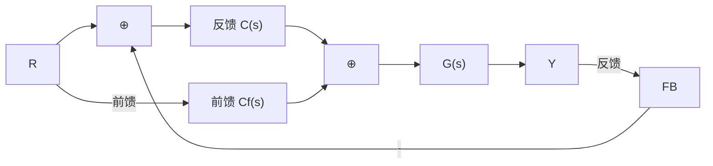
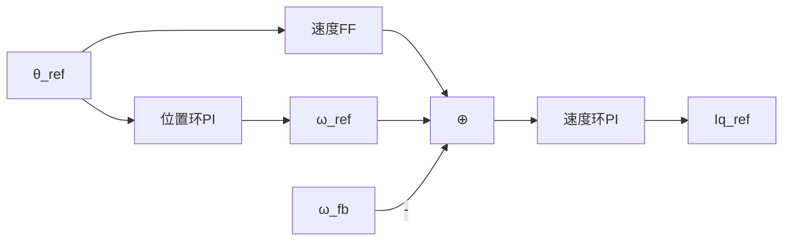
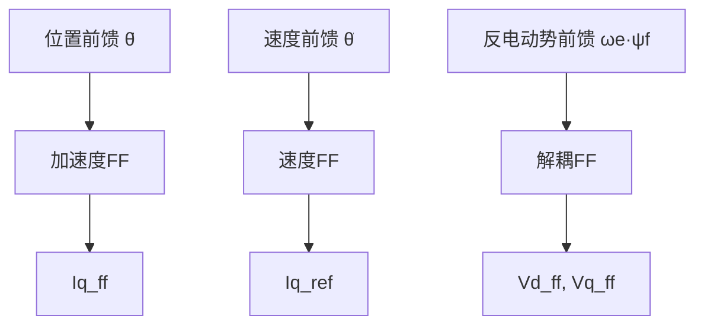

# CT-06: 前馈控制

**副标题：FOC反电动势解耦($V_d^{ff}=-\omega_e L_q I_q, V_q^{ff}=\omega_e(L_d I_d+\psi_f)$)就是前馈控制的经典应用——前馈不等待误差，直接根据模型预测补偿，把反馈从「主力」解放为「纠偏」
**难度：** ★★★★☆ 专业级
**适用对象：** 伺服控制工程师、电机算法开发者
**前置知识：** PID控制原理（CT-04）、伯德图与频率响应（CT-03）、dq坐标系电机模型

---

## 1. 📌 核心摘要

**一句话讲清楚**：前馈控制是「预见性」控制——根据被控对象的逆模型，从参考输入直接计算所需的控制量，不等误差产生就提前行动。在FOC中，反电动势解耦前馈（$V_d^{ff}=-\omega_e L_q I_q, V_q^{ff}=\omega_e(L_d I_d+\psi_f)$）是最经典的应用：它预测了转速引起的耦合电压，使PI只需处理剩余的动态误差和未建模部分，大幅提升了高速性能。

**认知挂钩**：很多工程师发现：电流环在低速调得完美，一到高速就发散。然后拼命调大Kp和Ki，结果震荡。根因是：**PI不知道转速升高后反电动势耦合变大了**。前馈直接把「转速×磁链」预置到输出电压中，PI只需要弥补前馈模型的微小偏差——这就是「前馈做粗调，反馈做微调」的分工。

**与FOC算法的关联**：
- 🔗 **反电动势解耦前馈**：$V_d^{ff} = -\omega_e L_q I_q$，$V_q^{ff} = \omega_e(L_d I_d + \psi_f)$——FOC的标准配置
- 🔗 **速度前馈**：在位置伺服中，速度前馈=$K_{vff} \times \dot{\theta}_{ref}$，使位置环的跟踪误差大幅减小
- 🔗 **加速度/转矩前馈**：$I_q^{ff} = J \times \ddot{\theta}_{ref} / K_t$，预测加速所需转矩

---

## 2. 🤔 问题引入

### 工程师的真实困惑

**场景1：低速OK，高速发散**
```
工程师A:"电流环在1000rpm以下完美，升到4000rpm后Id/Iq解耦完全失效，
     Id从0漂到3A，Iq也乱跳..."
问题现象:
- 低速：Id≈0, Iq跟踪精确
- 高速：Id出现直流偏移，PI怎么调都拉不回来
- 加了前馈解耦后问题消失
```

**场景2：位置跟随误差大**
```
工程师B:"伺服电机跟踪正弦位置指令，误差随频率升高越来越大..."
问题现象:
- 1Hz正弦跟踪误差<0.1°
- 10Hz跟踪误差>5°
- 增大Kp导致震荡，不增大Kp误差太大
```

**场景3：前馈参数不准反而更糟**
```
工程师C:"加了速度前馈后，反而有overshoot，不如不加..."
问题现象:
- 前馈增益Kvff=1.0（理论值）
- 实测速度常数与理论值偏差15%
- 前馈过补偿→反馈要反向纠正→震荡
```

### 核心问题

- 高速发散 → 反电动势耦合随ωe线性增长，PI带宽不够→必须前馈解耦
- 位置跟随误差 → 反馈有延迟（相位滞后），需要前馈提供相位超前
- 前馈反效果 → 前馈模型不准确时，前馈误差变成额外扰动

### 学习目标

读完本模块，你将能够：
✅ **理解前馈的数学本质**——逆模型 + 低通滤波
✅ **设计FOC的三级前馈**——反电动势解耦、速度前馈、加速度前馈
✅ **评估前馈对闭环稳定性的影响**——前馈不影响闭环极点
✅ **处理前馈参数不准的问题**——自适应前馈

---

## 3. 💡 直观理解

### 类比1：前馈 = 预判性驾驶

**生活场景**：看到前方红灯，提前松油门滑行，而不是到了跟前才猛踩刹车。

```
反馈驾驶（只有PI）：到了红灯跟前 → 误差大 → 猛踩刹车 → 乘客不舒服
前馈驾驶（PI+FF）：远远看到红灯 → 基于距离和速度预估 → 平滑减速 → 最后微调
```

**电机对应**：反电动势前馈 → 转速升高时提前在Vq中加上 $\omega_e \psi_f$ → PI不需要「发现Iq掉了再补」。

### 类比2：前馈不影响稳定性——前馈是开环的

这是前馈最反直觉也最重要的性质：



闭环传函：$T(s) = \frac{(C(s)+C_f(s))G(s)}{1+C(s)G(s)} = \frac{C_f(s)G(s)}{1+C(s)G(s)} + \frac{C(s)G(s)}{1+C(s)G(s)}$

**分母（极点）** 只取决于反馈控制器$C(s)$，前馈$C_f(s)$只出现在分子（零点）。因此：前馈不改变闭环稳定性！

---

## 4. 🔬 技术原理

### 4.1 前馈的数学形式

理想前馈控制器是被控对象的逆模型：

$$C_f(s) = G^{-1}(s)$$

若可实现，则 $Y(s) = R(s)$（完美跟踪）。

**但纯逆模型往往不可实现**（物理不可实现或放大噪声）：

$$G^{-1}(s) = R_s + L_s s \quad \text{（分子阶次>分母阶次 → 非因果 → 不可实现）}$$

**工程实现**：近似逆模型 + 低通滤波

$$C_f(s) = \frac{G^{-1}(s)}{(\tau_f s + 1)^n}$$

其中 $\tau_f$ 为滤波器时间常数，$n$ 使分子阶次 ≤ 分母阶次（因果性）。

### 4.2 FOC反电动势解耦前馈

dq坐标系电压方程：

$$
\begin{cases}
u_d = R_s i_d + L_d \frac{di_d}{dt} \underbrace{- \omega_e L_q i_q}_{\text{耦合项}} \\
u_q = R_s i_q + L_q \frac{di_q}{dt} \underbrace{+ \omega_e (L_d i_d + \psi_f)}_{\text{耦合项+反电动势}}
\end{cases}
$$

**前馈解耦项设计**：

$$\begin{cases}
u_d^{ff} = -\omega_e L_q i_q \\
u_q^{ff} = \omega_e (L_d i_d + \psi_f)
\end{cases}$$

加上前馈后，PI只需处理：

$$\begin{cases}
u_d^{PI} = R_s i_d + L_d \frac{di_d}{dt} \\
u_q^{PI} = R_s i_q + L_q \frac{di_q}{dt}
\end{cases}$$

**这就是解耦后的等效RL模型！**

### 4.3 速度前馈——位置伺服的核心

位置环控制结构：



速度前馈：$\omega_{ff} = K_{vff} \cdot \dot{\theta}_{ref}$

理想值：$K_{vff} = 1$（纯前馈=速度给定微分）

**效果分析**：
- 无前馈时跟踪误差：$e_{ss} = \frac{\dot{\theta}_{ref}}{K_v}$（$K_v$为速度误差常数）
- 有前馈时：若$K_{vff}=1$，$\dot{\theta}_{ref}$已被前馈完美预置，位置环PI只需克服摩擦等残余扰动→跟踪误差大幅减小

### 4.4 加速度/转矩前馈

$$\tau_{ff} = J \cdot \ddot{\theta}_{ref} + B \cdot \dot{\theta}_{ref}$$

$$I_q^{ff} = \tau_{ff} / K_t$$

**频域视角**：转矩前馈提供+180°相位超前（二阶微分），在高频跟踪中提供了反馈无法提供的相位。

---

## 5. 🔗 交叉视角

### 5.1 前馈参数灵敏度——不准怎么办？

**问题**：反电动势前馈中 $\hat{L}_q$ 与实际 $L_q$ 偏差20%。

**分析**：前馈残差 $\Delta u_d^{ff} = -\omega_e (L_q - \hat{L}_q) i_q$。

这个残差成为PI的「额外扰动」。PI在低频可通过积分器消除，但在高频（$\omega > \omega_c$）闭环增益不足→残差无法消除→动态跟踪误差。

**工程准则**：前馈参数偏差 < 20% 时，前馈仍有正面效果（前提是偏差不改变符号）。偏差 > 50% 时前馈可能有害。

**鲁棒方案**：自适应前馈——在线辨识 $L_q$，实时更新前馈系数。

### 5.2 前馈+反馈的分工

| | 前馈 | 反馈(PI) |
|------|------|---------|
| 作用 | 粗调，预置主要控制量 | 微调，消除残余误差 |
| 依赖 | 模型精度 | 误差信号 |
| 稳定性影响 | 无（不改变闭环极点） | 决定稳定性 |
| 响应速度 | 即时（无延迟） | 受带宽限制 |
| 对模型误差 | 敏感 | 鲁棒 |

### 5.3 级联前馈——FOC三层前馈结构



每层前馈分别补偿对应物理层面的已知动态，逐层减轻反馈控制器的负担。

### 5.4 hpm_MC 工程实践

**前馈控制** (`hpm_mcl_v2/core/control/hpm_mcl_hybrid_ctrl.h`):
- 混合控制律: τ = τ_ff + kp*(q_des-q) + kd*(dq_des-dq)
- 前馈力矩 τ_ff 来自路径规划的加速度输出：τ_ff = J · acc
- 前馈+反馈联合：前馈提高响应速度，反馈保证稳态精度

**d/q轴解耦前馈**: 编译宏 `HPM_MCL_ENABLE_DQ_AXIS_DECOUPLING` 使能
参考: [SDK-04-HPM-MC-v2-Hybrid-Ctrl.md](../algorithm/HPM-MC/SDK-04-HPM-MC-v2-Hybrid-Ctrl.md)

---

## 6. 🎯 工程案例

### 案例1：反电动势前馈拯救高速电流环

**背景**：
```
电机：P=4, ψf=0.12Wb, Lq=2mH, Rs=0.3Ω
电流环ωc=1500 rad/s (PI: Kp=3, Ki=450)
高速运行：6000rpm → ωe=4×2π×100=2513 rad/s
问题：Id漂移到+5A，Iq震荡
```

**分析**：
$\omega_e L_q i_q = 2513 \times 0.002 \times 10 = 50.3$V耦合到d轴
PI需产生-50.3V来抵消，但在ωc=1500处只有约12dB的环路增益→扰动的1/4可通过→d轴有明显耦合

**解决**：
加入前馈：$u_d^{ff} = -\omega_e L_q i_q$ → 耦合项直接被前馈抵消 → PI几乎不用出力 → Id归零 ✅

### 案例2：位置伺服速度前馈

**背景**：CNC加工，圆形轨迹跟踪（XY轴联动，半径5mm，速度100mm/s）。无前馈：圆度误差约±25μm；加速度前馈(Kvff=1.0)：圆度误差降至±8μm；进一步优化Kvff=0.95（考虑实际速度测量偏差5%）：圆度误差降至±5μm

### 案例3：齿槽转矩前馈补偿

**背景**：低速直驱转台，齿槽转矩导致速度波动±2%（约0.3rpm@15rpm）。通过离线测量齿槽转矩-位置关系→建立查找表→根据编码器位置前馈补偿Iq → 速度波动降至±0.3%

---

## 7. 📝 实践练习

### 练习1：计算题——反电动势前馈电压

```
电机：ψf=0.08Wb, Lq=2.5mH, Ld=2.0mH, P=5
工况：n=4500rpm, Id=-2A(弱磁), Iq=15A
计算前馈电压Vd_ff和Vq_ff

参考答案：
ωe=P×2π×4500/60=5×471.2=2356 rad/s
Vd_ff=-ωe×Lq×Iq=-2356×0.0025×15=-88.4V
Vq_ff=ωe×(Ld×Id+ψf)=2356×(0.002×(-2)+0.08)=2356×0.076=179.1V
```

### 练习2：设计题——速度前馈增益确定

```
位置伺服，编码器量化误差±1LSB(14位, 4096线→0.022°)，位置环Ts=1ms。
Kvff=1.0时速度前馈=Δθ/Ts，量化噪声被放大？
设计滤波器降低噪声同时保持前馈效果。
```

### 练习3：分析题——前馈参数偏差的影响

```
反电动势解耦Lq估计值=2.0mH, 实际值=2.5mH(+25%)
计算ωe=2000 rad/s, Iq=10A时的前馈残差
该残差对PI造成的负担
```

---

## 8. 🚀 前沿拓展

### 8.1 迭代学习控制（ILC）

对于重复性轨迹（如工业机器人），ILC利用前一周期误差修正当前周期的前馈信号→经过若干周期后实现近乎零误差跟踪。

### 8.2 基于神经网络的自适应前馈

训练小型神经网络（2~3层，可在MCU上推理）学习「转速+电流→最优前馈电压」映射，在电机参数未知或时变时替代固定公式前馈。

---

**文档信息**：
- 模块编号：CT-06
- 知识体系：控制理论基础
- 模块名称：前馈控制
- 算法关联：反电动势解耦前馈、速度/加速度前馈、齿槽转矩前馈
