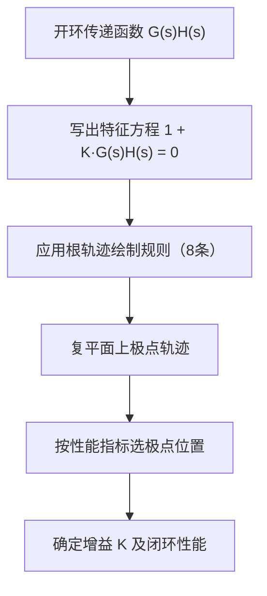
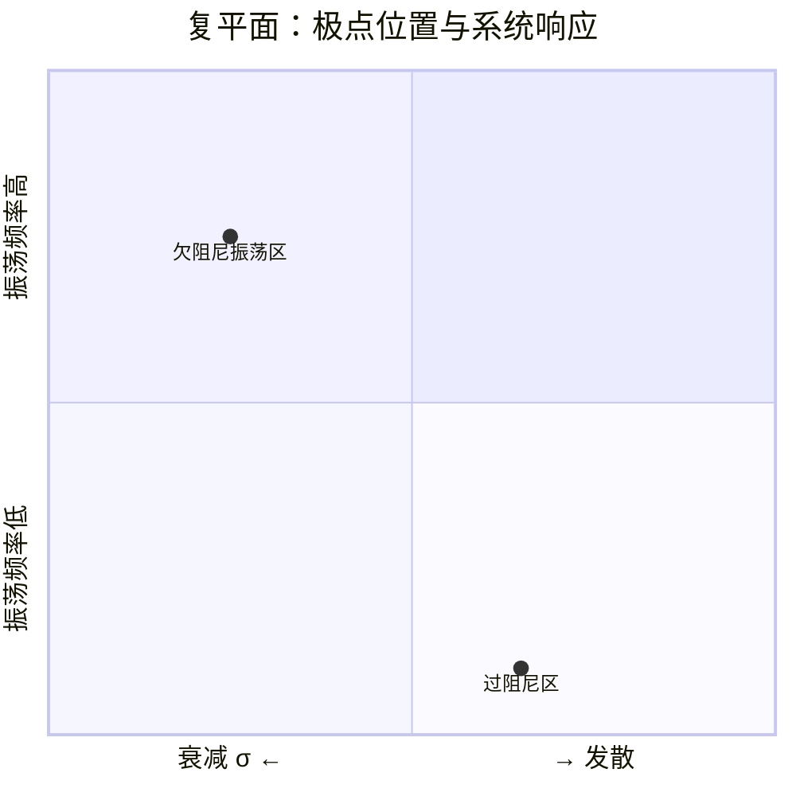

# CT-08: 根轨迹分析

**副标题：从极点运动看系统动态——闭环极点的迁移之路**
**难度：** ★★★★☆ 专业级
**适用对象：** 电机控制工程师、自动化工程师
**前置知识：** 传递函数与方框图、复变函数基础、PID控制基础

---

## 1. 📌 核心摘要

**一句话：** 根轨迹是闭环系统极点随增益变化的运动轨迹，通过观察极点位置可以直接判断系统的稳定性、响应速度和振荡特性——无需解高阶方程，仅凭几条画图规则就能把握全局动态。

**认知挂钩：** 如果Bode图是从频域"看"系统，那么根轨迹就是从复平面"看"系统。系统闭环极点在复平面上的位置直接决定了：
- 实部 → 衰减/发散速度
- 虚部 → 振荡频率
- 阻尼角 → 超调量

**核心流程：**


**根轨迹 vs Bode图 vs 时域响应：**
| 特性 | 根轨迹 | Bode图 | 时域响应 |
|------|--------|--------|---------|
| 分析域 | 复平面(s域) | 频域 | 时域 |
| 显示信息 | 极点位置、K变化 | 幅值/相位裕度 | 超调/调节时间 |
| 设计用途 | 极点配置、PID整定 | 相位补偿、滤波器设计 | 性能验证 |
| 电机应用 | 电流环Kp影响极点 | 电流环带宽设计 | 阶跃响应测试 |

---

## 2. 🤔 问题引入

**场景：** 你在调试一台PMSM的电流环PI控制器。初始参数 Kp=0.5, Ki=100，电流阶跃响应稳定但偏慢。你把 Kp 增大到 1.5，响应变快，但出现了明显的振荡。再增大到 3.0，系统直接发散——电流失控、过流保护触发。

**问题：** 为什么只是改变一个 Kp，系统的行为就从"稳定慢"变成"振荡"再到"发散"？有没有一种方法，可以在不实际测试的情况下，预测 Kp 变化对系统动态的影响？

**这就是根轨迹要回答的问题。**

考虑一个简化的电流环开环传递函数（忽略数字延迟）：

$$
G(s) = \frac{K_p s + K_i}{s} \cdot \frac{1}{Ls + R}
$$

闭环特征方程为：

$$
1 + G(s) = 0 \quad \Rightarrow \quad Ls^2 + (R + K_p)s + K_i = 0
$$

两个闭环极点随 Kp 如何变化？它们何时进入右半平面（不稳定）？何时成为共轭复根（振荡）？根轨迹分析能给你精确的答案。

---

## 3. 💡 直观理解

### 3.1 极点的物理意义

把复平面想象成一张"地形图"：

- **实轴（σ）**：代表衰减/发散。极点越靠左，衰减越快；极点靠右，响应慢；极点在右半平面，发散。
- **虚轴（jω）**：代表振荡。共轭极点离实轴越远，振荡频率越高。
- **阻尼角 θ（从负实轴量起）**：决定超调量。θ 越大，超调越大。



### 3.2 根轨迹的基本思想

**开环零点** → 吸引极点（"黑洞"）
**开环极点** → 排斥极点（起点）

随着增益 K 从 0 变化到 ∞，闭环极点从开环极点出发，向开环零点（或无穷远）运动。这条运动轨迹就是**根轨迹**。

类比：把开环极点看作"山脚"，开环零点看作"山顶"。增益 K 是"推力"。闭环极点像被推动的球，从山脚（K=0）向山顶（K→∞）滚动，留下一条轨迹。

### 3.3 电机案例的极坐标

以电流环为例，两个闭环极点 s₁, s₂ 随 Kp 变化：

- Kp=0：极点位于开环极点位置，靠近虚轴，响应极慢
- Kp 适中：极点向左移动，进入优良阻尼区（45°阻尼角），响应快且无振荡
- Kp 过大：极点进入低阻尼区，阻尼角超过60°，剧烈振荡
- Kp 临界的：极点触及虚轴，临界稳定
- Kp 超过临界值：极点进入右半平面，发散

---

## 4. 🔬 技术原理

### 4.1 根轨迹的数学定义

闭环传递函数为：

$$
T(s) = \frac{KG(s)}{1 + KG(s)H(s)}
$$

闭环极点满足特征方程：

$$
1 + KG(s)H(s) = 0
$$

即：

$$
KG(s)H(s) = -1 = 1 \angle (2k+1)\pi, \quad k = 0, 1, 2, ...
$$

这给出了两个条件：

**幅值条件：**

$$
|KG(s)H(s)| = 1
$$

**相角条件（根轨迹的核心条件）：**

$$
\angle G(s)H(s) = (2k+1)\pi = 180° + k \cdot 360°
$$

相角条件决定一个点是否在根轨迹上；幅值条件决定该点对应的增益 K。

### 4.2 根轨迹的八条绘制规则

**规则1（起点与终点）：** 根轨迹起始于开环极点（K=0），终止于开环零点（K→∞）。若零点数少于极点数，多余支路趋向无穷远。

**规则2（分支数）：** 等于开环极点数 n（或开环零点数 m 中的较大者）。

**规则3（实轴上的根轨迹）：** 实轴上某段属于根轨迹，当且仅当该段右侧的开环零极点总数为奇数。

**规则4（渐近线）：** n-m 条趋向无穷的支路沿渐近线方向：

$$
\theta_a = \frac{(2k+1)\pi}{n-m}, \quad k = 0, 1, ..., n-m-1
$$

渐近线与实轴交点：

$$
\sigma_a = \frac{\sum 极点 - \sum 零点}{n-m}
$$

**规则5（分离点/会合点）：** 满足：

$$
\sum_{i=1}^{n} \frac{1}{s - p_i} = \sum_{j=1}^{m} \frac{1}{s - z_j}
$$

**规则6（出射角与入射角）：** 从复极点出射的角度和进入复零点的角度，由相角条件求得。

**规则7（虚轴交点）：** 用 Routh 判据或令 s=jω 代入特征方程，解出 K 和 ω。

**规则8（对称性）：** 根轨迹关于实轴对称。

### 4.3 极点位置与系统性能的定量关系

对于二阶系统（或主导极点对）：

$$
G_{cl}(s) = \frac{\omega_n^2}{s^2 + 2\zeta\omega_n s + \omega_n^2}
$$

极点为：

$$
s_{1,2} = -\zeta\omega_n \pm j\omega_n\sqrt{1-\zeta^2} = -\sigma \pm j\omega_d
$$

| 性能指标 | 极点坐标公式 |
|---------|-------------|
| 阻尼比 | $\zeta = \cos\theta$，θ 为阻尼角 |
| 自然频率 | $\omega_n = \sqrt{\sigma^2 + \omega_d^2}$ |
| 超调量 | $PO = e^{-\pi\zeta/\sqrt{1-\zeta^2}} \times 100\%$ |
| 调节时间(2%) | $t_s \approx \frac{4}{\zeta\omega_n} = \frac{4}{\sigma}$ |
| 峰值时间 | $t_p = \frac{\pi}{\omega_d} = \frac{\pi}{\omega_n\sqrt{1-\zeta^2}}$ |

**关键结论：**
- 等 σ 线（垂直线）→ 等调节时间
- 等 ωd 线（水平线）→ 等振荡频率
- 等 ζ 线（从原点出发的射线）→ etc. 等超调量

### 4.4 电机电流环的根轨迹分析

**案例1：P控制电流环（无积分）**

开环传递函数：

$$
G_{ol}(s) = \frac{K_p}{Ls + R}
$$

闭环特征方程：

$$
Ls + R + K_p = 0 \quad \Rightarrow \quad s = -\frac{R + K_p}{L}
$$

只有一个实极点。Kp 增大 → 极点向左移动 → 响应变快。永远稳定。

**案例2：PI控制电流环**

开环传递函数：

$$
G_{ol}(s) = \frac{K_p s + K_i}{s} \cdot \frac{1}{Ls + R}
$$

闭环特征方程：

$$
Ls^2 + (R + K_p)s + K_i = 0
$$

这是一个二阶系统。极点：

$$
s_{1,2} = \frac{-(R+K_p) \pm \sqrt{(R+K_p)^2 - 4LK_i}}{2L}
$$

**分析Kp变化（Ki固定）：**

- $(R+K_p)^2 > 4LK_i$：两个不相等的负实根 → 过阻尼响应
- $(R+K_p)^2 = 4LK_i$：两个相等的负实根 → 临界阻尼
- $(R+K_p)^2 < 4LK_i$：共轭复根 → 欠阻尼振荡

根轨迹走向（Kp增大 → Ki固定 → 等效零点向左移动）：
从实轴上的两个极点出发，沿实轴相向而行，在某点会合后以共轭对形式离开实轴。

### 4.5 电机速度环的根轨迹分析

速度环开环传递函数（电流环简化为一阶）：

$$
G_{ol}(s) = \frac{K_{sp} s + K_{si}}{s} \cdot \frac{1}{\tau_c s + 1} \cdot \frac{K_t}{Js + B}
$$

其中 $\tau_c$ 为电流环等效时间常数。

这是一个三阶系统。根轨迹的典型形态：
- 三条支路从开环极点出发
- 一条终止于 PI 零点
- 两条趋向无穷远（沿 ±60° 和 180° 渐近线）

**关键观察：** 速度环的根轨迹存在一个"危险区域"——当增益过大时，共轭极点对向右移动，可能穿越虚轴导致不稳定。这与实际调试经验一致：速度环增益过大，电机会发出尖锐啸叫并振荡。

---

## 5. 🔗 交叉视角：根轨迹与电机控制的桥梁

### 5.1 电流环PI整定的根轨迹视角

**传统方法（零极点对消）：**

$$
\frac{K_i}{K_p} = \frac{R}{L}
$$

此时 PI 零点恰好对消电机极点（s = -R/L），闭环系统降为一阶。

**根轨迹视角：** 虽然零极点对消在数学上完美，但实际上电机参数（R, L）可能不准确或随时间变化——对消不完全，消不掉的零极点仍会形成根轨迹支路，产生残余动态。

**更稳健的方法：** 在根轨迹上选择一个对参数变化不敏感的极点区域（极点灵敏度分析）。通常选择阻尼比 ζ = 0.707 对应的极点位置，此时系统具有最快的无超调响应。

### 5.2 前馈解耦的根轨迹解释

FOC 中的前馈解耦项：

$$
u_d^{dec} = -\omega_e L_q i_q, \quad u_q^{dec} = \omega_e(L_d i_d + \psi_f)
$$

从根轨迹角度看：耦合项相当于在系统中引入了随 ωe 变化的"虚拟零点"，扰动根轨迹形态。随着转速升高，这些虚拟零点会改变闭环极点的位置，使系统从稳定变为振荡。

前馈解耦的实质：**用前馈消除这些随转速变化的虚拟零点/极点，使根轨迹形态不受转速影响。**

### 5.3 电流环带宽的根轨迹约束

在设计电流环带宽 ωc 时：

- ωc 过低 → 闭环极点靠近虚轴 → σ 小 → 调节时间长
- ωc 过高 → 闭环极点虚部大 → 接近数字控制的 Nyquist 频率 → 离散域不稳定

根轨迹上存在一个"最优极点区域"：实部足够大（快速响应），虚部不过大（避免与采样频率交互）。

---

## 6. 🎯 工程案例

### 案例1：电流环 Kp 整定的根轨迹法

**电机参数：** L = 0.8 mH, R = 0.15 Ω, Ki = 120（已固定）

**目标：** 通过根轨迹选择 Kp，使电流环阻尼比 ζ = 0.707。

**步骤：**

1. 写出特征方程：

$$
0.0008 s^2 + (0.15 + K_p)s + 120 = 0
$$

2. 写出极点公式：

$$
s_{1,2} = \frac{-(0.15+K_p) \pm \sqrt{(0.15+K_p)^2 - 0.384}}{0.0016}
$$

3. 约束 ζ = 0.707 → 极点位于45°阻尼角线上 → 实部 = 虚部：

$$
\frac{0.15+K_p}{0.0016} = \frac{\sqrt{0.384 - (0.15+K_p)^2}}{0.0016} \quad (\text{欠阻尼情形})
$$

4. 解出：$K_p \approx 0.47$

**验证：**
- Kp = 0.47 → 极点 s₁,₂ = -387.5 ± j387.5 → ζ = 0.707 → 超调约 4.3%，调节时间约 10.3 ms

如果直接用传统方法 Kp = L·ωc = 0.0008 · 1000 = 0.8：
- Kp = 0.8 → 极点 s₁,₂ = -593.75 ± j255.3 → ζ ≈ 0.92 → 无超调，但响应更保守

### 案例2：速度环临界稳定的根轨迹判定

**速度环参数：** Ksp = 0.05, Kt/J = 100, τc = 0.001 s

闭环特征方程（三阶）：

$$
s^3 + 1000s^2 + 5000s + 5000K_{si} = 0
$$

**Routh判据求临界 Ki：**

构造 Routh 表：
```
s³ | 1        5000
s² | 1000     5000·Ksi
s¹ | (5×10⁶ - 5000·Ksi)/1000
s⁰ | 5000·Ksi
```

稳定条件：

$$
5 \times 10^6 - 5000 K_{si} > 0 \quad \Rightarrow \quad K_{si} < 1000
$$

**根轨迹解释：** 当 Ksi 从0增大到1000时，一对共轭极点从实轴分离，向上移动，最终在 Ksi=1000 时穿越虚轴（s = ±jω），系统变为不稳定。

---

## 7. 📝 实践练习

### 练习1：电流环根轨迹手绘
给定电机参数 L=1mH, R=0.2Ω，PI 控制器参数 Ki=150。手绘 Kp 从 0 到 ∞ 变化的根轨迹。标出：
1. 开环极点位置
2. 开环零点位置
3. 分离点
4. ζ=0.707 对应的极点位置及 Kp 值

### 练习2：根轨迹 vs 实际调试
在你的 FOC 平台上，依次设置 Kp = 0.2, 0.5, 0.8, 1.2, 2.0（Ki 固定），记录每个 Kp 对应的电流阶跃响应波形。将实测的超调量、振荡频率与根轨迹预测值对比。

### 练习3：速度环根轨迹稳定性分析
对于速度环三阶系统，推导临界稳定时的 Ksp-Ksi 关系，并在 (Ksp, Ksi) 平面上画出稳定域。

---

## 8. 🚀 前沿拓展

### 8.1 离散域根轨迹（z平面）

DSP 实现的控制系统是离散的。离散域的特征方程为 $1 + K G(z) = 0$，根轨迹绘制在 z 平面上。稳定区域是单位圆内部（而非左半平面）。

电机控制中，当控制频率 fs 较低时，连续域设计（s平面）的根轨迹与离散域（z平面）的根轨迹可能显著不同——连续域稳定 ≠ 离散域稳定。这解释了为什么同样 PI 参数，20kHz PWM 下稳定而 8kHz 下振荡。

### 8.2 根轨迹与参数鲁棒性

**参数灵敏度：** 根轨迹上不同位置对参数变化的敏感度不同。通过计算极点对参数的偏导数 $\partial s / \partial p$，可以选择鲁棒性更好的极点位置。

对于电机控制：L 和 R 随温度和磁饱和变化。选择的闭环极点应对 L 和 R 的变化不敏感。

### 8.3 多参数根轨迹

传统根轨迹只有一个可变参数（增益 K）。现代根轨迹工具支持多参数变化（如同时改变 Kp 和 Ki），生成参数平面上的稳定域。

电机应用：在 (Kp, Ki) 平面上画出满足超调量 ≤ 10%、调节时间 ≤ 5ms、相位裕度 ≥ 45° 的可行域——这是真正的"安全参数区"。

### 8.4 根轨迹与自适应控制

在线识别电机参数变化 → 实时计算根轨迹 → 自动调整 PI 参数使闭环极点保持在最优位置。这是一种超越传统增益调度的"极点跟踪"自适应策略。

---

## 关键公式速查表

| 名称 | 公式 | 说明 |
|------|------|------|
| 特征方程 | $1 + KG(s)H(s) = 0$ | 闭环极点条件 |
| 相角条件 | $\angle G(s)H(s) = (2k+1)\pi$ | 判断点在轨迹上 |
| 渐近线角度 | $\theta_a = \frac{(2k+1)\pi}{n-m}$ | n-m条渐近线 |
| 渐近线交点 | $\sigma_a = \frac{\sum p_i - \sum z_j}{n-m}$ | 实轴交点 |
| 分离点方程 | $\sum\frac{1}{s-p_i} = \sum\frac{1}{s-z_j}$ | 求解分离/会合点 |
| 阻尼比与极点 | $\zeta = \cos(\arctan(\omega_d/\sigma))$ | 极点阻尼角 |
| 超调量 | $PO = e^{-\pi\zeta/\sqrt{1-\zeta^2}}$ | ζ→超调 |
| 调节时间 | $t_s = 4/(\zeta\omega_n)$ | 2%准则 |