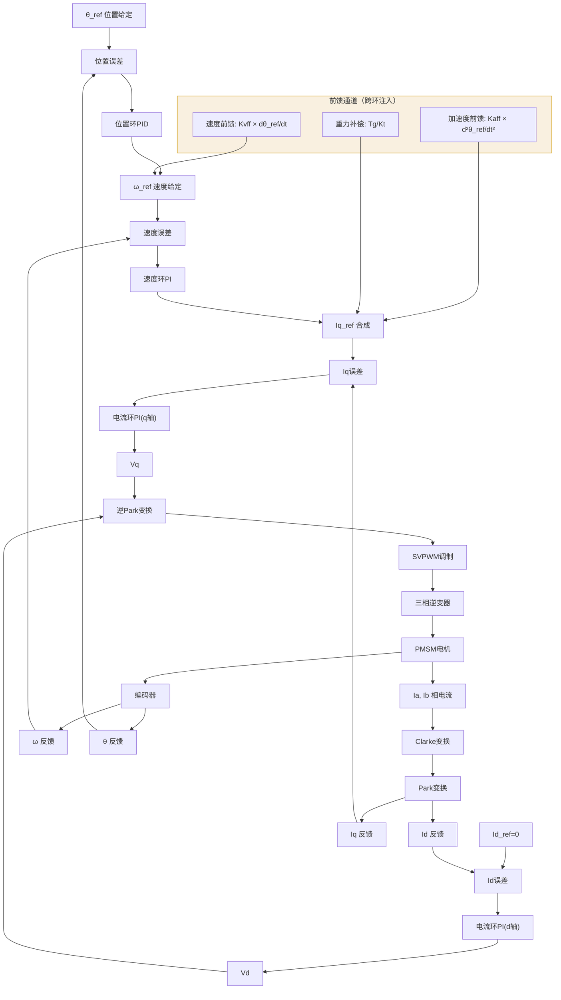
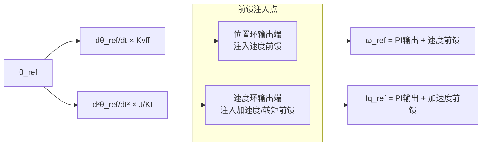

# CT-14: 三环级联PID控制

**副标题：从电流环→速度环→位置环的逐层嵌套，到10:3:1带宽分配法则的数学推导——三环级联是伺服驱动「分层解耦」思想的工程巅峰**
**难度：** ★★★★☆ 专业级
**适用对象：** 电机控制工程师、伺服驱动调试工程师
**前置知识：** PID原理（CT-04）、PID整定（CT-05）、频域分析（CT-03）、传递函数（CT-02）

---

## 1. 📌 核心摘要

**一句话讲清楚**：三环级联PID控制是将伺服系统分解为电流环（最内层、最快）、速度环（中间层）和位置环（最外层、最慢）的嵌套控制架构——每一层外环的输出作为下一层内环的给定，利用「内环远快于外环」的频带分离原则（典型10:3:1），将复杂的高阶系统逐层降阶为可独立整定的低阶子系统。

**认知挂钩**：初学FOC时往往以为「调好电流环PI就完事了」，但实际做伺服产品时——位置指令一给，电机要么过冲震荡，要么响应慢得像老牛拉车。为什么？因为**三环不是三个独立PI堆在一起就行，带宽分配错了，外环的相位滞后会穿过整个级联链，在最内环引发振荡**。10:3:1不是拍脑袋的经验值，是保证每层至少有45°相位裕度的必然推导。

**与FOC算法的关联**：
- 🔗 **三环级联是FOC伺服系统的标准控制架构**：位置环输出速度给定→速度环输出Iq给定→电流环输出Vd/Vq→SVPWM
- 🔗 **带宽分离保证内环可近似为单位增益**：电流环闭环带宽1000~2000 rad/s，在速度环（100~300 rad/s）频段内可视为「1」，极大简化速度环整定
- 🔗 **前馈通路跨环注入**：速度前馈直接注入速度环输出端，加速度前馈直接注入电流环给定端，绕过外层PI的延迟，实现「零相位误差跟踪」

---

## 2. 🤔 问题引入

### 工程师的真实困惑

**场景1：位置环调大Kp后电机尖叫**
```
工程师A："位置环跟踪误差有点大，我把Kp从50调到200，
       结果电机开始高频啸叫，电流波形抖得像心电图..."
问题现象:
- Kp=50时位置跟踪平稳但误差±2°
- Kp调到200后电机发出~800Hz啸叫
- 示波器看Iq波形有等幅振荡
- 降到Kp=120啸叫消失但误差没改善
根因：位置环Kp过大→速度给定剧烈波动→速度环跟踪→
      电流环Iq_ref快速交变→机械谐振被激发
```

**场景2：三环联调时「按下葫芦浮起瓢」**
```
工程师B："我先单独调好了电流环（阶跃响应完美），
       然后调速度环（也完美），最后加上位置环——
       速度环开始超调了！位置环还震荡..."
问题现象:
- 电流环单独：tr=1ms, Mp=0, 带宽1500 rad/s
- 速度环单独：tr=8ms, Mp=3%, 带宽200 rad/s
- 加位置环后：速度环Mp变成15%，位置环有~50Hz震荡
根因：位置环带宽50 rad/s太接近速度环200 rad/s，
      未满足「外环≤内环1/3」的带宽分离条件
```

**场景3：模式切换时电机「抽风」**
```
工程师C："从速度模式切到位置模式，电机先猛地冲一下再回来..."
问题现象:
- 速度模式稳定运行时无异常
- 切换到位置模式的瞬间：电机突然加速（~200ms），然后拉回
- Iq波形显示：切换瞬间有一个大的电流脉冲（接近限幅值）
根因：切换瞬间位置环积分器从零开始累积，
      而位置误差此时不为零→积分输出跳跃→速度给定阶跃
      →无bumpless transfer保护
```

### 核心问题

- 三环带宽怎么分配？→ 10:3:1法则的频域推导与工程约束
- 内环非理想（延迟+有限带宽）对外环有何影响？→ 等效降阶与相位损失定量分析
- 级联结构下的积分饱和如何处理？→ 逐层anti-windup + 跨环back-calculation
- 前馈如何正确注入三环？→ 速度前馈、加速度前馈、重力补偿前馈的注入点与增益计算

### 学习目标

读完本模块，你将能够：
✅ **画出三环级联结构框图**，清晰标注每个环的输入/输出和前馈注入点
✅ **运用10:3:1法则分配三环带宽**，理解其频域推导过程
✅ **完成伺服电机三环完整调参流程**：电流环→速度环→位置环，每步有验证方法
✅ **设计级联结构的anti-windup和bumpless transfer策略**
✅ **正确设计和注入前馈项**：速度前馈、加速度前馈、重力补偿

---

## 3. 💡 直观理解

### 三环级联：接力赛跑的分层分工

**生活场景**：想象一个三级接力控制系统——
- **位置环**（最外层）：导航员，告诉你「去前面500米那个红绿灯路口」（位置指令），他不关心你怎么加速怎么转弯
- **速度环**（中间层）：司机，根据导航指令决定「现在开到60km/h」（速度指令），他不关心油门踩多少
- **电流环**（最内层）：油门执行器，司机说要加速就多喷油（电流指令），他只负责精确控制喷油量

每一层只向下层发指令，不越级指挥；每一层只对直接上层负责，不感知更外层的存在。

**电机对应**：
- 位置环输出 → 速度环给定（$\omega_{ref}$）
- 速度环输出 → 电流环给定（$I_{q\_ref}$）
- 电流环输出 → PWM占空比（$V_q$）

### 带宽分配：快刀斩乱麻

**生活场景**：公司三级审批流程——
- 部门经理（电流环）：日常决策，1小时内拍板
- 总监（速度环）：周度决策，半天内批复
- VP（位置环）：战略决策，3天内给出方向

如果VP要求所有审批都1小时内完成（带宽不分离），整个公司就乱套了——VP没时间思考战略，部门经理也受不了VP的微观管理。**分层的前提是「上层决策节奏远慢于下层执行节奏」**。

**电机对应**：
- 电流环带宽 1000~2000 rad/s → 响应时间 ~1ms
- 速度环带宽 100~300 rad/s → 响应时间 ~10ms
- 位置环带宽 30~100 rad/s → 响应时间 ~30ms
- 差一个数量级 → 下层对上层「透明」

### 前馈解耦：未卜先知的补偿

**生活场景**：开车上坡——
- 反馈控制：等车速下降了，脚才踩深油门（滞后！）
- 前馈控制：看到坡来了，提前踩深油门（预见！）
- 两者结合：前馈预估坡度需要的油门量，反馈微调消除偏差

**电机对应**：
- 速度前馈：知道位置要变化多快，提前给速度环一个「偏置」，PI只需要修正偏差
- 加速度前馈：知道要加速了，直接把加速所需的转矩（$I_q$）预注入电流环
- 重力补偿：垂直轴伺服，始终给一个抵消重力的偏置电流，PI不需要「扛着」重力

---

## 4. 🔬 技术原理

### 4.1 三环级联结构总览

伺服系统三环级联控制架构的完整信号流：



**三环职责速查表**：

| 环路 | 控制周期 | 带宽范围 | 输入 | 输出 | 被控对象模型 |
|------|---------|---------|------|------|------------|
| 电流环（内） | $T_{PWM}$ (62.5μs @16kHz) | 1000~2000 rad/s | $I_{dq\_ref}$ | $V_{dq}$ | $G_c(s)=\frac{1}{R_s+L_s s}$ |
| 速度环（中） | $10T_{PWM}$ (625μs) | 100~300 rad/s | $\omega_{ref}$ | $I_{q\_ref}$ | $G_s(s)=\frac{K_t}{Js+B}$ |
| 位置环（外） | $20\sim50T_{PWM}$ (1.25~3ms) | 30~100 rad/s | $\theta_{ref}$ | $\omega_{ref}$ | $G_p(s)=\frac{1}{s}G_s^{cl}(s)$ |

### 4.2 电流环PI设计回顾

电流环是三环的「地基」，必须最先整定且要求最高。详细推导见CT-04，此处仅回顾关键结论并补充级联视角的离散化实现细节。

**电机dq轴电气模型**：

$$G_c(s) = \frac{1}{R_s + L_s s} = \frac{1/R_s}{1 + \frac{L_s}{R_s}s}$$

**零极点对消PI设计**：

$$K_p = L_s \cdot \omega_c^c,\quad K_i = R_s \cdot \omega_c^c$$

其中 $\omega_c^c$ 为电流环期望穿越频率（同时也是闭环带宽，因为对消后一阶系统）。验证条件：

$$\frac{K_i}{K_p} = \frac{R_s}{L_s}$$

**对消后开环传递函数**：

$$L_c(s) = \frac{\omega_c^c}{s}$$

闭环传递函数（一阶低通）：

$$G_c^{cl}(s) = \frac{\omega_c^c}{s + \omega_c^c}$$

**级联视角的关键约束**：$\omega_c^c$ 受限于：
- PWM频率：$\omega_c^c \leq \omega_{PWM}/10$（16kHz PWM → $\omega_c^c \leq 10000$ rad/s）
- 电流采样延迟：含ADC转换+计算延迟≈$1.5T_{PWM}$，引入相位损失 $\phi_{loss} \approx -1.5\omega_c^c T_{PWM}$
- 工程推荐：$\omega_c^c = 1000\sim2000$ rad/s @ 16kHz PWM

**并联型PI离散化实现（后向欧拉，带anti-windup）**：

```c
typedef struct {
    float Kp, Ki;
    float Ts;
    float integral;
    float out_max, out_min;
} PI_Controller;

float PI_Current_Update(PI_Controller *pi, float ref, float fb) {
    float error = ref - fb;
    pi->integral += pi->Ki * pi->Ts * error;
    float output = pi->Kp * error + pi->integral;
    float output_sat = output;
    if (output > pi->out_max) output_sat = pi->out_max;
    if (output < pi->out_min) output_sat = pi->out_min;
    pi->integral += (output_sat - output) * pi->Kp * 0.5f;
    return output_sat;
}
```

### 4.3 速度环PI/PID设计

速度环是最容易出现「带宽分配错误」的地方，因为它的被控对象包含电流环闭环动态。

**被控对象完整模型**：

从 $I_{q\_ref}$ 到 $\omega$ 的传递函数：

$$G_s(s) = \underbrace{G_c^{cl}(s)}_{\text{电流环闭环}} \times \frac{K_t}{Js + B} \approx \frac{\omega_c^c}{s + \omega_c^c} \cdot \frac{K_t}{Js + B}$$

当 $\omega \ll \omega_c^c$（带宽分离成立时），$G_c^{cl}(s) \approx 1$，简化为：

$$G_s(s) \approx \frac{K_t}{Js + B}$$

忽略 $B$（$B \ll K_t / \omega$ 在大多数工况下成立），进一步简化为纯积分型：

$$G_s(s) \approx \frac{K_t}{Js}$$

**PI参数整定——对称最优法（Symmetrical Optimum）**：

对于纯积分被控对象 $\frac{K_t}{Js}$，使用对称最优法：

$$K_p^s = \frac{J \cdot \omega_c^s}{K_t}, \quad K_i^s = \frac{J \cdot (\omega_c^s)^2}{a^2 \cdot K_t}$$

其中 $a = 2\sim4$（推荐 $a=2$ 时相角裕度最大），$\omega_c^s$ 为速度环穿越频率。

$a=2$ 时 SO法的开环传递函数：

$$L_s(s) = \frac{\omega_c^s(s + \omega_c^s/4)}{s^2}$$

相角裕度 $PM \approx 36^\circ$，阶跃响应超调约43%。需要在速度给定通道加前置滤波器：

$$F(s) = \frac{1}{1 + 4s/\omega_c^s}$$

以消除闭环零点引起的超调。

**J和B的辨识**（速度环整定的前提）：

加减速法辨识 $J$：
$$J = \frac{K_t \cdot I_q}{\Delta\omega / \Delta t}$$

辨识步骤：空载下施加恒定 $I_q = I_{acc}$，记录 $\omega$ 从 $\omega_1$ 到 $\omega_2$ 的时间 $\Delta t$，计算 $\alpha = (\omega_2-\omega_1)/\Delta t$。

B可通过稳态摩擦测试：$B = K_t \cdot I_q / \omega_{ss}$（稳态速度对应的电流）。

**何时需要速度环加D？**

速度环的机械模型是一阶的（含 $J$ 和 $B$），PI理论上足够。但以下场景需要D：
- 柔性联轴器导致机械谐振频率接近速度环带宽 → D提供额外阻尼
- 大惯量比负载（$J_{load}/J_{motor} > 10$）→ D抑制过冲
- 位置环要求速度内环超调为零 → D使速度闭环等效为过阻尼二阶系统

带D时的速度环PID参数：
$$K_p^s = \frac{J \cdot \omega_c^s}{K_t},\quad K_i^s = \frac{B \cdot \omega_c^s}{K_t},\quad K_d^s = \frac{J}{K_t} \cdot \left(\frac{\omega_c^s}{N}\right)$$

其中 $N=5\sim10$ 为D项滤波系数。

### 4.4 位置环PID设计

位置环与电流环/速度环有本质区别：它的被控对象是**积分串联型**（速度积分=位置），天然含有一个积分器。

**被控对象模型**：

$$G_p(s) = \frac{1}{s} \cdot \underbrace{G_s^{cl}(s)}_{\text{速度环闭环}}$$

当速度环闭环可近似为一阶低通 $\frac{\omega_c^s}{s+\omega_c^s}$ 时：

$$G_p(s) \approx \frac{1}{s} \cdot \frac{\omega_c^s}{s + \omega_c^s}$$

**积分型被控对象的特性分析**：

被控对象已含一个积分器（$\frac{1}{s}$），若位置控制器再含积分器（PI），则开环含两个积分器（II型系统），存在稳定性风险：
- 两个积分器意味着低频相位直接从-180°起步
- 必须依赖零点和极点精心布局才能获得足够相位裕度

**工程实践**：位置环常用P或PD（不用I）——因为被控对象本身是积分型的，稳态时位置误差为零并不需要额外的积分器（除非存在常值扰动如重力偏置）。

**位置环P控制器**（最简单有效）：

$$C_p(s) = K_p^p$$

开环：$L_p(s) = \frac{K_p^p \cdot \omega_c^s}{s(s+\omega_c^s)}$，II型系统，静态位置误差为零。

穿越频率：$\omega_c^p \approx \sqrt{K_p^p \cdot \omega_c^s}$（当 $\omega_c^p \ll \omega_c^s$ 时）

由此反算 $K_p^p$：
$$K_p^p = \frac{(\omega_c^p)^2}{\omega_c^s}$$

**位置环加D的必要性**：

位置环P控制虽然静态精度好，但阶跃响应有明显超调（典型20~30%），且对负载扰动（突加转矩导致速度瞬时跌落→位置累积误差）恢复较慢。增加D项：
- D提供「刹车」效果：位置接近目标时，$de/dt$（即速度）为负→D项产生反向速度指令→提前减速
- D将二阶闭环改造为可独立配置阻尼比的系统

**位置环PD参数**：

$$K_p^p = \frac{(\omega_c^p)^2}{\omega_c^s}, \quad K_d^p = 2\zeta\sqrt{\frac{K_p^p}{\omega_c^s}} - \frac{1}{\omega_c^s}$$

其中 $\zeta$ 为期望阻尼比（推荐0.7~1.0）。

**Tustin离散化**（D项必须用Tustin，不可用后向欧拉）：

$$D(z) = K_d^p \cdot \frac{2}{T_s} \cdot \frac{z-1}{z+1}$$

差分方程：$u_d[k] = -u_d[k-1] + \frac{2K_d^p}{T_s}(e[k] - e[k-1])$

带低通滤波的D项（工程必须）：

$$D_{real}(z) = K_d^p \cdot \frac{\frac{2}{T_s}(z-1)}{z+1 + \frac{2\tau_f}{T_s}(z-1)}$$

其中 $\tau_f = \frac{K_d^p}{N \cdot K_p^p}$，$N=5\sim10$。

### 4.5 三环带宽分配原则与稳定性分析

这是三环级联控制最重要的设计准则——**10:3:1法则**。

**法则表述**：

$$\omega_c^c : \omega_c^s : \omega_c^p \approx 10 : 3 : 1$$

即：电流环带宽 ~ 速度环带宽的3~5倍，速度环带宽 ~ 位置环带宽的3~5倍。

**频域推导**：

从内到外分析相位损失。设电流环闭环为一阶低通：

$$G_c^{cl}(s) = \frac{\omega_c^c}{s + \omega_c^c}$$

在速度环穿越频率 $\omega_c^s$ 处，电流环引入的相位滞后为：

$$\phi_{loss}^{c\to s} = -\arctan\left(\frac{\omega_c^s}{\omega_c^c}\right)$$

| $\omega_c^s/\omega_c^c$ | $\phi_{loss}$ | 速度环PM损失 |
|--------------------------|---------------|-------------|
| 1/3 ≈ 0.33              | -18.4°        | 可接受      |
| 1/5 = 0.20              | -11.3°        | 轻微        |
| 1/10 = 0.10             | -5.7°         | 可忽略      |

速度环闭环在位置环穿越频率 $\omega_c^p$ 处引入的相位损失同理。

**保守设计**（$\omega_c^c : \omega_c^s : \omega_c^p = 10 : 2 : 1$）：
- 速度环损失约11°，位置环损失约11°，总计约22°——PM充足
- 代价：位置环响应较慢

**激进设计**（$\omega_c^c : \omega_c^s : \omega_c^p = 5 : 2 : 1$）：
- 速度环损失约21.8°，位置环损失约26.6°，总计约48.4°——PM危险
- 仅在电流环PM>65°且无机械谐振时可行

**10:3:1的数学最优性**：
- 当 $\omega_c^s/\omega_c^c = 0.3$ 时，电流环近似为单位增益误差 $< 5\%$
- 当 $\omega_c^p/\omega_c^s = 0.33$ 时，速度环近似为单位增益误差 $< 5\%$
- 每层仅损失约18°相位裕度，三层总损失约36°——在可接受范围
- 若要求更低相位损失，可改为 $15:3:1$（电流环带宽提高到速度环的5倍）

**内环非理想对外环影响的定量分析**：

若不满足带宽分离条件（如 $\omega_c^s = 0.6\omega_c^c$）：
1. 电流环在速度环频段不再近似为1 → 速度环看到的被控对象不是纯 $K_t/Js$
2. 速度环整定的PI参数基于错误模型 → 实际PM远低于设计值
3. 闭环极点右移 → 超调增大甚至不稳定

**数值示例**：$\omega_c^c = 1500$ rad/s，$\omega_c^s = 900$ rad/s（不满足分离条件）：
- 电流环在900 rad/s处的幅度 $|G_c^{cl}(j900)| = 1500/\sqrt{1500^2+900^2} = 0.857$
- 相位滞后 $\arctan(900/1500) = 31°$
- 速度环PI整定时把被控对象当成 $K_t/Js$（实际是 $0.857\angle{-31°} \cdot K_t/Js$）
- 实际PM比设计值低约31°→极易震荡！

### 4.6 前馈解耦策略

级联结构中，前馈的核心价值是「跨环注入」——绕过外层PI的延迟，直接将预测控制量注入内环。



**（1）速度前馈**：

注入点：位置环输出端（速度给定节点）

$$V_{ff} = K_{vff} \cdot \dot{\theta}_{ref}$$

其中 $K_{vff}$ 为速度前馈增益，理想值=1（意味「位置指令变化多快，速度给定就是多少」）。

物理含义：如果位置指令以100 rad/s变化，速度前馈直接给速度环100 rad/s的给定，位置环PI只需修正微小跟踪误差——PI的负担降低90%以上。

工程调参：$K_{vff}$ 从0.6起步，观察跟踪误差，逐步增大到0.9~1.1。过大（>1.2）会导致速度超调。

**（2）加速度/转矩前馈**：

注入点：速度环输出端（Iq给定节点）

$$I_{q\_ff} = \frac{J}{K_t} \cdot \ddot{\theta}_{ref}$$

物理含义：提前计算加速所需的电磁转矩，直接注入电流环给定，绕过速度环PI的延迟。

**（3）重力补偿前馈**（垂直轴伺服必备）：

$$I_{q\_grav} = \frac{T_g}{K_t} = \frac{m \cdot g \cdot L}{K_t}$$

其中 $m$ 为负载质量，$L$ 为力臂长度，$T_g$ 为重力转矩。

重力补偿是持续偏置，不是瞬态前馈——它替代了PI中积分器的「扛重力」角色，使积分器仅需处理动态误差。

**（4）前馈参数的鲁棒性**：

前馈依赖模型参数（$J$, $K_t$, $K_{vff}$），参数不准时：

| 参数误差 | 对前馈的影响 | 后果 |
|---------|------------|------|
| $J$ 偏大20% | 加速度前馈偏大20% | 加速时电流超调，但PI可拉回 |
| $J$ 偏小30% | 加速度前馈偏小30% | 加速时电流不足，PI补充→动态滞后 |
| $K_{vff}$ 偏大 | 速度前馈过补偿 | 位置超调→PI产生反向输出对抗 |
| $K_{vff}$ 偏小 | 速度前馈欠补偿 | 跟踪误差增大，PI负担加重 |

**关键结论**：前馈参数误差30%以内，系统仍稳定（PI回路兜底）。前馈的作用是「帮PI减负」，不是「取代PI」。

### 4.7 工程案例：伺服电机三环调参完整流程

以下给出从零开始的完整三环调参流程，每一步都有验证方法和验收标准。

**电机参数**：$L_s=2$mH, $R_s=0.5\Omega$, $K_t=0.12$ Nm/A, $J=1.5\times10^{-5}$ kg·m², $P=4$ 对极, PWM=16kHz。

**第一步：电流环整定**

目标：$\omega_c^c = 1500$ rad/s

计算：
$$K_p^c = 0.002 \times 1500 = 3.0$$
$$K_i^c = 0.5 \times 1500 = 750$$
验证零极点对消：$K_i^c/K_p^c = 750/3.0 = 250 = R_s/L_s = 0.5/0.002 = 250$ ✓

验证方法：施加 $I_q$ 阶跃（0→5A，电机锁定转子），示波器抓取 $I_q$ 响应波形。
- 验收标准：$t_r < 1.5$ms（$2.2/\omega_c^c$），$M_p=0\%$，稳态误差 $<1\%$

**第二步：速度环整定**

目标：$\omega_c^s = 200$ rad/s（满足 $200 < 1500/5 = 300$ ✓）

计算（SO法，$a=2$）：
$$K_p^s = \frac{1.5\times10^{-5} \times 200}{0.12} = 0.025$$
$$K_i^s = \frac{1.5\times10^{-5} \times 200^2}{4 \times 0.12} = 1.25$$

前滤波器：$F(s) = \frac{1}{1 + 4s/200} = \frac{1}{1 + 0.02s}$（离散化：$F(z)=\frac{1-e^{-50T_s}}{z-e^{-50T_s}}$）

验证方法：施加 $\omega$ 阶跃（0→1000 rpm），观察速度响应波形。
- 验收标准：$t_r < 15$ms，$M_p < 5\%$（有前置滤波），稳态波动 $< \pm 2$ rpm

**第三步：位置环整定**

目标：$\omega_c^p = 50$ rad/s（满足 $50 < 200/3 = 66.7$ ✓）

计算（P控制）：
$$K_p^p = \frac{50^2}{200} = 12.5$$

验证方法：施加位置阶跃（0→1 rad），观察位置响应和速度波形。
- 验收标准：$t_r < 50$ms，$M_p < 15\%$，稳态误差 $< 0.001$ rad

**第四步：前馈设计与联合调试**

速度前馈：$K_{vff}=0.9$（从0.6起步，微调到跟踪误差最小）
加速度前馈：$I_{q\_ff} = \frac{J}{K_t}\ddot{\theta}_{ref} = 1.25\times10^{-4} \cdot \ddot{\theta}_{ref}$

施加正弦位置指令（$\theta_{ref}=0.5\sin(2\pi\cdot 2t)$ rad），观察跟踪误差。
- 无前馈：峰值跟踪误差 ≈ 0.08 rad
- 加前馈后：峰值跟踪误差 ≈ 0.01 rad（提升8倍）

**三环完整参数总结**：

| 参数 | 值 | 单位 |
|------|-----|------|
| $K_p^c$ | 3.0 | V/A |
| $K_i^c$ | 750 | V/(A·s) |
| $K_p^s$ | 0.025 | A/(rad/s) |
| $K_i^s$ | 1.25 | A/(rad) |
| $K_p^p$ | 12.5 | (rad/s)/rad |
| $K_{vff}$ | 0.9 | - |

---

## 5. 🔗 交叉视角

### 5.1 与CT-04（PID原理）的关系

CT-04建立了P/I/D各自的物理含义和电流环PI的零极点对消设计方法。CT-14将单个PI扩展到三层级联：**CT-04教你怎么设计一个PI，CT-14教你怎么把三个PI串起来而不互相打架**。电流环PI是CT-04的直接应用，速度环PI是SO法（CT-05详述），位置环PD是位置型被控对象的特殊处理。

### 5.2 与CT-05（PID整定与工程实现）的关系

CT-05教授的anti-windup和bumpless transfer在级联结构中面临新挑战：**不是单个PI的anti-windup，而是三层PI的anti-windup如何协同**。当电流环饱和时，速度环积分器也必须停止累积（否则速度环会认为「电流不够，再多给点」→ 越积越大）。实现方式：电流环输出饱和标志向上传递给速度环→速度环条件积分暂停。

见：[CT-05-PID-Tuning-Implementation.md](./CT-05-PID-Tuning-Implementation.md) 第4节「工程实现技巧」

### 5.3 与CT-06（前馈控制）的关系

CT-06详细推导了前馈控制的原理（$G_{ff}(s) = G^{-1}(s)$的逆模型思想）和FOC反电动势解耦前馈。CT-14从**级联视角**补充前馈的「注入点」设计：速度前馈注入位置环输出端，加速度前馈注入速度环输出端，重力补偿注入Iq合成节点。跨环前馈的本质是「把外环参考指令的高阶导数直接传递到内环」。

见：[CT-06-Feedforward-Control.md](./CT-06-Feedforward-Control.md) 第4节「前馈的实现方法」

### 5.4 与CT-03（频域分析）的关系

三环带宽分配的10:3:1法则本质上是通过频域分析（伯德图）保证每层有足够的相位裕度。CT-03教授的频域工具（增益裕度、相位裕度、穿越频率）是理解和验证带宽分配法则的基础。

见：[CT-03-Frequency-Response-Bode.md](./CT-03-Frequency-Response-Bode.md)

### 5.5 与ALG-05（有感FOC实现）的关系

ALG-05是有感FOC的完整实现，其系统架构图就是三环级联（速度环PI→电流环PI→SVPWM）。CT-14是该架构**控制参数设计的理论基础**——ALG-05的代码中那些Kp/Ki数值不是随便填的。

见：[ALG-05-Sensored-FOC.md](../algorithm/ALG-05-Sensored-FOC.md)

### 5.6 与ALG-12（速度环与负载转矩观测器）的关系

ALG-12详细推导了速度环PI的SO法整定公式和负载转矩观测器设计。CT-14的三环框架中，速度环是连接电流环和位置环的关键桥梁——**速度环的参数质量直接决定了位置环能看到什么样的「内环」**。

见：[ALG-12-Speed-Loop-Torque-Observer.md](../algorithm/ALG-12-Speed-Loop-Torque-Observer.md)

---

## 6. 🎯 工程案例

### 案例1：带宽分配错误导致位置环震荡

**背景**：
```
电机：Ls=1.5mH, Rs=0.4Ω, Kt=0.09 Nm/A, J=8×10⁻⁶ kg·m², 3对极
电流环整定：ωc_c=2000 rad/s, Kp=3.0, Ki=800 (完美)
速度环整定：ωc_s=600 rad/s, Kp=0.053, Ki=8.0 (单独测试OK)
位置环整定：ωc_p=250 rad/s, Kp=104
问题：三环联调时位置环有~120Hz持续震荡
```

**分析**：

带宽比：$\omega_c^s/\omega_c^c = 600/2000 = 0.3$（勉强ok）
带宽比：$\omega_c^p/\omega_c^s = 250/600 = 0.417$（不满足 $< 1/3$ 条件！）

速度环在250 rad/s处的相位滞后远超预期：
$$\phi_{loss}^{s\to p} = -\arctan(250/600) = -22.6°$$
（SO法设计PM仅36°，损失22.6°后PM≈13.4°→非常危险）

**解决**：将位置环带宽降到 $\omega_c^p = 80$ rad/s（$80/600=0.133 \ll 1/3$），重新计算 $K_p^p = 80^2/600 = 10.67$。震荡消失，但响应变慢（$t_r$ 从~15ms增加到~35ms）。

**更优方案**：速度环也降带宽，整体带宽比调整为 $2000:200:50$：
- 速度环：$\omega_c^s=200$ rad/s，$K_p^s=0.0178$，$K_i^s=0.889$（SO, a=2）
- 位置环：$\omega_c^p=50$ rad/s，$K_p^p=12.5$
- 结果：无震荡，$t_r \approx 50$ms，满足应用需求

### 案例2：垂直轴伺服——PI扛不住重力

**背景**：
```
SCARA机器人第二轴（垂直升降），电机直连滚珠丝杠
负载质量 m=5kg，丝杠导程 lead=5mm/rev
等效转动惯量 J=2.8×10⁻⁵ kg·m²（含丝杠+负载）
重力转矩：Tg = m×g×(lead/(2π)) = 5×9.81×0.005/(2π) = 0.039 Nm
折算Iq_grav = 0.039/0.11 = 0.355A（恒定偏置）
```

**问题现象**：
```
未加重力补偿时：
- 位置环PI在空载下性能OK
- 加了负载后，位置有0.05 rad的稳态偏差
- 调大Ki后偏差减小但出现~30Hz低频震荡
原因：积分器努力对抗重力→Ki必须很大才能快速抵消重力
     →大Ki使系统穿越频率右移→相位裕度不足→低频震荡
```

**解决**：加入重力补偿前馈：

$$I_{q\_grav} = 0.355 \text{ A（恒值）}$$

效果：
- 位置稳态偏差从0.05 rad降到<0.001 rad
- 可将Ki降低50%（从8降到4）→相位裕度充足→震荡消失
- 空载满载性能一致

**代码实现**（在速度环输出后叠加）：

```c
float iq_grav = mass * GRAVITY * lead / (2.0f * PI * Kt);
float iq_ref = speed_pi_output + iq_grav;
if (iq_ref > iq_max) iq_ref = iq_max;
if (iq_ref < -iq_max) iq_ref = -iq_max;
```

### 案例3：多模式bumpless transfer的实现

**背景**：
```
伺服驱动器支持三种模式：力矩模式、速度模式、位置模式
模式切换时需要bumpless transfer防止冲击
```

**方案**：跟踪型（tracking）bumpless transfer

```c
typedef enum { MODE_TORQUE, MODE_SPEED, MODE_POSITION } CtrlMode;

void ControlModeSwitch(CtrlMode new_mode, PI_Controller *speed_pi, 
                       PI_Controller *pos_pid, float iq_fb, float speed_fb) {
    static CtrlMode current_mode = MODE_TORQUE;
    if (new_mode == current_mode) return;
    
    switch (new_mode) {
    case MODE_TORQUE:
        speed_pi->integral = iq_fb;
        pos_pid->integral = speed_fb;
        break;
    case MODE_SPEED:
        speed_pi->integral = iq_fb;
        pos_pid->integral = speed_fb;
        break;
    case MODE_POSITION:
        break;
    }
    current_mode = new_mode;
}
```

核心思想：切换前将外层控制器的积分项初始化为内环的当前反馈值，确保切换瞬间输出连续。

---

## 7. 📝 实践练习

### 练习1：计算题——三环带宽分配与参数计算

```
已知电机参数：Ls=3mH, Rs=0.6Ω, Kt=0.15 Nm/A, J=2×10⁻⁵ kg·m², PWM=16kHz

1. 按10:3:1法则分配三环带宽，写出ωc_c, ωc_s, ωc_p的具体数值
2. 计算电流环的Kp和Ki
3. 计算速度环的Kp和Ki（SO法，a=2）
4. 计算位置环的Kp（P控制）
5. 验证每层带宽比是否满足分离条件

参考答案：
1. ωc_c=1500, ωc_s=450, ωc_p=150 rad/s
   验证：450/1500=0.3✓, 150/450=0.33✓
2. Kp_c=3mH×1500=4.5, Ki_c=0.6×1500=900
   验证：Ki/Kp=200=Rs/Ls=0.6/0.003=200✓
3. Kp_s=J×ωc_s/Kt=2e-5×450/0.15=0.06
   Ki_s=J×(ωc_s)²/(a²×Kt)=2e-5×450²/(4×0.15)=6.75
4. Kp_p=(ωc_p)²/ωc_s=150²/450=50
```

### 练习2：设计题——级联anti-windup策略

```
设计三环级联的anti-windup方案，要求：
1. 画出电流环输出饱和时的信号传递链路
2. 写出速度环积分器在电流环饱和时的处理逻辑（C代码或伪代码）
3. 如果位置环输出导致速度给定超限，位置环积分器如何处理？

参考答案要点：
1. 电流环饱和标志(1bit)→逐层向上传递到速度环
2. 见案例3中的C代码框架；电流环饱和时速度环暂停积分累积
   if (current_pi_saturated) {
       speed_pi->integral = speed_pi->integral;
   } else {
       speed_pi->integral += Ki_s * Ts * speed_error;
   }
3. 位置环同理：速度给定超限时位置环积分器停止累积，
   同时触发反向tracking：将位置环积分初始化为当前速度反馈
```

### 练习3：分析题——前馈对跟踪性能的影响

```
位置环P控制：Kp_p=100, ωc_s=400 rad/s（速度环闭环带宽）
正弦位置指令：θ_ref=sin(2π×5t) rad

1. 无前馈时，估算5Hz正弦跟踪的峰值误差
2. 加入速度前馈(Kvff=1.0)后，估算峰值误差
3. 再加入加速度前馈(假定J/Kt准确)后，估算峰值误差
4. 分析为什么即使前馈参数完美，仍有残余误差？

参考答案：
1. 无前馈：P控制跟踪正弦的误差≈幅值/(Kp_p/ω_freq)=1/(100/31.4)=0.314 rad
2. 加速度前馈：误差≈|1-G_cl(j31.4)|×幅值≈|j31.4/(j31.4+Kp_p)|×1≈0.30 rad
   速度前馈消除的是「位置变化应匹配的速度」部分
   精确公式：e≈A·ω²/(Kp_p·ωc_s)=1×31.4²/(100×400)=0.025 rad
3. 加速度前馈：进一步消除加速所需转矩的滞后
   残余误差≈A·ω³/(Kp_p·ωc_s·ωc_c)≈0.003 rad
4. 残余误差来源：所有前馈基于标称参数(J, Kt, 纯积分模型)，
   实际系统有电流环和速度环的有限带宽延迟、模型误差、摩擦等
   →这是反馈PI永远需要的根本原因
```

---

## 8. 🚀 前沿拓展

### 8.1 在线惯量辨识与自适应三环整定

传统的三环整定依赖离线辨识的 $J$ 和 $B$，但实际工况中惯量可能变化数倍（如机械臂末端负载变化）。前沿方案：

- **RLS在线惯量辨识**：利用速度环的 $I_q \to \omega$ 数据流，递推最小二乘实时估计 $J$，更新速度环PI参数
- **增益调度**：预置多组PI参数表，根据辨识的惯量比（$J_{total}/J_{motor}$）查表切换
- **MRAC（模型参考自适应控制）**：以理想速度环模型为参考，自适应调整PI参数使实际响应逼近参考模型

挑战：在线辨识的收敛速度 vs 辨识精度之间的平衡；参数在线更新时的稳定性保证（需加平滑过渡滤波器）。

### 8.2 MPC（模型预测控制）替代级联PID

三环级联本质上是一种**分层解耦的近似最优控制**——每层只关心自己频段内的动态。MPC（模型预测控制）提供了另一种思路：**不分解层级，直接在统一的优化框架中同时处理位置、速度、电流约束**。

MPC在伺服驱动的优势：
- 天然处理约束（电压饱和、电流限幅、速度限制）→ 无需anti-windup
- 多变量协调优化 → 位置+速度+电流同时考虑，避免层级间的相位损失
- 预测未来轨迹 → 天然包含前馈功能

当前限制：
- 计算量：QP优化求解在几十μs级→对MCU要求高（需Cortex-M7以上或嵌入式NPU）
- 模型精确性：MPC高度依赖模型精度，$L_s$、$J$ 偏差的影响比PID更大
- 工程成熟度：PID已用几十年，MPC在工业伺服中仍处于早期应用阶段

**过渡方案**：MPC做外层轨迹规划+PID做内层执行（类似「上层用MPC解出最优速度轨迹，下层用三环PID执行」），兼顾最优性与工程可靠性。

---

**文档信息**：
- 模块编号：CT-14
- 知识体系：控制理论基础
- 模块名称：三环级联PID控制
- 算法关联：零极点对消→电流环PI、对称最优法→速度环PI、Tustin离散化→位置环D、带宽分离→10:3:1法则、前馈注入→速度前馈+加速度前馈+重力补偿