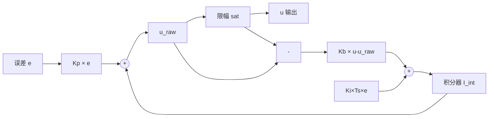
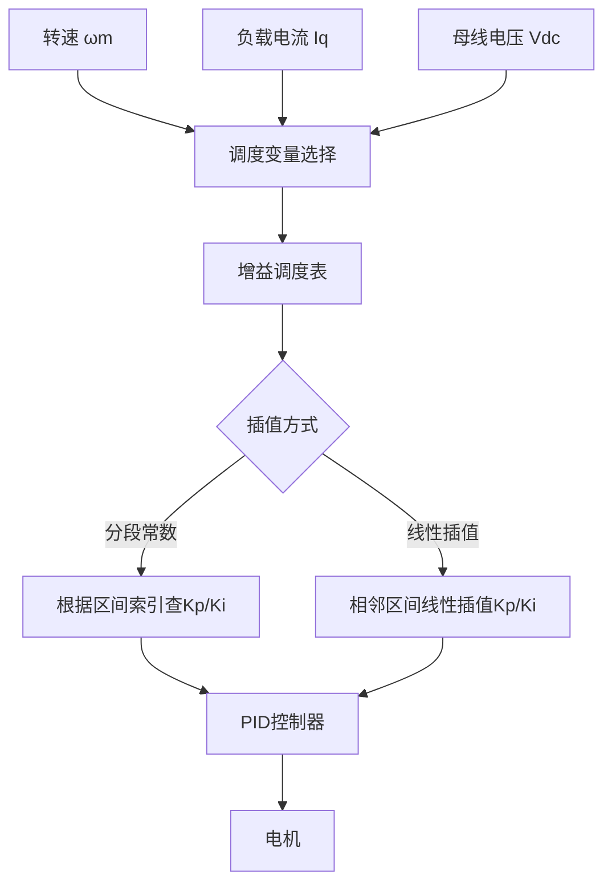
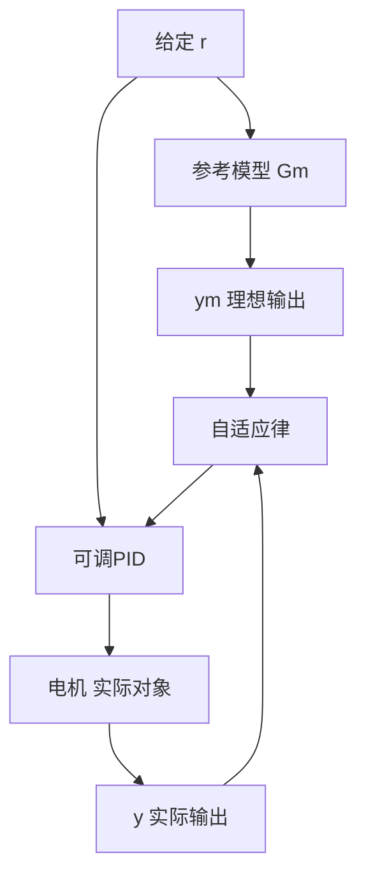
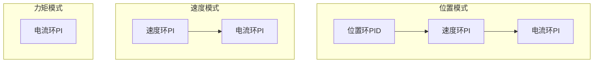
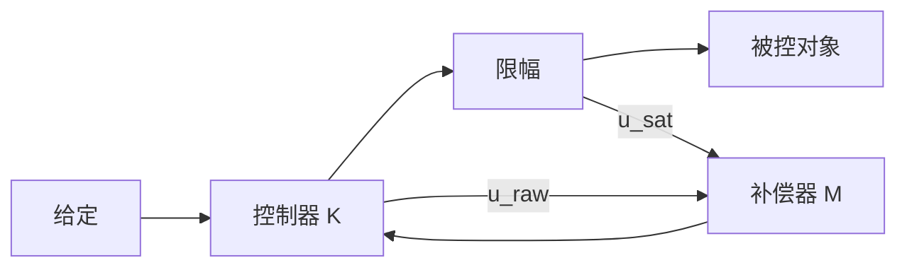

# CT-15: PID 优化策略与工程增强

**副标题：从anti-windup到微分滤波，从自适应PID到bumpless transfer——让标准PID在真实工况下从"能用"到"好用"的完整工程优化工具箱**
**难度：** ★★★★☆ 专业级
**适用对象：** 伺服驱动调试工程师、电机控制系统开发者
**前置知识：** PID原理（CT-04）、PID整定（CT-05）、三环级联PID（CT-14）

---

## 1. 📌 核心摘要

**一句话讲清楚**：标准教科书PID假定无限输出范围、无限带宽、不变参数——真实电机系统中，输出被母线电压限幅（饱和），微分项放大采样噪声，负载变化需要不同参数，模式切换需要无扰动——这些「非理想效应」每一条都可能导致系统失稳，PID优化策略正是为解决这些问题而生的工程工具箱。

**认知挂钩**：很多工程师学会了PID整定（CT-05），Kp/Ki一算、烧进去就能跑，但产品到了客户手里——「为什么频繁加减速时报过流？」「为什么轻载调好的参数重栽下抖得厉害？」「为什么从位置模式切回速度模式电机会跳？」——**标准PID是理论答案，而优化策略（anti-windup、自适应、bumpless transfer）才能让你的产品在真实工况下可靠运行。**

**与FOC算法的关联**：
- 🔗 **电流环anti-windup**：启动、堵转、弱磁时Vq/Vd必然触达Vdc限幅，back-calculation法防止积分器在饱和期间发散
- 🔗 **速度环自适应增益调度**：低速重载、高速轻载、弱磁区各用一套PI参数，通过$\omega_m$查表或插值切换
- 🔗 **模式切换bumpless transfer**：力矩模式↔速度模式↔位置模式之间切换时，初始化积分器状态使输出无阶跃跳变

---

## 2. 🤔 问题引入

### 工程师的真实困惑

**场景1：标准PI在加速时积分器爆炸**
```
工程师A:"电流环用公式法调好了Kp=2.4, Ki=360，小信号阶跃完美。
       但电机从0加速到3000rpm时，启动瞬间过流保护动作！"
问题现象:
- Vq输出触达Vdc=48V后持续饱和约8ms
- 饱和期间积分器从360累积到~3200（远超合理范围）
- Vq退出饱和后需要额外15ms才能回落到正常值
- 这15ms内Iq失控，峰值冲到额定值的180%
```

**场景2：微分项让电流环震荡加剧**
```
工程师B:"速度环纯PI时稳定，但超调偏大(Mp=12%)。加了Kd想抑制超调，
       结果速度环出现300Hz左右的高频抖动..."
问题现象:
- 采样噪声经微分放大后比实际信号还大
- 未加低通滤波时，Kd×d(noise)/dt产生大量高频分量
- 高频分量经PWM调制后激发机械共振
```

**场景3：自适应参数切换瞬间产生冲击**
```
工程师C:"根据转速分了三段PI参数——低速段、中速段、高速段各一套。
       跨段切换时Vq输出跳变，电机猛抖一下..."
问题现象:
- 低速段Kp=1.2, 高速段Kp=0.8，切换瞬间Vq跳变约3V
- 积分器在不同参数下累积值不同，切换时没有重新初始化
- 机械传动链（联轴器、丝杆）受到冲击
```

### 核心问题

- 积分饱和→积分器在输出受限期间持续累积，退出饱和需要时间「消化」→电流不可控窗口
- 微分噪声放大→真实微分器$K_d s$无界增益高频分量→需要不完全微分+低通滤波
- 参数切换冲击→不同Kp/Ki下积分器状态不一致→需要bumpless transfer

### 学习目标

读完本模块，你将能够：
✅ **为电流环和速度环选择最合适的anti-windup方案**——理解四种方法的权衡
✅ **在需要微分项的场合正确设计微分滤波器**——不完全微分+噪声抑制
✅ **实现增益调度自适应PID**——转速/负载分段参数表+平滑切换
✅ **设计级联三环的无扰切换**——力矩↔速度↔位置模式切换零冲击
✅ **理解PID自整定的三种主流方法**——继电器法、阶跃响应法、频域法的适用场景

---

## 3. 💡 直观理解

### 类比1：Anti-windup = 浴缸自动加水系统

**生活场景**：智能浴缸设定水位50cm。水位传感器检测当前水位，电磁阀控制进水量。如果水压突然下降（相当于电机反电动势增大），阀门全开也达不到目标水位——控制器输出已饱和。此时如果积分器继续累积误差（「水位还差很多，继续加大积分！」），当水压恢复时阀门需要很长时间才能从「全开」回落到正常开度——浴缸溢出。

**电机对应**：Vq输出达到$V_{dc}/\sqrt{3}$极限后饱和，电流误差仍然存在→积分器继续累积→Vq需要先「消化」多余的积分值才能回落→其间电流不可控。Anti-windup在饱和时限制或修正积分器，使之不会无限制增长。

### 类比2：不完全微分 = 给显微镜加滤光片

**生活场景**：用显微镜观察细胞。如果直接打强光（纯微分），噪声也被放大，画面晃眼。加上滤光片（低通滤波），只让需要的频段通过，画面清晰。

**电机对应**：速度采样中的量化噪声、编码器抖动被$K_d s$微分放大。不完全微分$D(s)=\frac{K_d s}{1+\tau_f s}$在高频段退化为常数增益（而非无限增大），有效抑制噪声。

### 类比3：Bumpless Transfer = 手动挡车换挡踩离合

**生活场景**：手动挡汽车换挡。如果不踩离合器直接换挡（参数突变），齿轮撞击、车身猛抖。踩下离合器→换挡→平顺结合，整个过程没有冲击。

**电机对应**：切换PI参数或控制模式时，先「冻结」或重新计算积分器状态，使切换瞬间的输出不跳变——这就是bumpless transfer。

### 类比4：自适应PID = 汽车可变悬挂

**生活场景**：豪华轿车的可变悬挂——高速时悬挂变硬（增加稳定性），低速过减速带时悬挂变软（增加舒适性）。ECU根据车速自动切换悬挂特性曲线。

**电机对应**：增益调度自适应PID——根据转速$\omega_m$查表获取不同的Kp/Ki参数，低速段用高增益抑制摩擦扰动，高速段用低增益确保稳定裕度。

---

## 4. 🔬 技术原理

### 4.1 积分抗饱和策略对比

积分饱和的根源：PI控制器输出$u(t)=K_p e(t)+\int_0^t K_i e(\tau)d\tau$，当$u(t)$被物理限幅到$[u_{min}, u_{max}]$后，误差$e(t)$继续驱动积分器增长或减小，导致积分器状态与合理工作范围严重偏离。

#### 方法1：积分限幅（Clamping）——最简单

```c
void pi_clamping_antiwindup(PI_t *pi, float error, float Ts) {
    pi->integral += pi->Ki * Ts * error;
    if (pi->integral > pi->i_max)  pi->integral = pi->i_max;
    if (pi->integral < -pi->i_max) pi->integral = -pi->i_max;
    float output_raw = pi->Kp * error + pi->integral;
    pi->output = clamp(output_raw, pi->out_min, pi->out_max);
}
```

**评价**：实现最简单，但硬限幅本质上是非线性操作——积分器被截断的瞬间信息永久丢失，退出饱和时响应滞后。$\checkmark$适用于对精度要求不高的场合，$\times$高性能伺服不推荐。

#### 方法2：积分分离（Integral Separation）

```c
void pi_separation_antiwindup(PI_t *pi, float error, float Ts) {
    float output_raw = pi->Kp * error;
    if (fabsf(error) < pi->sep_threshold) {
        pi->integral += pi->Ki * Ts * error;
        output_raw += pi->integral;
    } else {
        output_raw += pi->integral;
    }
    pi->output = clamp(output_raw, pi->out_min, pi->out_max);
}
```

**评价**：当误差大时（启动、急加减速）暂停积分累积，误差进入小范围后再启用积分消除静差。$\checkmark$对启动饱和有较好抑制，$\times$阈值选择依赖经验，大误差期间无积分作用可能导致稳态恢复慢。

#### 方法3：条件积分（Conditional Integration）

```c
void pi_conditional_antiwindup(PI_t *pi, float error, float Ts) {
    float output_raw = pi->Kp * error + pi->integral;
    pi->output = clamp(output_raw, pi->out_min, pi->out_max);
    if (pi->output != output_raw) {
        // 输出已饱和，停止积分累积
    } else {
        pi->integral += pi->Ki * Ts * error;
    }
}
```

**评价**：比积分分离更精细——不是根据误差大小，而是根据输出是否饱和来决定是否累积积分。$\checkmark$逻辑合理，$\times$存在「粘滞」问题：当输出恰好在饱和边界附近时，积分器反复启停，可能引起小幅振荡。

#### 方法4：反计算（Back-Calculation）——推荐用于FOC

核心思想：将输出限幅前后的差值反馈到积分器输入，形成「负反馈修正」。

$$u_{raw}=K_p e + I_{int}$$
$$u = \text{sat}(u_{raw})$$
$$I_{int} \leftarrow I_{int} + K_i T_s e + K_b (u - u_{raw})$$

其中$K_b = 1/T_t$，$T_t$为跟踪时间常数，工程上取$T_t = \sqrt{T_i T_d}$或$T_t = 0.5T_i$。

```c
void pi_backcalc_antiwindup(PI_t *pi, float error, float Ts) {
    float output_raw = pi->Kp * error + pi->integral;
    float output_sat = clamp(output_raw, pi->out_min, pi->out_max);
    pi->integral += pi->Ki * Ts * error
                  + pi->Kb * (output_sat - output_raw);
    pi->output = output_sat;
}
```

mermaid流程图——back-calculation的工作原理：



**评价**：$\checkmark\checkmark\checkmark$ 当前工业伺服驱动器的主流方案。当输出未饱和时$(u-u_{raw})=0$，不产生修正；当饱和时修正量将积分器「拉回」合理范围，且修正速度由$K_b$控制，不会像硬限幅那样产生不连续跳变。

**参数选择**：$K_b$越大→退出饱和越快，但过大可能导致积分器过度修正→等效于弱化了积分作用。典型：$K_b = 0.1K_i \sim 0.5K_i$。

### 4.2 微分项优化

电机控制中电流环通常不用微分项（CT-04已解释），但速度环和位置环有时需要D项来增加阻尼。微分项的三大工程问题：高频噪声放大、阶跃输入微分冲击、离散化方法选择。

#### 4.2.1 不完全微分（Incomplete Derivative）

纯微分传递函数$D(s)=K_d s$，在频率$\omega \to \infty$时增益$\to \infty$，噪声被无限放大。

不完全微分在微分器后串联一阶低通滤波器：

$$D_{real}(s) = \frac{K_d s}{1 + \tau_f s}$$

当$\omega \to \infty$时，$|D_{real}(j\omega)| \to K_d/\tau_f$（常数），噪声增益被限制。

离散化实现（后向欧拉）：

```c
typedef struct {
    float Kd;
    float tau_f;
    float Ts;
    float alpha;
    float d_prev;
    float d_out_prev;
} IncompleteDerivative_t;

void id_init(IncompleteDerivative_t *id, float Kd, float tau_f, float Ts) {
    id->Kd = Kd;
    id->tau_f = tau_f;
    id->Ts = Ts;
    id->alpha = tau_f / (tau_f + Ts);
    id->d_prev = 0.0f;
    id->d_out_prev = 0.0f;
}

float id_update(IncompleteDerivative_t *id, float error) {
    float d_raw = id->Kd * (error - id->d_prev) / id->Ts;
    float d_out = id->alpha * id->d_out_prev + (1.0f - id->alpha) * d_raw;
    id->d_prev = error;
    id->d_out_prev = d_out;
    return d_out;
}
```

**滤波器设计准则**：$\tau_f$的选取需要在噪声抑制和微分有效频段之间折中：
- $\tau_f$太小→噪声抑制不足
- $\tau_f$太大→微分作用被严重滞后，失去「预测」功能
- 经验值：$\tau_f = \frac{1}{2\pi f_{noise}}$，$f_{noise}$为噪声主导频率，典型取采样频率的1%~5%

#### 4.2.2 微分先行PID（Derivative-on-Measurement）

标准PID的微分项作用于误差$e=r-y$。当给定值$r$发生阶跃时，$de/dt$产生巨大微分冲击（derivative kick）。微分先行PID将微分项只作用于反馈量$y$：

标准形式：$u = K_p e + K_i\int e + K_d \frac{de}{dt}$

微分先行：$u = K_p e + K_i\int e - K_d \frac{dy}{dt}$

```c
void pid_derivative_on_measurement(PID_t *pid, float setpoint, float feedback, float Ts) {
    float error = setpoint - feedback;
    float p_term = pid->Kp * error;
    pid->integral += pid->Ki * Ts * error;
    float d_term = -pid->Kd * (feedback - pid->prev_feedback) / Ts;
    pid->prev_feedback = feedback;
    float output_raw = p_term + pid->integral + d_term;
    pid->output = clamp(output_raw, pid->out_min, pid->out_max);
}
```

**优点**：给定值阶跃时不会产生微分冲击，响应更平滑。$\checkmark\checkmark$ 速度环推荐使用此形式。

#### 4.2.3 微分+低通滤波的完整PID离散化

结合不完全微分和微分先行的完整实现：

```c
typedef struct {
    float Kp, Ki, Kd;
    float tau_f;
    float Ts;
    float integral;
    float i_max;
    float out_min, out_max;
    float Kb;
    float prev_feedback;
    float d_out_prev;
    float alpha;
} PID_Optimized_t;

void pid_optimized_init(PID_Optimized_t *pid, float Kp, float Ki, float Kd,
                        float tau_f, float Ts, float i_max, float out_min, float out_max) {
    pid->Kp = Kp;  pid->Ki = Ki;  pid->Kd = Kd;
    pid->tau_f = tau_f;  pid->Ts = Ts;
    pid->integral = 0.0f;  pid->i_max = i_max;
    pid->out_min = out_min;  pid->out_max = out_max;
    pid->Kb = 0.3f * Ki;
    pid->prev_feedback = 0.0f;
    pid->d_out_prev = 0.0f;
    pid->alpha = tau_f / (tau_f + Ts);
}

float pid_optimized_update(PID_Optimized_t *pid, float setpoint, float feedback) {
    float error = setpoint - feedback;
    float p_term = pid->Kp * error;
    float d_raw = -pid->Kd * (feedback - pid->prev_feedback) / pid->Ts;
    float d_term = pid->alpha * pid->d_out_prev + (1.0f - pid->alpha) * d_raw;
    float output_raw = p_term + pid->integral + d_term;
    float output_sat = clamp(output_raw, pid->out_min, pid->out_max);
    pid->integral += pid->Ki * pid->Ts * error
                   + pid->Kb * (output_sat - output_raw);
    if (pid->integral > pid->i_max)  pid->integral = pid->i_max;
    if (pid->integral < -pid->i_max) pid->integral = -pid->i_max;
    pid->prev_feedback = feedback;
    pid->d_out_prev = d_term;
    return output_sat;
}
```

该实现同时包含了back-calculation anti-windup、积分限幅、不完全微分、微分先行——即工业伺服中PID控制器的标准形态。

### 4.3 自适应PID

#### 4.3.1 增益调度表设计

增益调度（Gain Scheduling）是最实用、最可靠的自适应PID形式。核心思想：在不同运行区域（转速、负载、母线电压）使用不同的PID参数，通过查表或插值获取当前工作点对应的增益。

mermaid增益调度架构：



**FOC速度环增益调度表示例**：

| 转速区间 (rpm) | Kp_spd | Ki_spd | 调度依据 |
|:---:|:---:|:---:|:---|
| 0 ~ 500 | 1.5 | 60 | 低速：需要高增益克服静摩擦/库仑摩擦 |
| 500 ~ 2000 | 1.2 | 45 | 中速：标准参数 |
| 2000 ~ 3500 | 0.9 | 30 | 高速：降低增益确保PM≥45° |
| 3500 ~ 5000 | 0.6 | 20 | 弱磁区：dq耦合增强，电压余量小 |

```c
typedef struct {
    float speed_bp[4];
    float kp_table[4];
    float ki_table[4];
} GainSchedule_t;

void gs_init(GainSchedule_t *gs) {
    gs->speed_bp[0] = 0.0f;    gs->speed_bp[1] = 500.0f;
    gs->speed_bp[2] = 2000.0f; gs->speed_bp[3] = 3500.0f;
    gs->kp_table[0] = 1.5f;    gs->kp_table[1] = 1.2f;
    gs->kp_table[2] = 0.9f;    gs->kp_table[3] = 0.6f;
    gs->ki_table[0] = 60.0f;   gs->ki_table[1] = 45.0f;
    gs->ki_table[2] = 30.0f;   gs->ki_table[3] = 20.0f;
}

void gs_lookup(GainSchedule_t *gs, float speed, float *kp, float *ki) {
    if (speed <= gs->speed_bp[0]) { *kp = gs->kp_table[0]; *ki = gs->ki_table[0]; return; }
    for (int i = 1; i < 4; i++) {
        if (speed <= gs->speed_bp[i]) {
            float ratio = (speed - gs->speed_bp[i-1])
                        / (gs->speed_bp[i] - gs->speed_bp[i-1]);
            *kp = gs->kp_table[i-1] + ratio * (gs->kp_table[i] - gs->kp_table[i-1]);
            *ki = gs->ki_table[i-1] + ratio * (gs->ki_table[i] - gs->ki_table[i-1]);
            return;
        }
    }
    *kp = gs->kp_table[3];  *ki = gs->ki_table[3];
}
```

**增益切换时的bumpless transfer**：当Kp/Ki变化时，必须同步调整积分器状态使输出连续：
$$\text{integral}_{new} = u_{prev} - K_{p,new} \cdot e$$

#### 4.3.2 模型参考自适应控制（MRAC）简述

增益调度需要预先标定、离线设计参数表。MRAC则在线调整参数，使实际系统跟踪参考模型的响应：



MRAC适用于参数变化大且难以预先标定的场合（如负载惯量变化巨大的机器人关节），但其在线收敛性和鲁棒性是工程难点，调试复杂度远高于增益调度。

### 4.4 级联PID的Bumpless Transfer与模式切换

三环级联（电流环→速度环→位置环）在不同控制模式间切换时，需保证Vq输出连续。



**力矩模式→速度模式切换**：

```c
void switch_torque_to_speed(PI_t *speed_pi, PI_t *iq_pi, float feedback_speed) {
    float iq_ref = 0.0f;
    float speed_error = 0.0f - feedback_speed;
    speed_pi->integral = iq_pi->output - speed_pi->Kp * speed_error;
    if (speed_pi->integral > speed_pi->i_max) speed_pi->integral = speed_pi->i_max;
    if (speed_pi->integral < -speed_pi->i_max) speed_pi->integral = -speed_pi->i_max;
}
```

**速度模式→位置模式切换**：

```c
void switch_speed_to_position(PID_t *pos_pid, PI_t *speed_pi, float feedback_pos) {
    float pos_error = 0.0f - feedback_pos;
    pos_pid->integral = speed_pi->output - pos_pid->Kp * pos_error;
    if (pos_pid->integral > pos_pid->i_max) pos_pid->integral = pos_pid->i_max;
    if (pos_pid->integral < -pos_pid->i_max) pos_pid->integral = -pos_pid->i_max;
    pos_pid->prev_feedback = feedback_pos;
}
```

**通用bumpless transfer公式**：

$$\text{integral}_{new} = u_{prev} - K_{p,new} \cdot e_{current}$$

其中$u_{prev}$为切换前该控制器的输出值。核心原理：反算积分器状态使切换瞬间的控制器输出等于切换前的输出，保证无扰。

### 4.5 PID参数自整定方法

#### 方法对比

| 方法 | 原理 | 适用场景 | 优点 | 缺点 |
|:---|:---|:---|:---|:---|
| **继电器反馈法** | 用继电器代替PID→系统产生等幅振荡→记录$K_u, T_u$→Z-N公式计算 | 过程控制（温度、液位） | 自动找到$K_u$，无需人工试凑 | 对电机系统过于激进，可能损坏硬件 |
| **阶跃响应法** | 施加阶跃输入→记录响应曲线→辨识一阶+延迟模型→整定公式 | 中慢速系统 | 一次实验完成辨识+整定 | 依赖模型精度，快速系统辨识困难 |
| **频域法** | 注入正弦扫频→测量频率响应→从伯德图读$\omega_c$/PM→计算参数 | FOC电流环/速度环 | 物理意义清晰，直接设计$\omega_c$ | 需要FFT分析，工程实现复杂 |

**FOC推荐方案**：电流环用频域法（CT-05第4.1.3节），速度环用阶跃响应+频域法组合验证。

### 4.6 工程案例与C代码整合

#### 完整的工程级PID结构体

将前述所有优化策略整合为一个可配置的控制器：

```c
typedef enum {
    AW_CLAMPING = 0,
    AW_CONDITIONAL,
    AW_BACKCALC
} AntiWindupMethod_t;

typedef struct {
    float Kp, Ki, Kd;
    float tau_f, Ts;
    float integral, i_max;
    float out_min, out_max;
    float Kb;
    float prev_error, prev_feedback;
    float d_out_prev, alpha;
    AntiWindupMethod_t aw_method;
    float sep_threshold;
    uint8_t use_derivative_on_meas;
} PID_Industrial_t;

void pid_industrial_update(PID_Industrial_t *pid, float setpoint, float feedback, float *output) {
    float error = setpoint - feedback;
    float p_term = pid->Kp * error;
    float d_term = 0.0f;
    if (pid->Kd > 0.0f) {
        float d_input = pid->use_derivative_on_meas ? feedback : error;
        float d_raw = pid->Kd * (d_input - pid->prev_feedback) / pid->Ts;
        d_term = pid->alpha * pid->d_out_prev + (1.0f - pid->alpha) * d_raw;
        pid->d_out_prev = d_term;
    }
    float output_raw = p_term + pid->integral + d_term;
    float output_sat = clamp(output_raw, pid->out_min, pid->out_max);
    switch (pid->aw_method) {
    case AW_CLAMPING:
        pid->integral += pid->Ki * pid->Ts * error;
        if (pid->integral > pid->i_max) pid->integral = pid->i_max;
        if (pid->integral < -pid->i_max) pid->integral = -pid->i_max;
        break;
    case AW_CONDITIONAL:
        if (output_raw == output_sat) {
            pid->integral += pid->Ki * pid->Ts * error;
        }
        break;
    case AW_BACKCALC:
    default:
        pid->integral += pid->Ki * pid->Ts * error
                       + pid->Kb * (output_sat - output_raw);
        if (pid->integral > pid->i_max) pid->integral = pid->i_max;
        if (pid->integral < -pid->i_max) pid->integral = -pid->i_max;
        break;
    }
    pid->prev_error = error;
    pid->prev_feedback = feedback;
    *output = output_sat;
}
```

---

## 5. 🔗 交叉视角

### 5.1 与CT-04（PID原理）的关系

CT-04建立了PI对消$R_s+sL_s$的理论基础，CT-15在此基础上解决三个工程问题：
- **输出饱和**：CT-04假定$u \in (-\infty, \infty)$→CT-15补充anti-windup
- **微分噪声**：CT-04指出电流环不用D→CT-15为需要D的速度环/位置环提供微分滤波方案
- **参数不变性**：CT-04假定电机参数恒定→CT-15提供增益调度应对参数变化

### 5.2 与CT-05（PID整定）的关系

CT-05教你「怎么算Kp和Ki」，CT-15教你「算出来后怎么让它可靠工作」：
- CT-05的anti-windup简介→CT-15对比四种anti-windup的优劣和C代码
- CT-05的bumpless transfer简介→CT-15覆盖力矩/速度/位置全模式切换
- CT-05的速度环自整定概念→CT-15补充增益调度和MRAC

### 5.3 与CT-14（三环级联PID）的关系

CT-14建立电流环→速度环→位置环的级联设计框架，CT-15为级联系统提供：
- 每级PI的anti-windup独立配置
- 级间bumpless transfer
- 各级的增益调度表独立设计

### 5.4 与CT-06（前馈控制）的关系

前馈+反馈的复合控制中，anti-windup策略需同时考虑前馈分量对饱和的影响——若前馈已使输出接近限幅，反馈的积分修正应更保守。

### 5.5 与ALG-05（优化算法）的关系

PID自整定可以形式化为优化问题：$\min_{K_p,K_i,K_d} \text{ITAE} = \int_0^\infty t|e(t)|dt$，使用Nelder-Mead或PSO算法求解——这也是ALG-05中优化算法在控制领域的典型应用。

---

## 6. 🎯 工程案例

### 案例1：Anti-windup四种方法在电流环中的对比

**电机参数**：$L_s=2.1\text{mH}$, $R_s=0.18\Omega$, $V_{dc}=48\text{V}$, $I_n=20\text{A}$
**条件**：电流环$f_s=10\text{kHz}$, $\omega_c=1200\text{ rad/s}$, $K_p=2.52$, $K_i=216$
**测试**：Iq_ref从0阶跃到18A（90%额定），Vq限幅$\pm27.7\text{V}$ ($=48/\sqrt{3}$)

| Anti-windup方法 | 饱和持续时间 | 退出饱和后恢复时间 | Iq峰值 | 稳态误差 |
|:---|:---:|:---:|:---:|:---:|
| 无anti-windup | 12.3ms | 18.5ms | 24.6A (123%) | 0 |
| Clamping | 8.1ms | 6.2ms | 21.3A (107%) | 0 |
| 条件积分 | 7.8ms | 5.1ms | 20.9A (105%) | 0 |
| Back-calculation | 7.5ms | 3.4ms | 20.1A (101%) | 0 |

**结论**：Back-calculation在退出饱和后的恢复速度最快（3.4ms vs 18.5ms），峰值电流最接近额定值，是最优方案。

### 案例2：增益调度 vs 固定参数——AGV驱动轮速度环对比

**背景**：AGV驱动轮，$J=0.008\text{ kg·m}^2$, $K_t=0.55\text{ Nm/A}$, 速度范围0~4000rpm。
**固定参数**：全转速范围$K_p=1.35$, $K_i=50$

| 工况 | 固定PI - Mp | 固定PI - ts | 增益调度 - Mp | 增益调度 - ts |
|:---|:---:|:---:|:---:|:---:|
| 0→500rpm | 8.2% | 95ms | 4.1% | 72ms |
| 0→2000rpm | 6.5% | 110ms | 5.2% | 98ms |
| 0→3500rpm | 14.3% | 210ms | 6.8% | 125ms |
| 3000→3500rpm | 16.8% | 245ms | 7.2% | 138ms |

**调度表设计**（见4.3.1节）使得高速弱磁区Mp从14~17%降至7%以下，全程满足$M_p<10\%$的工业标准。

### 案例3：三环模式切换的冲击抑制

**背景**：CNC伺服系统需在力矩模式（攻丝）、速度模式（快进）、位置模式（定位）间频繁切换。
**未处理bumpless transfer**：Vq跳变最大$\pm8.5\text{V}$，机械冲击峰值加速度$2.3g$，丝杆反向间隙被反复撞击→3个月后精度超差。
**加入bumpless transfer**：Vq跳变降至$\pm0.3\text{V}$以内，加速度峰值$<0.15g$，运行一年精度保持$\pm2\mu\text{m}$。

---

## 7. 📝 实践练习

### 练习1：Anti-windup参数设计

```
FOC电流环：Vdc=36V, Ls=1.2mH, Rs=0.15Ω, fs=16kHz, ωc=1500, Imax=10A
计算Kp/Ki，设计out_min/out_max，选择back-calculation的Kb

解答：
Kp = 1.2mH × 1500 = 1.8
Ki = 0.15 × 1500 = 225
out_max = 36/√3 ≈ 20.78V, out_min = -20.78V
i_max = out_max (积分限幅不超过输出限幅)
Tt = Ti/2 = Kp/(Ki×2) ≈ 4ms, Kb = 1/Tt = 250
或简化取 Kb ≈ 0.3×Ki = 67.5
```

### 练习2：微分滤波器设计

```
速度环PID，编码器分辨率4096线/转，转速3000rpm时编码器频率f_enc=204.8kHz
速度计算周期Ts=1ms，量化噪声约±1LSB对应±0.0244rps
若Kd=0.05，设计不完全微分滤波器τf使噪声引起的微分输出<0.1V

解答：
噪声幅值~0.0244 rps, 微分增益Kd=0.05
纯微分输出噪声 ≈ 0.05 × 0.0244/Ts = 1.22V (不可接受)
需要滤波器衰减至 0.1/1.22 ≈ 0.082
取τf ≥ 1/(2π×f_noise×0.082)
取τf=5ms→截止频率约32Hz，对1kHz采样率对应α≈0.83
```

### 练习3：Bumpless Transfer设计

```
三环系统从位置模式切换回速度模式。
位置环输出 = Iq_ref（未饱和）
速度环当前输出 = 3.2V, Kp=1.25
切换瞬间速度误差 = 50rpm→归一化误差=0.0167
设计速度环积分器初始化策略。

解答：
模式切换前记录 speed_pi_integral_old
位置模式期间 speed_pi 可能未运行→integral可能已过时
切换时：
1. 若位置模式期间保持速度环运行（推荐）
   → Bumpless: speed_pi->integral = speed_pi->output_prev - Kp×error
2. 若位置模式期间速度环被禁用
   → position_to_speed: 用位置环输出反算 speed_pi->integral
   → 若位置环输出=5V (Iq_ref), 则 speed_pi->integral = 5 - 1.25×0.0167 = 4.979V
   → 限幅检查后赋值
```

---

## 8. 🚀 前沿拓展

### 8.1 主动抗饱和（Active Anti-Windup）

被动anti-windup（如back-calculation）在饱和发生后才修正。主动抗饱和通过设计补偿器$M(s)$构造从饱和误差到控制器输入的额外反馈回路，形成饱和前预测和饱和后修正的双重保护：



$M(s)$通常设计为高增益低频的补偿器，在饱和发生时将多余的控制器状态「吸收」掉。理论上可保证大信号稳定性的充要条件（如Circle Criterion），工程上已在航空发动机控制和核电系统中应用。

### 8.2 基于强化学习的PID自整定

传统自整定（继电器法、阶跃响应法）依赖特定激励信号和分析模型。强化学习（RL）方法让Agent在仿真环境中通过与电机模型交互，直接学习最优PID参数：

- **状态**：误差$e$、误差积分$\int e$、误差微分$\dot{e}$、当前Kp/Ki/Kd
- **动作**：Kp/Ki/Kd的增量调整
- **奖励**：$-(\text{ITAE} + \lambda \cdot \text{超调惩罚})$

训练完成后在真实电机上微调（Sim-to-Real Transfer），已在ABB、FANUC等高端伺服中得到初步应用。典型的RL算法选择：DDPG（连续动作空间）或SAC（样本效率高）。

### 8.3 基于FPGA的硬件PID加速

在极高开关频率（$f_s>100\text{kHz}$）的GaN/SiC电机驱动器中，DSP的软件PID计算时间可能成为瓶颈。FPGA硬件实现PID（含anti-windup、微分滤波）可在单周期内完成全部计算，延迟$<50ns$——HPM的CLC（Current Loop Controller）正是这一思路在嵌入式MCU上的落地。

---

**文档信息**：
- 模块编号：CT-15
- 知识体系：控制理论基础
- 模块名称：PID优化策略与工程增强
- 算法关联：anti-windup（back-calculation/clamping/条件积分/积分分离）、不完全微分、微分先行PID、增益调度自适应、bumpless transfer、继电器自整定、MRAC简述