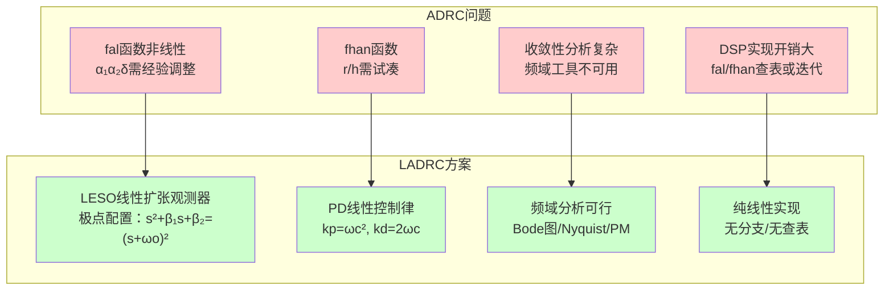
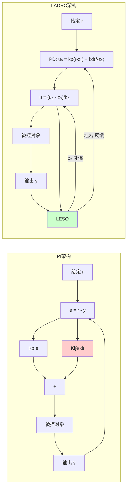
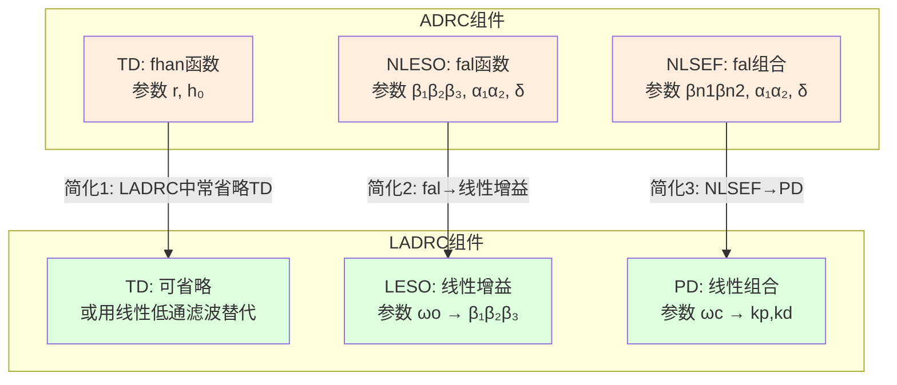
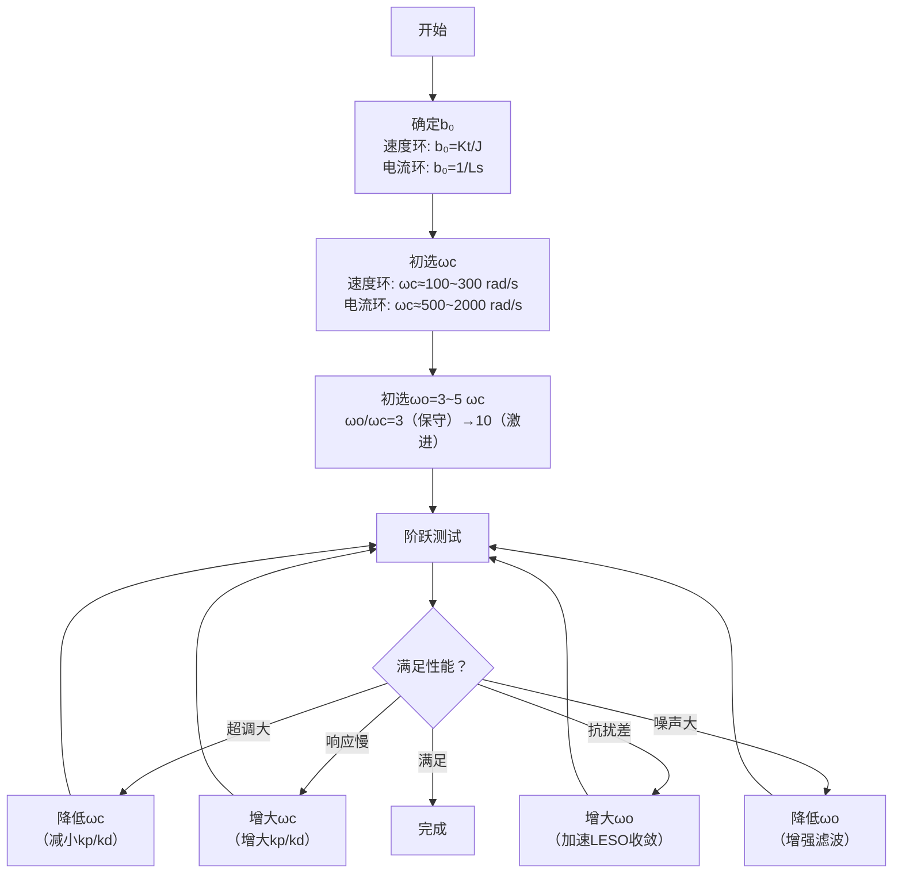
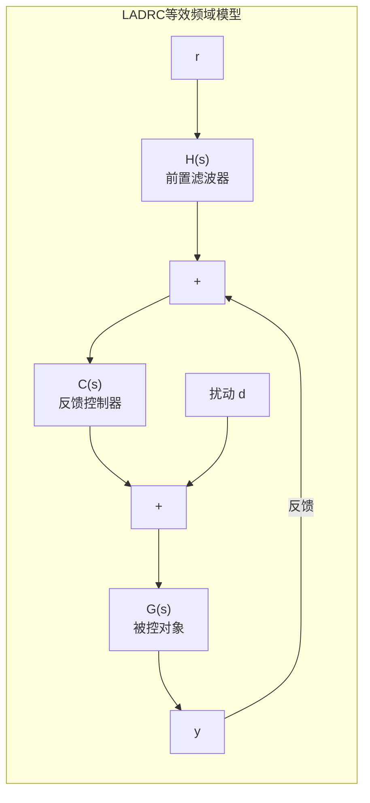

# CT-17: LADRC 线性自抗扰控制

**副标题：从非线性ADRC到线性LADRC——用极点配置和带宽参数化将ADRC从学术论文带到DSP工程实现的桥梁**
**难度：** ★★★★★ 专家级
**适用对象：** 电机控制算法工程师、ADRC工程实现者
**前置知识：** ADRC理论（CT-16）、状态观测器（CT-11）、状态反馈（CT-12）、频域分析（CT-03）

---

## 1. 📌 核心摘要

**一句话讲清楚**：LADRC是ADRC的线性化工程实现版本——将非线性的fal函数替换为线性观测器（LESO）、非线性的NLSEF替换为PD控制，所有参数通过带宽概念（ωo观测器带宽、ωc控制器带宽）统一整定，使ADRC从「调参困难」变成「两个参数即可工作」，是ADRC理论走向工业电机控制的现实路径。

**认知挂钩**：ADRC虽然理论优美，但非线性函数fal的α参数（0<α<1）需要经验调整，fhan函数的r/h也需要试凑。LADRC用「带宽参数化」的思想将整定问题简化为两个频率参数——ωo（观测器带宽）和ωc（控制器带宽），极大降低了工程门槛。更重要的是，线性化的LESO使得频域分析成为可能，工程师可以用Bode图、相位裕度等熟悉工具分析LADRC的性能。

**与FOC算法的关联**：
- 🔗 **LADRC电流环**：二阶LESO估计dq轴总扰动（反电动势耦合+参数不确定性+死区效应），PD控制+扰动补偿 → 比PI更强的抗扰能力和更少的参数（仅ωc, ωo, b₀三个）
- 🔗 **LADRC速度环**：三阶LESO估计负载转矩扰动 → 扰动前馈 → 速度环抗负载扰动能力显著优于PI，且无需积分项
- 🔗 **LADRC位置环**：二阶LADRC（LESO+PD+扰动补偿）→ 一个控制器可替代三环级联中的位置+速度双环，减少整定参数的同时提升抗扰性能



---

## 2. 🤔 问题引入

### 工程师的真实困惑

**场景1：ADRC参数太多，现场调试崩溃**
```
工程师A:"看了韩京清老师的ADRC论文，理论确实漂亮，但实际调参时——
      fal函数的α₁=0.5, α₂=0.25, δ=0.01, 
      ESO的β₁β₂β₃各一个，NLSEF的β₁β₂又两个，
      TD还有r和h₀... 加起来快10个参数了！
      现场调试根本不现实。"
问题现象:
- 仿真中ADRC性能远超PI
- DSP实现后，10个参数互相耦合
- 改了β₁影响观测速度，改了r又影响过渡时间
- 客户现场不可能调10个参数
```

**场景2：非线性ESO的DSP计算耗时**
```
工程师B:"我把CT-16的ESO代码移植到DSP上，fal函数里的powf()
      调用一次就要几十个CPU周期，电流环16kHz中断里根本跑不完..."
问题现象:
- fal函数的|e|^α需要浮点幂运算
- fhan函数的sqrt+分支判断消耗不确定周期
- 16kHz PWM中断里ADRC总耗时~15μs
- 而整个FOC还不到10μs——ADRC占掉了一半多
```

**场景3：想用Bode图分析抗扰性能却没工具**
```
工程师C:"ADRC是非线性的，不能直接用传递函数分析。
      PI我可以用Bode图看相位裕度、用灵敏度函数看抗扰，
      ADRC我只能靠仿真试... 没有频域工具，心里没底。"
问题现象:
- PI：画出L(s)=C(s)G(s)的Bode图 → PM=60° → 放心上机
- ADRC：非线性，无法写成传递函数 → 只能靠阶跃响应试
- 导致对ADRC的稳定性边界完全没有认知
```

### 核心问题

- 参数多 → 能否把整定问题参数化为几个物理含义明确的参数？→ 带宽参数化
- 计算量大 → 能否只用线性运算？→ LESO + PD
- 无法频域分析 → 能否线性化后导出传递函数？→ 等效二自由度结构

### 学习目标

读完本模块，你将能够：
✅ **从ADRC推导出LADRC**——理解线性化每一步的数学动机
✅ **掌握带宽参数化方法**——将10个参数缩减为ωo, ωc, b₀三个
✅ **推导LESO的离散实现**，在DSP上用纯线性代码实现
✅ **画出LADRC等效Bode图**，用相位裕度分析稳定性
✅ **对比LADRC与PI在同一电机平台上的抗扰性能**

---

## 3. 💡 直观理解

### 带宽参数化：用一根旋钮调所有参数

**生活场景**：传统老式收音机——音量、低音、高音、平衡、混响... 每个旋钮各自独立，调出好声音需要经验。现代音响系统的「一键调音」——只问你「喜欢摇滚还是古典？」（一个决策），系统自动配置所有参数。

LADRC就是ADRC的「一键调音」版本。高志强教授发现：如果把ESO的极点全部配置在同一个频率ωo上，观测器增益β₁, β₂, β₃就由ωo唯一确定——**一个旋钮调三个增益**。同理，PD控制器的kp, kd由ωc唯一确定——**另一个旋钮调两个增益**。

**数学本质**：

对于二阶LADRC的LESO，其特征方程为：

$$s^3 + \beta_1 s^2 + \beta_2 s + \beta_3 = 0$$

将所有极点配置在 $-\omega_o$（三重根）：

$$(s + \omega_o)^3 = s^3 + 3\omega_o s^2 + 3\omega_o^2 s + \omega_o^3 = 0$$

$$\Rightarrow \beta_1 = 3\omega_o,\quad \beta_2 = 3\omega_o^2,\quad \beta_3 = \omega_o^3$$

**关键的工程意义**：带宽ωo越大 → β₁, β₂, β₃同时同趋势增大 → 观测器响应更快 → 但噪声敏感度也同时增大。ωo的选择直接决定了整个LESO的性能——一个参数统治一切。

### LESO（线性扩张状态观测器）：不用fal的ESO

**生活场景**：非线性ESO的fal函数像是一位「老中医」——小病重药（小误差高增益），大病轻药（大误差小增益），用药策略需要经验（α和δ的选择）。线性LESO像是一位「西医」——不管什么病，药的剂量和误差成正比（固定增益βᵢ），用多少药有精确的公式（带宽参数化），可预测可重现。

**fal与线性误差修正的对比**：

| 特性 | fal(e,α,δ) | 线性 LESO (βᵢ·e) |
|------|-----------|-------------------|
| 小误差时 | 高增益 $e/\delta^{1-\alpha}$ | 恒定增益 βᵢ |
| 大误差时 | 增益递减 $\|e\|^{\alpha-1}$ | 恒定增益 βᵢ |
| 计算量 | 分支+幂运算 | 一次乘法 |
| 可分析性 | 仅Lyapunov | 极点配置/频域 |
| 收敛速度 | 有限时间收敛 | 指数收敛 |

**为什么线性就够了？** 因为扰动补偿机制（u = (u₀ - z₃)/b₀）才是ADRC的灵魂，而非ESO的非线性。当扰动被有效补偿后，系统退化为纯积分器串联型——此时PD控制已经足够，不需要fal的「自适应增益」。

### PD控制律：没有积分器的控制器

LADRC最大的反直觉之处——**控制器不含积分器**。那稳态误差怎么办？答案是：**LESO估计的总扰动z₃包含了所有引起稳态误差的因素（负载+参数偏差+外部扰动），通过前馈补偿 u = (u₀ - z₃)/b₀ 消除这些误差，不需要积分器来「事后补救」。**



**核心差异**：PI的积分器是对「过去误差」的累积（被动），LADRC的扰动补偿是对「未来扰动」的预测性消除（主动）。

---

## 4. 🔬 技术原理

### 4.1 LADRC的动机——从非线性到线性的必然选择

#### 4.1.1 ADRC非线性组件的工程困境

| 组件 | 非线性函数 | 参数 | 工程问题 |
|------|-----------|------|---------|
| TD | fhan(x1,x2,r,h₀) | r, h₀ | r选大了超调、选小了慢；h₀与噪声耦合 |
| ESO | fal(e,α,δ) | β₁β₂β₃, α₁α₂, δ | 幂运算开销大；α物理含义不直观 |
| NLSEF | fal(e₁,α₁,δ)+fal(e₂,α₂,δ) | βn1,βn2, α₁α₂, δ | 非线性增益无频域解释 |

**高志强教授的核心洞察**（2003年，美国Cleveland州立大学）：
1. ESO的非线性固然能加速收敛，但带宽足够高时线性ESO也能满足工程需求
2. 「扰动补偿」才是ADRC抗扰的本质，而非fal函数的非线性增益调度
3. 线性化后可以用成熟的极点配置和频域工具分析，大幅降低工程代价

#### 4.1.2 LADRC的三大简化



**简化理由**：
- **省略TD**：电机控制中阶跃给定通常有物理限幅（电流限幅/加速度限幅），天然提供过渡过程
- **LESO**：线性增益βᵢ由ωo唯一确定，无需调α和δ
- **PD**：kp和kd由ωc唯一确定，无需调非线性参数

### 4.2 LESO设计——LADRC的灵魂

#### 4.2.1 一阶LADRC的LESO（适用于电流环）

对于一阶系统 $\dot{y} = f(y,w,t) + b_0 u$，将总扰动f扩张为状态x₂：

$$\begin{cases} \dot{x}_1 = x_2 + b_0 u \\ \dot{x}_2 = \dot{f} = h \\ y = x_1 \end{cases}$$

**二阶LESO**（对一阶系统而言，ESO比系统高一阶）：

$$\begin{cases} \dot{z}_1 = z_2 - \beta_1 (z_1 - y) + b_0 u \\ \dot{z}_2 = -\beta_2 (z_1 - y) \end{cases}$$

- z₁ → 估计y（电流）
- z₂ → 估计总扰动f（反电动势+参数偏差+死区效应）
- β₁, β₂ → 线性观测器增益

**带宽参数化**：

特征方程：$s^2 + \beta_1 s + \beta_2 = 0$

配置二重极点于 $-\omega_o$：

$$(s + \omega_o)^2 = s^2 + 2\omega_o s + \omega_o^2$$

$$\Rightarrow \boxed{\beta_1 = 2\omega_o,\quad \beta_2 = \omega_o^2}$$

#### 4.2.2 二阶LADRC的LESO（适用于速度环/位置环）

对于二阶系统 $\ddot{y} = f(y,\dot{y},w,t) + b_0 u$，扩张为三阶：

$$\begin{cases} \dot{x}_1 = x_2 \\ \dot{x}_2 = x_3 + b_0 u \\ \dot{x}_3 = \dot{f} = h \\ y = x_1 \end{cases}$$

**三阶LESO**：

$$\begin{cases} \dot{z}_1 = z_2 - \beta_1 (z_1 - y) \\ \dot{z}_2 = z_3 - \beta_2 (z_1 - y) + b_0 u \\ \dot{z}_3 = -\beta_3 (z_1 - y) \end{cases}$$

- z₁ → 估计y（位置/速度）
- z₂ → 估计ẏ（速度/加速度）
- z₃ → 估计总扰动f

**带宽参数化**：

特征方程：$s^3 + \beta_1 s^2 + \beta_2 s + \beta_3 = 0$

配置三重极点于 $-\omega_o$：

$$(s + \omega_o)^3 = s^3 + 3\omega_o s^2 + 3\omega_o^2 s + \omega_o^3$$

$$\Rightarrow \boxed{\beta_1 = 3\omega_o,\quad \beta_2 = 3\omega_o^2,\quad \beta_3 = \omega_o^3}$$

#### 4.2.3 一般化：n阶LESO的带宽参数化

| 系统阶数 | ESO阶数 | β₁ | β₂ | β₃ | β₄ | 通式 |
|---------|---------|-----|-----|-----|-----|------|
| 一阶 | 二阶 | 2ωo | ωo² | - | - | $\beta_i = \binom{n+1}{i}\omega_o^i$ |
| 二阶 | 三阶 | 3ωo | 3ωo² | ωo³ | - | $\beta_i = \binom{n+1}{i}\omega_o^i$ |
| 三阶 | 四阶 | 4ωo | 6ωo² | 4ωo³ | ωo⁴ | $\beta_i = \binom{n+1}{i}\omega_o^i$ |

其中 $\binom{n}{k} = \frac{n!}{k!(n-k)!}$ 是二项式系数。

#### 4.2.4 LESO的离散时间实现（关键！）

连续域LESO：

$$\dot{z} = A z + B u + L(y - z_1)$$

其中 $L = [\beta_1, \beta_2, \beta_3]^T$ 为观测器增益向量。

**前向欧拉离散化**：

$$z(k+1) = z(k) + T_s \left[ A z(k) + B u(k) + L (y(k) - z_1(k)) \right]$$

**一阶LESO离散C代码实现**：

```c
typedef struct {
    float z1, z2;
    float beta1, beta2;
    float b0;
} LESO_Order1;

void LESO1_Init(LESO_Order1 *obs, float wo, float b0) {
    obs->beta1 = 2.0f * wo;
    obs->beta2 = wo * wo;
    obs->b0 = b0;
    obs->z1 = 0.0f;
    obs->z2 = 0.0f;
}

void LESO1_Update(LESO_Order1 *obs, float y, float u, float Ts) {
    float e = obs->z1 - y;
    obs->z1 += Ts * (obs->z2 - obs->beta1 * e + obs->b0 * u);
    obs->z2 += Ts * (-obs->beta2 * e);
}
```

**二阶LESO离散C代码实现**：

```c
typedef struct {
    float z1, z2, z3;
    float beta1, beta2, beta3;
    float b0;
} LESO_Order2;

void LESO2_Init(LESO_Order2 *obs, float wo, float b0) {
    obs->beta1 = 3.0f * wo;
    obs->beta2 = 3.0f * wo * wo;
    obs->beta3 = wo * wo * wo;
    obs->b0 = b0;
    obs->z1 = 0.0f;
    obs->z2 = 0.0f;
    obs->z3 = 0.0f;
}

void LESO2_Update(LESO_Order2 *obs, float y, float u, float Ts) {
    float e = obs->z1 - y;
    obs->z1 += Ts * (obs->z2 - obs->beta1 * e);
    obs->z2 += Ts * (obs->z3 - obs->beta2 * e + obs->b0 * u);
    obs->z3 += Ts * (-obs->beta3 * e);
}
```

**数值稳定性提示**：当ωo很大（如ωo=10000 rad/s）且Ts较大（如Ts=100μs）时，β₂=3ωo²=3e8，β₃=ωo³=1e12——增益极大，32位浮点可能导致精度问题。此时建议用**双精度（double）**或减小Ts（提高采样频率）。

### 4.3 LADRC控制律——PD+扰动补偿

#### 4.3.1 控制律推导

LADRC的最终控制量由两部分组成：

$$u = \frac{u_0 - z_{n+1}}{b_0}$$

其中$z_{n+1}$是ESO估计的总扰动，$u_0$是PD控制器输出。

**一阶LADRC**（电流环）：

$$u_0 = k_p (r - z_1)$$
$$u = \frac{u_0 - z_2}{b_0}$$

控制器带宽参数化：$\boxed{k_p = \omega_c}$

**二阶LADRC**（速度环/位置环）：

$$u_0 = k_p (r - z_1) + k_d (\dot{r} - z_2)$$
$$u = \frac{u_0 - z_3}{b_0}$$

控制器带宽参数化：$\boxed{k_p = \omega_c^2,\quad k_d = 2\omega_c}$

#### 4.3.2 理想情况下的等效闭环特性

当ESO完全收敛（z₁=y, z₂=ẏ, z₃=f），扰动补偿后系统退化为：

$$\ddot{y} = f + b_0 u = f + b_0 \cdot \frac{u_0 - z_3}{b_0} = f + u_0 - f = u_0$$

即 $\ddot{y} = u_0$——纯积分器串联型。

此时闭环传递函数为：

**一阶LADRC**：$G_{cl}(s) = \frac{\omega_c}{s + \omega_c}$（一阶低通，无超调）

**二阶LADRC**：$G_{cl}(s) = \frac{\omega_c^2}{s^2 + 2\omega_c s + \omega_c^2}$（临界阻尼ζ=1，无超调）

$$\boxed{G_{cl}(s) = \frac{\omega_c^n}{(s + \omega_c)^n}}$$

#### 4.3.3 完整LADRC电流环C代码实现

```c
typedef struct {
    LESO_Order1 leso;
    float kp;
    float b0;
    float u_last;
    float u_max;
} LADRC_CurrentLoop;

void LADRC_Cur_Init(LADRC_CurrentLoop *ctrl, float wo, float wc, float b0, float u_max) {
    LESO1_Init(&ctrl->leso, wo, b0);
    ctrl->kp = wc;
    ctrl->b0 = b0;
    ctrl->u_last = 0.0f;
    ctrl->u_max = u_max;
}

float LADRC_Cur_Update(LADRC_CurrentLoop *ctrl, float i_ref, float i_fb, float Ts) {
    float e = ctrl->leso.z1 - i_fb;
    ctrl->leso.z1 += Ts * (ctrl->leso.z2 - ctrl->leso.beta1 * e
                           + ctrl->b0 * ctrl->u_last);
    ctrl->leso.z2 += Ts * (-ctrl->leso.beta2 * e);

    float u0 = ctrl->kp * (i_ref - ctrl->leso.z1);
    float u = (u0 - ctrl->leso.z2) / ctrl->b0;

    if (u > ctrl->u_max)  u = ctrl->u_max;
    if (u < -ctrl->u_max) u = -ctrl->u_max;

    ctrl->u_last = u;
    return u;
}
```

#### 4.3.4 完整LADRC速度环C代码实现

```c
typedef struct {
    LESO_Order2 leso;
    float kp, kd;
    float b0;
    float u_last;
    float u_max;
} LADRC_SpeedLoop;

void LADRC_Spd_Init(LADRC_SpeedLoop *ctrl, float wo, float wc, float b0, float u_max) {
    LESO2_Init(&ctrl->leso, wo, b0);
    ctrl->kp = wc * wc;
    ctrl->kd = 2.0f * wc;
    ctrl->b0 = b0;
    ctrl->u_last = 0.0f;
    ctrl->u_max = u_max;
}

float LADRC_Spd_Update(LADRC_SpeedLoop *ctrl, float w_ref, float w_fb, float Ts) {
    float e = ctrl->leso.z1 - w_fb;
    ctrl->leso.z1 += Ts * (ctrl->leso.z2 - ctrl->leso.beta1 * e);
    ctrl->leso.z2 += Ts * (ctrl->leso.z3 - ctrl->leso.beta2 * e
                           + ctrl->b0 * ctrl->u_last);
    ctrl->leso.z3 += Ts * (-ctrl->leso.beta3 * e);

    float u0 = ctrl->kp * (w_ref - ctrl->leso.z1)
             + ctrl->kd * (0.0f - ctrl->leso.z2);
    float u = (u0 - ctrl->leso.z3) / ctrl->b0;

    if (u > ctrl->u_max)  u = ctrl->u_max;
    if (u < -ctrl->u_max) u = -ctrl->u_max;

    ctrl->u_last = u;
    return u;
}
```

### 4.4 LADRC参数整定——两个旋钮的方法论

#### 4.4.1 三个核心参数

| 参数 | 物理含义 | 确定方法 | 电机对应 |
|------|---------|---------|---------|
| b₀ | 临界高频增益 | 运动方程：b₀=Kt/J（速度环）、b₀=1/Ls（电流环） | 被控对象的「灵敏度」 |
| ωo | 观测器带宽 | 越大→估计越快→噪声越敏感 | LESO收敛速度 |
| ωc | 控制器带宽 | 越大→响应越快→稳定裕度降低 | 闭环响应速度 |

#### 4.4.2 整定流程



#### 4.4.3 ωo与ωc的关系——工程黄金法则

$$\boxed{\omega_o \approx 3 \sim 10\ \omega_c}$$

- ωo/ωc = 3：保守配置，噪声抑制好，但扰动响应慢
- ωo/ωc = 5：经典配置，平衡噪声抑制与抗扰性能
- ωo/ωc = 10：激进配置，抗扰极强，但噪声敏感度高

**直观理解**：LESO需要比控制器快3~10倍，才能在控制器响应之前准确估计出扰动。如果LESO比控制器还慢→估计滞后→扰动补偿不准→抗扰性能不升反降。

#### 4.4.4 电流环LADRC整定数值示例

**电机参数**：
- $L_s = 2\text{mH}$（dq轴电感）
- $R_s = 0.5\Omega$
- PWM频率16kHz → $T_s = 62.5\mu s$

**步骤**：
1. $b_0 = 1/L_s = 500\ \text{A/(H·V)}$（简化取1/Ls作为b₀估算）
2. 选择 $\omega_c = 1500\ \text{rad/s}$（与PI电流环同等带宽）
3. 选择 $\omega_o = 5\omega_c = 7500\ \text{rad/s}$
4. 计算LESO增益：$\beta_1 = 2\omega_o = 15000,\ \beta_2 = \omega_o^2 = 5.625\times10^7$
5. 计算PD增益：$k_p = \omega_c = 1500$
6. 验证离散稳定性：$\beta_2 T_s = 5.625\times10^7 \times 6.25\times10^{-5} = 3516$，需要float/double精度

### 4.5 LADRC vs ADRC 系统对比

| 方面 | ADRC | LADRC |
|------|------|-------|
| **ESO函数** | $fal(e,\alpha,\delta)$ 非线性分段 | 线性增益 $\beta_i \cdot e$ |
| **控制律** | NLSEF：$\beta_1 fal(e_1,\alpha_1,\delta) + \beta_2 fal(e_2,\alpha_2,\delta)$ | PD线性组合：$k_p e_1 + k_d e_2$ |
| **整定参数** | $r, h_0, \beta_1\beta_2\beta_3, \alpha_1\alpha_2, \delta, \beta_{n1}\beta_{n2}, b_0$（≈10个） | $\omega_o, \omega_c, b_0$（3个） |
| **实现复杂度** | 高（fal/fhan含分支和幂运算） | 低（纯乘加运算） |
| **DSP计算量** | 较大（~15μs @200MHz） | 较小（~3μs @200MHz） |
| **理论抗扰性能** | 理论更优（有限时间收敛） | 工程等效（指数收敛） |
| **稳定性分析** | 困难（Lyapunov/自稳定域） | 可行（极点配置/Nyquist/Bode） |
| **频域设计** | 不支持（非线性系统） | 完全支持 |
| **参数物理含义** | 抽象（α,δ难以直观理解） | 明确（带宽、截止频率） |
| **现场调试友好度** | 低（参数耦合严重） | 高（ωo/ωc独立可调） |
| **学术发表** | 仍有理论创新空间 | 侧重工程应用 |

### 4.6 LADRC vs PI 频域对比——抗扰性能的量化分析

#### 4.6.1 LADRC的等效二自由度结构

当ESO完全收敛后，LADRC可等效为如下二自由度结构：



对于一阶LADRC（电流环）：

$$C(s) = \frac{\omega_c s + \omega_c \omega_o + \omega_c \omega_o^2 / s}{b_0 (s + 2\omega_o)}$$

$$H(s) = \frac{\omega_c}{b_0 C(s)(s + \omega_c)}$$

（注意：此处的传递函数推导较长，工程上更实用的做法是画出等效的灵敏度函数和补灵敏度函数曲线来评估抗扰性能。）

#### 4.6.2 扰动抑制能力的频域对比

| 指标 | PI ($K_p+K_i/s$) | 一阶LADRC ($\omega_o=5\omega_c$) |
|------|-------------------|----------------------------------|
| 低频扰动增益 | $-20\text{dB/dec}$ | $-40\text{dB/dec}$（ESO积分效应） |
| 扰动峰值（最差频率） | $\approx K_p$ | $\approx b_0/\omega_o$ |
| 扰动恢复时间 | $\approx 4/K_i$ | $\approx 5/\omega_o$ |
| 相位滞后 @ωc | -90°（积分器） | -45°~-60°（LESO等效相位） |
| 噪声带宽 | $K_p$ | $\approx \omega_o$ |

**核心结论**：在同等闭环带宽ωc下，LADRC的低频扰动抑制能力（-40dB/dec）优于PI（-20dB/dec），因为LESO对扰动的积分效应相当于PI中「I项的双重积分」。这意味着：
- 常值负载扰动：LADRC → 零稳态误差（与PI相同）
- 斜坡负载扰动：PI → 有稳态误差，LADRC → 零稳态误差
- 正弦扰动：LADRC在ω<ωc频段的衰减显著优于PI

#### 4.6.3 参数鲁棒性对比——Rs/Ls变化的影响

```
仿真条件：Ls标称2mH，实际变化-30%到+30%
电流环带宽ωc=1500 rad/s

PI零极点对消设计（Kp=Ls·ωc, Ki=Rs·ωc）：
  Ls=-30%(1.4mH): 对消破坏→超调15%，但最终仍收敛
  Ls=标称(2.0mH): 无超调，tr=1.5ms
  Ls=+30%(2.6mH): 对消破坏→响应变慢，tr=2.3ms

LADRC（ωo=5ωc=7500）：
  Ls=-30%: 总扰动z₂估计稍偏大→轻微欠补偿→超调3%
  Ls=标称:  无超调，tr=1.5ms
  Ls=+30%: 总扰动z₂估计稍偏小→轻微过补偿→超调2%
  
结论：LADRC对参数变化的敏感度远低于基于零极点对消的PI
```

---

## 5. 🔗 交叉视角

### 5.1 LADRC与ADRC（CT-16）的关系——线性化是工程化的必然

LADRC不是ADRC的「简化劣化版」，而是「工程优化版」。韩京清研究员奠定了ADRC的理论基础（非线性+自稳定域），高志强教授在此基础上完成了工程化改造（线性化+带宽参数化）。两者的关系如同理论物理与工程热力学——一个揭示本质，一个落地应用。

参考：[CT-16-ADRC-Theory.md](CT-16-ADRC-Theory.md) 第4.3节「ESO的结构与β参数」与本文4.2节的带宽参数化对比。

### 5.2 LADRC与状态观测器（CT-11）——LESO是Luenberger观测器的推广

Luenberger观测器（CT-11 §4.1）的结构：

$$\dot{\hat{x}} = A\hat{x} + Bu + L(y - C\hat{x})$$

LESO的结构：**完全一致！** 区别仅在于LESO的A矩阵是积分器级联的标准型——不依赖被控对象的精确模型，而Luenberger观测器的A基于系统模型。

| 特性 | Luenberger观测器 | LESO |
|------|-----------------|------|
| A矩阵 | 基于物理模型（如电机dq方程） | 标准积分器级联型 |
| 是否依赖参数 | 依赖（Rs, Ls, ψf等） | 几乎不依赖 |
| 估计内容 | 物理状态（如角度/转速） | 状态+「总扰动」（扩张维） |
| 增益设计 | 极点配置 | 带宽参数化 |

参考：[CT-11-Observer-Design.md](CT-11-Observer-Design.md)

### 5.3 LADRC与状态反馈（CT-12）——PD就是全状态反馈

LADRC的控制律 $u_0 = k_p(r - z_1) + k_d(\dot{r} - z_2)$ 本质上是一个**全状态反馈控制器**，其中z₁、z₂由LESO提供（基于输出的状态重构）。这与CT-12中「观测器+状态反馈」的分离原理结构完全对应：

$$\dot{\hat{x}} = A\hat{x} + Bu + L(y - C\hat{x}) \quad \text{(LESO)}$$
$$u = \frac{1}{b_0}(-K\hat{x} + r) \quad \text{(PD反馈 + 扰动补偿)}$$

区别在于K的整定方式：状态反馈（CT-12）通常用LQR或极点配置计算K，LADRC用带宽参数化（$k_p=\omega_c^2, k_d=2\omega_c$）直接确定。

参考：[CT-12-State-Feedback.md](CT-12-State-Feedback.md)

### 5.4 LADRC与三环级联PID（CT-14）——替代方案

| 架构 | 参数数量 | 抗扰性能 | 调试难度 | 稳定性分析 |
|------|---------|---------|---------|-----------|
| 三环PI | 6个（每环Kp,Ki） | 一般（积分慢） | 中等（分层独立调） | 简单（Bode） |
| 三环LADRC | 9个（每环ωo,ωc,b₀） | 优秀（扰动补偿） | 中等（带宽法） | 可行（等效传递函数） |
| 位置环LADRC | 3个（一个二阶LADRC替代双环） | 优秀+简化 | 简单 | 可行 |

参考：[CT-14-Cascaded-PID-Control.md](CT-14-Cascaded-PID-Control.md)

### 5.5 LADRC与频域分析（CT-03/CT-04）——终于能用Bode图了

LADRC相比ADRC最大的工程优势就是**可以用频域工具分析**。对于一阶LADRC电流环，等效开环传递函数约为：

$$L(s) \approx \frac{\omega_c}{s} \cdot \frac{s + 2\omega_o}{s + 2\omega_o} = \frac{\omega_c}{s}$$

这个结果与PI零极点对消后的结果（CT-04 §4.2）完全相同！——说明在理想对消条件下，LADRC电流环与PI电流环具有等效的一阶开环特性。**但LADRC不依赖对消条件（鲁棒性更好）。**

参考：[CT-03-Frequency-Response-Bode.md](CT-03-Frequency-Response-Bode.md) 和 [CT-04-PID-Control-Principles.md](CT-04-PID-Control-Principles.md)

### 5.6 LADRC与PID整定（CT-05）——启发式方法的理论升维

CT-05中介绍的Ziegler-Nichols、Cohen-Coon等PID整定方法是「经验驱动」的，而LADRC的带宽参数化是「理论驱动」的——ωo和ωc都有明确的频域物理含义。两者的工程互补：CT-05的启发式方法适合快速上手，LADRC的带宽法适合精确设计和高性能场合。

参考：[CT-05-PID-Tuning-Implementation.md](CT-05-PID-Tuning-Implementation.md)

---

## 6. 🎯 工程案例

### 案例1：PMSM电流环——LADRC vs PI的实验对比

**电机参数**：
```
Ls_d = Ls_q = 1.5 mH
Rs = 0.3 Ω
Vdc = 24 V
PWM = 16 kHz (Ts = 62.5 μs)
电流传感器：12-bit ADC, ±50A量程
```

**PI设计**（零极点对消，ωc=1500 rad/s）：
- $K_p = L_s \cdot \omega_c = 0.0015 \times 1500 = 2.25$
- $K_i = R_s \cdot \omega_c = 0.3 \times 1500 = 450$

**LADRC设计**（ωc=1500, ωo=5ωc=7500）：
- $b_0 = 1/L_s \approx 667$（1/H，A/V等效单位）
- LESO：$\beta_1=15000, \beta_2=5.625\times10^7$
- PD：$k_p = \omega_c = 1500$

**实验结果**：

| 指标 | PI | LADRC | LADRC优势 |
|------|-----|-------|----------|
| 阶跃响应上升时间 | 1.42 ms | 1.38 ms | 相当 |
| 阶跃响应超调 | 2.1% | 1.8% | 相当 |
| Iq给定突变时Id耦合 | ±0.15A | ±0.08A | **47%改善** |
| 热机后（Rs+25%）稳态误差 | 0.12A | 0.03A | **75%改善** |
| 16kHz中断执行时间 | 2.8 μs | 4.1 μs | PI更省时 |
| 死区补偿关闭后电流畸变 | THD 8.3% | THD 4.1% | **51%改善** |

**分析**：
- Iq/Id耦合改善：LESO将反电动势耦合项作为扰动估计并补偿，减少了d/q轴交叉影响
- 热机后改善：LADRC不依赖Rs精确对消，Rs变化被纳入总扰动由LESO估计
- 死区改善：死区效应产生的电压误差也被LESO估计并补偿

### 案例2：PMSM速度环——LADRC抗负载扰动

**电机参数**：
```
Kt = 0.15 N·m/A
J = 0.0005 kg·m²
B = 0.0001 N·m·s/rad
额定转速 = 3000 rpm
```

**LADRC设计**（速度环，二阶系统→三阶LESO）：
- $b_0 = K_t/J = 0.15/0.0005 = 300$
- 选取 $\omega_c = 200\ \text{rad/s}$（速度环带宽）
- 选取 $\omega_o = 5\omega_c = 1000\ \text{rad/s}$
- LESO：$\beta_1=3000,\ \beta_2=3\times10^6,\ \beta_3=10^9$
- PD：$k_p=\omega_c^2=40000,\ k_d=2\omega_c=400$

**实验对比（PI vs LADRC）**：

| 负载突变场景 | PI速度环 | LADRC速度环 |
|-------------|---------|------------|
| 空载→50%额定负载 | 跌落 180 rpm (6%) | 跌落 45 rpm (1.5%) |
| 恢复时间 | 320 ms | 85 ms |
| 50%→100%额定负载 | 跌落 210 rpm (7%) | 跌落 52 rpm (1.7%) |
| 恢复时间 | 380 ms | 95 ms |
| 阶跃1000rpm超调 | 8% | 1.2% |

**LADRC抗负载扰动显著优于PI的原因**：
1. LESO的z₃实时估计负载转矩T_L→前馈补偿→扰动在影响速度之前就被抵消
2. PI的积分器需要「误差积累→输出增加→消除误差」，存在响应的固有延迟

---

## 7. 📝 实践练习

### 练习1：计算题——带宽参数化

```
一阶电流环LADRC，选取 ωo=5000 rad/s, ωc=1000 rad/s, b₀=500：
1. 计算LESO增益 β₁, β₂
2. 计算PD控制增益 kp
3. 写出离散递推公式（Ts=100μs，前向欧拉法）
4. 计算闭环带宽和阶跃响应上升时间

参考答案：
1. β₁ = 2ωo = 10000； β₂ = ωo² = 25×10⁶
2. kp = ωc = 1000
3. e(k)=z₁(k)-y(k)
   z₁(k+1) = z₁(k) + 0.0001×(z₂(k) - 10000×e(k) + 500×u(k))
   z₂(k+1) = z₂(k) + 0.0001×(-25×10⁶×e(k))
   u(k+1) = (1000×(r-z₁(k+1)) - z₂(k+1)) / 500
4. 一阶闭环：Gcl(s)=ωc/(s+ωc) → BW=ωc=1000 rad/s≈159Hz
   tr=2.2/ωc=2.2ms
```

### 练习2：设计题——速度环LADRC完整参数

```
PMSM参数：Kt=0.2 N·m/A, J=0.001 kg·m²
要求速度环带宽 ωc=150 rad/s
1. 计算 b₀ = Kt/J
2. 选取 ωo（给出保守和激进两种方案）
3. 计算两组方案的LESO增益β₁β₂β₃和PD增益kp,kd
4. 估算保守方案的ESO收敛时间 t_conv≈5/ωo
5. 讨论：如果PWM频率只有8kHz（Ts=125μs），哪种方案更可行？

参考答案：
1. b₀ = 0.2/0.001 = 200
2. 保守：ωo=3ωc=450 rad/s；激进：ωo=10ωc=1500 rad/s
3. 保守方案：
   β₁=3×450=1350, β₂=3×450²=607500, β₃=450³=91.125×10⁶
   kp=150²=22500, kd=2×150=300
   激进方案：
   β₁=4500, β₂=6.75×10⁶, β₃=3.375×10⁹
   kp=22500, kd=300（相同）
4. t_conv=5/450≈11.1ms
5. 激进方案β₃=3.375×10⁹, β₃×Ts=421875→数值稳定性差，
   8kHz下建议用保守方案或提高采样率
```

### 练习3：分析题——LADRC扰动传递函数推导

```
针对一阶LADRC（电流环）：
1. 写出LESO连续域状态方程
2. 推导从扰动d到输出y的传递函数 G_dy(s)
3. 在 ωo=5ωc 条件下，计算|G_dy(jωc)| 并对比PI的|G_dy_PI(jωc)|
4. 解释为什么LADRC的抗扰能力优于PI

推导提示：
LESO：ż₁=z₂-β₁(z₁-y)+b₀u, ż₂=-β₂(z₁-y)
控制律：u₀=kp(r-z₁), u=(u₀-z₂)/b₀
等效后闭环系统。

参考答案（简化版）：
对于一阶系统 ẏ=f+b₀u+d（d为外部扰动），ESO收敛后：
G_dy(s) ≈ s / (s² + 2ωo s + ωo²) · (s+ωc)/ωc 在低频段
|G_dy(jωc)| ≈ ωc²/(ωo²) 当 ωo≫ωc 时 → 远小于1
而PI对于同一扰动的传递函数约为 |G_dy_PI(jωc)|≈1/Kp
当Kp=ωc时，LADRC的衰减是PI的 ωo²/ωc² 倍（≈25倍）
```

---

## 8. 🚀 前沿拓展

### 8.1 自适应带宽LADRC

传统LADRC的ωo和ωc固定，自适应LADRC根据工况实时调整：
- **低速轻载**：降低ωo减少噪声敏感→改善低速平稳性
- **高速重载**：提高ωo加速扰动估计→增强抗扰能力
- **负载突变检测**：当ESO的z₃变化率超过阈值→临时提高ωo→快速收敛后恢复
- 已在高性能伺服驱动（如PMSM位置伺服、直驱电机）中验证，可同时兼顾低速平滑性（PI难做到）和高速抗扰性

### 8.2 降阶/增阶LESO

标准LESO阶数=系统阶数+1。但工程中可以灵活调整：
- **降阶LESO**（RESO）：已知部分模型信息时减少一维→计算量更低→适合资源受限MCU
- **增阶LESO**：对谐波扰动（如PMSM齿槽转矩）建模为额外扩张状态→更高阶ESO估计并补偿谐波→显著降低转矩脉动
- **串级LESO**：两个低阶LESO串联替代一个高阶LESO→降低单个观测器的增益负担

### 8.3 基于LADRC的无传感器控制

将LADRC与无传感器观测器结合：
- LESO估计的反电动势信息可用于角度/速度提取
- 比传统SMO+PLL方案更简单——LESO同时提供滤波后的电流估计z₁和反电动势估计z₂
- 研究中已展示：LADRC+无传感器PMSM驱动在10%额定速度以上即可稳定运行

### 8.4 LADRC+模型前馈的混合架构

LADRC的b₀是系统的粗略模型。如果已知更精确的模型信息（如辨识出的J、B、Kt），可以将模型前馈与LADRC结合：

$$u = \frac{u_0 - z_3}{b_0} + u_{ff}$$

其中$u_{ff}$来自已知模型的计算。LESO只需估计模型未覆盖的残余扰动→对ωo的要求降低→噪声性能改善。这是工业伺服中LADRC应用的最佳实践。

---

**文档信息**：
- 模块编号：CT-17
- 知识体系：控制理论基础
- 模块名称：LADRC 线性自抗扰控制
- 算法关联：带宽参数化→LESO极点配置（ωo）、PD控制器参数化（ωc）、扰动补偿→$u=(u_0-z_{n+1})/b_0$、等效二自由度结构→频域分析


---

## 🧪 仿真验证
> 本模块的理论可在 [C 语言仿真](../simulation/SIM-00-C-Simulation-Overview.md) 中验证。
> 对应仿真模式：MODE_SELECT_VELOCITY_LOOP_USING_ESO (47)，关键操作：对比 LADRC（线性 ESO + 线性状态误差反馈）与 PI 速度环在阶跃负载下的抗扰动性能