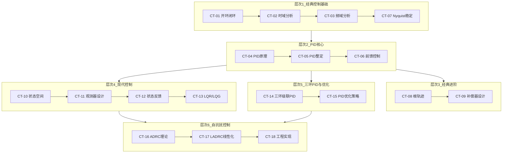

# 📊 控制理论基础

> **核心理念**：从控制理论理解电机控制——从经典控制的频域/时域分析到现代控制的状态空间/观测器，再到前沿的自抗扰控制(ADRC/LADRC)

---

## 学习路径总览

---

## 模块列表

### 经典控制基础

| 编号 | 模块 | 核心问题 | 难度 |
|------|------|---------|------|
| CT-01 | [开环与闭环控制](CT-01-Open-Loop-Closed-Loop.md) | 为什么闭环控制能抑制扰动？ | ★★☆☆☆ |
| CT-02 | [时域分析](CT-02-Time-Domain-Analysis.md) | 如何从阶跃响应判断系统性能？ | ★★☆☆☆ |
| CT-03 | [频域分析与Bode图](CT-03-Frequency-Response-Bode.md) | 如何从Bode图判断稳定性？ | ★★★☆☆ |
| CT-07 | [Nyquist稳定判据](CT-07-Nyquist-Stability.md) | Nyquist与Bode的判据有何关系？ | ★★★★☆ |

### PID控制

| 编号 | 模块 | 核心问题 | 难度 |
|------|------|---------|------|
| CT-04 | [PID控制原理](CT-04-PID-Control-Principles.md) | 为什么FOC电流环只用PI？ | ★★★☆☆ |
| CT-05 | [PID整定与工程实现](CT-05-PID-Tuning-Implementation.md) | 如何在真实电机上调好PI参数？ | ★★★★☆ |
| CT-06 | [前馈控制](CT-06-Feedforward-Control.md) | 前馈如何在不影响稳定性下提升性能？ | ★★★☆☆ |

### 经典控制进阶

| 编号 | 模块 | 核心问题 | 难度 |
|------|------|---------|------|
| CT-08 | [根轨迹法](CT-08-Root-Locus.md) | 如何通过根轨迹设计控制器？ | ★★★★☆ |
| CT-09 | [补偿器设计](CT-09-Compensator-Design.md) | 超前/滞后补偿器怎么设计？ | ★★★★☆ |

### 现代控制理论

| 编号 | 模块 | 核心问题 | 难度 |
|------|------|---------|------|
| CT-10 | [状态空间方法](CT-10-State-Space.md) | 如何用状态方程描述电机系统？ | ★★★★☆ |
| CT-11 | [状态观测器设计](CT-11-Observer-Design.md) | 如何估计不可测的状态？ | ★★★★★ |
| CT-12 | [状态反馈控制](CT-12-State-Feedback.md) | 极点配置与LQR如何设计？ | ★★★★☆ |
| CT-13 | [LQR/LQG最优控制](CT-13-LQR-LQG.md) | 如何权衡控制性能与控制代价？ | ★★★★★ |

### 三环级联与PID优化

| 编号 | 模块 | 核心问题 | 难度 |
|------|------|---------|------|
| CT-14 | [三环级联PID控制](CT-14-Cascaded-PID-Control.md) | 电流环→速度环→位置环如何协同？10:3:1带宽法则如何推导？ | ★★★★☆ |
| CT-15 | [PID优化策略](CT-15-PID-Optimization-Strategies.md) | 如何通过anti-windup、微分滤波、自适应PID提升工程鲁棒性？ | ★★★★☆ |

### 自抗扰控制(ADRC/LADRC)

| 编号 | 模块 | 核心问题 | 难度 |
|------|------|---------|------|
| CT-16 | [ADRC自抗扰控制理论](CT-16-ADRC-Theory.md) | 如何通过TD+ESO+NLSEF实现"不依赖模型"的控制？ | ★★★★★ |
| CT-17 | [LADRC线性自抗扰控制](CT-17-LADRC-Linear-ADRC.md) | 如何用带宽参数化将ADRC简化为可工程实现的LADRC？ | ★★★★★ |
| CT-18 | [ADRC/LADRC工程实现](CT-18-ADRC-LADRC-Implementation.md) | LADRC电流环/速度环/位置环的完整C代码如何实现？ | ★★★★☆ |

---

## 学习建议

### 零控制基础入门路线
1. 先学CT-01（开环闭环）和CT-02（时域分析），建立控制系统基本概念
2. 学CT-03（频域分析），掌握Bode图这个核心分析工具
3. 学CT-04（PID原理）和CT-05（PID整定），掌握工业控制最核心的工具
4. 学CT-06（前馈控制），理解前馈+反馈复合控制
5. 学CT-14（三环级联）和CT-15（PID优化），进阶到伺服系统级设计

### 电机控制工程师进阶路线
1. 从CT-14（三环级联PID）开始，理解伺服系统的完整控制架构
2. 学CT-15（PID优化策略），掌握anti-windup、bumpless transfer等工程必备技巧
3. 学CT-10（状态空间）和CT-11（观测器设计），建立现代控制理论基础
4. 学CT-16（ADRC理论）→CT-17（LADRC）→CT-18（工程实现），掌握新一代控制范式
5. 将ADRC/LADRC与现有PI方案对比，根据实际需求选择控制策略

### ADRC学习路径（专线）
1. 必须先学CT-04（PID原理）——理解PID的缺陷才能理解ADRC的设计动机
2. 必须学CT-11（观测器设计）——ESO是观测器的扩展，没有观测器基础无法理解
3. 然后学CT-16（ADRC理论）——掌握TD(fhan)、ESO(fal)、NLSEF三大组件
4. 再学CT-17（LADRC）——理解线性化和带宽参数化的工程价值
5. 最后学CT-18（工程实现）——拿到可以跑在DSP上的完整C代码

### 每个模块的学习方法
1. 先读「核心摘要」，快速把握要点
2. 精读「技术原理」，理解数学本质
3. 跟读「C代码」实现，将公式转化为可运行的代码
4. 完成「实践练习」，检验理解深度
5. 阅读「工程案例」，建立真实问题→解决方案的映射
6. 选读「前沿拓展」，了解学术前沿

---

## 文档信息
- 知识体系：电控超级知识库 / 控制理论基础
- 模块总数：18（CT-01 ~ CT-18）
- 覆盖范围：经典控制 + 现代控制 + PID专题 + ADRC/LADRC
- 更新日期：2026-05-27