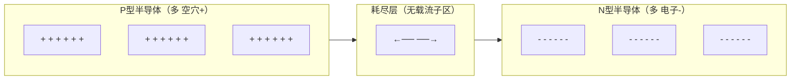
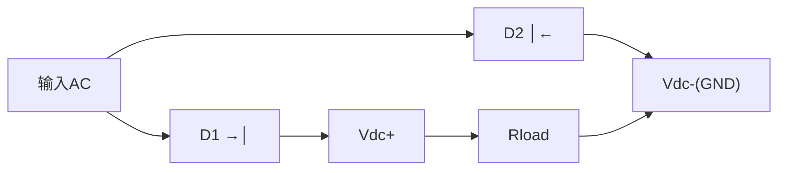
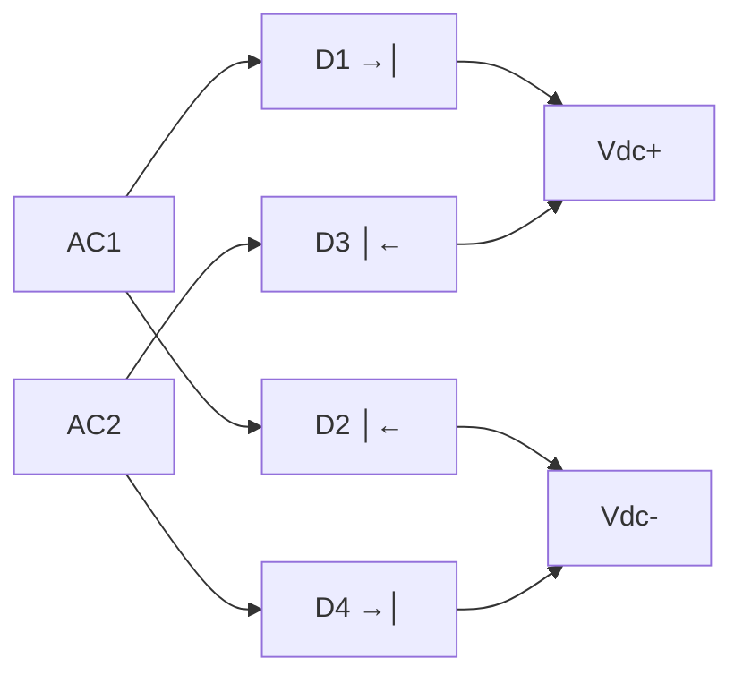
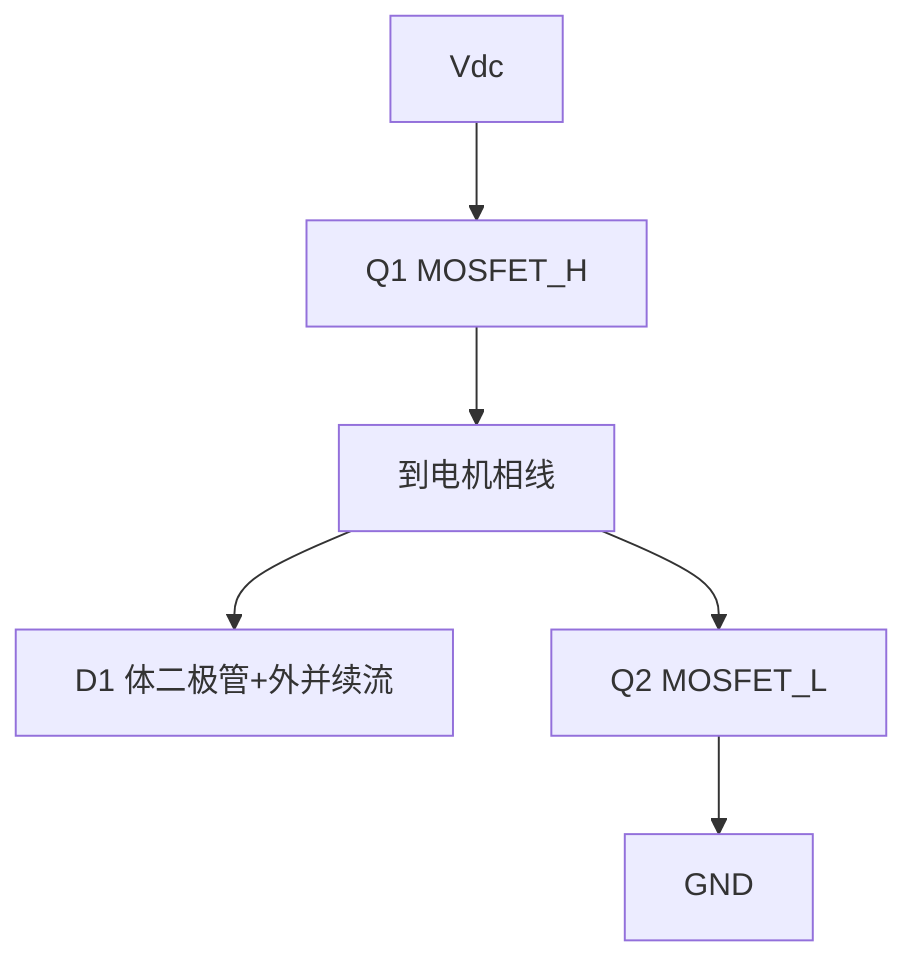
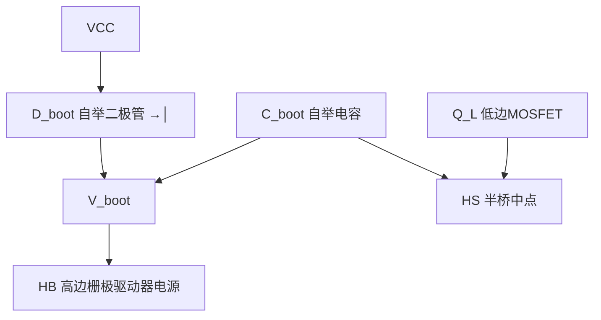

# EE-02: 二极管与整流电路

**副标题：从PN结到三相桥——电驱系统整流与续流的物理基础**

---

## 1. 📌 核心摘要 ★★☆☆☆ 🔰📚

**一句话讲清楚**：二极管是电子世界的"单向阀"——正向导通、反向截止。在电驱系统中，整流桥将交流转为直流母线，续流二极管保护MOSFET不被感性负载反电动势击穿，自举二极管为高边栅极驱动器提供浮动电源。

**认知挂钩**：很多初学者以为"二极管就是个压降0.7V的开关"，**这是严重过于简化的理解！** 实际上，二极管的动态行为——反向恢复时间(trr)、结电容(Cj)、正向压降温度系数——在PWM开关频率达到20kHz以上时，直接决定了逆变器的效率和可靠性。

**与电机控制的关联**：
- 🔗 **续流二极管**：PWM关断时，电机电感电流通过续流二极管续流 → 防止电压尖峰击穿MOSFET
- 🔗 **自举二极管**：半桥栅极驱动中，为高边浮动电源充电 → `Vboot = VCC - Vf_diode`
- 🔗 **整流桥**：三相整流将交流电网转为直流母线 → 选型错误导致电容爆炸
- 🔗 **SiC肖特基二极管**：提升逆变器效率，消除反向恢复损耗

---

## 2. 🤔 问题引入 ★★☆☆☆ 🔰

### 工程师的真实困惑

**场景1：自举电容电压不足**
```
工程师D:"高边MOSFET驱动不了,示波器看自举电容电压只有5V..."
问题现象:
- 低占空比时高边驱动失败
- 自举电容电压逐渐下降
- 二极管发烫
```

**场景2：整流桥选型错误**
```
工程师E:"整流桥后面的大电容开机就爆了..."
问题现象:
- 上电瞬间电流过大
- 浪涌电流没有限制
- 整流桥过热烧毁
```

**场景3：续流二极管反向恢复问题**
```
工程师F:"MOSFET开关波形有很大的电流尖峰..."
问题现象:
- 开关瞬间有大电流尖峰
- 效率计算偏低
- EMI超标
```

### 核心问题

- 自举电压不足 → 不理解自举二极管的开关速度要求
- 电容爆炸 → 不理解整流冲击电流和浪涌抑制
- 开关尖峰 → 不理解续流二极管反向恢复(trr)

### 学习目标

✅ **理解PN结物理机制** - 多数载流子与少数载流子，耗尽层
✅ **掌握整流电路设计** - 半波/全波/桥式整流，滤波电容选型
✅ **区分二极管类型** - 普通整流、快恢复、肖特基、SiC、稳压管
✅ **理解动态特性** - 反向恢复时间trr，结电容恢复电荷Qrr
✅ **掌握电机驱动应用** - 续流、自举、整流、保护

---

## 3. 💡 直观理解 ★★☆☆☆ 🔰💡

### 类比1：二极管就像"单向旋转门"

```
旋转门只允许一个方向通过 → 二极管只允许一个方向导电

正向偏置：门打开（电流通过）
  Anode(+) ─────→│───── Cathode(-)
  
反向偏置：门锁死（电流阻断）
  Anode(-) ─────→│───── Cathode(+)
          ← 不通！
  
但别忘了一个细节：门不是瞬间关闭的！
  → 反向恢复时间 trr
```

### 类比2：PN结就像"两军对峙"



**电机驱动中的直观理解**：
- 续流二极管：当MOSFET关断时，绕组电流不能突变（L×di/dt），必须有一条路径继续流通 → 二极管提供了这条路径
- 自举二极管：每次低边MOSFET开通时，通过二极管给自举电容充电

### 关键参数速查

| 参数 | 符号 | 物理意义 | 电机驱动影响 |
|------|------|---------|-------------|
| 正向压降 | Vf | 导通时两端电压 | 导通损耗 P = Vf×If |
| 反向恢复时间 | trr | 从导通到截止的时间 | 开关损耗、EMI尖峰 |
| 反向恢复电荷 | Qrr | 反向恢复期间流动的电荷 | Ipeak = Qrr/trr |
| 结电容 | Cj | PN结寄生电容 | 高频漏电流 |
| 反向耐压 | Vrrm | 最大反向电压 | 安全裕量 |

---

## 4. 🔬 技术原理 ★★★☆☆ 📚

### 4.1 PN结物理

#### 4.1.1 肖克利二极管方程

$$
I = I_S \times (e^{V_D / (n V_T)} - 1)
$$

其中：`IS` = 反向饱和电流（约nA~μA），`VT = kT/q ≈ 26mV`（室温），`n` = 理想因子（1~2）

```
正向偏置（VD >> VT）：
  I ≈ IS × e^(VD/nVT)  → 电流指数增长
  
  硅管VD ≈ 0.6~0.7V（室温，额定电流）
  肖特基VD ≈ 0.2~0.4V（低压降优势！）
  
反向偏置（VD < 0）：
  I ≈ -IS  → 极小的反向漏电流
```

#### 4.1.2 正向压降的温度系数

硅二极管：`dVf/dT ≈ -2mV/°C`（负温度系数）

这意味着温度升高 → Vf下降 → 在并联应用中可能导致电流集中 → 热失控！

**工程教训**：二极管一般不适合直接并联均流（不像MOSFET那样有正温度系数自动均流特性）。

#### 4.1.3 反向击穿

普通二极管反向电压超过VRRM → 雪崩击穿 → 永久损坏（除非是稳压管）。

### 4.2 整流电路

#### 4.2.1 半波整流



**基本不用在电机驱动中**——效率太低，纹波太大。

#### 4.2.2 全波桥式整流



#### 4.2.3 滤波电容计算

整流后的纹波频率：三相整流 = 6×f_line（300Hz@50Hz电网）

$$
C_{filter} = \frac{I_{load}}{2 \times f_{ripple} \times \Delta V}
$$

```
三相整流示例（380V 50Hz电网）：
  f_ripple = 6 × 50 = 300Hz
  Iload = 10A, ΔVmax = 20V
  C = 10/(2 × 300 × 20) = 833μF
  
  实际选型：1000μF/450V电解电容
```

#### 4.2.4 浪涌电流问题

上电瞬间，滤波电容相当于短路！浪涌电流极大：

$$
I_{inrush} = \frac{V_{peak}}{ESR_{cap} + R_{wiring}}
$$

```
310V / (0.5Ω + 0.1Ω) ≈ 517A! ← 可以熔化整流桥!
```

**必须加浪涌限制**：（1）NTC热敏电阻；（2）预充电继电器+限流电阻；（3）软启动电路

---

### 4.3 二极管类型与选型

| 类型 | Vf典型 | trr典型 | 用途 | 电机驱动应用 |
|------|--------|---------|------|-------------|
| 普通整流(1N4007) | 1.1V@1A | 2~5μs | 50/60Hz整流 | 输入整流桥（低频） |
| 快恢复(FRD) | 1.5V@10A | 50~200ns | 高频整流 | 开关电源输出整流 |
| 超快恢复 | 1.5V@10A | 25~75ns | 高频整流 | 逆变器续流（低频） |
| 肖特基 | 0.3~0.5V | <10ns | 低压高频 | 自举二极管首选！ |
| SiC肖特基 | 1.5V@10A | 0ns（无trr!） | 高压高频 | 高性能逆变器续流 |
| 稳压管(Zener) | — | — | 电压钳位 | 栅极保护、基准电压 |

**电机驱动中的二极管选型黄金法则**：

> 自举二极管 → 必须用肖特基（低压降 + 超快恢复 + 低结电容），绝对不能用1N4007！
> 
> 逆变器续流 → PWM频率 <10kHz可用FRD，>20kHz必须考虑SiC肖特基消除反向恢复损耗
>
> 输入整流桥 → 普通整流二极管即可（50Hz不影响）

---

### 4.4 反向恢复特性——高频开关的死敌

**物理机制**：

当二极管从正向导通突然转为反向偏置时，存储在PN结中的少数载流子必须先被"扫出"才能恢复阻断能力。这段时间 = **反向恢复时间(trr)**。

$$
t_{rr} = t_a + t_b
$$

- `ta`：存储时间（载流子扫出阶段）
- `tb`：下降时间（耗尽层重建阶段）

**反向恢复电流峰值**：
$$
I_{RRM} \approx \sqrt{\frac{2 \times Q_{rr} \times di/dt}{S}}
$$

```
电机驱动中的影响（以20kHz PWM为例）：

  MOSFET dV/dt = 100V/50ns = 2000V/μs
  续流二极管 trr = 100ns (快恢复型)
  
  反向恢复期间：上下管同时导通！→ 直通电流尖峰
  I_shoot = Vdc / (Rds_on_high + Rds_on_low)
  
  如果Vdc=310V, Rds_on=0.1Ω
  I_shoot = 310/0.2 = 1550A!!! 🔥
```

**解决方案**：
1. **SiC肖特基二极管**：多数载流子器件，理论上trr=0（无少数载流子存储）
2. **死区时间**：确保续流二极管完全恢复后再开通对管
3. **软开关技术(ZVS/ZCS)**：减小dV/dt和dI/dt

---

## 5. 🔗 交叉视角 ★★★☆☆ 💡

### 5.1 续流二极管 → 逆变器桥臂保护

**🔗 硬件-安全关联**：



### 5.2 自举二极管 → 高边栅极驱动



**自举二极管选型四要素**：
1. **Vf低** → 自举电压尽可能高 → 肖特基二极管（Vf≈0.3V）
2. **trr短** → 高频PWM下能快速恢复 → trr < 20ns
3. **Cj小** → 减小开关节点HS的寄生电容 → 减小开关损耗
4. **VRRM够** → 耐压 > Vdc_max + VCC → 通常≥100V

### 5.3 整流桥 → 直流母线生成


---

## 6. 🎯 工程案例 ★★★★☆ 🎯

### 案例1：自举二极管用1N4148导致高边驱动失败

**项目背景**：
```
应用:48V BLDC驱动器
栅极驱动:IR2110S
自举二极管:1N4148（信号二极管）
PWM频率:16kHz
问题:高占空比时高边MOSFET驱动失败
```

**诊断过程**：
```
步骤1:示波器测V_boot → 11.2V（正常）
步骤2:示波器测高边Vgs → 从11.2V缓慢下降到8V
步骤3:分析1N4148反向漏电流 → 25nA@20V（正常）
步骤4:发现真正原因 → 1N4148的Vf=1V@10mA，Cboot充电不足
     Vboot = VCC - Vf = 12-1 = 11V，余量不足！
     且自举电容充电需通过1N4148 → 充电电流受限
```

**根本原因**：1N4148正向压降过大(1V)，且不是为功率充电设计的！

**解决方案**：
```
方案A:换用肖特基二极管BAT54S ✅
  Vf = 0.32V@10mA, trr < 5ns
  Vboot = 12 - 0.32 = 11.68V，余量充足

方案B:换用超快恢复ES1J ✅✅
  Vf = 0.92V@1A，可提供更大充电电流
  适合大自举电容场景
```

### 案例2：整流桥后无浪涌限制导致电容爆炸

**项目背景**：
```
应用:1.5kW变频器
输入:单相220VAC
整流:GBJ2510（25A/1000V桥）
母线电容:2×680μF/400V串联
问题:多次上电后电容鼓包,最终爆炸
```

**诊断过程**：
```
步骤1:计算浪涌电流
  上电时刻：Vpeak = 311V，电容等效短路
  回路阻抗：线路0.1Ω + 电容ESR 0.3Ω = 0.4Ω
  Iinrush = 311/0.4 = 778A! ← GBJ2510额定浪涌300A(8.3ms) ← 严重超标!
  
步骤2:计算电容纹波电流
  负载电流 = 1500/311 ≈ 4.8A
  纹波Irms ≈ 4.8 × 2 = 9.6A ← 单电容额定纹波3A ← 严重超标!
```

**根本原因**：(1) 无浪涌限制 → 整流桥和电容反复受冲击 → 电容ESR增大 → 发热 → 鼓包；(2) 电容纹波电流不足

**解决方案**：
```
方案A:加NTC热敏电阻(NTC 10D-15) ✅
  冷态10Ω → 限流31A
  热态0.2Ω → 损耗0.2×4.8²=4.6W（可接受）

方案B:加预充电继电器 ✅✅
  上电先通过100Ω/10W电阻充电,1秒后继电器短路电阻
  工业变频器标准做法!
```

### 案例3：SiC二极管替代Si FRD提升效率

**项目背景**：
```
应用:20kW电动汽车逆变器
母线电压:400V
PWM:16kHz
原设计:Si超快恢复续流二极管（trr=45ns）
问题:效率88%，续流二极管损耗占总损耗18%
```

**换用SiC肖特基（trr=0）后**：
```
Si FRD损耗计算：
  反向恢复损耗：P_rr = f_PWM × Vdc × Qrr
  Qrr = 500nC（10A等级Si FRD）
  P_rr_single = 16000 × 400 × 500e-9 = 3.2W/管
  6管总计 = 19.2W！

SiC肖特基：
  Qrr ≈ 0（无少子存储）
  P_rr ≈ 0W！
  
效率提升：19.2W/20000W = 0.096% → 看似不大
但总损耗降低约15%，系统效率从88%提升到89.5%
且减小了散热器体积30%！
```

### 案例4：体二极管反向恢复导致桥臂直通

**问题**：MOSFET内部的体二极管是寄生的PN结二极管，trr通常很差（100~500ns）。在高dV/dt下...

```
桥臂切换瞬间：
  Q_L关断 → 负载电流转移到Q_H的体二极管
  Q_H体二极管导通（正向）
  一段时间后Q_H开通 → 但体二极管仍在反向恢复！
  → 瞬间直通电流！→ 过热损坏!
```

**解决**：
1. 增加死区时间（> trr + 余量，通常200~500ns）
2. 外部并联SiC肖特基二极管（大部分电流走外部二极管，不走慢速体二极管）
3. 选择体内二极管trr更短的MOSFET（如CoolMOS、GaN HEMT）

### 案例5：整流滤波电容的"80%额定电压"规则

```
工程经验：电解电容长期工作电压不应超过额定电压的80%

380V三相整流：Vdc_max = 537V（带电容滤波空载）
→ 电容额定电压 ≥ 537/0.8 = 671V → 选700V及以上品级
→ 如果电网波动+10%：Vdc_max = 591V → 需740V品级 → 选800V

实际方案：2×400V/680μF串联（等效800V/340μF）
→ 配合均压电阻（2×100kΩ并联在每个电容上）
```

---

## 7. 📝 实践练习

### 练习1：计算题——整流滤波电容

单相220VAC/50Hz，桥式整流，负载电流2A，要求纹波<5V。求滤波电容值。

*参考答案：纹波频率=2×50=100Hz；C = I/(2×f×ΔV) = 2/(2×100×5) = 2000μF → 选2200μF/400V*

### 练习2：计算题——自举电容充电时间

VCC=12V，D_boot Vf=0.4V，Cboot=10μF，自举二极管动态电阻≈2Ω。低边开通时间最短20μs。Cboot能否在此时间内从0充到11V？

*参考答案：τ = R×C = 2Ω×10μF=20μs。20μs=1τ → 充到63%即7.4V → 不够！需要减小Cboot到1μF：τ=2μs，20μs=10τ → 充满 ✅ 或增大开通时间*

### 练习3：设计题——三相整流桥选型

3kW变频器，输入三相380VAC，效率95%。选型整流桥（电流、电压、浪涌裕量）。

*参考答案：Idc = 3000/(0.95×537V) ≈ 5.9A；Iac_rms ≈ Idc×0.82 ≈ 4.8A；整流桥额定≥4.8×2.5=12A(FM)；电压≥537×1.5=805V；浪涌限制后<100A。选GBJ1508(15A/800V)或GBJ2510(25A/1000V)*

### 练习4：诊断题——自举电压逐渐下降

半桥栅极驱动，占空比从50%逐渐升到95%，高边Vgs从12V跌落到7V。分析原因并给出解决方案。

*参考答案：占空比高 → 低边导通时间短 → Cboot充电时间不足 → 电压下降。解决：(1) 降低PWM频率增加充电时间；(2) 减小Cboot（但要确保储存足够电荷驱动MOSFET门极）；(3) 使用隔离电源替代自举电路（100%占空比场景）；(4) 使用电荷泵辅助充电*

### 练习5：选择题

**题目1**：肖特基二极管与普通硅二极管的主要区别是？
- A. 更高耐压  B. 更低压降和更快速度  C. 更高温度  D. 更大电流

> 答案：B

**题目2**：三相全波桥式整流后纹波频率是电网频率的几倍？
- A. 2倍  B. 3倍  C. 6倍  D. 12倍

> 答案：C

**题目3**：SiC肖特基二极管的优势是？
- A. 低Vf  B. 零反向恢复  C. 高耐压  D. 低成本

> 答案：B（零trr是其区别于Si二极管的核心优势）

**题目4**：自举二极管最关键参数是？
- A. 耐压  B. 最大电流  C. 反向恢复时间  D. 封装

> 答案：C（高频PWM下必须快速恢复）

**题目5**：整流桥后必须加浪涌限制的原因是？
- A. 滤波电容上电瞬间相当于短路  B. 电网电压波动  C. 提高功率因数  D. 降低噪声

> 答案：A

---

**文档信息**：
- 模块编号：EE-02
- 知识体系：电子基础
- 模块名称：二极管与整流电路
- 电机关联：续流二极管→逆变器保护，自举二极管→高边驱动，整流桥→直流母线
</rewriter>
</invoke>
</｜DSML｜tool_c