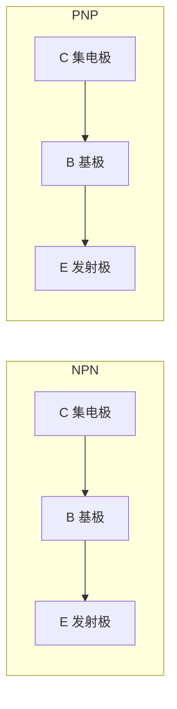
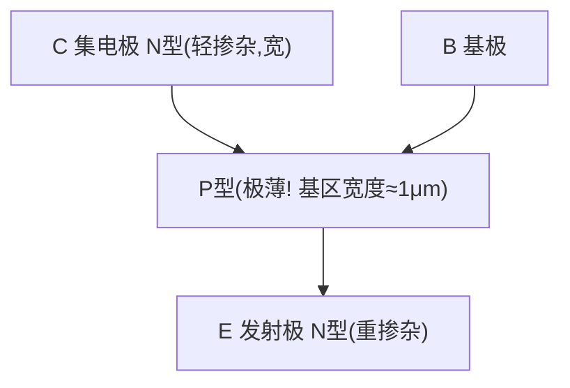
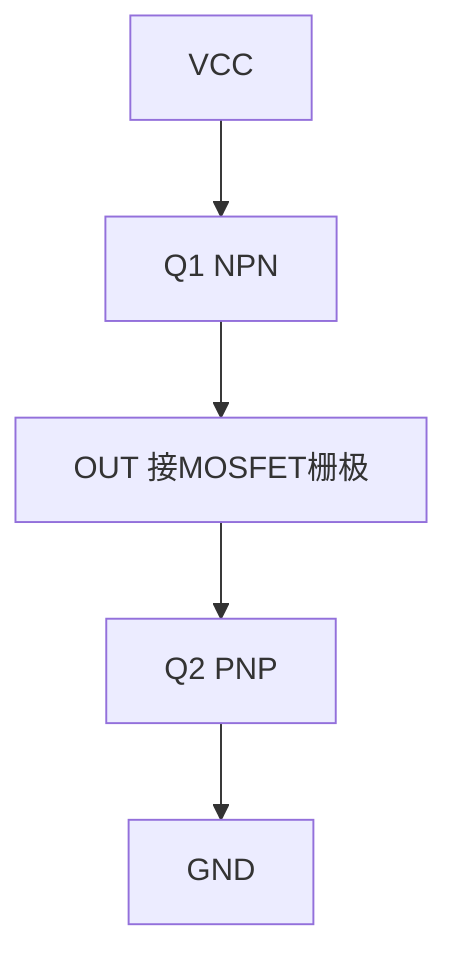

# EE-03: 三极管（BJT）基础

**副标题：从少子注入到推挽输出——栅极驱动中的电流放大基石**

---

## 1. 📌 核心摘要 ★★★☆☆ 🔰📚

**一句话讲清楚**：双极型晶体管(BJT)是一种电流控制型器件——基极小电流(μA~mA)控制集电极大电流(A级)，工作在放大区可实现线性放大，工作在开关区可用作高速开关。在电驱系统中，BJT主要用于栅极驱动器的推挽输出级和辅助电源。

**认知挂钩**：很多数字工程师只认识MOSFET，问到BJT就说"过时了"，**这是肤浅的偏见！** BJT在特定场景下不可替代：栅极驱动器的图腾柱输出需要BJT的电流放大能力提供A级的峰值驱动电流，过流保护中的退饱和检测依赖BJT的饱和压降特性，辅助电源的反馈环路中BJT仍广泛使用。

**与电机控制的关联**：
- 🔗 **栅极驱动推挽输出**：NPN+PNP图腾柱 → 提供±2A以上的栅极峰值电流
- 🔗 **退饱和保护(Desat)**：BJT饱和压降Vce(sat) → 判断MOSFET是否短路
- 🔗 **BJT vs MOSFET**：BJT是电流驱动(MOSFET是电压驱动)，BJT导通压降低于高压MOSFET

---

## 2. 🤔 问题引入 ★★☆☆☆ 🔰

### 工程师的真实困惑

**场景1：栅极驱动能力不足**
```
工程师G:"MCU的PWM引脚直接驱动MOSFET,但MOSFET发热严重..."
问题现象:
- 3.3V的IO口只能提供8mA
- MOSFET栅极电容Ciss=2000pF
- 开关时间过长,开关损耗大
```

**场景2：图腾柱电路烧BJT**
```
工程师H:"栅极驱动的NPN/PNP三极管经常烧坏..."
问题现象:
- 推挽输出级频繁失效
- 不知道如何选择BJT的Ic额定值
- 布局不合理,寄生电感导致振荡
```

### 核心问题

- 驱动能力不足 → 不理解BJT作为电流放大器的价值
- BJT烧毁 → 不理解BJT的SOA(安全工作区)和峰值电流限制

### 学习目标

✅ **理解BJT工作原理** - NPN/PNP的少子注入和电流放大
✅ **掌握三个工作区** - 放大区/饱和区/截止区，各区的偏置条件
✅ **理解共射放大器** - 偏置设计，增益计算
✅ **掌握开关应用** - 饱和条件，存储时间问题
✅ **理解图腾柱输出** - NPN+PNP互补推挽驱动MOSFET栅极

---

## 3. 💡 直观理解 ★★☆☆☆ 🔰💡

### 类比1：BJT就像"水龙头"

```
水龙头系统               BJT
───────────             ────
水龙头手柄  (Ib)   ↔    基极电流   (小)
主管道水流  (Ic)   ↔    集电极电流 (大)
阀门开度          ↔    电流增益 hFE

BJT核心方程：Ic = hFE × Ib
  
水龙头轻轻一拧(小Ib) → 大量水流过(Ic)
BJT基极小电流 → 集电极大电流

典型hFE = 100~400倍！
Ib = 1mA → Ic = 100~400mA
```

### 类比2：NPN和PNP就像"双胞胎兄弟"



### 关键概念速查

| 参数 | 符号 | 物理意义 | 典型值 |
|------|------|---------|--------|
| 直流电流增益 | hFE | Ic/Ib（直流） | 100~400 |
| 交流电流增益 | hfe | ΔIc/ΔIb（小信号） | 50~300 |
| 基极-发射极电压 | Vbe | 导通时B-E压降 | 0.6~0.7V(Si) |
| 饱和压降 | Vce(sat) | 深度饱和时C-E压降 | 0.1~0.3V |
| 厄利电压 | VA | 输出阻抗指标 | 50~200V |

---

## 4. 🔬 技术原理 ★★★☆☆ 📚

### 4.1 BJT工作原理

#### 4.1.1 NPN三极管结构



#### 4.1.2 三个工作区

| 工作区 | B-E偏置 | B-C偏置 | 特征 | 应用 |
|--------|---------|---------|------|------|
| 截止区 | 反向/零 | 反向 | Ic≈0 | 开关OFF |
| 放大区 | 正向 | 反向 | Ic=hFE×Ib | 线性放大 |
| 饱和区 | 正向 | 正向 | Vce≈0.2V | 开关ON |

**饱和条件**：
$$
I_b > \frac{I_c}{h_{FE}}
$$

饱和深度 = `Ib_actual / (Ic/hFE)`，通常取3~5倍确保深度饱和。

#### 4.1.3 电流-电压关系（Ebers-Moll模型）

$$
I_c = I_S \times (e^{V_{BE}/V_T} - 1)
$$

小信号跨导：
$$
g_m = \frac{I_c}{V_T} = \frac{I_c}{26mV}
$$

```
Ic = 1mA时：gm = 1mA/26mV = 38.5 mS（mho = 西门子）
Ic = 10mA时：gm = 385 mS → 增益极高!
```

### 4.2 共射放大器

工作点（Q点）设计：Vce_Q ≈ VCC/2（最大输出摆幅）

电压增益：
$$
A_v = -g_m \times (R_c \parallel r_o)
$$

其中 `ro = VA/Ic`（厄利电阻）

```
示例：Ic=1mA, Rc=5kΩ, VA=100V
  gm = 1mA/26mV = 38.5mS
  ro = 100V/1mA = 100kΩ
  RL = 5kΩ ∥ 100kΩ = 4.76kΩ
  Av = -38.5mS × 4.76kΩ = -183 V/V
  
  输入10mV → 输出1.83V!
```

### 4.3 BJT开关应用

#### 4.3.1 开关特性

基极驱动电流设计：
$$
I_b > \frac{I_{c\_max}}{h_{FE\_min}}
$$

基极电阻计算：
$$
R_b = \frac{V_{drive} - V_{be}}{I_b}
$$

```
若Ic_max=100mA, hFE_min=100
则Ib > 1mA, 取3×余量 → Ib=3mA
Rb = (3.3V - 0.7V) / 3mA = 867Ω → 820Ω
```

#### 4.3.2 存储时间——BJT速度瓶颈

BJT从饱和导通转为截止时，基区存储的少数载流子需要时间"扫出"——**存储时间(ts)**，通常200ns~2μs。这是BJT作为开关的最大缺陷。

加速关断：OFF时给B-E加负压 → 加速少子扫出 → ts从500ns降至50ns。

---

### 4.4 图腾柱（推挽）输出——电机驱动核心BJT应用

#### 4.4.1 电路结构



#### 4.4.2 峰值电流能力

MOSFET栅极等效为电容Ciss，图腾柱提供的峰值电流：
$$
I_{peak} = h_{FE} \times I_{drive\_in}
$$

```
MCU IO输出10mA驱动图腾柱输入 → 若BJT hFE=200
  → Ipeak_source = 200×10mA = 2A!
  → 栅极电容Ciss=2000pF充电10V: t = C×V/I = 2000pF×10V/2A = 10ns!
  
  对比：MCU直接驱动 → t = 2000pF×10V/10mA = 2μs
  速度提升200倍！
```

---

## 5. 🔗 交叉视角 ★★★☆☆ 💡

### 5.1 BJT图腾柱 → MOSFET栅极驱动

这是BJT在电机驱动中最关键的应用：


### 5.2 BJT vs MOSFET —— 选型决策

| 特性 | BJT | MOSFET |
|------|-----|--------|
| 驱动方式 | 电流驱动(需Ib) | 电压驱动(需Vgs) |
| 导通压降 | Vce(sat)≈0.2V(低压) | Rds_on×Id |
| 温度系数 | 负(Vbe↓)→热失控风险 | 正(Rds_on↑)→自均流 |
| 开关速度 | 慢(存储时间) | 快(栅极电荷) |
| 高压特性 | 好(无Rds_on剧增) | Rds_on随耐压急剧增大 |

**电机驱动中的结论**：功率开关用MOSFET，图腾柱输出轮用BJT。

---

## 6. 🎯 工程案例 ★★★★☆ 🎯

### 案例1：MCU直接驱动MOSFET的惨痛教训

**问题**：STM32的3.3V GPIO直接驱动IRF540（Ciss=1700pF，Vgs_th=3V）

**分析**：
```
GPIO输出电流 = 8mA（最大）
栅极充电时间 ≈ Ciss×Vgs/I = 1700pF×3.3V/8mA = 700ns

PWM频率=20kHz（周期50μs），上升时间700ns占1.4%
→ 开关损耗占总功率约10~20%
→ MOSFET发热严重，效率仅80%
```

**解决**：加BJT图腾柱 → 峰值电流2A → 上升时间=2.8ns → 开关损耗几乎消除！

### 案例2：图腾柱BJT选型错误

**问题**：用MMBT3904(Ic_max=200mA)做图腾柱驱动IRFP460(Ciss=4200pF)

**分析**：
```
Ipeak = Ciss×dV/dt = 4200pF×10V/20ns = 2.1A
但MMBT3904 Ic_max = 200mA ← 严重不足!
→ BJT进入饱和 → Vce上升 → 栅极电压不足 → MOSFET不完全导通 → 烧毁!
```

**选型准则**：图腾柱BJT的Ic_max > Ciss × dV/dt_desired

### 案例3：BJT存储时间导致上下管共通

**问题**：用低速BJT(2N2222, ts≈300ns)做图腾柱，PWM=50kHz。

NPN关断需要300ns，但PNP开通瞬间完成 → 300ns内上下管同时导通 → 直通电流！虽有限流电阻，但仍产生EMI和额外功耗。

**解决**：选高速BJT（ts<50ns），如MMBT4401/4403

### 案例4：退饱和检测中的BJT

栅极驱动IC中的退饱和保护利用BJT检测MOSFET漏极电压：MOSFET导通时Vds = Id×Rds_on应较小；短路时Id剧增→Vds增大→超过Desat阈值→BJT比较器触发保护关断

### 案例5：线性稳压电源——栅极驱动辅助电源

15V转12V线性稳压：NPN接成射随器 → Vout = Vz - Vbe = 12-0.7 = 11.3V，达林顿连接→hFE=hFE1×hFE2→极低输出阻抗

---

## 7. 📝 实践练习

### 练习1：共射放大器计算

BJT偏置：VCC=12V, Ic=2mA, Vce=6V, hFE=200, Vbe=0.7V。求Rc, Re, 基极分压电阻。

*参考答案：Rc=(12-6)/2mA=3kΩ；Ve=0.1×12=1.2V；Re=1.2V/2mA=600Ω；Vb=1.2+0.7=1.9V；Ib=2mA/200=10μA；基极分压电流=10×Ib=100μA；R2=1.9/100μA=19kΩ；R1=(12-1.9)/110μA=91.8kΩ。标称：Rc=3kΩ,Re=620Ω,R1=91kΩ,R2=18kΩ*

### 练习2：图腾柱峰值电流计算

Ciss=3000pF，要求Vgs从0→12V在15ns内完成。BJT图腾柱hFE_min=150。求：(1)峰值栅极电流；(2)输入驱动电流Ib

*参考答案：(1) Ipeak=C×dV/dt=3000pF×12V/15ns=2.4A；(2) Ib=Ipeak/hFE=2.4/150=16mA→MCU可直接提供 ✅*

### 练习3：图腾柱晶体管选型

48V/500W BLDC驱动，MOSFET IRFB4110(Ciss=9600pF, Qg=150nC, Vgs=10V)，开关<50ns。选NPN/PNP型号。

*参考答案：Ipeak=9600pF×10V/50ns=1.92A；Vce≥15V；Ic_max≥2A脉冲。选MMBT4401/4403对管或PZT2222A/PZT2907A(SOT-223)。关键：ts<50ns高速型号*

### 练习4：选择题

**题目1**：NPN BJT处于放大区时，各极电位关系是？
- A. Vc>Vb>Ve  B. Vb>Vc>Ve  C. Ve>Vb>Vc  D. Vc>Ve>Vb

> 答案：A

**题目2**：BJT的hFE典型范围是？
- A. 1~10  B. 10~50  C. 100~400  D. 1000~10000

> 答案：C

**题目3**：BJT作为开关时的主要速度限制来自？
- A. 渡越时间  B. 存储时间  C. 上升时间  D. 扩散电容

> 答案：B

**题目4**：图腾柱输出电路由哪两个BJT组成？
- A. 两个NPN  B. 两个PNP  C. NPN+PNP  D. NPN+N-MOS

> 答案：C

**题目5**：BJT与MOSFET相比的主要劣势是？
- A. 导通压降高  B. 电流驱动复杂度高  C. 存储时间限制开关速度  D. B和C都正确

> 答案：D

---

**文档信息**：
- 模块编号：EE-03
- 知识体系：电子基础
- 模块名称：三极管（BJT）基础
- 电机关联：图腾柱栅极驱动输出级，退饱和保护，辅助电源
</rewriter>
</invoke>
</｜DSML｜tool_c