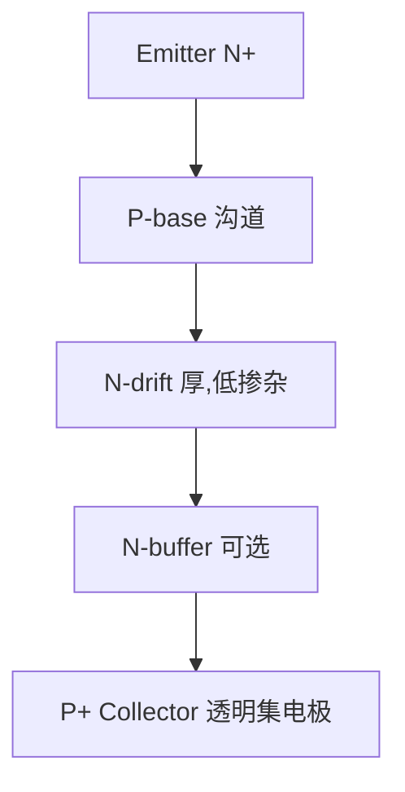
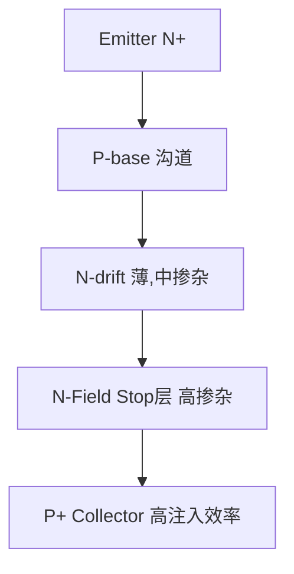
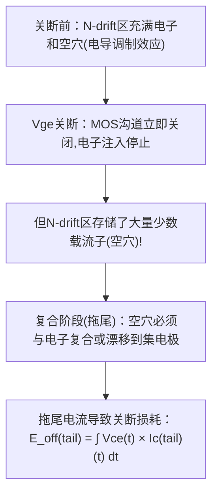
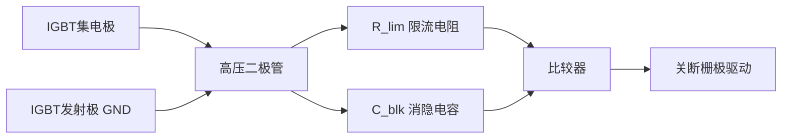

# EE-06 IGBT 原理与选型

**副标题：从PN结到栅极驱动，理解中高压功率开关的物理本质**

---

## 1. 📌 核心摘要 ★★★★☆ 🔰📚

**一句话讲清楚**：IGBT（绝缘栅双极晶体管）是MOSFET与BJT的"混血儿"——用MOS栅极实现电压控制（高输入阻抗、易驱动），用BJT导电机制实现低导通压降（大电流能力）。它是中高压电机驱动的核心功率开关，在5kW以上的伺服驱动器中几乎无可替代。

**认知挂钩**：很多从低压设计转来的工程师以为IGBT"就是高压MOSFET"，**这是严重误区！** IGBT的开关特性、驱动要求、损耗机制与MOSFET有根本性差异。不理解拖尾电流（tail current）、导通压降的正温度系数、短路耐受能力，轻则效率低下，重则炸管。

**与电机控制的关联**：
- 🔗 **FOC逆变器**：6个IGBT构成三相逆变桥，是电能→机械能转换的最后一级
- 🔗 **死区时间**：IGBT关断延迟远大于MOSFET → 死区时间需要更长 → 影响电流波形畸变
- 🔗 **开关频率**：IGBT通常限10~20kHz → 决定电流环带宽上限
- 🔗 **热设计**：IGBT功耗远大于MOSFET → 散热器设计是系统可靠性关键
- 🔗 **短路保护**：IGBT短路耐受时间仅10μs → 硬件保护必须极快

---

## 2. 🤔 问题引入 ★★★★☆ 🔰

### 工程师的真实困惑

**场景1：伺服驱动器炸管**
```
工程师A:"我用600V/30A MOSFET做的5kW伺服驱动器,一上满载就炸管..."
问题现象:
- 空载正常,加载至50%后炸管
- 炸管前散热器温度正常
- 示波器看Vds无明显过压
```

**场景2：开关损耗超预期**
```
工程师B:"IGBT模块的datasheet说单管损耗5W,实际测出来接近15W,散热器根本扛不住..."
问题现象:
- 开关频率16kHz时温升严重
- 降频到8kHz后温度正常
- 但8kHz的电流环带宽不满足电机控制需求
```

**场景3：死区时间设置**
```
工程师C:"我用MCU配置死区2μs,但IGBT波形上看到的实际死区远超这个值,导致电流波形畸变严重..."
问题现象:
- 电流过零点附近有明显畸变(零电流钳位效应)
- 低速运行时电流波形正弦度差
- 电机转矩脉动大
```

### 核心问题

这些问题的根本原因是什么？

**答案**：不理解IGBT的物理特性与MOSFET的差异！

- 炸管 → 开关损耗叠加关断拖尾电流 → 结温远超计算值
- 损耗大 → IGBT在16kHz高频下Eoff占主导 → 频率与损耗非线性
- 死区畸变 → IGBT关断延迟2~3μs + 拖尾 → 有效死区远超配置值

### 学习目标

读完本模块，你将能够：

✅ **理解IGBT结构演进** - NPT → PT → FS(Field Stop) → Trench-FS
✅ **掌握IGBT静动态特性** - 输出特性、转移特性、开关波形、拖尾电流
✅ **对比IGBT与MOSFET** - 应用场景选择（电压/电流/频率三大维度）
✅ **了解宽禁带器件** - Si/SiC/GaN的性能边界与应用定位
✅ **掌握电机驱动选型** - 电压等级、电流等级、开关频率、热设计的工程计算方法
✅ **理解IGBT模块封装** - 从分立器件到IPM的演进路径

---

## 3. 💡 直观理解 ★★★☆☆ 🔰💡

### 类比1：IGBT = "电子阀 + 放大器"的混合体

**生活场景**：想象一个水龙头（MOSFET栅极）控制一个高压水泵（BJT集电极）。


**关键理解**：
- 栅极（Gate）像MOSFET，只需电压控制，输入阻抗极高
- 集电极-发射极（Collector-Emitter）像BJT，导通时有固定的饱和压降
- 输入端是MOS，输出端是BJT，两者在芯片内部级联

### 类比2：拖尾电流就像"关门后还在滴水的水龙头"


**生活场景**：拧紧水龙头后，水管里残留的水还会流一会儿。IGBT关断时，BJT基区存储的少数载流子需要时间复合消失，这期间电流无法立即归零 → 产生可观的关断损耗。

### 类比3：IGBT vs MOSFET = 卡车 vs 跑车

| 特性 | MOSFET（跑车） | IGBT（卡车） |
|------|-------------|------------|
| 导通机制 | 单极性（多数载流子） | 双极性（多数+少数载流子） |
| 导通压降 | 电阻性，$R_{DS(on)}$ | 固定压降 $V_{CE(sat)}$ + 电阻分量 |
| 高压特性 | $R_{DS(on)} \propto V_{DS}^2$（高压时电阻急剧增大） | $V_{CE(sat)}$ 随电压升高基本恒定 |
| 开关速度 | 极快（ns级） | 较慢（μs级），有拖尾 |
| 适用电压 | <600V（优势区） | >600V（优势区） |
| 适用频率 | >50kHz | <30kHz |

**关键理解**：MOSFET在高压下的导通电阻与击穿电压的平方成正比（$R_{DS(on)} \propto BV_{DSS}^{2.5}$），而IGBT在高压下导通压降几乎不变。这就是为什么600V以上几乎都是IGBT的天下。

---

## 4. 🔬 技术原理 ★★★★☆ 📚🔧

### 4.1 IGBT结构演进

#### 4.1.1 基本结构：从MOSFET到IGBT


**核心差异**：IGBT将MOSFET的N+漏极衬底替换为P+集电区，多了一个PN结 → 形成PNP晶体管。

#### 4.1.2 NPT（非穿通型）IGBT



#### 4.1.3 FS（场截止型）IGBT ★★★ 现代主流



#### 4.1.4 IGBT结构总结

```
┌──────────────────────────────────────────────────────────────────┐
│  类型        │ N-drift厚度 │ Vce(sat) │ 开关速度 │ 并联能力       │
│  ───────────┼────────────┼──────────┼─────────┼───────────────│
│  PT(穿通型)  │ 薄          │ 低(1.5V) │ 慢(拖尾大)│ 差(负温度系数)│
│  NPT(非穿通) │ 厚          │ 高(3V)   │ 快       │ 好(正温度系数)│
│  FS(场截止)  │ 薄+FS层     │ 低(1.8V) │ 中-快    │ 好(正温度系数)│
└──────────────────────────────────────────────────────────────────┘
```

### 4.2 IGBT静动态特性

#### 4.2.1 输出特性（$I_C$ vs $V_{CE}$）

```
典型的FS IGBT输出特性曲线：

Ic (A)
  │  线性区          饱和区
  │←──────→│←──────────────────────→│
  │   ┐                           Vge=15V
  │   │  ┌──              Vge=12V
  │   │  │  ┌─────        Vge=10V
  │   │  │  │    └────    Vge=8V
  │   │  │  │       └──   Vge=6V (阈值附近)
  └───┴──┴──┴──────────┴──────→ Vce (V)
               Vce(sat)

关键参数：
  Vce(sat)：饱和导通压降（25°C，Ic=额定）
    - 600V IGBT：1.5~1.8V
    - 1200V IGBT：1.8~2.5V
    - 1700V IGBT：2.5~3.5V

  Vge(th)：栅极阈值电压，通常4~6V
  驱动电压：Vge(on)=+15V, Vge(off)=0V或-8~-15V
```

#### 4.2.2 开关特性（最易误导的部分！）

```
IGBT开通波形：                  IGBT关断波形：
Vge ───┐                      Vge ────────┐
       │   ┌────                   │        │
       └───┘    ┌───               │        │
                │                  └────────┘
Ic ────────────┐               Ic ────────────────┐
               │   ┌───                            │＼
               └───┘    ┌────                      │  ＼── tail!
                         │                         │     ＼
Vce ────────────────────┐   Vce ───────────────────────────┐
                        │                                  │
                        └───                                └────
                     ^                                    ^
                  Miller平台                         拖尾电流

关键时间参数：
  td(on)  ：开通延迟     50~150ns
  tr      ：上升时间     20~50ns
  td(off) ：关断延迟     200~800ns  ← 远大于MOSFET!
  tf      ：关断下降时间 50~200ns
  tail    ：拖尾时间     1~5μs     ← IGBT独有!

实际死区时间需求：
  t_dead > td(off)_max + tf + tail_effective
  典型值：IGBT需要2~4μs，MOSFET仅需0.5~1μs
```

#### 4.2.3 拖尾电流机制 ★★★ 核心概念



### 4.3 IGBT损耗计算

#### 4.3.1 导通损耗

```
导通损耗：
  P_cond = Ic × Vce(sat) × D

  其中：
    Ic = 集电极电流（近似为相电流瞬时值）
    Vce(sat) = 饱和压降（随温度和Ic变化）
    D = 占空比

  考虑温度影响：
    Vce(sat)(Tj) = Vce(sat)(25°C) × [1 + α × (Tj - 25°C)]
    α ≈ 0.003 ~ 0.005 /°C（FS IGBT）

  示例：Ic=20A, Vce(sat)(25°C)=1.6V, Tj=125°C
    Vce(sat)(125°C) = 1.6 × [1+0.004×100] = 2.24V
    P_cond = 20 × 2.24 × 0.5 = 22.4W（每管）
```

#### 4.3.2 开关损耗

```
总开关损耗：
  P_sw = (E_on + E_off) × f_sw

  其中：
    E_on  = 单次开通能量（从datasheet获取）
    E_off = 单次关断能量（从datasheet获取，含拖尾部分）
    f_sw  = 开关频率

  datasheet提供的E_on/E_off通常是特定条件：
    Vdc=600V, Ic=额定, Rg=推荐值, Tj=25°C

  实际使用需修正：
    E_sw_actual = E_sw_ds × (Ic_actual/Ic_ds) × (Vdc_actual/Vdc_ds)
                       × [1 + 0.003 × (Tj_actual - 25)]

  示例：f_sw = 16kHz, E_on=2mJ, E_off=5mJ
    P_sw = (2+5)mJ × 16kHz = 112W ← 远大于导通损耗！
    降频到8kHz：P_sw = 7mJ × 8kHz = 56W ← 减半
```

**关键洞察**：IGBT的关断损耗（E_off）通常远大于开通损耗（E_on），因为拖尾电流的存在。这就是为什么IGBT不适合高频应用。

### 4.4 IGBT vs MOSFET应用选择指南

#### 4.4.1 电压维度

```
MOSFET导通电阻与电压的关系：
  R_DS(on) ∝ BV_DSS^(2.5~3.0)

  100V MOSFET：R_DS(on) = 5mΩ → I=20A时 Vds=0.1V
  600V MOSFET：R_DS(on) = 100mΩ → I=20A时 Vds=2.0V（已接近IGBT！）
  1200V MOSFET：R_DS(on) = 500mΩ → I=20A时 Vds=10V（远超IGBT的2V!）

  ★ 交叉点约为600V/30A：高于此区域，IGBT导通损耗更低
```

#### 4.4.2 频率维度

```
开关频率选择矩阵：

  频率范围      │ 推荐器件    │ 典型应用
  ─────────────┼───────────┼──────────────────────────
  < 1kHz       │ IGBT/晶闸管 │ 高压变频器(>3kV)、HVDC
  1~20kHz      │ IGBT       │ 伺服驱动器、变频器、UPS
  20~100kHz    │ Si MOSFET  │ 低压伺服、开关电源、逆变焊机
  100~500kHz   │ GaN HEMT   │ 小型化电源、无线充电、lidar
  >500kHz      │ GaN/SiC    │ RF功率放大、高频逆变
```

#### 4.4.3 综合选型决策树

```
电机驱动器功率开关选型：

功率等级     电压        │ 推荐功率开关
───────────┼───────────┼──────────────────
<500W      │<100V      │ Si MOSFET（低压、高频）
500W~2kW   │100~400V   │ Si MOSFET或IGBT（临界区）
2kW~10kW   │400~600V   │ IGBT（FS型），f_sw≤16kHz
10kW~50kW  │600~1200V  │ IGBT模块，f_sw≤10kHz
>50kW      │>1200V     │ IGBT模块/IGCT，f_sw≤5kHz
```

### 4.5 Si/SiC/GaN宽禁带器件对比

```
┌──────────────────────────────────────────────────────────────────────┐
│  特性           │ Si IGBT          │ SiC MOSFET     │ GaN HEMT       │
│  ──────────────┼─────────────────┼───────────────┼───────────────│
│  带隙能量(eV)   │ 1.12             │ 3.26           │ 3.39           │
│  临界电场(MV/cm)│ 0.3              │ 2.8            │ 3.3            │
│  Vce(sat)/Rds   │ 1.5~2.5V         │ 30~80mΩ(1200V) │ 15~50mΩ(650V)  │
│  开关速度       │ 慢(μs)           │ 快(ns)         │ 极快(sub-ns)   │
│  最大工作温度   │ 150~175°C        │ 200~225°C      │ 200°C          │
│  栅极驱动电压   │ +15V/-8V         │ +18V/-5V       │ +6V/-3V        │
│  短路耐受       │ 5~10μs           │ 2~3μs          │ <1μs           │
│  成本(相对Si)   │ 1×               │ 3~5×           │ 5~10×          │
│  适用场景       │ 中高压、中低频   │ 高压、高频     │ 中压、超高频   │
└──────────────────────────────────────────────────────────────────────┘

电机驱动中的宽禁带策略：
  - SiC：高端伺服（f_sw>50kHz, η>98%）、电动汽车主驱
  - GaN：微型伺服（<1kW, f_sw>200kHz）、无人机电调
  - 当前工程现实：5kW以下Si MOSFET仍有成本优势，10kW+ Si IGBT是主流
```

### 4.6 IGBT模块封装与热设计

#### 4.6.1 封装演进

```
分立IGBT：TO-247, TO-220
  → 适用：<5kW单相/三相逆变器
  → 热阻(Rth_jc)：0.5~1.5 °C/W

IGBT半桥模块：
  → 适用：5~50kW伺服/变频器
  → 含上下管IGBT+续流二极管
  → 热阻(Rth_jc)：0.1~0.5 °C/W

六合一(6-pack)模块：
  → 适用：10~100kW三相逆变器
  → 全部6个IGBT+6个二极管封装在一个模块
  → 内置NTC温度传感器

IPM(智能功率模块)：
  → 适用：<7.5kW小功率伺服
  → IGBT+栅极驱动+保护电路全部集成
  → 含过流、过热、欠压保护
```

#### 4.6.2 热设计工程方法

```
结温计算：
  Tj = Tc + P_loss × Rth(jc)
  Tc = Ts + P_loss × Rth(cs)
  Ts = Ta + P_loss_total × Rth(sa)

  目标：Tj_max ≤ 150°C（工业级），留20%余量 → Tj_design ≤ 120°C

  示例：6管IGBT三相逆变器，每管P_loss=15W
    Rth(jc)=0.8°C/W → Tj-Tc = 15×0.8 = 12°C
    Rth(cs)=0.3°C/W → Tc-Ts = 15×0.3 = 4.5°C
    Rth(sa)=1.5°C/W → Ts-Ta_rise = 6×15×1.5 = 135°C
    → Tj = Ta + 135 + 4.5 + 12 = Ta + 151.5°C
    → Ta=40°C时Tj=191.5°C ← 超过150°C! 必须增大散热器!
```

### 4.7 电机驱动IGBT选型流程

```
步骤1：确定电压等级
  V_IGBT > 1.5 × Vdc_bus_max（含再生制动过压）
  例：380V三相整流 → Vdc≈540V → 选1200V IGBT（1.5×540=810V,600V不够）
  例：220V单相整流 → Vdc≈310V → 选600V IGBT（裕量足够）

步骤2：确定电流等级
  Ic_rated > I_motor_peak × 1.3（考虑过载）
  
步骤3：确认开关频率
  f_sw_max(IGBT) ≥ f_sw_control
  例：电流环需要16kHz → 查E_off vs f_sw → 是否可接受?
  
步骤4：热校验
  计算P_total = P_cond + P_sw
  计算Tj_max → < 120°C（设计目标）

步骤5：驱动匹配
  栅极电荷Qg → 驱动电流I_drive = Qg × f_sw
  栅极电阻Rg → 开关速度 vs EMI折中
```

---

## 5. 🔗 交叉视角 ★★★★☆ 💡🔧

> IGBT不是孤立的功率器件——它在电机驱动系统中处于"控制信号→功率转换"的咽喉位置。

### 5.1 IGBT开关频率 → FOC电流环带宽


### 5.2 死区时间 → 电流波形畸变

```
IGBT的实际死区需求：
  t_dead = td(off)_max + tf + t_tail + 安全裕量
  = 800ns + 200ns + 2μs + 1μs = 4μs

  16kHz PWM，4μs死区占空比损失：
  ΔD = 4μs × 16kHz = 6.4%

  实际电压损失：
  0.064 × 540V = 34.6V（每相！）

  → 导致电流过零点附近零电流钳位效应
  → 低速时转矩脉动加大
  → 需软件死区补偿（见算法模块ALG-07）
```

### 5.3 Vce(sat)温度特性 → 电机低速重载保护

```
FS IGBT的Vce(sat)正温度系数（Vce(sat)随温度升高而升高）：
  → 功耗增大 → 结温升高 → Vce(sat)更大 → 正反馈！
  
  热失控风险：
  在电机堵转（转子不转，但电流极大）情况下：
    Ic=I_max, f_sw→0（低占空比），P_cond主导
    若散热不足，Tj上升 → Vce(sat)上升 → 功耗上升 → Tj更上升
    
  软件保护策略：
    1. 监测散热器温度（NTC）
    2. 堵转检测（速度=0但电流>阈值）→限流或停机
    3. I²t过载保护积分器
```

### 5.4 IGBT驱动 → 栅极电阻选择

```
Rg选择：小Rg → 快开关 → 低开关损耗 → 高EMI + 高dv/dt应力
         大Rg → 慢开关 → 高开关损耗 → 低EMI + 低dv/dt应力

  电机驱动典型值：
    Rg(on) = 5~20Ω
    Rg(off) = 5~20Ω（或加二极管实现快速关断）

  dv/dt对电机的影响：
    高dv/dt → 电机绕组承受高电压应力
            → 轴承电流（电机轴→地→轴承→电机壳）
            → 长电缆反射波 → 电机端过电压
```

---

## 6. 🎯 工程案例 ★★★★☆ 🔧🎯

### 案例1：5kW伺服驱动器IGBT炸管分析

**项目背景**：
```
应用：工业伺服驱动器
功率：5kW，三相380V输入
功率器件：600V/40A Si MOSFET（TO-247封装）
控制器：TMS320F28379D，FOC+SVPWM
问题：满载稳定运行时炸管（上电后约30分钟）
```

**诊断过程**：
```
步骤1：分析MOSFET在400V母线下的导通压降
  - 600V MOSFET, Rds(on)@125°C ≈ 0.3Ω（数据表25°C=0.12Ω,高温增大2.5×）
  - Ic=15A → Vds=15×0.3=4.5V
  - 对比同规格IGBT：Vce(sat)=1.8V
  - MOSFET导通损耗是IGBT的2.5倍！

步骤2：计算结温
  - MOSFET: P_cond=15×4.5×0.5=33.75W（每管）
  - Rth(jc)=0.8°C/W → ΔTjc=27°C
  - Tc=95°C → Tj=122°C（已接近125°C降额区）

步骤3：检查开关损耗
  - f_sw=16kHz, 600V MOSFET的E_on+E_off≈1.5mJ
  - P_sw=1.5mJ×16k=24W
  - P_total=33.75+24=57.75W → Tj=95+57.75×0.8=141.2°C ← 远超安全区!
```

**根本原因**：600V下MOSFET导通电阻过大 + 高温Rds(on)急剧增加 → 无法满足散热需求 → 结温超标 → 热击穿炸管

**解决方案**：
```
1. 改用600V/30A FS-IGBT（同TO-247封装）
   - Vce(sat)(125°C)=2.0V → P_cond=15×2.0×0.5=15W
   - 开关频率降至12kHz → P_sw=3mJ×12k=36W
   - P_total=51W（与MOSFET相近但IGBT结温耐受150°C）

2. 优化散热器
   - 铝散热器加风扇 → Rth(sa)降至0.8°C/W
   - Tj最终=95°C ✅（留有55°C余量）
```

**经验总结**：
1. 600V以上功率开关优先考虑IGBT，不要把低压MOSFET的经验照搬
2. MOSFET的$R_{DS(on)}$正温度系数很剧烈（2~3倍），查数据表要看125°C的值
3. IGBT数据表的$V_{CE(sat)}$同样要看高温值

---

### 案例2：16kHz IGBT开关频率导致热失控

**项目背景**：
```
应用：注塑机伺服（11kW）
功率器件：1200V/75A IGBT半桥模块
PWM频率：16kHz（为提高电流环带宽）
问题：运行30分钟后过温保护触发
```

**诊断过程**：
```
步骤1：实测损耗
  - 数据表E_on=8mJ, E_off=18mJ（条件：600V/75A/Tj=25°C）
  - f_sw=16kHz → P_sw=(8+18)×16k=416W
  - 修正到实际条件(Tj=125°C)：
    E_off(125°C)=18×(1+0.003×100)=23.4mJ
  - 修正后P_sw=(8+23.4)×16k=502.4W ← 仅开关损耗!

步骤2：导通损耗
  - Vce(sat)(125°C)=2.8V, Ic_rms=40A
  - P_cond=40×2.8×0.5=56W（每管）×6=336W
  
步骤3：总损耗
  - P_total=502.4+336=838.4W → 散热器根本扛不住!
```

**解决方案**：
```
方案A：降频到8kHz
  - P_sw=(8+23.4)×8k=251.2W
  - P_total=251.2+336=587.2W → 仍然很高但散热可接受
  - 代价：电流环带宽下降（8kHz PWM →电流环<800Hz）

方案B：改用SiC MOSFET（推荐！）
  - SiC 1200V/40mΩ模块
  - E_on+E_off=1.1mJ（16kHz仍很低!）
  - P_sw=1.1×16k=17.6W
  - 总损耗降低约90%！但成本增加4×
```

**经验总结**：
1. IGBT的关断损耗（E_off）对频率极其敏感，不要只看数据表25°C的值
2. 大功率IGBT（>10kW）开关频率不要超过10kHz
3. SiC在高频高压下的性能优势极其明显

---

### 案例3：死区时间配置不当导致电流畸变

**项目背景**：
```
应用：3.7kW伺服驱动器
功率器件：600V/30A FS-IGBT
死区配置：2μs（MCU配置值）
问题：低速运行时电流波形严重畸变，零电流钳位
```

**诊断过程**：
```
步骤1：示波器实测IGBT关断波形
  - Vge开始下降 → Vce开始上升：td(off)=600ns
  - Vce上升10%~90%：tf=250ns
  - 拖尾电流（到Ic<10%额定）：~3μs
  - 实际有效死区 = MCU 2μs + 驱动延迟300ns - 拖尾重叠~800ns ≈ 1.5μs

步骤2：检查波形
  - 上下管同时导通(直通)的隐患阶段就是拖尾电流期间
  - 如果上管关断拖尾未结束，下管就开通 → 直通短路！
  - 实际需死区 = td(off) + tf + t_tail ≈ 4μs

步骤3：分析电流畸变
  - 2μs死区在16kHz PWM下占空比损失=3.2%
  - 4μs死区占空比损失=6.4%
  - 电流过零点附近，死区补偿算法不能完全补偿 → 零电流钳位
```

**解决方案**：
```
1. 死区时间改为4μs → 直通风险消除 ✅
2. 软件加入死区补偿（基于电流极性判断）
3. 为了降低死区效应，将PWM频率提高到16kHz（之前是8kHz）
   → 4μs/62.5μs = 6.4%（死区占比不变，但每周期占空比分辨率更细）
```

**经验总结**：
1. IGBT死区至少4μs（datasheet关断参数+裕量）
2. 软件死区补偿是FOC的标配功能
3. 低速轻载时死区效应最明显（占空比绝对值小）

---

### 案例4：IGBT短路保护设计

**项目背景**：
```
应用：电梯变频器（30kW）
功率器件：1200V/100A IGBT模块
保护：DSP软件过流保护（ADC采样延迟+中断响应≈10μs）
问题：桥臂直通时IGBT损坏（保护来不及）
```

**诊断过程**：
```
步骤1：分析短路耐受时间
  - 数据表SCSOA：t_sc = 6μs（短路安全工作时间）
  - DSP软件保护延迟：10μs（ADC+中断+判断+关断PWM）
  - 10μs > 6μs → IGBT在软件保护动作前已损坏！

步骤2：改进方案
  → 必须加硬件保护电路！
```

**解决方案**：


**经验总结**：
1. 大功率IGBT驱动器必须集成硬件DESAT短路保护
2. DSP软件保护只能作为后备，主保护必须在μs级别动作
3. IGBT短路耐受数据在datasheet的SCSOA（短路安全工作区）曲线

---

### 案例5：SiC MOSFET替代IGBT的评估

```
需求：10kW伺服驱动器，要求电流环带宽>2kHz

传统方案（Si IGBT）：
  - f_sw=8kHz → f_cur_loop<800Hz → 不满足需求！
  - f_sw=16kHz → f_cur_loop<1.6kHz → 勉强满足，但损耗大

SiC方案：
  - 1200V/30mΩ SiC MOSFET模块
  - 损耗分析（f_sw=30kHz!）:
    P_cond = 20²×0.045(125°C)×0.5 = 9W/管
    E_on=0.3mJ, E_off=0.2mJ → P_sw=(0.3+0.2)×30k = 15W/管
    P_total=24W/管（6管共144W，散热可行）

  电流环带宽：30kHz/10=3kHz ✅

SiC方案成本：
  - Si IGBT 6-pack模块：~¥200
  - SiC MOSFET 6-discrete+驱动：~¥800
  - 增量成本¥600，换来3×电流环带宽和更小散热器

  结论：高端伺服应选用SiC，普通伺服仍用IGBT
```

---

## 7. 📝 实践练习 ★★★★☆ 🎯📝

### 练习1：损耗计算

```
已知参数：
  - FS IGBT：600V/40A，Vce(sat)(25°C)=1.6V，α=0.004/°C
  - 工作条件：Vdc=300V, Ic_rms=15A, f_sw=12kHz, D=0.5
  - 数据表E_on=1.8mJ, E_off=3.5mJ（@600V/40A/25°C）
  - Rth(jc)=0.8°C/W, Rth(cs)=0.2°C/W, Rth(sa)=2.0°C/W（自然散热）
  - Ta=40°C

要求：
1. 计算Tj=125°C时的导通损耗P_cond
2. 校正并计算开关损耗P_sw（考虑温度修正+电流电压修正）
3. 计算IGBT结温Tj
4. 判断是否安全（余量>20°C）

参考答案：
1. Vce(sat)(125°C)=1.6×[1+0.004×100]=2.24V，P_cond=15×2.24×0.5=16.8W
2. E_on(实际)=1.8×(15/40)×(300/600)×[1+0.003×100]=1.8×0.375×0.5×1.3=0.439mJ
   E_off(实际)=3.5×0.375×0.5×1.3=0.853mJ
   P_sw=(0.439+0.853)×12k=15.5W
3. P_total=16.8+15.5=32.3W
   Tj=40+32.3×(0.8+0.2+2.0)=40+32.3×3.0=136.9°C
4. 不安全！Tj=136.9°C>Tj_safe=120°C → 必须加风扇或增大散热器
```

### 练习2：选型题

```
需求：7.5kW三相伺服驱动器（380V输入）
  - 额定电流15A，峰值22.5A（1.5×过载）
  - 电流环带宽要求>1kHz
  - 环境温度45°C，机箱限制散热器Rth(sa)=1.2°C/W（风冷）

要求：
1. 确定IGBT电压等级（给定Vdc=VLL×1.35=513V）
2. 确定IGBT电流等级
3. 确定开关频率（带宽约束+损耗约束）
4. 推荐两款IGBT型号并给出比较分析

参考答案：
1. Vdc=513V → 选600V IGBT（裕量513V×1.5=770V，600V不足！）
   → 应选1200V IGBT（600V×1.5=900V>770V才安全）
   → ★更正：380V三相→Vdc=537V→1.5×=805V→必须选1200V!
2. Ic_rated>22.5×1.3=29.25A → 选1200V/40A或50A IGBT
3. 电流环>1kHz→f_sw>10kHz→取12kHz或16kHz
4. 对比分析：略（取决于具体型号数据表）
```

### 练习3：诊断题

```
场景：一台已出货的5.5kW伺服，客户反馈运行1小时后过温停机

已知信息：
  - IGBT：600V/50A FS-IGBT
  - 开关频率：16kHz（出厂设置）
  - 散热器：铝挤+风扇，Rth(sa)=1.5°C/W
  - Vdc=310V（单相220V整流）
  - 实测Ic_rms=18A

问题：
1. 列出可能的原因（至少3个）
2. 给出快速现场诊断步骤
3. 给出长期解决方案

参考答案：
1. 可能原因：
   (a) 风扇故障/散热器积尘→Rth(sa)远超1.5°C
   (b) 16kHz下E_off损耗远超预期（温度修正后E_off增30~50%）
   (c) IGBT老化→Vce(sat)增大/拖尾加长
   (d) 驱动Rg偏大→开关损耗增大
2. 快速诊断：
   - 红外测温枪测量散热器Ts→>70°C触发过温
   - 示波器看Vce开关波形→拖尾是否>3μs
   - 检查风扇是否运转/风道是否堵塞
3. 解决方案：
   - 短期：降频到10kHz→P_sw降低约40%
   - 长期：改用10kHz设计+软件优化死区补偿
   - 改进：风扇加转速检测+告警
```

### 练习4：分析题

```
对比分析：同一台5kW伺服驱动器，分别用以下方案：

方案A: 600V/47A Si MOSFET（TO-247）
  - Rds(on)(25°C)=70mΩ, (125°C)=175mΩ
  - Qg=160nC, E_on+E_off（16kHz）=3mJ

方案B: 600V/30A FS IGBT（TO-247）
  - Vce(sat)(25°C)=1.6V, (125°C)=2.2V
  - Qg=120nC, E_on+E_off（16kHz）=5.5mJ

要求：在Vdc=310V, Ic=12A, f_sw=16kHz条件下：
1. 计算两种方案的导通损耗（Tj=125°C）
2. 计算两种方案的开关损耗（16kHz）
3. 分析各自的优缺点和适用场景

参考答案：
1. 方案A: P_cond=12²×0.175×0.5=12.6W；方案B: P_cond=12×2.2×0.5=13.2W（接近!）
2. 方案A: P_sw=3mJ×16kHz=48W；方案B: P_sw=5.5mJ×16k=88W
3. A总损耗60.6W < B总损耗101.2W → 在这个低压(310V)、高频(16kHz)场景MOSFET更优
   但若Vdc=540V(380V三相)，MOSFET的Rds(on)选择不同→可能IGBT反而更优
   结论：选型必须考虑具体工作点，不能一概而论
```

### 练习5：判断题

**题目1**：IGBT在600V以上比MOSFET导通损耗更低的根本原因是：（ ）
- A. IGBT的开关速度更快  B. IGBT的Vce(sat)基本不随电压升高而增大  C. IGBT的栅极驱动更简单  D. IGBT没有拖尾电流
> 答案：B。MOSFET的$R_{DS(on)}$随耐压升高呈指数增长，而IGBT的$V_{CE(sat)}$相对恒定。

**题目2**：拖尾电流对系统的主要影响是：（ ）
- A. 增加导通损耗  B. 增加关断损耗  C. 缩短死区时间  D. 提高开关频率
> 答案：B。拖尾电流期间$V_{CE}$已经升高，$I_C \times V_{CE}$产生大量关断损耗。

**题目3**：FS IGBT相比NPT IGBT的主要优势是：（ ）
- A. 更高耐压  B. 更低的Vce(sat)  C. 更快的开关速度  D. 更好的并联特性
> 答案：B。FS IGBT通过Field Stop层大幅减薄N-drift区厚度，导通压降从3V降至1.8V。

**题目4**：SiC MOSFET相比Si IGBT在电机驱动中的最大优势是：（ ）
- A. 成本更低  B. 栅极驱动更简单  C. 可在更高频下工作（低E_off）  D. 短路耐受更强
> 答案：C。SiC MOSFET无拖尾电流，E_off极小，可在>50kHz下高效工作。

**题目5**：IGBT死区时间通常设为4μs，而MOSFET只需1μs，主要原因是：（ ）
- A. IGBT栅极电荷更大  B. IGBT关断有拖尾电流  C. IGBT导通更快  D. IGBT驱动电压更高
> 答案：B。拖尾电流导致IGBT关断需要更长时间才能确保电流完全归零。

---

## 附录：快速计算公式汇总

### A. IGBT损耗
```
P_cond = Ic × Vce(sat) × D
P_sw = (E_on + E_off) × f_sw
E_off_corrected = E_off_ds × (Ic/Ic_ds) × (Vdc/Vdc_ds) × [1+β×(Tj-25)]
```

### B. 热阻链
```
Tj = Ta + P_total × (Rth(jc) + Rth(cs) + Rth(sa))
```

### C. IGBT死区时间
```
t_dead_min > td(off)_max + tf_max + t_tail + margin
IGBT典型值：3~4μs（600V级），4~6μs（1200V级）
```

### D. 电压安全裕量
```
V_IGBT > Vdc × 1.5（含再生制动过冲）
```

---

**文档信息**：
- 模块编号：EE-06
- 知识体系：电子学基础
- 模块名称：IGBT原理与选型
- 算法关联：开关频率→电流环带宽、死区时间→电流波形畸变、损耗→热设计