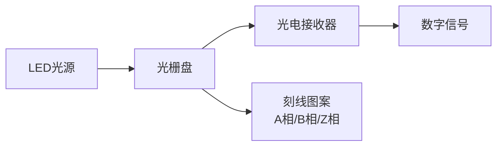
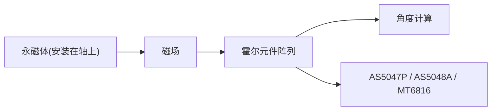
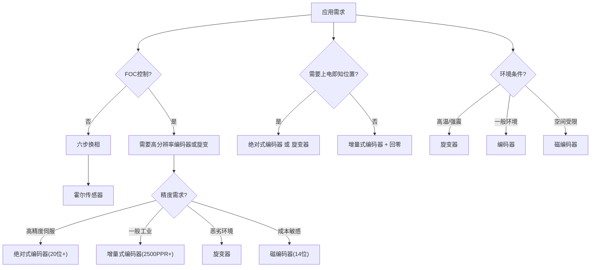

# HW-03 位置传感器接口：FOC控制的方位之锚

**副标题：从编码器到旋变，理解角度信号的精确获取**

---

## 1. 📌 核心摘要 ★★★☆☆ 🔰📚

**一句话讲清楚**：位置传感器是FOC控制的"方位之锚"——角度精度决定Park变换精度，角度延迟限制观测器带宽，角度分辨率决定低速控制性能。

**认知挂钩**：很多人以为位置传感器就是"读一下角度"，**这是严重误区！** 实际上，位置传感器接口是一个**精密的信号处理系统**：物理角度→电信号→解调/解码→数字角度→电角度。任何环节的误差都会导致Park变换错误，Id/Iq解耦失败，电流环震荡。

**与算法的关联**：
- 🔗 **算法关联**：角度精度 → 决定Park变换精度 → 1°角度误差 → Id/Iq交叉耦合约1.7%
- 🔗 **算法关联**：角度延迟 → 影响观测器设计 → 延迟导致角度预估偏差 → 高速时更严重
- 🔗 **算法关联**：角度分辨率 → 决定低速性能 → 分辨率不足 → 低速转矩脉动大
- 对极对数倍增 → 电角度精度 = 机械角度精度 × 极对数
- 零点标定 → 决定初始角度 → 零点错误 → 启动失败

---

## 2. 🤔 问题引入 ★★☆☆☆ 🔰

### 工程师的真实困惑

**场景1：电机启动抖动**
```
工程师A:"电机启动时剧烈抖动,有时能转起来,有时不行..."
问题现象:
- 启动时电流冲击大
- 转子来回震荡
- 偶尔能正常启动
```

**场景2：高速时电流畸变**
```
工程师B:"低速运行正常,但一上高速电流就变形..."
问题现象:
- 高速时Id波动大
- Iq不稳定
- 转矩脉动增大
```

**场景3：低速爬行**
```
工程师C:"电机在低速时一卡一卡的,根本无法平稳运行..."
问题现象:
- 低速时转速波动大
- 转矩脉动明显
- 位置控制精度差
```

### 核心问题

这些问题的根本原因是什么？

**答案**：位置传感器接口存在缺陷！

- 启动抖动 → 零点标定错误或角度初始化失败
- 高速畸变 → 角度延迟过大，Park变换角度滞后
- 低速爬行 → 角度分辨率不足，量化台阶导致转矩脉动

### 学习目标

读完本模块，你将能够：

✅ **理解位置传感器类型** - 编码器、旋变、霍尔传感器
✅ **掌握接口电路设计** - 信号调理、解码、抗干扰
✅ **理解关键参数** - 精度、分辨率、延迟、抗干扰
✅ **建立软硬件关联** - 角度参数如何影响控制算法
✅ **解决实际问题** - 诊断和解决位置传感器接口中的常见问题

---

## 3. 💡 直观理解 ★★☆☆☆ 🔰💡

### 类比1：位置传感器就像"指南针"

**生活场景**：想象你在航海，指南针告诉你方向。


```
误差传递：
  指南针误差 → 方向判断错误 → 航线偏离
  角度误差 → Park变换错误 → Id/Iq耦合
```

**关键理解**：角度精度直接决定FOC控制的"方向感"，角度错则一切皆错。

### 类比2：角度延迟就像"延迟的GPS"

**生活场景**：想象你在开车导航，但GPS信号有1秒延迟。


```
高速时更严重：
  速度越快 → 延迟对应的角度差越大 → 导航越不准
  转速越高 → 延迟对应的电角度差越大 → Park变换越不准
```

**关键理解**：角度延迟在高速时被放大，是高速FOC控制的关键瓶颈。

### 类比3：角度分辨率就像"刻度尺"

**生活场景**：想象你用刻度尺量长度。


```
角度分辨率：
  真实角度 123.456° ────→ 12位编码器 ────→ 123.4° (丢失0.056°)
  真实角度 123.456° ────→ 20位编码器 ────→ 123.456° (几乎无损)

分辨率不足的后果：
  低速时，角度变化量 < 1个LSB → 角度不变 → 转矩突变 → 爬行
```

**关键理解**：角度分辨率决定低速时的角度量化台阶，直接影响低速控制性能。

### 关键概念速查

**编码器(Encoder)**：输出数字角度信号的传感器，增量式或绝对式

**旋变(Resolver)**：输出模拟角度信号的变压器式传感器，需要RDC解码

**霍尔传感器(Hall)**：输出离散位置信号的磁传感器，通常3个，6步换相用

**RDC(Resolver-to-Digital Converter)**：将旋变模拟信号转换为数字角度的电路

---

## 4. 🔬 技术原理 ★★★★☆ 📚🔧

### 4.1 位置传感器类型

#### 4.1.1 光电编码器



增量式编码器输出：
  A相：方波，每转N个脉冲(N=线数)
  B相：方波，与A相差90°电角度
  Z相：每转1个脉冲(零位参考)

  正转：A领先B 90°
  反转：B领先A 90°

  角度计算：
    脉冲计数 → 机械角度 = 计数 × 360° / (4 × N)
    (4倍频：A上升沿、A下降沿、B上升沿、B下降沿)

绝对式编码器输出：
  并行或串行接口(SSI, BiSS, EnDat)
  直接输出绝对角度值
  无需回零，上电即知位置
```

**编码器参数**：
```
┌──────────────────────────────────────────────────────────────────────┐
│  参数          │ 增量式编码器        │ 绝对式编码器                   │
│  ─────────────┼──────────────────┼───────────────────────────────│
│  分辨率        │ 100~10000 PPR     │ 12~23位(4096~8388608)        │
│  精度          │ ±1~5 脉冲         │ ±0.01°~±0.1°                 │
│  上电需回零    │ 是                │ 否                            │
│  最高转速      │ 高(数字输出快)    │ 受通信速率限制                │
│  抗干扰        │ 一般              │ 好(差分信号)                  │
│  成本          │ 低~中             │ 中~高                         │
│  接口          │ ABZ(增量)         │ SSI/BiSS/EnDat(串行)         │
└──────────────────────────────────────────────────────────────────────┘
```

#### 4.1.2 磁编码器



优点：体积小、成本低、非接触式、抗震动
缺点：精度低于光电编码器、受外部磁场干扰

典型参数：
  分辨率：14位(16384)
  精度：±0.05°~±0.2°
  响应时间：< 100μs
  接口：SPI / ABI / PWM
```

#### 4.1.3 旋变器(Resolver)

```
结构原理：

  转子绕组(励磁) ← R1, R2
  定子绕组(输出) ← S1, S3 (正弦), S2, S4 (余弦)

  励磁信号：Vref = V0 × sin(ωt)
  正弦输出：Vs = V0 × sin(ωt) × sin(θ)
  余弦输出：Vc = V0 × sin(ωt) × cos(θ)

  角度解调：
    θ = atan2(Vs, Vc)

  优点：极其坚固(耐高温、耐震动)、精度高、寿命长
  缺点：需要RDC电路、成本较高、体积较大

  典型参数：
    分辨率：12~16位(通过RDC)
    精度：±2'~±10'(角分)
    励磁频率：2~20kHz
    变比：0.5 (典型)
```

#### 4.1.4 霍尔传感器

```
结构原理：

  3个霍尔元件，空间间隔120°电角度

  输出信号：
    HA ──┐     ┌─────┐     ┌─────
         │     │     │     │
    ─────┘     └─────┘     └─────
    HB ────┐     ┌─────┐     ┌───
           │     │     │     │
    ───────┘     └─────┘     └───
    HC ──────┐     ┌─────┐     ┌─
             │     │     │     │
    ─────────┘     └─────┘     └─

  6个扇区，每60°电角度一个扇区

  优点：成本最低、接口简单
  缺点：分辨率极低(60°)、不适合FOC、仅适合六步换相

  典型参数：
    分辨率：6步/电周期(60°)
    精度：±5°电角度
    响应时间：< 1μs
```

### 4.2 传感器选型



### 4.3 接口电路设计

#### 4.3.1 增量编码器接口

```
差分接收电路：

  A+ ───┤R1├──┬──┤R3├── A_out → MCU Timer
            │  │
  A- ───┤R2├──┘  │
               ═C═ (滤波)
                │
               GND

  典型参数：
    R1 = R2 = 120Ω (终端电阻)
    R3 = 1kΩ, C = 10nF (RC滤波, fc ≈ 16kHz)

  MCU接口：
    Timer编码器模式 → 自动4倍频计数
    方向：A/B相位关系
    零位：Z信号中断
```

#### 4.3.2 绝对编码器接口(SSI)

```
SSI(Synchronous Serial Interface)时序：

  CLK:  ──┐ ┌─┐ ┌─┐ ┌─┐ ┌─┐ ┌─┐ ┌─┐ ┌─┐ ┌─┐ ┌─┐ ┌─┐ ┌─┐ ┌─
          └─┘ └─┘ └─┘ └─┘ └─┘ └─┘ └─┘ └─┘ └─┘ └─┘ └─┘ └─┘ └─
  DATA: ────┤Dn├─┤Dn-1├─┤Dn-2├─ ... ─┤D0├─┤CRC├──────────────

  通信参数：
    时钟频率：100kHz ~ 2MHz
    数据长度：12~25位(含CRC)
    帧间隔：> 20μs

  MCU接口：
    SPI + GPIO(片选)
    或 专用SSI接口
```

#### 4.3.3 旋变器接口(RDC)

```
RDC电路方案：

方案1：硬件RDC芯片
  AU6802 (Aurotek) → 并行/SPI输出
  AD2S1210 (ADI) → 10~16位分辨率, SPI输出

方案2：软件RDC(CORDIC)
  励磁产生 → ADC采样 → CORDIC解调 → 角度输出

  优点：成本低、灵活
  缺点：占用CPU资源、需要高速ADC

软件RDC实现：
  // 步骤1: 产生励磁信号
  DAC_Output(V0 * sin(omega_exc * t));

  // 步骤2: ADC采样正弦和余弦信号
  float Vs = ADC_Read(CH_SIN);
  float Vc = ADC_Read(CH_COS);

  // 步骤3: 解调(乘以励磁信号)
  float ref = sin(omega_exc * t);
  float sin_comp = Vs * ref;  // 低通滤波后 = sin(θ)
  float cos_comp = Vc * ref;  // 低通滤波后 = cos(θ)

  // 步骤4: CORDIC计算角度
  float theta = atan2f(sin_comp, cos_comp);
```

#### 4.3.4 磁编码器接口

```
SPI接口(AS5047P为例)：

  CS ────┐                    ┌────────────
         │                    │
  CLK ───┤ ┌─┐ ┌─┐ ┌─┐ ┌─┐ ┌─┐ ┌─┐ ┌─┐
         └─┘ └─┘ └─┘ └─┘ └─┘ └─┘ └─┘
  MOSI───┤CMD───────────────┤
  MISO───┤──────────────────┤DATA───────

  通信参数：
    SPI模式：1
    时钟频率：最高10MHz
    帧长度：16位(1位奇偶校验+1位错误标志+14位数据)

  角度读取命令：
    发送：0x3FFF (读角度命令)
    接收：0x0XXX (14位角度值)
    角度 = DATA × 360° / 16384
```

### 4.4 角度处理算法

#### 4.4.1 角度零点标定

```
零点标定目的：确定编码器零位与电机d轴的偏移量

方法1：强制d轴对齐法
  1. 施加Id电流，Iq = 0
  2. 转子被强制拉到d轴方向
  3. 读取编码器角度 → 即为零点偏移
  4. 保存偏移量

  代码实现：
  void Motor_AlignEncoder(void)
  {
      // 施加d轴电流
      Vd = ALIGN_VOLTAGE;  // 通常2~5V
      Vq = 0;
      InversePark(Vd, Vq, 0, &Valpha, &Vbeta);  // 初始角度=0
      SVPWM(Valpha, Vbeta);

      // 等待转子稳定
      Delay_ms(1000);

      // 读取编码器角度
      float theta_encoder = Encoder_GetAngle();

      // 计算零点偏移
      encoder_offset = theta_encoder;

      // 保存偏移量
      Flash_Write(ADDR_OFFSET, encoder_offset);
  }

方法2：高频注入法(无传感器启动)
  适用于无位置传感器的场合

方法3：手动标定
  1. 手动旋转转子到已知位置
  2. 读取编码器角度
  3. 计算偏移
```

#### 4.4.2 角度插值与滤波

```
问题：编码器分辨率有限，角度存在量化台阶

解决：角度插值

方法1：线性插值
  利用速度信息，在两个编码器脉冲之间插值
  θ_interpolated = θ_last + ω × Δt

方法2：观测器
  锁相环(PLL)跟踪角度
  优点：滤波效果好、延迟小
  缺点：参数需要调整

  PLL结构：
    θ_est += ω_est × dt
    ω_est += Kp_pll × sin(θ_enc - θ_est) + Ki_pll × ∫sin(θ_enc - θ_est)dt

方法3：卡尔曼滤波
  状态：[θ, ω]
  最优估计，但计算量大
```

#### 4.4.3 多圈计数

```
增量编码器只有单圈信息，需要软件计数多圈

方法1：Z信号计数
  每收到Z信号，圈数+1或-1
  总角度 = 圈数 × 360° + 单圈角度

方法2：软件计数
  检测角度从350°跳到10° → 正转一圈
  检测角度从10°跳到350° → 反转一圈

  代码实现：
  void Encoder_UpdateMultiTurn(void)
  {
      static float prev_angle = 0;
      float curr_angle = Encoder_GetAngle();

      if (curr_angle < 90 && prev_angle > 270) {
          turn_count++;  // 正转过零
      } else if (curr_angle > 270 && prev_angle < 90) {
          turn_count--;  // 反转过零
      }

      prev_angle = curr_angle;
      total_angle = turn_count * 360.0f + curr_angle;
  }
```

### 4.5 误差分析

#### 4.5.1 误差源汇总

```
┌──────────────────────────────────────────────────────────────────────┐
│  误差源          │ 典型值      │ 累积影响     │ 补偿方法            │
│  ──────────────┼───────────┼────────────┼─────────────────────│
│  传感器固有精度  │ ±0.01~1°  │ 直接影响    │ 选高精度传感器      │
│  安装偏心       │ ±0.1~0.5° │ 周期性误差  │ 机械对中+软件补偿   │
│  量化误差       │ ±0.5LSB   │ 阶梯状误差  │ 插值/观测器         │
│  信号延迟       │ 1~100μs   │ 高速时大    │ 角度预估补偿        │
│  噪声           │ ±1~5 LSB  │ 随机误差    │ 滤波                │
│  温漂           │ ±0.01°/°C │ 缓慢漂移    │ 温度补偿            │
│  磁场干扰(磁编码器)│ ±0.5~2° │ 偏置误差    │ 屏蔽+校准           │
└──────────────────────────────────────────────────────────────────────┘
```

#### 4.5.2 安装误差分析

```
偏心误差：
  编码器安装偏心e，半径R
  角度误差 ≈ e/R × sin(θ) (弧度)

  示例：
    e = 0.1mm, R = 25mm
    最大角度误差 = 0.1/25 = 0.004 rad ≈ 0.23°

  特征：一阶周期性误差(1次/转)

倾斜误差：
  编码器安装倾斜角α
  角度误差 ≈ (1 - cos(α)) × sin(2θ) / 2

  特征：二阶周期性误差(2次/转)

补偿方法：
  1. 机械对中(最佳)
  2. 离线测量误差曲线，查表补偿
  3. 在线辨识误差谐波，实时补偿
```

---

## 5. 🔗 交叉视角 ★★★☆☆ 💡🔧

> 位置传感器不是孤立的硬件模块，它直接决定了FOC控制算法的核心——Park变换的精度。本章节揭示角度参数与算法之间的深层关联。

### 5.1 角度精度 → Park变换精度

**硬件特性**：
```
角度精度由传感器精度+安装精度+信号处理精度决定：
  总精度 ≈ √(传感器精度² + 安装精度² + 量化精度²)
  典型值：±0.05°~±1°
```

**🔗 算法关联**：角度精度直接决定Park变换精度
```
Park变换中的角度误差影响：

  Id_actual = Id_cmd × cos(Δθ) + Iq_cmd × sin(Δθ)
  Iq_actual = -Id_cmd × sin(Δθ) + Iq_cmd × cos(Δθ)

  当Δθ很小时：
    Id_actual ≈ Id_cmd + Iq_cmd × Δθ
    Iq_actual ≈ Iq_cmd - Id_cmd × Δθ

  交叉耦合量 = Iq × Δθ (对Id) 或 Id × Δθ (对Iq)

  示例：
    Δθ = 1° = 0.0175 rad
    Iq = 10A, Id = 0
    Id耦合 = 10 × 0.0175 = 0.175A (1.75%)
    Iq损失 = 0 × 0.0175 = 0A

    Δθ = 5° = 0.0873 rad
    Id耦合 = 10 × 0.0873 = 0.873A (8.73%!) → 不可接受

  对控制的影响：
    1°角度误差 → 1.7% Id/Iq交叉耦合 → 转矩脉动
    5°角度误差 → 8.7% Id/Iq交叉耦合 → 电流环不稳定

  精度要求：
    高性能伺服：角度误差 < 0.1° → 交叉耦合 < 0.17%
    一般工业：角度误差 < 1° → 交叉耦合 < 1.7%
    低成本应用：角度误差 < 5° → 交叉耦合 < 8.7%
```

### 5.2 角度延迟 → 观测器设计

**硬件特性**：
```
角度延迟来源：
  1. 传感器响应时间：1~100μs
  2. 信号处理延迟：1~10μs (编码器) / 100~500μs (旋变RDC)
  3. 通信延迟：10~100μs (SSI/BiSS)
  4. 软件处理延迟：1~5μs
  总延迟：10~700μs
```

**🔗 算法关联**：角度延迟需要观测器补偿
```
延迟导致的角度偏差：
  Δθ_delay = ωe × td

  示例：
    ωe = 1000 rad/s (约9550 rpm, P=4时约2400 rpm)
    td = 50μs
    Δθ_delay = 1000 × 50×10⁻⁶ = 0.05 rad ≈ 2.86°

    2.86°角度误差 → 5% Id/Iq交叉耦合 → 电流畸变

  高速时更严重：
    ωe = 5000 rad/s, td = 50μs
    Δθ_delay = 0.25 rad ≈ 14.3° → 严重失真！

观测器补偿：
  θ_compensated = θ_measured + ωe × td

  简单前馈补偿：
    float theta_comp = theta_measured + omega_e * T_delay;

  PLL观测器：
    更精确地跟踪角度，自动补偿延迟
    θ_est += ω_est × dt
    ω_est += Kp × sin(θ_measured - θ_est) + Ki × ∫sin(θ_measured - θ_est)dt

  注意：观测器带宽受延迟限制
    带宽 < 1 / (4 × td)
```

### 5.3 角度分辨率 → 低速性能

**硬件特性**：
```
常见编码器分辨率：
  2500 PPR增量式(4倍频) → 10000 步/转 → 0.036°
  14位磁编码器 → 16384 步/转 → 0.022°
  20位绝对式 → 1048576 步/转 → 0.00034°
```

**🔗 算法关联**：角度分辨率决定低速控制性能
```
低速时角度量化台阶的影响：

  最低可控转速计算：
    n_min = (1 LSB / 360°) × 60 × f_control

    示例(2500PPR, 4倍频, 10kHz控制频率)：
      1 LSB = 0.036°
      n_min = (0.036/360) × 60 × 10000 = 60 rpm

    示例(20位编码器, 10kHz控制频率)：
      1 LSB = 0.00034°
      n_min = (0.00034/360) × 60 × 10000 = 0.57 rpm

  量化台阶导致的转矩脉动：
    ΔT = Kt × Iq × sin(1 LSB × P)
    对4极电机(P=2)，1 LSB = 0.036°：
      ΔT = Kt × Iq × sin(0.072°) ≈ Kt × Iq × 0.00126

    对10A电流，Kt = 0.9Nm/A：
      ΔT = 0.9 × 10 × 0.00126 = 0.0113 Nm

  改善方法：
    1. 使用高分辨率编码器
    2. 角度插值(利用速度信息)
    3. 观测器平滑角度
    4. 增加控制频率
```

### 5.4 极对数倍增效应

```
电角度精度 = 机械角度精度 × 极对数

  示例：
    机械角度精度 ±0.05°
    4极电机(P=2) → 电角度精度 ±0.1°
    8极电机(P=4) → 电角度精度 ±0.2°
    16极电机(P=8) → 电角度精度 ±0.4°

  多极电机对角度精度要求更高！

  补偿策略：
    1. 选择更高精度的传感器
    2. 软件补偿安装误差
    3. 在线角度误差辨识
```

### 5.5 零点标定 → 初始角度

```
零点标定误差 → 初始角度偏差 → 启动失败

  标定精度要求：
    < 5°电角度 → 可正常启动
    < 1°电角度 → 平稳启动
    < 0.1°电角度 → 高性能伺服

  标定方法对比：
  ┌──────────────────────────────────────────────────────────────────────┐
  │  方法          │ 精度      │ 时间    │ 适用场景                     │
  │  ─────────────┼─────────┼────────┼──────────────────────────────│
  │  d轴对齐法     │ ±1~3°   │ 1~2s   │ 最常用,通用                  │
  │  高频注入法     │ ±5~10°  │ 0.5s   │ 无传感器启动                 │
  │  手动标定      │ ±0.5°   │ 人工    │ 实验室/生产标定              │
  │  绝对编码器     │ ±0.01°  │ 0s     │ 上电即知(需预标定)           │
  └──────────────────────────────────────────────────────────────────────┘
```

---

## 6. 🎯 工程案例 ★★★☆☆ 🔧🎯

### 案例1：电机启动抖动——零点标定错误

**项目背景**：
```
应用:AGV驱动轮
电机:PMSM,额定功率200W
传感器:增量编码器2500PPR
控制器:STM32G4,FOC控制
问题:电机启动时剧烈抖动
```

**诊断过程**：
```
步骤1:检查电流波形 → Id和Iq都在震荡
步骤2:检查Park变换角度 → 角度跳变
步骤3:检查零点标定 → 发现标定电压太低(1V),转子未完全对齐
步骤4:测量实际零点偏移 → 与标定值偏差15°电角度
```

**根本原因**：零点标定电压太低，转子未完全对齐到d轴方向

**解决方案**：
```
方案A:增大标定电压到5V
  转子完全对齐 → 零点精度±1° → 启动正常 ✅

方案B:增大标定电流(限流保护)
  Id_align = 50% × I_rated → 零点精度±0.5° ✅✅

方案C:多次标定取平均
  减小随机误差 → 零点精度±0.3° ✅✅✅
```

**经验总结**：
1. 标定电压/电流必须足够大
2. 标定后需验证(施加Iq电流，观察是否平稳旋转)
3. 推荐标定电流 = 50%~100% 额定电流

---

### 案例2：高速电流畸变——角度延迟

**项目背景**：
```
应用:高速主轴
电机:PMSM,额定转速20000rpm
传感器:旋变器+硬件RDC
控制器:TI C2000,FOC控制
问题:高速时Id波动大,电流畸变
```

**诊断过程**：
```
步骤1:低速时电流正常 → 排除硬件故障
步骤2:高速时观察角度信号 → 角度滞后明显
步骤3:测量RDC延迟 → 200μs(硬件RDC芯片)
步骤4:计算角度偏差 → ωe=8400rad/s, Δθ=8400×200μs=1.68rad≈96°!
```

**根本原因**：RDC延迟200μs，在高速时导致96°角度偏差！

**解决方案**：
```
方案A:角度前馈补偿
  θ_comp = θ_meas + ωe × 200μs
  结果:偏差减小到±5° → 基本可用 ⚠️

方案B:软件RDC(降低延迟到20μs)
  用ADC+CORDIC替代硬件RDC
  结果:偏差减小到±10° → 需要配合前馈补偿 ✅

方案C:改用高速编码器(延迟<5μs)
  结果:偏差<2° → 高速性能优秀 ✅✅
```

**经验总结**：
1. 高速应用必须考虑角度延迟
2. 旋变器延迟大，不适合超高速应用
3. 角度前馈补偿是必要的
4. 编码器延迟远小于旋变器

---

### 案例3：低速爬行——分辨率不足

**项目背景**：
```
应用:云台控制
电机:PMSM,要求0.1°定位精度
传感器:磁编码器AS5600(12位)
控制器:STM32G4,FOC控制
问题:低速时电机一卡一卡,无法平稳运行
```

**诊断过程**：
```
步骤1:观察角度信号 → 阶梯状,1 LSB = 0.088°
步骤2:计算最低可控转速 → n_min = (0.088/360)×60×10000 = 14.7rpm
步骤3:要求转速1rpm → 远低于最低可控转速!
步骤4:分析转矩脉动 → 角度跳变导致转矩突变
```

**根本原因**：12位磁编码器分辨率不足，低速时角度量化台阶导致转矩脉动

**解决方案**：
```
方案A:更换14位磁编码器(AS5047P)
  1 LSB = 0.022° → n_min = 3.7rpm → 仍不够 ⚠️

方案B:角度插值 + 观测器
  利用速度信息在编码器脉冲间插值
  结果:等效分辨率提升10倍 → n_min ≈ 0.4rpm ✅

方案C:更换20位绝对编码器
  1 LSB = 0.00034° → n_min = 0.057rpm → 远超需求 ✅✅
```

**经验总结**：
1. 低速应用必须计算最低可控转速
2. 角度插值和观测器是低成本提升性能的有效手段
3. 高精度定位需要高分辨率编码器

---

### 案例4：磁编码器受干扰

**项目背景**：
```
应用:无人机电机
电机:外转子PMSM
传感器:磁编码器AS5048A
控制器:STM32G4,FOC控制
问题:电机运行时角度信号跳变
```

**诊断过程**：
```
步骤1:静止时角度稳定 → 排除传感器故障
步骤2:电机运行时角度跳变 → 电磁干扰
步骤3:分析干扰源 → 电机绕组电流产生的磁场干扰磁编码器
步骤4:测量干扰量 → 角度偏差最大5°
```

**根本原因**：电机电流产生的磁场干扰磁编码器

**解决方案**：
```
方案A:增加磁屏蔽
  在磁编码器和电机之间加屏蔽罩
  结果:干扰降低到1° ✅

方案B:增大磁体与编码器的距离
  减弱干扰磁场
  结果:干扰降低到0.5° ✅

方案C:软件滤波
  低通滤波 + 陷波(去除电流频率分量)
  结果:干扰降低到0.3° ✅✅

方案D:改用光电编码器
  完全不受磁场干扰 ✅✅✅ (但成本和体积增加)
```

**经验总结**：
1. 磁编码器容易受外部磁场干扰
2. PCB布局和屏蔽设计很重要
3. 软件滤波是有效的补充手段

---

### 案例5：位置传感器选型流程

```
步骤1：确定应用需求（精度、转速、环境、成本）
步骤2：计算角度精度需求
  精度需求 = 允许Id耦合 / Iq × (180/π)
  示例：允许Id耦合1%, Iq=10A → 精度需求 < 0.57°
步骤3：计算分辨率需求
  最低转速 → 分辨率需求
  n_min → 1 LSB < n_min × 360 / (60 × f_control)
步骤4：计算延迟需求
  最高转速 → 延迟需求
  Δθ < 允许角度误差 → td < Δθ / ωe_max
步骤5：选择传感器类型
  根据精度、分辨率、延迟、环境、成本综合选择
步骤6：设计接口电路
  根据传感器类型设计相应的接口
```

---

## 7. 📝 实践练习 ★★★★☆ 🎯📝

### 练习1：计算题——角度精度与Park变换

```
已知：
  PMSM参数：Kt = 0.5 Nm/A, Iq = 15A
  角度误差 Δθ = 2°

要求：
1. 计算Id/Iq交叉耦合量
2. 计算转矩误差
3. 如果要求Id耦合 < 0.5%，角度精度需要多少？

参考答案：
1. Id耦合 = Iq × sin(2°) = 15 × 0.0349 = 0.524A (3.5%)
   Iq损失 = Iq × (1-cos(2°)) = 15 × 0.00061 = 0.009A (0.06%)
2. 转矩误差 ≈ Kt × Id耦合 = 0.5 × 0.524 = 0.262 Nm
3. Δθ < arcsin(0.005/15) ≈ 0.019° → 需要0.02°精度
```

### 练习2：计算题——角度延迟

```
已知：
  电机极对数 P = 4
  最高转速 n = 6000 rpm
  传感器延迟 td = 50μs

要求：
1. 计算最高速时的角度偏差
2. 如果要求角度偏差 < 3°，最大允许延迟是多少？
3. 选择合适的传感器类型

参考答案：
1. ωe = 4 × 2π × 6000/60 = 2513 rad/s
   Δθ = 2513 × 50×10⁻⁶ = 0.126 rad ≈ 7.2°
2. td < 3°/(2513 × 180/π) ≈ 20.8μs
3. 编码器(延迟<5μs)满足要求，旋变器(延迟>50μs)不满足
```

### 练习3：设计题——编码器选型

```
设计要求：
  电机：PMSM, P=3, 额定转速3000rpm
  控制频率：10kHz
  要求：最低可控转速1rpm, 角度精度<0.5°

要求：
1. 计算分辨率需求
2. 计算精度需求
3. 选择编码器类型和参数
4. 设计接口电路

参考答案：
1. 1 LSB < 1rpm × 360/(60 × 10000) = 0.0006° → 需要19.2位以上
   实际：14位编码器 + 观测器插值可满足
2. 机械角度精度 < 0.5°/3 = 0.167° (考虑极对数倍增)
3. 14位磁编码器(AS5047P) + PLL观测器
   或 17位绝对编码器(无需插值)
4. SPI接口，4线制，时钟<10MHz
```

### 练习4：诊断题——角度信号异常

```
场景：FOC控制电机，运行时Id电流周期性波动

现象：
  - Id电流以1次/转的频率波动
  - 波动幅度约0.5A
  - 低速时更明显

问题：
1. 可能的原因有哪些？
2. 如何诊断？
3. 如何解决？

参考答案：
1. 可能原因：编码器安装偏心(1次/转误差)、转子磁体不均匀、轴承间隙
2. 诊断步骤：
   - 记录Id波动与角度的关系 → 确定是1次/转
   - 低速匀速旋转，记录角度误差曲线 → 确认偏心误差
   - 检查编码器安装 → 测量偏心量
3. 解决方案：
   - 机械对中(最佳)
   - 离线测量误差曲线，查表补偿
   - 在线辨识1次谐波，实时补偿
```

### 练习5：选择题

**题目1**：FOC控制中，角度误差1°导致的Id/Iq交叉耦合约为？
- A. 0.017%  B. 1.7%  C. 17%  D. 0.17%
> 答案：B

**题目2**：旋变器的主要优点是？
- A. 成本低  B. 分辨率高  C. 坚固耐用  D. 延迟小
> 答案：C

**题目3**：角度延迟对控制的影响在什么时候最严重？
- A. 低速  B. 高速  C. 启动  D. 制动
> 答案：B

**题目4**：增量编码器需要回零的原因是？
- A. 精度不够  B. 上电时不知道绝对位置  C. 延迟大  D. 分辨率低
> 答案：B

**题目5**：低速爬行现象的主要原因是？
- A. 电流采样不准  B. 角度分辨率不足  C. PI参数不对  D. PWM死区
> 答案：B

---

## 附录：快速计算公式汇总

### A. 角度精度与Park变换
```
Id耦合 ≈ Iq × Δθ (rad)
Iq损失 ≈ Id × Δθ (rad)
精度需求 = arcsin(允许Id耦合/Iq)
```

### B. 角度延迟
```
Δθ_delay = ωe × td
最大允许延迟 = Δθ_max / ωe_max
```

### C. 最低可控转速
```
n_min = (1_LSB / 360°) × 60 × f_control
```

### D. 编码器4倍频
```
角度分辨率 = 360° / (4 × PPR)
```

### E. 旋变角度解调
```
θ = atan2(Vsin, Vcos)
```

---

**文档信息**：
- 模块编号：HW-03
- 知识体系：电驱硬件原理
- 模块名称：位置传感器接口
- 算法关联：角度精度→Park变换、延迟→观测器、分辨率→低速性能

### 🔗 hpm_MC 代码关联

**编码器驱动** (`hpm_mcl_v2/encoder/`):
- `hpm_mcl_abz.h`: ABZ/QEI 正交编码器 — θ = phase_count × 2π / encoder_resolution
- `hpm_mcl_uvw.h`: UVW/Hall 三路霍尔 — θ = hall_state × 60° + 30°偏移

**速度计算** (`hpm_mcl_v2/core/sensor/hpm_mcl_encoder.h`):
- 四种算法: T法（低速）/ M法（高速）/ M-T法（全速域）/ PLL法（平滑低延迟）
- `theta_forecast` 角度预测补偿计算延迟
- IIR 速度滤波器

参考: `SDK-02-HPM-MC-v2-Core-Loop.md` 第5节「传感器处理」
