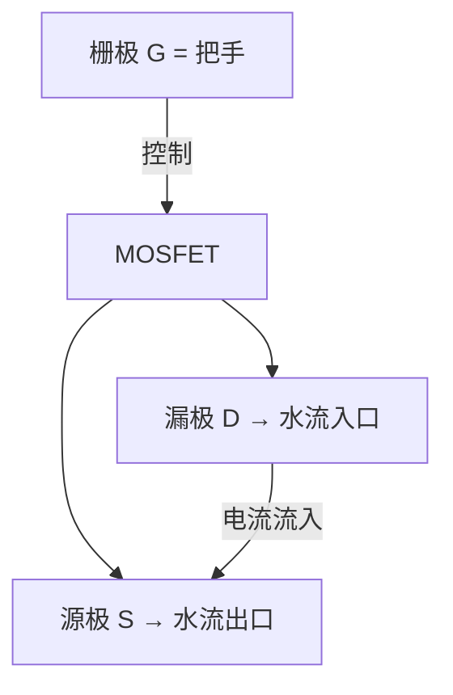
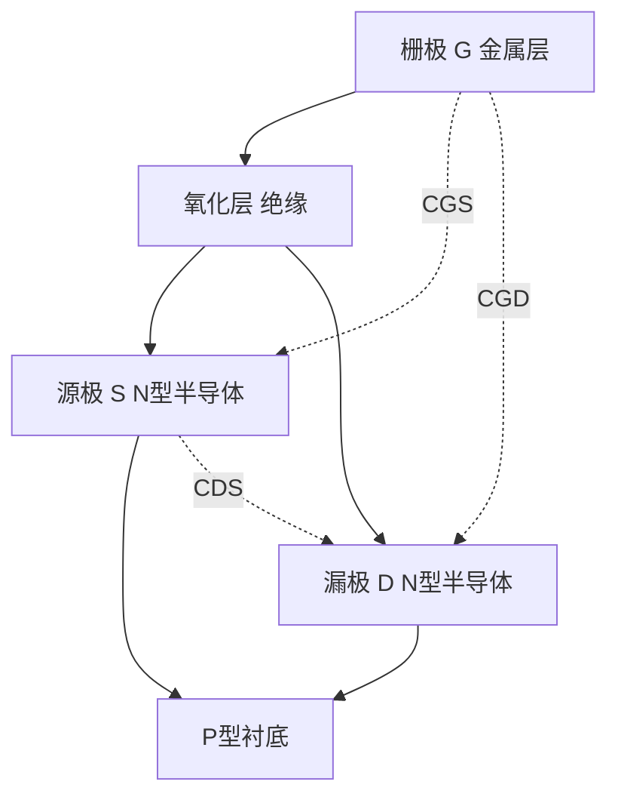
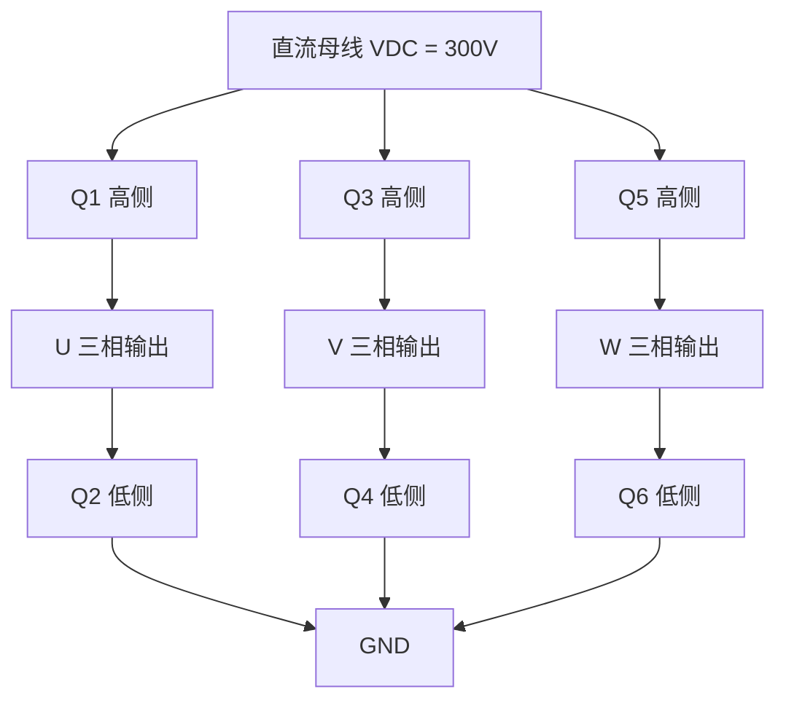

# HW-05 功率器件与栅极驱动

> 模块编号：HW-05 | 整体难度：★★★★★ | 类型：硬件基础+工程实践

---

## 1. 📌 核心摘要 ★☆☆☆☆ 🔰

**一句话讲清楚**：MOSFET/IGBT就像"水龙头"，栅极（G）是把手，漏极（D）和源极（S）是水流通道——要快速打开/关闭这个水龙头，需要给栅极电容"快速充放电"，这就是栅极驱动的本质。

**认知挂钩**：你可能以为MOSFET是"电压控制器件，不需要电流"，**这是最大的误解！** 虽然维持导通不需要电流，但**打开和关闭的瞬间**，需要给栅极电容"快速充放电"，就像给汽车电瓶充电——虽然最终状态是"满电"，但充电过程需要强大的电流源。开关瞬间，栅极需要**脉冲大电流**（安培级）对寄生电容充放电，这就是为什么需要专门的栅极驱动器。

**本模块核心公式**：
- 栅极驱动功率：`Pgate = Qg × VGS × fsw`
- 米勒等效电容：`CGD,eqv = CGD × (1 + gfs × RGD)`
- 开关损耗：`Psw = ½ × VDS × ID × (tr + tf) × fsw`

---

## 2. 🤔 问题引入 ★★☆☆☆ 📚

### 工程师真实困惑

**困惑1**：为什么MCU的GPIO不能直接驱动MOSFET？

MCU输出3.3V、20mA，但MOSFET需要10-15V才能完全导通，栅极充电需要安培级电流。用MCU直接驱动，充电时间长达微秒级：
```
Ceq = 1nF, Imax = 20mA, VGS = 10V
R = V/I = 10V/20mA = 500Ω
t = 5 × R × C = 5 × 500Ω × 1nF = 2.5μs  （太慢！）

对比：用驱动器提供2A电流
R = 10V/2A = 5Ω
t = 5 × 5Ω × 1nF = 25ns  （快100倍！）
```

**困惑2**：为什么开关过程中栅极电压会"停滞"（米勒平台）？

**困惑3**：为什么高侧MOSFET比低侧难驱动？

**困惑4**：栅极电阻RG到底该选多大？太小会振荡，太大会发热。

### 学习目标

| 目标 | 掌握程度 | 关键产出 |
|------|---------|---------|
| 理解MOSFET寄生电容及其影响 | 能手推计算CGS/CGD/CDS | 寄生电容计算 |
| 理解米勒效应及米勒平台 | 能解释VGS波形各阶段 | 开关过程分析 |
| 掌握栅极驱动器选型 | 能根据需求选择驱动器IC | 驱动器选型表 |
| 掌握栅极电阻计算 | 能平衡开关速度与EMI | RG计算与验证 |
| 掌握自举电路设计 | 能计算自举电容和二极管 | 自举电路参数 |
| 理解IGBT驱动特殊性 | 能区分MOSFET与IGBT驱动差异 | 驱动方案对比 |
| 掌握dv/dt误导通分析 | 能判断并避免误导通 | 误导通计算与防护 |

---

## 3. 💡 直观理解 ★★☆☆☆ 💡

### 3.1 水龙头类比：MOSFET三个引脚



| 引脚 | 名称 | 类比 | 作用 |
|------|------|------|------|
| **G（Gate）** | 栅极 | 水龙头把手 | **控制开关**：施加电压时，打开通道 |
| **D（Drain）** | 漏极 | 水管入口 | **电流入口**：电流从这里流入 |
| **S（Source）** | 源极 | 水管出口 | **电流出口**：电流从这里流出 |

**N沟道 vs P沟道**：
- N沟道：VGS > Vth导通，RDS(on)更低，更常用
- P沟道：VGS < -Vth导通，成本高，速度慢

### 3.2 电容充放电类比：为什么需要大电流

```
电容 = 水桶
电荷 = 水
电压 = 水位高度
电容值 = 水桶容量

要提高水位（电压），必须注入水（电流）
要降低水位（电压），必须放出水流（电流）
水位变化速度 = 注水速度（电流大小）
```

**核心公式**：`I = C × dV/dt`

要在10ns内将1nF电容从0V充到10V：
```
dV/dt = 10V / 10ns = 10^9 V/s
I = 1nF × 10^9 V/s = 1A
```
结论：要在10ns内完成充电，需要1A的电流！

### 3.3 指挥系统类比：为什么需要栅极驱动器


- **控制器** = 指挥官（发号施令，力量微弱）
- **栅极驱动** = 传令兵（放大信号，提供瞬时功率）
- **MOSFET** = 战士（执行开关动作，承受高压大电流）

### 3.4 充电宝类比：自举电路

自举电容是高侧驱动的"充电宝"：
- 低侧导通时：充电宝充电（CB充电至VCC）
- 高侧导通时：充电宝放电（CB电压"顶起"驱动电压）

### 3.5 弹簧门类比：米勒效应

想象你在推一个弹簧门，门越开，弹簧拉力越大。CGD就像这个弹簧，当漏极电压变化时，它"放大"了栅极的负担——原本100pF的电容，等效变成了20nF！

---

## 4. 🔬 技术原理 ★★★★☆ 🔬

### 4.1 MOSFET内部的"隐形电容" ★★☆☆☆

MOSFET结构决定了它内部必然有寄生电容：



**三个寄生电容的特性**：

| 电容 | 物理来源 | 特性 | 影响 |
|------|---------|------|------|
| **CGS** (Gate-Source Capacitance) | 栅极-源极重叠 | 线性（恒定） | 决定开通延迟 |
| **CGD** (Gate-Drain Capacitance) | 栅极-漏极重叠 + JFET区 | **非线性**（电压相关） | **米勒效应**，延长开关时间 |
| **CDS** (Drain-Source Capacitance) | 体二极管结电容 | 非线性（电压相关） | 影响dv/dt，关断损耗 |

**从数据表提取寄生电容**：
```
数据表参数 → 实际电容：
  CISS = CGS + CGD  （输入电容）
  CRSS = CGD         （反向传输电容）
  COSS = CDS + CGD  （输出电容）

计算：
  CGD = CRSS
  CGS = CISS - CRSS
  CDS = COSS - CRSS
```

**手推计算示例**：
```
已知：MOSFET数据表
  CISS = 3000pF (VDS=25V时)
  CRSS = 100pF  (VDS=25V时)
  COSS = 600pF  (VDS=25V时)

解：
  CGD = CRSS = 100pF
  CGS = CISS - CGD = 3000pF - 100pF = 2900pF
  CDS = COSS - CGD = 600pF - 100pF = 500pF
```

**平均电容（近似，用于损耗计算）**：
```
CGD,ave = 2 × CRSS,spec × √(VDS,spec / VDS,off)
CDS,ave = 2 × COSS,spec × √(VDS,spec / VDS,off)
```

### 4.2 开关过程的"四幕剧" ★★★☆☆

#### 4.2.1 开通过程

```
阶段1：开通延迟（td(on)）
  VGS从0V → Vth
  CGS充电
  MOSFET尚未导通

阶段2：电流上升（tr）
  VGS从Vth → Vplateau（米勒平台）
  ID从0 → Imax
  CGS继续充电
  MOSFET开始导通

阶段3：电压下降（tf）
  VGS停留在米勒平台
  VDS从高 → 低
  CGD放电（米勒效应）
  MOSFET完全导通

阶段4：完全导通
  VGS继续上升至VDRV
  无充放电
  MOSFET保持导通
```

**波形图**：
```
VGS: 0V ────┐
            │
            ├────────┐ (米勒平台)
            │        │
            └────────┴─── VDRV
            │←td→│←tr→│←tf→│

ID:  0 ─────────────┐
                    │
                    └─────────── Imax
                    │←tr→│

VDS: Vhigh ─────────┐
                    │
                    └─────────── 0V
                    │←tf→│
```

#### 4.2.2 关断过程

```
阶段1：关断延迟（td(off)）
  VGS从VDRV → Vplateau
  CGS放电
  MOSFET仍导通

阶段2：电压上升（tr）
  VGS停留在米勒平台
  VDS从低 → 高
  CGD充电（米勒效应）
  MOSFET开始关断

阶段3：电流下降（tf）
  VGS从Vplateau → Vth
  ID从Imax → 0
  CGS继续放电
  MOSFET完全关断

阶段4：完全关断
  VGS继续下降至0V
  无充放电
  MOSFET保持关断
```

**各阶段功率损耗**：

| 阶段 | 过程 | 电容行为 | 功率损耗 |
|------|------|---------|---------|
| **开通延迟** | VGS从0→Vth | CGS充电 | 很小 |
| **电流上升** | ID从0→Imax | CGS继续充电 | **大**（电压高+电流大） |
| **电压下降** | VDS从高→低 | **CGD放电（米勒平台）** | **最大** |
| **完全导通** | VGS稳定 | 无充放电 | 很小（导通损耗） |

### 4.3 米勒效应详解 ★★★★☆

**定义**：当漏极电压变化时，CGD等效电容会"放大"。

**原理**：
```
开通过程：
  VDS下降 → CGD需要放电
  放电电荷：Q = CGD × ΔVDS
  放电电流：I = CGD × dVDS/dt

关断过程：
  VDS上升 → CGD需要充电
  充电电荷：Q = CGD × ΔVDS
  充电电流：I = CGD × dVDS/dt
```

**等效电容公式**：
```
CGD,eqv = CGD × (1 + gfs × RGD)

其中：
  gfs = 跨导（增益）
  RGD = 栅极驱动电阻
```

**手推计算**：
```
已知：
  CGD = 100pF
  gfs = 20S (西门子)
  RGD = 10Ω

计算：
  CGD,eqv = 100pF × (1 + 20 × 10)
          = 100pF × 201
          = 20100pF = 20.1nF

结论：米勒效应使CGD"放大"了201倍！
```

**米勒平台的影响**：
1. **延长开关时间**：平台时间越长，开关损耗越大
2. **增加驱动需求**：需要更大的驱动电流
3. **影响EMI**：平台期间的dv/dt会产生电磁干扰

**平台时间计算**：
```
tplateau ≈ Qgd / Idrive

其中：
  Qgd = 栅-漏电荷（数据表给出）
  Idrive = 驱动电流

示例：
  Qgd = 20nC
  Idrive = 2A
  tplateau = 20nC / 2A = 10ns
```

**平台电压**：
```
Vplateau ≈ Vth + ID / gfs
```

### 4.4 栅极电荷（Qg）的"能量账本" ★★★☆☆

栅极电荷像"加油量"，告诉你需要注入多少电荷才能把MOSFET"开起来"。

**栅极驱动功率计算**：
```
方法1：基于电荷
  Pgate = Qg × VGS × fsw

方法2：基于电容（近似）
  Ceq = Qg / VGS
  Pgate = Ceq × VGS² × fsw

手推计算：
  Qg = 100nC, VGS = 12V, fsw = 100kHz

  Pgate = 100nC × 12V × 100kHz
        = 100 × 10^-9 × 12 × 100 × 10^3
        = 0.12W = 120mW
```

**驱动器发热**：
```
驱动器功耗 = Pgate + Pquiescent

示例：
  TC4420静态电流 = 1mA
  VCC = 12V
  Pquiescent = 12V × 1mA = 12mW

总功耗：Ptotal = 120mW + 12mW = 132mW

温升：ΔT = 0.132W × 100°C/W (SOIC-8) = 13.2°C
```

### 4.5 开关损耗计算 ★★★★☆

**开通损耗**（VDS下降期间，电流与电压交叠）：
```
Psw(on) = ½ × VDS × ID × tf × fsw
```
其中 tf 为VDS下降时间（开通阶段）。

**关断损耗**（VDS上升期间，电流与电压交叠）：
```
Psw(off) = ½ × VDS × ID × tr × fsw
```
其中 tr 为VDS上升时间（关断阶段）。

**总开关损耗**：
```
Psw(total) = Psw(on) + Psw(off)
```

**手推计算**：
```
已知：VDS = 400V, ID = 10A, tr = 50ns, tf = 30ns, fsw = 100kHz

Psw(on) = ½ × 400V × 10A × 30ns × 100kHz
        = ½ × 4000 × 30 × 10^-9 × 100 × 10^3
        = 6W

Psw(off) = ½ × 400V × 10A × 50ns × 100kHz
         = ½ × 4000 × 50 × 10^-9 × 100 × 10^3
         = 10W

Psw(total) = 6W + 10W = 16W
```

### 4.6 栅极电阻设计 ★★★☆☆

#### 4.6.1 栅极电阻的作用

1. **限制峰值电流**：保护驱动器和MOSFET
2. **抑制振荡**：防止栅极电压振荡
3. **调节开关速度**：平衡开关损耗和EMI

#### 4.6.2 计算方法

**方法1：基于开关时间**
```
RG = tsw / (2.2 × Ceq)

其中：
  tsw = 期望开关时间
  Ceq = Qg / VGS (等效电容)
```

**方法2：基于峰值电流**
```
RG = VDRV / Ipeak
```

**方法3：基于振荡抑制**
```
RG ≥ √(Lgate / Ceq)

其中：
  Lgate = 栅极回路电感（PCB走线）
```

**手推计算示例**：
```
已知：MOSFET: IRF540N
  Qg = 71nC, VGS = 10V
  目标开关时间 tsw = 50ns
  驱动器峰值电流 Ipeak = 2A

方法1：
  Ceq = Qg / VGS = 71nC / 10V = 7.1nF
  RG = 50ns / (2.2 × 7.1nF) = 50 / 15.62 ≈ 3.2Ω

方法2：
  RG = 10V / 2A = 5Ω

选择：RG = 3.3Ω（标准值）
```

#### 4.6.3 权衡表

| RG值 | 开关速度 | 开关损耗 | EMI | 振荡风险 |
|------|---------|---------|-----|---------|
| **小** | 快 | 低 | **高** | **高** |
| **大** | 慢 | 高 | 低 | 低 |

**经验值**：
- 小功率（<100W）：RG = 10-47Ω
- 中功率（100W-1kW）：RG = 3.3-10Ω
- 大功率（>1kW）：RG = 1-3.3Ω

### 4.7 栅极驱动器选型 ★★★☆☆

#### 4.7.1 关键参数

| 参数 | 说明 | 典型值 |
|------|------|--------|
| **峰值电流** | 瞬时驱动能力 | 1-10A |
| **驱动电压** | 输出电压范围 | 10-20V |
| **传播延迟** | 输入到输出的延迟 | 10-100ns |
| **上升/下降时间** | 输出边沿速度 | 10-50ns |
| **隔离电压** | 高侧驱动隔离能力 | 500-5000V |

#### 4.7.2 常见驱动器类型

| 类型 | 应用 | 代表器件 | 特点 |
|------|------|---------|------|
| 低侧驱动器 | Buck变换器、单管开关 | TC4420, UCC27424 | 简单、便宜 |
| 半桥驱动器 | 电机驱动、逆变器 | IR2110, UCC27211 | 集成自举电路 |
| 三相驱动器 | 三相电机控制 | IR2130, DRV8301 | 集成3路驱动+保护 |
| 隔离驱动器 | 高压应用、医疗设备 | HCPL-316J, ACPL-332J | 光耦隔离或磁隔离 |

### 4.8 自举电路设计 ★★★★☆

#### 4.8.1 为什么需要自举电路

高侧MOSFET的源极电压在开关过程中会变化（0~VDC），当SW = VDC时，栅极电压需要 > VDC + Vth，自举电路解决这个"浮动供电"问题。

#### 4.8.2 自举电路原理

```
        VCC (12V)
          │
         ╱╲ Dboot (自举二极管)
         ╲╱
          │
    ┌─────┴─────┐
    │     CB    │ (自举电容)
    │   1μF     │
    └─────┬─────┘
          │
    ┌─────┴─────┐
    │  高侧驱动  │
    │    IC     │
    └─────┬─────┘
          │
         SW ──── 负载
          │
    ┌─────┴─────┐
    │  低侧开关  │
    └─────┬─────┘
          │
         GND
```

**工作过程**：
- **充电阶段**（低侧导通）：SW ≈ 0V，自举二极管导通，CB充电至VCC - VF ≈ 11.3V
- **放电阶段**（高侧导通）：SW上升至VDC，自举二极管截止，VB = VSW + VCB ≈ VDC + 11.3V

#### 4.8.3 自举电容计算

```
CB ≥ (Qgate + Ileak × ton) / ΔVboot

其中：
  Qgate = 高侧MOSFET栅极电荷
  Ileak = 高侧驱动器静态电流
  ton = 高侧最大导通时间
  ΔVboot = 允许电压跌落（通常<1V）
```

**手推计算**：
```
已知：Qgate = 50nC, Ileak = 50μA, ton = 10μs, ΔVboot = 0.5V

CB ≥ (50nC + 50μA × 10μs) / 0.5V
   ≥ (50nC + 0.5nC) / 0.5V
   ≥ 101nF

选择：CB = 1μF (留足裕度)
```

#### 4.8.4 自举二极管选择

- 反向耐压：VR > VDC（母线电压）
- 正向电流：IF > Ipeak（栅极峰值电流）
- 反向恢复时间：trr < 100ns（快恢复二极管）
- 推荐器件：UF4007、US1M、ES1J
- **不要**使用普通整流二极管（1N4007等），反向恢复太慢
- **不要**使用肖特基二极管，反向耐压不够

#### 4.8.5 自举电路常见问题

1. **占空比限制**：高侧导通时间不能太长
   ```
   Dmax = 1 - (tcharge / Tsw)
   tcharge ≈ 5 × CB × (RG + RD)
   ```

2. **启动问题**：第一次上电时CB未充电，需要预充电
   - 先开通低侧给CB充电
   - 使用带预充电功能的驱动IC

3. **高压应用**：VDC > 500V时，自举二极管耐压不够
   - 使用隔离驱动（变压器或光耦）
   - 使用高压自举二极管

### 4.9 dv/dt误导通分析 ★★★★★

**原理**：漏极电压快速变化时，通过CGD耦合到栅极，产生电流：
```
I = CGD × dVDS/dt

这个电流流经RG和内部栅极电阻RG,I：
VGS = CGD × dVDS/dt × (RG + RG,I)

如果 VGS > Vth，MOSFET会意外开通！
```

**危险场景**：
1. 桥式电路中一个开关关断，对管体二极管反向恢复
2. 感性负载关断时电压尖峰
3. 外部干扰（雷击、浪涌）

**手推计算**：
```
已知：CGD = 100pF, dVDS/dt = 10V/ns, RG = 10Ω, RG,I = 5Ω, Vth = 4V

VGS = 100pF × 10V/ns × 15Ω
    = 100 × 10^-12 × 10 × 10^9 × 15
    = 15V

结论：VGS = 15V >> Vth = 4V，**会误导通！**

修正方案：
  方案1：RG = 0Ω → VGS = 5V (仍可能误导通)
  方案2：负压关断 VGS(off) = -5V → 裕度 = 9V (安全)
  方案3：选择CGD = 20pF的器件 → VGS = 3V (安全)
```

**避免方法**：
1. 降低RG（减小栅极阻抗）
2. 使用负压关断（VGS(off) = -5V）
3. 选择低CGD器件
4. 加RC吸收（降低dv/dt）
5. 使用栅极驱动IC内置米勒钳位功能

### 4.10 IGBT驱动的特殊性 ★★★★☆

| 特性 | MOSFET | IGBT |
|------|--------|------|
| **栅极电荷** | 较小 | 较大（约1.5-2倍） |
| **开关速度** | 快（10-100ns） | 慢（100ns-1μs） |
| **拖尾电流** | 无 | **有**（关断后仍有电流） |
| **驱动电压** | 10-15V | 15-20V（更高） |
| **负压关断** | 可选 | **推荐**（防误导通） |
| **短路能力** | 不需要 | tsc < 10μs，需快速保护 |
| **应用** | 高频、低压 | 低频、高压大功率 |

**IGBT特殊考虑**：

1. **拖尾电流**：关断后少数载流子复合需要时间，导致额外损耗
   ```
   Psw(off) = ½ × VCE × IC × (tf + ttail) × fsw
   ```

2. **短路保护**：IGBT能承受短路的时间有限（<10μs），需要快速保护
   ```
   检测VCE(sat) → 如果过压 → 立即关断
   响应时间 < 5μs
   ```

3. **驱动电压**：VGE < 15V时RCE增大，VGE > 20V可能损坏栅极氧化层

### 4.11 死区时间 ★★★☆☆

**为什么需要死区时间**：如果上下桥臂同时导通，会形成直通（Shoot-through），导致短路！

```
直通情况：
  VDC ───┬─── Q1 (高侧导通)
          │
          ├─── Q2 (低侧导通)
          │
         GND

结果：VDC直接短路到GND，电流巨大，器件烧毁！
```

**死区时间设置**：
```
死区时间 ≥ 最大关断时间 + 安全裕度

示例：
  最大关断时间 = 200ns
  安全裕度 = 500ns
  死区时间 = 700ns

实际设置：1-2μs
```

**死区时间的影响**：
- 优点：防止直通，保护器件
- 缺点：输出电压畸变，增加损耗

### 4.12 栅极驱动电路保护 ★★★☆☆

**1. 过压保护**：栅极-源极之间接15V齐纳二极管

**2. 过流保护**：
- 电流采样电阻（源极串联小电阻）
- 霍尔传感器
- 驱动器内置保护（HCPL-316J, ACPL-332J检测VCE(sat)）

**3. 欠压保护**：欠压锁定（UVLO）
- TC4420: UVLO = 2.5V
- IR2110: UVLO = 8.7V

**4. dv/dt保护**：
- 降低栅极电阻
- 负压关断（VGS = -5V）
- 米勒钳位（驱动器内置）

---

## 5. 🔗 交叉视角 ★★★★☆ 🔗

### 5.1 硬件↔算法关联总览

栅极驱动电路的参数直接影响控制算法的设计和性能：

```
栅极驱动参数          影响路径                  算法侧影响
─────────────────────────────────────────────────────────
开关损耗          →  热约束              →  PWM频率选择
米勒效应          →  开关时间            →  驱动电流计算
死区时间          →  输出电压畸变        →  死区补偿算法
dv/dt            →  采样噪声            →  滤波器设计
栅极电阻          →  开关速度/EMI平衡    →  PWM策略优化
驱动电压          →  RDS(on)            →  导通损耗/效率
```

### 🔗 算法关联1：开关损耗 → PWM频率选择

开关损耗与PWM频率成正比（`Psw ∝ fsw`），这是选择PWM频率的核心约束：

```
开关损耗公式：
  Psw = Esw × fsw

约束条件：
  Psw + Pcond < Pmax (散热能力限制)

因此：
  fsw_max = (Pmax - Pcond) / Esw
```

**对算法的影响**：
- PWM频率决定了电流环的带宽上限
- 频率越高，电流纹波越小，但损耗越大
- FOC中通常选择10-20kHz（IGBT）或20-100kHz（MOSFET）
- 高频应用需要考虑死区时间占比增加的问题

**工程决策**：
```
if (散热能力强 && EMI可控) {
    fsw = 20kHz;  // 优先选择较高频率
} else if (功率大 && IGBT) {
    fsw = 8-16kHz;  // 降低频率减少损耗
} else {
    fsw = 10kHz;  // 折中
}
```

### 🔗 算法关联2：米勒效应 → 驱动电流计算

米勒效应决定了栅极驱动电流的需求，直接影响驱动器选型：

```
米勒平台时间：
  tplateau = Qgd / Idrive

驱动电流需求：
  Idrive_min = Qgd / tplateau_max

对算法的影响：
  - 驱动电流不足 → 开关时间变长 → 死区时间需要增大
  - 死区时间增大 → 输出电压畸变加剧 → 需要更精确的死区补偿
  - 开关时间不确定 → 影响PWM精度 → 影响电流环性能
```

**驱动电流计算与死区补偿的联动**：
```
实际死区 = 设定死区 + 开关时间偏差
开关时间偏差 = f(米勒平台时间, 驱动电流, 温度)

因此死区补偿算法需要：
  1. 根据驱动电流和温度估算实际开关时间
  2. 动态调整死区补偿量
  3. 考虑器件老化导致的开关时间漂移
```

### 🔗 算法关联3：死区 → 死区补偿算法

死区时间导致输出电压畸变，在低速和轻载时尤为严重：

```
死区导致的电压误差：
  ΔV = VDC × (td / Tsw) × sign(I)

其中：
  td = 死区时间
  Tsw = PWM周期
  sign(I) = 电流方向

对FOC的影响：
  - 电流波形畸变（尤其在过零点）
  - 转矩脉动增大
  - 低速运行不平稳
```

**死区补偿算法**：
```c
// 死区补偿：根据电流方向补偿电压
float DeadTime_Compensation(float I_phase, float VDC, float td, float Tsw) {
    float V_error = VDC * (td / Tsw);
    if (I_phase > I_threshold) {
        return V_error;      // 正向电流，补偿正向电压
    } else if (I_phase < -I_threshold) {
        return -V_error;     // 反向电流，补偿反向电压
    } else {
        // 过零区域，线性插值
        return V_error * (I_phase / I_threshold);
    }
}
```

### 🔗 算法关联4：驱动电压 → RDS(on) → 导通损耗建模

驱动电压影响MOSFET的导通电阻，进而影响效率建模和热保护策略：

```
RDS(on) = f(VGS, Tj)

VGS不足 → RDS(on)增大 → 导通损耗增加 → 温度升高
温度升高 → RDS(on)进一步增大 → 正反馈！

对算法的影响：
  - 电流采样中的导通压降补偿
  - 热模型中的损耗估算
  - 效率优化中的工作点选择
```

### 5.2 硬件设计对算法的约束

| 硬件参数 | 算法约束 | 优化方向 |
|---------|---------|---------|
| 最大开关频率 | 电流环带宽上限 | 选择低Qg器件 |
| 死区时间 | 最低可控转速 | 自适应死区补偿 |
| 驱动电流 | 开关时间精度 | 增大驱动电流 |
| 栅极电阻 | EMI vs 效率权衡 | 非对称驱动电阻 |
| 自举电容 | 最大占空比 | 增大自举电容 |

---

## 6. 🎯 工程案例 ★★★☆☆ 🎯

### 6.1 案例1：三相电机控制器（300V母线）

**系统架构**：


**设计要点**：

1. **MOSFET选择**：
   - 耐压：VDS > 1.5 × VDC = 450V → 选择600V器件
   - 推荐：IPP60R099C6 (650V, 21A, RDS(on)=99mΩ)

2. **栅极驱动器选择**：
   - 三相输出、自举电路、死区时间控制、过流保护
   - 推荐：IR2130 (600V, 3相, 自举) 或 DRV8301 (60V, 3相, 集成电流采样)

3. **栅极电阻计算**：
   ```
   Qg = 60nC, VGS = 15V, fsw = 20kHz
   Ceq = 60nC / 15V = 4nF
   RG = 100ns / (2.2 × 4nF) ≈ 11.4Ω
   选择：RG = 10Ω
   ```

4. **自举电容计算**：
   ```
   Qgate = 60nC, Ileak = 100μA, ton = 50μs, ΔVboot = 1V
   CB ≥ (60nC + 5nC) / 1V = 65nF
   选择：CB = 1μF
   ```

### 6.2 案例2：PFC功率因数校正（400V输出）

**系统架构**：


**设计要点**：

1. **MOSFET选择**：
   - 耐压：VDS > 600V
   - 低反向恢复电荷：Qrr小
   - 推荐：SPA20N60C3 (650V, 20A, Qrr=1.2μC)

2. **栅极驱动器选择**：
   - 单路输出、快速开关、过流保护
   - 推荐：UCC27511 (单路, 5A峰值) 或 TC4422 (单路, 9A峰值)

3. **栅极电阻计算**：
   ```
   Qg = 80nC, VGS = 15V, fsw = 100kHz
   Ceq = 80nC / 15V = 5.3nF
   RG = 50ns / (2.2 × 5.3nF) ≈ 4.3Ω
   选择：RG = 4.7Ω
   ```

### 6.3 案例3：变频器（IGBT单相逆变，300V母线）

**设计要点**：

1. **IGBT选择**：
   - 耐压：VCE > 450V → 选择600V器件
   - 低饱和压降、短路能力 > 10μs
   - 推荐：IKW40N60T (600V, 40A, VCE(sat)=1.7V)

2. **栅极驱动器选择**：
   - 半桥输出、自举电路、短路保护、死区时间控制
   - 推荐：IR2110 (500V, 半桥) 或 HCPL-316J (隔离, 短路保护)

3. **栅极电阻计算**：
   ```
   Qg = 140nC, VGE = 15V, fsw = 16kHz
   Ceq = 140nC / 15V = 9.3nF
   RG = 200ns / (2.2 × 9.3nF) ≈ 9.8Ω
   选择：RG = 10Ω
   ```

### 6.4 案例4：12V/10A Buck变换器栅极驱动

**设计背景**：12V输入，5V/10A输出，MOSFET: IRF540N，fsw = 200kHz

**设计步骤**：

1. **读取IRF540N参数**：
   - CISS = 1700pF, CRSS = 120pF, COSS = 360pF
   - Qg = 71nC, Vth = 4V, RDS(on) = 44mΩ

2. **计算寄生电容**：
   - CGD = 120pF, CGS = 1580pF, CDS = 240pF

3. **估算开关时间与RG**：
   - Ceq = 71nC / 10V = 7.1nF
   - RG = 50ns / (2.2 × 7.1nF) ≈ 3.2Ω → 选择3.3Ω

4. **验证驱动电流**：Ipeak = 10V / 3.3Ω ≈ 3A

5. **计算开关损耗**：Psw(total) = 1.2W

6. **选择驱动器**：TC4420 (6A峰值，单路)

### 6.5 案例5：最佳实践 vs 反面教材

| 维度 | ✅ 高手的做法 | ❌ 反面教材 |
|------|-------------|-----------|
| **栅极电阻** | 根据计算选择，预留调整空间 | 随便选个10Ω，"差不多就行" |
| **驱动电压** | 10-15V，考虑温度系数 | 直接用3.3V MCU驱动，"省事" |
| **PCB布局** | 驱动器紧靠MOSFET，短走线 | 驱动器离MOSFET 5cm，"好看" |
| **去耦电容** | 100nF陶瓷电容紧靠驱动器VCC | 没加去耦，"不需要" |
| **散热** | 计算损耗，加散热片 | "先试试，烫了再说" |
| **保护** | 加齐纳二极管保护栅极 | "不会过压的" |

**常见错误案例**：
```
错误1：栅极电阻太大 → 开关慢，损耗大，发热严重
错误2：栅极电阻太小 → 振荡，EMI超标，栅极过压
错误3：驱动电压不足 → RDS(on)增大，导通损耗大
错误4：忽略米勒效应 → 误判开关时间，损耗计算错误
```

---

## 7. 📝 实践练习 ★★★★☆ 📝

### 7.1 计算题

**练习1（★☆☆☆☆）**：已知MOSFET数据表参数CISS = 2000pF, CRSS = 80pF, COSS = 500pF，求CGS、CGD、CDS的实际值。

**练习2（★★☆☆☆）**：已知CGD = 80pF, gfs = 25S, RGD = 5Ω，计算米勒等效电容CGD,eqv。

**练习3（★★★☆☆）**：已知MOSFET的Qg = 120nC, VGS = 15V, fsw = 50kHz，计算：
- (a) 栅极驱动功率Pgate
- (b) 等效电容Ceq
- (c) 如果目标开关时间为80ns，计算栅极电阻RG

**练习4（★★★★☆）**：已知VDS = 300V, ID = 15A, tr = 40ns, tf = 25ns, fsw = 20kHz，计算总开关损耗。如果散热能力限制总损耗为8W，判断是否需要降低开关频率。

**练习5（★★★★★）**：已知CGD = 60pF, dVDS/dt = 8V/ns, RG = 5Ω, RG,I = 3Ω, Vth = 3.5V，判断是否会发生dv/dt误导通。如果会，给出至少两种解决方案并计算修正后的VGS。

### 7.2 设计题

**练习6（★★★☆☆）**：为一个48V/30A的三相电机控制器设计栅极驱动电路：
- 选择合适的MOSFET（给出型号和关键参数）
- 选择栅极驱动器IC
- 计算栅极电阻RG
- 计算自举电容CB
- 画出完整的驱动电路原理图

**练习7（★★★★☆）**：为一个380V AC输入的变频器（IGBT）设计栅极驱动电路：
- 选择IGBT和驱动器
- 设计短路保护（VCE检测）
- 计算死区时间
- 说明为什么需要负压关断

### 7.3 诊断题

**练习8（★★☆☆☆）**：示波器测量VGS波形发现明显的振荡，可能的原因是什么？如何解决？

**练习9（★★★☆☆）**：电机在低速运行时出现明显的转矩脉动和电流畸变，但高速时正常。请从栅极驱动的角度分析可能原因，并给出解决方案。

**练习10（★★★★★）**：一个三相逆变器在满载运行时，高侧MOSFET频繁损坏，但低侧正常。测量发现VGS波形在高侧导通时有跌落。请分析可能原因（提示：考虑自举电路），给出完整的诊断流程和解决方案。

---

## 附录：快速计算公式汇总

### A. 电容充放电
```
充电电压：V(t) = Vmax × (1 - e^(-t/RC))
充电电流：I(t) = (Vmax / R) × e^(-t/RC)
时间常数：τ = RC
核心公式：I = C × dV/dt
```

### B. 寄生电容
```
CGD = CRSS
CGS = CISS - CRSS
CDS = COSS - CRSS
平均电容：CGD,ave = 2 × CRSS,spec × √(VDS,spec / VDS,off)
```

### C. 米勒等效电容
```
CGD,eqv = CGD × (1 + gfs × RGD)
```

### D. 栅极电阻
```
RG = tsw / (2.2 × Ceq)
   = VDRV / Ipeak
   ≥ √(Lgate / Ceq)
```

### E. 自举电容
```
CB ≥ (Qgate + Ileak × ton) / ΔVboot
```

### F. 开关损耗
```
Psw(on) = ½ × VDS × ID × (tr + tf) × fsw
Psw(off) ≈ Psw(on)
Psw(total) = Psw(on) + Psw(off)
```

### G. 栅极驱动功率
```
Pgate = Qg × VGS × fsw
      = Ceq × VGS² × fsw
```

### H. dv/dt误导通判据
```
VGS = CGD × dVDS/dt × (RG + RG,I)
如果 VGS > Vth，则可能误导通
```

---

**文档信息**：
- 原始文档：ZHCA770 - MOSFET和IGBT栅极驱动器电路的基本原理（Laszlo Balogh, TI）
- 合并来源：基础版 + 进阶版
- 重构格式：7段式知识库结构

### 🔗 hpm_MC 代码关联

**PWM 配置** (`hpm_mcl_v2/core/drivers/hpm_mcl_drivers.h`):
- `mcl_drivers_channel_t` 中 PWM 频率、死区时间在 HAL 层配置
- 死区补偿: 编译宏 `HPM_MCL_ENABLE_DEAD_AREA_COMPENSATION` 使能
- SVPWM 输出基于母线电压解耦的三相占空比

**预驱/逆变器**: hpm_mcl 不直接管理预驱芯片，由 HAL 层 BSP 处理
