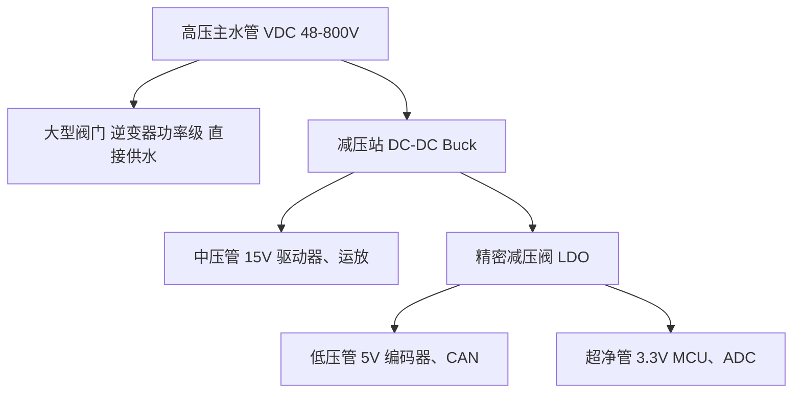
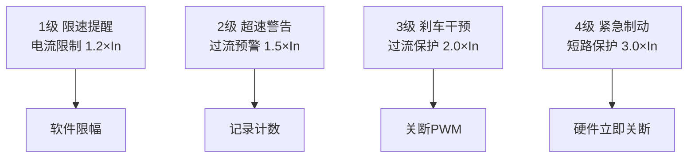
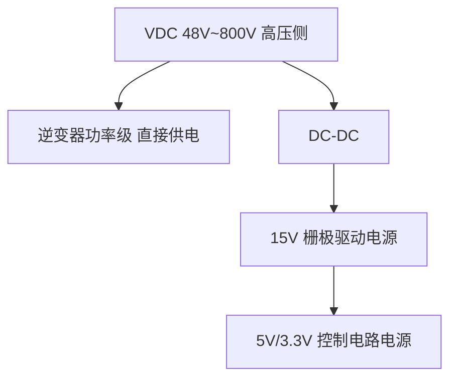
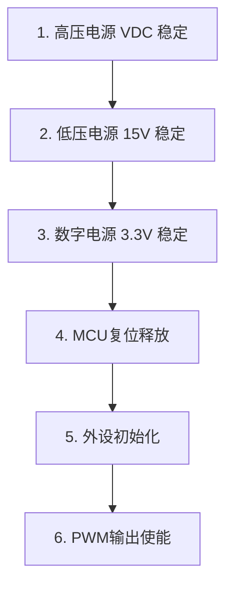
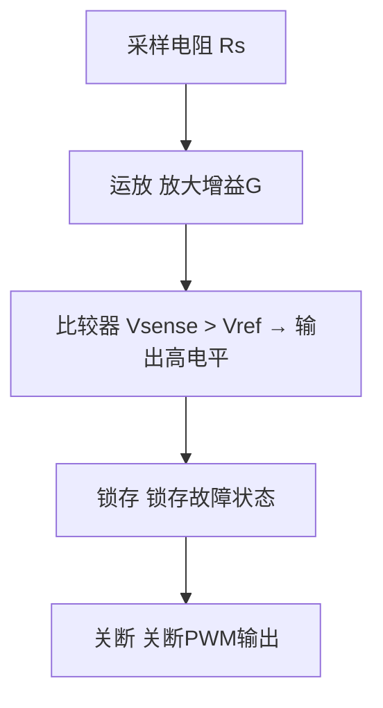
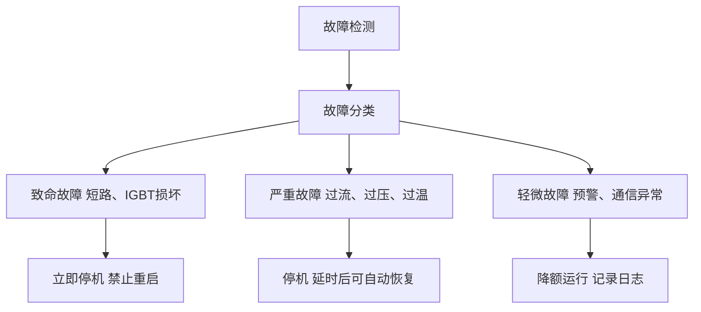
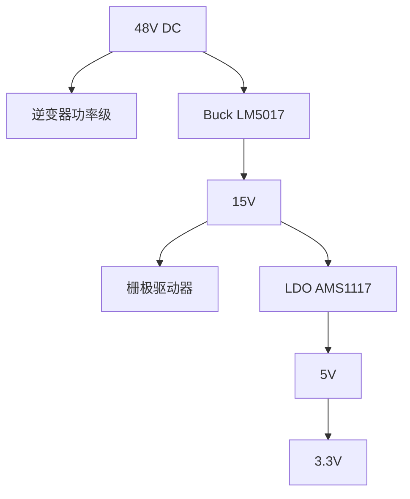
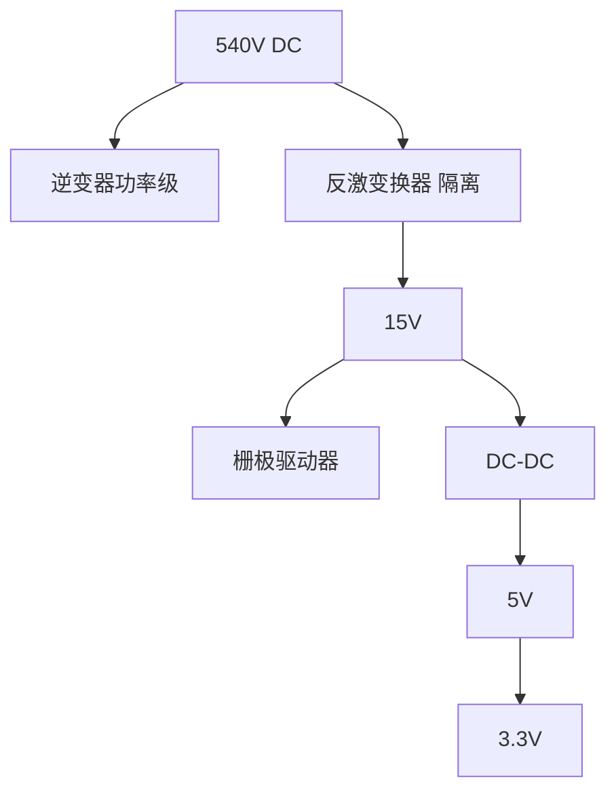

# HW-06 电源管理与保护

> 模块编号：HW-06 | 整体难度：★★★★☆ | 类型：硬件基础+工程实践+安全

---

## 1. 📌 核心摘要 ★☆☆☆☆ 🔰

**一句话讲清楚**：电源管理与保护电路是电驱系统的"免疫系统"——电源质量决定控制精度，保护响应速度决定器件寿命，故障处理策略决定系统可靠性。

**认知挂钩**：很多人以为电源就是"供电"，保护就是"加个保险丝"，**这是致命误区！** 实际上，电源管理涉及**多电压域协调、时序控制、噪声隔离**，保护电路需要**快速响应、精确判断、可靠动作**，并且要在"误保护"和"保护不足"之间找到平衡。更关键的是，**保护策略**必须与控制算法协调，实现分级保护。

**本模块核心公式**：
- Buck电感：`L = (Vin - Vout) × Vout / (Vin × ΔIL × fsw)`
- LDO功耗：`Pd = (Vin - Vout) × Iout`
- 过流阈值：`I_trip = 2.0 × In`
- NTC温度：`T = 1 / (1/T25 + ln(R/R25)/B) - 273.15`

---

## 2. 🤔 问题引入 ★★☆☆☆ 📚

### 工程师真实困惑

**困惑1**：为什么MCU的3.3V电源不能和驱动器的15V电源共用？

电源噪声会通过共地耦合。驱动器开关时产生的大电流脉冲会在地线上产生压降，如果MCU和驱动器共地，这个压降会叠加到ADC采样信号上，导致电流采样精度下降。

**困惑2**：过流保护阈值设多大合适？太小容易误保护，太大保护不了器件。

**困惑3**：电机减速时母线电压为什么会升高？怎么处理？

**困惑4**：防反接电路该选什么方案？串联二极管压降太大，P-MOSFET又不太熟。

**困惑5**：保护电路到底是硬件实现好还是软件实现好？

### 学习目标

| 目标 | 掌握程度 | 关键产出 |
|------|---------|---------|
| 掌握电驱系统电源架构设计 | 能设计多电压域电源方案 | 电源架构图 |
| 掌握DC-DC和LDO选型计算 | 能计算电感、电容、功耗 | 电源参数计算 |
| 掌握防反接电路设计 | 能选择合适的防反接方案 | 防反接电路 |
| 掌握过流/过压/欠压/过温保护 | 能设计分级保护策略 | 保护电路方案 |
| 掌握故障处理流程设计 | 能定义故障代码和恢复策略 | 故障处理框架 |
| 理解保护与算法的协调 | 能设计软硬件协同保护 | 保护策略文档 |

---

## 3. 💡 直观理解 ★★☆☆☆ 💡

### 3.1 免疫系统类比：电源管理与保护

```
人体免疫系统              电驱保护系统
─────────────────────────────────────
皮肤（第一道防线）    →   防反接、过压保护
白细胞（快速响应）    →   硬件过流保护（<1μs）
抗体（特异性识别）    →   软件保护策略（精确判断）
发烧（降额运行）      →   过温降额
免疫记忆（故障记录）  →   故障日志与诊断
```

### 3.2 水管系统类比：电源架构



**关键理解**：
- 高压侧：大电流、高效率优先
- 低压侧：低噪声、高精度优先
- 不同电压域之间需要隔离或稳压

### 3.3 保险丝类比：分级保护



### 3.4 充电宝类比：泵升电压处理

电机减速时，机械能转化为电能回馈到母线，就像手机充电宝给手机充电——但这里的"充电宝"是电机，"手机"是母线电容。如果电容"充满"了（电压过高），就需要通过制动电阻"放电"消耗多余能量。

---

## 4. 🔬 技术原理 ★★★★☆ 🔬

### 4.1 电源架构设计 ★★★☆☆

#### 4.1.1 电驱系统电源需求



```
低压侧（控制电源）
  15V ───→ 栅极驱动器、运放、霍尔传感器
  5V  ───→ 编码器、CAN收发器、外部接口
  3.3V ──→ MCU、ADC、数字电路
  1.8V ──→ MCU内核（部分高性能MCU）

隔离电源（高压应用）
  高压侧 ──→ 隔离DC-DC ──→ 低压侧（电气隔离）
  应用：高侧栅极驱动电源、隔离通信接口电源、隔离ADC电源
```

#### 4.1.2 DC-DC转换器选型

| 类型 | 效率 | 噪声 | 成本 | 应用 |
|------|------|------|------|------|
| 线性稳压器(LDO) | 30-60% | 极低 | 低 | 低噪声模拟电路、小功率 |
| Buck变换器 | 85-95% | 中 | 中 | 大电流、高效率 |
| 反激变换器 | 75-85% | 中高 | 中 | 隔离电源、多路输出 |
| 推挽变换器 | 85-90% | 中 | 高 | 高功率隔离电源 |

**选型原则**：
- 功率<1W、噪声敏感 → LDO
- 功率1-50W、效率优先 → Buck
- 需要隔离 → 反激或推挽

### 4.2 Buck变换器设计 ★★★★☆

```
Buck变换器基本电路：

        Vin ───┬───[L]───┬─── Vout
               │         │
              ╱╲        ╱╱╲ Cout
              ╲╱ D      ╲╲╱
               │         │
        SW ────┴─────────┴─── GND

工作原理：
  SW导通：Vin给L充电，电流上升
  SW关断：L通过D续流，电流下降
```

**关键参数计算**：

1. **电感选择**：
```
L = (Vin - Vout) × Vout / (Vin × ΔIL × fsw)

其中：
  ΔIL = 电感电流纹波（通常取Iout的20-40%）
  fsw = 开关频率

示例：
  Vin = 48V, Vout = 15V, Iout = 2A
  fsw = 500kHz, ΔIL = 0.5A (25%)
  
  L = (48-15) × 15 / (48 × 0.5 × 500k)
    = 495 / 12000000 = 41.25μH
  选择：47μH
```

2. **输出电容选择**：
```
Cout = ΔIL / (8 × fsw × ΔVout)

示例：ΔVout = 50mV
  Cout = 0.5 / (8 × 500k × 0.05) = 2.5μF
  选择：10μF（留裕度）
```

3. **电感饱和电流**：
```
Isat > Iout + ΔIL/2 = 2 + 0.25 = 2.25A
选择：Isat > 3A
```

**推荐Buck芯片**：LM5017 (100V, 600mA)、LM5164 (100V, 1A)、TPS54360 (60V, 3.5A)、LMR14206 (42V, 600mA)

### 4.3 LDO稳压器设计 ★★★☆☆

**LDO应用场景**：MCU电源（3.3V）、ADC基准电源、传感器电源（低噪声要求）

**LDO选型参数**：

| 参数 | 说明 | 推荐值 |
|------|------|--------|
| 输入电压范围 | 必须覆盖输入电压 | Vin_max + 20%裕度 |
| 输出电流 | 必须大于负载电流 | Iout + 50%裕度 |
| 压差 | Vin-Vout的最小值 | < 500mV（低压差应用） |
| 输出噪声 | 影响ADC精度 | < 50μVrms（高精度应用） |
| PSRR | 电源抑制比 | > 60dB @ 1kHz |
| 热阻 | 影响散热设计 | 越小越好 |

**功耗与温升计算**：
```
Pd = (Vin - Vout) × Iout

示例：Vin = 5V, Vout = 3.3V, Iout = 200mA
  Pd = (5 - 3.3) × 0.2 = 0.34W

温升计算：
  ΔT = Pd × RθJA = 0.34 × 100 = 34°C (SOT-223封装，最小焊盘条件下约100°C/W)
  Tj = Ta + ΔT = 50 + 34 = 84°C < 125°C (安全)
```

**推荐LDO芯片**：AMS1117-3.3 (15V, 1A, 低成本)、TPS7A4700 (20V, 1A, 超低噪声)、LT3042 (20V, 200mA, 超低噪声)

### 4.4 电源时序设计 ★★★☆☆



```
时序控制方法：

方法1：RC延时
  VCC ──[R]──┬── Enable
              │
             [C]
              │
             GND
  延时时间 t ≈ R × C

方法2：电源监控IC（TPS3809、TPS3839、MAX809）
  • 精确阈值检测
  • 可调延时
  • 手动复位功能

方法3：MCU软件控制
  MCU检测各电源就绪信号，按序使能外设
```

### 4.5 防反接电路设计 ★★★☆☆

#### 4.5.1 方案对比

| 方案 | 压降 | 响应时间 | 成本 | 可恢复 | 应用 |
|------|------|---------|------|--------|------|
| 串联二极管 | 0.7-1.2V | 即时 | 最低 | 否 | 小电流、低成本 |
| 桥式整流 | 1.4-2.4V | 即时 | 中 | 是 | 便携设备 |
| P-MOSFET | <0.1V | 即时 | 中 | 是 | 中大功率 |
| N-MOSFET+控制 | <0.05V | μs级 | 高 | 是 | 大功率、高效率 |
| 机械继电器 | <0.01V | ms级 | 中 | 是 | 特殊应用 |

#### 4.5.2 串联二极管方案

```
电路：Vin+ ────[D]──── 负载+

特点：最简单，但压降大（硅二极管0.7V，肖特基0.3V），发热大
功耗：P = Vf × I = 0.7V × 10A = 7W（需要散热）
适用：小电流（<5A），对效率要求不高
```

#### 4.5.3 P-MOSFET防反接电路

```
电路原理：

正确接法：
    Vin+ ────┬──── 负载+
             │
            S
            │
        ┌───┴───┐
        │ P-MOS │
        │  Q1   │
        └───┬───┘
            │
            D
            │
    Vin- ───┴──── 负载-

工作原理：
  1. 正确接法：体二极管先导通 → VGS = -Vin → MOSFET导通，压降降低
  2. 反接时：体二极管反向截止 → VGS = 0 → MOSFET截止

器件选择：
  耐压：VDS > 1.5 × Vin_max
  电流：ID > 2 × I_max
  导通电阻：RDS(on) < ΔV_max / I_max

示例：Vin = 48V, I_max = 50A, ΔV_max = 0.1V
  VDS > 72V → 选择100V器件
  RDS(on) < 0.1/50 = 2mΩ
  推荐：IPP50R199CP × 4并联
```

#### 4.5.4 N-MOSFET理想二极管

```
使用专用控制器（LTC4357等）：
  • 压降极低（<20mV）
  • 自动控制
  • 响应时间 < 1μs

推荐芯片：LTC4357、LTC4359、MAX1614
```

### 4.6 过流保护设计 ★★★★☆

#### 4.6.1 保护级别设计

| 级别 | 阈值 | 响应时间 | 动作 | 实现方式 |
|------|------|---------|------|---------|
| 电流限制 | 1.2 × In | 即时 | 限制电流给定 | 软件 |
| 过流预警 | 1.5 × In | 即时 | 记录、计数 | 软件 |
| 过流保护 | 2.0 × In | <10μs | 关断PWM | 软件+硬件 |
| 短路保护 | 3.0 × In | <1μs | 立即关断 | 硬件 |

**示例（额定电流In = 20A）**：电流限制24A、过流预警30A、过流保护40A、短路保护60A

#### 4.6.2 硬件过流保护电路

**方案1：比较器+采样电阻**



```
设计要点：
  1. 响应时间：< 1μs（快速保护）
  2. 阈值精度：±5%
  3. 抗干扰：滤波+迟滞
```

**设计示例**：
```
已知：In = 20A, I_trip = 40A, Rs = 5mΩ, G = 20, Vref = 3.3V

1. 过流时采样电压：Vs = 40 × 0.005 = 0.2V
2. 放大后电压：Vout = 0.2 × 20 = 4V（> 3.3V，需调整）
3. 重新设计：G = 15 → Vout = 0.2 × 15 = 3V ✓
4. 比较器选择：响应时间 < 100ns，迟滞 > 50mV
   推荐：LM393、TLV3501
```

**方案2：驱动器内置保护**
- IR2130：内置过流比较器
- DRV8301：内置过流保护+电流限制
- HCPL-316J：IGBT短路保护（VCE检测）

**方案3：IGBT短路保护（VCE检测）**

```
VCE检测原理：
  IGBT短路时，VCE迅速上升

          VCE
           │     正常导通
           │    ┌───────────
           │    │
           │    │      短路
           │    │     ┌─────
           └────┴─────┴─────→ 时间
                ↑     ↑
              2V    10V+

检测电路：
  VCE ───┬───[R1]───┬─── 比较器输入
          │          │
         ╱╱╲       ╱╱╲
         ╲╲╱ D     ╲╲╱ C
          │          │
         GND        GND

  二极管D用于阻断高压，C用于滤波

工作原理：
  1. 正常导通时，VCE < 2V，比较器输出低
  2. 短路时，VCE > 7V，比较器输出高
  3. 触发保护，软关断IGBT

监控时间：
  • 开通后延迟3-5μs开始检测（避开开通尖峰）
  • 检测窗口约2μs

驱动器内置保护：
  • HCPL-316J：VCE检测 + 软关断
  • IXDN609：短路保护
  • CONCEPT IGBT驱动：全面保护
```

#### 4.6.3 软件过流保护

```c
// 1. 电流限制（软限幅）
void Current_Limit(float* I_ref, float I_limit) {
    if (*I_ref > I_limit) {
        *I_ref = I_limit;
    } else if (*I_ref < -I_limit) {
        *I_ref = -I_limit;
    }
}

// 2. 电流斜坡限制
void Current_Rate_Limit(float* I_ref, float I_ref_last, float dI_max, float dt) {
    float dI = *I_ref - I_ref_last;
    if (dI > dI_max * dt) {
        *I_ref = I_ref_last + dI_max * dt;
    } else if (dI < -dI_max * dt) {
        *I_ref = I_ref_last - dI_max * dt;
    }
}

// 3. 过流计数保护
typedef struct {
    int count;
    int threshold;
    bool fault;
} Overcurrent_Counter;

void Overcurrent_Count(Overcurrent_Counter* oc, float I_measured, float I_warning) {
    if (I_measured > I_warning) {
        oc->count++;
        if (oc->count > oc->threshold) {
            oc->fault = true;
            PWM_Disable();
        }
    } else {
        oc->count = 0;
    }
}

// 4. 过流保护（硬限幅）
void Overcurrent_Protection(float I_measured, float I_trip) {
    if (fabsf(I_measured) > I_trip) {
        PWM_Disable();
        fault_code = FAULT_OVERCURRENT;
        system_state = STATE_FAULT;
    }
}
```

### 4.7 过压/欠压保护 ★★★☆☆

#### 4.7.1 电压采样电路

```
电阻分压采样：

    VDC ────[R1]────┬──── ADC
                     │
                    [R2]
                     │
                    GND

分压比：k = R2 / (R1 + R2)
ADC读数：V_ADC = VDC × k

设计示例：
  VDC_max = 100V, ADC量程 = 3.3V, ADC分辨率 = 12位

  1. 分压比：k = 3.3 / 100 = 0.033
  2. 电阻选择：R2 = 3.3kΩ, R1 = 100kΩ
  3. ADC分辨率对应电压：VDC_LSB = 25.3mV
  4. 滤波电容：C = 100nF, fc = 482Hz
```

#### 4.7.2 保护阈值设计

| 状态 | 阈值 | 动作 | 示例(48V系统) |
|------|------|------|-------------|
| 欠压锁定 | V_UVLO | 禁止启动 | 30V |
| 欠压预警 | V_UV_warn | 降额运行 | 35V |
| 正常范围 | V_min ~ V_max | 正常运行 | 40V ~ 60V |
| 过压预警 | V_OV_warn | 降额运行 | 65V |
| 过压保护 | V_OV_trip | 立即关断 | 70V |

**不同系统阈值**：
- 24V系统：欠压18V，过压32V
- 48V系统：欠压35V，过压65V
- 380V系统：欠压320V，过压450V

#### 4.7.3 软件实现

```c
typedef struct {
    float v_bus;
    float v_uvlo;
    float v_uv_warn;
    float v_ov_warn;
    float v_ov_trip;
    bool uv_fault;
    bool ov_fault;
} Voltage_Protection;

void Voltage_Check(Voltage_Protection* vp) {
    vp->v_bus = ADC_ReadVoltage();
    
    if (vp->v_bus < vp->v_uvlo) {
        vp->uv_fault = true;
        PWM_Disable();
    } else if (vp->v_bus < vp->v_uv_warn) {
        current_limit *= 0.5;  // 降额运行
    }
    
    if (vp->v_bus > vp->v_ov_trip) {
        vp->ov_fault = true;
        PWM_Disable();
    } else if (vp->v_bus > vp->v_ov_warn) {
        current_limit *= 0.5;  // 降额运行
    }
}
```

#### 4.7.4 泵升电压处理（再生制动）

**问题**：电机减速时，能量回馈到母线，导致电压升高

```
能量流向：机械能 → 电能 → 母线电容 → 电压升高

方案1：制动电阻
  VDC ────┬───[制动电阻]───┬─── GND
          │                │
         ─┴─              ╱╲
          │               ╲╱ 开关管
         GND               │
                            GND

  当 VDC > V_brake 时，开关管导通，消耗能量

  设计计算：
    VDC = 300V, Vbrake = 350V, Pregen = 5kW

    Rbrake = Vbrake² / Pregen = 350² / 5000 = 24.5Ω → 选择25Ω
    Pavg = Pregen × 占空比 = 5000 × 0.1 = 500W → 选择1000W电阻
    Imax = 350 / 25 = 14A → 选择MOSFET 500V/30A

方案2：回馈单元（能量回馈到电网，效率高、成本高）
方案3：降低减速度（软件限制，简单但影响性能）
```

### 4.8 过温保护 ★★★☆☆

#### 4.8.1 温度传感器选型

| 类型 | 精度 | 范围 | 响应速度 | 应用 |
|------|------|------|---------|------|
| NTC热敏电阻 | ±1°C | -40~150°C | 中 | 散热片、电机绕组 |
| PT100/PT1000 | ±0.5°C | -200~850°C | 慢 | 高精度测量 |
| 热电偶 | ±1°C | -200~1800°C | 快 | 高温测量 |
| 数字温度传感器 | ±0.5°C | -55~125°C | 快 | PCB、环境温度 |

#### 4.8.2 NTC热敏电阻接口电路

```
         VCC
          │
         ╱╱╲ R_pullup (10kΩ)
          │
          ├──────── ADC输入
          │
         ╱╱╲ NTC
          │
         GND

NTC阻值计算（B参数方程）：
  R = R25 × exp(B × (1/T - 1/298.15))

  其中：
    R25 = 25°C时的电阻（如10kΩ）
    B = B参数（如3380K）
    T = 绝对温度（K）
```

**ADC读取温度代码**：
```c
float NTC_ReadTemperature(uint16_t adc_value) {
    // 计算NTC电阻
    float R_ntc = R_pullup * (4095.0 / adc_value - 1);
    
    // B参数方程求温度
    float T_kelvin = 1.0 / (1.0/298.15 + 1.0/B * log(R_ntc/R25));
    float T_celsius = T_kelvin - 273.15;
    
    return T_celsius;
}
```

#### 4.8.3 过温保护策略

| 温度范围 | 动作 | 示例 |
|---------|------|------|
| T < T_warn | 正常运行 | < 80°C |
| T_warn ~ T_limit | 降额运行（电流限制随温度线性降低） | 80~100°C |
| T > T_limit | 停机保护 | > 100°C |

**降额公式**：
```
I_limit(T) = In × (T_limit - T) / (T_limit - T_warn)

示例：T_warn = 80°C, T_limit = 100°C, In = 10A
  T = 90°C时：I_limit = 10 × (100-90) / (100-80) = 5A
```

#### 4.8.4 温度估算（无传感器热模型）

```
稳态模型：
  Tj = Ta + Ploss × Rth_JA

动态热模型：
  Cth × dTj/dt = Ploss - (Tj - Ta) / Rth_JA

软件实现：
  // 一阶热模型
  float Tj_estimate = Ta;
  float thermal_tau = Rth_JA * Cth;  // 热时间常数
  
  void UpdateJunctionTemp(float dt) {
      float Ploss = CalculatePowerLoss();
      float dT = (Ploss * Rth_JA + Ta - Tj_estimate) / thermal_tau * dt;
      Tj_estimate += dT;
  }
```

### 4.9 故障处理策略 ★★★★☆

#### 4.9.1 故障处理流程



```
故障记录：
  • 故障类型
  • 故障时间
  • 故障时系统状态（电流、电压、温度、转速等）
  • 故障次数

故障恢复：
  • 自动恢复：延时后自动尝试重启
  • 手动恢复：需要人工确认后重启
  • 禁止恢复：需要更换硬件或专业维修
```

#### 4.9.2 故障代码定义

```c
typedef enum {
    FAULT_NONE = 0,
    
    // 过流故障
    FAULT_OVERCURRENT_PHASE_U = 0x01,
    FAULT_OVERCURRENT_PHASE_V = 0x02,
    FAULT_OVERCURRENT_PHASE_W = 0x03,
    FAULT_OVERCURRENT_BUS = 0x04,
    FAULT_SHORT_CIRCUIT = 0x05,
    
    // 过压/欠压故障
    FAULT_OVERVOLTAGE = 0x10,
    FAULT_UNDERVOLTAGE = 0x11,
    FAULT_SUPPLY_LOSS = 0x12,
    
    // 过温故障
    FAULT_OVERTEMP_MOTOR = 0x20,
    FAULT_OVERTEMP_DRIVER = 0x21,
    FAULT_OVERTEMP_AMBIENT = 0x22,
    
    // 传感器故障
    FAULT_ENCODER_LOSS = 0x30,
    FAULT_HALL_SENSOR = 0x31,
    FAULT_CURRENT_SENSOR = 0x32,
    
    // 通信故障
    FAULT_CAN_BUSOFF = 0x40,
    FAULT_CAN_OVERRUN = 0x41,
    FAULT_COMMUNICATION_LOSS = 0x42,
    
    // 其他故障
    FAULT_HARDWARE = 0x50,
    FAULT_SOFTWARE = 0x51,
    
} Fault_Code;
```

#### 4.9.3 故障处理代码

```c
void Fault_Handler(Fault_Code fault) {
    // 记录故障
    fault_log[fault_count].code = fault;
    fault_log[fault_count].timestamp = HAL_GetTick();
    fault_log[fault_count].current = GetMotorCurrent();
    fault_log[fault_count].voltage = GetBusVoltage();
    fault_log[fault_count].temperature = GetTemperature();
    fault_log[fault_count].speed = GetMotorSpeed();
    fault_count++;
    
    // 判断故障级别
    Fault_Level level = GetFaultLevel(fault);
    
    switch (level) {
        case FAULT_LEVEL_FATAL:
            PWM_Disable();
            system_state = STATE_FAULT_LOCKED;
            break;
            
        case FAULT_LEVEL_SEVERE:
            PWM_Disable();
            system_state = STATE_FAULT;
            fault_recovery_timer = 5000;  // 5秒后尝试恢复
            break;
            
        case FAULT_LEVEL_WARNING:
            current_limit *= 0.5;
            break;
    }
}
```

#### 4.9.4 保护电路设计清单

```
硬件保护清单：
  □ 防反接电路
  □ 过流硬件保护（比较器+锁存）
  □ 过压硬件保护
  □ 欠压锁定（UVLO）
  □ 过温保护（NTC+比较器）
  □ 短路保护（VCE检测或快速过流）
  □ 保险丝（最后防线）

软件保护清单：
  □ 电流限制（软限幅）
  □ 过流计数保护
  □ 过压/欠压检测
  □ 过温检测与降额
  □ 传感器故障检测
  □ 通信故障检测
  □ 故障记录与诊断

设计验证：
  □ 保护响应时间测试
  □ 保护阈值精度测试
  □ 故障恢复测试
  □ 极限条件测试
```

---

## 5. 🔗 交叉视角 ★★★★☆ 🔗

### 5.1 硬件↔算法关联总览

```
电源/保护参数        影响路径                  算法侧影响
─────────────────────────────────────────────────────────
保护阈值          →  电流/电压限制        →  软件保护策略
母线电压          →  最大输出电压          →  弱磁控制边界
温度              →  RDS(on)漂移          →  参数漂移补偿
电源噪声          →  ADC精度              →  电流采样精度
欠压保护          →  最低工作电压          →  控制策略切换
过温降额          →  最大允许电流          →  转矩能力限制
泵升电压          →  制动能量管理          →  减速度限制
```

### 🔗 算法关联1：保护阈值 → 软件保护策略

硬件保护阈值直接决定软件保护策略的设计空间：

```
硬件保护（快速、粗糙）     软件保护（精确、灵活）
─────────────────────────────────────────
短路保护 3.0×In <1μs  ←→  电流限制 1.2×In 即时
过流保护 2.0×In <10μs  ←→  过流预警 1.5×In 计数
过压保护 硬件比较器     ←→  过压预警 软件检测
欠压锁定 UVLO          ←→  欠压预警 降额运行
```

**协同设计原则**：
1. 硬件保护是"最后防线"，必须可靠但可能不够精确
2. 软件保护是"精细调控"，可以区分不同工况
3. 两者之间必须留有裕度，避免硬件保护在软件保护生效前就触发

```c
// 软硬件协同保护示例
void Protection_CoordinatedCheck(void) {
    float I_measured = GetCurrent();
    
    // 第一级：软件电流限制（精细调控）
    if (I_measured > I_limit) {
        I_ref = I_limit;  // 限幅
    }
    
    // 第二级：软件过流预警（计数保护）
    if (I_measured > I_warning) {
        oc_count++;
        if (oc_count > OC_THRESHOLD) {
            PWM_Disable();  // 软件关断
        }
    } else {
        oc_count = 0;
    }
    
    // 第三级：硬件过流保护（比较器，独立于软件）
    // 由硬件电路实现，响应时间 < 1μs
    // 软件无需处理，但需读取硬件保护状态
}
```

### 🔗 算法关联2：母线电压 → 弱磁控制

母线电压直接限制电机的最大输出电压，进而决定弱磁控制的进入点：

```
最大输出电压：
  Vmax = VDC / √3 (SVPWM)

弱磁控制进入条件：
  当反电动势 E > Vmax 时，必须进入弱磁

弱磁控制策略：
  if (V_ref > Vmax) {
      // 减小Id_ref（弱磁电流），降低反电动势
      Id_ref = -(E - Vmax) / (ω × Ld);
  }

母线电压变化的影响：
  VDC降低 → Vmax降低 → 弱磁提前进入 → 转矩能力下降
  VDC升高 → Vmax升高 → 弱磁推迟进入 → 但需注意过压
```

**欠压保护与弱磁的协调**：
```
当VDC下降时：
  1. VDC < V_OV_warn：正常运行
  2. VDC < V_UV_warn：降额运行，限制最大电流
  3. VDC < V_UVLO：停机保护

降额策略：
  I_limit(VDC) = In × (VDC - V_UVLO) / (V_UV_warn - V_UVLO)
```

### 🔗 算法关联3：温度 → 参数漂移补偿

温度变化导致功率器件参数漂移，影响控制精度：

```
温度对参数的影响：
  RDS(on) ∝ T^2.3  （正温度系数，温度升高电阻增大）
  VCE(sat) ∝ T     （正温度系数）
  磁体磁通 ∝ -T    （负温度系数，温度升高磁通减弱）
  电感 L ∝ -T      （负温度系数，温度升高电感减小）
```

**参数漂移补偿策略**：
```c
// RDS(on)温度补偿
float RDS_on_Compensated(float T_junction) {
    float RDS_on_25C = 0.099;  // 25°C时的导通电阻
    float temp_coeff = pow((T_junction + 273.15) / 298.15, 2.3);
    return RDS_on_25C * temp_coeff;
}

// 磁体温度补偿
float Flux_Compensated(float T_magnet) {
    float flux_25C = 0.1;  // 25°C时的磁链
    float temp_coeff = 1 - 0.001 * (T_magnet - 25);  // -0.1%/°C
    return flux_25C * temp_coeff;
}

// 热模型驱动的参数自整定
void Parameter_AutoTuning(float T_junction, float T_magnet) {
    // 根据温度更新控制参数
    float R_ds_on = RDS_on_Compensated(T_junction);
    float flux = Flux_Compensated(T_magnet);
    
    // 更新PI参数（电阻变化影响电流环）
    float Kp_new = Kp_base * (R_ds_on / RDS_on_base);
    float Ki_new = Ki_base * (R_ds_on / RDS_on_base);
    
    // 更新观测器参数（磁链变化影响角度观测）
    float flux_new = flux;
}
```

### 🔗 算法关联4：电源噪声 → ADC精度 → 电流采样

电源噪声直接影响ADC基准和采样精度：

```
噪声传播路径：
  开关噪声 → 电源纹波 → ADC基准偏移 → 采样误差 → 电流环抖动

量化分析：
  ADC基准噪声 10mV → 12位ADC (3.3V量程)
  → 1 LSB = 0.806mV → 噪声 ≈ 12 LSB
  → 电流采样误差 ≈ 12 × (I_max / 4096)
  → 如果I_max = 100A → 误差 ≈ 0.3A

改善措施：
  1. ADC基准使用独立LDO供电
  2. 采样时刻选择在PWM中心（噪声最小）
  3. 多次采样取平均
  4. 差分走线减少共模噪声
```

---

## 6. 🎯 工程案例 ★★★☆☆ 🎯

### 6.1 案例1：48V电机控制器电源与保护



```
功率预算：
  15V电源：栅极驱动功耗 ≈ 2W
  5V电源：编码器、CAN等 ≈ 1W
  3.3V电源：MCU、运放等 ≈ 0.5W
  总辅助电源功率 ≈ 5W

保护电路设计：
  1. 过流保护：DRV8301内置，I_trip = 120A（硬件），I_limit = 80A，I_warning = 100A
  2. 过压/欠压保护：V_UVLO = 30V, V_UV_warn = 35V, V_OV_warn = 55V, V_OV_trip = 60V
  3. 过温保护：NTC 10kΩ，T_warn = 80°C, T_limit = 100°C
  4. 短路保护：DRV8301内置，响应时间 < 1μs
```

### 6.2 案例2：380V变频器电源与保护



```
隔离要求：高压侧与低压侧电气隔离，隔离电压 > 2500V AC
推荐反激芯片：UC3845 (低成本)、TNY280 (集成MOSFET)、LNK306 (高效率)

保护电路设计：
  1. IGBT短路保护：VCE检测，阈值VCE_trip = 7V，监控时间3μs，响应 < 5μs
  2. 过流保护：霍尔传感器检测母线电流，I_trip = 80A（硬件），I_limit = 50A（软件）
  3. 过压保护：泵升电压处理，制动电阻50Ω/500W，V_brake = 750V
  4. 过温保护：IGBT结温NTC集成在模块内，散热片PT100，温度>80°C降额
```

### 6.3 案例3：防反接电路设计（48V/50A系统）

```
需求：48V系统，最大电流50A，要求压降<0.1V

方案选择：P-MOSFET防反接

器件选择：
  VDS > 1.5 × 48 = 72V → 选择100V器件
  ID > 2 × 50 = 100A
  RDS(on) < 0.1/50 = 2mΩ

推荐：IPP50R199CP × 4并联（每颗RDS(on)≈199mΩ，4并联≈50mΩ）
实际压降：V = 50A × 50mΩ = 2.5V → 不满足！

修正方案：使用更多MOSFET并联或选择更低RDS(on)的器件
  推荐：IRFP4468 (100V, 2.6mΩ) × 2并联 → RDS(on) ≈ 1.3mΩ
  实际压降：V = 50A × 1.3mΩ = 0.065V ✓
```

### 6.4 案例4：制动电阻设计

```
需求：300V母线，再生功率5kW，制动时间2s

计算：
  制动阈值：Vbrake = 350V
  制动电阻：Rbrake = 350² / 5000 = 24.5Ω → 选择25Ω
  制动电阻功率：Pavg = 5000 × 10% = 500W → 选择1000W
  开关管电流：Imax = 350 / 25 = 14A → 选择MOSFET 500V/30A
```

---

## 7. 📝 实践练习 ★★★★☆ 📝

### 7.1 计算题

**练习1（★☆☆☆☆）**：已知Buck变换器输入48V、输出15V、负载2A、开关频率500kHz，计算所需电感值和输出电容值（要求纹波<50mV）。

**练习2（★★☆☆☆）**：已知LDO输入5V、输出3.3V、负载200mA，封装热阻RθJA = 100°C/W，环境温度50°C，计算结温是否安全。

**练习3（★★★☆☆）**：设计一个额定电流30A的过流保护系统，给出四级保护的阈值和实现方式。

**练习4（★★★★☆）**：已知48V系统需要防反接保护，最大电流80A，要求压降<50mV，选择合适的方案并给出器件参数。

**练习5（★★★★★）**：一个380V变频器在制动时母线电压从540V升高到750V，再生功率10kW，设计制动电阻方案（包括电阻值、功率、开关管选型）。

### 7.2 设计题

**练习6（★★★☆☆）**：为一个24V/20A的BLDC控制器设计完整的电源架构和保护方案：
- 画出电源架构图
- 选择DC-DC和LDO芯片
- 设计过流、过压、欠压、过温保护阈值
- 定义故障代码

**练习7（★★★★☆）**：设计一个软硬件协同的保护系统，要求：
- 硬件保护响应时间<1μs
- 软件保护能区分过流和短路
- 过温降额策略
- 故障记录和恢复机制

### 7.3 诊断题

**练习8（★★☆☆☆）**：系统上电后MCU不工作，测量发现3.3V电源只有2.1V。可能的原因是什么？如何排查？

**练习9（★★★☆☆）**：电机在高速运行时偶尔触发过流保护，但电流波形看起来正常。可能的原因是什么？（提示：考虑噪声和采样时序）

**练习10（★★★★★）**：一个变频器在制动时频繁触发过压保护，但制动电阻已经安装。测量发现制动电阻两端没有电压。请给出完整的诊断流程。

---

## 附录：快速计算公式汇总

### A. DC-DC电感计算
```
L = (Vin - Vout) × Vout / (Vin × ΔIL × fsw)
```

### B. LDO功耗计算
```
Pd = (Vin - Vout) × Iout
ΔT = Pd × RθJA
```

### C. 过流保护阈值
```
I_limit = 1.2 × In
I_trip = 2.0 × In
I_short = 3.0 × In
```

### D. NTC温度计算
```
T = 1 / (1/T25 + ln(R/R25)/B) - 273.15
```

### E. 热模型
```
Tj = Ta + Ploss × Rth_JA
Cth × dTj/dt = Ploss - (Tj - Ta) / Rth_JA
```

### F. 电压采样分压
```
k = R2 / (R1 + R2)
V_ADC = VDC × k
```

### G. 制动电阻
```
Rbrake = Vbrake² / Pregen
```

---

**文档信息**：
- 合并来源：电源管理与保护电路 + 保护电路设计
- 重构格式：7段式知识库结构

### 🔗 hpm_MC 代码关联

**保护阈值**:
- `physical_board_t`: vbus(母线电压上限), i_max(最大电流限制)
- `mcl_control_pid_cfg_t`: integral_limit(积分限幅), output_limit(输出限幅)
- 故障检测模块 (`hpm_mcl_v2/core/detect/hpm_mcl_detect.h`): 监控 loop/encoder/analog/drivers 四子系统

**保护动作**: 检测到故障 → 回调函数 → 输出禁用（PWM紧急封锁）
