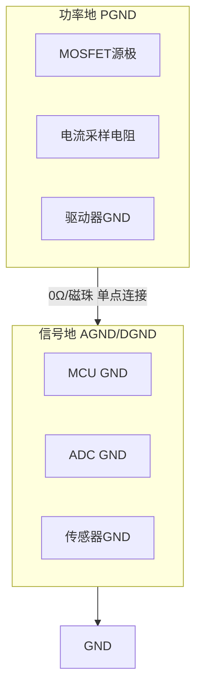
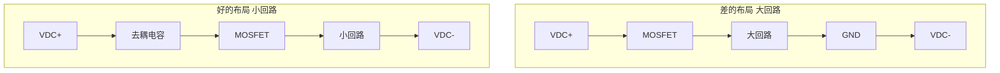
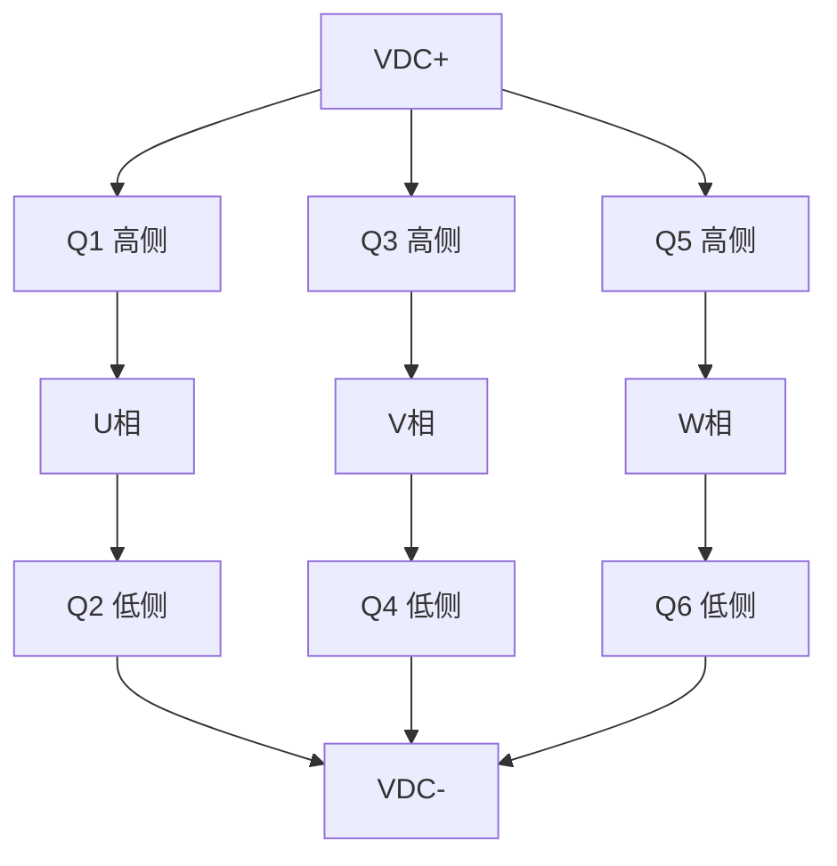
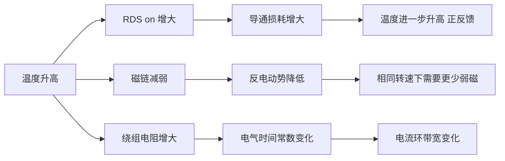

# HW-07 热设计与EMC

> 模块编号：HW-07 | 整体难度：★★★★★ | 类型：硬件基础+工程实践+可靠性

---

## 1. 📌 核心摘要 ★☆☆☆☆ 🔰

**一句话讲清楚**：热设计决定系统能否持续工作，EMC设计决定系统能否在电磁环境中正常工作——温度每升高10°C，器件寿命减半；EMI超标可能导致系统误动作甚至无法通过认证；PCB设计是硬件的最终实现，直接决定热性能、EMC性能和信号完整性。

**认知挂钩**：很多人以为热设计就是"加个散热片"，EMC就是"加个滤波器"，PCB就是"画线连点"，**这是致命误区！** 实际上，热设计需要**精确计算热阻、优化散热路径、考虑热耦合**，EMC需要**从源头抑制干扰、优化PCB布局、设计合理的滤波电路**，PCB设计涉及**电磁场理论、热力学、信号完整性、电源完整性**等多学科知识。更关键的是，**热设计、EMC设计和PCB设计必须在原理图阶段就考虑**，而不是事后补救。

**本模块核心公式**：
- 热阻：`Rth = ΔT / P`，`Tj = Ta + P × Rth_JA`
- EMI滤波器截止频率：`fc = 1 / (2π × √(L × C))`
- 功率损耗：`Ptotal = I² × RDS(on) × D + Esw × fsw`
- PCB热阻（自然对流，标准铜厚条件下适用）：`Rth ≈ 500 / (A × √A)`

---

## 2. 🤔 问题引入 ★★☆☆☆ 📚

### 工程师真实困惑

**困惑1**：为什么MOSFET明明选了足够的电流裕度，还是烧了？

可能原因：只看了额定电流，没算热阻。MOSFET的额定电流是在壳温25°C时的理论值，实际应用中壳温远高于25°C，允许电流大幅下降。

**困惑2**：EMC测试总是不过，加滤波器也没用？

可能原因：滤波器只能抑制传导干扰，辐射干扰需要从源头（PCB布局、功率回路面积）解决。如果功率回路面积太大，加再多滤波器也救不回来。

**困惑3**：为什么电流采样总是有毛刺？

可能原因：功率回路和信号回路没有分离，地平面被破坏，或者采样走线离功率走线太近。

**困惑4**：散热片选多大才够？

**困惑5**：4层板和2层板对EMC影响到底有多大？

### 学习目标

| 目标 | 掌握程度 | 关键产出 |
|------|---------|---------|
| 掌握热阻计算与散热设计 | 能计算结温并选择散热器 | 散热方案 |
| 掌握功率损耗计算 | 能区分导通损耗和开关损耗 | 损耗分析报告 |
| 掌握EMI干扰源分析 | 能识别主要干扰源和传播路径 | EMI分析表 |
| 掌握EMI滤波器设计 | 能设计共模和差模滤波器 | 滤波器参数 |
| 掌握PCB层叠设计 | 能设计4层板层叠结构 | 层叠方案 |
| 掌握功率回路优化 | 能最小化功率回路面积 | 布局方案 |
| 掌握信号完整性设计 | 能处理敏感信号和地平面 | SI方案 |
| 理解热/EMC/PCB与算法的关联 | 能设计协同优化方案 | 系统优化策略 |

---

## 3. 💡 直观理解 ★★☆☆☆ 💡

### 3.1 水管类比：热阻


```
就像串联电阻分压：
  每一层热阻都会产生温度降
  总热阻 = 各层热阻之和
  热流（功率损耗）越大，温差越大
```

### 3.2 城市规划类比：PCB布局

```
PCB布局 ≈ 城市规划

功率区 = 工业区（大电流、高噪声，集中布置）
信号区 = 住宅区（小信号、低噪声，远离工业区）
地平面 = 道路网络（必须畅通，不能断路）
去耦电容 = 便利店（就近服务，减少出行距离）
功率回路 = 物流路线（越短越好，减少交通拥堵/EMI）
```

### 3.3 噪音类比：EMI

```
EMI干扰 ≈ 噪音污染

传导干扰 = 通过管道传播的噪音（电源线、信号线）
辐射干扰 = 通过空气传播的噪音（空间电磁场）
共模干扰 = 所有管道同向传播的噪音（需要共模电感抑制）
差模干扰 = 管道之间反向传播的噪音（需要差模电容抑制）

抑制策略：
  1. 源头降噪 → 降低开关速度（增大RG）
  2. 传播阻断 → 滤波器、屏蔽
  3. 接收端防护 → 差分走线、屏蔽
```

### 3.4 体温调节类比：热设计

```
人体体温调节              电驱热管理
─────────────────────────────────────
出汗散热            →   散热片+风扇
血管扩张（增加散热） →   热管/液冷
减少活动（降额）     →   过温降额
体温过高（发烧）     →   过温保护停机
局部发热（炎症）     →   热点/热耦合
```

---

## 4. 🔬 技术原理 ★★★★☆ 🔬

### 4.1 热设计基础 ★★★☆☆

#### 4.1.1 热阻概念


```
总热阻：Rth_JA = Rth_JC + Rth_CS + Rth_SA
结温计算：Tj = Ta + P × Rth_JA
```

**典型热阻参数**：

| 器件类型 | Rth_JC (°C/W) | Rth_CS (°C/W) | Rth_SA | 说明 |
|---------|---------------|---------------|--------|------|
| TO-247封装 | 0.5-1.0 | 0.1-0.3 | 取决于散热片 | 大功率MOSFET |
| TO-220封装 | 1.0-2.0 | 0.3-0.5 | 取决于散热片 | 中小功率 |
| D2PAK封装 | 1.0-2.0 | 直接焊PCB | 取决于PCB | 表面贴装 |
| IGBT模块 | 0.1-0.3 | 0.05-0.1 | 取决于散热片 | 大功率模块 |

#### 4.1.2 功率损耗计算

**MOSFET/IGBT功率损耗**：

1. **导通损耗**：
```
Pcond = I² × RDS(on) × D    (MOSFET)
Pcond = VCE(sat) × I × D    (IGBT)

其中：
  I = 电流有效值
  RDS(on) = 导通电阻
  D = 占空比
```

2. **开关损耗**：
```
Psw = Esw × fsw

其中：
  Esw = 单次开关损耗能量（数据表给出）
  fsw = 开关频率
```

3. **续流二极管损耗**：
```
Pdiode = VF × Iavg × (1-D)
```

4. **总损耗**：
```
Ptotal = Pcond + Psw + Pdiode
```

> 功率器件开关损耗的详细推导，参见 [HW-05-Power-Devices-Gate-Drivers](HW-05-Power-Devices-Gate-Drivers.md) §4.5

**手推计算示例**：
```
已知：MOSFET: IPP60R099C6
  RDS(on) = 99mΩ @ 100°C
  电流 I = 10A (有效值)
  占空比 D = 0.5
  开关频率 fsw = 20kHz
  Esw(on) = 0.5mJ, Esw(off) = 0.3mJ

解：
  1. 导通损耗：Pcond = 10² × 0.099 × 0.5 = 4.95W
  2. 开关损耗：Psw = (0.5 + 0.3) × 10^-3 × 20000 = 16W
  3. 总损耗：Ptotal = 4.95 + 16 = 20.95W

结论：开关损耗是主要损耗来源！
```

#### 4.1.3 散热器选型

**选型步骤**：

```
步骤1：计算功率损耗 Ploss
步骤2：确定最高结温 Tj_design = Tj_max - 20°C（留裕度）
步骤3：确定环境温度 Ta（工业40°C，汽车60°C）
步骤4：计算允许热阻 Rth_JA_max = (Tj_design - Ta) / Ploss
步骤5：计算散热器热阻 Rth_SA_max = Rth_JA_max - Rth_JC - Rth_CS
```

**手推计算示例**：
```
已知：Ploss = 20W, Tj_design = 130°C, Ta = 40°C
  Rth_JC = 0.7°C/W, Rth_CS = 0.2°C/W

解：
  Rth_JA_max = (130 - 40) / 20 = 4.5°C/W
  Rth_SA_max = 4.5 - 0.7 - 0.2 = 3.6°C/W
  选择散热器：Rth_SA < 3.6°C/W
```

**散热器类型对比**：

| 类型 | 热阻范围 | 成本 | 应用 | 特点 |
|------|---------|------|------|------|
| 铝挤压散热器 | 2-10°C/W | 低 | 中小功率 | 成本低 |
| 铝型材散热器 | 1-5°C/W | 中 | 中功率 | 可定制 |
| 铜散热器 | 0.5-2°C/W | 高 | 大功率 | 热阻小 |
| 热管散热器 | 0.2-1°C/W | 高 | 大功率紧凑空间 | 效率高 |
| 液冷板 | 0.1-0.5°C/W | 很高 | 大功率高密度 | 效率最高 |

**散热器热阻估算**：
```
Rth_SA ≈ 50 / (√A × √v)

其中：
  A = 散热器表面积 (cm²)
  v = 空气流速 (m/s)，自然对流时 v ≈ 0.5

示例：A = 500 cm², v = 0.5 m/s
  Rth_SA ≈ 50 / (22.4 × 0.707) = 3.16°C/W
```

#### 4.1.4 热仿真

**一阶RC热模型**：
```
Ploss ───[Rth]───┬─── Tj
                   │
                  [Cth]
                   │
                  Ta

热时间常数：τ = Rth × Cth
温度响应：Tj(t) = Ta + Ploss × Rth × (1 - e^(-t/τ))
```

**手推计算示例**：
```
已知：Rth_JA = 5°C/W, Cth = 100 J/°C, Ploss = 20W, Ta = 40°C

解：
  τ = 5 × 100 = 500s ≈ 8.3分钟
  稳态结温：Tj_ss = 40 + 20 × 5 = 140°C
  达到95%稳态的时间：t = 3τ = 1500s = 25分钟
```

**瞬态热阻抗**：
```
实际器件的热阻抗是时间的函数：
  Zth(t) = Rth × (1 - e^(-t/τ))

对于脉冲负载：
  Tj_peak = Ta + Ppulse × Zth(t_pulse)

示例：Ppulse = 100W, t_pulse = 1s, Zth(1s) = 0.5°C/W
  Tj_peak = 40 + 100 × 0.5 = 90°C (安全)
```

### 4.2 EMC设计基础 ★★★★☆

#### 4.2.1 EMI干扰源分析

| 干扰源类型 | 频率范围 | 特点 | 主要影响 |
|-----------|---------|------|---------|
| PWM开关噪声 | 基频+谐波 | 能量大、周期性 | 传导+辐射 |
| 高频振荡 | 10-100MHz | 尖峰、衰减快 | 辐射干扰 |
| 反向恢复电流 | 高频 | 尖峰、能量集中 | 传导干扰 |
| 电机换相 | 低频 | 与转速相关 | 低频传导 |
| 续流二极管 | 高频 | 与开关同步 | 传导+辐射 |

**干扰传播路径**：
- 传导：通过电源线、信号线传播
- 辐射：通过空间电磁场传播
- 耦合：通过寄生电容、电感耦合

#### 4.2.2 传导EMI抑制

**1. 共模滤波器**：
```
共模干扰：三相电流同向流动，通过地线返回

电路：
  L ────┬────[Lcm]────┬──── L'
        │             │
       ╱╱╲           ╱╱╲
       ╲╲╱ C_Y       ╲╲╱ C_Y
        │             │
  N ────┴────[Lcm]────┴──── N'
                │
               PE

共模电感：Lcm（所有相线绕在同一磁芯上）
Y电容：C_Y（相线对地）
```

**2. 差模滤波器**：
```
差模干扰：相线之间的干扰

电路：
  L ────[Ldm]───┬──── L'
                 │
                ╱╱╲ C_X
                ╲╲╱
                 │
  N ────────────┴──── N'

差模电感：Ldm（独立电感）
X电容：C_X（相线之间）
```

**3. 完整EMI滤波器**：
```
L ──[Ldm]──┬──[Lcm]──┬──[Lcm]──┬── L'
            │         │         │
           C_X       C_Y       C_Y
            │         │         │
N ──[Ldm]──┴──[Lcm]──┴──[Lcm]──┴── N'
```

**滤波器参数计算**：
```
截止频率：fc = 1 / (2π × √(L × C))
插入损耗：IL = 20 × log10(1 + (f/fc)²) dB

设计示例：
  开关频率 fsw = 20kHz
  目标衰减 @ 150kHz = 40dB

  40dB → 衰减倍数 = 100
  100 = (150k/fc)²
  fc = 15kHz

  选择 L = 1mH, C = 0.1μF
  fc = 1 / (2π × √(1m × 0.1μ)) = 15.9kHz ✓
```

#### 4.2.3 辐射EMI抑制

**1. 屏蔽**：
```
屏蔽效能：SE = R + A + B
  R = 反射损耗
  A = 吸收损耗
  B = 多次反射修正

屏蔽材料选择：
  • 低频磁场：高导磁率材料（坡莫合金、硅钢）
  • 高频电场：高导电率材料（铜、铝）
  • 宽频带：多层复合材料
```

**2. PCB布局优化**：
```
关键原则：
  • 功率回路面积最小化
  • 高频信号远离敏感电路
  • 地平面完整
  • 去耦电容靠近IC
```

**3. 缓冲电路（RC吸收）**：
```
      ┌───[R]───┬───┐
      │         │   │
D ────┴─────────┴───┴─── S
            │   │
           ╱╱╲ ╱╱╲
           ╲╲╱ ╲╲╱ C
            │   │
           GND GND

参数计算：
  C = I × tr / Vspike
  R = 2 × √(Lparasitic / C)

其中：
  I = 关断电流
  tr = 电压上升时间
  Vspike = 允许尖峰电压
  Lparasitic = 回路寄生电感
```

#### 4.2.4 接地设计

**1. 单点接地 vs 多点接地**：
```
低频（<1MHz）：单点接地 → 避免地环路
高频（>10MHz）：多点接地 → 减小地阻抗
混合接地：低频单点、高频多点
```

**2. 功率地与信号地分离**：


**3. 地平面设计**：
```
多层PCB地平面：
  • 顶层：信号走线
  • 第二层：完整地平面（GND）
  • 第三层：电源平面
  • 底层：信号走线

地平面开槽问题：
  ❌ 错误：地平面有狭缝 → 回流被迫绕行 → EMI增大
  ✓ 正确：完整地平面 → 回流直接返回 → EMI最小

地平面过孔：
  • 在高频信号附近增加接地过孔
  • 减小回流路径
```

### 4.3 PCB层叠设计 ★★★☆☆

#### 4.3.1 层叠结构选择

| 层数 | 结构 | 应用 | 成本 |
|------|------|------|------|
| 2层 | 顶层信号+电源，底层信号+地 | 简单控制板 | 低 |
| 4层 | 顶层信号，内层1地，内层2电源，底层信号 | 大多数电驱板（推荐） | 中 |
| 6层 | 顶层信号，内层1地，内层2-3信号，内层4电源，底层信号 | 高性能伺服驱动 | 高 |

#### 4.3.2 4层板层叠设计

```
典型4层板层叠：

  层次   │ 厚度   │ 材料   │ 用途
  ───────┼────────┼────────┼────────────────────────────────
  顶层    │ 35μm   │ 铜     │ 信号走线、功率器件、大电流走线
  PP     │ 0.1mm  │ FR4    │ 介质层
  内层1   │ 35μm   │ 铜     │ 完整地平面（GND）
  Core   │ 1.0mm  │ FR4    │ 核心层
  内层2   │ 35μm   │ 铜     │ 电源平面（VCC）
  PP     │ 0.1mm  │ FR4    │ 介质层
  底层    │ 35μm   │ 铜     │ 信号走线、敏感电路

  总厚度：约1.6mm
```

**设计要点**：
1. 地平面完整性：内层1作为完整地平面，避免开槽
2. 电源平面分割：内层2分割为多个电源区域
3. 信号层规划：顶层功率器件和大电流走线，底层敏感信号和MCU电路

#### 4.3.3 阻抗控制

```
微带线阻抗计算：

          ┌─────────────────┐
          │    信号线 W     │
          └────────┬────────┘
                   │ H (介质厚度)
    ┌──────────────┴──────────────┐
    │          地平面              │
    └─────────────────────────────┘

阻抗公式（近似）：
  Z0 ≈ 87 / √(εr + 1.41) × ln(5.98H / (0.8W + T))

手推计算示例：
  εr = 4.5, H = 4mil, W = 6mil, T = 1.4mil

  Z0 ≈ 87 / 2.43 × ln(23.92 / 6.2)
     ≈ 35.8 × 1.35 ≈ 48.3Ω

常用阻抗：
  • 单端信号：50Ω
  • 差分信号：100Ω
  • CAN：120Ω
```

### 4.4 功率回路设计 ★★★★☆

#### 4.4.1 功率回路面积最小化



```
关键原则：
  1. 去耦电容紧靠功率器件
  2. 电源走线短而宽
  3. 地回路直接返回
```

#### 4.4.2 三相逆变器布局



```
布局要点：
  1. 每相上下桥臂靠近放置
  2. 去耦电容紧靠MOSFET
  3. 栅极驱动器靠近MOSFET
  4. 电流采样电阻在低侧

去耦电容布局：
  VDC+ ───┬───[C1]───┬───[C2]───┬───
          │          │          │
         ┌┴┐        ┌┴┐        ┌┴┐
         │Q1│       │Q3│       │Q5│
         └┬┘        └┬┘        └┬┘
          │          │          │
  VDC- ───┴──────────┴──────────┴───

  C1, C2: 陶瓷电容（100nF + 1μF）
  布局原则：大电容在外，小电容在内，电容紧靠MOSFET引脚
```

#### 4.4.3 栅极驱动布局

```
关键要点：
  1. 驱动器紧靠MOSFET（距离<10mm）
  2. 栅极电阻紧靠驱动器输出
  3. 自举电容紧靠驱动器
  4. 栅极走线短而宽（>0.3mm）
  5. 齐纳二极管保护栅极
```

### 4.5 信号完整性设计 ★★★★☆

#### 4.5.1 地平面设计

```
差的设计（地平面开槽）：
  信号走线 ─────────────────────
                   │
                   │ 开槽
                   │
  地平面     ──────┼────── 地平面
                   │
                   ▼
             回流被迫绕行！

好的设计（完整地平面）：
  信号走线 ─────────────────────

  ┌─────────────────────────────┐
  │                             │
  │      完整地平面             │
  │                             │
  └─────────────────────────────┘
             回流直接返回！
```

#### 4.5.2 敏感信号处理

| 信号类型 | 特点 | 处理方法 |
|---------|------|---------|
| 电流采样 | 小信号、高阻抗 | 差分走线、屏蔽、滤波 |
| 位置传感器 | 高频、数字 | 远离功率器件、屏蔽 |
| ADC输入 | 高阻抗 | 短走线、RC滤波 |
| 参考电压 | 高精度 | 远离噪声源、去耦 |
| 复位信号 | 低电平有效 | 上拉电阻、滤波电容 |

**差分走线设计**：
```
  D+ ───────────────────────────
  D- ───────────────────────────
  │←── S ──→│  间距

  要求：等长（误差<5mil）、等距、平行走线、避免过孔
```

**ADC输入滤波**：
```
      信号源
        │
        ├───[Rs]───┬─── ADC输入
        │          │
       ╱╱╲        ╱╱╲
       ╲╲╱ Cs     ╲╲╱ Cf
        │          │
       GND        GND

  参数：Rs = 100Ω~1kΩ, Cs = 1nF~10nF, Cf = 100pF~1nF
  截止频率：fc = 1 / (2π × Rs × Cs)
```

#### 4.5.3 电源完整性

**去耦电容配置**：
```
VCC ────┬──────────── IC电源引脚
        │
       ╱╱╲ C1 (100nF)  高频去耦
       ╲╲╱
        │
       ╱╱╲ C2 (1μF)    中频去耦
       ╲╲╱
        │
       ╱╱╲ C3 (10μF)   低频去耦
       ╲╲╱
        │
       GND

布局原则：C1最靠近IC引脚，C2次之，C3可稍远
```

**PDN（电源分配网络，Power Distribution Network）分析**：
```
目标阻抗：Ztarget = ΔV / ΔI

示例：3.3V电源，允许波动5%，瞬态电流1A
  Ztarget = 165mV / 1A = 165mΩ

频率范围：
  DC ~ 1kHz：稳压器
  1kHz ~ 1MHz：大电容
  1MHz ~ 100MHz：小电容
  >100MHz：PCB平面电容
```

### 4.6 PCB散热设计 ★★★☆☆

#### 4.6.1 铜箔散热

```
功率器件的铜箔面积：

  ┌───────────────────────────┐
  │      功率器件              │
  └───────────┼───────────────┘
              │
  ┌───────────┴──────────┐
  │    散热铜箔            │
  │    (大面积铺铜)         │
  └──────────────────────┘

热阻估算：
  Rth ≈ 500 / (A × √A)
  其中 A = 铜箔面积 (cm²)

示例：A = 10 cm²
  Rth ≈ 500 / (10 × 3.16) = 15.8°C/W
```

#### 4.6.2 热过孔

```
热过孔设计：
  顶层铜箔 ────┬──── 底层铜箔
               │
              ╱╲ 热过孔
              ╲╱
               │
              铜填充

过孔参数：直径0.3mm，间距1mm，阵列排列

热阻计算：
  单个过孔热阻 ≈ 100°C/W (0.3mm直径)
  多个过孔并联：Rth_total = Rth_single / N

示例：N = 10个过孔
  Rth_total = 100 / 10 = 10°C/W
```

#### 4.6.3 散热焊盘

```
功率器件底部散热焊盘：
  ┌───────────────────────────┐
  │      功率器件              │
  │      ┌─────────┐          │
  │      │散热焊盘 │          │
  │      └────┬────┘          │
  └───────────┼───────────────┘
              │
         热过孔阵列
              │
  ┌───────────┴───────────────┐
  │      底层散热铜箔          │
  └───────────────────────────┘
```

#### 4.6.4 PCB热仿真

```
1. 一维热阻模型：
  Tj = Ta + P × (Rth_JC + Rth_CS + Rth_SA)

2. PCB热阻估算（垂直方向）：
  Rth_PCB = t / (k × A)
  其中 k = 0.3 W/m·K (FR4)

  示例：t = 1.6mm, A = 1cm²
  Rth_PCB = 0.0016 / (0.3 × 0.0001) = 53.3°C/W

3. 热耦合分析：
  T1 = Ta + P1 × Rth1 + P2 × Rth_coupling
  Rth_coupling ≈ Rth1 × Rth2 / (Rth1 + Rth2) × 距离因子
```

---

## 5. 🔗 交叉视角 ★★★★☆ 🔗

### 5.1 硬件↔算法关联总览

```
热/EMC/PCB参数        影响路径                  算法侧影响
─────────────────────────────────────────────────────────
温升              →  RDS(on)增大          →  参数自整定
EMI辐射           →  采样噪声            →  控制精度
PCB布局           →  信号完整性          →  控制精度
功率回路面积       →  寄生电感            →  开关尖峰/EMI
地平面完整性       →  ADC精度             →  电流采样精度
散热能力          →  最大允许电流          →  转矩能力
热耦合            →  多器件温升互相影响    →  降额策略
```

### 🔗 算法关联1：温升 → 参数自整定

温度变化导致电机和功率器件参数漂移，控制算法需要自适应调整：

```
温度对关键参数的影响：
  RDS(on) ∝ T^2.3     （正温度系数）
  磁体磁通 ∝ -T       （负温度系数，-0.1%/°C典型）
  电感 L ∝ -T         （负温度系数）
  铜电阻 ∝ T          （正温度系数，+0.393%/°C）
```

**参数自整定策略**：
```c
// 基于温度的参数自整定
void Parameter_AutoTuning(float T_junction, float T_magnet, float T_winding) {
    // 1. RDS(on)温度补偿 → 影响导通损耗估算
    float R_ds_on = RDS_on_25C * pow((T_junction + 273.15) / 298.15, 2.3);
    
    // 2. 磁链温度补偿 → 影响角度观测器和弱磁控制
    float flux = flux_25C * (1 - 0.001 * (T_magnet - 25));
    
    // 3. 绕组电阻温度补偿 → 影响电流环PI参数
    float R_s = R_s_25C * (1 + 0.00393 * (T_winding - 25));
    
    // 4. 更新电流环PI参数
    // 电阻增大 → 需要增大Kp以保持带宽
    float Kp_new = Kp_base * (R_s / R_s_base);
    float Ki_new = Ki_base * (R_s / R_s_base);
    
    // 5. 更新观测器参数
    // 磁链减小 → 需要调整反电动势补偿
    float flux_new = flux;
    
    // 6. 更新热模型损耗估算
    float P_cond = I_rms * I_rms * R_ds_on * D;
    UpdateThermalModel(P_cond + P_sw);
}
```

**温升对控制性能的影响链**：


### 🔗 算法关联2：EMI → 采样噪声

EMI直接影响电流和电压采样的信噪比，进而影响控制精度：


```
量化分析：
  假设EMI导致采样噪声为 N_emi (A rms)
  电流环带宽为 f_bw (Hz)
  
  转矩纹波 = Kt × N_emi
  转速波动 = Kt × N_emi / J × (1 / s)
```

**EMI-aware采样策略**：
```c
// PWM同步采样：在PWM中心采样，此时开关噪声最小
void ADC_SynchronizedSampling(void) {
    // 等待PWM中心点
    WaitPWMCenter();
    
    // 触发ADC采样
    ADC_StartConversion();
    
    // 多次采样取平均（降低随机噪声）
    float I_sample = 0;
    for (int i = 0; i < N_SAMPLES; i++) {
        I_sample += ADC_Read();
    }
    I_sample /= N_SAMPLES;
}

// 数字滤波：抑制高频EMI噪声
float EMI_Filter(float I_raw) {
    // 一阶低通滤波
    static float I_filtered = 0;
    float alpha = 0.1;  // 滤波系数
    I_filtered = alpha * I_raw + (1 - alpha) * I_filtered;
    return I_filtered;
}
```

### 🔗 算法关联3：PCB布局 → 信号完整性 → 控制精度

PCB布局质量直接决定信号完整性，影响传感器精度和控制精度：


**PCB布局优化对控制精度的量化影响**：
```
差的布局：电流采样噪声 ≈ 200mA rms → 转矩纹波 ≈ 5%
一般布局：电流采样噪声 ≈ 50mA rms  → 转矩纹波 ≈ 1.5%
好的布局：电流采样噪声 ≈ 10mA rms  → 转矩纹波 ≈ 0.3%

关键优化措施：
  1. 功率回路面积最小化 → EMI降低20dB
  2. 完整地平面 → 采样零漂降低90%
  3. 差分走线 → 共模抑制提高40dB
  4. PWM同步采样 → 开关噪声抑制30dB
```

### 5.2 热/EMC/PCB协同设计原则

| 设计维度 | 协同要点 | 冲突处理 |
|---------|---------|---------|
| 热设计 vs EMC | 散热片可能成为辐射天线 | 散热片接地 |
| PCB层数 vs 成本 | 更多层改善SI/EMC但增加成本 | 4层是最佳性价比 |
| 功率回路 vs 散热 | 器件靠近减小回路但影响散热 | 优先保证回路小 |
| 滤波器 vs 体积 | 更多滤波元件改善EMC但增大体积 | 源头抑制优先 |
| 采样精度 vs 速度 | 多次采样提高精度但增加延迟 | 根据带宽要求折中 |

---

## 6. 🎯 工程案例 ★★★☆☆ 🎯

### 6.1 案例1：2kW电机控制器热设计

```
系统参数：母线电压48V，额定功率2kW，额定电流50A，fsw = 20kHz，Ta = 40°C

功率器件：MOSFET: IPP60R099C6 × 6 (三相桥)

损耗计算：
  1. 单个MOSFET损耗
     I_phase = 50/√3/√2 = 20.4A (相电流有效值)
     Pcond = 20.4² × 0.12 × 0.5 = 25W
     Psw = 0.8mJ × 20kHz = 16W
     Ptotal = 25 + 16 = 41W (单个MOSFET)

  2. 三相桥总损耗：Ptotal_3phase = 41 × 6 = 246W

散热器设计（6个MOSFET共用同一散热器，需考虑热耦合）：
  总损耗：Ptotal_3phase = 246W
  Rth_SA_req = ((130 - 40) / 246) - 0.7 - 0.2 = 0.37 - 0.9 → 不足，散热器已无法满足自然冷却
  必须采用强制风冷方案：
  选择铝型材散热器 + 风扇：Rth_SA ≈ 0.22°C/W（强制风冷，风速≥3m/s）

验证（单个MOSFET结温）：
  散热器温度：Ts = 40 + 246 × 0.22 = 94.1°C
  单个MOSFET结温：Tj = 94.1 + 41 × (0.7 + 0.2) = 131°C ≈ 130°C → 临界，需进一步优化
  优化方案：选用更低Rth_JC的器件（如TO-247封装 Rth_JC=0.4°C/W）或并联MOSFET分摊热耗
```

### 6.2 案例2：EMI滤波器设计

```
系统参数：母线电压48V，额定功率2kW，fsw = 20kHz，EMC标准：EN 61800-3

传导EMI限值（EN 61800-3）：
  150k-500kHz：准峰值79 dBμV，平均值66 dBμV
  500k-30MHz：准峰值73 dBμV，平均值60 dBμV

滤波器设计：
  1. 差模滤波器：目标衰减@150kHz = 50dB
     fc = 150k / 10^1.25 = 8.4kHz
     选择：Ldm = 470μH × 2, Cx = 1μF
     fc = 1 / (2π × √(470μ × 2 × 1μ)) = 5.2kHz ✓

  2. 共模滤波器：目标衰减@150kHz = 40dB
     选择：Lcm = 10mH, Cy = 4.7nF × 2
     fc = 1 / (2π × √(10m × 4.7n)) = 23.2kHz
     衰减@150kHz ≈ 32dB → 需要增加一级

  3. 完整滤波器电路：
     L ──[470μH]──┬──[10mH]──┬──[10mH]──┬──[470μH]── L'
                   │          │          │
                  1μF        4.7nF      4.7nF
                   │          │          │
     N ──[470μH]──┴──[10mH]──┴──[10mH]──┴──[470μH]── N'
                              │          │
                             PE         PE
     总衰减@150kHz ≈ 82dB ✓
```

### 6.3 案例3：三相逆变器PCB布局优化

```
优化前后对比：

优化前（2层板，差布局）：
  • 功率回路面积：50cm²
  • 电流采样噪声：200mA
  • EMI@150kHz：95dBμV（超标）
  • 转矩纹波：5%

优化后（4层板，好布局）：
  • 功率回路面积：5cm²（减小10倍）
  • 电流采样噪声：15mA（改善13倍）
  • EMI@150kHz：65dBμV（合格）
  • 转矩纹波：0.5%

关键优化措施：
  1. 从2层板升级到4层板
  2. 去耦电容紧靠MOSFET
  3. 功率地和信号地分离
  4. 电流采样差分走线
  5. ADC输入RC滤波
```

### 6.4 案例4：热管散热方案

```
需求：5kW伺服驱动器，6个IGBT模块，总损耗300W，环境温度50°C

传统方案：
  铝型材散热器 Rth_SA = 0.5°C/W
  尺寸：400mm × 200mm × 100mm
  重量：5kg

热管方案：
  热管+铝散热片 Rth_SA = 0.2°C/W
  尺寸：300mm × 150mm × 80mm
  重量：2.5kg

优势：体积减小40%，重量减轻50%，热阻降低60%
```

### 6.5 案例5：PCB热设计综合方案

```
需求：D2PAK封装MOSFET，损耗5W，无外部散热器

方案：
  1. 顶层大面积铺铜（散热焊盘 + 周围铺铜）
     铜箔面积 = 10cm² → Rth ≈ 15.8°C/W

  2. 热过孔阵列（10个0.3mm过孔）
     Rth_via = 100/10 = 10°C/W

  3. 底层散热铜箔
     通过热过孔连接到底层铺铜

  4. 总热阻估算
     Rth_JA ≈ Rth_JC + Rth_copper || Rth_via
            ≈ 2.0 + (15.8 × 10) / (15.8 + 10)
            ≈ 2.0 + 6.1 = 8.1°C/W

  5. 结温验证
     Tj = 50 + 5 × 8.1 = 90.5°C < 130°C ✓
```

---

## 7. 📝 实践练习 ★★★★☆ 📝

### 7.1 计算题

**练习1（★☆☆☆☆）**：已知MOSFET的RDS(on) = 80mΩ @ 100°C，电流15A有效值，占空比0.5，开关损耗能量Esw = 0.6mJ，fsw = 20kHz，计算总损耗。

**练习2（★★☆☆☆）**：已知Ploss = 25W，Tj_design = 130°C，Ta = 45°C，Rth_JC = 0.8°C/W，Rth_CS = 0.2°C/W，计算所需的散热器热阻。

**练习3（★★★☆☆）**：设计一个EMI滤波器，要求在150kHz处衰减40dB，开关频率20kHz。给出电感和电容参数。

**练习4（★★★★☆）**：一个三相逆变器使用6个MOSFET，每个损耗30W，Rth_JC = 0.7°C/W，Rth_CS = 0.2°C/W，Ta = 40°C。设计散热方案（自然对流），要求Tj < 130°C。计算散热器热阻并选择合适的散热器。

**练习5（★★★★★）**：一个2kW电机控制器在EMC测试中传导发射超标15dB @ 200kHz。已知开关频率20kHz，现有滤波器只有一级LC。分析可能的原因，设计改进方案，并计算改进后的衰减量。

### 7.2 设计题

**练习6（★★★☆☆）**：为一个48V/2kW的三相电机控制器设计PCB：
- 选择层叠结构
- 画出功率区布局方案
- 设计地平面分割方案
- 标注关键走线宽度

**练习7（★★★★☆）**：设计一个完整的散热方案：
- 6个TO-247封装MOSFET，每个损耗20W
- 环境温度50°C，要求Tj < 125°C
- 选择散热器并计算验证
- 考虑热耦合效应

### 7.3 诊断题

**练习8（★★☆☆☆）**：MOSFET在满载运行时温度持续升高直到触发过温保护，但选型时计算的热阻应该足够。可能的原因是什么？

**练习9（★★★☆☆）**：电流采样信号上有与PWM开关同步的尖峰，幅值约200mA。分析可能的原因，并给出从PCB布局到软件滤波的完整解决方案。

**练习10（★★★★★）**：一个伺服驱动器在EMC测试中辐射发射在50-100MHz频段超标。已知使用4层板，功率回路面积已优化。请分析可能的原因（考虑缓冲电路、屏蔽、走线等），给出完整的诊断和整改方案。

---

## 附录：快速计算公式汇总

### A. 热阻计算
```
Rth = ΔT / P
Tj = Ta + P × Rth_JA
Rth_JA = Rth_JC + Rth_CS + Rth_SA
Rth_SA ≈ 50 / (√A × √v)
```

### B. 功率损耗
```
Pcond = I² × RDS(on) × D    (MOSFET)
Pcond = VCE(sat) × I × D    (IGBT)
Psw = Esw × fsw
Pdiode = VF × Iavg × (1-D)
Ptotal = Pcond + Psw + Pdiode
```

### C. 热时间常数
```
τ = Rth × Cth
Tj(t) = Ta + P × Rth × (1 - e^(-t/τ))
Zth(t) = Rth × (1 - e^(-t/τ))
```

### D. EMI滤波器
```
fc = 1 / (2π × √(L × C))
IL = 20 × log10(1 + (f/fc)²) dB
```

### E. 特性阻抗
```
Z0 ≈ 87 / √(εr + 1.41) × ln(5.98H / (0.8W + T))
```

### F. 功率回路电感
```
L ≈ μ0 × l × (ln(2l/w) + 0.5)
```

### G. PCB热阻
```
Rth_PCB ≈ 500 / (A × √A)  (铜箔散热)
Rth_PCB = t / (k × A)      (FR4垂直方向)
Rth_via ≈ 100 / N          (N个过孔并联)
```

### H. PDN目标阻抗
```
Ztarget = ΔV / ΔI
```

### I. 缓冲电路
```
C = I × tr / Vspike
R = 2 × √(Lparasitic / C)
```

---

**文档信息**：
- 合并来源：热设计与EMC + PCB设计
- 重构格式：7段式知识库结构

### 🔗 hpm_MC 代码关联

**温度保护**: hpm_mcl_v2 未内置温度检测模块，建议应用层通过 ADC 额外通道实现
**EMC 相关**:
- 死区补偿减少电流谐波（`HPM_MCL_ENABLE_DEAD_AREA_COMPENSATION`）
- d/q 轴解耦减少电流谐波，间接改善 EMI（`HPM_MCL_ENABLE_DQ_AXIS_DECOUPLING`）
- theta_forecast 角度预测减少角度延迟引起的谐波畸变
