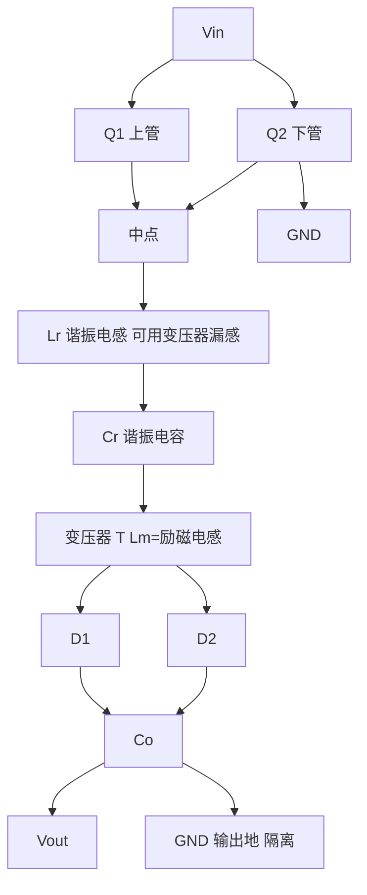
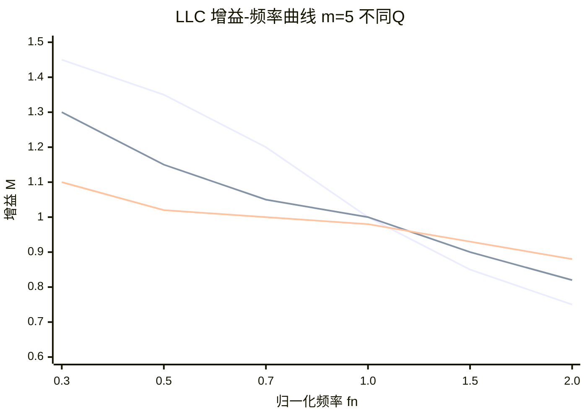
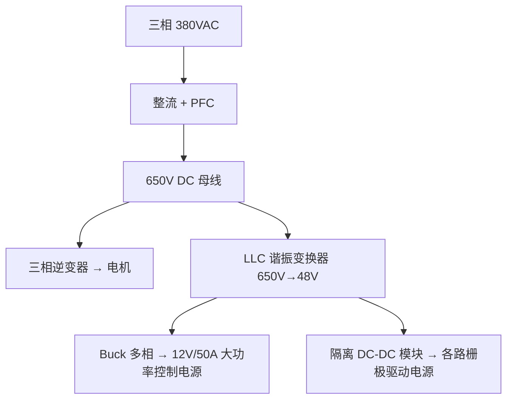

# PP-03: 半桥与全桥 LLC 谐振变换器

**副标题：从硬开关到软开关——高效谐振功率变换的设计艺术**

**难度：** ★★★★★

---

## 1. 📌 核心摘要 ★★★★★ 🔰📚

**一句话讲清楚**：LLC 谐振变换器利用谐振电感（Lr）、谐振电容（Cr）和励磁电感（Lm）组成谐振网络，通过调节开关频率（而非占空比）来控制输出电压。其核心优势是原边 MOSFET 零电压开通（ZVS）和副边二极管零电流关断（ZCS），在满载时实现 > 95% 的效率。在大功率电机驱动辅助电源（> 500W 隔离 DC-DC）和高功率密度充电模块中，LLC 是首选拓扑。

**认知挂钩**：很多工程师以为"LLC 就是调频率控制输出电压，很简单"，**这是对谐振变换器最危险的误解！** LLC 的增益曲线、频率工作区间选择（感性区 vs 容性区）、空载稳压能力、短路保护特性——每个特性都隐藏着陷阱。错误设计的 LLC 可能在轻载时进入容性区导致 MOSFET 硬开关烧毁，或在短路时因为增益上翘而输出电流失控。

**与电机控制的关联**：
- 🔗 **大功率电机驱动辅助电源**：> 500W 的隔离 DC-DC 模块，LLC 效率远超 Flyback（95% vs 85%）
- 🔗 **车载充电机（OBC）**：电动汽车电机驱动系统的电池充电模块，LLC 是主流拓扑
- 🔗 **高效率隔离供电**：需要高效率、低 EMI 的隔离辅助电源场景
- 🔗 **与电机 FOC 的类比**：LLC 的频率调制控制本质上类似电机控制的 V/f 控制，增益曲线设计类似弱磁控制策略

---

## 2. 🤔 问题引入 ★★★★★ 🔰

### 工程师的真实困惑

**场景1：空载电压失控**
```
工程师A:"LLC 满载 48V 输出稳定，但空载时电压飙升到 65V，
输出电容耐压只有 63V，几乎炸电容..."
问题现象:
- 空载和轻载时输出电压远高于设定值
- 最高开关频率已经到了但输出仍降不下来
- 想在输出加假负载但发热严重
```

**场景2：MOSFET 莫名烧毁（容性区工作）**
```
工程师B:"LLC 带轻载时 MOSFET 温度正常，一带重载就烧上管..."
问题现象:
- 电流波形畸变，不是标准正弦波
- 上管关断时 DS 电压还在高位（硬关断！）
- ZVS 丢失
```

**场景3：短路保护失效**
```
工程师C:"LLC 输出短路时，按理说电流应该被限制，
但实测输出电流反而比满载还大，烧了同步整流 MOS..."
问题现象:
- 短路时电流失控
- 变换器发出尖锐啸叫
```

### 核心问题

这些问题的根因是什么？

**答案**：不理解 LLC 的增益-频率特性曲线和三个工作区间（感性区 ZVS、容性区 ZCS/硬开关、禁区）！

- 空载电压失控 → 增益曲线在轻载时上翘，最小增益不够低
- MOSFET 烧毁 → 工作在容性区，ZVS 丢失，开关损耗骤增
- 短路电流失控 → 短路时频率降到谐振点，增益急剧上升

### 学习目标

读完本模块，你将能够：

✅ **理解 LLC 谐振网络结构** - Lr, Lm, Cr 的物理含义和两个谐振频率
✅ **分析增益-频率曲线** - fr1, fr2, 感性区/容性区边界
✅ **掌握 ZVS/ZCS 条件** - 为什么感性区实现 ZVS
✅ **设计 LLC 关键参数** - m = Lm/Lr, Q 因子, 匝比 n
✅ **理解 Burst Mode 轻载策略** - 解决空载稳压问题
✅ **将 LLC 用于电机驱动** - 大功率隔离电源设计

---

## 3. 💡 直观理解 ★★★★★ 🔰💡

### 类比1：LLC 就像"荡秋千"

```
荡秋千原理：
  在秋千到达最高点时推一把（输入能量）
  → 利用秋千的惯性（谐振）自然摆动
  → 每次推的时机决定了秋千摆动的幅度

LLC 类似：
  MOSFET 在谐振电流过零点附近开关
  → 利用谐振网络的"惯性"传递能量
  → 改变开关频率（推的节奏）改变输出电压
  
  谐振频率 = 秋千的自然摆动频率
  开关频率 > 谐振频率 → 振幅减小（降压）
  开关频率 < 谐振频率 → 振幅增大（升压）
```

### 类比2：硬开关 vs 软开关——"汽车撞击 vs 列车连挂"

```
硬开关（如 Buck）：
  就像两辆汽车直接撞击连接
  → 碰撞瞬间能量以热和噪音释放（开关损耗！）
  
软开关（LLC ZVS）：
  就像列车连挂——两车速度同步后轻轻接触
  → 无碰撞，无能量损失
  → 这就是 ZVS（Zero Voltage Switching）！
```

### 类比3：LLC 增益曲线就像"带通滤波器的响应"

```
串联 RLC 谐振 → 在谐振频率处输出最大
LLC 谐振网络 → 附加了 Lm 的并联谐振，形成两个谐振峰

增益曲线形状：
        ↑ 增益
    1.2 |    ●----___
    1.0 |   /        -──
    0.8 |  /            -──
    0.6 |_/                ────
        └────────────────────→ f
           fr2    fr1
           
  fr1 处（Lr+Cr 串联谐振）：增益很高（升压区）
  fr1 右侧：增益随频率升高而降低（降压区）
  fr2 处（Lr+Lm+Cr 谐振）：增益陡降的拐点
```

### 关键概念速查

| 参数 | 符号 | 物理含义 | 典型值 |
|------|------|---------|--------|
| 谐振频率 1 | $$f_{r1}=\frac{1}{2\pi\sqrt{L_r C_r}}$$ | Lr 与 Cr 串联谐振 | 100~300kHz |
| 谐振频率 2 | $$f_{r2}=\frac{1}{2\pi\sqrt{(L_r+L_m)C_r}}$$ | Lr+Lm 与 Cr 谐振 | 30~100kHz |
| 电感比 | $$m = L_m/L_r$$ | 决定增益范围和频率范围 | 3~8 |
| 品质因数 | $$Q = \frac{\sqrt{L_r/C_r}}{R_{ac}}$$ | 影响增益曲线形状 | 0.2~1.0 |
| 等效负载 | $$R_{ac} = \frac{8n^2}{\pi^2}R_{load}$$ | 负载在谐振网络中的等效 | 随负载变化 |

---

## 4. 🔬 技术原理 ★★★★★ 📚

### 4.1 LLC 谐振网络结构

#### 4.1.1 半桥 LLC 基本拓扑



**关键特征**：
- Lr 和 Cr 串联谐振确定 fr1
- Lm 在初级电压被次级钳位时退出谐振（仅 Lr+Cr 参与）
- Lm 在次级电流断续时加入谐振（Lr+Lm+Cr）→ fr2

#### 4.1.2 两个谐振频率的物理含义

**fr1（串联谐振频率）**——Lr 和 Cr 谐振：
$$
f_{r1} = \frac{1}{2\pi\sqrt{L_r C_r}}
$$

此时 LLC 网络阻抗最小（仅剩等效串联电阻），增益接近 1（理想变压器）。

**fr2（并联谐振频率）**——Lr+Lm 和 Cr 谐振（Lm 加入）：
$$
f_{r2} = \frac{1}{2\pi\sqrt{(L_r + L_m)C_r}}
$$

此时增益曲线陡降，是升压区和降压区的分界。

Lm 何时参与谐振？→ 当次级二极管断续时（励磁电流 = 反射到初级的负载电流 → 变压器初级电压不再被次级钳位 → Lm 上的电压开始变化 → Lm 参与谐振）

---

### 4.2 增益-频率特性

#### 4.2.1 增益曲线的三个区域

LLC 的归一化电压增益（DC 增益）：
$$
M(f_n, m, Q) = \frac{1}{\sqrt{\left(1 + \frac{1}{m} - \frac{1}{m \cdot f_n^2}\right)^2 + Q^2 \cdot \left(f_n - \frac{1}{f_n}\right)^2}}
$$

其中 $$f_n = f_s/f_{r1}$$（归一化频率）。



Zone1 (fn < fr2/fr1): 容性区 → ZCS 工作，MOSFET 硬开关 ❌
Zone2 (fr2/fr1 < fn < 1): 感性区升压 → ZVS 工作 ✅
Zone3 (fn > 1): 感性区降压 → ZVS 工作 ✅

**关键规则**：
1. **永远不要工作在 Zone1（容性区）！** → MOSFET 硬开关，开关损耗巨大
2. **Zone2（升压区）**：增益 > 1，适合低压输入时提升输出
3. **Zone3（降压区）**：增益 < 1，适合正常电压和轻载

#### 4.2.2 Q 值对增益的影响

**轻载（Q 小）** → 增益曲线高而尖 → 空载时最小增益接近 1/(1+1/m)，不够低 → 空载电压偏高！

**重载（Q 大）** → 增益曲线扁平 → 最大增益降低 → 可能无法在低压输入时维持输出！

**设计要点**：Q 必须在全负载范围内折中。

#### 4.2.3 最大增益与最小增益约束

**最大增益要求**（最低输入电压 + 满载时需维持输出）：
$$
M_{max} = \frac{n \cdot V_{out}}{V_{in\_min}/2} \quad (\text{半桥})
$$

**最小增益要求**（最高输入电压 + 空载时需限制输出）：
$$
M_{min} = \frac{n \cdot V_{out}}{V_{in\_max}/2}
$$

**LLC 必须满足**：
- 最大增益 > M_max（在允许的最低频率下）
- 最小增益 < M_min（在允许的最高频率下）
- 并且在所有负载条件下都工作在感性区（ZVS）！

---

### 4.3 ZVS 与 ZCS 条件

#### 4.3.1 零电压开通（ZVS）条件

ZVS 意味着 MOSFET 在开通前，其 DS 电压已经谐振到零（或接近零）。

**ZVS 的必要条件**：
1. 工作在感性区（开关频率 > fr2）：谐振网络呈感性 → 电流滞后电压 → MOSFET 关断后有足够的续流电流对 Coss 充放电
2. 死区时间内有足够的励磁电流来完成 Coss 充放电：
   $$
   I_{m\_pk} \cdot t_{dead} \geq 2 \cdot C_{oss} \cdot V_{in}
   $$
   其中 $$I_{m\_pk} = \frac{n \cdot V_{out}}{4 \cdot L_m \cdot f_s}$$


#### 4.3.2 零电流关断（ZCS）条件

ZCS 对副边整流二极管（或同步整流 MOSFET）：

当 $$f_s < f_{r1}$$ 时，副边二极管电流自然降到零后才关断 → 无反向恢复损耗。

当 $$f_s \geq f_{r1}$$ 时，副边二极管电流在关断前还未到零 → 强制关断 → 反向恢复损耗。

**这就是为什么最优工作点通常在 fr1 附近或在 fr1 以下！**

---

### 4.4 Burst Mode（突发模式）

#### 4.4.1 轻载/空载问题

LLC 在空载时，即使频率升到最高，增益也降不下去（M_min 不够低）→ 输出电压偏高。

**Burst Mode 策略**：
- 间歇工作：工作几个周期 → 停一段时间 → 再工作几个周期
- 相当于用"平均占空比"进一步降低等效增益
- 类似 PWM 调光的"断续供电"思维


等效增益 = M_normal × Ton/(Ton+Toff)

#### 4.4.2 Burst Mode 的设计陷阱

- **音频噪声**：Burst 频率若落入 20Hz~20kHz 会产生可听噪声
- **输出电压纹波增大**：Burst 期间输出电容供负载，电压下降
- **设计 Burst 频率高于 20kHz** 以避免音频噪声

---

### 4.5 全桥 LLC 与相移全桥

#### 4.5.1 全桥 LLC

半桥 LLC 适合 200W~1kW，全桥 LLC 适合 > 1kW。

全桥的电压应力是半桥的一半（每个 MOSFET 承受 Vin 而非 Vin/2），适合高压输入。

#### 4.5.2 相移全桥（Phase-Shifted Full Bridge, PSFB）

当功率 > 2kW 且输入变化范围小时，相移全桥是更优选择：
- 固定频率 50% 占空比（简化变压器设计）
- 通过移相调节有效占空比
- ZVS 通过变压器漏感能量实现
- 缺点：轻载时 ZVS 可能丢失（漏感能量不足）

---

### 4.6 LLC 设计流程

**Step 1: 确定规格**
- Vin_min, Vin_nom, Vin_max
- Vout, Iout_max
- 谐振频率 fr1（如 100kHz）

**Step 2: 计算匝比 n**
$$
n = \frac{V_{in\_nom}/2}{V_{out} + V_F}
$$

**Step 3: 确定 m = Lm/Lr**

| m | 频率范围 | 效率 | 增益范围 |
|---|---------|------|---------|
| 小 (3~4) | 宽（频率需变化大） | 低（励磁电流大） | 宽 |
| 大 (6~8) | 窄（频率变化小） | 高（励磁电流小） | 窄 |

电机驱动辅助电源推荐 m = 5~7。

**Step 4: 确定 Q**

满载时 Q 决定增益曲线的"峰值增益"：
$$
Q_{max} = \frac{0.95}{m \cdot M_{max}} \cdot \sqrt{m + \frac{M_{max}^2}{M_{max}^2 - 1}}
$$

**Step 5: 计算谐振元件**

$$
R_{ac} = \frac{8n^2}{\pi^2} \cdot \frac{V_{out}}{I_{out}}
$$

$$
C_r = \frac{1}{2\pi \cdot f_{r1} \cdot Q \cdot R_{ac}}
$$

$$
L_r = \frac{1}{(2\pi f_{r1})^2 \cdot C_r}
$$

$$
L_m = m \cdot L_r
$$

**Step 6: 验证 ZVS 条件**

检查最小输入电压 + 满载时的死区时间和励磁电流是否足够完成 ZVS。

---

## 5. 🔗 交叉视角 ★★★★★ 💡

### 5.1 LLC → 大功率电机驱动辅助电源架构



对于 > 5kW 的电机驱动，辅助电源本身可能就需要 200~500W。用 Flyback 做到 500W 会非常困难（变压器大、效率低、散热难），LLC 是自然的选择。

### 5.2 LLC → 车载应用

电动汽车的电机驱动系统通常需要车载充电机（OBC），主流架构就是 PFC + LLC：
- PFC 级：将 AC 整流升压到 400V
- LLC 级：隔离降压到电池电压（200~450V）

电机驱动工程师理解 LLC，才能理解整车的电源管理架构。

### 5.3 LLC 的频率控制 ↔ FOC 的 MTPA 控制

| LLC 概念 | FOC 类比 |
|---------|---------|
| 增益曲线 M(f) | 转矩-转速曲线 T(ω) |
| fr1（谐振点） | 额定转速（基速点） |
| 感性区/容性区 | 恒转矩区/弱磁区 |
| 频率调压 | MTPA/MTPV 轨迹 |
| 避开容性区 | 避开过调制区 |

---

## 6. 🎯 工程案例 ★★★★★ 🎯

### 案例1：LLC 空载电压过高——m 值选小了

**项目背景**：
```
应用: 5kW 电机驱动辅助电源 LLC
规格: Vin=380~420VDC, Vout=48V/10A, fr1=120kHz
设计参数: n=4, m=3, Q=0.5
```

**故障现象**：
```
满载 48V 稳定；空载时开关频率已升到 300kHz（2.5×fr1），
但输出电压仍高达 59V，远超 48V×1.1=52.8V 的允许上限。
```

**诊断过程**：
```
空载增益（Q=0 时的理论极限）：
  M_min(Q=0) = 1/(1+1/m) = 1/(1+1/3) = 0.75

实际需要的 M_min：
  n×Vout/(Vin_max/2) = 4×48/(420/2) = 192/210 = 0.914

0.914 > 0.75 → 增益降不下去！
```

**根本原因**：m=3 太小 → 空载最小增益 0.75 不够低 → 即使频率无穷大也降不到需要值。

**解决方案**：
```
方案A: 增大 m 到 6
  M_min(Q=0) = 1/(1+1/6) = 0.857
  仍然不够低...
  
方案B: 增大 m 到 10 + Burst Mode
  M_min(Q=0, m=10) = 0.909 ✅ 接近 0.914
  + Burst Mode 进一步降低等效增益 ✅✅

方案C: 增加匝比 n 到 4.5
  M_min_need = 4.5×48/210 = 1.029 > 1
  → 但 M_max = 4.5×48/(380/2) = 1.14 → 需要增益 > 1 
  → 工作在升压区 ✅ 天然降压趋势
  缺点是满载时需要升压，频率需降到 fr1 以下
```

### 案例2：重载进入容性区烧 MOSFET

**项目背景**：
```
应用: 2kW LLC 车载充电机
规格: Vin=350~420V, Vout=280V, Pout=2kW, fr1=100kHz
设计: n=0.75, m=5, Q=0.8
```

**故障现象**：
```
Vin=350V + 满载 2kW 时上管 MOSFET 温度飙升到 150°C，
几分钟后烧毁。Vin=400V 满载则正常。
```

**诊断过程**：
```
满载 Rload = 280²/2000 = 39.2Ω
Rac = 8×0.75²/π² × 39.2 = 8×0.5625/9.87 × 39.2 = 17.87Ω

Q_full = √(Lr/Cr)/Rac = √(Lr/Cr)/17.87

已知 Q_design = 0.8 → √(Lr/Cr) = 0.8×17.87 = 14.3Ω

M_need(Vin=350) = 0.75×280/(350/2) = 210/175 = 1.2

检查 m=5、Q=0.8 时的峰值增益：
峰值 fn_peak = 1/√(1+m) = 1/√6 ≈ 0.408
M_peak = 1/(Q × |fn_peak - 1/fn_peak|) = 1/(0.8 × 2.043) ≈ 0.612

M_peak = 0.612 << M_need = 1.2 → Q=0.8 的增益根本无法满足需求！
fn=0.55 时实测增益仅 ≈ 0.87，远未达到 1.2。

→ 控制器检测到输出偏低，持续降低开关频率试图提升增益
→ 频率降至 fn < 0.408，进入容性区（Zone1）
→ 容性区 ZVS 丢失，MOSFET 硬开关，开关损耗骤增 → 烧毁！
```

**根本原因**：Q=0.8 设计过大 → 峰值增益仅 0.61，远低于所需 1.2 → 控制器被迫降频进入容性区 → ZVS 丢失 → 硬开关烧 MOSFET。

**解决方案**：
```
方案A: 减小 Lm 以增大励磁电流
  Lm 从 500μH 降到 300μH → Im 增大 1.67 倍
  → 全频段 ZVS 满足 ✅
  代价：励磁电流增加 → 环流损耗增加 → 满载效率降 ~1%

方案B: 增大死区时间
  tdead 从 200ns 增到 350ns → 更多时间完成 Coss 放电
  ✅ 不增加损耗但需确认死区不超过谐振半周期

方案C: 并联 GaN FET（Coss 小）
  更容易实现 ZVS ✅ 但成本高
```

---

## 7. 📝 实践练习

### 练习1：计算题——LLC 谐振参数

LLC 半桥：Vin_nom = 400V，Vout = 48V，Pout = 500W，fr1 = 100kHz，m = 6，Q = 0.4。计算：匝比 n、Rac、Cr、Lr、Lm。

*参考答案：n = (400/2)/(48+0.5) = 200/48.5 ≈ 4.12 → 取 4。Rac = 8×4²/π²×(48²/500) = 128/9.87×4.608 = 59.8Ω。Cr = 1/(2π×100000×0.4×59.8) = 1/(2π×40000×59.8) = 1/15.04e6 = 66.5nF → 68nF。Lr = 1/(4π²×100000²×68e-9) = 1/(394.8e6×68e-9) = 37.3μH。Lm = 6×37.3 = 223.8μH*

### 练习2：计算题——LLC 增益与频率范围

续练习1。Vin = 360~440V，计算：(1) M_max 和 M_min；(2) 所需频率范围（从增益曲线估算）；(3) 验证空载是否需 Burst Mode。

*参考答案：M_max = 4×48/(360/2) = 192/180 = 1.067。M_min = 4×48/(440/2) = 192/220 = 0.873。m=6时 M_min(Q=0)=1/(1+1/6)=0.857 < 0.873 → 空载需 Burst Mode（增益不够低）。M_max=1.067 → fn≈0.9；M_min=0.873 → fn≈1.8。频率范围：90kHz~180kHz*

### 练习3：设计题——ZVS 条件验证

LLC：Vin = 350V, n = 4, Vout = 48V, Lm = 220μH, fs_min = 80kHz, Coss(MOSFET) = 200pF, tdead = 250ns。验证 ZVS。

*参考答案：Im_pk = n×Vout/(4×Lm×fs) = 4×48/(4×220e-6×80000) = 192/70.4 = 2.727A。所需电荷：Qreq = 2×Coss×Vin = 2×200e-12×350 = 140nC。死区可提供电荷：Iav = Im_pk×(2/π) ≈ 1.736A, Qprovided = 1.736×250e-9 = 434nC > 140nC ✅。ZVS 满足*

### 练习4：诊断题——LLC 短路电流失控

某 LLC：半桥 400V→48V/20A，短路时频率降到 40kHz（远低于 fr1=100kHz），输出电流达到 80A（4 倍额定！），烧毁同步整流 MOSFET。分析原因。

*参考答案：短路 → 输出等效电阻极小（Rload≈0）→ Q 极大 → 增益曲线在 fr1 处有一个很高且很尖的谐振峰。当频率降到 ≈fr1 附近时，增益急剧增大 → 输出电压虽低但输出电流 = Vin/Max/(n×Zout) → 因 n×Vout 钳位被短路打破，谐振网络以极低阻抗向短路负载输送能量 → 电流失控。解决方案：(a) 硬件逐周期过流保护独立于频率控制；(b) 短路时强制提高频率（而非降低）；(c) 使用打嗝模式（Hiccup Mode）周期性关断重试*

### 练习5：选择题

**题目1**：LLC 工作在哪个区域能实现 ZVS？
- A. 容性区（fn < fr2/fr1）  B. 感性区（fn > fr2/fr1）  C. 谐振点（fn = 1）  D. 所有区域

> 答案：B（感性区电流滞后电压，关断后有续流完成 Coss 放电）

**题目2**：m = Lm/Lr 越大，LLC 的特性如何？
- A. 频率调节范围越宽  B. 最大增益越高  C. 轻载最小增益越低  D. 励磁电流越大

> 答案：C（m 越大 → fr2 越低 → 增益曲线在 fn > 1 区间的斜率越大 → M_min 越低）

**题目3**：Burst Mode 的作用是？
- A. 提高满载效率  B. 解决空载/轻载输出偏高  C. 提高短路能力  D. 提高最大增益

> 答案：B（通过间歇工作降低等效增益）

**题目4**：LLC 半桥的输入电压利用率是？
- A. Vin  B. Vin/2  C. Vin/4  D. 2×Vin

> 答案：B（半桥中点电压在 0 和 Vin 之间切换，变压器初级方波幅值为 Vin/2）

**题目5**：判断以下哪种情况会丢失 ZVS？
- A. 增大死区时间  B. 增大 Lm  C. 降低开关频率（在感性区）  D. 减轻负载

> 答案：B（Lm 增大 → 励磁电流减小 → Coss 放电不足 → ZVS 丢失）

---

**文档信息**：
- 模块编号：PP-03
- 知识体系：功率变换
- 模块名称：半桥与全桥 LLC 谐振变换器
- 电机关联：大功率驱动辅助电源、车载充电机、高效率隔离供电