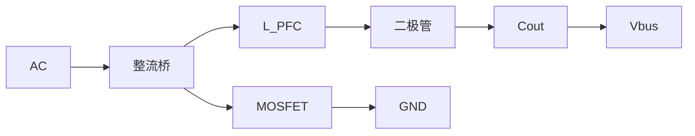
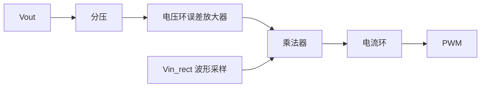
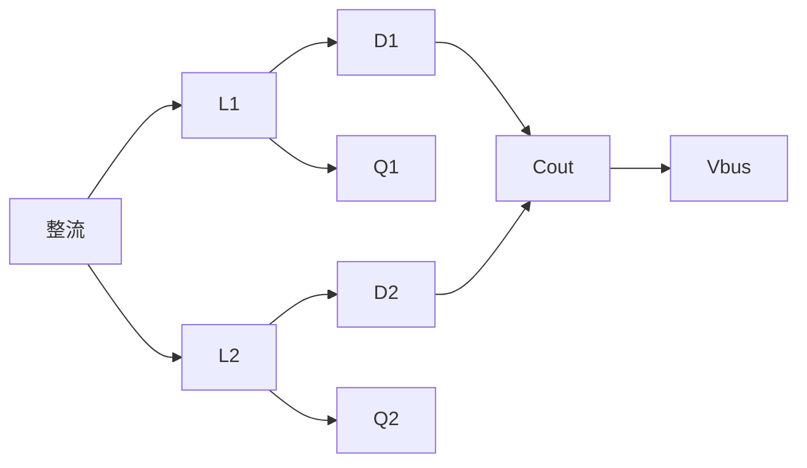
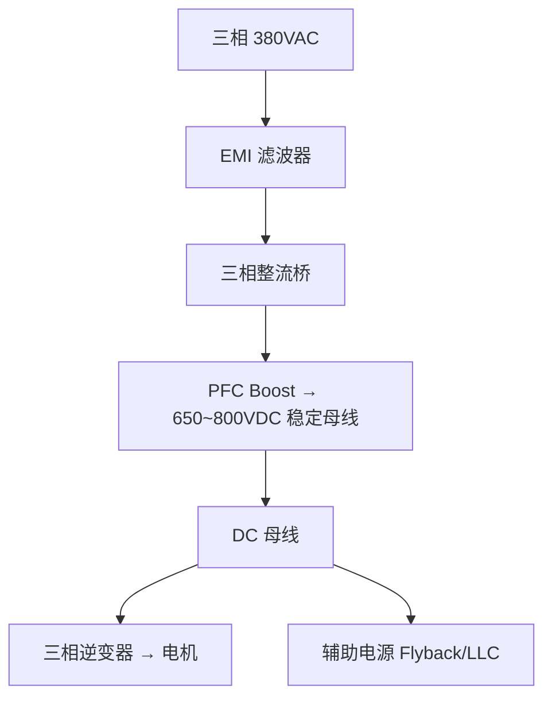

# PP-04: 功率因数校正（PFC）

**副标题：从谐波污染到绿色电网——电机驱动输入级的设计哲学**

**难度：** ★★★★☆

---

## 1. 📌 核心摘要 ★★★★☆ 🔰📚

**一句话讲清楚**：功率因数校正（PFC）通过在整流桥后增加 Boost 变换器，强制输入电流跟踪输入电压波形（正弦波），使功率因数 PF → 1。Boost PFC 是电机驱动输入级的标准拓扑——整流桥 + PFC + 大电解电容构成 AC→DC 变换链路。IEC 61000-3-2 规定 > 75W 的设备必须满足谐波电流限制，这意味着几乎所有电机驱动器都需要 PFC。

**认知挂钩**：很多工程师以为"PFC 就是一个 Boost 升压电路，照抄 demo board 就行"，**但 PFC 的控制策略、电感设计、EMI 特性与传统 DC-DC 完全不同！** 传统 Boost 的负载是电阻，PFC Boost 的"负载"是 100Hz 脉动的整流电压——这导致 RHPZ 频率在 100Hz 周期内剧烈变化，电压环路设计必须比传统 Boost 慢 10~100 倍。

**与电机控制的关联**：
- 🔗 **电机驱动输入级**：AC → 整流 → PFC → 逆变器，是完整电机驱动系统的第一级
- 🔗 **母线电压稳定性**：PFC 产生稳定的 400V 母线（310V 整流直接滤波只有 ~310V 且随负载跌落）
- 🔗 **电磁兼容（EMC）**：PFC 降低输入电流谐波，大幅减轻 EMI 滤波器负担
- 🔗 **制动能量回馈**：有源前端（AFE）是双向 PFC，可将制动能量回馈电网

---

## 2. 🤔 问题引入 ★★★★☆ 🔰

### 工程师的真实困惑

**场景1：PFC 不工作，谐波超标**
```
工程师A:"按芯片 datasheet 做了 PFC 电路，
但实测 PF 只有 0.7，THD 高达 40%...
更奇怪的是 PFC 芯片根本没在 switching..."
问题现象:
- 输入电流波形还是脉冲状（跟没有 PFC 一样）
- 母线电压只有 310V（而非设定的 400V）
- 芯片的 gate 脚没有 PWM 输出
```

**场景2：PFC 电感啸叫**
```
工程师B:"PFC 满载时电感发出刺耳啸叫声，
轻载时声音消失..."
问题现象:
- 啸叫频率约 5~8kHz
- 电感温度正常，但噪声让人无法接受
- 示波器看电流波形有低频包络振荡
```

**场景3：PFC 轻载过压**
```
工程师C:"PFC 空载时输出电压慢慢爬升，
400V 设定值，实际爬到 450V 触发过压保护..."
问题现象:
- 空载和极轻载时电压失控
- 一旦加 10W 以上负载就正常
- 输出电容耐压 450V，在保护边缘反复触发
```

### 核心问题

- PFC 不工作 → 不理解 PFC 的启动条件和输入电压检测
- 电感啸叫 → 电压环路不稳定，低频振荡调制了电感电流
- 轻载过压 → PFC 最小占空比/最小导通时间限制 + 空载无法消耗 Boost 储存的能量

### 学习目标

读完本模块，你将能够：

✅ **理解功率因数的物理含义** - PF、THD、位移因数、畸变因数
✅ **掌握 Boost PFC 工作原理** - CCM/DCM/CrM 平均电流模式控制
✅ **计算 PFC 电感** - 最大纹波电流、磁芯选型
✅ **理解 PFC 电压环的特殊性** - 极低带宽（10~20Hz）的原因
✅ **了解 IEC 61000-3-2 谐波限值** - 对电机驱动的实际影响
✅ **将 PFC 整合到电机驱动系统** - 完整输入级设计

---

## 3. 💡 直观理解 ★★★★☆ 🔰💡

### 类比1：无 PFC 就像"大口喝饮料"

```
二极管整流 + 大电容滤波：
  交流电压高于电容电压 → 二极管导通 → 大电流脉冲充电
  → 电流波形是窄脉冲（不是正弦波！）
  → 就像大口猛喝饮料，喝一下停很久
  
  功率因数 ≈ 0.5~0.7
  电流谐波严重！
```

### 类比2：有 PFC 就像"用吸管匀速喝"

```
整流 + PFC Boost：
  PFC 强制输入电流跟随输入电压波形
  → 电流波形是正弦波（与电压同相位）
  → 就像用吸管匀速小口喝
  
  功率因数 → 1.0
  电流谐波极小！
```

### 关键概念速查

| 参数 | 公式 | 物理含义 |
|------|------|---------|
| 功率因数 PF | $$PF = \frac{P}{S} = \frac{P}{V_{rms} \cdot I_{rms}}$$ | 有功功率与视在功率之比 |
| 总谐波失真 THD | $$THD = \frac{\sqrt{\sum I_{n}^2}}{I_1}$$ | 谐波含量占比 |
| 位移因数 DPF | $$DPF = \cos\phi$$ | 基波电压与基波电流的相位差 |
| PF 与 THD 关系 | $$PF = \frac{DPF}{\sqrt{1+THD^2}}$$ | DPF=1 时 PF ≈ 1/√(1+THD²) |

---

## 4. 🔬 技术原理 ★★★★☆ 📚

### 4.1 为什么要 PFC？

#### 4.1.1 无 PFC 的二极管整流

典型电机驱动器输入级：


问题：整流桥只有在交流电压 > 电容电压时才导通。导通角很小（约 30~60°），电流波形是窄而高的脉冲：

```
电压：  ┌─┐     ┌─┐     ┌─┐   (正弦波)
       /   \   /   \   /   \
      /     \_/     \_/     \
     
电流：  ││      ││      ││     (窄脉冲！)
       ││      ││      ││
```

**后果**：
- PF ≈ 0.5~0.7
- 电流谐波严重（3rd: 70%, 5th: 40%, 7th: 25%）
- 对电网造成谐波污染
- 中性线电流过大（3 次谐波叠加）

#### 4.1.2 IEC 61000-3-2 谐波限制

| 谐波次数 | Class A (A) | Class D (mA/W) |
|---------|------------|----------------|
| 3 | 2.30 | 3.4 |
| 5 | 1.14 | 1.9 |
| 7 | 0.77 | 1.0 |
| 9 | 0.40 | 0.5 |
| 11 | 0.33 | 0.35 |
| 13 | 0.21 | 0.296 |

**电机驱动属于 Class A 设备（三相设备）或 Class D（单相 < 600W）。** > 75W 必须满足谐波限制 → 必须加 PFC！

---

### 4.2 Boost PFC 工作原理

#### 4.2.1 基本拓扑



**关键点**：
1. 整流后的电压是 |sin(ωt)| 波形（100Hz 馒头波）
2. PFC 控制器让电感平均电流跟踪整流电压的馒头波形
3. 输出电压（400V）高于输入馒头波的峰值（311V）

#### 4.2.2 平均电流模式控制（最常用）



**这是一种"电流跟随电压"的策略**——电流内环迫使电感电流跟踪来自乘法器的正弦基准。

#### 4.2.3 电压环的特殊性——为什么这么慢？

传统 Boost 的电压环穿越频率可以到 1~2kHz，但 PFC 的电压环穿越频率通常在 **10~20Hz**！

**原因**：
1. **输出有 100Hz 纹波**：单相 PFC 的输出电压有 100Hz（或 120Hz）纹波（输入功率 = 恒定功率 + 2倍工频脉动功率）。如果电压环太快，会试图纠正这 100Hz 纹波 → 电流基准被 100Hz 调制 → 输入电流畸变 → PF 恶化！
2. **RHPZ 变化剧烈**：在一个 100Hz 周期内，等效负载从 0（过零点）到满载（峰值）变化 → RHPZ 频率从极低到高变化 → 电压环在最恶劣的过零点附近必须稳定
3. **乘法器输出失真**：电压环输出纹波直接调制电流基准的幅度

**结论**：PFC 电压环的穿越频率必须远低于 100Hz（典型设计 fc ≈ 10~20Hz），以抑制输出纹波对电流基准的调制。

---

### 4.3 CCM vs CrM vs DCM PFC

| 模式 | 功率范围 | 开关频率 | 电感尺寸 | EMI | 控制复杂度 |
|------|---------|---------|---------|-----|-----------|
| CCM | > 300W | 固定 | 大 | 中等 | 高（需乘法器） |
| CrM/BCM | 100~500W | 可变 | 中等 | 较差（变频） | 中等 |
| DCM | < 200W | 固定 | 最小 | 差（高峰值） | 低（恒导通时间） |

**CCM PFC**：电感电流始终 > 0，适合大功率。需要精确的乘法器和电流采样。
**CrM（临界模式）PFC**：电感电流刚好到零即开始下一周期，变频工作。轻载时频率极高 → 效率下降。
**DCM PFC**：电感电流完全断续，恒导通时间控制。简单但峰值电流高。

#### 对于电机驱动：

| 电机功率 | 推荐 PFC 模式 |
|---------|-------------|
| < 500W | DCM 或 CrM（单级） |
| 500W~3kW | CCM（单相） |
| 3~10kW | CCM 交错并联（两相 180° 交错） |
| > 10kW | 三相 PFC 或 Vienna 整流器 |

---

### 4.4 PFC 电感设计

#### 4.4.1 CCM PFC 电感

最恶劣工况：最低输入电压 + 满载（Boost 占空比最大，纹波最大）

$$
D = 1 - \frac{V_{in\_pk} \cdot |\sin(\omega t)|}{V_{out}}
$$

最大纹波发生在 $$V_{in\_pk} \cdot |\sin(\omega t)| = V_{out}/2$$ 时，此时 D = 0.5：

$$
\Delta I_{L\_max} = \frac{V_{out}}{4 \cdot f_s \cdot L}
$$

取纹波率 r = 0.2~0.3（满载峰值）：
$$
L = \frac{V_{out} \cdot D_{max} \cdot (1-D_{max})}{r \cdot I_{L\_pk\_max} \cdot f_s}
$$

其中 $$I_{L\_pk\_max} = \frac{\sqrt{2} \cdot P_{out}}{\eta \cdot V_{in\_rms\_min}}$$

#### 4.4.2 磁芯选型

PFC 电感有大的 DC 偏置（电感平均电流 + 纹波峰值），推荐：
1. **铁硅铝（Kool Mμ / Sendust）** 磁环：直流偏置特性好，分布式气隙
2. **铁氧体 + 气隙**：成本低，但气隙处有扩散磁通（fringing flux），可能引起绕组局部过热

---

### 4.5 交错并联 PFC

对于 > 1kW 的电机驱动，交错并联 PFC（Interleaved PFC）是主流：



**两相 180° 交错的好处**：
- 输入电流纹波频率加倍（有效 2×fs）→ EMI 滤波更容易
- 输入电流纹波幅度减半
- 输出电容纹波电流大幅降低
- 热源分散，便于散热设计
- 每相功率减半 → 电感更小、MOSFET 电流应力更低

---

## 5. 🔗 交叉视角 ★★★★☆ 💡

### 5.1 PFC 在电机驱动系统中的位置



**没有 PFC**：母线电压只在 480~540V（380VAC 整流峰值），且随负载变化剧烈波动。满载时可能跌到 450V，严重影响电机转速范围（反电动势限制）。

**有 PFC**：
- 母线稳定在 650~800V（设计选择）
- 更高的母线电压 → 电机弱磁范围更宽 → 更宽的恒功率区
- 输入电流谐波满足标准

### 5.2 PFC 母线电压 vs 电机驱动性能

| 母线电压 | 优势 | 劣势 |
|---------|------|------|
| 400V | 开关损耗低，MOSFET/IGBT 便宜 | 弱磁范围受限 |
| 650V | 标准工业驱动选择 | SiC MOSFET 成本高 |
| 800V | 宽弱磁范围，适合高速电机 | 需要 SiC，成本最高 |

### 5.3 有源前端（AFE）——双向 PFC

有源前端（Active Front End）是双向 PFC——不仅能将 AC 转换为 DC（整流模式），还能将 DC 转换为 AC（逆变/回馈模式）。

**电机驱动中的应用**：
- 电机制动时，动能 → 电能回馈电网（而非通过制动电阻发热浪费）
- 四象限运行（电动/发电正反转）

AFE 的核心就是 PWM 整流器——拓扑与三相逆变器完全相同，但控制目标是输入电流正弦 + 单位功率因数！

### 5.4 与硬件模块的关联

> 📎 **交叉引用**：
> - PFC 升压电感与母线预充电限流电感的磁设计共通 → [HW-06 电源管理与保护](../hardware/HW-06-Power-Management-Protection.md#4-技术原理)
> - IEC 61000-3-2 谐波限值是电机驱动 >75W 必须加 PFC 的法规依据 → [HW-06 EMI 滤波设计](../hardware/HW-06-Power-Management-Protection.md#6-工程案例)
> - PFC 电压环（10~20Hz）与电机母线电压环的相似性 → [HW-06 母线电压控制](../hardware/HW-06-Power-Management-Protection.md#4-技术原理)

---

## 6. 🎯 工程案例 ★★★★★ 🎯

### 案例1：PFC 不启动——欠压锁定（UVLO）陷阱

**项目背景**：
```
应用: 3kW 电机驱动 PFC
芯片: UCC28180 (CCM PFC 控制器)
设计: 220VAC → 400VDC
```

**故障现象**：
```
上电后 PFC 不工作，Vbus 只有 310V（整流滤波值）。
VCC 供电正常（15V），但 GATE 脚无输出。
```

**诊断过程**：
```
步骤1: 检查 VCC → 15V 正常
步骤2: 检查 VINS（输入电压检测）→ 正常
步骤3: 检查 VSENSE（输出电压检测）→ 只有 1.2V
  VSENSE 分压比：Rupper = 4MΩ, Rlower = 20kΩ
  310V × 20k/(4000k+20k) = 1.54V，但实测 1.2V？？
  
步骤4: 发现 Rupper 用了 4 个 1MΩ 0805 电阻串联，
  但 1MΩ 0805 的耐压只有 150V！
  310V 加到 4 个 1MΩ → 每个承受 ~77.5V，OK
  但 400V 时每个承受 100V，功率 100²/1M = 10mW，OK
  问题不在这里...

步骤5: 检查 EN（使能）引脚 → 发现连接到 UVLO 外部电路
  UVLO 阈值 = Vin_ac > 85VAC 启动，< 70VAC 关断
  实测 Vin_ac = 220V → 远超阈值
  
步骤6: 终于发现问题——COMP 引脚（电压环补偿）被外部钳位电路拉低！
  上电时 COMP 被拉低 → 乘法器输出 0 → 电流基准 0 → 不输出 PWM
  这个钳位本意是"上电时不让 PFC 立即启动，等 VCC 稳定"
  但钳位解除电路用了 RC 延时，VCC 上电太快 → 时序错误
```

**根本原因**：上电时序设计错误——COMP 钳位电路在 VCC 建立后仍处于施加状态。

**解决方案**：
```
将 COMP 钳位的释放条件改为 VCC > 12V AND Vbus > 250V
→ 这样确保 PFC 启动时输入和输出都处于合理状态 ✅
```

### 案例2：PFC 电感啸叫——电压环低频振荡

**项目背景**：
```
应用: 1.5kW 电机驱动 PFC
芯片: NCP1654 (CCM PFC)
fs = 65kHz, L = 500μH, Cout = 680μF
电压环: Rcomp = 47kΩ, Ccomp = 100nF, Cp = 10nF
```

**故障现象**：满载时电感发出 5kHz 的刺耳啸叫，轻载无声。

**诊断过程**：
```
计算电压环穿越频率：
  Pout=1500W, Vout=400V, Rload=400²/1500=106.7Ω
  PFC 功率级传递函数：
    Gvc(s) ≈ (I_L_pk × Z_out) / (2 × Vout × C × s)
    ≈ (5.3 × 106.7) / (2 × 400 × 680e-6 × s)
    ≈ 565 / (0.544 × s)
    |Gvc| = 1 时 f = 565/(0.544×2π) = 165Hz

  补偿器极点由 Rcomp × Ccomp 决定：
    fp = 1/(2π × 47k × 100nF) = 33.9Hz
  
  → 穿越频率约 33Hz（太高！应该 < 20Hz）
  
  100Hz 输出纹波 → 电压环在 33Hz 处有增益 → 
  试图纠正 100Hz 纹波 → 电流基准被调制 → 
  调制频率 = 100 - 33 = 67Hz，但乘法器混频后...
  实际表现为 5kHz 的包络 → 这是开关频率和电压环振荡频率的拍频！
```

**根本原因**：电压环穿越频率 33Hz 太高 → 放大 100Hz 输出纹波 → 引起电流基准的低频振荡 → 调制开关波形 → 人耳可听的拍频噪声。

**解决方案**：
```
方案A: 降低穿越频率到 15Hz
  Ccomp = 220nF → fp = 1/(2π×47k×220nF) = 15.4Hz ✅
  代价：负载响应更慢（但对 PFC 可接受）

方案B: 在补偿网络中加 100Hz 陷波滤波器 ✅✅
  在电压反馈路径加 100Hz notch filter
  → 消除 100Hz 纹波对电压环的调制
  → 可以保持较高带宽而不引起振荡
```

---

## 7. 📝 实践练习

### 练习1：计算题——PFC 功率因数

某电机驱动输入级：Vin = 220VAC，Iin = 10A（有效值），PF = 1 时。若实测 Iin_rms = 12A，THD = 41.7%。计算：(1) 位移因数（假设为 1）；(2) 功率因数 PF；(3) 视在功率和谐波造成的额外损耗。

*参考答案：PF = DPF/√(1+THD²) = 1/√(1+0.417²) = 1/√1.174 = 0.923。S = 220×12 = 2640VA，P = 220×10 = 2200W。谐波功率损耗 = S² - P² 的转换损耗。输入电流增大 20%（12A vs 10A）→ 线路损耗增大 44%（P_loss ∝ I²_rms）*

### 练习2：计算题——PFC Boost 电感

CCM PFC：Vin_rms = 220V ± 15%，Vout = 400V，Pout = 2kW，fs = 65kHz，η = 0.95，纹波率 r = 0.25。计算：(1) 最低输入时的 Iin_pk_max；(2) 最恶劣纹波时的占空比；(3) PFC 电感值 L。

*参考答案：Iin_pk_max = √2×2000/(0.95×220×0.85) = 2828/(177.7) = 15.91A。最恶劣 D：Vrect_peak = 220×0.85×√2 = 264V。D_max_worst = 1 - 264/2/400... 等。D_max@Vrect_min_min=1−264/400=0.34，D_max@Vrect_half=1−200/400=0.5。D=0.5 时 ΔIL_max=Vout/(4×fs×L)=400/(4×65000×L)。r=ΔIL/Iin_pk_max=0.25 → ΔIL=3.98A → L=400/(4×65000×3.98)=400/1.034e6=387μH → 选 390μH*

### 练习3：设计题——PFC 电压环补偿

PFC：Pout = 1kW，Vout = 400V，Cout = 470μF。计算：(1) 输出 100Hz 纹波峰峰值；(2) 若电压环 fc = 15Hz，100Hz 纹波被衰减多少 dB？(3) 这种衰减是否足够？

*参考答案：100Hz 纹波：Iout = 1000/400 = 2.5A（直流）。输入功率 = Pout/η ≈ 1053W。输出功率脉动 = ± Pout → 无功功率以 100Hz 在 Cout 充放。ΔV = Pout/(2π×100×Cout×Vout) = 1000/(2π×100×470e-6×400) = 1000/118.1 = 8.47V_pkpk。补偿器在 15Hz 处有 0dB, 100Hz/15Hz=6.67，单极点衰减 = -20×log10(6.67)= -16.5dB → 残留纹波 = 8.47/10^(16.5/20) = 8.47/6.67 = 1.27V → 调制电流基准 1.27/400=0.32% → 可接受 ✅*

### 练习4：诊断题——PFC 空载过压

某 PFC 空载时 Vout 缓慢上升到 430V。已知控制器最小导通时间 ton_min = 500ns，fs = 65kHz，L = 500μH，Vin_pk = 311V。分析过压原因。

*参考答案：ton_min = 500ns → D_min = 0.0325。最小可传输功率 = Vin²×D_min²/(2×L×fs) = 311²×0.0325²/(2×500e-6×65000) = 311²×1.056e-3/65 = 101.9×1.056e-3/0.065 = 1.66W。空载时负载消耗 < 1.66W → 多余能量堆积 → 输出电压升高。解决方案：(a) 在输出加假负载 2W（如 400²/2=80kΩ），但增加待机功耗；(b) 使用 Burst Mode（轻载间歇工作）；(c) 选择支持频率折返（Frequency Foldback）的 PFC 控制器*

### 练习5：选择题

**题目1**：单相 Boost PFC 的输出电压纹波频率是？
- A. 50Hz  B. 100Hz  C. 开关频率  D. 200Hz

> 答案：B（全波整流后脉动功率频率 = 100Hz/120Hz）

**题目2**：PFC 电压环穿越频率通常设计为？
- A. 1~5Hz  B. 10~20Hz  C. 100~200Hz  D. 1~2kHz

> 答案：B（必须远低于 100Hz 以避免放大输出纹波）

**题目3**：以下哪项不是 PFC 的功能？
- A. 提高功率因数  B. 降低输入电流谐波  C. 稳定输出电压  D. 提供隔离

> 答案：D（Boost PFC 是非隔离拓扑）

**题目4**：交错并联 PFC 的主要优势是？
- A. 不需要电感  B. 输入电流纹波减半且频率加倍  C. 输出电压翻倍  D. 省去整流桥

> 答案：B

**题目5**：DCM PFC 通常适用于多大功率？
- A. > 1kW  B. 500W~1kW  C. < 200W  D. 任意功率

> 答案：C（DCM 峰值电流高，大功率时损耗不可接受）

---

**文档信息**：
- 模块编号：PP-04
- 知识体系：功率变换
- 模块名称：功率因数校正（PFC）
- 电机关联：电机驱动输入级、IEC 谐波合规、母线电压稳定性